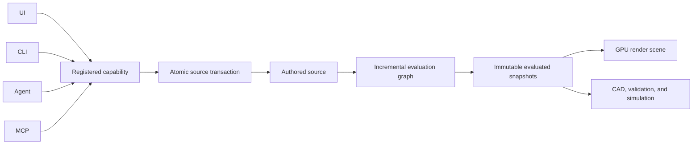
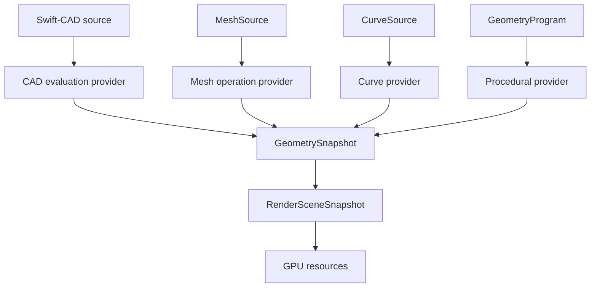
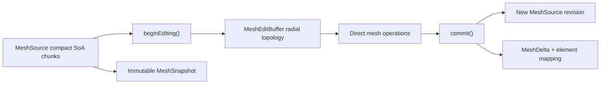
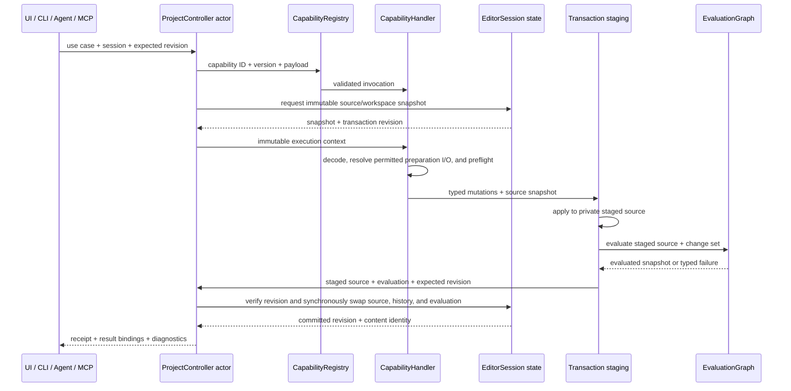
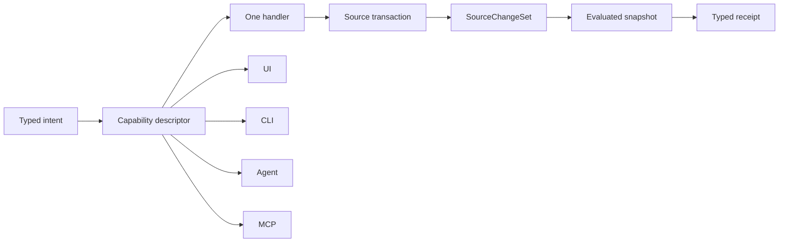

# Universal 3D Architecture

## Status

This document is the normative architecture for expanding Rupa from a CAD-first
editor into a general 3D authoring system. It defines source ownership, module
boundaries, evaluation, extensibility, performance, and execution-surface
contracts. It does not claim that the described capabilities are implemented.

| Field | Value |
|---|---|
| Product | Rupa |
| Architecture scope | Universal 3D authoring foundation |
| Current-code review date | 2026-07-12 |
| Exact CAD kernel | Swift-CAD |
| Package format | `.swcad` |
| Gap inventory | `BLENDER_RUPA_CAPABILITY_GAP.md` |
| Implementation schedule | `UNIVERSAL_3D_IMPLEMENTATION_PLAN.md` |
| Design process | `DESIGN_PROCESS.md` |
| Compatibility policy | Breaking development changes are allowed; obsolete schemas are removed rather than retained as deprecated aliases. |

## 1. Decision Summary

Rupa must reach Blender-class 3D authoring breadth by implementing equivalent
authoring outcomes, not by copying Blender's UI, command names, file format, or
Python API. Exact CAD remains a first-class source kind; it is not replaced by a
mesh-only DCC model.

The architecture is based on six decisions:

1. Separate authored source, evaluated geometry, and render resources.
2. Add source-owned editable mesh and generic geometry attributes outside
   Swift-CAD's tessellation `Mesh`.
3. Evaluate CAD, mesh, curves, procedural graphs, animation, and instances through
   one dependency graph while retaining specialized providers.
4. Replace duplicated command enums and static Agent catalogs with one registered
   capability contract consumed by UI, CLI, Agent, and MCP adapters.
5. Separate object occurrences from reusable object definitions and external asset
   references.
6. Use immutable, structurally shared snapshots and explicit buffer leases so data
   movement is measurable and copies are never hidden behind API convenience.



## 2. Product Equivalence Target

"Blender-class" means that a user or Agent can complete the major stages of a
general 3D workflow without leaving Rupa merely because the document is not a
parametric solid. It does not require one-to-one command parity.

| Outcome family | Required Rupa outcome | Exact Blender parity required? |
|---|---|---|
| Scene assembly | Hierarchies, collections, reusable definitions, linked instances, cameras, lights, worlds, visibility, and overrides | No |
| Direct modeling | Object, vertex, edge, face, curve-point, and control-cage editing with stable selection | No, but equivalent topology outcomes are required |
| Non-destructive modeling | Ordered modifiers, reusable operation graphs, preview/apply, diagnostics, and topology correspondence | No |
| Procedural modeling | Typed node graph, fields, attributes, instances, reusable groups, inspection, and deterministic evaluation | No |
| Appearance | UVs, image resources, material slots, PBR preview, shader graph extension, and color-space metadata | No |
| Deformation and motion | Animatable properties, curves, clips, shape keys, rigs, skinning, constraints, and timeline evaluation | No |
| Sculpt and paint | Brush engine, masks, multiresolution or remesh route, color/weight/texture workflows | Tool-for-tool parity is not required |
| Simulation | Time-dependent state, deterministic caches, bake lifecycle, and solver adapters | Blender's VFX solvers are not sufficient for engineering analysis |
| Rendering | Interactive shaded viewport, camera output, lights, passes, and pluggable production renderers | Cycles implementation parity is not required |
| Assets and exchange | Catalogs, immutable versions, references, local overrides, packing, import/export, and missing-reference recovery | No |
| Automation | The same mutation and query capabilities through Swift API, UI, CLI, Agent, and MCP | Rupa must exceed Blender in typed Agent operation |

The initial release scope in `PRODUCT_REQUIREMENTS.md` may include only a subset.
Conformance manifests decide release completion. This architecture prevents an
initial subset from hard-coding constraints that make later outcomes impossible.

### Explicit Non-goals

- Reproduce Blender's window layout, shortcuts, terminology, or `.blend` schema.
- Preserve current unreleased command or product-metadata schemas.
- Put exact CAD, mesh editing, simulation, rendering, and domain semantics into one
  kernel.
- Treat video editing, motion tracking, or Grease Pencil as prerequisites for the
  universal 3D core profile. They remain valid later capability modules.
- Promise zero copies where a representation, device, process, or lifetime boundary
  requires a conversion. Every unavoidable copy must be visible in telemetry.

## 3. Current Implementation Findings

The following findings are derived from the current source, not from feature-name
comparison alone.

| Current implementation | Finding | Architectural consequence |
|---|---|---|
| `DesignDocument` stores one `CADDocument` plus `ProductMetadata`. | CAD is the only evaluated source aggregate. | Introduce a project model with multiple geometry source libraries while retaining CAD as one source kind. |
| `DesignDocumentProjectBridge` derives `ProjectSourceModel` from CAD and product metadata. | The universal project model can be consumed without importing CAD, but the derivation is currently read-only. | Keep the bridge in the composition root; do not make `RupaProjectModel` or `RupaEvaluation` depend on `RupaCore` or Swift-CAD. |
| `ObjectDescriptor` models `body`, `sketch`, and CAD `FeatureID` references; camera and light contain no real payload. | Scene objects are descriptions of CAD output, not independent reusable data definitions. | Separate scene occurrences, object definitions, and typed content records. |
| `SceneNode` embeds object, material, visibility, transform, and child IDs. | Occurrence, reusable data, hierarchy, and appearance ownership are conflated. | Move reusable content and material slots to `ObjectDefinition`; keep occurrence overrides on `SceneNode`. |
| `SwiftCAD.Mesh` is positions, normals, triangle indices, UVs, colors, and one material. | It is suitable for exchange/tessellation, not editable polygon topology. | Keep it in Swift-CAD and add `RupaGeometry.MeshSource`. |
| `UniversalViewportSceneBuilder` consumes `EvaluatedProjectSnapshot`. | The first universal CPU-side viewport boundary now preserves source identity and world-space bounds. | Renderer resource realization and GPU picking must consume this boundary instead of reconstructing CAD-specific display snapshots. |
| `BodyDisplaySnapshot.Mesh` stores only positions and indices; face/edge/vertex display records copy points. | The display boundary cannot carry generic attributes or source topology efficiently. | Replace it with universal `GeometrySnapshot` and element correspondence. |
| `RupaViewportScene` has only `sketch` and `body` item kinds plus box-like face/edge enums. | Viewport projection is CAD-specific before rendering begins. | Make viewport scene construction consume evaluated scene instances and geometry components. |
| `EvaluationScheduler` exits when CAD has no renderable topology and evaluates only Swift-CAD. | Mesh, camera, light, procedural, and animation source cannot participate. | Add a project dependency graph with injected source providers. |
| `SelectionComponentID` encodes references with string prefixes. | Selection identity is not type-safe and cannot scale to new geometry domains. | Introduce typed stable source element IDs and evaluated element paths. |
| `EditorCommand` has 119 cases; `AutomationCommand` has 127; the static Agent catalog declares 159 capabilities. | Every feature is duplicated across independently maintained surfaces. | Replace all three lists with registered descriptors and typed handlers. |
| `Viewport.swift` is 14,549 lines and `MainView.swift` is 8,029 lines. | Rendering, interaction, editing state, and presentation remain coupled despite helper extraction. | Move render, tool, and editor contracts into dedicated modules before adding broad features. |
| Current material data has base color, metallic, roughness, and opacity only. | It is a useful minimum value model but not a texture or shader system. | Move canonical appearance data to `RupaShading`; adapt CAD material data for exchange. |
| `DomainRegistry` already validates descriptors, effects, parameters, lowering coverage, and merged registrations. | The registry pattern is sound but incorrectly limited to specialized domains. | Generalize the pattern into `RupaCapabilities`; domain registration becomes one provider. |

### Current Code Evidence Index

| Evidence | Current responsibility observed |
|---|---|
| [`DesignDocument.swift`](../RupaKit/Sources/RupaCore/DesignDocument.swift) | Aggregate is `CADDocument` plus modeling settings and `ProductMetadata`. |
| [`ProductMetadata.swift`](../RupaKit/Sources/RupaCore/ProductMetadata.swift) | Scene, components, patterns, materials, validation, export, curves, planes, measurements, views, bindings, and semantic extensions share one type. |
| [`SceneNode.swift`](../RupaKit/Sources/RupaCore/SceneNode.swift) and [`ObjectDescriptor.swift`](../RupaKit/Sources/RupaCore/ObjectDescriptor.swift) | Occurrence, hierarchy, CAD feature reference, material, and object classification are coupled. |
| [`Mesh.swift`](../swift-CAD/Sources/CADIR/Mesh.swift) | Triangle exchange/tessellation arrays, not polygon edit topology. |
| [`BodyDisplaySnapshot.swift`](../RupaKit/Sources/RupaCore/BodyDisplaySnapshot.swift) | Shared position/index storage plus copied CAD topology display records. |
| [`ViewportScene.swift`](../RupaKit/Sources/RupaViewportScene/ViewportScene.swift) and [`ViewportSceneBuilder.swift`](../RupaKit/Sources/RupaViewportScene/ViewportSceneBuilder.swift) | Viewport source projection is specialized to CAD sketches and bodies. |
| [`EvaluationScheduler.swift`](../RupaKit/Sources/RupaCore/EvaluationScheduler.swift) | Project evaluation delegates only to the Swift-CAD document evaluator. |
| [`SelectionComponentID.swift`](../RupaKit/Sources/RupaCore/SelectionComponentID.swift) | Several selection domains are serialized into string prefixes and parsed back. |
| [`EditorCommand.swift`](../RupaKit/Sources/RupaCore/EditorCommand.swift), [`AutomationCommand.swift`](../RupaKit/Sources/RupaAutomation/AutomationCommand.swift), and [`AgentCapabilityCatalog.swift`](../RupaKit/Sources/RupaAgentRuntime/AgentCapabilityCatalog.swift) | Command and discovery surfaces are independently enumerated. |
| [`DomainCapabilityDescriptor.swift`](../RupaKit/Sources/RupaDomainFoundation/DomainCapabilityDescriptor.swift) and [`DomainRegistry.swift`](../RupaKit/Sources/RupaDomainFoundation/DomainRegistry.swift) | Existing descriptor validation and provider registration are reusable design evidence. |
| [`Viewport.swift`](../RupaKit/Sources/RupaRendering/Viewport.swift) and [`MainView.swift`](../RupaKit/Sources/RupaUI/MainView.swift) | Primary views still combine too many rendering, interaction, editor, and presentation responsibilities. |

### Reuse, Migration, and Removal

| Disposition | Existing area |
|---|---|
| Reuse | Swift-CAD exact source, B-rep, persistent topology names, incremental feature evaluation, modeling tolerance, and tessellation. |
| Reuse | Document source/artifact separation, domain ownership contracts, Agent protocol/runtime/transport separation, typed diagnostics, transaction-revision checks, and dependency identities. |
| Generalize | `DomainCapabilityDescriptor`, parameter schemas, lowering coverage, and registry merging into universal capability contracts. |
| Migrate | Components and pattern arrays into reusable definitions, instances, and generic operation stacks. |
| Migrate | Source-owned saved views into the documentation/view-definition library while keeping the active temporary viewport in workspace state; add true camera objects for authored and rendered cameras. |
| Replace | `ProductMetadata`, `ObjectDescriptor`, and `SceneNodeReference` with the project model in Section 6. |
| Replace | String-backed `SelectionComponentID` with typed element references. |
| Replace | `BodyDisplaySnapshot` and CAD-specific `ViewportSceneItemKind` with universal evaluated snapshots. |
| Remove | Giant `EditorCommand` and `AutomationCommand` enums after all call sites use typed command handlers. No compatibility aliases remain. |
| Remove | Static `AgentCapabilityCatalog` after it is generated from the composed capability registry. |

## 4. Representation Boundaries

Three representations are mandatory. No type may silently serve all three roles.

| Representation | Mutable? | Owner | Includes |
|---|---:|---|---|
| Authored source | Only through a transaction | `RupaProjectModel`, Swift-CAD, and source modules | CAD features, mesh polygons, curves, materials, object definitions, animation, asset references, operation graphs |
| Evaluated snapshot | No | `RupaEvaluation` and evaluation providers | Geometry components, instances, deformations, computed attributes, topology correspondence, bounds, diagnostics |
| Render resources | GPU-managed | `RupaRenderGraph` | Device buffers, textures, pipelines, acceleration structures, pick IDs, frame-local uniforms |

Conversions are explicit:



- CAD-to-mesh tessellation produces an evaluated mesh component. It does not create
  an editable mesh source.
- `Make Mesh Editable` explicitly materializes a `MeshSource`, stores provenance,
  and ends exact parametric editability for that new source.
- Mesh-to-CAD reconstruction is an explicit approximation or fitting capability;
  it is never an implicit conversion.
- Applying a modifier creates a new source revision and an element mapping. Merely
  displaying a modifier output never mutates source.

## 5. Target Modules and Dependency Direction

### Module Graph

```mermaid
flowchart TD
    CoreTypes["RupaCoreTypes"]
    SwiftCAD["Swift-CAD"]
    Geometry["RupaGeometry"]
    Shading["RupaShading"]
    Animation["RupaAnimation"]
    Assets["RupaAssets"]
    Capabilities["RupaCapabilities"]
    ProceduralModel["RupaProceduralModel"]
    SimulationModel["RupaSimulationModel"]
    ProjectModel["RupaProjectModel"]
    Evaluation["RupaEvaluation"]
    CADIntegration["RupaCADIntegration"]
    GeometryOps["RupaGeometryOperations"]
    GeometryEvaluation["RupaGeometryEvaluation"]
    Procedural["RupaProceduralGeometry"]
    Core["RupaCore"]
    Automation["RupaAutomation"]
    Project["RupaProject"]
    Domain["RupaDomainFoundation"]
    Simulation["RupaSimulation"]
    Brush["RupaBrush"]
    Sculpt["RupaSculpt"]
    Paint["RupaPaint"]
    Grooming["RupaGrooming"]
    Exchange["RupaExchange"]
    PluginHost["RupaPluginHost"]
    Compositor["RupaCompositor"]
    ViewportScene["RupaViewportScene"]
    RenderGraph["RupaRenderGraph"]
    Rendering["RupaRendering"]
    UI["RupaUI"]
    Agent["Agent / CLI / MCP adapters"]
    Composition["Product composition root"]

    Geometry --> CoreTypes
    Shading --> CoreTypes
    Animation --> CoreTypes
    Animation --> Geometry
    Assets --> CoreTypes
    Capabilities --> CoreTypes
    ProceduralModel --> CoreTypes
    ProceduralModel --> Geometry
    SimulationModel --> CoreTypes
    SimulationModel --> Assets
    ProjectModel --> CoreTypes
    ProjectModel --> SwiftCAD
    ProjectModel --> Geometry
    ProjectModel --> Shading
    ProjectModel --> Animation
    ProjectModel --> Assets
    ProjectModel --> ProceduralModel
    ProjectModel --> SimulationModel
    Evaluation --> ProjectModel
    Evaluation --> Geometry
    Evaluation --> Shading
    Evaluation --> Animation
    CADIntegration --> SwiftCAD
    CADIntegration --> Evaluation
    CADIntegration --> ProjectModel
    GeometryOps --> Geometry
    GeometryOps --> Capabilities
    GeometryEvaluation --> GeometryOps
    GeometryEvaluation --> Evaluation
    GeometryEvaluation --> Capabilities
    Procedural --> Geometry
    Procedural --> Evaluation
    Procedural --> Capabilities
    Procedural --> ProceduralModel
    Core --> ProjectModel
    Core --> Evaluation
    Core --> Capabilities
    Automation --> Core
    Automation --> Capabilities
    Project --> Core
    Project --> Automation
    Project --> Evaluation
    Project --> Assets
    Project --> Capabilities
    Project --> Domain
    Domain --> Automation
    Domain --> Capabilities
    Simulation --> Evaluation
    Simulation --> Assets
    Simulation --> Capabilities
    Simulation --> SimulationModel
    Brush --> CoreTypes
    Brush --> Assets
    Sculpt --> Brush
    Sculpt --> Geometry
    Sculpt --> GeometryOps
    Paint --> Brush
    Paint --> Geometry
    Paint --> Shading
    Paint --> Animation
    Grooming --> Brush
    Grooming --> Geometry
    Exchange --> ProjectModel
    Exchange --> Assets
    Exchange --> Capabilities
    PluginHost --> CoreTypes
    PluginHost --> Capabilities
    Compositor --> CoreTypes
    Compositor --> Shading
    Compositor --> Assets
    ViewportScene --> Evaluation
    ViewportScene --> Shading
    RenderGraph --> ViewportScene
    Rendering --> RenderGraph
    UI --> Rendering
    UI --> Project
    Agent --> Project
    Composition --> Core
    Composition --> Project
    Composition --> CADIntegration
    Composition --> GeometryOps
    Composition --> GeometryEvaluation
    Composition --> Procedural
    Composition --> Simulation
    Composition --> Sculpt
    Composition --> Paint
    Composition --> Grooming
    Composition --> Exchange
    Composition --> PluginHost
    Composition --> Compositor
```



The graph must remain acyclic. Product composition registers concrete evaluation,
operation, import, simulation, and rendering providers. A lower module must never
import a concrete domain, UI, Agent transport, or platform renderer.

### Module Responsibilities

| Module | Owns | Must not own |
|---|---|---|
| `RupaCoreTypes` | Stable IDs, quantities, diagnostics, canonical payload values, source revisions | Geometry algorithms, Swift-CAD mutation, UI state |
| `RupaGeometry` | Geometry source values, compact mesh storage, edit buffer, attributes, immutable geometry snapshots, element mappings | Document transactions, SwiftUI, Metal |
| `RupaShading` | PBR values, texture/image references, material graphs, cameras, lights, worlds, color metadata | GPU resource lifetime, document commands |
| `RupaAnimation` | Property addresses, channels, clips, rigs, skin weights, shape keys, constraint definitions | Timeline UI, project mutation ordering |
| `RupaAssets` | Content identities, catalogs, immutable versions, references, overrides, resolver protocols | File-picker UI, geometry evaluation |
| `RupaCapabilities` | Capability descriptor, parameter/result schema, invocation, effect, availability, registry merge | Document mutation or Agent transport |
| `RupaProceduralModel` | Codable node graph, socket, group, field, and zone source values | Evaluation scheduling or graph-editor layout |
| `RupaSimulationModel` | Codable simulation definitions, bindings, settings, and authored cache policy | Solver jobs or artifact storage |
| `RupaProjectModel` | Codable editable aggregate, scenes, collections, object definitions, source libraries, semantic envelopes | Undo history, evaluation caches, UI state |
| `RupaEvaluation` | Dependency graph, invalidation, scheduling, quality contexts, cache keys, evaluated project snapshot | Concrete CAD or modifier algorithms, UI |
| `RupaCADIntegration` | Swift-CAD source provider, B-rep/curve/tessellation adaptation, persistent-name correspondence | Generic mesh editing, project session |
| `RupaGeometryOperations` | Pure direct mesh/curve algorithms, operation parameters, deltas, correspondence | Project evaluation, command routing, viewport widgets |
| `RupaGeometryEvaluation` | Non-destructive operation-stack provider, evaluator registration, operation cache adaptation | Direct-operation duplication, project session, UI |
| `RupaProceduralGeometry` | Node/field evaluation, instances, graph compiler, graph diagnostics | Persisted graph ownership, node-editor layout, project history |
| `RupaCore` | Editor-session source/workspace state, staged source transaction engine, history, coherent commit state, structural validation | Project registration, package I/O, artifacts, jobs, concrete UI, transport |
| `RupaAutomation` | Capability handlers, typed commands, preflight, dry-run plan construction, typed effect plans | Project/session ownership, static capability duplication in Agent or CLI |
| `RupaProject` | `ProjectController` actor, open-session registration and ordered access, composed universal/domain registries, package coordination, effect dispatch, artifact/decision/job stores, caller policy | Geometry semantics, concrete domain rules, UI layout, transport encoding |
| `RupaDomainFoundation` | Specialized semantic namespaces and adapters into universal capabilities | Universal geometry types or direct source bypass |
| `RupaSimulation` | Run planning, solver adapters, cache/artifact lifecycle | Persisted simulation ownership or engineering solver implementation in Core |
| `RupaBrush` | Deterministic stroke sampling, falloff, symmetry expansion, brush runtime contracts | Mesh/image mutation policy, viewport event ownership |
| `RupaSculpt` | Sculpt evaluators, local spatial acceleration, multiresolution/remesh editing | Project/session state, paint-image ownership |
| `RupaPaint` | Vertex-color, weight, and image paint target implementations | Brush input routing, rig or renderer ownership |
| `RupaGrooming` | Curve grooming, surface bindings, density and guide interpolation | General curve storage or renderer-only hair truth |
| `RupaExchange` | Streaming importer/exporter provider contracts, fidelity reports, format modules | Project publication, mutable session access |
| `RupaPluginHost` | Module manifest validation and native process-plugin lifecycle/IPC | Modeling semantics or direct source mutation |
| `RupaCompositor` | Typed image/pass graph, tiled image processing, cache identities | Geometry evaluation or viewport frame scheduling |
| `RupaViewportScene` | GPU-neutral draw instances, overlays, bounds, pick identity, render-origin projection | CAD feature interpretation, SwiftUI |
| `RupaRenderGraph` | Metal resources, render passes, buffer residency, picking, frame scheduling | Source mutation, Inspector state |
| `RupaRendering` | SwiftUI/AppKit host, input surface, compact overlays, tool affordance rendering | Geometry algorithms, persistent source |

### Platform and Feature Composition

Pure Swift source, geometry, evaluation, capability, Agent protocol, and package
modules must remain buildable for supported WebAssembly toolchains. Platform
features are composed above that boundary.

| Extension form | Purpose | Availability |
|---|---|---|
| Statically linked `RupaModule` | Geometry operations, import/export, domain semantics, pure Swift solvers | Native and WebAssembly; selectable by package trait/product composition |
| Platform renderer | Metal viewport and render implementation | Apple platform product only |
| Process-isolated plugin | Untrusted or native third-party solver/render integration | Native host only; manifest plus versioned IPC |
| MCP adapter | External Agent tool exposure | Any host that can run the transport |

Runtime dynamic loading must not be the only extension route. A capability needed
on WebAssembly must have a statically linked provider.

## 6. Project Source Model

### Aggregate

`ProductMetadata` is replaced by an explicit editable aggregate. `DesignDocument`
may retain its public name, but its schema becomes:

```swift
public struct DesignDocument: Sendable {
    public var identity: DocumentIdentity
    public var schemaVersion: ProjectSourceSchemaVersion
    public var cadSource: CADDocument
    public var scenes: SceneLibrary
    public var geometry: GeometrySourceLibrary
    public var proceduralPrograms: ProceduralProgramLibrary
    public var shading: ShadingLibrary
    public var animation: AnimationLibrary
    public var simulations: SimulationDefinitionLibrary
    public var assets: AssetReferenceLibrary
    public var documentation: DocumentationLibrary
    public var validation: ValidationConfigurationLibrary
    public var exportConfigurations: ExportConfigurationLibrary
    public var semanticExtensions: SemanticExtensionLibrary
    public var modelingSettings: DocumentModelingSettings
}
```

All referenced records have stable IDs. Dictionary keys must equal contained IDs.
Validation rejects missing references, cycles, duplicate ownership, non-finite
values, invalid units, and unsupported required provider kinds.

Current construction planes, measurements, annotations, drawing-view definitions,
validation rules, and export presets migrate into the explicit documentation,
validation, and export libraries. Bridge/joined curves migrate into geometry
sources; pattern arrays migrate into registered operation stacks; topology material
bindings migrate into object material slots and typed face-domain assignment.

### Source and Workspace State

| State | Lifetime and owner |
|---|---|
| Scene/object/source/material/animation/simulation definition | Authored source in `DesignDocument` |
| Authored camera or drawing-view definition | Authored source in the scene/documentation library |
| Navigation orbit, temporary view bookmark, grid, active tool, editor layout | Workspace state; not source unless explicitly promoted |
| Selection, hover, active element, edit handles, drag preview | Workspace state |
| Current playhead and playback status | Workspace state; keyframes and clip ranges remain source |
| Evaluation, triangulation, BVH, GPU resources, simulation bake | Derived snapshot or artifact |

Saving workspace state must not change source identity or enter source undo history.
Promoting a temporary view to a camera or drawing view is an explicit source
capability.

### Scene, Occurrence, and Definition

An occurrence and reusable data definition are different entities.

```swift
public struct SceneNode: Identifiable, Sendable {
    public var id: SceneNodeID
    public var name: String
    public var parentID: SceneNodeID?
    public var definitionID: ObjectDefinitionID?
    public var localTransform: Transform3D
    public var visibility: VisibilityOverride
    public var isLocked: Bool
    public var overrides: ObjectOccurrenceOverrides
}

public struct ObjectDefinition: Identifiable, Sendable {
    public var id: ObjectDefinitionID
    public var name: String
    public var content: ObjectContentReference
    public var materialSlots: [MaterialSlot]
    public var operationStack: OperationStack
    public var animationBinding: AnimationBinding?
    public var properties: PropertyValueSet
}
```

`ObjectContentReference` is a closed universal content category with extensible
source references:

```swift
public enum ObjectContentReference: Sendable {
    case geometry(GeometrySourceReference)
    case camera(CameraID)
    case light(LightID)
    case rig(RigID)
    case helper(HelperID)
    case annotation(AnnotationID)
    case component(ComponentDefinitionID)
    case semantic(SemanticEntityReference)
}

public struct GeometrySourceReference: Sendable {
    public var kind: GeometrySourceKindID
    public var sourceID: GeometrySourceID
    public var outputID: GeometryOutputID?
}
```

The source-kind registry, not a growing enum, resolves `GeometrySourceReference`.
Built-in kinds include CAD feature output, editable mesh, universal curve, point
cloud, volume, procedural program, and external asset output.

### Hierarchy and Collections

| Concept | Invariant |
|---|---|
| Transform hierarchy | A `SceneNode` has at most one parent. Parent cycles are invalid. Child indexes are derived and not persisted twice. |
| Scene roots | Each scene stores ordered root node IDs. A root has no parent. |
| Collection membership | Collections may reference the same scene node; membership does not affect transforms. Collection graphs are acyclic. |
| View layer | References a scene and stores collection/object visibility, holdout, and render overrides. It does not duplicate source objects. |
| Linked duplicate | Multiple nodes reference one `ObjectDefinition`; transforms and occurrence overrides differ. |
| Single-user copy | Explicitly clones the object definition and requested source records, returning an identity mapping. |
| Component instance | References a component definition containing definition-local nodes. Instance expansion remains evaluated data until explicitly made local. |

Component definitions do not reuse scene-node IDs from a live scene:

```swift
public struct ComponentDefinition: Identifiable, Sendable {
    public var id: ComponentDefinitionID
    public var name: String
    public var nodes: [ComponentNodeID: ComponentNode]
    public var rootNodeIDs: [ComponentNodeID]
}

public struct ComponentNode: Identifiable, Sendable {
    public var id: ComponentNodeID
    public var parentID: ComponentNodeID?
    public var definitionID: ObjectDefinitionID
    public var localTransform: Transform3D
    public var overrides: ObjectOccurrenceOverrides
}
```

`ObjectOccurrenceOverrides` contains only explicitly permitted per-occurrence
property and material-slot overrides. Editing a shared object definition affects
all occurrences. A direct-edit capability must declare whether it edits the shared
definition, makes the selected occurrence single-user, or rejects ambiguous intent.

### Property Addressing

Animation, drivers, Inspector controls, Agent edits, and overrides use one typed
property address. Reflection strings are not authoritative.

```swift
public struct PropertyAddress: Hashable, Sendable {
    public var owner: PropertyOwnerReference
    public var key: PropertyKey
    public var element: PropertyElement?
}
```

Each registered property descriptor declares value type, unit kind, range, edit
policy, animation policy, override policy, and invalidation effect. Unknown
required property keys reject load; unknown namespaced optional properties are
preserved inertly.

## 7. Universal Geometry Model

### Geometry Components

One evaluated output may contain several component kinds without flattening them.

```swift
public struct GeometrySnapshot: Sendable {
    public var identity: GeometrySnapshotIdentity
    public var mesh: MeshSnapshot?
    public var curves: CurveSnapshot?
    public var pointCloud: PointCloudSnapshot?
    public var volume: VolumeSnapshot?
    public var instances: InstanceSnapshot?
    public var bounds: Bounds3D
    public var correspondence: ElementCorrespondenceMap
}
```

| Component | Source minimum | Evaluation minimum |
|---|---|---|
| Mesh | Polygon topology, stable element IDs, generic attributes | Triangulation view, normals, bounds, adjacency/BVH on demand |
| Curves | Poly, Bezier, and rational B-spline splines; handles; cyclic state; radius and tilt attributes | Sampled display, tangent/frame data, curve-to-mesh route |
| Point cloud | Positions, radii, stable point IDs, attributes | Bounds, spatial index, draw instances |
| Volume | Grid descriptors, transforms, channels, resource references | Provider-owned sparse grids or GPU volume resources |
| Instances | Definition/output reference, transform, stable instance ID, attributes | Nested instance expansion policy and render records |

Text, implicit/metaball fields, and lattices are authored source providers, not
extra render-only object hacks. Text evaluates to curves and optionally mesh;
implicit fields evaluate to a volume/mesh according to quality; lattices evaluate
as deformation controls. Their source remains editable after evaluation.

An evaluated component is not forced to realize instances. Realization is an
explicit operation because preserving instance sharing is a primary performance
contract.

### Attribute System

```swift
public struct AttributeDescriptor: Hashable, Sendable {
    public var id: AttributeID
    public var name: String
    public var domain: AttributeDomain
    public var valueType: AttributeValueType
    public var interpolation: AttributeInterpolation
    public var semantic: AttributeSemantic?
}
```

Required domains are point, edge, face, corner, spline, curve point, instance,
voxel, and object. Required value types are Boolean, signed integer, scalar,
vector2, vector3, vector4/color, quaternion, matrix, string token, and typed ID.

Rules:

- Position is a required point-domain vector attribute for mesh, curve, and point
  components.
- UVs are corner-domain vector2 attributes unless a source format explicitly uses
  another domain and a conversion is requested.
- Material assignment is a face-domain material-slot index.
- Deform weights use a sparse point-domain storage specialized for many groups.
- Attribute domain adaptation is explicit in an evaluation plan and reports lossy
  interpolation.
- Required attributes are evaluated lazily from the request's attribute set.
- Anonymous procedural attributes have graph-scoped identities and cannot leak into
  persisted source unless captured under a named descriptor.

## 8. Editable Mesh Design

### Storage and Editing Representations

Rupa follows the proven distinction between compact object-mode mesh storage and a
connectivity-rich edit representation.



#### `MeshSource`

Persistent compact storage contains:

- point positions and stable `MeshVertexID` values;
- edges as vertex index pairs and stable `MeshEdgeID` values;
- face offsets and sizes with stable `MeshFaceID` values;
- corner vertex/edge indexes with stable `MeshCornerID` values;
- typed attribute buffers aligned to their domains;
- monotonic next-element IDs that are never reused within a source identity;
- source revision and canonical content identity.

Storage is structure-of-arrays and chunked. Chunk size is selected by benchmark,
not hard-coded into the public API. Compaction changes slots but never stable IDs.

#### `MeshEditBuffer`

The mutable edit representation supports manifold, boundary, loose, and
non-manifold topology through vertices, edges, corners, and faces:

| Edit element | Connectivity |
|---|---|
| Vertex | One incident edge plus disk-cycle traversal |
| Edge | Two vertices, per-endpoint disk links, one radial corner |
| Corner | Vertex, edge, face, next/previous face corner, next/previous radial corner |
| Face | First corner and corner count |

The edit buffer has exclusive ownership. It is not `Sendable`. A source revision
may retain one reusable edit-session cache so a 100-step Agent batch does not
rebuild connectivity 100 times. The cache is discarded when the source revision
changes outside that edit session.

#### Stable Identity and Handles

- Persisted references use stable element IDs, never array indexes.
- Internal `MeshElementHandle` combines slot and generation to detect stale edit
  handles after deletion or compaction.
- Deleted stable IDs are tombstoned in the transaction and never reassigned.
- Operations declare how outputs derive from inputs using `ElementOrigin`.

### Mesh Transaction API

```swift
public protocol MeshOperation: Sendable {
    associatedtype Parameters: Sendable
    func prepare(
        parameters: Parameters,
        selection: MeshSelection,
        in snapshot: MeshSnapshot
    ) throws -> PreparedMeshOperation
}

public struct MeshEditTransaction {
    public mutating func apply(_ operation: PreparedMeshOperation) throws
    public consuming func commit() throws -> MeshCommit
}

public struct MeshCommit: Sendable {
    public var source: MeshSource
    public var delta: MeshDelta
    public var correspondence: ElementCorrespondenceMap
    public var diagnostics: [EditorDiagnostic]
}
```

Preparation may run against immutable snapshots. Commit revalidates the expected
source revision and operation preconditions. Failure leaves the source and edit
buffer's externally visible state unchanged.

### Mesh Invariants

Every commit must prove:

- all slot indexes and stable IDs are unique and in range;
- every edge references two distinct live vertices;
- every face has at least three corners;
- face cycles and radial cycles close exactly once;
- each corner's edge contains its vertex and adjacent face vertex;
- no duplicate edge or duplicate oriented face exists unless the operation's case
  set explicitly allows it;
- attribute lengths equal their domain cardinality;
- positions and numeric attributes are finite;
- selection contains only live stable IDs;
- triangulation covers each polygon without indexing outside the source.

Property-based tests must generate manifold, boundary, loose, non-manifold, n-gon,
degenerate, and disconnected cases. Unsupported topology must fail before source
commit with a typed error.

### Direct Operation Families

The first complete editable-mesh set includes:

| Family | Required operations |
|---|---|
| Create/delete | Add vertex/edge/face, delete vertices/edges/faces with explicit dissolve policy, duplicate, separate |
| Extrusion | Vertex, edge, region, individual-face, and manifold extrusion |
| Inset/bevel | Face inset, edge/vertex bevel, segment/profile controls |
| Split/connect | Knife, bisect, loop cut, subdivide, triangulate, quad conversion, split edges |
| Merge/dissolve | Merge by target/distance, collapse, dissolve vertices/edges/faces, limited dissolve |
| Transform | Translate, rotate, scale, shear, bend, proportional editing, normals-aware constraints |
| Cleanup | Merge by distance, fill holes, recalculate/flip normals, remove degenerates, validate/repair |
| Retopology | Surface-constrained poly build, project/shrinkwrap, bridge/grid fill, relax, symmetry, quad-remesh provider, source/evaluated cage display |
| Topology queries | Adjacency, islands, boundary, manifold status, shortest paths, normals, areas, volume |

Each operation is implemented once and registered for direct UI tools, modifiers
where meaningful, procedural nodes, Swift API, and Agent invocation.

## 9. Operation and Dependency Graph

### Operation Source

An object's non-destructive stack is an ordered view over an operation DAG.

```swift
public struct GeometryOperationNode: Identifiable, Sendable {
    public var id: GeometryOperationID
    public var kind: GeometryOperationKindID
    public var schemaVersion: Int
    public var inputs: [OperationInputPort: GeometryOperationInput]
    public var parameters: CanonicalValue
    public var state: OperationState
    public var viewportPolicy: EvaluationPolicy
    public var renderPolicy: EvaluationPolicy
}
```

`GeometryOperationKindID` is registry-based. A provider declares input/output
component kinds, required attributes, parameter schema, topology effect,
determinism, preview support, cost class, and evaluator.

The baseline modifier set is transform, mirror, array, boolean, bevel, solidify,
subdivision surface, triangulate, weld, decimate, remesh, shrinkwrap, curve deform,
lattice deform, normal edit, and weighted normals. Breadth completion then adds:

| Modifier group | Required outcomes |
|---|---|
| Attribute/edit | Data transfer, mesh cache, UV project/warp, vertex-weight edit/mix/proximity, mask |
| Generate/convert | Build, edge split, multiresolution, skin, wireframe, mesh-to-volume, volume-to-mesh, scatter/instance |
| Deform | Armature, cast, displace, hook, mesh deform, smooth families, surface deform, warp, wave, simple deform |
| Normals | Custom normal edit, weighted normal, smooth-by-angle, tangent recomputation |
| Physics | Registered simulation providers referenced by the stack; solver state remains in simulation source/artifacts |

CAD-like operations may adapt Swift-CAD features, but a generic modifier must not
mutate the CAD feature graph implicitly.

### Evaluation Graph

`RupaEvaluation` builds one graph from:

- scene hierarchy and instance dependencies;
- object source references and operation stacks;
- Swift-CAD feature dependencies;
- procedural graph dependencies;
- material, texture, camera, light, and world references;
- animation property dependencies and time;
- asset version and override dependencies;
- simulation state and bake dependencies.

```swift
public struct EvaluationRequest: Sendable {
    public var sceneID: SceneID
    public var time: TimeCode
    public var purpose: EvaluationPurpose
    public var quality: EvaluationQuality
    public var requiredAttributes: AttributeRequirementSet
    public var visibility: EvaluationVisibility
    public var cancellation: EvaluationCancellation
}
```

Purposes are viewport, render, export, analysis, selection, and thumbnail. Quality
is interactive preview, final viewport, exact analysis, or export. A provider must
not silently return preview fidelity to an exact request.

### Cache Identity and Invalidation

An evaluation cache key includes:

1. provider and operation kind/version;
2. source content identity and source revision;
3. ordered upstream snapshot identities;
4. parameter canonical identity;
5. required attribute set;
6. quality, tolerance, time, and relevant environment identity;
7. external asset and solver artifact identities.

Mutation handlers declare a `SourceChangeSet`. The graph invalidates only the
transitive dependent closure. A scene-node transform must not retessellate its
geometry. A material scalar edit must not rebuild topology. A hidden object may
remain unevaluated unless requested by another dependency.

Independent ready nodes may evaluate in task groups. Result publication is sorted
by stable node ID so parallel execution cannot change observable ordering or
content identity.

### Element Correspondence

```swift
public enum ElementOrigin: Hashable, Sendable {
    case source(SourceElementReference)
    case derived(operationID: GeometryOperationID, inputs: [EvaluatedElementID])
    case generated(operationID: GeometryOperationID, role: String, ordinal: Int)
}
```

Every topology-changing provider returns correspondence sufficient for selection,
material binding, dimensions, semantic roles, and Agent receipts. If one output
cannot map uniquely to editable source, the UI and Agent may inspect it but must
require `Apply`, `Make Editable`, or a source-specific command before direct edit.

## 10. Unified Capability and Command Architecture

### One Source of Capability Truth

`DomainCapabilityDescriptor` is generalized into `CapabilityDescriptor` in
`RupaCapabilities`. Universal and specialized capabilities share the same schema.

```swift
public struct CapabilityDescriptor: Sendable {
    public var id: CapabilityID
    public var version: CapabilityVersion
    public var category: CapabilityCategoryID
    public var effect: CapabilityEffect
    public var targets: [TargetDescriptor]
    public var parameters: [ParameterDescriptor]
    public var result: ResultDescriptor
    public var availability: CapabilityAvailability
    public var execution: CapabilityExecutionContract
    public var invalidation: InvalidationDescriptor
    public var knownErrors: [CapabilityErrorCode]
}
```

The execution contract includes determinism, dry-run, cancellation, progress,
preview, transactionality, idempotency, expected cost, and required provider IDs.

### Typed Internal Commands

Internal Swift APIs use small command structs rather than a growing enum.

```swift
public protocol ProjectCommand: Sendable {
    associatedtype Receipt: Sendable
    func prepare(in snapshot: ProjectSourceSnapshot) throws -> PreparedCommand<Receipt>
}

public protocol ProjectMutation: Sendable {
    var changeSet: SourceChangeSet { get }
    func apply(to source: inout DesignDocument) throws -> MutationReceipt
}
```

`AnyProjectMutation` is runtime type erasure only; it is not a persisted or public
wire schema. A capability handler decodes a canonical invocation into typed input,
prepares typed mutations, and returns a transaction plan.

### Execution Flow



Rules:

- All execution surfaces invoke the same handler.
- A capability unavailable in one surface declares the reason; surfaces must not
  maintain separate support lists.
- Source mutation and evaluation occur on a private staged aggregate. Until final
  commit, the session's source, history, selection, diagnostics, and caches remain
  unchanged.
- Transaction revision and declared source dependency identities are checked
  immediately before the synchronous final swap. A stale staged result is
  discarded or prepared again.
- A failed staged mutation or final evaluation publishes a typed failure and needs
  no rollback because authoritative state was never changed.
- Expensive I/O and evaluation occur outside the project actor. Final commit has no
  suspension point.
- Artifact, export, external-job, decision, and workspace effects use their
  effect-specific `ProjectController` contexts; they are not disguised as source
  commands.
- `EditorCommand`, `AutomationCommand`, and static Agent descriptors are removed
  after migration; no deprecated bridge remains.

## 11. Selection, Interaction, and Tools

### Typed Selection

```swift
public struct ProjectSelection: Hashable, Sendable {
    public var occurrence: SceneOccurrencePath
    public var element: SelectableElementReference
}

public struct SceneOccurrencePath: Hashable, Sendable {
    public var sceneID: SceneID
    public var segments: [OccurrenceSegment]
}

public enum OccurrenceSegment: Hashable, Sendable {
    case sceneNode(SceneNodeID)
    case componentNode(ComponentNodeID)
    case geometryInstance(GeometryInstanceID)
}

public enum SelectableElementReference: Hashable, Sendable {
    case object
    case mesh(MeshElementReference)
    case curve(CurveElementReference)
    case point(PointElementReference)
    case cad(CADSelectionReference)
    case rig(RigElementReference)
    case evaluated(EvaluatedElementPath)
}
```

Source selections use stable source IDs. The occurrence path distinguishes linked
object occurrences, nested component nodes, and preserved procedural instances.
GPU hits return an evaluated occurrence plus `EvaluatedElementPath` and are
resolved through correspondence. Hover, active element, selection order, and
temporary tool handles are workspace state. Named selection sets may be authored
source.

Selection modes are a set of supported domains, not one hard-coded enum. A tool
declares required target domains and conversion policy. Selection flushing keeps
vertex/edge/face state coherent after mesh edits.

### Tool Contract

```swift
public struct ToolDescriptor: Sendable {
    public var id: ToolID
    public var capabilityID: CapabilityID
    public var interaction: InteractionDescriptor
    public var gizmos: [GizmoDescriptor]
    public var parameterPresentation: ParameterPresentation
}
```

The tool owns no mutation logic. It gathers pointer, keyboard, snap, and selection
input into a capability payload. The handler owns validation and source mutation.
Gizmos use stable dimensions and compact canvas overlays. Hover affordances are
shown only for valid targets and disappear over canvas UI controls.

### Editor Set

The minimum general 3D workspace has composable editor types:

| Editor | Responsibility |
|---|---|
| 3D Viewport | Navigation, rendering, selection, gizmos, tools, overlays |
| Outliner | Scenes, collections, occurrences, definitions, references, visibility |
| Inspector | Schema-driven source properties and operation stack |
| Geometry Graph | Procedural geometry authoring and diagnostics |
| Shader Graph | Material graph authoring and preview |
| Timeline / Curve Editor | Time, channels, keyframes, interpolation, constraints |
| UV / Image Editor | UV topology, image resources, paint targets |
| Asset Browser | Catalogs, references, versions, packing, overrides |
| Spreadsheet / Geometry Inspector | Attributes, domains, evaluated values, provenance |

`MainView` becomes workspace composition only. Editor models and commands live in
their owner modules.

## 12. Procedural Geometry

`GeometryProgram` is a typed DAG. Sockets carry values, fields, geometry snapshots,
instances, resources, or control-zone state.

| Contract | Requirement |
|---|---|
| Socket typing | Compile-time graph validation with explicit permitted conversions |
| Fields | Lazy function graph evaluated for a component and attribute domain |
| Geometry data flow | Mesh, curves, point cloud, volume, instances, and combined snapshots |
| Node groups | Versioned interfaces, default values, published parameters, nested groups |
| Attributes | Named and graph-scoped anonymous attributes with explicit capture |
| Instances | Preserved until an operation requires realization |
| Zones | Repeat, per-element, and simulation zones with explicit state and cache identity |
| Inspection | Viewer output, socket values, timing, diagnostics, and geometry spreadsheet |
| Determinism | Random operations require explicit seeds; graph ordering is stable |
| Reuse | Node evaluators call registered geometry operations instead of reimplementing them |

The first graph profile includes primitives, transforms, join/separate, selection,
attribute read/write, mesh topology operations, curves, instance-on-points,
realize-instances, material assignment, math/vector/color functions, object/asset
inputs, and group output. Simulation zones are implemented only after time and
artifact contracts are complete.

## 13. Shading, UV, Camera, Light, and Rendering

### Appearance Source

`RupaShading` owns canonical PBR source. Swift-CAD material remains an exact-CAD
exchange value and is adapted into this source where needed.

The baseline material has base color, metallic, roughness, normal, emissive,
opacity, index of refraction, transmission, and double-sided policy. Every texture
input references an image resource plus sampler, transform, UV set, color space,
and channel mapping. UDIM tiles are represented as one logical image set.

Shader graphs are versioned DAGs. The baseline viewport may compile only the
standard PBR subset; unsupported nodes produce a typed preview diagnostic while
remaining available to an external production renderer.

Color management has explicit source and display spaces, view transform, exposure,
and output transform. Texture/material baking is a registered artifact operation
that declares target image, UV set, pass, margin, samples, color space, evaluated
scene identity, and renderer identity.

### UV Editing

Required source operations are seam mark/clear, unwrap, project, pin, stitch,
split, weld, straighten, align, relax/minimize stretch, island transform, average
scale, and pack with margin/rotation policy. UV operations edit a corner-domain
attribute and return island correspondence and distortion metrics.

### Cameras, Lights, and World

Camera source includes projection, focal length, sensor, clipping, shift, depth of
field, and render framing. Light source includes point, directional, spot, and area
types, physical intensity/unit, color or temperature, shape, shadow, and linking.
World source includes environment texture, color, strength, and color-space data.

### Render Boundary

`RenderSceneSnapshot` contains draw instances, geometry buffer views, materials,
lights, cameras, bounds, selection identities, and render origin. It contains no
Swift-CAD feature graph and no SwiftUI values.

`RupaRenderGraph` initially provides:

- depth-correct solid, wireframe, x-ray, material-preview, and identity-pick passes;
- PBR materials, environment lighting, shadows, selection outline, grid, and
  analysis overlays;
- incremental buffer/texture residency and instance updates;
- reversed-depth or equivalent large-range depth precision;
- Float64 world/source transforms converted to Float32 GPU coordinates relative to
  a shared render origin;
- offscreen camera output and a pass API for depth, normals, IDs, and color.

Primary geometry is rendered by Metal, not SwiftUI `Canvas`. SwiftUI remains the
host for chrome and lightweight vector overlays. Production path tracing,
denoising, and compositing use registered renderer providers over the same scene
snapshot and pass contracts.

## 14. Animation, Rigging, and Deformation

### Property Animation

`PropertyAddress` is the animation binding key. An `AnimationChannel` has typed
values and interpolation; an `AnimationClip` groups channels over a time range.
Required interpolation is step, linear, and cubic Bezier with explicit handles and
extrapolation.

Reusable clips can be assigned through tracks and strips with time mapping,
blending, extrapolation, and transition policy. Drivers use the typed expression
IR described below. Markers and motion paths are separate source/artifact records;
the current playhead remains workspace state.

Timeline evaluation writes an immutable `EvaluatedPropertySet`; it never mutates
authored properties. The dependency graph then evaluates transforms, operations,
materials, rigs, and simulation for that time.

### Rigging

| Source type | Required data |
|---|---|
| Rig | Bone hierarchy, rest transforms, display/control metadata |
| Skin | Mesh source reference, sparse per-point weights, bind transforms |
| Pose | Local bone transforms and constraint inputs |
| Shape key set | Basis and keyed point deltas with optional masks |
| Constraint | Registered kind, targets, parameters, dependency declaration |

Baseline constraints include copy/limit transform, look-at/track, parent, path,
IK, stretch, and shrinkwrap. Cycles in the constraint graph reject with a typed
diagnostic unless a registered iterative solver explicitly owns the cycle.

Drivers use a typed expression IR with declared property dependencies. Arbitrary
host-language evaluation is not accepted as authored source.

The deformation pipeline is ordered and non-destructive: shape keys, rig skinning,
deformation operations, and post-deform normals. Each stage provides bounds and
correspondence where possible.

## 15. Sculpting and Painting

These features are separate modules over `RupaGeometry`; they do not add brush
state or mutable topology to `RupaCore`.

### Shared Brush Engine

`BrushSample` contains position, normal, radius, strength, pressure, tilt, time,
symmetry instance, and falloff. A stroke resampler produces deterministic samples
from device events. Brush assets store behavior parameters, textures, falloff, and
supported target domains.

### Sculpt

The sculpt module must support two explicit source routes:

1. multiresolution displacement layers over a stable base topology; and
2. dynamic/remeshed topology where stable source identity is regenerated through a
   declared remesh correspondence policy.

Baseline sculpt outcomes are draw, smooth, inflate, grab, crease, flatten, scrape,
mask, face sets, symmetry, voxel remesh, multiresolution subdivision, and mesh
filters. Stroke preview uses local spatial indexes and dirty regions; it must not
rebuild the whole mesh per sample.

### Paint

Vertex color, deform weight, and image texture paint share stroke sampling but use
different typed targets. Texture paint writes tile-dirty image resources through a
resource transaction. Weight paint enforces normalization and locked-group policy.
All paint modes support masks, symmetry, undo coalescing, and deterministic Agent
stroke or region-fill commands.

### Curve Grooming

Curve grooming uses the same brush sampling and curve-point attributes. Required
outcomes are add/delete, selection paint, comb, smooth, grow/shrink, pinch/puff,
density, slide, surface attachment, guide interpolation, and conversion to/from
renderable curve geometry. Hair is a curve source plus attributes and surface
bindings, not a separate mutable object hidden in the renderer.

## 16. Simulation and Analysis

Simulation source, run state, and artifacts are distinct:

```swift
public struct SimulationDefinition: Sendable {
    public var id: SimulationID
    public var kind: SimulationKindID
    public var inputs: [SimulationInputBinding]
    public var settings: CanonicalValue
    public var timeRange: TimeRange
}

public struct SimulationArtifactReference: Sendable {
    public var dependencyIdentity: ContentIdentity
    public var producerIdentity: ProducerIdentity
    public var outputIdentity: ContentIdentity
}
```

- Preparing a run resolves evaluated geometry, units, semantic boundary tags, and
  solver settings into an immutable plan.
- External solver lifecycle and I/O ordering use an actor.
- A cache key includes all geometry, setting, solver, and boundary identities.
- Bake, free, rebake, and partial-cache states are explicit.
- Simulation results are derived artifacts. Applying deformation or generated
  geometry back to source requires a separate source command.
- Visual rigid-body, cloth, soft-body, particle, and fluid providers may be added.
  Engineering CFD, FEA, thermal, and acoustic providers must additionally report
  units, mesh provenance, convergence, and solver version.

## 17. Assets, References, Overrides, and Plugins

### Asset Identity

An asset version is immutable and content-addressed. A reference stores catalog
identity, asset identity, exact or ranged version policy, optional object path, and
expected content identity. Resolution never depends on an undocumented absolute
path.

| Operation | Behavior |
|---|---|
| Link | Retains external identity; updates are visible only after explicit resolve/reload. |
| Append | Copies source records and records provenance; no live external dependency remains. |
| Pack | Embeds exact referenced content in the package without changing logical asset identity. |
| Override | Stores local property/operation deltas against an immutable reference version. |
| Resync | Reapplies valid local deltas to a new reference version and reports conflicts. |
| Make local | Materializes selected reference records and returns old-to-new identity mapping. |

Override hierarchies include all dependent definitions required to remain valid.
Unchanged properties follow the referenced version; local deltas remain explicit.
Missing references load as typed placeholders that preserve identity and bounds
metadata where available.

### Module and Plugin Contract

```swift
public protocol RupaModule: Sendable {
    var manifest: ModuleManifest { get }
    func registrations() throws -> ModuleRegistrations
}
```

Registrations may provide capabilities, geometry source providers, operation
evaluators, importers/exporters, validators, simulation adapters, renderer
adapters, and optional UI presentation adapters. Registration validates duplicate
IDs, schema versions, dependency ranges, and complete handler coverage before the
project opens.

Process plugins receive immutable snapshots and canonical invocations through a
versioned IPC contract. They cannot receive in-process mutable pointers or bypass
the transaction boundary.

## 18. Agent and MCP Modeling Contract

Agents must not automate UI gestures when a capability exists. They operate on the
same `ProjectController`, registry, and editor-session state as native tools.

### Modeling Program

```swift
public struct ModelingProgram: Sendable {
    public var id: ModelingProgramID
    public var expectedTransactionRevision: DocumentTransactionRevision
    public var steps: [ModelingProgramStep]
    public var requestedOutputs: [ResultBinding]
}
```

Steps form a DAG and refer to prior results by typed binding, not by parsing names
from text. The runtime validates capability versions, target types, units, static
references, dependency cycles, and result bindings before source mutation.

Execution rules:

- Independent query/preparation steps may run in parallel.
- Source mutation steps are staged deterministically and commit as one undo entry
  unless explicit checkpoints are requested.
- One mesh edit buffer is retained across compatible operations in the transaction.
- One dependency-graph evaluation occurs at final commit; explicit preview
  checkpoints may request lower-fidelity evaluation.
- Bulk mesh/image/volume payloads use package resources or a bounded binary stream,
  never enormous JSON numeric arrays.
- Receipts expose created IDs, changed source regions, result bindings, evaluation
  identity, diagnostics, timing, and copies/bytes processed.
- MCP is an adapter over capability discovery, invocation, program execution,
  progress, cancellation, and artifact access. It owns no modeling behavior.

## 19. Package Schema

The package keeps source and derived artifacts separate while adding source-owned
binary resources.

```text
Model.swcad
|-- manifest.json
|-- source/
|   |-- cad.json
|   |-- rupa.json
|   `-- blobs/sha256/<content-identity>
|-- records/
|   `-- validation/*.json
|-- artifacts/
|   |-- index.json
|   `-- sha256/<content-identity>
`-- extensions/
    `-- <namespaced preserved entries>
```

`source/rupa.json` maps stable source record IDs to content-addressed blobs for
mesh chunks, image resources, volume resources, and other large authored data.
These blobs are editable source identity, not disposable artifacts.

Rules added to `DOCUMENT_PACKAGE_CONTRACT.md`:

- source blobs are declared individually with media type, schema version, size,
  and content identity;
- unchanged blobs are reused byte-for-byte during atomic save;
- decoders stream or memory-map bounded resources;
- a source record cannot reference an undeclared blob;
- compression and archive order do not affect logical source identity;
- derived triangulation, BVHs, GPU buffers, thumbnails, simulation caches, and
  render outputs remain artifacts;
- external references and packed content retain distinct identity.

## 20. Concurrency and State Ownership

| State | Owner | Synchronization |
|---|---|---|
| Open sessions, source/workspace ordering, package/effect coordination, artifact/decision/job stores | `ProjectController` in `RupaProject` | Actor because ordered state transitions and asynchronous I/O/publication matter |
| One editor session's source, workspace, history, and coherent commit value | `EditorSession` in `RupaCore`, owned inside project isolation | Synchronous mutation only inside the owning project actor's final commit |
| External solver/import/export job | Dedicated job actor | Actor because I/O, cancellation, and ordered lifecycle matter |
| Immutable evaluated snapshots | Value/reference immutable storage | `Sendable`, no lock |
| Hot memory-only cache index | Cache service | `Mutex<State>` with short, non-suspending critical sections |
| GPU resources and command encoding | Renderer-owned frame scheduler | Renderer synchronization primitives; never project actor state |
| SwiftUI workspace projection | Main-actor view model | Consumes session snapshots; does not own source truth |

`DispatchQueue`, `@unchecked Sendable`, and lock-held suspension are not permitted.
An `AsyncStream` publisher implements `shutdown()` and finishes every continuation.
Actor reentrancy is controlled by generation tokens: a result prepared from an old
generation is discarded or retried, never committed over newer source.

## 21. Zero-copy and Performance Contract

### Data Movement

`BufferView<Element>` and `BufferLease` provide read-only, lifetime-bound access to
contiguous or chunked storage. Public geometry APIs must not require `[Element]` or
`Data` materialization merely to inspect or render a buffer.

Required behavior:

- unchanged chunks share storage across source revisions, undo snapshots,
  evaluation snapshots, and cache entries;
- editing one source never copies another source;
- local edits copy only touched chunks and modified attribute domains;
- triangulation, adjacency, normals, BVHs, and GPU encodings are lazy and keyed by
  snapshot identity;
- unchanged instance geometry is uploaded once and drawn by instance transforms;
- a same-format GPU upload uses a no-copy buffer lease when alignment, storage mode,
  and lifetime allow it;
- conversions and device-private uploads may copy, but report source bytes,
  destination bytes, reason, and duration;
- large package resources are streamed or memory-mapped with explicit size limits.

### Scale and Precision

Authored and exact evaluation coordinates remain Float64 in canonical meters with
typed display units. The viewport uses a shared local render origin and Float32 GPU
coordinates. Camera depth uses reversed depth or an equivalent precision strategy.
No operation uses display units as source units.

### Required Benchmark Fixtures

| Fixture | Required assertion |
|---|---|
| One local transform in a large scene | No geometry provider call, tessellation, or unrelated object rebuild |
| One material scalar edit | No topology rebuild; only affected material/render resources invalidate |
| One vertex move in a large mesh | Only touched geometry chunks, dependent normals, bounds, BVH region, and draw buffers change |
| 100 compatible Agent mesh operations | One edit-buffer construction, one source commit, one history entry, one final evaluation |
| Ten thousand instances | Shared geometry storage and one geometry upload per unique snapshot |
| Identical evaluation request | Cache hit with identical snapshot storage identity and no evaluator invocation |
| Large-coordinate model | Stable picking, snapping, grid scale, and camera navigation through render-origin rebasing |
| Cancellation | No stale result publication, leaked task, unfinished stream, or partial source mutation |

Absolute frame and latency budgets are recorded in a versioned benchmark manifest
with reference hardware, OS, build configuration, scene fixture, and percentile.
Until calibrated, the architectural budgets are:

- interactive pointer feedback must fit within one 60 Hz frame on the declared
  reference fixture;
- no accepted change may regress a benchmark p95 by more than 10 percent without a
  decision record and new conformance budget;
- stable-state memory must not retain duplicate full copies of an unchanged source,
  evaluated buffer, or instance geometry;
- copy telemetry for a zero-copy-eligible path must remain zero.

## 22. Error and Diagnostic Contract

Errors are typed by layer:

| Layer | Error families |
|---|---|
| Source model | Invalid reference, cycle, unsupported required kind, schema mismatch |
| Geometry | Invalid topology, stale element, unsupported case, attribute mismatch |
| Evaluation | Missing provider, dependency cycle, fidelity unavailable, cancelled, budget exceeded |
| Capability | Unknown/version mismatch, invalid payload, unavailable target, precondition failed |
| Transaction | Stale transaction revision, dependency conflict, validation failed, staged evaluation failed |
| Asset | Missing version, content mismatch, override conflict, resolver unavailable |
| Render | Unsupported material node, resource allocation, device loss, pass unavailable |
| Simulation | Invalid boundary, solver unavailable, convergence failure, stale artifact |

Errors must carry stable code, affected IDs, remediation, and whether retry is safe.
No layer converts a typed failure to an empty result, warning-only success, or
`try?` path.

## 23. Verification and Design Packets

Every capability family requires a DBN design packet before implementation. The
packet uses the process in `DESIGN_PROCESS.md` and at minimum defines:

| Packet section | Required content |
|---|---|
| Design intent | User/Agent outcome, source owner, non-goals |
| Evaluation spec | Preview/final/exact behavior, inputs, outputs, invalidation, determinism |
| Domain model | Source types, IDs, units, attributes, ownership |
| Case set | Geometry kind, topology class, selection domain, scale, reference state, execution surface |
| Mapping spec | UI/Swift/CLI/Agent/MCP input to capability payload, transaction, result, and diagnostics |
| Constraints | Preconditions, rejected cases, resource budgets, cancellation |
| Decision log | Algorithm/provider choice and rejected alternatives |
| Validation | Unit, property, differential, integration, package, performance, and E2E evidence |

The minimum cross-surface mapping is:



Required test families:

- source model and reference invariant tests;
- mesh property/fuzz tests and golden operation fixtures;
- operation correspondence and persistent-selection tests;
- evaluation invalidation, determinism, cancellation, and cache-identity tests;
- capability descriptor/handler coverage and route-parity tests;
- package streaming, content identity, corruption, and atomic-save tests;
- renderer image, identity-pick, buffer-reuse, and large-coordinate tests;
- Agent program transactional, binding, compactness, and benchmark tests;
- app build and workflow E2E after the lower-level logic and integration tests pass.

## 24. Migration Rules

This architecture is a replacement plan, not an adapter layer around incorrect
boundaries.

1. Add new modules and freeze IDs, source references, capability descriptors, and
   snapshot contracts.
2. Introduce the project-model schema and an explicit one-time development
   migration fixture.
3. Move current CAD evaluation behind `RupaCADIntegration` without changing
   Swift-CAD semantics.
4. Route current commands through registered handlers, then delete the matching
   enum cases and static Agent descriptor entries in the same milestone.
5. Make `RupaViewportScene` consume universal snapshots, then delete CAD-specific
   body/sketch item kinds and copied topology display data.
6. Move primary geometry drawing to `RupaRenderGraph`; reduce `Viewport.swift` to
   input/overlay composition.
7. Add editable mesh, operation stack, procedural, shading, animation, and later
   modules only after the common contracts pass integration tests.
8. Update conformance manifests only when executable evidence exists.

There is no permanent dual source model, dual command route, or dual viewport
scene. Temporary migration code has an owner, removal milestone, and test proving
the new route before it lands.

## 25. Source References

The architecture decisions were checked against current Rupa/Swift-CAD code and
the following primary Blender documentation:

- [Blender BMesh API](https://docs.blender.org/api/current/bmesh.html): separate
  edit connectivity, operations, edit-mode ownership, and custom data layers.
- [Blender Mesh API](https://docs.blender.org/api/5.0/bpy.types.Mesh.html): compact
  vertex, edge, loop, and polygon arrays for object-mode storage.
- [Blender Geometry Nodes](https://docs.blender.org/manual/en/latest/modeling/geometry_nodes/index.html):
  geometry components, attributes, fields, instances, zones, and node tools.
- [Blender Geometry Nodes Introduction](https://docs.blender.org/manual/en/latest/modeling/geometry_nodes/introduction.html):
  modifier input/output and mesh, curve, point-cloud, volume, and instance support.
- [Blender Library Overrides](https://docs.blender.org/manual/en/4.2/files/linked_libraries/library_overrides.html):
  linked data, local overrides, dependency hierarchies, and resynchronization.
- [Blender Link and Append](https://docs.blender.org/manual/en/4.2/files/linked_libraries/link_append.html):
  reusable external libraries and linked versus copied data.
- [Blender evaluated GeometrySet API](https://docs.blender.org/api/5.0/bpy.types.GeometrySet.html):
  evaluated geometry components obtained through a dependency graph.

These sources inform the separation of concerns. Rupa's public Swift API, exact CAD
integration, transaction model, package identity, and Agent contract remain Rupa
designs.
