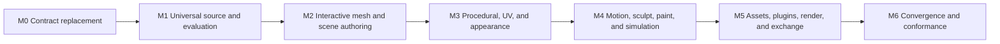
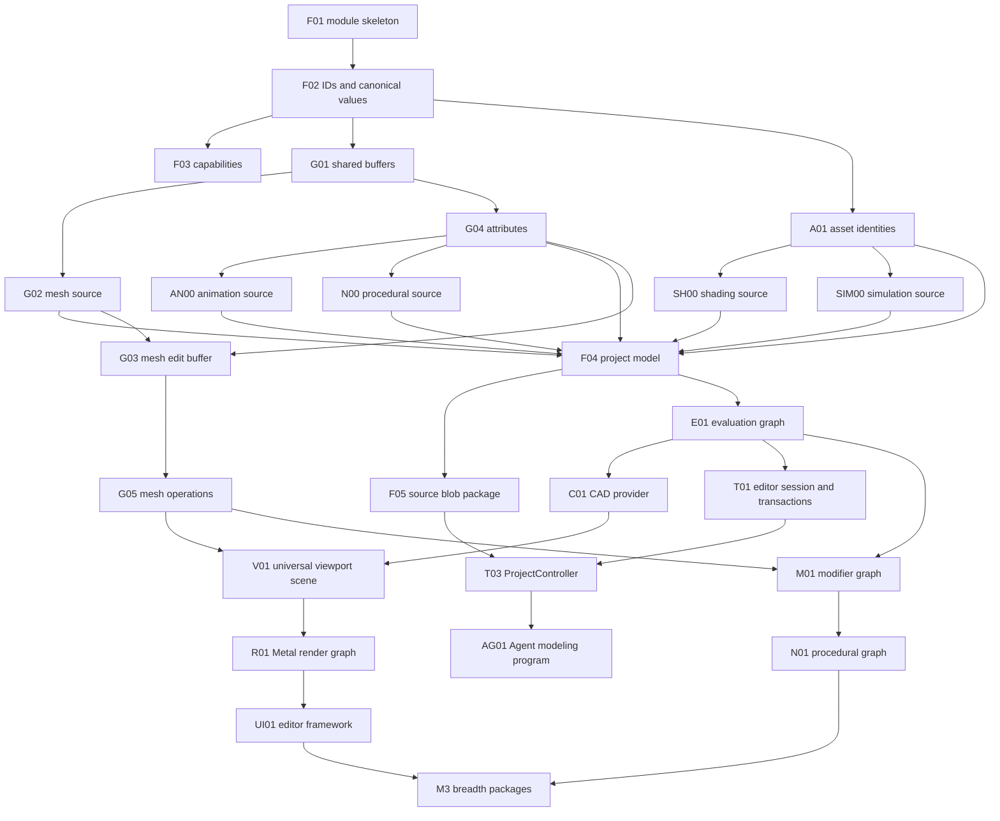

# Universal 3D Implementation Plan

## Status and Use

This is the dependency-ordered implementation design for
`UNIVERSAL_3D_ARCHITECTURE.md`. It is written as a handoff document for multiple
implementation agents. It schedules work but does not prove completion; versioned
conformance manifests and executable evidence remain the completion authority.

| Field | Value |
|---|---|
| Architecture authority | `UNIVERSAL_3D_ARCHITECTURE.md` |
| Gap inventory | `BLENDER_RUPA_CAPABILITY_GAP.md` |
| Design-packet process | `DESIGN_PROCESS.md` |
| Release authority | Versioned conformance manifest |
| Compatibility | Breaking development changes are expected; no deprecated command or schema aliases |
| Integration model | Contract freeze, parallel leaf work, orchestrator review, then integration gate |

## Current Implementation Status

The plan is executable and the following slices have evidence in the repository:

| Slice | Status | Evidence |
|---|---|---|
| M0 / F02 stable revisions and canonical values | Complete | `RupaCoreTypes` compiles; canonical JSON bytes, validation, and revision tests pass. |
| M0 / F03 universal capability registry | Complete | `RupaCapabilities` compiles; duplicate, version, effect/result, path, availability, and surface discovery tests pass. |
| Domain capability adapter | Complete | `DomainRegistry.capabilityRegistry()` converts validated domain descriptors and bridge tests pass. |
| M1 / G01 shared immutable buffers | First slice complete | `RupaGeometry` exposes immutable buffers, zero-copy views, COW builders, and copy telemetry; targeted tests pass. |
| M1 / G02 editable polygon mesh source | First slice complete | `MeshSource` stores vertex/edge/face/corner SoA buffers, preserves n-gon face loops, validates references, and round-trips through its source codec. |
| M1 / G04 generic geometry attributes | First slice complete | `GeometryAttributeSet` validates typed dense/sparse layers across vertex, edge, face, and corner domains; UV and material-index fixtures pass. |
| M1 project source aggregate | First slice complete | `RupaProjectModel` validates mesh references, object definitions, occurrence hierarchy, roots, and external provider references without importing CAD. |
| M1 evaluation integration | First slice complete | `RupaEvaluation` evaluates mesh providers into immutable occurrence snapshots with composed transforms and world bounds; provider injection leaves the CAD adapter boundary explicit. |
| M1 CAD provider integration | First slice complete | `RupaCADIntegration` converts evaluated Swift-CAD body meshes at the provider boundary and participates in `ProjectEvaluationEngine`; source transaction composition is still open. |
| M1 project transaction controller | First slice complete | `RupaProject.ProjectController` stages immutable source, evaluates off-actor, rechecks source revision, and publishes only successful results. |
| M1 CAD/project transaction integration | Not started | Requires transaction staging and `DesignDocument` composition without moving CAD types into project contracts. |

The first-slice rows are not milestone completion. The remaining M1 work must
integrate CAD and mesh sources into one project transaction/evaluation route
before M1 can be marked complete.

## 1. Completion Model

The work is divided into foundation, authoring breadth, and convergence. A high
feature count is not useful until source identity, transactions, evaluation, and
rendering are shared.



| Milestone | Exit outcome |
|---|---|
| M0 | New module graph, lowest-level IDs, canonical values, and capability schema compile with dependency guards. |
| M1 | CAD and editable mesh can coexist in one document and evaluate into one immutable scene snapshot. |
| M2 | Users and Agents can assemble scenes and perform source-owned object/vertex/edge/face modeling through one command route and GPU viewport. |
| M3 | Modifier and procedural graphs, attributes, UVs, textures, and PBR material preview are usable and inspectable. |
| M4 | Time, deformation, rigging, sculpt, paint, and simulation contracts operate on the same geometry/evaluation model. |
| M5 | Reusable assets, overrides, extension modules, exchange, camera output, passes, and production-render adapters are integrated. |
| M6 | Cross-surface, package, performance, reliability, and end-to-end evidence satisfy the selected conformance manifest. |

M0 and the integration spine of M1 are critical and must have one architectural
owner. Leaf algorithms may be parallelized only after their contracts are frozen.

## 2. Agent Work Contract

Every assigned work package must include all of the following. An implementation
without its verification is incomplete.

| Deliverable | Required content |
|---|---|
| Design packet | Intent, evaluation spec, case set, mappings, rejected cases, errors, performance budget, decision log |
| Source | One primary type per file; protocol and concrete implementation separated; English names/comments |
| Tests | Unit and property tests, failure cases, route tests where applicable, and performance fixture when data volume matters |
| Documentation | Public contract, ownership, dependency, unsupported cases, migration/removal note |
| Evidence | Exact test command, fixture identity, result, measured allocations/copies where applicable |
| Handoff | Changed files, APIs added/removed, known risks, follow-on dependency unlocked |

### Mandatory Engineering Rules

- Use `xcodebuild test`, targeted suites, and a bounded process timeout. UI tests are
  performed after lower-level implementation and integration tests.
- Do not use `try?`, `@unchecked Sendable`, `DispatchQueue`, or untyped error
  suppression.
- Use actors for ordered asynchronous/I/O state and `Mutex` only for short
  non-suspending memory cache sections.
- Preserve structural sharing and add copy telemetry before optimizing by claim.
- A provider must return typed unsupported/fidelity errors rather than approximate
  silently.
- Do not edit another work package's owner files. Contract changes return to the
  orchestrator for a coordinated revision.
- Do not retain old command/schema routes after the migration package's deletion
  gate passes.

### Orchestrator-owned Files

Only the integration owner edits these during parallel waves:

- `RupaKit/Package.swift`;
- umbrella export files;
- project-model aggregate types shared by multiple modules;
- the composed capability/evaluation/module registry;
- conformance manifests and specification authority;
- migration deletion lists;
- integration baselines.

Leaf agents may propose patches to these files in their handoff but must not create
parallel conflicting edits.

## 3. Target Source Layout

The target layout gives every package an explicit owner.

```text
RupaKit/Sources/
|-- RupaCoreTypes/
|-- RupaGeometry/
|   |-- Buffer/
|   |-- Attributes/
|   |-- MeshSource/
|   |-- MeshEditing/
|   |-- Curves/
|   |-- PointCloud/
|   `-- Snapshot/
|-- RupaShading/
|-- RupaAnimation/
|-- RupaAssets/
|-- RupaCapabilities/
|-- RupaProceduralModel/
|-- RupaSimulationModel/
|-- RupaProjectModel/
|   |-- Scene/
|   |-- Objects/
|   |-- Collections/
|   |-- SourceLibraries/
|   `-- Validation/
|-- RupaEvaluation/
|-- RupaCADIntegration/
|-- RupaGeometryOperations/
|-- RupaGeometryEvaluation/
|-- RupaProceduralGeometry/
|-- RupaSimulation/
|-- RupaBrush/
|-- RupaSculpt/
|-- RupaPaint/
|-- RupaGrooming/
|-- RupaExchange/
|-- RupaPluginHost/
|-- RupaCompositor/
|-- RupaCore/
|   |-- EditorSession/
|   |-- Transactions/
|   |-- History/
|   `-- Publication/
|-- RupaAutomation/
|-- RupaDomainFoundation/
|-- RupaProject/
|-- RupaViewportScene/
|-- RupaRenderGraph/
|-- RupaRendering/
`-- RupaUI/
```

Tests mirror module ownership. Cross-module fixtures live in a dedicated fixture
target and must not be copied into multiple suites.

## 4. Dependency Waves



### Parallelization Gates

| Gate | Must be frozen before parallel work begins |
|---|---|
| G0 | Module names, dependencies, lowest-level IDs, canonical payload, error envelope |
| G1 | `MeshSource`, attribute domain/value types, buffer lease, source content identity |
| G2 | Project occurrence/definition/source-reference schema and package blob reference |
| G3 | Evaluation request/snapshot/provider/cache identity and correspondence contracts |
| G4 | Capability descriptor/handler/transaction/result binding contracts |
| G5 | Render-scene buffer/pick/material contracts |

No agent may infer a missing shared contract locally. The orchestrator resolves it,
updates the architecture/design packet, and reopens dependent work.

## 5. M0 - Contract Replacement

### F01 - Module Skeleton and Dependency Guards

| Item | Detail |
|---|---|
| Owner | Integration architect |
| Dependencies | Architecture approval |
| Write scope | `RupaKit/Package.swift`, new empty target roots, dependency tests |
| Deliverables | Targets and products from the architecture; no cyclic imports; native and supported Wasm build matrix for pure Swift modules |
| Tests | Import-boundary compile fixtures; forbidden-dependency script/test; clean package resolution |
| Done | Every target builds independently with only declared dependencies and the old app still builds through temporary composition. |

The scaffold adds no placeholder behavior. Empty protocols are allowed only when
their complete contract lands in the same package.

### F02 - Stable IDs, Revisions, Canonical Values, and Errors

| Item | Detail |
|---|---|
| Owner | Core contracts agent |
| Dependencies | F01 |
| Write scope | `RupaCoreTypes` only |
| Deliverables | IDs for scene/object/source/geometry/evaluation/capability/property/asset/program types; source revision; canonical value tree; stable error envelope |
| Tests | Codable round trips, canonical key ordering, invalid numeric values, ID non-aliasing, error payload stability |
| Done | All later contracts can refer to IDs without importing concrete feature modules. |

IDs that require source persistence use stable UUID or monotonic source-local
values. Runtime slot indexes and GPU IDs are separate non-persisted types.

### F03 - Universal Capability Registry

| Item | Detail |
|---|---|
| Owner | Capability contracts agent |
| Dependencies | F02 |
| Write scope | `RupaCapabilities`, descriptor-focused tests |
| Deliverables | Descriptor, parameter/result schemas, execution contract, availability, registry merge, module registration validation |
| Tests | Duplicate IDs, version conflict, effect/result mismatch, incomplete handler coverage, invalid parameter paths, deterministic sorting |
| Done | A descriptor can generate equivalent discovery metadata for UI, CLI, Agent, and MCP without importing those modules. |

The existing domain descriptor behavior is ported as tests before the domain
registry becomes an adapter.

## 6. M1 - Geometry, Assets, and Evaluation Foundation

### G01 - Shared Immutable Buffers and Copy Telemetry

| Item | Detail |
|---|---|
| Owner | Geometry storage agent |
| Dependencies | F01, F02 |
| Write scope | `RupaGeometry/Buffer`, microbenchmarks |
| Deliverables | Chunked immutable storage, `BufferView`, `BufferLease`, copy-on-write builder, content hashing, copy reason/byte telemetry |
| Tests | Slice/lifetime correctness, COW isolation, unchanged chunk identity, concurrent reads, alignment, bounded hashing |
| Performance | Editing one chunk must preserve all untouched chunk identities; zero-copy-eligible view creation reports zero copied bytes. |
| Done | Geometry modules can share typed buffers without exposing mutable arrays or unsafe lifetimes. |

### G02 - Compact Mesh Source and Codec

| Item | Detail |
|---|---|
| Owner | Mesh source agent |
| Dependencies | G01, F02 |
| Write scope | `RupaGeometry/MeshSource`, mesh codec tests |
| Deliverables | Compact vertex/edge/face/corner SoA, stable IDs, monotonic allocation, triangulation view contract, source blob codec |
| Tests | Triangle/quad/n-gon, boundary, loose edge/vertex, non-manifold edge, disconnected islands, malformed buffers, stable ID under compaction |
| Performance | Decode/encode streams chunks; snapshot creation shares storage; no triangulation until requested. |
| Done | A polygon mesh is editable source independent of Swift-CAD tessellation `Mesh`. |

### G04 - Generic Geometry Attributes

| Item | Detail |
|---|---|
| Owner | Attribute-system agent |
| Dependencies | G01, F02 |
| Write scope | `RupaGeometry/Attributes` |
| Deliverables | Domains, value types, descriptors, dense/sparse buffers, interpolation/domain adaptation, named and graph-scoped IDs |
| Tests | Every domain/type, invalid lengths, adaptation rules, UV corner storage, material face indexes, sparse deform weights |
| Performance | Unrequested attributes remain unevaluated; updating one attribute does not copy unrelated layers. |
| Done | Mesh, curves, points, instances, UV, color, material, weight, and procedural data use one typed system. |

### A01 - Asset Identity, Catalog, Reference, and Override Values

| Item | Detail |
|---|---|
| Owner | Asset contracts agent |
| Dependencies | F02 |
| Write scope | `RupaAssets` values and pure resolver protocols |
| Deliverables | Content identity, asset/version/catalog records, link/append/pack references, override delta model, conflict result |
| Tests | Version selection, content mismatch, missing reference placeholder, override merge/resync cases, recursive dependency cycle |
| Done | Project model and package can represent external reusable content without global file paths or copied scene data. |

### SH00 - Shading and Scene Optics Source Contracts

| Item | Detail |
|---|---|
| Owner | Shading contracts agent |
| Dependencies | F02, A01 identity contracts |
| Write scope | Low-level source values in `RupaShading` |
| Deliverables | Material slots, baseline PBR values, image references, camera, light, world, shader-graph IDs and source interfaces |
| Tests | Codable/validation, typed units, missing references, finite/range checks |
| Done | `RupaProjectModel` can own appearance and optics without importing a renderer. |

### AN00 - Animation and Rig Source Contracts

| Item | Detail |
|---|---|
| Owner | Animation contracts agent |
| Dependencies | F02, G04 attribute references |
| Write scope | Low-level source values in `RupaAnimation` |
| Deliverables | Property addresses, time values, channel/clip/rig/skin/shape-key/constraint source schemas |
| Tests | Codable/validation, property type mismatch, hierarchy cycle, weight reference validity |
| Done | The project model can persist motion/deformation intent without importing timeline UI or evaluation scheduling. |

### N00 - Procedural Graph Source Model

| Item | Detail |
|---|---|
| Owner | Procedural contracts agent |
| Dependencies | F02, G04 |
| Write scope | `RupaProceduralModel` |
| Deliverables | Codable graph, node, socket, link, group, field, zone, published-interface, and versioned node-kind references |
| Tests | Source validation, link/type declaration consistency, graph/group cycles, unknown required node kind |
| Done | Procedural source is persistable without depending on its evaluator or editor. |

### SIM00 - Simulation Source Model

| Item | Detail |
|---|---|
| Owner | Simulation contracts agent |
| Dependencies | F02, A01 |
| Write scope | `RupaSimulationModel` |
| Deliverables | Codable definition, input/boundary binding, settings, time range, authored bake policy, solver-kind reference |
| Tests | Unit/fidelity declaration, missing binding, time range, unknown required solver kind |
| Done | Simulation intent is persisted separately from jobs, caches, and derived artifacts. |

### F04 - Project Model vNext

| Item | Detail |
|---|---|
| Owner | Project-model architect |
| Dependencies | F02, G02, G04, A01, SH00, AN00, N00, and SIM00 source contracts |
| Write scope | `RupaProjectModel`, one orchestrator-owned aggregate patch |
| Deliverables | `DesignDocument` vNext, scenes, nodes, object definitions, collections, view layers, content/source references, geometry/procedural/shading/animation/simulation/asset libraries, documentation, validation, export configuration |
| Tests | Missing references, hierarchy/collection cycles, shared definitions, duplicate/single-user identity, camera/light/geometry content, documentation/preset migration, semantic preservation, source/workspace-state separation |
| Done | A document can represent CAD, editable mesh, curves, cameras, lights, reusable definitions, and references without `ObjectDescriptor`. |

### F05 - Source Blob Package Schema

| Item | Detail |
|---|---|
| Owner | Package I/O agent |
| Dependencies | F02, A01, F04 reference schema |
| Write scope | Package contract implementation and package tests; not geometry codecs |
| Deliverables | Source blob manifest records, stream/memory-map reader, atomic unchanged-blob reuse, bounded resource policy |
| Tests | Hash/length mismatch, traversal, duplicate paths, unknown extension preservation, large-resource streaming, failed atomic save, unchanged byte reuse |
| Done | Large editable geometry/image source can be saved without JSON array materialization or loading every blob into memory. |

### F06 - Development Schema Migration and Deletion Ledger

| Item | Detail |
|---|---|
| Owner | Integration architect |
| Dependencies | F04, F05 |
| Write scope | One-time migration fixtures, deletion ledger, load diagnostics |
| Deliverables | Explicit old-to-vNext development transform or declared unsupported-old-schema result; list of obsolete types and final removal package |
| Tests | Fixture migration identity, unsupported version error, no silent defaulting |
| Done | There is one authoritative source schema. A permanent dual model is not introduced. |

### G03 - Radial Mesh Edit Buffer and Commit

| Item | Detail |
|---|---|
| Owner | Mesh topology agent |
| Dependencies | G02, G04 |
| Write scope | `RupaGeometry/MeshEditing`, topology property tests |
| Deliverables | Disk/radial connectivity, generational handles, begin/edit/commit lifecycle, delta, tombstones, correspondence, validation |
| Tests | Generated topology fuzzing, stale handle, failed atomic commit, edit-session reuse, selection flush, source round trip |
| Performance | Compatible batch builds connectivity once; local edit copies touched chunks only. |
| Done | Arbitrary valid polygon topology can be edited and committed with stable source identity and complete invariants. |

### G05 - Direct Mesh Operation Kernel

| Item | Detail |
|---|---|
| Owner | Mesh operations group; split by family after G03 contract freeze |
| Dependencies | G03, F03 |
| Write scope | `RupaGeometryOperations/Direct`, one family per subdirectory |
| Deliverables | Operation protocol plus create/delete, extrusion, inset/bevel, split/connect, merge/dissolve, transform, cleanup, retopology, and query families |
| Tests | Per-family design packet, golden meshes, property invariants, correspondence, invalid selections, undo round trip |
| Performance | Family-specific fixture and allocation/copy budget; no operation may scan unrelated mesh sources. |
| Done | Required operation set in the architecture is complete through Swift API and registration metadata. |

This package may be parallelized by operation family only after shared selection,
delta, error, and correspondence fixtures are merged. One topology reviewer audits
all families before M2.

### E01 - Project Dependency Graph and Evaluated Snapshot

| Item | Detail |
|---|---|
| Owner | Evaluation architect |
| Dependencies | F04, G02, G04, A01 |
| Write scope | `RupaEvaluation` |
| Deliverables | Provider protocol, graph builder, request/purpose/quality, invalidation, deterministic scheduler, cache identity, project/geometry snapshots |
| Tests | Dependency cycle, dirty closure, parallel determinism, attribute demand, quality mismatch, cancellation, stale result, cache reuse |
| Performance | Transform/material edits prove narrow invalidation; identical requests invoke no provider and preserve storage identity. |
| Done | Mixed source providers can evaluate into one immutable snapshot with diagnostics and provenance. |

### C01 - Swift-CAD Evaluation Provider

| Item | Detail |
|---|---|
| Owner | CAD integration agent |
| Dependencies | E01 |
| Write scope | `RupaCADIntegration`; focused adaptation changes in `RupaCore` owned by orchestrator |
| Deliverables | CAD source dependency nodes, incremental evaluator adapter, B-rep/curve/tessellation snapshots, persistent-name correspondence, exact-fidelity reporting |
| Tests | Existing CAD evaluation fixtures, unchanged mesh reuse, feature invalidation, curves-only output, topology names, cancellation boundary |
| Performance | No regression beyond the accepted Swift-CAD baseline; scene transforms never call CAD evaluation. |
| Done | Existing CAD behavior appears through the universal graph without moving CAD algorithms into Rupa. |

### U01 - Universal Curves, Point Clouds, Volumes, and Instances

| Item | Detail |
|---|---|
| Owner | Geometry-components group |
| Dependencies | G01, G04, E01 |
| Write scope | `RupaGeometry/Curves`, `PointCloud`, `Volume`, `Snapshot` |
| Deliverables | Source/snapshot models, basic evaluators, bounds, attributes, stable IDs, instance preservation, explicit realization |
| Tests | Poly/Bezier/NURBS curves, cyclic splines, point attributes, missing volume provider, nested instances, realization identity |
| Done | `GeometrySnapshot` supports every core component kind without flattening to triangles. |

## 7. M2 - Project Transactions, Scene, Viewport, and Modeling

### T01 - Editor Session and Atomic Source Transaction Runtime

| Item | Detail |
|---|---|
| Owner | Core session agent |
| Dependencies | F03, F04, E01 |
| Write scope | `RupaCore/EditorSession`, `Transactions`, `History`, `Publication` |
| Deliverables | Source/workspace session state, immutable snapshots, typed command preparation, private staged source/evaluation, synchronous revision-checked final swap, undo/redo, coherent publication value |
| Tests | Stale staged result, failed preparation, failed staged evaluation with unchanged authoritative state, cancellation, undo identity, source/workspace partition, coherent publication |
| Done | Source mutation is a synchronous, atomic Core operation that can be ordered by `ProjectController`; Core owns no package, artifact, or job lifecycle. |

### T03 - ProjectController and Effect Orchestration

| Item | Detail |
|---|---|
| Owner | Project orchestration agent |
| Dependencies | T01, F03, F05, A01, E01, and the existing `RupaDomainFoundation` registry contract |
| Write scope | `RupaProject` |
| Deliverables | Project actor, open-session registry, ordered use-case dispatch, package load/save, source/workspace/artifact/export/job/decision contexts, artifact and job lifecycle, shutdown |
| Tests | Concurrent callers, session registration, stale revision, effect mismatch, package I/O failure, artifact publication, job cancellation, stream shutdown/hang guard |
| Done | UI, CLI, Agent, and MCP share one application use-case boundary without transport, geometry, or domain semantics leaking into it. |

### T02 - Capability Handler Migration and Enum Removal

| Item | Detail |
|---|---|
| Owner | Automation migration group, one capability family at a time |
| Dependencies | T01, F03; project-route integration tests also use T03 without adding a reverse `RupaAutomation -> RupaProject` dependency |
| Write scope | `RupaAutomation`, family command structs; deletion patches coordinated by orchestrator |
| Deliverables | Registered handler for every existing operation/query, generated discovery, route adapter, deletion of corresponding enum cases/static catalog entries |
| Tests | Descriptor/handler coverage, old behavior fixtures through new route, UI/CLI/Agent payload equivalence, no unregistered mutation route |
| Done | `EditorCommand`, `AutomationCommand`, and static `AgentCapabilityCatalog` are deleted, not wrapped. |

Migration is complete family-by-family only when the old case, switch branches,
tests, and descriptor entry are removed in the same integration checkpoint.

### S01 - Scene Occurrence/Definition Migration

| Item | Detail |
|---|---|
| Owner | Scene-model agent |
| Dependencies | F04, T01 |
| Write scope | Scene commands and migration services, not shared aggregate types |
| Deliverables | Create/delete/reparent, collections/view layers, linked/single-user duplicate, component definitions/instances, visibility/lock/transform overrides |
| Tests | Hierarchy cycles, collection sharing, instancing, component expansion, make-local mapping, undo, Agent receipts |
| Done | Existing scene/component/pattern workflows use the new model and no longer rely on embedded `ObjectDescriptor`. |

### M01 - Non-destructive Operation Stack

| Item | Detail |
|---|---|
| Owner | Modifier runtime agent plus parallel evaluator families |
| Dependencies | E01, G05, T01 |
| Write scope | `RupaGeometryEvaluation`, operation-stack source commands and provider adapters |
| Deliverables | Operation DAG, ordered stack view, preview/render policy, apply/copy/reorder/toggle, cache keys, baseline modifier families |
| Tests | Ordering, disabled operation, apply correspondence, shared graph inputs, cyclic input rejection, preview/final differences, source immutability |
| Done | A modifier can be created and edited through all execution surfaces without direct source mutation until apply. |

### V01 - Universal Viewport Scene

| Item | Detail |
|---|---|
| Owner | Viewport-scene agent |
| Dependencies | C01, U01, S01, E01 |
| Write scope | `RupaViewportScene` |
| Deliverables | Render-scene snapshot, draw instances, component ranges, bounds, render origin, overlays, pick identities, source correspondence resolver |
| Tests | Mixed CAD/mesh/curve/point/instance scene, camera/light records, selection identity, hidden layers, large coordinates, unchanged buffer identity |
| Done | CAD-specific `ViewportSceneItemKind`, box face/edge enums, and `BodyDisplaySnapshot` are removed. |

### R01 - Metal Render Graph and Residency

| Item | Detail |
|---|---|
| Owner | Rendering architect |
| Dependencies | V01, SH00 source contracts |
| Write scope | `RupaRenderGraph`; host integration patches coordinated separately |
| Deliverables | Solid/wire/x-ray/material-preview passes, depth, identity pick, buffer/texture residency, instance drawing, render-origin transforms, offscreen output |
| Tests | Pixel/canvas nonblank, depth ordering, pick IDs, resize, large coordinates, resource reuse, device/allocation errors, copy telemetry |
| Performance | Versioned 60 Hz navigation fixture, unique-geometry upload count, no full scene rebuild for transform/material changes |
| Done | Primary 3D geometry no longer uses SwiftUI `Canvas`; render resources are incremental and measured. |

### P01 - Typed Selection, Picking, Snapping, and Tool Runtime

| Item | Detail |
|---|---|
| Owner | Interaction contracts agent |
| Dependencies | G03, V01, R01, T01 |
| Write scope | selection/tool services across `RupaRendering` and focused workspace adapters |
| Deliverables | Occurrence-path selections, source/evaluated resolution, selection modes, rectangle/lasso, active/history, object/element snapping, tool/gizmo descriptors |
| Tests | Occlusion, nested component/procedural instances, object/vertex/edge/face/curve picks, modifier correspondence, shared-definition edit policy, ambiguous output, UI-overlay hover exclusion, selection persistence after edit |
| Done | No string-prefixed selection ID remains and every valid hit resolves to a typed source or inspect-only evaluated target. |

### UI01 - Composable Editor Framework

| Item | Detail |
|---|---|
| Owner | UI architecture agent |
| Dependencies | F03, P01, R01, T01 |
| Write scope | editor protocols, workspace composition, extracted editor views |
| Deliverables | 3D Viewport, Outliner, Inspector, graph, timeline, UV/image, asset, and spreadsheet editor shells; schema-generated controls; compact canvas chrome |
| Tests | Unit previews for components, layout snapshots, narrow/wide window behavior, no canvas occlusion, one state owner |
| Done | `MainView` is composition rather than capability logic and `Viewport.swift` is input/overlay host rather than renderer/operation implementation. |

UI E2E is intentionally deferred to M6. Component and layout tests are still part
of each UI package.

## 8. M3 - Procedural Modeling, UV, and Appearance

### N01 - Procedural Geometry Runtime

| Item | Detail |
|---|---|
| Owner | Procedural runtime agent |
| Dependencies | M01, U01, G04, E01 |
| Write scope | `RupaProceduralGeometry` runtime/compiler |
| Deliverables | Typed graph, sockets, fields, geometry flow, node groups, anonymous attributes, instance preservation, graph diagnostics |
| Tests | Type checking, cycle rejection, field domains, deterministic random seed, lazy attributes, groups, instances, malformed graph codec |
| Done | Baseline node profile evaluates headlessly and produces the same results through Swift and Agent APIs. |

### N02 - Geometry Node Library and Inspection

| Item | Detail |
|---|---|
| Owner | Parallel node-family agents after N01 freeze |
| Dependencies | N01, G05, U01 |
| Write scope | registered node families and inspection services |
| Deliverables | Primitive, transform, geometry, curve, mesh, point, instance, material, math/vector/color, input/output nodes; viewer and spreadsheet outputs |
| Tests | One design packet per node family, operation differential tests, graph timing/diagnostics, attribute provenance |
| Done | Node implementations reuse operation providers and the required baseline graph profile is complete. |

### N03 - Geometry Graph Editor

| Item | Detail |
|---|---|
| Owner | Graph UI agent |
| Dependencies | N01, N02, UI01 |
| Write scope | graph editor UI and presentation adapters only |
| Deliverables | Pan/zoom, selection, links, add/search, groups, socket defaults, diagnostics, viewer, published modifier interface |
| Tests | Graph interaction model tests, layout snapshots, keyboard accessibility, large graph viewport performance |
| Done | The editor writes only `GeometryProgram` commands and owns no evaluator rules. |

### SH01 - PBR, Images, Textures, Cameras, Lights, and World

| Item | Detail |
|---|---|
| Owner | Shading source agent |
| Dependencies | F02, A01, G04 |
| Write scope | `RupaShading` |
| Deliverables | Baseline PBR model, material slots, image/UDIM references, sampler/mapping/color metadata, camera/light/world source values |
| Tests | Validation ranges, missing resources, slot binding, color-space metadata, camera projection, light unit conversion |
| Done | Canonical appearance is independent from Swift-CAD's minimal material and renderer resources. |

### U02 - Text, Implicit Field, and Lattice Sources

| Item | Detail |
|---|---|
| Owner | Universal source-provider group |
| Dependencies | U01, E01, SH01, A01 |
| Write scope | Focused source/provider modules over `RupaGeometry` and `RupaAssets` |
| Deliverables | Editable text layout/font/curve/extrusion source, implicit/metaball field source and meshing, lattice source and deformation provider |
| Tests | Font/resource failure, multiline/path text, text-to-curve identity, positive/negative implicit elements, quality-dependent meshing, lattice deformation and animation |
| Done | Text, implicit surfaces, and lattices are source-owned provider kinds available to scene, evaluation, selection, and Agent routes. |

### SH02 - UV Operation Set

| Item | Detail |
|---|---|
| Owner | UV operations agent |
| Dependencies | G03, G04, G05 |
| Write scope | `RupaGeometryOperations/UV` |
| Deliverables | Seam, unwrap, projection, pin, stitch, split/weld, relax, transform, scale, and pack operations plus distortion metrics |
| Tests | Islands, mirrored UV, n-gons, pinned points, multiple UV sets, packing margins, correspondence, invalid non-manifold case |
| Done | UV source is editable through direct tools, procedural nodes, Agent, and package round trip. |

### SH03 - Shader Graph and Material Preview

| Item | Detail |
|---|---|
| Owner | Shading compiler agent |
| Dependencies | SH01, R01, UI01 |
| Write scope | shader graph/compiler plus renderer material adapter |
| Deliverables | Versioned shader DAG, standard PBR subset compiler, texture sampling, environment lighting, shadows, unsupported-node diagnostics |
| Tests | Graph type/cycle errors, shader golden images, missing texture, UDIM selection, material resource reuse |
| Done | Material preview is physically coherent for the baseline source model and preserves unsupported production nodes. |

### M02 - Attribute, Generate, Conversion, and Normal Modifier Breadth

| Item | Detail |
|---|---|
| Owner | Parallel modifier-family agents under one modifier reviewer |
| Dependencies | M01, U01, SH02, G04 |
| Write scope | `RupaGeometryEvaluation` providers and reusable `RupaGeometryOperations` algorithms |
| Deliverables | Data transfer/cache, UV project/warp, weight edit/mix/proximity, mask, build, edge split, multires baseline, skin, wireframe, mesh/volume conversion, scatter, custom/weighted/smooth normals |
| Tests | One packet per family, stack ordering, attribute propagation, correspondence, preview/final, apply, cache identity, invalid component inputs |
| Done | Non-deformation modifier families required by the architecture and selected conformance profile are complete without one-off command routes. |

### SH04 - Color Management and Texture/Material Baking

| Item | Detail |
|---|---|
| Owner | Color and baking agent |
| Dependencies | R01, SH02, SH03, A01 |
| Write scope | Color-transform provider, baking effect handler, renderer adapters |
| Deliverables | Source/display/view/output color transforms, exposure, image metadata enforcement, UV-targeted material/normal/AO/ID baking, artifact identity |
| Tests | Known color transforms, texture decode/output metadata, missing transform provider, bake margins/tiles/passes, stale scene rejection, deterministic artifact identity |
| Done | Viewport, image resources, export, and render output use explicit color transforms and baking is a reproducible artifact operation. |

### AG01 - Agent Modeling Program and MCP Adapter

| Item | Detail |
|---|---|
| Owner | Agent execution agent |
| Dependencies | F03, T03, T02, G05 |
| Write scope | Agent protocol/runtime program types, MCP adapter, benchmark fixtures |
| Deliverables | Program DAG, result bindings, preflight, transactional execution, preview checkpoints, progress/cancellation, binary resource route |
| Tests | Cycles, invalid binding, stale transaction revision, staged failure leaves authoritative state unchanged, one-edit-buffer/one-evaluation assertion, compact payload, MCP/CLI equivalence |
| Performance | 100-operation fixture compared with Blender baseline and Rupa single-command loop; copy/evaluation counts are required evidence. |
| Done | An Agent can construct and edit nontrivial geometry without UI automation or one-request-per-element overhead. |

## 9. M4 - Animation, Rigging, Sculpt, Paint, and Simulation

### AN01 - Animatable Properties, Time, Clips, and Curves

| Item | Detail |
|---|---|
| Owner | Animation core agent |
| Dependencies | F04, E01, SH01 |
| Write scope | `RupaAnimation` property/channel/clip evaluation |
| Deliverables | Typed property addresses, time code, keyframes, step/linear/cubic interpolation, clips, layers baseline, timeline invalidation |
| Tests | Interpolation golden values, property type mismatch, clip range, deterministic evaluation, transform/material/camera animation |
| Done | Time evaluation changes immutable evaluated properties and dependency outputs without mutating authored values. |

### AN02 - Rig, Skin, Shape Key, and Constraint Pipeline

| Item | Detail |
|---|---|
| Owner | Rig/deformation group |
| Dependencies | AN01, G04, E01, M01 |
| Write scope | rig/skin/shape/constraint implementations in `RupaAnimation` and evaluator adapters |
| Deliverables | Bone hierarchy, bind/pose, sparse weights, shape keys, baseline constraints, IK, deformation stack, bounds |
| Tests | Rest/pose, normalized weights, shape interpolation, constraint cycles, IK fixtures, CPU reference deformation, correspondence |
| Performance | Shared source mesh is not copied per pose; changed bones update only dependent deformation outputs. |
| Done | A character or mechanism can be rigged, posed, keyed, evaluated, selected, rendered, and exported. |

### AN03 - Timeline and Curve Editors

| Item | Detail |
|---|---|
| Owner | Animation UI agent |
| Dependencies | AN01, UI01 |
| Write scope | timeline/curve editor UI only |
| Deliverables | Playback, scrub, key/channel selection, handle editing, interpolation, markers, clip assignment |
| Tests | Editor-model tests, layout snapshots, playback cancellation, source command equivalence |
| Done | UI produces the same animation capabilities available to Swift/Agent. |

### AN04 - Animation Tracks, Drivers, Markers, and Motion Paths

| Item | Detail |
|---|---|
| Owner | Animation breadth agent |
| Dependencies | AN01, AN02, AN03 |
| Write scope | `RupaAnimation` track/driver source and evaluation plus focused editor adapters |
| Deliverables | Reusable clip assignment, tracks/strips, time mapping, blend/extrapolation/transitions, typed drivers, markers, motion-path artifacts |
| Tests | Layer/strip blending, transition boundaries, driver dependency cycles, marker/camera binding, motion-path cache invalidation |
| Done | Reusable layered motion and declared property relationships work without arbitrary script execution. |

### M03 - Deformation Modifier Breadth

| Item | Detail |
|---|---|
| Owner | Deformation modifier group |
| Dependencies | M01, AN02, U02 |
| Write scope | `RupaGeometryEvaluation` deformation providers |
| Deliverables | Armature, cast, curve, displace, hook, mesh deform, simple deform, smooth families, surface deform, warp, wave, and lattice integration |
| Tests | One packet per family, deformation order, animated inputs, bounds, normals, source immutability, stack apply/correspondence |
| Done | Required deformation outcomes share the animation/evaluation graph and modifier stack. |

### SC01 - Brush Engine and Sculpt Foundation

| Item | Detail |
|---|---|
| Owner | Sculpt foundation agent |
| Dependencies | G03, P01, R01, T01 |
| Write scope | new brush/sculpt module targets and focused viewport adapters |
| Deliverables | deterministic stroke sampling, falloff, symmetry, local spatial index, dirty-region updates, mask/face-set attributes |
| Tests | Input resampling, pressure/tilt, symmetry, cancellation, undo coalescing, local dirty region, Agent stroke codec |
| Done | Brush strokes can safely and efficiently edit a bounded mesh region through one transaction route. |

### SC02 - Multiresolution, Remesh, and Sculpt Tool Set

| Item | Detail |
|---|---|
| Owner | Sculpt algorithm group |
| Dependencies | SC01, M01 |
| Write scope | sculpt operations and multires/remesh providers |
| Deliverables | Draw/smooth/inflate/grab/crease/flatten/scrape, masks, face sets, voxel remesh, multires displacement, mesh filters |
| Tests | Per-brush golden displacement, symmetry, remesh validity/correspondence, multires round trip, large-stroke performance |
| Done | Required sculpt outcomes in the architecture are source-owned, undoable, renderable, and Agent-addressable. |

### SC03 - Curve Grooming

| Item | Detail |
|---|---|
| Owner | Grooming agent |
| Dependencies | SC01, U01, P01 |
| Write scope | `RupaGrooming` and focused viewport capability adapters |
| Deliverables | Add/delete, selection paint, comb, smooth, grow/shrink, pinch/puff, density, slide, surface attachment, guides, interpolation |
| Tests | Surface rebinding, symmetry, density determinism, guide interpolation, curve attributes, undo coalescing, Agent stroke/region commands |
| Done | Hair/groom curves remain normal source-owned curve geometry with typed bindings and attributes. |

### PA01 - Vertex Color, Weight, and Texture Paint

| Item | Detail |
|---|---|
| Owner | Paint agent |
| Dependencies | SC01, G04, SH01, AN02 |
| Write scope | paint target providers and UI adapters |
| Deliverables | Color/weight/image targets, masks, symmetry, blend modes, normalization/locks, tile-dirty image transactions |
| Tests | Attribute/image changes, locked weights, normalization, UV seams/bleed, undo coalescing, package resource identity |
| Done | Paint modes share stroke infrastructure but preserve typed target rules and resource ownership. |

### SIM01 - Simulation Definition, Job, and Artifact Foundation

| Item | Detail |
|---|---|
| Owner | Simulation foundation agent |
| Dependencies | E01, A01, F03, AN01 |
| Write scope | `RupaSimulation` generic contracts |
| Deliverables | Definition/run/artifact, boundary bindings, solver adapter, job actor, cache key, bake/free/rebake lifecycle |
| Tests | Unit/fidelity mismatch, stale geometry, job cancellation, cache identity, partial output, artifact package round trip |
| Done | A deterministic in-process or external solver can integrate without mutating source or importing domain rules into Core. |

### SIM02 - Baseline Visual Dynamics Providers

| Item | Detail |
|---|---|
| Owner | Parallel solver agents by provider |
| Dependencies | SIM01, G04, M01 |
| Write scope | rigid body, collision, cloth/soft body, particles/fields providers |
| Deliverables | Source definitions, solver/evaluator, cache/bake, viewport output, Agent capabilities |
| Tests | Deterministic fixtures, collision cases, substeps, cache invalidation, bake reload, cancellation, performance |
| Done | Each provider completes its declared case set; one provider's approximations do not define another's contract. |

Engineering CFD/FEA/thermal providers are separate domain work packages over
SIM01 with units, meshing, boundary, convergence, and provenance requirements.

## 10. M5 - Assets, Plugins, Render Output, and Exchange

### A02 - Asset Resolver, Catalog Store, Pack, and Override Runtime

| Item | Detail |
|---|---|
| Owner | Asset runtime agent |
| Dependencies | A01, F05, T03, S01 |
| Write scope | `RupaAssets` runtime and project handlers |
| Deliverables | Resolver, cache, catalog query, link/append/pack/make-local, override create/reset/clear/resync/conflict |
| Tests | Offline/missing assets, version update, nested dependencies, multiple overrides, conflict preservation, atomic pack |
| Done | Reusable object/material/graph/brush/rig assets can be linked and locally overridden without duplicating unchanged data. |

### PL01 - Static Module Composition and Runtime Plugin Host

| Item | Detail |
|---|---|
| Owner | Extension runtime agent |
| Dependencies | F03, E01, A01, SIM01 |
| Write scope | module composition plus process-plugin host target |
| Deliverables | `RupaModule`, manifest/dependency validation, trait/static composition, versioned process IPC, lifecycle and isolation |
| Tests | Duplicate registration, missing dependency, incompatible version, plugin crash/timeout, cancellation, Wasm static composition |
| Done | Universal and specialized providers can be selected without lower-layer imports or an Agent-specific registration path. |

### IO01 - Import/Export Provider Framework and Core Formats

| Item | Detail |
|---|---|
| Owner | Exchange architecture agent plus format-specific agents |
| Dependencies | PL01, F05, U01, U02, SH04, AN04, A02 |
| Write scope | exchange registry, format modules, conformance fixtures |
| Deliverables | Streaming provider API, scene/geometry/material/animation fidelity report, STL/OBJ/GLB/USD-family/3MF/STEP providers according to product profiles |
| Tests | Round-trip fixtures, unit/axis/pivot/hierarchy/material/UV/normal/animation cases, malformed/large input, unsupported fidelity diagnostics |
| Done | Each format declares and proves exact supported semantics; mesh exchange is not misrepresented as CAD reconstruction. |

### REN01 - Camera Render, Passes, and Renderer Adapter

| Item | Detail |
|---|---|
| Owner | Render output agent |
| Dependencies | R01, SH03, SH04, AN01, PL01 |
| Write scope | render pass contracts, offscreen output, renderer adapter |
| Deliverables | Camera framing, resolution, color/depth/normal/ID/motion passes, output metadata, cancellation/progress, external renderer handoff |
| Tests | Camera golden images, pass dimensions/types, animation frame, color metadata, cancellation, external adapter failure |
| Done | Viewport and production providers consume the same evaluated scene contract and return typed passes/artifacts. |

### REN02 - Compositor Baseline

| Item | Detail |
|---|---|
| Owner | Compositor agent |
| Dependencies | REN01, N01 graph infrastructure, SH04 |
| Write scope | compositor graph and image operations, not geometry graph runtime |
| Deliverables | Typed image/pass graph, transform/color/mix/mask/filter/output baseline, caching, viewer |
| Tests | Node graph errors, color handling, tiled processing, deterministic image golden fixtures |
| Done | Render passes can be combined reproducibly without coupling compositor behavior to the viewport. |

## 11. M6 - Convergence and Evidence

### Q01 - Cross-surface Capability Audit

| Item | Detail |
|---|---|
| Owner | Integration test agent |
| Dependencies | T02 and selected capability profile complete |
| Deliverables | Generated matrix of descriptor, Swift handler, UI presentation, CLI, Agent, MCP, test, and evidence IDs |
| Tests | Registry introspection; no handwritten capability list |
| Done | Every required profile capability has one handler and every required surface route, or a declared profile-level exclusion. |

### Q02 - Reliability and Fuzz Campaign

| Item | Detail |
|---|---|
| Owner | Reliability agent |
| Dependencies | G05, E01, T01, F05, A02 |
| Deliverables | Seeded topology fuzzing, graph fuzzing, package corruption suite, transaction race suite, cancellation/leak suite |
| Tests | Reproducible seeds saved with failures; minimized regression fixtures |
| Done | No crash, hang, partial commit, stale publication, invalid topology acceptance, or silent data loss in the declared campaign budget. |

### Q03 - Performance and Copy Budget

| Item | Detail |
|---|---|
| Owner | Performance agent with module owners |
| Dependencies | R01, AG01, G05, E01 |
| Deliverables | Versioned reference hardware manifest, scene/mesh/Agent fixtures, p50/p95, memory high-water, evaluator count, copy telemetry, GPU upload telemetry |
| Done | Every architecture benchmark assertion passes and regressions remain within the approved budget. |

### Q04 - App Build and E2E Workflows

| Item | Detail |
|---|---|
| Owner | UI/E2E agent after logic freeze |
| Dependencies | Q01-Q03, UI01, selected profile features |
| Deliverables | App build, launch, document open/save/reopen, scene assembly, mesh edit, modifier, procedural graph, material/UV, animation, Agent program workflows |
| Tests | Bounded `xcodebuild` UI tests and visual screenshots on declared window sizes |
| Done | Workflows prove actual interaction and persistence; E2E tests do not replace lower-level correctness tests. |

### Q05 - Orchestrator Final Review

The orchestrator reviews code rather than relying on passing tests alone.

Required review checklist:

- source/evaluated/render ownership is not crossed;
- dependency direction matches the architecture;
- no hidden old command, product-metadata, selection-string, body-snapshot, or
  static capability path remains;
- all errors are typed and surfaced;
- task and stream lifetimes terminate;
- buffers share storage as declared and copy telemetry is credible;
- graph invalidation is narrow and deterministic;
- all execution surfaces use the same capability handler;
- package source identity includes source blobs and excludes derived caches;
- public APIs follow Swift naming and protocol-oriented design;
- files remain within architecture size targets and one-primary-type policy;
- decision records and conformance manifests match actual evidence.

Findings are fixed before the completion audit. A passing suite with a known unsafe
path is not accepted.

## 12. Parallel Work Allocation

The following waves are safe after each gate. Items in one row may run in parallel
only when they do not share owner files.

| Wave | Parallel packages | Integration checkpoint |
|---:|---|---|
| 0 | F01 | Module targets and dependency guards |
| 1 | F02, design packets for G01/A01/F03 | Core IDs and canonical-value freeze |
| 2 | G01, A01, F03 | Buffer, asset, capability contracts freeze |
| 3 | G02, G04, SH00, SIM00 | Geometry, appearance, and simulation source contracts |
| 4 | AN00, N00, G03 design | Animation/procedural source contracts and edit-buffer design freeze |
| 5 | F04, G03 implementation | Project source-reference and edit-buffer freeze |
| 6 | E01, F05, C01 design | Evaluation and package-blob freeze |
| 7 | F06, C01, U01, T01 | One mixed evaluated editor-session fixture and one authoritative schema |
| 8 | T03, G05 operation families, S01 | Project boundary and source operation integration |
| 9 | T02 command families, M01 evaluator families, V01, SH01 | Universal capability and viewport-scene freeze |
| 10 | R01, N01, SH02, U02, A02, AG01 | GPU/procedural/UV/asset/project-capability integration |
| 11 | P01, M02, AN01 | Picking, modifier breadth, and time foundation |
| 12 | UI01, N02, SC01, SIM01 | Editor, node-library, brush, and simulation contracts |
| 13 | N03, SH03, AN02, AN03, SC02, SC03 | Graph/material, rig/editor, sculpt, and grooming integration |
| 14 | SH04, AN04, M03, PA01, SIM02 | Color/baking, animation/deformation breadth, paint, and dynamics |
| 15 | PL01 | Module/plugin lifecycle freeze |
| 16 | IO01 formats, REN01 | Exchange and camera/pass output integration |
| 17 | REN02 | Compositor integration |
| 18 | Q01, Q02, Q03 | Logic/reliability/performance freeze |
| 19 | Q04 | End-to-end evidence |
| 20 | Q05 | Final audit and remediation |

### Worktree and Merge Discipline

- One worktree/branch per package or independent family.
- One agent owns each source directory during a wave.
- Shared contract changes land before leaf branches rebase.
- Every package commits tests with implementation and pushes at a reviewable
  checkpoint.
- The orchestrator reads the diff and relevant surrounding code before merge.
- Generated files and package lock changes are isolated from semantic source edits.
- Existing unrelated changes, including nested repositories, are preserved and are
  never reset or included accidentally.

## 13. Required Capability Design Packets

Before implementation starts, the following packet families must exist. A packet
may cover a coherent family, but not unrelated algorithms with different case
sets.

| Packet family | Case dimensions that must be explicit |
|---|---|
| Scene/object | occurrence vs definition, local/linked, hierarchy, collection, visibility, override |
| Mesh source/edit | manifold/boundary/non-manifold/loose, n-gon, attributes, stable IDs, failure atomicity |
| Direct mesh operation | target domain, connected/individual, topology effect, correspondence, degenerate input |
| Modifier | component input/output, ordering, preview/final, apply, source mapping, cache identity |
| Procedural node | socket types, field context, domains, laziness, instances, deterministic seed |
| Selection/tool | source/evaluated target, occlusion, mode, correspondence ambiguity, overlay exclusion |
| UV/material | attribute domain, image/color space, missing resource, renderer support, export fidelity |
| Animation/rig | property type, interpolation, time, constraint dependencies, deformation order |
| Sculpt/paint | stroke input, symmetry, masks, dirty region, topology route, undo coalescing |
| Simulation | units, boundary ownership, time/substeps, cache/bake, solver fidelity, convergence |
| Asset/reference | link/append/pack, version, hierarchy, override conflict, missing resolver |
| Import/export | source kinds, hierarchy, units/axis, material/UV/animation, round-trip fidelity |
| Agent program | dependency DAG, bindings, preflight, transaction checkpoints, resource limits, cancellation |

## 14. Deletion Gates

The following old structures are removed at explicit gates. "Unused but retained"
is not completion.

| Old structure | Removal gate |
|---|---|
| `ObjectDescriptor`, `SceneNodeReference`, embedded object on `SceneNode` | F04 + S01 migration fixtures pass |
| `ProductMetadata` aggregate | All fields have an authoritative vNext owner and package migration passes |
| String-prefixed `SelectionComponentID` | P01 typed selection and CAD adapter correspondence pass |
| `BodyDisplaySnapshot` | V01 mixed-scene snapshot and renderer consumer pass |
| CAD-only `ViewportSceneItemKind` and box face/edge/vertex enums | V01 identity/selection tests pass |
| `EditorCommand` enum | Matching capability families execute through typed commands and old call sites are zero |
| `AutomationCommand` enum | Matching capability codec/handler routes and Agent/CLI tests pass |
| Static `AgentCapabilityCatalog` | Registry-generated discovery and coverage audit pass |
| SwiftUI `Canvas` primary geometry draw path | R01 visual, pick, and performance gates pass |
| Direct `RupaCore` dependency on concrete viewport interpretation | V01/R01 boundary tests pass |

`rg` absence checks are added to the integration suite for removed type names and
forbidden imports after each gate.

## 15. First End-to-End Acceptance Scenario

The first universal 3D scenario deliberately crosses all new foundations without
requiring every later feature:

1. Create a project with one exact CAD body and one editable mesh object.
2. Link two scene-node occurrences to one mesh definition and make one occurrence
   single-user.
3. Select mesh vertices, edges, and faces by GPU identity and execute direct edits.
4. Add mirror, bevel, and subdivision operations without changing mesh source.
5. Create an instance array through a procedural graph while preserving instances.
6. Add UVs, an image-backed PBR material, camera, light, and world.
7. Save, close, reopen, and confirm source/blob identities and evaluated output.
8. Execute the same construction as one Agent modeling program with typed result
   bindings and one final transaction/evaluation.
9. Export a mesh-exchange format with hierarchy, units, materials, normals, and UV
   fidelity diagnostics.
10. Verify UI, Swift API, CLI, Agent, and MCP resolve the same capability IDs and
    handlers.

This scenario is the M3 integration gate. It proves the architecture before
animation, sculpt, simulation, and production rendering expand breadth.

## 16. Definition of Done

A milestone is done only when:

- all required work-package design packets are accepted;
- source, tests, performance fixtures, documentation, and evidence are merged;
- the orchestrator's code review findings are resolved;
- obsolete routes named by that milestone's deletion gates are absent;
- package and app build remain valid;
- capability route coverage is generated from the registry;
- conformance evidence records reference current source and fixture identities;
- no known unsafe path is hidden by a passing test or downgraded diagnostic.

The target is not "many Blender-like buttons." The target is one coherent 3D
authoring system in which exact CAD, editable geometry, procedural operations,
appearance, motion, simulation, assets, rendering, and Agent automation share
correct source ownership and evaluation semantics.
