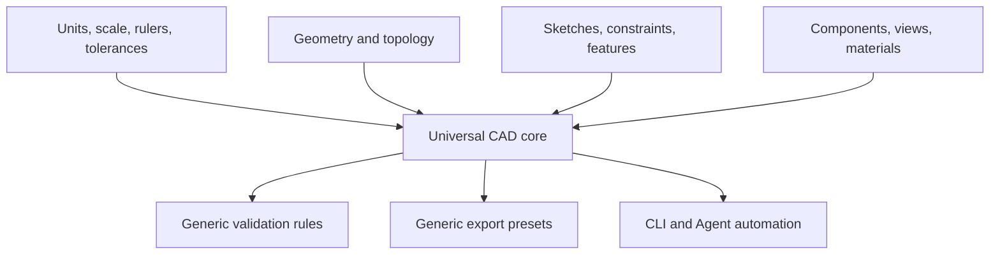
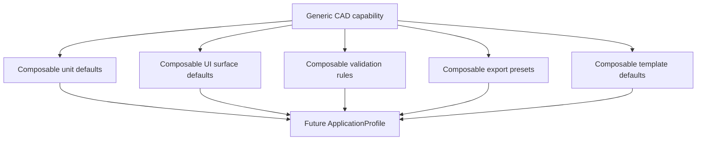

# Rupa Universal CAD Requirements

## Status

This document lists the general-purpose CAD capabilities Rupa must define before implementation.

| Field | Value |
|---|---|
| Product | Rupa |
| Scope | Universal CAD requirements |
| Core rule | No domain-specific app branches, document branches, or command branches |
| Required scale support | Micrometer (μm) detail through kilometer (km) scale modeling and drawing |
| Deferred extension | ApplicationProfile switching after the universal CAD implementation is complete |

## Universal CAD Concept

Rupa must provide one CAD model that can be used for precise parts, visual assets, products, fixtures, interiors, buildings, and other geometry-heavy workflows.

## 1. Units, Scale, and Rulers

Rupa must support modeling across small mechanical detail and building-scale contexts without switching products.

| Requirement | Contract |
|---|---|
| Internal length unit | Meter, inherited from Swift-CAD quantity rules. |
| Display length units | Micrometer (μm), millimeter, centimeter, meter, kilometer, inch, foot, and fractional architectural feet/inches. |
| Ruler scale | View rulers, grid labels, and compact canvas readouts must auto-scale from μm detail to km-scale layouts. |
| Editable scale fields | Ruler inputs should display the current value in readable units while storing the canonical meter value. |
| Mixed unit input | Inputs may accept explicit units different from the current display unit. |
| Unit conversion | All conversions must be finite, typed, and reversible within tolerance. |
| Dimension formatting | Scientific, decimal, fractional, and architectural formatting must be available where appropriate. |
| Scale bars | Saved views and drawing views must carry scale metadata. |
| Export units | Every export preset must declare output units and scale conversion. |

## 2. Precision and Tolerance

Generic CAD requires explicit tolerance rather than hidden global constants.

| Tolerance | Purpose |
|---|---|
| Modeling tolerance | Validity threshold for geometric operations. |
| Display tolerance | Rounding and dimension display threshold. |
| Selection tolerance | Hit testing and snapping threshold in screen and model space. |
| Constraint tolerance | Sketch and assembly constraint solving threshold. |
| Tessellation tolerance | Mesh export and viewport approximation threshold. |
| Import tolerance | Healing and validation threshold for external geometry. |
| Export tolerance | Output-specific approximation and validation threshold. |

Tolerance must be stored as document settings or operation settings and must be visible to diagnostics.

## 3. Coordinate Systems and Origins

Rupa must support small-detail and large-scene work without precision loss.

| Requirement | Contract |
|---|---|
| World coordinate system | Every document has one world coordinate system. |
| Local coordinate systems | Components, sketches, construction planes, drawing views, and imported references may own local coordinate systems. |
| Floating origin strategy | Large documents should evaluate and render through local origins where needed to avoid precision loss. |
| Axes | X, Y, Z axes and handedness must be explicit. |
| Up axis | Export presets must map Rupa's up axis to target format expectations. |
| Georeference metadata | Optional site/building metadata must be attachable without changing the CAD core. |

## 4. Grids, Snapping, and Measurement

Rupa must make scale visible and controllable.

| Tool | Requirement |
|---|---|
| Adaptive grid | Grid spacing adapts to zoom level and active unit display. |
| Fixed grid | User can lock grid spacing for precision workflows. |
| Grid scale readout | Canvas must expose the resolved minor grid step, major grid step, and visible span in readable units without changing internal meter storage. |
| Snap increments | Snap increments are unit-aware and independent from display rounding. |
| Object snaps | Endpoint, midpoint, center, tangent, perpendicular, intersection, face, edge, vertex, and construction references. |
| Measurement | Distance, angle, radius, diameter, area, volume, bounding box, wall thickness, clearance, and mass properties where material density exists. |
| Ruler overlays | View rulers must support micrometer, millimeter, centimeter, meter, kilometer, inch, foot, and drawing scale display. |

## 5. Geometry and Body Types

The universal model must keep geometric kinds distinct.

| Body type | Requirement |
|---|---|
| Solid body | Closed topology suitable for exact modeling, boolean operations, and physical validation. |
| Surface body | Open or closed surface topology for design, trimming, thickening, and visualization. |
| Mesh body | Triangle or polygon mesh for import, preview, repair, and export workflows. |
| Curve body | 2D or 3D curves used for paths, construction, profiles, and output. |
| Sketch body | Editable 2D source geometry and constraints. |
| Construction body | Planes, axes, points, coordinate systems, layout references, and grids. |

Conversions between body types must be explicit commands with diagnostics.

## 6. Parametric Modeling

Rupa must support source-level editability.

| Area | Requirement |
|---|---|
| Parameters | Named unit-aware parameters with formulas and dependency tracking. |
| Constraints | Sketch and geometric constraints with clear underdefined, fully defined, and overdefined states. |
| Feature graph | Ordered feature history with dependencies, suppression, regeneration, and diagnostics. |
| Direct edits | Direct edit commands must still participate in the command stack and source model. |
| Persistent references | Generated topology must have stable references where possible. |
| Variants | Parameter sets and configuration-like variants are required as generic model capability. |

## 7. Components and Assemblies

Rupa must support reusable structured models.

| Area | Requirement |
|---|---|
| Component definition | Reusable source definition with parameters, bodies, materials, and metadata. |
| Component instance | Transform, local origin, visibility, lock state, and overrides. |
| Hierarchy | Nested components and scene organization. |
| External references | Linked files or packages with version and update diagnostics. |
| Joints and constraints | Basic fixed, revolute, slider, planar, and rigid constraints. |
| Quantity extraction | Counts and metadata are extractable for schedules or reports. |

## 8. Materials and Metadata

Materials must serve visualization, physical validation, and export.

| Metadata | Requirement |
|---|---|
| Visual material | Base color, roughness, metallic, opacity, texture references. |
| Physical material | Density and optional mechanical properties. |
| Manufacturing material | Process-oriented metadata such as print material or stock material. |
| Classification | Optional semantic tags for building elements, products, parts, or assets. |
| Custom properties | User-defined typed metadata on document, component, body, face, or drawing objects. |

## 9. Views, Drawings, and Documentation

Documentation must be generic, not architecture-only.

| Object | Requirement |
|---|---|
| Saved view | Camera, projection, clipping, visibility, section state, and display scale. |
| Section view | Plane or volume section with drawing and viewport support. |
| Drawing view | Orthographic, projected, section, detail, and isometric views. |
| Dimensions | Linear, angular, radial, diameter, ordinate, elevation, and custom dimension annotations. |
| Sheets | Title blocks, scale, units, notes, tables, and export metadata. |
| Schedules | Generic table extraction from model metadata and quantities. |

## 10. Validation and Diagnostics

Validation must be generic and composable.

| Rule family | Examples |
|---|---|
| Geometry validity | Non-manifold topology, open boundaries, self-intersection, invalid trims. |
| Scale validity | Ambiguous unit, extreme coordinate range, export scale mismatch. |
| Manufacturing readiness | Thin wall, small feature, clearance, build volume, overhang. |
| Visualization readiness | Missing material, missing UVs, inverted normals, missing pivots. |
| Documentation readiness | Stale drawing view, missing dimension, missing metadata. |
| Interop readiness | Unsupported export feature, missing semantic mapping, lossy conversion. |

Validation rules must be callable from GUI, CLI file mode, CLI live mode, and automation.

## 11. Import, Export, and Presets

Rupa must make output intent explicit without becoming domain-specific.

| Concept | Requirement |
|---|---|
| Export preset | Named output settings for format, units, tessellation, metadata, validation rules, and destination policy. |
| Import report | Every import produces source provenance, unit assumptions, conversion diagnostics, and unsupported feature diagnostics. |
| Round-trip policy | Round-trip fidelity must be tested per format and documented. |
| Tessellation policy | Mesh output quality and limits must be explicit and reproducible. |
| Coordinate mapping | Up axis, handedness, and origin mapping must be explicit for every format. |

## 12. Automation Surface

Every universal CAD capability should be reachable through automation when safe.

| Area | Requirement |
|---|---|
| Command coverage | Core modeling, selection, validation, export, and document operations should have automation equivalents. |
| Structured output | CLI and Agent results must return typed diagnostics and document generation. |
| Live safety | Open documents route through the app session by default. |
| Batch operation | Batch commands must support dry run, expected generation, and deterministic result ordering. |
| Templates | New document creation from templates must be scriptable without changing document type. |

## 13. Performance and Scale

Generic CAD must remain usable across model sizes.

| Area | Requirement |
|---|---|
| Large coordinates | Building-scale coordinates and small details must not lose interactive precision. |
| Large assemblies | Component hierarchy and visibility must scale to many parts. |
| Incremental evaluation | Edits should invalidate only affected dependencies where possible. |
| Progressive rendering | Viewport can display intermediate or simplified results while evaluation continues. |
| Cancellable operations | Long import, export, tessellation, and evaluation operations must be cancellable. |

## 14. Required Acceptance Matrix

The same universal CAD model must satisfy these cases.

| Case | Scale | Required proof |
|---|---:|---|
| Micromechanical detail | Micrometer to millimeter | Ruler, snap, dimension, tolerance, export units remain correct. |
| Product part | Millimeter to centimeter | Parametric features, fillets, holes, materials, validation, STEP/STL/3MF export. |
| Visual asset | Centimeter to meter | Hierarchy, pivots, materials, normals, UVs, USD/GLB export. |
| Interior/building element | Meter | Levels or layout references, drawings, dimensions, schedules, DXF/PDF/IFC-oriented export. |
| Site and regional planning | Meter to kilometer | Grid labels, dimensions, Agent measurements, and exchange units remain readable without changing internal meter storage. |

## 15. Deferred ApplicationProfile Readiness

The universal CAD implementation must be profile-ready without requiring profiles during initial development.

| Design hook | Initial requirement |
|---|---|
| Unit defaults | Unit and ruler defaults are stored as generic document or template settings. |
| UI surface defaults | Component Browser visibility, bottom canvas toolbar tool groups, detail pane layout, and inspector property groups are configurable without changing command availability. |
| Validation rule sets | Validation rules are independently selectable and serializable. |
| Export preset sets | Export presets are independently selectable and serializable. |
| Template defaults | Templates configure defaults but produce the same `.swcad` document type. |
| CLI support | CLI can list and apply validation rules, export presets, and templates before profiles exist. |

Future `ApplicationProfile` may group these hooks under names such as visualization, fabrication, or building workflows, but those names must remain preset bundles over the universal CAD model.
