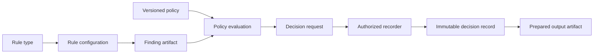

# Rupa Validation Contract

## Purpose

This document defines how universal and domain validation truthfully represents
configuration, pass/failure/uncertainty, geometric evidence, policy decisions,
authorized overrides, and export gating.

## Validation Concepts

Validation type, document configuration, execution result, release policy, and
audit decision are different concepts.

| Concept | Identity and owner | Lifetime |
|---|---|---|
| Rule type | Stable namespaced rule type ID, contract version, provider ID/version; registered by universal/domain validation module | Implementation contract |
| Rule configuration | Document-scoped configuration ID, rule type/version requirement, typed parameters, subject scope; editable source | Source history |
| Validation policy | Stable policy ID/version, canonical fingerprint, rule-configuration requirements, override authorization rules; editable source or immutable release policy | Policy revision |
| Finding | Immutable typed result bound to exact inputs and producer | Derived artifact |
| Policy evaluation | Pure result of policy + findings + current identities | Derived artifact |
| Decision request | Caller intent to authorize a specific blocked prepared operation | One project operation |
| Decision record | Controller-recorded actor/time/reason/policy/finding/input/prepared-artifact identity | Immutable audit state |

A random document UUID is not a rule type ID. A rule configuration may have a
UUID because multiple configurations of one rule type may exist. Findings include
both identities so policy and UI can distinguish them.

## Rule Configuration

A rule configuration contains:

- configuration ID;
- stable rule type ID and accepted contract-version range;
- typed subject scope;
- typed or schema-versioned parameter value;
- enabled state;
- optional user-facing label;
- canonical configuration fingerprint.

String dictionaries are not a typed validation configuration. Unknown registered
rule types are preserved as source but evaluate as `unsupported` until a compatible
provider is available.

## Finding Model

Every finding contains:

| Field | Requirement |
|---|---|
| Rule | Rule type ID/version, rule configuration ID/fingerprint, provider ID/version |
| Subject | Persistent model, semantic, external, or materialized-artifact references |
| Input identity | Complete source dependency set, typed configuration fingerprint, consumed artifact content identities, and optional session provenance |
| Outcome | `passed`, `failed`, `inconclusive`, or `unsupported` |
| Severity | Validation-owned diagnostic severity; severity never replaces outcome |
| Fidelity | `exact`, `conservativeEstimate`, `sampledApproximation`, or `heuristic` |
| Measurements | Typed quantities, units, comparisons, thresholds, tolerances, and uncertainty/error bounds where applicable |
| Regions | Artifact-bound evidence and completeness classification |
| Diagnostics | Stable diagnostic code, human explanation, and typed recovery action |
| Provenance | Inspectable rule settings, producer inputs/versions, elapsed/resource/copy measurements where required |
| Finding identity | Canonical fingerprint of every policy-relevant field above |

The input/configuration payload remains inspectable. A hash alone is insufficient
for explanation and audit.

## Outcome Semantics

| Outcome | Meaning |
|---|---|
| Passed | Implemented rule evaluated the complete declared case under stated fidelity and met its threshold |
| Failed | Rule evaluated the declared case and found a threshold or invariant violation |
| Inconclusive | Rule ran but geometry, resolution, tolerance, or evidence cannot support pass/fail |
| Unsupported | No compatible provider implements the required case or input kind |

`Unsupported` and `inconclusive` never become `passed` or an informational warning.

## Fidelity

| Fidelity | Contract |
|---|---|
| Exact | Exact source/B-rep semantics within declared modeling tolerance |
| Conservative estimate | Approximation is proven to err on the safe side for this rule/case |
| Sampled approximation | Result depends on tessellation/samples and reports resolution/error limits |
| Heuristic | Guidance without bounded geometric error; cannot satisfy an exact production gate |

Fidelity is not a globally ordered scalar. Policies declare an allowed set per
rule configuration and outcome. `exact`, `conservative`, and sampled results can
have rule-specific acceptance relationships.

## Region Completeness

| State | Meaning |
|---|---|
| Complete | All known evidence geometry for the declared rule/case is referenced |
| Representative | Bounded samples identify the issue but not its full extent |
| Summary only | Measurements exist without a geometric region |
| Unavailable | Provider cannot produce a region for this case |

Evidence requirements are declared per rule configuration and outcome. A passed
rule commonly has no violating region; that absence is not automatically a
completeness failure. A failed result eligible for override may require complete
or representative evidence before authorization.

## Policy

A policy has a stable ID, explicit version, canonical fingerprint, and one
requirement per rule configuration. Requirements declare:

- accepted outcomes;
- accepted fidelity set;
- evidence/region requirements per outcome;
- current dependency and artifact-content requirements;
- whether override is permitted;
- required authorization class and decision scope;
- whether missing or additional rule configurations block.

Unknown required rules block. Advisory findings remain visible but do not satisfy
or alter required rules implicitly. Changing policy requirements changes the
policy fingerprint, so an old decision record cannot authorize a new policy.

## Decision Recording and Override

Validation evaluation is pure. It never mutates source or records its own
override.

An external caller submits a decision request containing the exact policy
evaluation, blocking finding fingerprints, reason, and desired operation. The
`ProjectController`:

1. authenticates or resolves the caller principal;
2. checks project/policy authorization;
3. rechecks current source dependencies and prepared artifact content;
4. supplies authoritative actor identity and clock time;
5. writes an immutable decision record;
6. atomically publishes the authorized prepared output and record.

Clients cannot choose the authoritative actor, timestamp, record ID, policy
fingerprint, or prepared-artifact fingerprint.

A decision record contains:

- record ID and record schema version;
- policy ID/version/fingerprint;
- decision (`allow`, `block`, or `override`);
- exact finding fingerprints and policy failure reasons;
- exact source dependency, configuration, and consumed-artifact identities;
- exact prepared output content fingerprint and operation scope;
- authoritative actor/principal and timestamp;
- reason;
- optional revocation record identity.

Decision records are audit state, not `ProductMetadata`, and do not advance source
transaction revision or source content identity. A revocation appends a record; it
does not rewrite history.

## Manufacturing Requirements

Manufacturing validation additionally consumes:

| Input | Requirement |
|---|---|
| Process definition | Typed process family and support strategy |
| Machine definition | Build volume, process limits, and machine-specific thresholds |
| Material definition | Process-compatible material and physical limits |
| Build frame | Persisted semantic source defining orientation and origin |
| Geometry artifact | Exact B-rep or identified materialized mesh with tolerance/options |
| Output policy | Format units, material/process mapping, fidelity, and validation policy |

Powder-bed validation distinguishes geometric overhang behavior from trapped
powder and escape-path support. Missing escape-path analysis is `unsupported`.

## Simulation Requirements

Simulation findings include solver version, execution environment, input
fingerprints, mesh settings, material/fluid properties, boundary conditions,
convergence, and uncertainty. Imported visual fields without convergence and
benchmark evidence cannot satisfy a validated efficiency claim.

## UI, CLI, and Agent

- All adapters render/encode the same typed findings and policy evaluation.
- Human messages supplement structured fields; callers never parse messages for
  safety decisions.
- Results are filterable by rule type/configuration, outcome, severity, subject,
  dependency, and artifact identity.
- Regions resolve through the shared reference service.
- Stale findings remain inspectable but cannot satisfy a current policy.
- Raw domain payload JSON may add detail but never replaces the shared finding,
  evaluation, or decision schema.

## Performance

Validation providers declare fixture size, wall-clock budget, peak resident
memory, cancellation latency, and geometry-copy budget. Quadratic algorithms need
an explicit input ceiling or acceleration structure before dense-model
conformance.

## Required Tests

| Test family | Required cases |
|---|---|
| Configuration | Multiple configurations of one rule type remain distinct and round-trip |
| Outcome | Passed, failed, inconclusive, and unsupported remain distinct through all adapters and export policy |
| Fidelity | Exact, conservative, sampled, and heuristic results obey rule-specific sets |
| Freshness | Source dependency, configuration, process, build frame, provider, or consumed artifact changes invalidate correctly; session revision alone does not |
| Regions | Complete/representative/summary/unavailable and exact artifact binding round-trip |
| Policy | Required missing/unsupported/inconclusive rules block and policy fingerprint changes invalidate decisions |
| Decision | Caller cannot forge actor/time/identity; exact prepared output and findings are required; revocation is append-only |
| Domain | Process-specific combinations and unsupported cases use authoritative fixtures |
| Performance | Dense fixtures enforce time, memory, cancellation, and copy budgets |
