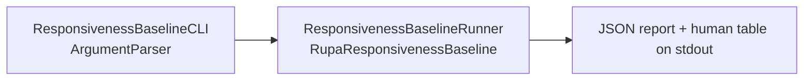

# RupaResponsivenessBaselineCLI

## Purpose and Scope

This module exposes the responsiveness baseline measurement as one dedicated
process, `rupa-responsiveness-baseline`, so a baseline can be recorded from a
release build and compared later without a graphical session.

- Design hierarchy: module.
- Parent: [RupaBenchmarks package design](../../DESIGN.md).
- Children: none.

## Responsibilities and Boundaries

| Owned | Not owned |
|---|---|
| Argument parsing, the report encoding, and the process exit code. | The fixture, the measurement, and the acceptance thresholds. |
| Recording the caller-supplied environment inputs into the report. | Deriving what those inputs mean. |
| Resolving the two repository revisions the report records. | Deciding that a report without them is incomparable. |

## Related Designs

| Design | Relationship | Contract Used | Summary | Cautions |
|---|---|---|---|---|
| [RupaBenchmarks package design](../../DESIGN.md) | parent | Package composition and target index | Registers this executable as an upper-level measurement target. | Production authority modules must not depend on it. |
| [RupaResponsivenessBaseline design](../RupaResponsivenessBaseline/DESIGN.md) | depends on | `ResponsivenessFixture`, `ResponsivenessBaselineRunner`, `ResponsivenessBaselineReport` | Supplies the fixture, the measurement, and the per-row verdicts. | The CLI must not compute or adjust a verdict. The module measures no drawing, so no exit code can report a drawing verdict. |

## Architecture

## Contracts and Invariants

1. The process exits with a non-zero code when the measurement fails, when any
   acceptance row rejects, and when any acceptance row was not measured, so
   neither a rejecting nor an incomplete baseline can be mistaken for a passing
   one by a script. The three outcomes carry distinct codes so a script can tell
   them apart.

   | Outcome | Exit code |
   |---|---|
   | Every row accepts | `0` |
   | The measurement failed and no report was produced | `1` |
   | At least one row rejects | `2` |
   | No row rejects and at least one was not measured | `3` |

   Exit code `0` is currently unreachable, and that is a design position rather
   than an oversight. The measurement module reports no drawing duration
   because the shipped viewport draws through a mounted RealityKit frame no
   offscreen process can bring up, so the drawing row is permanently not
   measured. The best outcome a clean run can produce is therefore `3`. A
   script must treat `3` as the expected success of this command and must not
   wait for `0`.
2. The report written to stdout is the value the measurement module produced.
   The CLI does not add, drop, or round a measured value.
3. Environment inputs not supplied on the command line are the module's derived
   defaults, and the report states which were derived.
4. Both repository revisions are read from the working trees the measurement was
   built from. A revision that cannot be read is a typed failure, never a
   placeholder, because a report carrying an invented revision would be compared
   against the wrong sources.
5. A working tree with uncommitted changes under the recorded path records its
   revision with a `-dirty` suffix, because the measured sources are then not
   the ones the revision names. The status is scoped to the package path, so
   unrelated changes elsewhere in a repository that holds other packages do not
   mark the revision.

## Failure, Concurrency, and Constraints

The command runs on `MainActor` because the measurement is `MainActor`-isolated.
Every failure is reported as the underlying typed error; no failure produces a
partial report.

## Verification and Change Impact

The executable cannot be imported by a test target, so its invariants are
evidenced by the recorded baseline run rather than by a unit test. The recorded
run is the evidence artefact, and every row below is checked against the same
built binary in the same session.

| Invariant | Required evidence |
|---|---|
| Exit codes | The recorded run's observed exit code matches the outcome its report states, and a run against a path that is not a repository exits `1` without emitting a report. The recorded run predates the removal of the drawing measurement, so its rejecting `2` is history, not the current best outcome. |
| Revision recording | The recorded report names both revisions, and a run from a working tree with uncommitted changes under the package path records the `-dirty` suffix. |
| Unmodified report | The emitted JSON decodes to a report equal to the one the runner returned, which [RupaResponsivenessBaseline](../RupaResponsivenessBaseline/DESIGN.md) evidences at the report level. |

Changing the report shape requires rechecking
[RupaResponsivenessBaseline](../RupaResponsivenessBaseline/DESIGN.md) and every
recorded baseline that is still cited as evidence.
