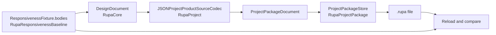

# RupaResponsivenessFixtureDocument

## Purpose and Scope

This module materializes the responsiveness fixture as a project package so a
signed application can be measured against the content the in-process harness
measured, rather than against a scene that merely resembles it.

- Design hierarchy: module.
- Parent: [RupaBenchmarks package design](../../DESIGN.md).
- Children: none.

## Responsibilities and Boundaries

| Owned | Not owned |
|---|---|
| Projecting the fixture's bodies into a `DesignDocument` and a `ProjectPackageDocument`. | The fixture content, which [RupaResponsivenessBaseline](../RupaResponsivenessBaseline/DESIGN.md) owns. |
| Proving the written package reloads to the fixture before reporting success. | The package format, the codec, and the store's own integrity checks. |
| Reporting a difference between the written package and the fixture as a typed failure. | Deciding what the application does with the document once it is open. |

The module is deliberately separate from
[RupaResponsivenessBaseline](../RupaResponsivenessBaseline/DESIGN.md) rather
than folded into it. The measurement binary records a resident-footprint
baseline, so linking the project, package, and codec stack into that binary
would change the footprint the recorded baseline was taken against. Keeping the
document writer in its own target leaves the measurement binary's link set
unchanged.

## Related Designs

| Design | Relationship | Contract Used | Summary | Cautions |
|---|---|---|---|---|
| [RupaBenchmarks package design](../../DESIGN.md) | parent | Package composition and target index | Registers this module as an upper-level measurement support target. | Production authority modules must not depend on it. |
| [RupaResponsivenessBaseline design](../RupaResponsivenessBaseline/DESIGN.md) | depends on | `ResponsivenessFixture`, `ResponsivenessFixture.Body` | Supplies the fixture bodies, their authored mesh assets, and their placements. | The writer must not rebuild the fixture geometry; it writes the assets the fixture built. |
| [RupaProjectPackage design](../../../RupaKit/Sources/RupaProjectPackage/DESIGN.md) | depends on | `ProjectPackageStore.save`, `ProjectPackageStore.load`, `ProjectPackageDocument` | Writes and reloads the package with the same store the application uses. | The store's own save-time validation is not treated as sufficient; the writer reloads independently. |
| [RupaProject design](../../../RupaKit/Sources/RupaProject/DESIGN.md) | depends on | `JSONProjectProductSourceCodec` | Encodes and decodes the Product source the package carries. | The writer must use the production codec so the application decodes what was written. |
| [RupaCore design](../../../RupaKit/Sources/RupaCore/DESIGN.md) | depends on | `DesignDocument`, `ProductMetadata`, `SceneNode`, `ObjectDescriptor` | Builds the document the codec encodes. | Document validation is a precondition of writing, not an optional check. |

## Architecture

## Contracts and Invariants

1. The written document carries the authored mesh assets the fixture built. The
   writer never re-tessellates or re-derives the geometry, because a second
   construction would not be the measured fixture.
2. Every fixture body becomes one visible mesh body scene node whose modeling
   and presentation representations both resolve to that body's authored mesh
   source, and whose local transform is the placement the fixture gave it.
3. Success is reported only after the written file is reloaded through
   `ProjectPackageStore` and the reloaded authored mesh assets, body count,
   vertex total, and face total all equal the fixture's. Any difference is
   `writtenPackageDiffersFromFixture`.
4. Every failure is a `ResponsivenessFixtureDocumentError` naming the stage that
   failed. No stage returns a partially written document as success, and no
   stage substitutes a default for a value it could not produce.
5. The fixture carries no CAD features, so the package records no CAD source.
   This is a property of the fixture, not a general rule for documents.

## Verification and Change Impact

`RupaResponsivenessFixtureDocumentTests` owns the evidence and reloads the
written file through `ProjectPackageStore` directly, so the writer's own
verification is never the only witness.

| Invariant | Required evidence |
|---|---|
| Fixture meshes are written unchanged | An independent reload of the written file returns authored mesh assets equal to the fixture's bodies. |
| Every body is a placed mesh body | The decoded Product source presents one authored-mesh scene node per body, each a `.body` object with the `.mesh` role, a presentation representation, and a placement distinct from every other body's. |
| Reported counts are the reloaded counts | The reported body, vertex, and face counts equal the fixture's, and two writes of the same fixture reload to equal assets. |
| Typed failures | An unwritable destination throws `ResponsivenessFixtureDocumentError` rather than reporting a written document. |

Changing the fixture content requires re-recording every application-side
measurement taken against a previously written document, because the document is
the fixture's identity on the application side.
