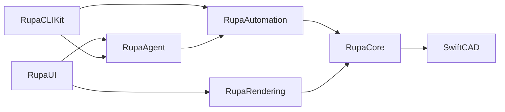

# RupaKit Architecture

RupaKit is organized by execution boundary. Keep new code close to the layer that owns the state it mutates or the view it renders.

| Area | Owns | Must not own |
|---|---|---|
| `RupaCore` | Document state, CAD commands, validation, domain services | UI state, transport protocol, CLI parsing |
| `RupaCore/Surface` | Surface analysis, PolySpline editing, UVN frame and source summaries | Viewport drawing or Agent request routing |
| `RupaAutomation` | Stable command vocabulary and command execution bridge | Agent protocol envelopes or view-specific state |
| `RupaAgent` | Agent-facing request/response protocol and workspace routing | CAD mutation logic outside Automation/Core |
| `RupaRendering` | Viewport scene models, hit testing, drawing, interaction geometry | Persistent document mutation |
| `RupaRendering/Scene` | Viewport scene data model and scene construction | SwiftUI view layout |
| `RupaUI` | SwiftUI application state, command panels, inspectors | Core CAD algorithms |
| `RupaCLIKit` | Argument parsing and terminal response formatting | Core editing behavior |

## File Size Targets

| File kind | Target | Required action when exceeded |
|---|---:|---|
| Domain type or service | 700 lines | Split helper services or value types by responsibility |
| SwiftUI view | 900 lines | Extract focused subviews and state objects |
| Rendering interaction surface | 1,200 lines | Extract geometry, hit testing, and draw layers |
| Integration test file | 1,500 lines | Split by workflow and move fixtures to dedicated files |

## Current Large-File Backlog

| File | Current issue | Preferred next split |
|---|---|---|
| `RupaCore/DesignDocument.swift` | Command facade also contains many command implementations and private helpers | Move commands into `DesignDocument+Sketch`, `DesignDocument+Solid`, `DesignDocument+Surface`, and shared internal command utilities |
| `RupaRendering/Viewport.swift` | Drawing, hit testing, drag state, and interaction commit logic share one SwiftUI type | Extract draw layers and drag controllers without changing the public `Viewport` API |
| `RupaUI/MainView.swift` | Workspace layout, command panels, keyboard handling, and inspectors share one view | Extract command panels, workspace rail, and keyboard router |
| `RupaAgentTests/AgentCommandIntegrationTests.swift` | Broad integration workflows remain grouped in one file | Split by dimensions, modeling, sketch curves, snapping, persistence, and topology |
