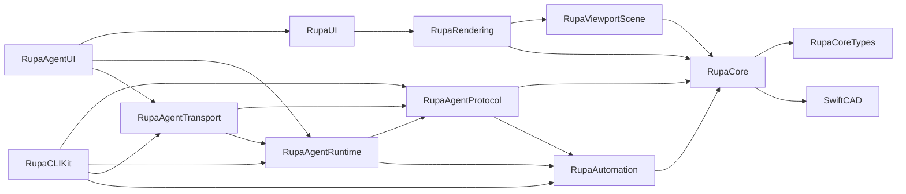

# RupaKit Architecture

RupaKit is organized by execution boundary. Keep new code close to the layer that owns the state it mutates or the view it renders.

| Area | Owns | Must not own |
|---|---|---|
| `RupaCoreTypes` | Shared foundation DTOs such as errors, diagnostics, document generation, display units, and save result | CAD feature evaluation, SwiftCAD document mutation, UI state |
| `RupaCore` | Document state, CAD commands, validation, domain services | UI state, transport protocol, CLI parsing |
| `RupaCore/Surface` | Surface analysis, PolySpline editing, UVN frame and source summaries | Viewport drawing or Agent request routing |
| `RupaAutomation` | Stable command vocabulary and command execution bridge | Agent protocol envelopes or view-specific state |
| `RupaAgentProtocol` | Agent-facing request/response schema, envelopes, codec, capabilities, and protocol summaries | Workspace registry, socket IO, CAD mutation logic |
| `RupaAgentRuntime` | Workspace registry, main-actor bridge, and request handling through Automation/Core | Unix socket IO, SwiftUI workspace layout |
| `RupaAgentTransport` | Unix socket listener/client and socket path/address utilities | Agent command semantics or CAD mutation logic |
| `RupaAgent` | Compatibility facade that re-exports protocol, runtime, and transport | New implementation ownership |
| `RupaViewportScene` | Viewport scene data model, scene construction, projection basis, hit policy, identity pick index, and viewport transform utilities | SwiftUI view layout, Metal drawing backend |
| `RupaRendering` | SwiftUI viewport, drawing backend, interaction geometry, and rendering affordance services | Persistent document mutation |
| `RupaUI` | SwiftUI workspace state, command panels, inspectors, and `WorkspaceAgentHost` abstraction | Agent socket/runtime implementation or Core CAD algorithms |
| `RupaAgentUI` | Concrete Agent host composition for SwiftUI workspaces | Workspace editing UI or Agent protocol schema |
| `RupaCLIKit` | Argument parsing and terminal response formatting | Core editing behavior |

## Dependency Rules

| Rule | Reason |
|---|---|
| `RupaCoreTypes` is below `RupaCore`; it must stay free of SwiftCAD mutation and UI/Agent dependencies. | Sketch, Surface, Automation, Agent, and CLI need stable shared DTOs without pulling modeling services. |
| `RupaAgentProtocol` must not depend on `RupaAgentRuntime` or `RupaAgentTransport`. | Tooling can encode/decode requests without loading workspace registries or socket code. |
| `RupaAgentTransport` may depend on runtime, but runtime must not depend on transport. | In-process controllers and tests should run without Unix socket ownership. |
| `RupaUI` depends on `WorkspaceAgentHost`, not concrete `AgentHost`. | The CAD workspace can be understood and reused without Agent server lifecycle details. |
| `RupaRendering` consumes `RupaViewportScene`; scene construction must remain SwiftUI-free. | Viewport scene, projection, and hit policy can be tested without UI composition. |

## File Size Targets

| File kind | Target | Required action when exceeded |
|---|---:|---|
| Domain type or service | 700 lines | Split helper services or value types by responsibility |
| SwiftUI view | 900 lines | Extract focused subviews and state objects |
| Rendering interaction surface | 1,200 lines | Extract geometry, hit testing, and draw layers |
| Integration test file | 1,500 lines | Split by workflow and move fixtures to dedicated files |

## Current Large-File Backlog

| File | Current issue | Preferred next split |
|---|---|---|
| `RupaCore/DesignDocument.swift` | Command facade also contains many command implementations and private helpers | Move commands into `DesignDocument+Sketch`, `DesignDocument+Solid`, `DesignDocument+Surface`, and shared internal command utilities |
| `RupaRendering/Viewport.swift` | Drawing, hit testing, drag state, and interaction commit logic share one SwiftUI type | Extract draw layers and drag controllers without changing the public `Viewport` API |
| `RupaUI/MainView.swift` | Workspace layout, command panels, keyboard handling, and inspectors share one view | Extract command panels, workspace rail, and keyboard router |
| `RupaAgentTests/AgentIntegrationFixtures.swift` | Agent test fixtures and geometry builders remain grouped in one support file | Split fixture builders by sketch, solid, surface, pattern, topology, and transport workflows |

## Completed Organization Splits

| Former file | Split into |
|---|---|
| `RupaAgentTests/AgentCommandControllerTests.swift` | Capability contract tests and protocol codec/fixture tests |
| `RupaAgentTests/AgentCommandIntegrationTests.swift` | Agent workflow test files for display, projection, dimensions, construction planes, direct modeling, patterns, sketch commands, inspection, offsets, sweeps/revolves, topology, persistence, and transport |
