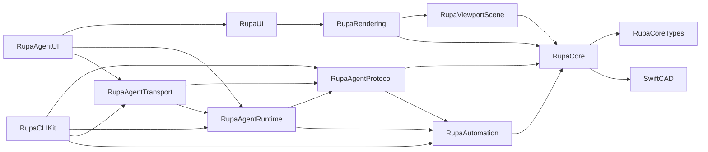

# RupaKit Architecture

RupaKit is organized by execution boundary. Keep new code close to the layer that owns the state it mutates or the view it renders.

| Area | Owns | Must not own |
|---|---|---|
| `RupaCoreTypes` | Shared foundation DTOs such as errors, diagnostics, document generation, display units, and save result | CAD feature evaluation, SwiftCAD document mutation, UI state |
| `RupaCore` | Document state, CAD commands, validation, domain services | UI state, transport protocol, CLI parsing |
| `RupaCore/Surface` | Surface analysis, PolySpline editing, UVN frame and source summaries | Viewport drawing or Agent request routing |
| `RupaAutomation` | Stable command vocabulary and command execution bridge | Agent protocol envelopes or view-specific state |
| `RupaAgentProtocol` | Agent-facing request/response schema, envelopes, codec, capabilities, and protocol summaries | Workspace registry, socket IO, CAD mutation logic |
| `RupaAgentRuntime` | Workspace registry, main-actor bridge, and request handling through Automation/Core | Unix socket IO, SwiftUI workspace layout |
| `RupaAgentTransport` | Unix socket listener/client and socket path/address utilities | Agent command semantics or CAD mutation logic |
| `RupaAgent` | Compatibility facade that re-exports protocol, runtime, and transport | New implementation ownership |
| `RupaViewportScene` | Viewport scene data model, scene construction, projection basis, hit policy, identity pick index, and viewport transform utilities | SwiftUI view layout, Metal drawing backend |
| `RupaRendering` | SwiftUI viewport, drawing backend, interaction geometry, and rendering affordance services | Persistent document mutation |
| `RupaUI` | SwiftUI workspace state, command panels, inspectors, and `WorkspaceAgentHost` abstraction | Agent socket/runtime implementation or Core CAD algorithms |
| `RupaAgentUI` | Concrete Agent host composition for SwiftUI workspaces | Workspace editing UI or Agent protocol schema |
| `RupaCLIKit` | Argument parsing and terminal response formatting | Core editing behavior |

## Dependency Rules

| Rule | Reason |
|---|---|
| `RupaCoreTypes` is below `RupaCore`; it must stay free of SwiftCAD mutation and UI/Agent dependencies. | Sketch, Surface, Automation, Agent, and CLI need stable shared DTOs without pulling modeling services. |
| `RupaAgentProtocol` must not depend on `RupaAgentRuntime` or `RupaAgentTransport`. | Tooling can encode/decode requests without loading workspace registries or socket code. |
| `RupaAgentTransport` may depend on runtime, but runtime must not depend on transport. | In-process controllers and tests should run without Unix socket ownership. |
| `RupaUI` depends on `WorkspaceAgentHost`, not concrete `AgentHost`. | The CAD workspace can be understood and reused without Agent server lifecycle details. |
| `RupaRendering` consumes `RupaViewportScene`; scene construction must remain SwiftUI-free. | Viewport scene, projection, and hit policy can be tested without UI composition. |

## File Size Targets

| File kind | Target | Required action when exceeded |
|---|---:|---|
| Domain type or service | 700 lines | Split helper services or value types by responsibility |
| SwiftUI view | 900 lines | Extract focused subviews and state objects |
| Rendering interaction surface | 1,200 lines | Extract geometry, hit testing, and draw layers |
| Integration test file | 1,500 lines | Split by workflow and move fixtures to dedicated files |

## Current Large-File Backlog

| File | Current issue | Preferred next split |
|---|---|---|
| `RupaRendering/Viewport.swift` | Drawing, hit testing, and interaction commit logic still share one SwiftUI type | Extract draw layers and drag controllers now that interaction/edit support types are separate |
| `RupaUI/MainView.swift` | Inspector sections still share one view | Extract document, object, sketch, and surface inspector sections into focused views/services |

## Completed Organization Splits

| Former file | Split into |
|---|---|
| `RupaAgentTests/AgentCommandControllerTests.swift` | Capability contract tests and protocol codec/fixture tests |
| `RupaAgentTests/AgentCommandIntegrationTests.swift` | Agent workflow test files for display, projection, dimensions, construction planes, direct modeling, patterns, sketch commands, inspection, offsets, sweeps/revolves, topology, persistence, and transport |
| `RupaAgentTests/AgentIntegrationFixtures.swift` | Agent support files for socket transport, sketch/profile fixtures, topology targets, selection dimensions, and pattern arrays |
| `RupaCore/DesignDocument.swift` | Focused document command extensions for construction planes, section planes, and measurement annotations |
| `RupaCore/DesignDocument.swift` | Pattern array command extension plus dedicated output synchronizer and ownership resolver services |
| `RupaCore/DesignDocument.swift` | Focused document command extensions for document settings, parameters, components, and simple scene-node edits |
| `RupaCore/DesignDocument.swift` | Focused display command extension plus display target component resolver |
| `RupaCore/DesignDocument.swift` | Object property source writeback command and source synchronization helpers |
| `RupaCore/DesignDocument.swift` | Solid creation commands for extrude, revolve, sweep, primitive extrusion, plus shared command value and feature mutation helpers |
| `RupaCore/DesignDocument.swift` | Solid direct-editing commands for face offset, edge chamfer, edge fillet, vertex move, plus shared body target resolution |
| `RupaCore/DesignDocument.swift` | Surface and PolySpline source commands for surface creation, vertex/control-point moves, and surface slides |
| `RupaCore/DesignDocument.swift` | Basic sketch creation commands for line, circle, arc, spline, rectangle, polygon, plus shared sketch feature mutation |
| `RupaCore/DesignDocument.swift` | Sketch projection and face-derived sketch commands for face knife, construction-plane projection, generated-face projection, and body outline projection |
| `RupaCore/DesignDocument.swift` | Object dimension commands for extrude distance, cube dimensions, cylinder dimensions, object dimension dispatch, and extruded body dimension resolution |
| `RupaCore/DesignDocument.swift` | Slot sketch commands for open line, arc, line-arc, and sampled spline slots plus Offset Curve slot-mode dispatch |
| `RupaCore/DesignDocument.swift` | Sketch constraint add/remove commands with constraint propagation and sketch object source synchronization |
| `RupaCore/DesignDocument.swift` | Bridge curve creation and parameter update commands with bridge continuity, trimming, and source ownership helpers |
| `RupaCore/DesignDocument.swift` | Sketch region offset commands for individual and combined profile-region offsets plus Offset Curve region dispatch |
| `RupaCore/DesignDocument.swift` | Offset Curve command dispatch for sketch curves, regions, generated face loops, generated edges, generated vertices, and shared planar offset helpers |
| `RupaCore/DesignDocument.swift` | Align Vertex command and continuity-constraint helpers plus shared sketch entity target resolution helpers |
| `RupaCore/DesignDocument.swift` | Sketch spline control-point insertion command with Bezier span splitting and constraint/dimension reference migration helpers |
| `RupaCore/DesignDocument.swift` | Sketch circle and arc parameter update commands with constraint-aware center/radius propagation |
| `RupaCore/DesignDocument.swift` | Sketch entity dimension command, rectangle side dimension resizing, and profile arc radius rewrite split into focused sketch dimension extensions |
| `RupaCore/DesignDocument.swift` | Sketch vertex offset command split from generated-topology vertex target resolution and source sketch endpoint splitting helpers |
| `RupaCore/DesignDocument.swift` | Sketch point, line, and spline control-point movement commands with handle resolution and spline slide direction helpers |
| `RupaCore/DesignDocument.swift` | Sketch corner treatment command split from shared corner endpoint geometry and fillet construction helpers |
| `RupaCore/DesignDocument.swift` | Sketch curve conversion commands for line-to-arc and line-to-spline split from shared curve editing helpers |
| `RupaCore/DesignDocument.swift` | Sketch curve reversal command split from reference, dimension, and Bridge Curve metadata rewrite helpers |
| `RupaCore/DesignDocument.swift` | Sketch curve extension command split from endpoint resolution, extension geometry, and validation helpers |
| `RupaCore/DesignDocument.swift` | Sketch curve trim command split from segment-removal validation and reference filtering helpers |
| `RupaCore/DesignDocument.swift` | Sketch curve split command split from shared split geometry primitives and reference migration helpers |
| `RupaCore/DesignDocument.swift` | Sketch curve cut command split from source curve mutation and sampled curve intersection geometry helpers |
| `RupaCore/DesignDocument.swift` | Sketch curve join and unjoin commands split from join ownership metadata and reference migration planning helpers |
| `RupaCore/DesignDocument.swift` | Sketch curve rebuild command split from rebuild fitting, analytic deviation, shared rebuild types, and reference migration helpers |
| `RupaCore/DesignDocument+SketchCurveJoinPlanning.swift` | Sketch curve join planning split into line-pair planning, curve-group planning, shared join types, and unjoin validation helpers |
| `RupaCore/DesignDocument.swift` | Sketch selection types, reference utilities, dimension measurement, sketch geometry helpers, and sketch object synchronization split into focused document extensions |
| `RupaCore/DesignDocument+SelectionDimension.swift` | Selection dimension commands split into application routing, target application, point context resolution, curve context resolution, geometry helpers, and shared selection-dimension types |
| `RupaCore/DesignDocument+SketchCurveCutGeometry.swift` | Cut Curve geometry split into target planning, analytic intersections, sampled spline intersections, resolution helpers, shared cut types, and shared cut utilities |
| `RupaCore/DesignDocument+SolidDirectEditing.swift` | Solid direct editing split into face offset, edge treatment, vertex move, target resolution, profile-loop mapping, and shared direct-editing types |
| `RupaCore/DesignDocument+SketchProjection.swift` | Sketch projection commands split into command entry points, source-curve projection, generated-edge projection, outline projection, and shared projection geometry helpers |
| `RupaRendering/Viewport.swift` | Viewport interaction state, object edit state, sketch geometry support, and selection/theme support split from the main SwiftUI viewport surface |
| `RupaUI/MainView.swift` | MainView support DTOs, inspector state value types, and shared workspace glass modifier split from the main SwiftUI workspace surface |
| `RupaUI/MainView.swift` | Workspace chrome controls and tool palette split from the main SwiftUI workspace surface |
| `RupaUI/MainView.swift` | Polygon and Sweep context panels split into standalone workspace panel views with command callbacks owned by MainView |
| `RupaUI/MainView.swift` | Dimension, Slot, Edge Offset, and Region Offset context panels split into standalone workspace panel views with command callbacks owned by MainView |
| `RupaUI/MainView.swift` | Curve and Surface CV slide context panels split into standalone workspace panel views with command callbacks owned by MainView |
| `RupaUI/MainView.swift` | Workspace keyboard interpretation split into a pure action router with package tests; MainView now applies resolved actions |
| `RupaUI/MainView.swift` | Inspector layout primitives and numeric controls split into reusable workspace inspector helpers |
| `RupaUI/MainView.swift` | Document, scene, asset, unit, and ruler inspector sections split into a dedicated document inspector view |
| `RupaUI/MainView.swift` | Object selection, reference, and hierarchy inspector sections split into overview state building and reusable text-section views |
| `RupaUI/MainView.swift` | Object visibility, lock, transform, matrix, and material inspector editing split into a dedicated transform inspector view with session mutations injected by MainView |
| `RupaUI/MainView.swift` | Object shape dimensions and schema-property editing split into a dedicated shape inspector view with mutation callbacks owned by MainView |
| `RupaUI/MainView.swift` | Sketch curve selection and analysis display split into a dedicated curve inspector view with display toggles injected by MainView |
| `RupaUI/MainView.swift` | Bridge Curve source, continuity, parameter, and tension controls split into a dedicated bridge curve inspector view with mutation callbacks owned by MainView |
| `RupaUI/MainView.swift` | Spline endpoint tangency and smoothness constraint controls split into a dedicated endpoint constraint view with mutation callbacks owned by MainView |
| `RupaUI/MainView.swift` | Spline control point index, move, slide, and smooth control-point constraint controls split into a dedicated control point view with mutation callbacks owned by MainView |
| `RupaUI/MainView.swift` | Face, edge, vertex, and region direct-edit inspector sections split into a topology edit inspector state/view pair with selection resolution owned by MainView |
| `RupaUI/MainView.swift` | Surface analysis and continuity inspector rendering split into a dedicated surface inspector view with selection/result resolution owned by MainView |
| `RupaUI/MainView.swift` | Sketch curve operation controls for projection, alignment, vertex offset, corner treatment, extend, and join split into a dedicated operation controls state/view pair |
| `RupaUI/MainView.swift` | Sketch entity point, endpoint, and center move controls split into a dedicated point move controls view with mutation callback owned by MainView |
| `RupaUI/MainView.swift` | Spline rebuild, refit, explicit-control, and core spline action controls split into a dedicated spline edit operations view |
| `RupaUI/MainView.swift` | Object shape inspector DTO construction split into a dedicated shape inspector state builder with scene projection owned outside MainView |
| `RupaUI/MainView.swift` | Sketch entity inspector resolution, curve analysis readback, Bridge Curve readback, and sketch operation availability split into a dedicated state builder |
| `RupaUI/MainView.swift` | Surface CV inspector state, surface analysis, surface continuity, and generated-topology filtering split into a dedicated surface inspector state builder |
| `RupaUI/MainView.swift` | Topology direct-edit selection classification and generated-edge projection target filtering split into a dedicated topology inspector state builder |
| `RupaUI/MainView.swift` | Construction Plane target eligibility and sketch-point target discovery split into a dedicated target selection builder |
| `RupaUI/MainView.swift` | Shared SelectionTarget component classification and Dimension target eligibility split into a reusable workspace selection classifier |
| `RupaUI/MainView.swift` | Viewport hit to SelectionTarget resolution, scene-node fallback, and rectangle-selection dedupe split into a workspace target resolver |
