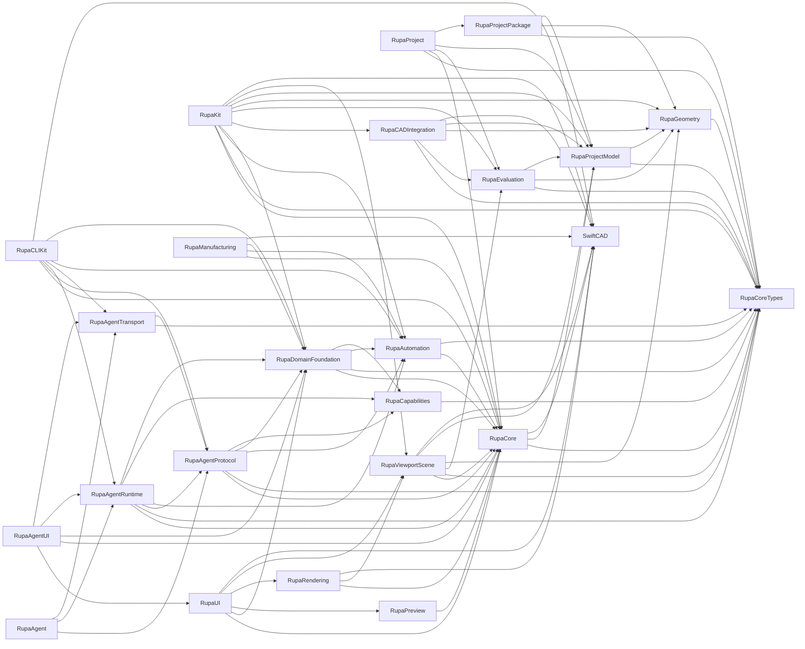
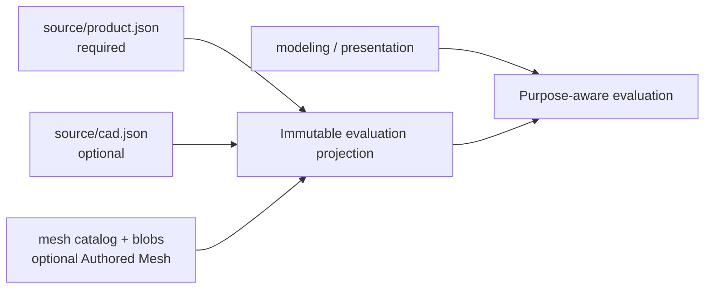
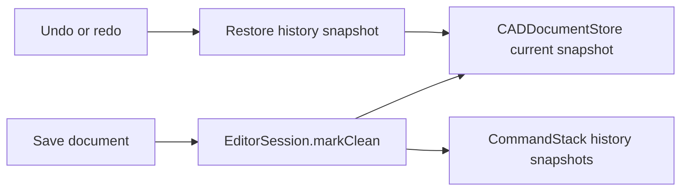

# RupaKit Architecture

RupaKit is organized by execution boundary. Keep new code close to the layer that owns the state it mutates or the view it renders.

UI layout, canvas overlay, and affordance rules live in [DESIGN_GUIDE.md](DESIGN_GUIDE.md). Keep architectural ownership rules here and visual interaction rules in the design guide.

This file describes the currently implemented package graph. The normative target
for CAD source, Authored Mesh, derived Mesh snapshots, reconstruction inputs, rendering, and
package SSOT is
[`CAD_MESH_RESPONSIBILITY_CONTRACT.md`](../Rupa/CAD_MESH_RESPONSIBILITY_CONTRACT.md).
The current graph contains an unreleased package/source boundary that must be
replaced before RupaKit project integration. A permanent compatibility layer must
not preserve that incorrect development contract.

```mermaid
flowchart LR
    Capabilities[RupaCapabilities] --> CoreTypes[RupaCoreTypes]
    Geometry[RupaGeometry] --> CoreTypes
    ProjectModel[RupaProjectModel] --> CoreTypes
    ProjectModel --> Geometry
    ProjectPackage[RupaProjectPackage] --> CoreTypes
    ProjectPackage --> Geometry
    ProjectPackage --> ProjectModel
    Evaluation[RupaEvaluation] --> CoreTypes
    Evaluation --> Geometry
    Evaluation --> ProjectModel
    Project[RupaProject] --> CoreTypes
    Project --> Core
    Project --> Evaluation
    Project --> ProjectModel
    Project --> ProjectPackage
    Core[RupaCore] --> CoreTypes
    Core --> ProjectModel
    Core --> SwiftCAD[SwiftCAD]
    CADIntegration[RupaCADIntegration] --> CoreTypes
    CADIntegration --> Evaluation
    CADIntegration --> Geometry
    CADIntegration --> ProjectModel
    CADIntegration --> SwiftCAD
    Automation[RupaAutomation] --> Core
    Automation --> CoreTypes
    Domain[RupaDomainFoundation] --> Core
    Domain --> CoreTypes
    Domain --> Automation
    Domain --> Capabilities
    ViewportScene[RupaViewportScene] --> Core
    ViewportScene --> CoreTypes
    ViewportScene --> Evaluation
    ViewportScene --> Geometry
    ViewportScene --> ProjectModel
    ViewportScene --> SwiftCAD
    Rendering[RupaRendering] --> Core
    Rendering --> ViewportScene
    Rendering --> SwiftCAD
    UI[RupaUI] --> Core
    UI --> Domain
    UI --> Preview[RupaPreview]
    UI --> Rendering
    UI --> ViewportScene
    UI --> SwiftCAD
    Kit[RupaKit] --> Core
    Kit --> CoreTypes
    Kit --> Automation
    Kit --> Domain
    Kit --> CADIntegration
    Kit --> Evaluation
    Kit --> Geometry
    Kit --> ProjectModel
    Kit --> ViewportScene
    Kit --> SwiftCAD
    AgentProtocol[RupaAgentProtocol] --> Core
    AgentProtocol --> CoreTypes
    AgentProtocol --> Automation
    AgentProtocol --> Domain
    AgentProtocol --> Capabilities
    AgentRuntime[RupaAgentRuntime] --> Core
    AgentRuntime --> CoreTypes
    AgentRuntime --> AgentProtocol
    AgentRuntime --> Automation
    AgentRuntime --> Capabilities
    AgentRuntime --> Domain
    AgentTransport[RupaAgentTransport] --> CoreTypes
    AgentTransport --> AgentProtocol
    AgentUI[RupaAgentUI] --> UI
    AgentUI --> Core
    AgentUI --> Domain
    AgentUI --> AgentRuntime
    AgentUI --> AgentTransport
    Agent[RupaAgent] --> AgentProtocol
    Agent --> AgentRuntime
    Agent --> AgentTransport
    Preview --> Core
    Manufacturing[RupaManufacturing] --> Core
    Manufacturing --> Automation
    Manufacturing --> Domain
    Manufacturing --> SwiftCAD
    CLI[RupaCLIKit] --> Core
    CLI --> AgentProtocol
    CLI --> AgentRuntime
    CLI --> AgentTransport
    CLI --> Automation
    CLI --> Domain
    CLI --> SwiftCAD
```

| Area | Owns | Must not own |
|---|---|---|
| `RupaCoreTypes` | Stable semantic IDs, source revisions, canonical payloads and quantities, content fingerprints, transport-neutral errors, diagnostics, display units, and save results | Geometry algorithms, CAD feature evaluation, SwiftCAD document mutation, registry behavior, UI or Agent state |
| `RupaProjectModel` | Provider-neutral geometry representations, purpose selections, Authored Mesh asset/provenance values, and immutable evaluation projection | Exact CAD source, Product mutation policy, editor history, concrete CAD types |
| `RupaProjectPackage` | Current development package manifest, content-addressed blobs, bounded archive I/O, integrity validation, opaque adjunct preservation, and atomic file replacement | Geometry encoding semantics, editor-session ordering, artifacts/jobs, concrete CAD evaluation, or authority inference from stored representation |
| `RupaEvaluation` | Provider registry, de-duplicated provider batch planning, source-result contract validation, occurrence transforms, and immutable evaluated snapshots | Concrete CAD algorithms, editor session mutation, rendering state |
| `RupaCADIntegration` | CAD source resolution, Swift-CAD evaluator construction, source-revision-aware incremental reuse, lossless supported-attribute conversion, and conversion into universal immutable geometry results | Universal project ownership, occurrence transforms, editor session lifetime, silent fidelity fallback |
| `RupaProject` | Ordered project source staging, revision-conflict checks, evaluation publication, and commit results through `ProjectEvaluating` | Concrete provider construction, CAD semantics, viewport projection |
| `RupaCore` | Product document state, retained representation sets, Authored Mesh assets, CAD runtime/source state, semantic validation, source commands, and domain services | Evaluation projection persistence, UI state, transport protocol, CLI parsing |
| `RupaCore/Surface` | Surface analysis, PolySpline editing, UVN frame and source summaries | Viewport drawing or Agent request routing |
| `RupaAutomation` | Stable command vocabulary and command execution bridge | Agent protocol envelopes or view-specific state |
| `RupaAgentProtocol` | Agent-facing request/response schema, envelopes, codec, request-handler and socket-service ports, capabilities, and protocol summaries | Workspace registry, socket IO, CAD mutation logic |
| `RupaAgentRuntime` | Workspace registry, main-actor bridge, and request handling through Automation/Core | Unix socket IO, SwiftUI workspace layout |
| `RupaAgentTransport` | Bounded framed Unix socket IO, listener/client connection ownership, deadlines, and socket path/address utilities | Agent command semantics or CAD mutation logic |
| `RupaAgent` | Compatibility facade that re-exports protocol, runtime, and transport | New implementation ownership |
| `RupaViewportScene` | Viewport scene data model, scene construction, projection basis, hit policy, identity pick index, and viewport transform utilities | SwiftUI view layout, Metal drawing backend |
| `RupaRendering` | SwiftUI viewport, drawing backend, interaction geometry, and rendering affordance services | Persistent document mutation |
| `RupaUI` | SwiftUI workspace state, command panels, inspectors, and `WorkspaceAgentSessionPublishing` publication abstraction | Agent socket/runtime implementation or Core CAD algorithms |
| `RupaAgentUI` | Concrete Agent host composition for SwiftUI workspaces | Workspace editing UI or Agent protocol schema |
| `RupaCLIKit` | Argument parsing and terminal response formatting | Core editing behavior |

## Dependency Rules

| Rule | Reason |
|---|---|
| `RupaCoreTypes` is the dependency floor. Stable IDs validate at construction and Codable boundaries; canonical payloads reject non-finite or unbounded data; the module stays free of geometry, SwiftCAD, registry, UI, and Agent dependencies. | Every higher contract needs process-stable identity and wire data without importing a concrete feature owner. |
| `RupaEvaluation` groups unique geometry references by provider before evaluation and validates an exact result for every requested reference. | Provider work is source-scoped; occurrence count, hierarchy, and transforms must not multiply CAD or mesh evaluation. |
| Geometry provider IDs are registered once through `GeometrySourceEvaluationProviderRegistry`; duplicate or malformed IDs fail explicitly. | Composition ambiguity must not be resolved by last-writer-wins replacement. |
| `RupaCADIntegration` owns `CADGeometrySourceResolving`, `CADDocumentEvaluating`, `DefaultCADDocumentEvaluator`, and `CADDocumentEvaluationCache`; one provider resolves every referenced CAD document, evaluates each source once, and atomically publishes cache entries only after all requested sources convert successfully. | Swift-CAD construction, multi-document routing, fidelity policy, and cache transaction semantics stay inside the CAD adapter instead of leaking into project composition or generic evaluation. |
| `RupaProject` depends on `ProjectEvaluating`, not `ProjectEvaluationEngine`. | Project orchestration owns ordered staging and publication, while `RupaEvaluation` owns the concrete evaluation algorithm. |
| `RupaProjectPackage` composes package metadata with role-specific Product, optional CAD, Authored Mesh, and input codecs through public streaming contracts; it does not place package paths or archive state in `RupaGeometry` or `RupaProjectModel`. | Canonical bytes remain owned by their semantic source/input modules, while package identity, reuse, integrity, and atomic I/O remain one persistence responsibility. |
| `DesignDocumentProjectBridge` creates a derived evaluation projection only; `DefaultDesignDocumentProjectEvaluatorFactory` owns provider registration and the CAD evaluation-cache lifetime behind `DesignDocumentProjectEvaluatorFactory`. | Evaluation projection must not become a second persisted CAD source, while cache lifetime must outlive one snapshot build. |
| `RupaAgentProtocol` must not depend on `RupaAgentRuntime` or `RupaAgentTransport`. | Tooling can encode/decode requests without loading workspace registries or socket code. |
| `RupaAgentTransport` depends only on `RupaAgentProtocol` and `RupaCoreTypes`; runtime handlers implement the protocol-owned request port. | Socket ownership remains independent from workspace registries and command execution. |
| Agent transport messages use an unsigned 64-bit network-order length prefix, a 16 MiB payload limit, and total monotonic IO deadlines; the listener tracks bounded concurrent connections and shuts them down before awaiting handler ownership during stop. | Message boundaries do not depend on peer EOF, malformed or stalled peers cannot allocate unbounded memory, and listener shutdown converges for half-open connections. |
| `RupaUI` depends on `WorkspaceAgentSessionPublishing`, not concrete `AgentHost`. | The CAD workspace can publish UI-owned sessions without depending on Agent server lifecycle details. |
| `RupaRendering` consumes `RupaViewportScene`; scene construction must remain SwiftUI-free. | Viewport scene, projection, and hit policy can be tested without UI composition. |

## Project Source Boundary

Package schema v3 stores disjoint source owners and never persists the evaluation
projection.

```mermaid
flowchart LR
    Product["source/product.json\nrequired"] --> Projection["Immutable evaluation projection"]
    CAD["source/cad.json\noptional"] --> Projection
    Mesh["mesh catalog + blobs\noptional Authored Mesh"] --> Projection
    Purpose["modeling / presentation"] --> Evaluation["Purpose-aware evaluation"]
    Projection --> Evaluation
```

The complete path and integrity rules are normative in
[`DOCUMENT_PACKAGE_CONTRACT.md`](../Rupa/DOCUMENT_PACKAGE_CONTRACT.md). The package
aggregate retains opaque adjunct entries and mapped backing required for bounded
I/O and unchanged-blob reuse. `ProjectController` publishes session, retained
package, projection, and presentation evaluation only after every staged step
succeeds.

## Editing State Contracts

```mermaid
flowchart LR
    Save[Save document] --> Session[EditorSession.markClean]
    Session --> Store[CADDocumentStore current snapshot]
    Session --> History[CommandStack history snapshots]
    Undo[Undo or redo] --> Restore[Restore history snapshot]
    Restore --> Store
```

| Contract | Owner | Required behavior |
|---|---|---|
| Saved baseline | `EditorSession.markClean()` | Saving a document must mark the current store and the current command-history cursor as clean. Callers must not call `CADDocumentStore.markClean()` directly after a save because undo/redo snapshots would keep stale dirty flags. |
| Non-mutating command errors | `EditorSession.record(_:)` | UI-friendly command wrappers may record diagnostics, but they must preserve the existing evaluation status and cache generation when the document did not mutate. A command error is not a geometry evaluation failure. |
| Live mutation dry-run | `RupaCLIKit` | File dry-run means "execute without saving". Live session mutation has no safe dry-run because the app document would be mutated through Agent transport, so live dry-run must be rejected before dispatch. |
| CLI process tests | `RupaCLITests` | Process E2E tests must execute the current Xcode build product only, must have bounded process timeouts, and must not fall back to package `.build` executables that could be stale. |
| Agent source batch | `EditorSession.withSourceCommandGroup` | Related source commands defer document evaluation, publish one valid final state, and create one undo entry. A failed final evaluation restores source, history, selection, workspace state, diagnostics, and the evaluation cache. |
| Batch response context | `RupaAutomation` | Mutation results are compact command receipts. Workspace measurement context is generated only when `describeDocument` is the final batch command. |
| Validated source capability | `ValidatedDesignDocument` and `ValidatedCADDocument` | Full validation produces an immutable capability. Graph-stable feature edits may derive a new capability only when inputs, outputs, and suppression are unchanged and the edited operation and expressions validate locally. The evaluation cache carries the capability so Core does not repeat whole-document validation. |
| Incremental exact evaluation | `SwiftCAD.DocumentEvaluationEngine` | A changed feature invalidates its dependency closure. Unchanged profiles, curves, BRep deltas, generated names, and meshes are reused; rebuilt feature results are validated before deterministic delta merge. |
| Universal CAD evaluation reuse | `CADDocumentEvaluationCache` owned by `DefaultDesignDocumentProjectEvaluatorFactory` | A matching `DocumentEvaluationContext` seeds the current revision so migration does not evaluate the same CAD source twice. An exact revision returns the cached immutable evaluation without invoking Swift-CAD; a later revision receives it for incremental execution. Equal revisions with different source fingerprints fail as `sourceRevisionConflict`, stale contexts fail explicitly, and an older completion cannot replace a newer cache entry. A multi-source provider request stages all entries and validates conflicts before one atomic publication. Mutex sections contain only in-memory lookup/publication; validation, evaluation, fingerprinting, and mesh conversion run outside the lock. |
| Application migration route | `RupaCore.EvaluationScheduler` and `EvaluatedDocumentCache` | The existing app editor evaluation remains until the schema-v3 `ProjectController` path has equivalent CAD command, undo, failure, viewport, Authored Mesh, and zero-copy behavior. New evaluation consumers use `DesignDocumentProjectSnapshotBuilder` and seed from `DocumentEvaluationContext`; they do not add another direct `DocumentEvaluator` route. |

## Surface M3 Status

| Capability | Owner | Agent-facing path |
|---|---|---|
| Direct B-spline surface control net, weights, knot values, knot insertion, span splitting, and knot multiplicity | `SwiftCAD` geometry types plus `RupaCore/Surface` mutation services | `surfaceSourceSummary`, `surfaceFrames`, and Automation commands |
| Authored direct B-spline surface UV trim loops | `SwiftCAD` trim-loop and parameter-curve types; `RupaCore` owns document replacement and validation | `setSurfaceTrimLoops`, `moveSurfaceTrimEndpoint`, and `moveSurfaceTrimControlPoint` |
| Authored B-spline trim p-curve weights | `SwiftCAD.BSplineCurve2D` stores weights; `RupaCore` mutates selected trim edges | `surfaceSourceSummary.trimLoops.edges.parameterCurveControlPoints` and `setSurfaceTrimControlPointWeight` |
| Authored B-spline trim p-curve knot basis editing | `SwiftCAD.BSplineCurve2D` owns shape-preserving rational knot insertion, knot value edits, and multiplicity increases; `RupaCore` validates trim loops and rebuilt topology | `surfaceSourceSummary.trimLoops.edges.parameterCurve`, `insertSurfaceTrimKnot`, `setSurfaceTrimKnotValue`, and `setSurfaceTrimKnotMultiplicity` |

M3 is complete for source-owned authored trim p-curve control points, weights, and knot basis editing across Core, Automation, Agent, and CLI. UI affordances for visual span picking and higher-level degree/rebuild workflows belong to the next surface-editing milestone.

## File Size Targets

| File kind | Target | Required action when exceeded |
|---|---:|---|
| Domain type or service | 700 lines | Split helper services or value types by responsibility |
| SwiftUI view | 900 lines | Extract focused subviews and state objects |
| Rendering interaction surface | 1,200 lines | Extract geometry, hit testing, and draw layers |
| Integration test file | 1,500 lines | Split by workflow and move fixtures to dedicated files |

## Current Large-File Backlog

| File | Current issue | Preferred next split |
|---|---|---|
| `RupaRendering/Viewport.swift` | Drawing, hit testing, and interaction commit logic still share one SwiftUI type | Extract draw layers and drag controllers now that interaction/edit support types are separate |
| `RupaUI/MainView.swift` | Inspector sections still share one view | Extract document, object, sketch, and surface inspector sections into focused views/services |

## Completed Organization Splits

| Former file | Split into |
|---|---|
| `RupaAgentTests/AgentCommandControllerTests.swift` | Capability contract tests and protocol codec/fixture tests |
| `RupaAgentTests/AgentCommandIntegrationTests.swift` | Agent workflow test files for display, projection, dimensions, construction planes, direct modeling, patterns, sketch commands, inspection, offsets, sweeps/revolves, topology, persistence, and transport |
| `RupaAgentTests/AgentIntegrationFixtures.swift` | Agent support files for socket transport, sketch/profile fixtures, topology targets, selection dimensions, and pattern arrays |
| `RupaCore/DesignDocument.swift` | Focused document command extensions for construction planes, section planes, and measurement annotations |
| `RupaCore/DesignDocument.swift` | Pattern array command extension plus dedicated output synchronizer and ownership resolver services |
| `RupaCore/DesignDocument.swift` | Focused document command extensions for document settings, parameters, components, and simple scene-node edits |
| `RupaCore/DesignDocument.swift` | Focused display command extension plus display target component resolver |
| `RupaCore/DesignDocument.swift` | Object property source writeback command and source synchronization helpers |
| `RupaCore/DesignDocument.swift` | Solid creation commands for extrude, revolve, sweep, primitive extrusion, plus shared command value and feature mutation helpers |
| `RupaCore/DesignDocument.swift` | Solid direct-editing commands for face offset, edge chamfer, edge fillet, vertex move, plus shared body target resolution |
| `RupaCore/DesignDocument.swift` | Surface and PolySpline source commands for surface creation, vertex/control-point moves, surface slides, direct B-spline knot/span edits, and boundary continuity |
| `RupaCore/DesignDocument.swift` | Basic sketch creation commands for line, circle, arc, spline, rectangle, polygon, plus shared sketch feature mutation |
| `RupaCore/DesignDocument.swift` | Sketch projection and face-derived sketch commands for face knife, construction-plane projection, generated-face projection, and body outline projection |
| `RupaCore/DesignDocument.swift` | Object dimension commands for extrude distance, cube dimensions, cylinder dimensions, object dimension dispatch, and extruded body dimension resolution |
| `RupaCore/DesignDocument.swift` | Slot sketch commands for open line, arc, line-arc, and sampled spline slots plus Offset Curve slot-mode dispatch |
| `RupaCore/DesignDocument.swift` | Sketch constraint add/remove commands with constraint propagation and sketch object source synchronization |
| `RupaCore/DesignDocument.swift` | Bridge curve creation and parameter update commands with bridge continuity, trimming, and source ownership helpers |
| `RupaCore/DesignDocument.swift` | Sketch region offset commands for individual and combined profile-region offsets plus Offset Curve region dispatch |
| `RupaCore/DesignDocument.swift` | Offset Curve command dispatch for sketch curves, regions, generated face loops, generated edges, generated vertices, and shared planar offset helpers |
| `RupaCore/DesignDocument.swift` | Align Vertex command and continuity-constraint helpers plus shared sketch entity target resolution helpers |
| `RupaCore/DesignDocument.swift` | Sketch spline control-point insertion command with Bezier span splitting and constraint/dimension reference migration helpers |
| `RupaCore/DesignDocument.swift` | Sketch circle and arc parameter update commands with constraint-aware center/radius propagation |
| `RupaCore/DesignDocument.swift` | Sketch entity dimension command, rectangle side dimension resizing, and profile arc radius rewrite split into focused sketch dimension extensions |
| `RupaCore/DesignDocument.swift` | Sketch vertex offset command split from generated-topology vertex target resolution and source sketch endpoint splitting helpers |
| `RupaCore/DesignDocument.swift` | Sketch point, line, and spline control-point movement commands with handle resolution and spline slide direction helpers |
| `RupaCore/DesignDocument.swift` | Sketch corner treatment command split from shared corner endpoint geometry and fillet construction helpers |
| `RupaCore/DesignDocument.swift` | Sketch curve conversion commands for line-to-arc and line-to-spline split from shared curve editing helpers |
| `RupaCore/DesignDocument.swift` | Sketch curve reversal command split from reference, dimension, and Bridge Curve metadata rewrite helpers |
| `RupaCore/DesignDocument.swift` | Sketch curve extension command split from endpoint resolution, extension geometry, and validation helpers |
| `RupaCore/DesignDocument.swift` | Sketch curve trim command split from segment-removal validation and reference filtering helpers |
| `RupaCore/DesignDocument.swift` | Sketch curve split command split from shared split geometry primitives and reference migration helpers |
| `RupaCore/DesignDocument.swift` | Sketch curve cut command split from source curve mutation and sampled curve intersection geometry helpers |
| `RupaCore/DesignDocument.swift` | Sketch curve join and unjoin commands split from join ownership metadata and reference migration planning helpers |
| `RupaCore/DesignDocument.swift` | Sketch curve rebuild command split from rebuild fitting, analytic deviation, shared rebuild types, and reference migration helpers |
| `RupaCore/DesignDocument+SketchCurveJoinPlanning.swift` | Sketch curve join planning split into line-pair planning, curve-group planning, shared join types, and unjoin validation helpers |
| `RupaCore/DesignDocument.swift` | Sketch selection types, reference utilities, dimension measurement, sketch geometry helpers, and sketch object synchronization split into focused document extensions |
| `RupaCore/DesignDocument+SelectionDimension.swift` | Selection dimension commands split into application routing, target application, point context resolution, curve context resolution, geometry helpers, and shared selection-dimension types |
| `RupaCore/DesignDocument+SketchCurveCutGeometry.swift` | Cut Curve geometry split into target planning, analytic intersections, sampled spline intersections, resolution helpers, shared cut types, and shared cut utilities |
| `RupaCore/DesignDocument+SolidDirectEditing.swift` | Solid direct editing split into face offset, edge treatment, vertex move, target resolution, profile-loop mapping, and shared direct-editing types |
| `RupaCore/DesignDocument+SketchProjection.swift` | Sketch projection commands split into command entry points, source-curve projection, generated-edge projection, outline projection, and shared projection geometry helpers |
| `RupaRendering/Viewport.swift` | Viewport interaction state, object edit state, sketch geometry support, and selection/theme support split from the main SwiftUI viewport surface |
| `RupaRendering/Viewport.swift` | Slot width affordance geometry for line, arc, and spline source curves split into a rendering service |
| `RupaUI/MainView.swift` | MainView support DTOs, inspector state value types, and shared workspace glass modifier split from the main SwiftUI workspace surface |
| `RupaUI/MainView.swift` | Workspace chrome controls and tool palette split from the main SwiftUI workspace surface |
| `RupaUI/MainView.swift` | Polygon and Sweep context panels split into standalone workspace panel views with command callbacks owned by MainView |
| `RupaUI/MainView.swift` | Dimension, Slot, Edge Offset, and Region Offset context panels split into standalone workspace panel views with command callbacks owned by MainView |
| `RupaUI/MainView.swift` | Curve and Surface CV slide context panels split into standalone workspace panel views with command callbacks owned by MainView |
| `RupaUI/MainView.swift` | Workspace keyboard interpretation split into a pure action router with package tests; MainView now applies resolved actions |
| `RupaUI/MainView.swift` | Inspector layout primitives and numeric controls split into reusable workspace inspector helpers |
| `RupaUI/MainView.swift` | Document, scene, asset, unit, and ruler inspector sections split into a dedicated document inspector view |
| `RupaUI/MainView.swift` | Object selection, reference, and hierarchy inspector sections split into overview state building and reusable text-section views |
| `RupaUI/MainView.swift` | Object visibility, lock, transform, matrix, and material inspector editing split into a dedicated transform inspector view with session mutations injected by MainView |
| `RupaUI/MainView.swift` | Object shape dimensions and schema-property editing split into a dedicated shape inspector view with mutation callbacks owned by MainView |
| `RupaUI/MainView.swift` | Sketch curve selection and analysis display split into a dedicated curve inspector view with display toggles injected by MainView |
| `RupaUI/MainView.swift` | Bridge Curve source, continuity, parameter, and tension controls split into a dedicated bridge curve inspector view with mutation callbacks owned by MainView |
| `RupaUI/MainView.swift` | Spline endpoint tangency and smoothness constraint controls split into a dedicated endpoint constraint view with mutation callbacks owned by MainView |
| `RupaUI/MainView.swift` | Spline control point index, move, slide, and smooth control-point constraint controls split into a dedicated control point view with mutation callbacks owned by MainView |
| `RupaUI/MainView.swift` | Face, edge, vertex, and region direct-edit inspector sections split into a topology edit inspector state/view pair with selection resolution owned by MainView |
| `RupaUI/MainView.swift` | Surface analysis and continuity inspector rendering split into a dedicated surface inspector view with selection/result resolution owned by MainView |
| `RupaUI/MainView.swift` | Sketch curve operation controls for projection, alignment, vertex offset, corner treatment, extend, and join split into a dedicated operation controls state/view pair |
| `RupaUI/MainView.swift` | Sketch entity point, endpoint, and center move controls split into a dedicated point move controls view with mutation callback owned by MainView |
| `RupaUI/MainView.swift` | Spline rebuild, refit, explicit-control, and core spline action controls split into a dedicated spline edit operations view |
| `RupaUI/MainView.swift` | Object shape inspector DTO construction split into a dedicated shape inspector state builder with scene projection owned outside MainView |
| `RupaUI/MainView.swift` | Sketch entity inspector resolution, curve analysis readback, Bridge Curve readback, and sketch operation availability split into a dedicated state builder |
| `RupaUI/MainView.swift` | Surface CV inspector state, surface analysis, surface continuity, and generated-topology filtering split into a dedicated surface inspector state builder |
| `RupaUI/MainView.swift` | Topology direct-edit selection classification and generated-edge projection target filtering split into a dedicated topology inspector state builder |
| `RupaUI/MainView.swift` | Construction Plane target eligibility and sketch-point target discovery split into a dedicated target selection builder |
| `RupaUI/MainView.swift` | Shared SelectionTarget component classification and Dimension target eligibility split into a reusable workspace selection classifier |
| `RupaUI/MainView.swift` | Viewport hit to SelectionTarget resolution, scene-node fallback, and rectangle-selection dedupe split into a workspace target resolver |
| `RupaUI/MainView.swift` | Projection target normalization for sketch curves, generated edges, and body outlines split into a workspace projection resolver |
| `RupaUI/MainView.swift` | Spline control-point selection indexing and slide-input resolution split into a workspace spline control-point resolver |
| `RupaUI/MainView.swift` | Offset Edge support-face readiness and support-title mapping split into a workspace resolver |
| `RupaUI/MainView.swift` | Slot open-curve and Offset Vertex command target resolution split into a workspace sketch command target resolver |
