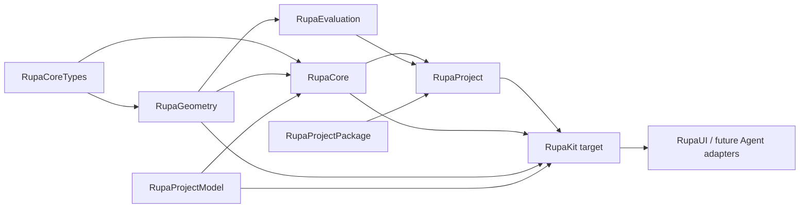
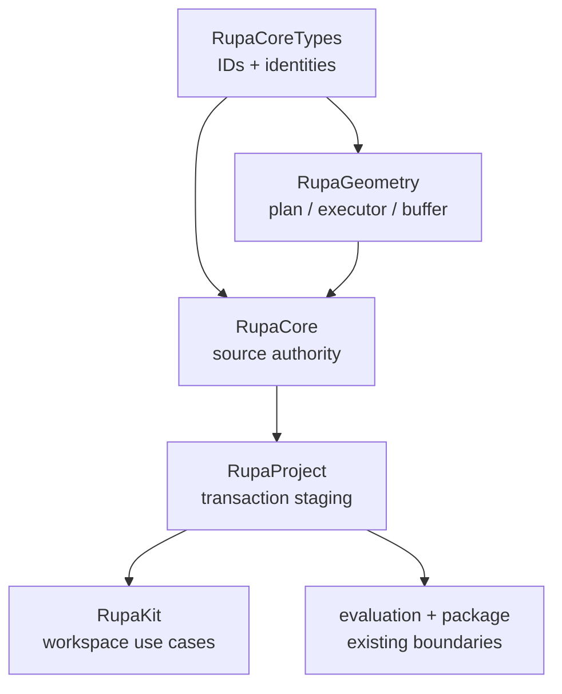

# RupaKit Package Design

## Purpose and Scope

This document is the package-level design for the `RupaKit` Swift package. It
composes the T09 Mesh-editing contracts owned by the changed modules and keeps
the package graph aligned with the existing project authority route.

Parent: [system design](../DESIGN.md). Direct children for T09 are:

- [RupaGeometry](Sources/RupaGeometry/DESIGN.md)
- [RupaCore](Sources/RupaCore/DESIGN.md)
- [RupaProject](Sources/RupaProject/DESIGN.md)
- [RupaKit integration target](Sources/RupaKit/DESIGN.md)

Package dependencies are the local targets and external packages declared by
[`Package.swift`](Package.swift), notably `swift-CAD`, Swift Collections, and
Argument Parser. Package users are the system root, application targets, and
existing UI/Agent/CLI adapters through their declared target dependencies.

The package also contains existing targets such as `RupaEvaluation`,
`RupaProjectModel`, `RupaProjectPackage`, `RupaAgentProtocol`, and UI/runtime
adapters. Their current ownership remains indexed by
[ARCHITECTURE.md](ARCHITECTURE.md); T09 does not change their public surface.

The package design is the parent of the four changed module designs. It is not
a replacement for the system source-authority or state contracts linked below.

## Responsibilities and Boundaries

The package design owns:

- the dependency direction between provider-independent Mesh editing, source
  authority, project orchestration, and application integration;
- the rule that all four layers use the existing `ProjectController` authority;
- package-wide API and verification boundaries for T09.

It does not own Mesh topology algorithms, CAD semantics, source asset mutation,
archive encoding, or Agent/CLI/MCP transport. Those are delegated to child
designs or existing normative contracts.

## Related Designs

| Design | Relationship | Contract Used | Summary | Cautions |
|---|---|---|---|---|
| [system design](../DESIGN.md) | parent | System authority and T09 cross-boundary invariants | Defines the complete inspect-to-publish flow. | Child documents provide local details; do not duplicate them here. |
| [CAD/Mesh responsibility](../Rupa/CAD_MESH_RESPONSIBILITY_CONTRACT.md) | depends on | Representation roles, Authored Mesh authority, derived snapshots, zero-copy baseline | Defines the meaning of the source being edited. | A plan cannot turn a derived evaluation snapshot into source. |
| [State and project contract](../Rupa/STATE_AND_PROJECT_CONTRACT.md) | depends on | Project actor, revision, history, cancellation, and publication | Defines the lifecycle used by `RupaProject`. | Do not introduce a parallel session or publication sequence. |
| [ARCHITECTURE.md](ARCHITECTURE.md) | coordinates with | Existing package graph and application route | Records existing targets and shared workspace composition. | T09-specific design is in this hierarchy, not in a duplicated architecture summary. |
| [RupaGeometry design](Sources/RupaGeometry/DESIGN.md) | child | Plan/executor/buffer contract | Owns Mesh operation and performance semantics. | Package consumers use its public contracts only. |
| [RupaCore design](Sources/RupaCore/DESIGN.md) | child | Source identity and asset mutation contract | Owns Product/Authored Mesh source authority. | Scene references are navigation context, not authority. |
| [RupaProject design](Sources/RupaProject/DESIGN.md) | child | Staging/publication contract | Owns project transaction integration. | Geometry algorithms remain below this boundary. |
| [RupaKit integration design](Sources/RupaKit/DESIGN.md) | child | Transport-neutral read/edit use cases | Owns application-facing exact-snapshot adaptation. | No AgentProtocol/CLI/MCP changes in T09. |

## Architecture

The package composes contracts from the bottom up:

This direction avoids leaking project coordinates into the geometry kernel and
avoids making `RupaGeometry` depend on `RupaCore` or `RupaProject`.

## Contracts and Invariants

The package-level contract is limited to dependency direction and design
authority. Detailed Mesh operations, source targets, project staging, and read
records are owned by the four child designs:

| Package rule | Owner |
|---|---|
| `RupaCoreTypes` is the dependency floor. | Existing package graph. |
| `RupaGeometry` does not depend upward on Core, Project, UI, or transport. | [RupaGeometry design](Sources/RupaGeometry/DESIGN.md) |
| `RupaCore` is the source-authority boundary; `RupaProject` is the publication boundary. | [RupaCore design](Sources/RupaCore/DESIGN.md), [RupaProject design](Sources/RupaProject/DESIGN.md) |
| `RupaKit` is the application use-case boundary over existing Project authority. | [RupaKit integration design](Sources/RupaKit/DESIGN.md) |
| Existing CAD/Mesh and state contracts remain authoritative for their domains. | [CAD/Mesh responsibility](../Rupa/CAD_MESH_RESPONSIBILITY_CONTRACT.md), [state/project contract](../Rupa/STATE_AND_PROJECT_CONTRACT.md) |

The package design does not repeat those contracts and does not introduce a
second authority, source clone, protocol surface, or transport route.

## Runtime Flows

The package composes the child module flows in the order shown by the system
root. The package itself owns no request state and adds no alternate flow.

See the [system runtime flow](../DESIGN.md#runtime-flows), then the local flows
in [RupaGeometry](Sources/RupaGeometry/DESIGN.md#runtime-flows),
[RupaCore](Sources/RupaCore/DESIGN.md#runtime-flows),
[RupaProject](Sources/RupaProject/DESIGN.md#runtime-flows), and
[RupaKit](Sources/RupaKit/DESIGN.md#runtime-flows).

## State, Ownership, and Lifecycle

The package owns no shared mutable T09 state. State and lifetime are delegated
to the child owners: Mesh buffers to `RupaGeometry`, source assets to
`RupaCore`, project publication to `RupaProject`, and observable workspace view
to `RupaKit`.

## Failure, Concurrency, and Constraints

The package preserves the native target dependency graph and does not weaken
the isolation contracts owned by its children. Child failures remain typed and
are not converted at the package boundary. Concurrency, resource, and
zero-copy constraints are defined and verified by the owning module designs.

## Verification and Change Impact

The package-level proof is compositional and checks reachability of the child
contracts rather than duplicating their behavioral cases:

| Stage | Verification owner | Evidence |
|---|---|---|
| Geometry contract | `RupaGeometry` | T09-A tests for plan, topology, IDs, limits, rollback, and copy telemetry. |
| Source authority | `RupaCore` | T09-B tests for source identity, shared references, and invariance. |
| Project integration | `RupaProject` | T09-C and T09-IV tests for exact coordinates and atomic publication. |
| Application use case | `RupaKit` target | T09-C tests for bounded read/preview/commit. |
| Full package | Integration | T09-IV build/test and actual save/load path. |

Any public contract or dependency change requires rechecking the system root,
the affected child design, and the existing architecture/normative links.
