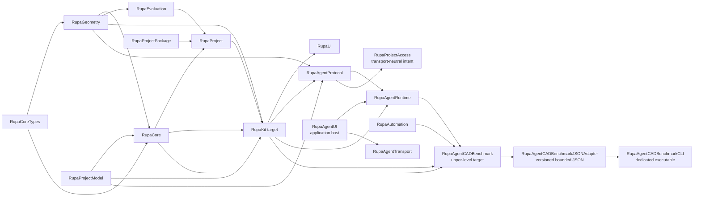
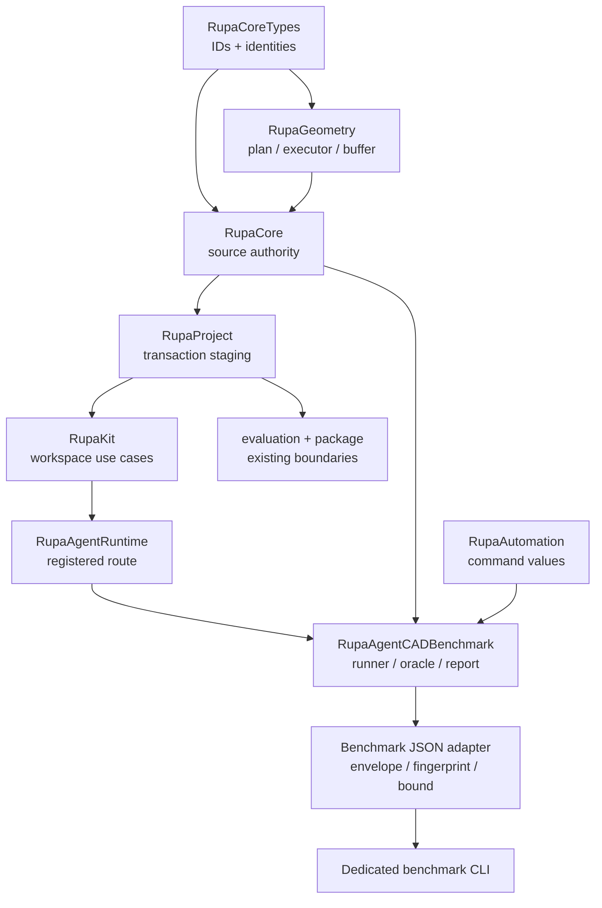

# RupaKit Package Design

## Purpose and Scope

This document is the package-level design for the `RupaKit` Swift package. It
composes the verified T09 Mesh-editing foundation with the T10 Agent-to-project
geometry route and the T12 Agent CAD benchmark while keeping one existing
project authority.

Parent: [system design](../DESIGN.md). Direct children used by T10/T12 are:

- [RupaGeometry](Sources/RupaGeometry/DESIGN.md)
- [RupaRendering](Sources/RupaRendering/DESIGN.md)
- [RupaViewportScene](Sources/RupaViewportScene/DESIGN.md)
- [RupaCore](Sources/RupaCore/DESIGN.md)
- [RupaProjectPackage](Sources/RupaProjectPackage/DESIGN.md)
- [RupaProject](Sources/RupaProject/DESIGN.md)
- [RupaKit integration target](Sources/RupaKit/DESIGN.md)
- [RupaAgentProtocol](Sources/RupaAgentProtocol/DESIGN.md)
- [RupaProjectAccess](Sources/RupaProjectAccess/DESIGN.md)
- [RupaUI](Sources/RupaUI/DESIGN.md)
- [RupaAgentUI](Sources/RupaAgentUI/DESIGN.md)
- [RupaAgentRuntime](Sources/RupaAgentRuntime/DESIGN.md)
- [RupaAgentCADBenchmark](Sources/RupaAgentCADBenchmark/DESIGN.md)
- [RupaAgentCADBenchmarkJSONAdapter](Sources/RupaAgentCADBenchmarkJSONAdapter/DESIGN.md)
- [RupaAgentCADBenchmarkCLI](Sources/RupaAgentCADBenchmarkCLI/DESIGN.md)

Package dependencies are the local targets and external packages declared by
[`Package.swift`](Package.swift), notably `swift-CAD`, Swift Collections, and
Argument Parser. Package users are the system root, application targets, and
existing UI/Agent/CLI adapters through their declared target dependencies.

The package also contains existing targets such as `RupaEvaluation`,
`RupaProjectModel`, `RupaProjectPackage`, UI, rendering, and transport adapters.
Their current ownership remains indexed by [ARCHITECTURE.md](ARCHITECTURE.md).

The package design is the parent of the changed and reused module designs. It is
not a replacement for the system source-authority or state contracts linked
below. The T12 benchmark target is now declared in `Package.swift` as an upper-
level consumer; its implementation remains behind the child design boundary.

## Responsibilities and Boundaries

The package design owns:

- the dependency direction between provider-independent Mesh editing, source
  authority, project orchestration, and application integration;
- the rule that every T09/T10 layer uses the existing `ProjectController` authority;
- the boundary between role-specific package source codecs and the project
  publication/lifecycle owners;
- the direct UI-to-`ProjectWorkspace` route and the project-access contract
  through which CLI and future adapters submit typed intent without acquiring
  source or package authority;
- package-wide API and verification boundaries for T10 and T12.

It does not own Mesh topology algorithms, CAD semantics, source asset mutation,
archive encoding, socket I/O, MCP, general CLI behavior, LLM reasoning, or a bicycle-specific or
benchmark-specific CAD command. Those are delegated to child designs or
existing normative contracts. T12's runner, catalog, source/B-Rep oracle, and
score values are owned by its child design; they do not become another project
authority. The dedicated benchmark JSON adapter and executable own only their
versioned exchange and process boundaries.

## Related Designs

| Design | Relationship | Contract Used | Summary | Cautions |
|---|---|---|---|---|
| [system design](../DESIGN.md) | parent | System authority and T10 cross-boundary invariants | Defines the complete Agent-to-presentation flow. | Child documents provide local details; do not duplicate them here. |
| [CAD/Mesh responsibility](../Rupa/CAD_MESH_RESPONSIBILITY_CONTRACT.md) | depends on | Representation roles, Authored Mesh authority, derived snapshots, zero-copy baseline | Defines the meaning of the source being edited. | A plan cannot turn a derived evaluation snapshot into source. |
| [State and project contract](../Rupa/STATE_AND_PROJECT_CONTRACT.md) | depends on | Project actor, revision, history, cancellation, and publication | Defines the lifecycle used by `RupaProject`. | Do not introduce a parallel session or publication sequence. |
| [ARCHITECTURE.md](ARCHITECTURE.md) | coordinates with | Existing package graph and application route | Records existing targets and shared workspace composition. | Task-specific contracts remain in this hierarchy. |
| [RupaGeometry design](Sources/RupaGeometry/DESIGN.md) | child | Plan/executor/buffer contract | Owns Mesh operation and performance semantics. | Package consumers use its public contracts only. |
| [RupaRendering design](Sources/RupaRendering/DESIGN.md) | child | Snapshot-owned presentation plan and viewport scheduling contract | Owns MeshSource presentation traversal and render invalidation policy. | It consumes immutable snapshots and never becomes a geometry or project authority. |
| [RupaViewportScene design](Sources/RupaViewportScene/DESIGN.md) | child | Immutable scene projection and metric-free B-spline overlay reference contract | Builds viewport scene values from validated source/evaluation snapshots. | B-spline reference lookup must not become an implicit topology-metric path. |
| [RupaCore design](Sources/RupaCore/DESIGN.md) | child | Source identity and asset mutation contract | Owns Product/Authored Mesh source authority. | Scene references are navigation context, not authority. |
| [RupaProjectPackage design](Sources/RupaProjectPackage/DESIGN.md) | child | Schema-v3 source/archive and atomic replacement contract | Owns bounded package I/O, source-byte integrity, reuse, and destination replacement staging. | It never owns project publication, current URL, or Agent save routing. |
| [RupaProject design](Sources/RupaProject/DESIGN.md) | child | Staging/publication contract | Owns project transaction integration. | Geometry algorithms remain below this boundary. |
| [RupaKit integration design](Sources/RupaKit/DESIGN.md) | child | Transport-neutral read/edit, Make Editable, and visibility-filtered exact project-view contracts | Owns application-facing exact-snapshot adaptation while retaining complete source/evaluation/navigation authority. | Presentation filtering must not create an alternate source or project authority; the benchmark CLI remains a separate upper sibling. |
| [RupaUI design](Sources/RupaUI/DESIGN.md) | child | snapshot-owned project title and direct workspace UI route | Presents immutable workspace state without becoming project authority. | Visible project identity comes from `ProjectViewSnapshot`. |
| [RupaAgentUI design](Sources/RupaAgentUI/DESIGN.md) | child | process-lifetime host and injected handler contract | Owns Agent listener lifecycle and registration bridge for the App-owned workspace. | The App composes one controller/router; host never creates a shadow workspace or saves a package. |
| [RupaAgentProtocol design](Sources/RupaAgentProtocol/DESIGN.md) | child | Codable Agent Mesh, Make Editable, and geometry-buffer-free viewport summary messages | Reuses RupaKit value contracts without duplicating geometry meaning. | It must not import runtime or transport or expose a second view/source authority. |
| [RupaAgentRuntime design](Sources/RupaAgentRuntime/DESIGN.md) | child | Registered-workspace request routing | Binds wire values to the exact current full project view. | It never creates a session or saves a package. |
| [RupaAgentCADBenchmark design](Sources/RupaAgentCADBenchmark/DESIGN.md) | child | Exactly-100 per-case and aggregate verification contract | Composes all reviewed registered-Agent routes and immutable source/B-Rep oracles into measured scheduling, baselines, and a canonical report. | Catalog presence is not implementation evidence; production authority modules must not depend on it. |
| [Benchmark JSON adapter](Sources/RupaAgentCADBenchmarkJSONAdapter/DESIGN.md) | child | versioned envelopes, context fingerprint, bounded decode, JSON candidate | Binds one external decision to the exact public context of one activated case. | It cannot import private expectations or accept a catalog-only case. |
| [Benchmark CLI](Sources/RupaAgentCADBenchmarkCLI/DESIGN.md) | child | dedicated request/evaluate process contract | Exposes the JSON adapter as `rupa-agent-cad-benchmark` without changing `rupa`. | It owns no envelope meaning, network transport, or project state. |

## Architecture

The package composes contracts from the bottom up:

This direction avoids leaking project coordinates into the geometry kernel and
avoids making `RupaGeometry` depend on `RupaCore` or `RupaProject`. The
benchmark is an upper-level consumer: no source, project, runtime, protocol, or
geometry target depends back on it.

## Contracts and Invariants

The package-level contract is limited to dependency direction and design
authority. Detailed Mesh operations, source targets, project staging, and read
records are owned by the four child designs:

| Package rule | Owner |
|---|---|
| `RupaCoreTypes` is the dependency floor. | Existing package graph. |
| `RupaGeometry` does not depend upward on Core, Project, UI, or transport. | [RupaGeometry design](Sources/RupaGeometry/DESIGN.md) |
| `RupaCore` is the source-authority boundary; `RupaProject` is the publication boundary. | [RupaCore design](Sources/RupaCore/DESIGN.md), [RupaProject design](Sources/RupaProject/DESIGN.md) |
| `RupaProjectPackage` owns schema-v3 archive I/O, staged validation, and atomic destination replacement, but not project or application lifecycle. | [RupaProjectPackage design](Sources/RupaProjectPackage/DESIGN.md) |
| `RupaKit` is the application use-case boundary over existing Project authority. | [RupaKit integration design](Sources/RupaKit/DESIGN.md) |
| `RupaProjectAccess` is the transport-neutral access contract; it owns no workspace, package, or command state. | [RupaProjectAccess design](Sources/RupaProjectAccess/DESIGN.md) |
| `RupaAgentTransport` carries protocol values over an injected local transport and never defines project semantics. | [RupaAgentTransport design](Sources/RupaAgentTransport/DESIGN.md) |
| `RupaAgentUI` owns the process-lifetime Agent host and registration bridge; the App composes one controller/router over the same workspace. | [RupaAgentUI design](Sources/RupaAgentUI/DESIGN.md) |
| Existing CAD/Mesh and state contracts remain authoritative for their domains. | [CAD/Mesh responsibility](../Rupa/CAD_MESH_RESPONSIBILITY_CONTRACT.md), [state/project contract](../Rupa/STATE_AND_PROJECT_CONTRACT.md) |
| `RupaAgentCADBenchmark` is a bounded verification composition above the production Agent route: all 100 targets retain individual reviewed evidence, while aggregate execution composes fresh isolated `ProjectAgentCommandController` runs into measured scheduling, immutable baselines, and one canonical report. | [RupaAgentCADBenchmark design](Sources/RupaAgentCADBenchmark/DESIGN.md) |
| The external benchmark path is one-way: `RupaAgentCADBenchmark` -> JSON adapter -> dedicated CLI. It accepts only activated cases, fingerprints candidate-visible context, and never makes transport or candidate data authoritative. | [JSON adapter](Sources/RupaAgentCADBenchmarkJSONAdapter/DESIGN.md), [benchmark CLI](Sources/RupaAgentCADBenchmarkCLI/DESIGN.md) |

The package design does not repeat those contracts and does not introduce a
second authority or source clone. T10 adds only the typed Agent adapter surface
over the existing RupaKit use cases. T12 adds the benchmark consumer plus its
separate bounded JSON/CLI adapter; neither adds a modeling route, source
persistence, Mesh path, or reasoning engine.

## Runtime Flows

The package composes the child module flows in the order shown by the system
root. The package itself owns no request state and adds no alternate flow.

See the [system runtime flow](../DESIGN.md#runtime-flows), then the local flows
in [RupaGeometry](Sources/RupaGeometry/DESIGN.md#runtime-flows),
[RupaCore](Sources/RupaCore/DESIGN.md#runtime-flows),
[RupaProjectPackage](Sources/RupaProjectPackage/DESIGN.md#runtime-flows),
[RupaProject](Sources/RupaProject/DESIGN.md#runtime-flows), and
[RupaKit](Sources/RupaKit/DESIGN.md#runtime-flows), then the
[Agent host](Sources/RupaAgentUI/DESIGN.md#runtime-flows),
[Agent benchmark](Sources/RupaAgentCADBenchmark/DESIGN.md#runtime-flows),
[JSON adapter](Sources/RupaAgentCADBenchmarkJSONAdapter/DESIGN.md#runtime-flows),
and [benchmark CLI](Sources/RupaAgentCADBenchmarkCLI/DESIGN.md#runtime-flows).

## State, Ownership, and Lifecycle

The package owns no shared mutable T10/T12 or access-session state. State and
lifetime are delegated to the child owners: Mesh buffers to `RupaGeometry`,
source assets to `RupaCore`, package archive I/O to `RupaProjectPackage`,
project publication to `RupaProject`, observable workspace view to `RupaKit`,
request routing to `RupaAgentRuntime`, Agent listener/registration lifetime to
`RupaAgentUI`, and benchmark catalog,
capability-availability/execution-regression baseline evidence, case/oracle,
and report values to `RupaAgentCADBenchmark`. External request/response buffers
and fingerprints are invocation-local values owned by the JSON adapter and CLI.
`RupaProjectAccess` owns only immutable target, result, error, endpoint, and
peer-authorization contracts; concrete live and closed session lifetimes are
composed by later ACCESS work.

## Failure, Concurrency, and Constraints

The package preserves the native target dependency graph and does not weaken
the isolation contracts owned by its children. Child failures remain typed and
are not converted at the package boundary. Concurrency, resource, and
zero-copy constraints are defined and verified by the owning module designs.
Application Agent save is a one-way route through the typed coordinator port;
the package and Agent host cannot mutate archive bytes independently. Package
staging failures and application prepublication failures preserve their
respective existing destinations and project publications.
The T12 benchmark used per-case fresh authorities and fixed serial concurrency
one during activation. Its completed post-100 integration proved bounded-one
and bounded-two evidence equivalence, observed MainActor serialization, and
selected conservative concurrency one after speedup failed to repeat. Baseline
environment/catalog/capability drift is explicit; oracle or infrastructure
failure invalidates a run without canonicalizing failures or updating the
execution-regression baseline.
The external adapter remains serial at one case per process and enforces its
versioned byte ceiling before decode; it cannot introduce pre-100 parallelism.

## Verification and Change Impact

The package-level proof is compositional and checks reachability of the child
contracts rather than duplicating their behavioral cases:

| Stage | Verification owner | Evidence |
|---|---|---|
| Geometry contract | `RupaGeometry` | T09-A tests for plan, topology, IDs, limits, rollback, and copy telemetry. |
| Source authority | `RupaCore` | T09-B tests for source identity, shared references, and invariance. |
| Project integration | `RupaProject` | T09-C and T09-IV tests for exact coordinates and atomic publication. |
| Package persistence | `RupaProjectPackage` | Schema-v3 round trips, staged validation, resource/integrity limits, byte reuse, cleanup, and destination-preserving atomic failure tests. |
| Application use case | `RupaKit` target | T09-C tests for bounded read/preview/commit. |
| Full package | Integration | T09-IV build/test and actual save/load path. |
| Agent wire and dispatch | `RupaAgentProtocol` / `RupaAgentRuntime` | T10-B codec, malformed-input, registered-workspace, stale/cancel, and no-retry tests. |
| Application Agent host | `RupaAgentUI` / Rupa App | ACCESS-O focused same-workspace registration, router delegation, explicit save port, process-lifetime host, and typed failure preservation. |
| Agent CAD benchmark | `RupaAgentCADBenchmark` | All 100 per-case and category gates plus serial replay, bounded concurrency measurement, capability/execution baselines, fixed-denominator score, committed canonical report, deadline, cancellation, and cleanup evidence. Reference-plan results are control-path evidence only. |
| External benchmark JSON | JSON adapter / dedicated CLI | Explicit discriminator golden JSON, context fingerprint drift, bounded stdin/file decode, inactive-case/privacy rejection, direct protocol integration, and actual process exit/JSON behavior. |
| Actual rendered workflow | T10 integration | Agent CAD bicycle assembly, Make Editable for every generated body, one representative Mesh edit, application save/load, all-Authored-Mesh presentation evaluation, renderer triangles, and deterministic PNG. |

Any public contract or dependency change requires rechecking the system root,
the affected child design, and the existing architecture/normative links.
