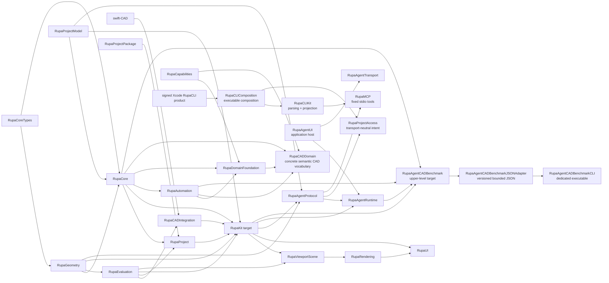
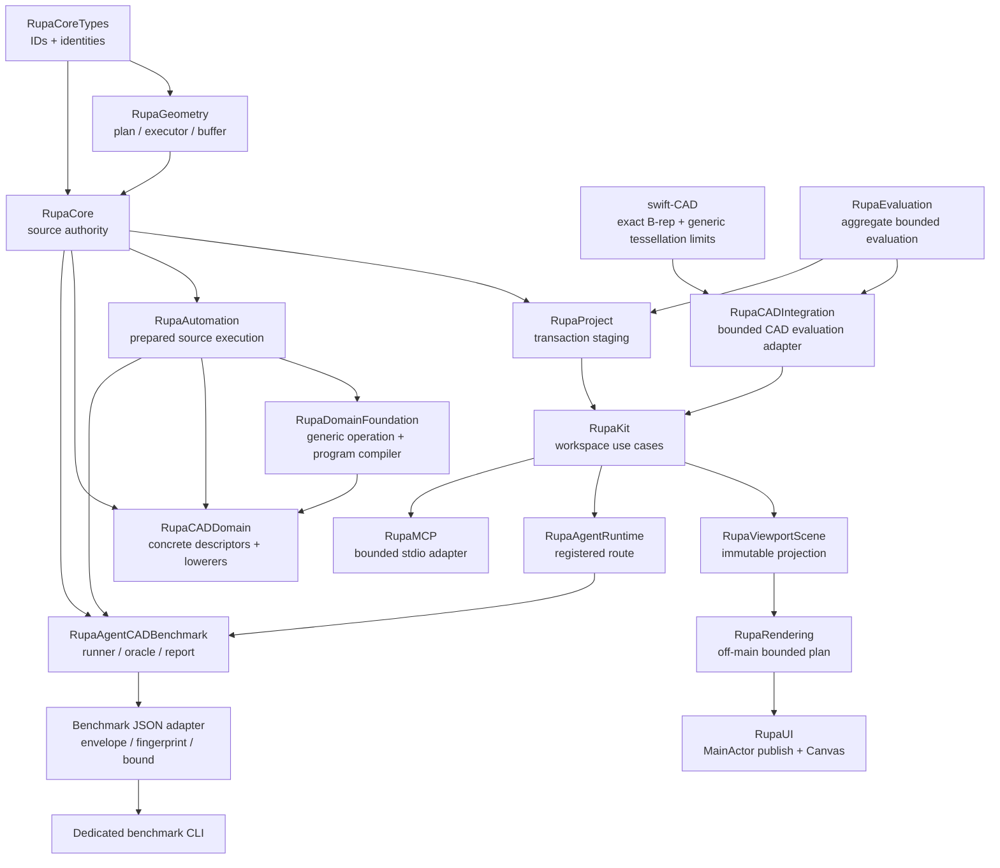

# RupaKit Package Design

## Purpose and Scope

This document is the package-level design for the `RupaKit` Swift package. It
composes the verified T09 Mesh-editing foundation, the T10 Agent-to-project
geometry route, the T12 Agent CAD benchmark, and the CADAPI-D public modeling
contract while keeping one existing project authority. CADAPI-D is a target
design: the current source still exposes legacy Automation payloads until its
separate implementation task passes the gates defined below.

Parent: [system design](../DESIGN.md). Direct children used by T10/T12 are:

- [RupaGeometry](Sources/RupaGeometry/DESIGN.md)
- [RupaEvaluation](Sources/RupaEvaluation/DESIGN.md)
- [RupaCADIntegration](Sources/RupaCADIntegration/DESIGN.md)
- [RupaRendering](Sources/RupaRendering/DESIGN.md)
- [RupaViewportScene](Sources/RupaViewportScene/DESIGN.md)
- [RupaCore](Sources/RupaCore/DESIGN.md)
- [RupaProjectPackage](Sources/RupaProjectPackage/DESIGN.md)
- [RupaProject](Sources/RupaProject/DESIGN.md)
- [RupaAutomation](Sources/RupaAutomation/DESIGN.md)
- [RupaDomainFoundation](Sources/RupaDomainFoundation/DESIGN.md)
- [RupaCADDomain](Sources/RupaCADDomain/DESIGN.md)
- [RupaKit integration target](Sources/RupaKit/DESIGN.md)
- [RupaAgentProtocol](Sources/RupaAgentProtocol/DESIGN.md)
- [RupaProjectAccess](Sources/RupaProjectAccess/DESIGN.md)
- [RupaProjectAccessPlatform](Sources/RupaProjectAccessPlatform/DESIGN.md)
- [RupaProjectAccessComposition](Sources/RupaProjectAccessComposition/DESIGN.md)
- [RupaMCP](Sources/RupaMCP/DESIGN.md)
- [RupaCLIComposition](Sources/RupaCLIComposition/DESIGN.md)
- [RupaUI](Sources/RupaUI/DESIGN.md)
- [RupaAgentUI](Sources/RupaAgentUI/DESIGN.md)
- [RupaAgentRuntime](Sources/RupaAgentRuntime/DESIGN.md)
- [RupaCLIKit](Sources/RupaCLIKit/DESIGN.md)
- [RupaAgentCADBenchmark](Sources/RupaAgentCADBenchmark/DESIGN.md)
- [RupaAgentCADBenchmarkJSONAdapter](Sources/RupaAgentCADBenchmarkJSONAdapter/DESIGN.md)
- [RupaAgentCADBenchmarkCLI](Sources/RupaAgentCADBenchmarkCLI/DESIGN.md)
- [RupaResponsivenessBaseline](Sources/RupaResponsivenessBaseline/DESIGN.md)
- [RupaResponsivenessBaselineCLI](Sources/RupaResponsivenessBaselineCLI/DESIGN.md)
- [RupaResponsivenessFixtureDocument](Sources/RupaResponsivenessFixtureDocument/DESIGN.md)
- [RupaResponsivenessFixtureDocumentCLI](Sources/RupaResponsivenessFixtureDocumentCLI/DESIGN.md)

Package dependencies are the local targets and external packages declared by
[`Package.swift`](Package.swift), notably `swift-CAD`, Swift Collections, and
Argument Parser. Package users are the system root, application targets, and
existing UI/Agent/CLI adapters through their declared target dependencies.

The package also contains existing targets such as `RupaProjectModel`, UI, and
transport adapters not changed by this design. Their current ownership remains
indexed by [ARCHITECTURE.md](ARCHITECTURE.md).

The package design is the parent of the changed and reused module designs. It is
not a replacement for the system source-authority or state contracts linked
below. The T12 benchmark target is now declared in `Package.swift` as an upper-
level consumer; its implementation remains behind the child design boundary.

## Responsibilities and Boundaries

The package design owns:

- the dependency direction between provider-independent Mesh editing, source
  authority, project orchestration, and application integration;
- the rule that every T09/T10 layer uses the existing `ProjectController` authority;
- the boundary between role-specific package source codecs and the project
  publication/lifecycle owners;
- the direct UI-to-`ProjectWorkspace` route and the project-access contract
  through which CLI and MCP adapters submit typed intent without acquiring
  source or package authority;
- package-wide API and verification boundaries for T10 and T12.
- the CADAPI-D dependency rule that one registered semantic CAD operation
  vocabulary serves both direct invocation and declarative program execution;
- the dependency boundary through which the child `RupaCADDomain` supplies the
  concrete semantic CAD vocabulary to the generic compiler.
- the cross-module separation of exact CAD evaluation, product-selected
  presentation fidelity, generic resource admission, postpublication derived
  rendering data, and MainActor UI publication;
- the rule that Agent control-plane work remains independent of viewport
  preparation and enters the existing workspace/project owners only through
  explicit short suspensions.

It does not own Mesh topology algorithms, concrete CAD operation semantics, source asset mutation,
archive encoding, HTTP framing, MCP framing, general CLI behavior, LLM reasoning, or a bicycle-specific or
benchmark-specific CAD command. Those are delegated to child designs or
existing normative contracts. T12's runner, catalog, source/B-Rep oracle, and
score values are owned by its child design; they do not become another project
authority. The dedicated benchmark JSON adapter and executable own only their
versioned exchange and process boundaries.

Concrete version-1 operation IDs, argument/output schemas, lowerers,
availability, compactness, and exact-sphere requirements are owned only by the
[RupaCADDomain design](Sources/RupaCADDomain/DESIGN.md).

## Related Designs

| Design | Relationship | Contract Used | Summary | Cautions |
|---|---|---|---|---|
| [system design](../DESIGN.md) | parent | System authority and T10 cross-boundary invariants | Defines the complete Agent-to-presentation flow. | Child documents provide local details; do not duplicate them here. |
| [CAD/Mesh responsibility](../Rupa/CAD_MESH_RESPONSIBILITY_CONTRACT.md) | depends on | Representation roles, Authored Mesh authority, derived snapshots, zero-copy baseline | Defines the meaning of the source being edited. | A plan cannot turn a derived evaluation snapshot into source. |
| [State and project contract](../Rupa/STATE_AND_PROJECT_CONTRACT.md) | depends on | Project actor, revision, history, cancellation, and publication | Defines the lifecycle used by `RupaProject`. | Do not introduce a parallel session or publication sequence. |
| [ARCHITECTURE.md](ARCHITECTURE.md) | coordinates with | Existing package graph and application route | Records existing targets and shared workspace composition. | Task-specific contracts remain in this hierarchy. |
| [RupaGeometry design](Sources/RupaGeometry/DESIGN.md) | child | Plan/executor/buffer contract | Owns Mesh operation and performance semantics. | Package consumers use its public contracts only. |
| [RupaEvaluation design](Sources/RupaEvaluation/DESIGN.md) | child | Purpose selection and provider-neutral aggregate admission | Produces one complete bounded immutable evaluation. | It neither selects product fidelity nor publishes project state. |
| [RupaCADIntegration design](Sources/RupaCADIntegration/DESIGN.md) | child | Purpose-configured Swift-CAD adapter and cache separation | Reuses exact B-rep independently from derived Mesh artifacts. | It applies policy but never chooses Product purpose or fidelity. |
| [RupaRendering design](Sources/RupaRendering/DESIGN.md) | child | Cancellable bounded plan and viewport scheduling contract | Owns one off-main preparation pass, snapshot-matched cache state, and batched Canvas data. | It consumes immutable snapshots and never becomes a geometry or project authority. |
| [RupaViewportScene design](Sources/RupaViewportScene/DESIGN.md) | child | Immutable scene projection and metric-free B-spline overlay reference contract | Builds viewport scene values from validated source/evaluation snapshots. | B-spline reference lookup must not become an implicit topology-metric path. |
| [RupaCore design](Sources/RupaCore/DESIGN.md) | child | Source identity and asset mutation contract | Owns Product/Authored Mesh source authority. | Scene references are navigation context, not authority. |
| [RupaProjectPackage design](Sources/RupaProjectPackage/DESIGN.md) | child | Schema-v3 source/archive and atomic replacement contract | Owns bounded package I/O, source-byte integrity, reuse, and destination replacement staging. | It never owns project publication, current URL, or Agent save routing. |
| [RupaProject design](Sources/RupaProject/DESIGN.md) | child | Staging/publication contract | Owns project transaction integration. | Geometry algorithms remain below this boundary. |
| [RupaAutomation design](Sources/RupaAutomation/DESIGN.md) | child | Binding-aware prepared source-plan execution and internal graph transaction | Executes a fully validated plan inside caller-owned staging. | Raw feature graphs remain internal and are not an Agent vocabulary. |
| [RupaDomainFoundation design](Sources/RupaDomainFoundation/DESIGN.md) | child | Generic semantic operation, program graph, validation, and compilation contracts | Defines one operation/value/reference model shared by both public invocation forms. | It owns no concrete CAD vocabulary or project publication. |
| [RupaCADDomain design](Sources/RupaCADDomain/DESIGN.md) | child | Concrete versioned CAD descriptors, outputs, lowerers, and estimates | Registers the universal operations used by both public forms and all 100 benchmark realizations. | It depends downward only and never owns IDs, project coordinates, publication, transport, or benchmark semantics. |
| [RupaKit integration design](Sources/RupaKit/DESIGN.md) | child | Transport-neutral read/edit, Make Editable, and visibility-filtered exact project-view contracts | Owns application-facing exact-snapshot adaptation while retaining complete source/evaluation/navigation authority. | Presentation filtering must not create an alternate source or project authority; the benchmark CLI remains a separate upper sibling. |
| [RupaUI design](Sources/RupaUI/DESIGN.md) | child | snapshot-owned project title and direct workspace UI route | Presents immutable workspace state without becoming project authority. | Visible project identity comes from `ProjectViewSnapshot`. |
| [RupaAgentUI design](Sources/RupaAgentUI/DESIGN.md) | child | process-lifetime host and injected handler contract | Owns Agent listener lifecycle and registration bridge for the App-owned workspace. | The App composes one controller/router; host never creates a shadow workspace or saves a package. |
| [RupaAgentProtocol design](Sources/RupaAgentProtocol/DESIGN.md) | child | Codable Agent Mesh, Make Editable, and geometry-buffer-free viewport summary messages | Reuses RupaKit value contracts without duplicating geometry meaning. | It must not import runtime or transport or expose a second view/source authority. |
| [RupaMCP design](Sources/RupaMCP/DESIGN.md) | child | fixed tool catalog, bounded schemas, dual-era stdio server | Adapts MCP calls to the existing project-access path without owning project state. | Mutation and explicit save remain separate calls. |
| [RupaAgentRuntime design](Sources/RupaAgentRuntime/DESIGN.md) | child | Control-plane registered-workspace request routing | Binds wire values to the exact current full project view without global MainActor isolation. | It never creates a session, calls CAD/Mesh/rendering directly, or saves a package. |
| [RupaAgentCADBenchmark design](Sources/RupaAgentCADBenchmark/DESIGN.md) | child | Exactly-100 per-case and aggregate verification contract | Composes all reviewed registered-Agent routes and immutable source/B-Rep oracles into measured scheduling, baselines, and a canonical report. | Catalog presence is not implementation evidence; production authority modules must not depend on it. |
| [Benchmark JSON adapter](Sources/RupaAgentCADBenchmarkJSONAdapter/DESIGN.md) | child | versioned envelopes, context fingerprint, bounded decode, JSON candidate | Binds one external decision to the exact public context of one activated case. | It cannot import private expectations or accept a catalog-only case. |
| [Benchmark CLI](Sources/RupaAgentCADBenchmarkCLI/DESIGN.md) | child | dedicated request/evaluate process contract | Exposes the JSON adapter as `rupa-agent-cad-benchmark` without changing `rupa`. | It owns no envelope meaning, network transport, or project state. |
| [RupaResponsivenessBaseline design](Sources/RupaResponsivenessBaseline/DESIGN.md) | child | Versioned fixture, production-path measurement, and one verdict per acceptance row | Records the responsiveness baseline the RupaRendering acceptance table is judged against, using only public production contracts. | It owns no production behaviour and never relaxes a threshold or invents a value for an unobservable measure. |
| [Responsiveness baseline CLI design](Sources/RupaResponsivenessBaselineCLI/DESIGN.md) | child | dedicated measurement process contract | Exposes the baseline as `rupa-responsiveness-baseline` without changing `rupa`. | Its exit code is non-zero when measurement fails, when any acceptance row rejects, and when any row was not measured, with a distinct code per outcome. |
| [RupaResponsivenessFixtureDocument design](Sources/RupaResponsivenessFixtureDocument/DESIGN.md) | child | Fixture-to-project-package projection with reload verification | Materializes the measured fixture as a `.rupa` package so a signed application can be measured against the content the harness measured. | It is a separate target so `rupa-responsiveness-baseline` does not link the project and package stack, which would change the footprint its recorded baseline was taken against. |
| [Responsiveness fixture document CLI design](Sources/RupaResponsivenessFixtureDocumentCLI/DESIGN.md) | child | dedicated export process contract | Exposes the export as `rupa-responsiveness-fixture-document` without changing `rupa`. | It exits non-zero unless the writer reported a verified write, and prints the written document's identity so a later measurement can be attributed to it. |

## Architecture

The package composes contracts from the bottom up:

This direction avoids leaking project coordinates into the geometry kernel and
avoids making `RupaGeometry` depend on `RupaCore` or `RupaProject`. The
benchmark is an upper-level consumer: no source, project, runtime, protocol, or
geometry target depends back on it.

## Contracts and Invariants

The package-level contract is limited to dependency direction and design
authority. Detailed Mesh operations, source targets, project staging, and read
records are owned by the four child designs:

| Package rule | Owner |
|---|---|
| `RupaCoreTypes` is the dependency floor. | Existing package graph. |
| `RupaGeometry` does not depend upward on Core, Project, UI, or transport. | [RupaGeometry design](Sources/RupaGeometry/DESIGN.md) |
| `RupaEvaluation` owns provider-neutral aggregate admission and maps each purpose to its ceiling; fidelity stays with the document's modeling settings so both purposes share one evaluation, and Swift-CAD owns only exact evaluation plus generic tessellation limits. | [RupaEvaluation](Sources/RupaEvaluation/DESIGN.md), [RupaCADIntegration](Sources/RupaCADIntegration/DESIGN.md), [swift-CAD](../swift-CAD/DESIGN.md) |
| Render-plan preparation is a bounded postpublication derived read; only matching cache state and Canvas calls enter MainActor. | [RupaRendering design](Sources/RupaRendering/DESIGN.md), [RupaUI design](Sources/RupaUI/DESIGN.md) |
| `RupaCore` is the source-authority boundary; `RupaProject` is the publication boundary. | [RupaCore design](Sources/RupaCore/DESIGN.md), [RupaProject design](Sources/RupaProject/DESIGN.md) |
| `RupaProjectPackage` owns schema-v3 archive I/O, staged validation, and atomic destination replacement, but not project or application lifecycle. | [RupaProjectPackage design](Sources/RupaProjectPackage/DESIGN.md) |
| `RupaKit` is the application use-case boundary over existing Project authority. | [RupaKit integration design](Sources/RupaKit/DESIGN.md) |
| `RupaDomainFoundation` owns the generic semantic operation schema and bounded DAG compiler used by both invocation forms; it does not own CAD vocabulary or publication. | [RupaDomainFoundation design](Sources/RupaDomainFoundation/DESIGN.md) |
| `RupaAutomation` owns the binding-aware internal source-plan execution substrate; `FeatureGraphTransaction` and `appendFeatureGraph` are internal lowering details, not public Agent operations. | [RupaAutomation design](Sources/RupaAutomation/DESIGN.md) |
| `RupaCADDomain` owns concrete versioned CAD operation descriptors, typed output declarations, lowerers, and conservative operation/result estimates without owning source IDs or publication. | [RupaCADDomain design](Sources/RupaCADDomain/DESIGN.md) |
| `RupaProjectAccess` is the transport-neutral access contract; it owns no workspace, package, or command state. | [RupaProjectAccess design](Sources/RupaProjectAccess/DESIGN.md) |
| `RupaMCP` owns only the fixed MCP catalog, bounded validation, and result projection; the CLI adapter sends every operation through `RupaProjectAccess`. | [RupaMCP design](Sources/RupaMCP/DESIGN.md) |
| `RupaProjectAccessPlatform` owns the Team Keychain discovery record and its generation-guarded reader/writer contract without owning project state. | [RupaProjectAccessPlatform design](Sources/RupaProjectAccessPlatform/DESIGN.md) |
| `RupaProjectAccessComposition` owns the concrete live-project session adapter by composing discovery, authenticated HTTP, `RupaAgentRuntime`, and the public `RupaKit` workspace APIs. | [RupaProjectAccessComposition design](Sources/RupaProjectAccessComposition/DESIGN.md) |
| `RupaCLIComposition` is the sole executable composition for `rupa`; the signed Xcode product entry is a thin async launcher over it. | [RupaCLIComposition design](Sources/RupaCLIComposition/DESIGN.md) |
| `RupaAgentTransport` carries protocol values over authenticated loopback HTTP and never defines project semantics. | [RupaAgentTransport design](Sources/RupaAgentTransport/DESIGN.md) |
| `RupaAgentUI` owns the process-lifetime Agent host and registration bridge; the App composes one controller/router over the same workspace. | [RupaAgentUI design](Sources/RupaAgentUI/DESIGN.md) |
| Agent capability/status, lease, compilation, immutable projection, and encoding are control-plane work; Runtime reaches UI/project ownership only through the existing workspace/application ports. | [RupaAgentRuntime design](Sources/RupaAgentRuntime/DESIGN.md) |
| Existing CAD/Mesh and state contracts remain authoritative for their domains. | [CAD/Mesh responsibility](../Rupa/CAD_MESH_RESPONSIBILITY_CONTRACT.md), [state/project contract](../Rupa/STATE_AND_PROJECT_CONTRACT.md) |
| `RupaAgentCADBenchmark` is a bounded verification composition above the production Agent route: all 100 targets retain individual reviewed evidence, while aggregate execution composes fresh isolated `ProjectAgentCommandController` runs into measured scheduling, immutable baselines, and one canonical report. | [RupaAgentCADBenchmark design](Sources/RupaAgentCADBenchmark/DESIGN.md) |
| The external benchmark path is one-way: `RupaAgentCADBenchmark` -> JSON adapter -> dedicated CLI. It accepts only activated cases, fingerprints candidate-visible context, and never makes transport or candidate data authoritative. | [JSON adapter](Sources/RupaAgentCADBenchmarkJSONAdapter/DESIGN.md), [benchmark CLI](Sources/RupaAgentCADBenchmarkCLI/DESIGN.md) |

The package design does not introduce a second authority or source clone. For
CAD source mutation, the public contract has exactly two forms:

| Form | Purpose | Shared rule |
|---|---|---|
| `capability.invoke` | Execute one registered CAD operation without a program wrapper. | Uses the same descriptor, value schema, lowerer, limits, and result projection as a program node; unresolved local references are invalid. |
| `program.execute` | Compose registered CAD operations as one bounded declarative DAG. | Uses typed request-local symbols, parameters, references, reuse, and native finite-pattern operations; the whole graph publishes at most once. |

The forms are not separate vocabularies. A direct invocation is normalized
internally to a one-node program. Neither form accepts raw `FeatureNode`,
`FeaturePresentation`, `FeatureGraphTransaction`, caller-minted persistent IDs,
arbitrary code, loops, callbacks, file I/O, or package bytes. Read, workspace,
artifact, export, lifecycle, and Mesh-edit effects are not mixed into a CAD
source program. The currently exposed raw Automation routes are legacy
implementation inventory and must not be described as satisfying CADAPI-D.

T10 adds the typed Agent adapter surface over the existing RupaKit use cases.
T12 adds the benchmark consumer plus its bounded JSON/CLI adapter; neither is a
second modeling vocabulary or the implementation proof for CADAPI-D.

### CAD identity phases

This package owns the cross-module identity-phase contract. Child modules use
this table as an assumption/guarantee boundary and do not redefine it.

| Phase | Owner and lifetime | Identities available | Rejected cross-phase use |
|---|---|---|---|
| Request and compilation | Caller symbols and immutable compiler values for one invocation | Existing typed source references and request-local symbols only | Caller-minted persistent IDs, evaluated topology IDs, or a local output used before its producer |
| Staged source mutation | `RupaCore` inside the isolated source transaction | Generated `FeatureID`; source body-output role keyed by `FeatureID` and body/sheet port; generated `SceneNodeID`, `ComponentDefinitionID`, `ComponentInstanceID`, and `PatternArraySourceID` | Evaluated `BodyID`, fabricated result IDs, or an identity not present in the accepted staged source |
| Publication and evaluation | `ProjectController` for the successfully committed publication | Exact committed coordinates and the exact immutable evaluation snapshot | Request-aware receipt projection, using an evaluated `BodyID` as an intra-program source binding, or returning publication identities after failed/preview execution |
| Result projection | `RupaKit` for one successfully published request | Only when requested, an evaluated `BodyID` resolved from the exact published evaluation for a committed source body-output role | Resolving from a preview, a different publication, mutable source state, or an inferred identity |
| Receipt | Protocol projection for one completed request | Requested typed source bindings plus optional postpublication evaluated-body binding and exact committed coordinates | Mutable session/document state, unrequested topology IDs, or inferred/fabricated IDs |

`BodyID` is topology produced by evaluation and can change when source is
reevaluated; it therefore cannot identify a body while a source program is
still staging. Component Definition, Component Instance, Pattern Source, and
Scene Node identities are distinct Product/source identity kinds and cannot be
reconstructed from `createdFeatureIDs`. A dry run publishes no source and
therefore returns neither persistent source identities nor evaluated topology
identities.

## Runtime Flows

The package composes the child module flows in the order shown by the system
root. The package itself owns no request state and adds no alternate flow.

See the [system runtime flow](../DESIGN.md#runtime-flows), then the local flows
in [RupaGeometry](Sources/RupaGeometry/DESIGN.md#runtime-flows),
[RupaEvaluation](Sources/RupaEvaluation/DESIGN.md#runtime-flows),
[RupaCADIntegration](Sources/RupaCADIntegration/DESIGN.md#runtime-flows),
[RupaCore](Sources/RupaCore/DESIGN.md#runtime-flows),
[RupaProjectPackage](Sources/RupaProjectPackage/DESIGN.md#runtime-flows),
[RupaProject](Sources/RupaProject/DESIGN.md#runtime-flows), and
[RupaKit](Sources/RupaKit/DESIGN.md#runtime-flows),
[RupaRendering](Sources/RupaRendering/DESIGN.md#runtime-flows), then the
[RupaDomainFoundation](Sources/RupaDomainFoundation/DESIGN.md#runtime-flows),
[RupaAutomation](Sources/RupaAutomation/DESIGN.md#runtime-flows),
[Agent host](Sources/RupaAgentUI/DESIGN.md#runtime-flows),
[Agent benchmark](Sources/RupaAgentCADBenchmark/DESIGN.md#runtime-flows),
[JSON adapter](Sources/RupaAgentCADBenchmarkJSONAdapter/DESIGN.md#runtime-flows),
and [benchmark CLI](Sources/RupaAgentCADBenchmarkCLI/DESIGN.md#runtime-flows).

## State, Ownership, and Lifecycle

The package owns no shared mutable T10/T12 or access-session state. State and
lifetime are delegated to the child owners: Mesh buffers to `RupaGeometry`,
source assets to `RupaCore`, package archive I/O to `RupaProjectPackage`,
evaluation budgets/results to `RupaEvaluation`, exact/derived CAD cache state
to `RupaCADIntegration`, project publication to `RupaProject`, observable
workspace view to `RupaKit`, derived plan task/data to `RupaRendering`, UI state
to `RupaUI`, request routing/registration leases to the Agent control plane,
Agent listener lifetime to `RupaAgentUI`, and benchmark catalog,
capability-availability/execution-regression baseline evidence, case/oracle,
and report values to `RupaAgentCADBenchmark`. External request/response buffers
and fingerprints are invocation-local values owned by the JSON adapter and CLI.
`RupaProjectAccess` owns only immutable live target, session, result, and error
contracts; the live App adapter owns the client session lifetime while transport
endpoint and authentication details remain below the public API boundary.
CADAPI-D program parameters, node symbols, typed local references, compiled
plans, and result bindings are invocation-local immutable values. Persistent
Feature, Scene, Component, Instance, and Pattern identities plus source
body-output roles are allocated inside staged project authority. They are
returned only after commit; `ProjectController` publishes the exact immutable
evaluation snapshot and `RupaKit` alone resolves a requested evaluated
`BodyID` from that snapshot.

## Failure, Concurrency, and Constraints

The package preserves the native target dependency graph and does not weaken
the isolation contracts owned by its children. Child failures remain typed and
are not converted at the package boundary. Concurrency, resource, and
zero-copy constraints are defined and verified by the owning module designs.
An intentional bounded transformed-position render buffer is presentation data,
not a source clone, and replaces repeated per-frame transformation work. Exact
CAD/source/package authority remains unchanged.
Application Agent save is a one-way route through the typed coordinator port;
the package and Agent host cannot mutate archive bytes independently. Package
staging failures and application prepublication failures preserve their
respective existing destinations and project publications.
Evaluator and render-plan ceilings are correctness contracts checked before
allocation/growth. Only matching cache publication and Canvas calls are
MainActor-isolated; plan preparation and Agent control-plane work are not.
The T12 benchmark used per-case fresh authorities and fixed serial concurrency
one during activation. Its completed post-100 integration proved bounded-one
and bounded-two evidence equivalence, observed MainActor serialization, and
selected conservative concurrency one after speedup failed to repeat. Baseline
environment/catalog/capability drift is explicit; oracle or infrastructure
failure invalidates a run without canonicalizing failures or updating the
execution-regression baseline.
The external adapter remains serial at one case per process and enforces its
versioned byte ceiling before decode; it cannot introduce pre-100 parallelism.
CADAPI-D compilation rejects unknown operation/version, invalid type or unit,
duplicate or missing symbol, cyclic dependency, non-source route/effect, and an
owner-defined semantic resource-limit excess before source mutation.
AgentProtocol owns encoded DTO byte limits and Transport owns HTTP frame/body
limits. Foundation owns decoded value/nesting, node, edge, parameter, output,
expression, lowered-command, and expanded-source preflight limits; Automation
and RupaKit measure actual staged work. Their concrete defaults are selected
and measured by the later implementation, not guessed in this design. RupaKit
and Project own stale-coordinate, evaluation, and publication outcomes;
cancellation, lowering, source, result-projection, and dispatch-uncertain
outcomes remain typed at their respective owners.
Prepublication failure publishes nothing; postpublication failure reports the
exact committed coordinates and `mustNotRetry`.

## Verification and Change Impact

The package-level proof is compositional and checks reachability of the child
contracts rather than duplicating their behavioral cases:

| Stage | Verification owner | Evidence |
|---|---|---|
| Geometry contract | `RupaGeometry` | T09-A tests for plan, topology, IDs, limits, rollback, and copy telemetry. |
| CAD tessellation | Swift-CAD / `RupaCADIntegration` | Fidelity/resource separation, checked preallocation admission, cancellation, exact-state reuse, and artifact-cache tests. |
| Evaluation contract | `RupaEvaluation` | Purpose selection, provider-neutral cumulative limits, malformed result, and all-or-nothing tests. |
| Source authority | `RupaCore` | T09-B tests for source identity, shared references, and invariance. |
| Project integration | `RupaProject` | T09-C and T09-IV tests for exact coordinates and atomic publication. |
| Package persistence | `RupaProjectPackage` | Schema-v3 round trips, staged validation, resource/integrity limits, byte reuse, cleanup, and destination-preserving atomic failure tests. |
| Application use case | `RupaKit` target | T09-C tests for bounded read/preview/commit. |
| Rendering and UI | `RupaRendering` / `RupaUI` | Off-main preparation, stale cancellation, retained-byte telemetry, single validation pass, batched Canvas calls, and MainActor progress probes. |
| Full package | Integration | T09-IV build/test and actual save/load path. |
| Agent wire and dispatch | `RupaAgentProtocol` / `RupaAgentRuntime` | T10-B codec, malformed-input, registered-workspace, stale/cancel, and no-retry tests. |
| Agent liveness | `RupaAgentRuntime` / `RupaAgentUI` / App | Capability/status and immutable reads complete during render preparation; only exact workspace/save operations enter their existing owners. |
| CAD semantic program | `RupaDomainFoundation` / `RupaCADDomain` | Later implementation must prove direct/program compile equivalence, typed local bindings, graph ordering and cycle rejection, native finite patterns, source-only route validation, decoded-semantic/result preflight limits, the exact twelve-operation registry, and 100-case expressibility without claiming publication. |
| CAD prepared execution | `RupaAutomation` / `RupaKit` | Later implementation must prove one program produces at most one source transaction, evaluation, undo entry, and publication; all prepublication failures roll back and postpublication failures are no-retry. |
| Public cutover | `RupaAgentProtocol` / `RupaAgentRuntime` / `RupaCLIKit` | Later codec, catalog, runtime, and actual-CLI tests must prove one primitive is one direct call, a repeated assembly stays compact relative to distinct intent, both forms use the same compiler, and raw graph/Automation mutation payloads are absent or rejected. |
| Application Agent host | `RupaAgentUI` / Rupa App | ACCESS-O focused same-workspace registration, router delegation, explicit save port, process-lifetime host, and typed failure preservation. |
| Agent CAD benchmark | `RupaAgentCADBenchmark` | The historical 95-realized/5-unsupported report remains provenance. CADAPI-100 reuses the exact 100 targets and oracles but requires 100 realized results through the semantic direct/program API, followed by actual signed App/CLI save/reload evidence. Reference-plan results are control-path evidence only. |
| External benchmark JSON | JSON adapter / dedicated CLI | Explicit discriminator golden JSON, context fingerprint drift, bounded stdin/file decode, inactive-case/privacy rejection, direct protocol integration, and actual process exit/JSON behavior. |
| Actual rendered workflow | Signed-App integration | One real multi-body Agent mutation, purpose-selected bounded presentation evaluation, visible matching render data, interactive UI/run loop, bounded retained memory, concurrent Agent response, explicit save/reload, and no fallback. |

Any public contract or dependency change requires rechecking the system root,
the affected child design, and the existing architecture/normative links.
