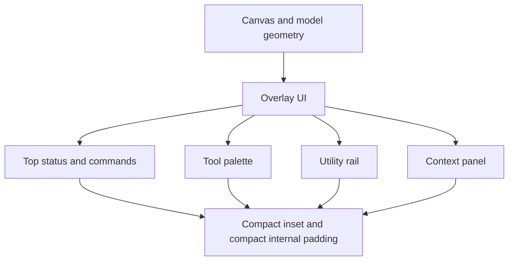

# RupaKit Design Guide

Rupa is a CAD workspace. The canvas is the primary work surface, and every overlay competes with model visibility, picking, snapping, and spatial judgment. UI should expose controls without taking unnecessary canvas area.

## Canvas-First Layout

| Rule | Guidance |
|---|---|
| Prefer compact overlay insets | Canvas overlays should use an 8 pt outer inset by default. Increase only when overlap with system chrome or hit targets is proven. |
| Keep overlay internals dense | Top/context panels should default to 8 pt horizontal and 6 pt vertical padding. Utility rails should default to 8 pt padding. |
| Keep small repeated pills compact | Status chips and value pills should default to 6 pt horizontal and 4 pt vertical padding. |
| Keep tool palettes compact | Tool palettes should keep their container padding near 4 pt and item spacing near 5 pt while preserving tappable icon targets. |
| Do not use decorative spacing on canvas | Extra padding, large card margins, and oversized floating containers hide geometry and reduce picking confidence. |
| Avoid nested framed surfaces | Canvas overlays may be glass/framed once. Avoid cards inside cards or decorative wrapper layers on the canvas. |

## Overlay Priority

| Priority | UI | Expected behavior |
|---|---|---|
| 1 | Geometry, handles, snaps, dimensions, selection affordances | Must remain visible and interactive whenever possible. |
| 2 | Active command context | Should be close to the current workflow but compact enough to avoid hiding the work area. |
| 3 | Global commands and status | Should stay available, but use minimal area and compact controls. |
| 4 | Diagnostics, secondary toggles, detailed inspectors | Should move to side panels or collapsible areas rather than occupy the canvas. |

## Component Defaults

| Component | Outer placement | Internal spacing |
|---|---:|---:|
| `workspaceTopBar` | 8 pt top and horizontal overlay inset | 8 pt horizontal, 6 pt vertical |
| `floatingToolPalette` | 8 pt leading overlay inset | 4 pt container padding, 5 pt item spacing |
| `workspaceUtilityRail` | 8 pt trailing overlay inset | 8 pt container padding, 8 pt section spacing |
| `viewportContextPanel` | 8 pt bottom and horizontal overlay inset | 8 pt horizontal, 6 pt vertical |
| `workspaceValuePill` | Inline in compact panels | 6 pt horizontal, 4 pt vertical |
| `workspaceStatusChip` | Inline in compact panels | 6 pt horizontal, 4 pt vertical |
| `WorkspaceSelectionScopeControl` | Utility rail `Select` section | One fixed-width icon rail; full labels belong in tooltips and accessibility metadata |

## Affordance Rules

| Topic | Rule |
|---|---|
| Picking | Overlay controls must not sit over common pick zones unless they are directly related to the active command. |
| Snapping | Snap and construction-plane indicators should summarize state compactly; detailed controls belong in the utility rail or inspector. |
| Dimensions | Dimension labels and handles are part of the canvas, not chrome. Keep surrounding chrome away from dimension-heavy regions. |
| Tool controls | Use icons for stable tools, short labels only where state would otherwise be ambiguous, and tooltips for explanation. |
| Selection scopes | Keep scope buttons icon-only inside canvas overlays; text labels may truncate and should be exposed through tooltip/accessibility instead. |
| Inspector content | Detailed property editing belongs in the inspector, not floating over the canvas. |

## Review Checklist

Before adding or expanding canvas overlay UI:

| Check | Pass condition |
|---|---|
| Canvas area | The control uses the smallest practical inset and padding for the task. |
| Hit targets | Compact padding does not make controls difficult to click. |
| Text fit | Labels fit without wrapping into geometry-heavy areas. |
| Layering | The overlay is a single framed surface and does not contain nested cards. |
| Responsibility | Rendering and hit policy remain in `RupaRendering`/`RupaViewportScene`; workspace state and command callbacks remain in `RupaUI`. |
| Agent parity | If the control mutates CAD state, the same operation should be available through Automation/Agent when appropriate. |
