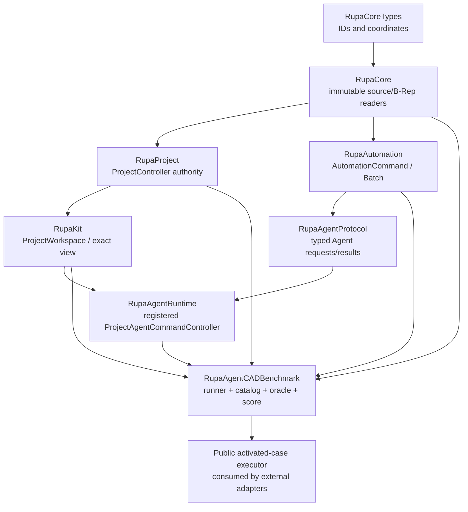
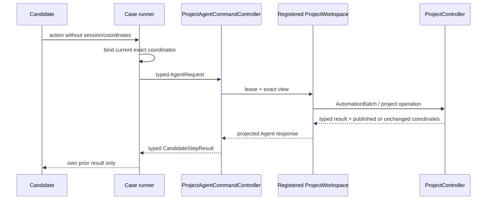
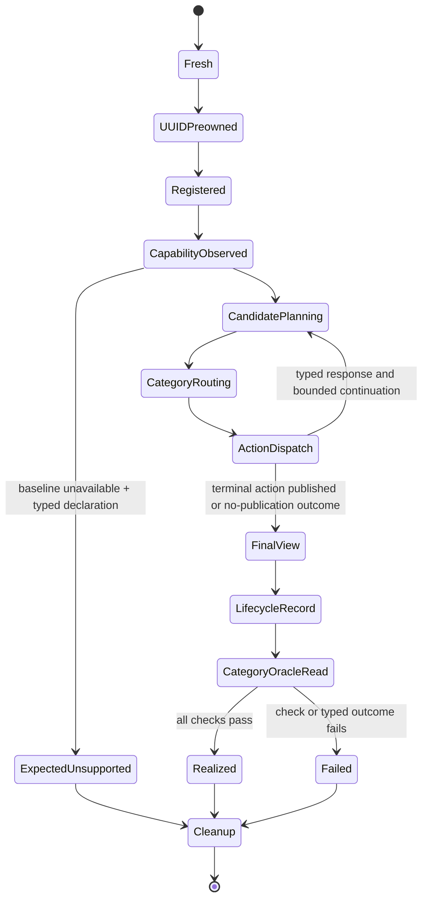
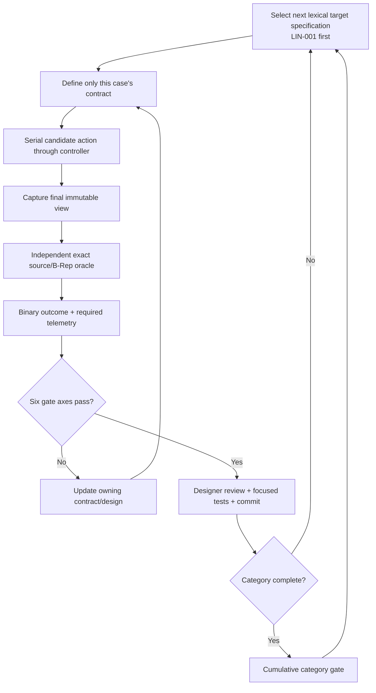

# RupaAgentCADBenchmark

## Purpose and Scope

`RupaAgentCADBenchmark` is the benchmark and verification boundary for
measuring whether an Agent can realize basic CAD geometry through Rupa's
production project route. It is a child of the [RupaKit package design](../../DESIGN.md)
and is reached from the system through that package. It has no child design.

The module defines a fixed, versioned envelope of exactly 100 CAD-basic
challenges, the separation between candidate-visible instructions and
oracle-private expected geometry, the candidate protocol, the independent
source/B-Rep oracle, binary realization semantics, and per-case execution
lifecycle. For the separately authorized external-Agent task it also exposes a
minimal activated-case context/executor contract while retaining every private
expectation and live project value internally. It is a testable composition module; it is not a CAD kernel, a
modeling command, a renderer, a Mesh editor, a CLI, an MCP server, or an LLM
integration.

T12-0 fixes the responsibility and evidence contract. Subsequent work proceeds
vertically by case instead of implementing catalog, oracle, runner, and report
layers for all categories in advance. The existing 100 IDs are target
specifications. A case becomes verified only after its candidate contract,
production route, exact oracle, failure behavior, telemetry, focused tests,
designer gate review, and commit are all complete. `LIN-001` is the first case;
no later case or general all-category engine may be used to claim its evidence.
This document remains the authority for those cumulative contracts.

## Responsibilities and Boundaries

The module owns:

- the stable case identity/category envelope and its versioned manifest digest;
- candidate-visible challenge text, required capability metadata, and bounded
  action/response protocol;
- the private expected-geometry contract and its internal catalog storage,
  which are physically separate from candidate-facing public values and are
  available only to the runner/oracle path;
- candidate output-role bindings based on typed responses from the production
  Agent route;
- per-case fresh workspace/controller/registration lifecycle and bounded
  scheduling, while project and CAD source authority remains owned by the
  production route;
- independent source-geometry and exact B-Rep observation after candidate
  execution;
- typed case outcomes, binary realization scoring, separate capability
  decision accuracy, and deterministic reports;
- measured resource-bound and concurrency evidence.
- a monotonic activation ledger that distinguishes an unmeasured target
  specification from a gate-reviewed case with actual behavioral evidence.
- the public activated-case executor that accepts any `CADCandidateProtocol`
  and projects only a sanitized `CADCaseResult` after the same category facade,
  production lifecycle, exact oracle, and cleanup have completed.

It does not own:

- `EditorSession`, `DesignDocument`, `CADDocumentStore`, swift-CAD mutation,
  or a second project authority. It may hold fresh controller/workspace
  handles during a case, but it cannot access their internal mutation APIs;
- CAD command semantics, source transaction staging, evaluation, or package
  persistence;
- candidate reasoning, prompt construction, an LLM SDK, JSON framing, process
  I/O, a CLI, MCP, or another transport;
- Mesh construction, Mesh editing, renderer triangles, screenshots, or visual
  similarity scoring;
- manufacturing, structural safety, certification, or professional bicycle
  design claims;
- guessed success baselines for supported geometry.
- category-wide implementation claims based only on types, generated catalog
  data, or tests that do not traverse the production Agent route and oracle.

The benchmark's dependency direction is one-way:



The SwiftPM target depends on `RupaAgentRuntime`,
`RupaAgentProtocol`, `RupaAutomation`, `RupaKit`, `RupaProject`, `RupaCore`,
`RupaCoreTypes`, and the source-model types required by the read-only oracle.
No existing production authority target may depend on this benchmark module.

Candidate-facing public contracts and private oracle expectations are also
physically separated. Public source files contain only candidate-visible
values and protocol methods; they must not import, store, or mention an
expectation type. Internal catalog/expectation files own the private geometry
and are not part of the candidate-facing API. A thin category facade is the
only boundary that projects an internal catalog entry into a public challenge
and passes the corresponding private expectation to its read-only category
oracle; the shared lifecycle harness cannot receive it. The separately
authorized external candidate adapter is therefore placed in
the separate `RupaAgentCADBenchmarkJSONAdapter` target and consumes only the
public executor/context contract.

### Observed current production route

The route contract is grounded in the existing implementations and behavioral
tests, not in the future benchmark API:

| Observed boundary | Current behavior | Evidence |
|---|---|---|
| Agent entry | `ProjectAgentCommandController.handle` acquires a registered workspace lease, captures the current view, binds/checks coordinates, and maps typed errors. | [`ProjectAgentCommandController.swift`](../RupaAgentRuntime/ProjectAgentCommandController.swift), [`ProjectAgentCommandControllerTests.swift`](../../Tests/RupaUIPackageTests/ProjectAgentCommandControllerTests.swift) |
| CAD action route | `.execute`/`.executeBatch` are lowered to `AutomationBatch` and sent to `ProjectWorkspace.executeAutomation`. | [`ProjectAgentCommandController.swift`](../RupaAgentRuntime/ProjectAgentCommandController.swift), [`ProjectWorkspace.swift`](../RupaKit/ProjectWorkspace.swift) |
| Project authority | Source mutation is staged, validated against project/generation/transaction/publication coordinates, and published by the existing `ProjectController` actor. | [`ProjectController.swift`](../RupaProject/ProjectController.swift), [`ProjectSourceTransaction.swift`](../RupaProject/ProjectSourceTransaction.swift) |
| Batch isolation | `AutomationRunner` uses isolated source/workspace/read transactions and returns typed execution context/results. | [`AutomationRunner+Batch.swift`](../RupaAutomation/AutomationRunner+Batch.swift), [`AutomationStagedBatchExecutor.swift`](../RupaAutomation/AutomationStagedBatchExecutor.swift) |
| Result identity | `AutomationResult` defaults `primaryFeatureID` to `createdFeatureIDs.first`, so a successful creation response may intentionally expose the same FeatureID through both primary and created selectors. | [`AutomationResult.swift`](../RupaAutomation/AutomationResult.swift) |
| Rectangle mutation | `AutomationCommand.createRectangleSketch` reaches `EditorCommand.createRectangleSketch`; `SketchBuilder.rectangle` creates four constrained lines centred on the selected source-plane origin. The command has width, height, and plane inputs but no separate centre input. | [`AutomationCommand.swift`](../RupaAutomation/AutomationCommand.swift), [`AutomationRunner.swift`](../RupaAutomation/AutomationRunner.swift), [`DesignDocument+SketchCreation.swift`](../RupaCore/DesignDocument+SketchCreation.swift) |
| Rectangle observation | `SketchEntitySnapshotService` exposes the stored sketch plane, exact line endpoints and entity counts, and closed profile-region data needed by a read-only rectangle oracle. | [`SketchEntitySnapshotService.swift`](../RupaCore/SketchEntitySnapshotService.swift) |
| Immutable observation | Sketch summaries and exact topology snapshots read source/evaluation values without providing mutation authority. | [`SketchEntitySnapshotService.swift`](../RupaCore/SketchEntitySnapshotService.swift), [`TopologySnapshotService.swift`](../RupaCore/TopologySnapshotService.swift), [`ProjectViewSnapshot.swift`](../RupaKit/ProjectViewSnapshot.swift) |
| Failure/rollback | Stale Agent mutations are rejected and existing state remains unchanged; registered-session and cancellation/no-retry behavior are typed. | [`ProjectAgentCommandControllerTests.swift`](../../Tests/RupaUIPackageTests/ProjectAgentCommandControllerTests.swift) |

The existing [`AgentBicycleArtifactTests.swift`](../../Tests/RupaUIPackageTests/AgentBicycleArtifactTests.swift)
is retained as T10 production-route evidence only. Its fixture creates
extruded circles and rectangles, so its rendered body count or PNG must not be
treated as CAD-basic geometry oracle evidence. T12's oracle must inspect
source entities and exact B-Rep properties through the immutable final view.

## Related Designs

| Design | Relationship | Contract Used | Summary | Cautions |
|---|---|---|---|---|
| [RupaKit package design](../../DESIGN.md) | parent package | dependency direction and child ownership | Composes runtime, project, core, and application boundaries. | The benchmark target remains an upper-level consumer; the system reaches it through this package. |
| [system design](../../../DESIGN.md) | system context via package | system authority, Agent route, and T12 scope | Places this benchmark composition above the existing production route through the package hierarchy. | The benchmark is not a direct system child or project authority. |
| [RupaAgentRuntime design](../RupaAgentRuntime/DESIGN.md) | depends on | registered workspace, lease, exact view, and typed route errors | Provides the only candidate mutation/read entry point. | Candidate/reference code may create immutable public request payloads, but passes them only through the controller and never calls `EditorSession` or `ProjectWorkspace` mutation APIs directly. |
| [RupaAgentProtocol design](../RupaAgentProtocol/DESIGN.md) | depends on | typed Agent request/response values and bounded payloads | Carries route requests and projected results. | Protocol values are observations, not source authority. |
| [RupaKit integration design](../RupaKit/DESIGN.md) | depends on | workspace use cases and exact `ProjectViewSnapshot` | Supplies the application-facing workspace boundary. | The oracle may inspect an immutable final view; it cannot publish state. |
| [RupaProject design](../RupaProject/DESIGN.md) | depends on | actor-backed staging/publication and no-retry semantics | Owns source transactions and publication coordinates. | A benchmark retry is never allowed after a published mutation. |
| [RupaCore design](../RupaCore/DESIGN.md) | depends on | source identity, sketch summaries, topology snapshots, and measurements | Supplies the immutable source/B-Rep observations used by the oracle. | Tessellated Mesh and renderer output are not geometry authority. |
| [Benchmark JSON adapter](../RupaAgentCADBenchmarkJSONAdapter/DESIGN.md) | used by | activated context/executor, explicit decision codecs, sanitized result | Binds a versioned external JSON decision to the same candidate protocol and production/oracle route. | JSON, fingerprints, byte limits, process I/O, and error envelopes remain outside this module. |

## Architecture

The benchmark is split into target specifications, candidate-facing public
contracts, an internal expectation store, thin category facades, one shared
production lifecycle harness, read-only category oracles, and a case-evidence
ledger. Only cases in the reviewed activation ledger may compose all of those
responsibilities. Public candidate source files contain no private expectation
reference. A category facade alone pairs the public projection with its private
expectation and passes that expectation directly to its category oracle. The
harness receives only public candidate values and category-routed production
requests, mutates a fresh isolated project through the registered controller,
and returns an immutable lifecycle record and final view; it cannot inspect an
expectation or decide geometry correctness.

```mermaid
flowchart LR
    Specs["100 target specifications\nunverified by default"] --> Active["Reviewed activation ledger\nadded one case at a time"]
    Active --> Input["Public challenge text\ncapability + prior typed results"]
    Private["Internal expectation\nsource + B-Rep predicates"] --> Facade
    Active --> Private
    Input --> Candidate["Candidate protocol"]
    Candidate --> Executor["Activated-case executor\ncurrent reviewed dispatch"]
    Executor --> Facade["Thin category facade\npublic projection + private oracle handoff"]
    Facade --> Harness["CADCaseLifecycleHarness\nfresh route + immutable record"]
    Harness --> Controller["ProjectAgentCommandController"]
    Controller --> Workspace["Registered ProjectWorkspace"]
    Workspace --> Final["Immutable final ProjectViewSnapshot"]
    Final --> Facade
    Facade --> Oracle
    Oracle --> Evidence["Binary outcome + telemetry"]
    Evidence --> Gate["Six-axis Vertical Case Gate"]
    Gate -->|pass + review + commit| Ledger["Verified case ledger"]
    Gate -->|fail| Redesign["Update contract/design\nretry same case"]
    Redesign --> Active
    Ledger --> Next["Activate next lexical case"]
    Candidate -. "cannot receive" .-> Private
```



### Proposed module components

The later implementation keeps one major type per file. Candidate-facing public
types and internal oracle types live in separate source files (and may use
separate source directories); a public candidate file never mentions an
internal expectation type. The names below are contract names, not
implementation permission to add a parallel authority.

| Component | Visibility and responsibility | State/authority |
|---|---|---|
| `CADBenchmarkCaseID` / category | Public; stable identity, category validation, and one single-value string Codable representation | Immutable scalar value only; decoding validates the ID and rejects the synthesized object shape without fallback |
| `CADChallenge` | Public projection; candidate-visible instruction, capability metadata, roles, and budget | No structured expected geometry, feature IDs, topology, tolerance, or plan |
| `CADExpectedGeometry` | Internal; oracle-private source/B-Rep expectation and role checks | Category-facade/oracle boundary only; never enters the shared lifecycle harness or public candidate files |
| `CADCandidateProtocol` | Public; bounded request/response continuation | No workspace, controller, or expectation reference |
| `CADCandidateAction` | Public; activated finite-line intent and, beginning with REC-001, one bounded rectangle intent | No session, coordinate, expectation, or future-category transform fields |
| `CADActivatedCaseExecuting` / `DefaultCADActivatedCaseExecutor` | Public; exact activated-ID list, candidate context, one candidate evaluation, and sanitized result | Dispatches only reviewed line/rectangle facades; no private expectation, live view, internal evidence, or direct mutation escapes |
| `CADActivatedLineCase` | Internal; the reviewed line IDs that may enter behavioral execution | Adds exactly one ID only when that case's vertical implementation begins; catalog presence alone is never activation |
| `CADActivatedRectangleCase` | Internal; the reviewed rectangle IDs that may enter behavioral execution | Contains only REC-001 when introduced and advances one reviewed case per commit |
| `CADCaseActionRouting` | Internal; converts an activated category action plus public challenge context into a typed production Agent request | Has no workspace/source mutation authority and cannot read a private expectation |
| `CADCaseLifecycleHarness` | Internal; owns the shared fresh controller/workspace, pre-owned registration UUID, exact coordinate binding, deadline, production dispatch, final immutable view capture, and unconditional cleanup | The only shared mutable lifecycle owner; it does not select cases, map geometry, run an oracle, or project a category result |
| `CADCaseLifecycleRecord` | Internal immutable output from the harness | Preserves initial/final coordinates, typed response, publication/no-retry state, cleanup state, and common count/timing telemetry without geometry assertions |
| `CADLineCaseRunner` | Internal thin line facade | Owns line activation, public projection, line routing/mapping, private expectation-to-line-oracle handoff, and line result projection; delegates lifecycle only |
| `CADLineOracle` | Internal line-category extraction beginning at LIN-002; exact finite-line source verification and zero-body evaluation check | Read-only immutable input plus the selected activated line's internal expectation |
| `CADRectangleCaseRunner` / `CADRectangleOracle` | Internal thin REC-001 facade and exact rectangle oracle | Own rectangle projection/routing/mapping, private rectangle expectation, four-line/profile checks, and rectangle result projection; delegate lifecycle only |
| `CADCaseOutcome` / score | Public result projection; failure taxonomy and binary scoring | No fallback success |
| `CADBenchmarkReport` | Public result projection; deterministic run and measurement projection | Value/report only |

## Contracts and Invariants

### 1. Exactly-100 case envelope

The catalog owns exactly these stable lexical ID ranges as final target
specifications. A case is one challenge, even when its expected output contains
several entities or bodies. The category denominators never change because an
individual run did not support a capability. Catalog presence, successful
decoding, or a stable digest does not mean that a case has been implemented or
measured. Verification state is held separately and advances only after the
case's Vertical Case Gate passes and its evidence is committed.

| Category | Stable IDs | Count | Required source intent |
|---|---|---:|---|
| `ANG` | `ANG-001`...`ANG-016` | 16 | Two finite line segments crossing at a specified point and unsigned included angle |
| `BOX` | `BOX-001`...`BOX-012` | 12 | Closed box solids; the set includes exact cubes as a defined subset |
| `CIR` | `CIR-001`...`CIR-012` | 12 | Exact circle sketch entities with center, plane, and radius |
| `CMP` | `CMP-001`...`CMP-007` | 7 | Bounded multi-primitive arrangements with explicit placement/alignment |
| `CON` | `CON-001`...`CON-008` | 8 | Coincident, parallel, perpendicular, horizontal, vertical, equal-length, concentric, and equal-radius relations |
| `CYL` | `CYL-001`...`CYL-008` | 8 | Closed analytic cylinder solids with circular profile, axis, and depth |
| `LIN` | `LIN-001`...`LIN-012` | 12 | Exact finite line segments with specified endpoints and length |
| `REC` | `REC-001`...`REC-012` | 12 | Exact rectangle sketch entities with width, height, plane, and placement |
| `SPH` | `SPH-001`...`SPH-005` | 5 | Genuine analytic sphere surface/topology and radius/center, or explicit unsupported result |
| `TRN` | `TRN-001`...`TRN-008` | 8 | Translation/rotation placements of source geometry |
| **Total** | **all IDs above** | **100** | **No implicit or generated cases** |

`CADBenchmarkCaseID` is the wire authority for a case identity. Every direct or
nested Codable occurrence encodes as the same validated string, for example
`"LIN-001"`; `{ "rawValue": "LIN-001" }` is not a second accepted form. The
benchmark is unreleased, so the synthesized object representation is rejected
instead of migrated or silently accepted. An adapter consumes this owner
contract and must not introduce a parallel case-ID wrapper.

The public target-specification manifest is a versioned value containing the
ordered IDs, category counts, public challenge-text digest, and public catalog
version. The internal expectation contract separately contains aggregate
private-expectation version/digest, capability-classification version/digest,
capability-baseline contract version/digest, and tolerance-policy data; these
fields never cross the candidate protocol. Actual capability availability is
not part of that target contract. It is represented by the separate internal
`CADCapabilityAvailabilityBaseline`, which is constructed from a production
`CADCapabilitySnapshot` observation and carries its own version, sorted
id/version/availability/reason-code records, and digest. Any change to an ID,
challenge text, expected geometry, role, tolerance rule, or capability
classification advances the owning version and digest. Duplicate IDs, gaps,
non-finite values, or a count other than 100 are typed specification errors.
The single-value case-ID wire is recorded by manifest schema
`t12.manifest.v2` and catalog version `t12.catalog.v3`, with refrozen
challenge-input and manifest digests. The internal aggregate is recorded by
expectation schema `t12.expectation.v3` and expectation version
`t12.expectation-contract.v3`, with a refrozen expectation digest, because
those payloads contain case IDs. Capability-classification,
capability-baseline, capability-availability, and tolerance-policy versions
remain at v1 because their meanings and payloads are unchanged.
The manifest and digests prove specification identity only; per-case production
evidence proves implementation.

The category meaning is source-oriented. A rendered circle, solid disc,
rectangle bar, polygonal sphere, or arbitrary Mesh is not a realization of the
corresponding CAD case. A `BOX` cube is accepted only when its source is a
closed box solid whose three dimensions agree within the oracle tolerance; a
visual cube is insufficient.

### 2. Candidate-visible challenge and private expectation

The candidate input contains only:

- the stable case ID and category;
- human-readable challenge text containing the requested dimensions, units,
  coordinate frame, plane, placement, and relations;
- the required capability ID/version and the current capability snapshot;
- the remaining action/round-trip budget and typed results from this
  candidate's own prior actions in this case.

The candidate input never contains:

- `CADExpectedGeometry`, private role-to-feature bindings, expected topology,
  expected feature/entity count beyond what the challenge semantically asks for,
  tolerance thresholds, or the oracle implementation;
- `EditorSession`, `DesignDocument`, `CADDocumentStore`, B-Rep objects, Mesh
  buffers, package bytes, or another case's state;
- a command recipe, reference candidate plan, prompt demonstrations, or
  candidate-supplied measurements treated as truth.

The challenge describes the requested intent, not the canonical construction
sequence. It may state an endpoint, center, radius, dimension, axis, or angle
because those are the task inputs; it does not reveal which feature/entity IDs,
topology roles, operation sequence, or representation the oracle will accept.

The private expectation contains canonical SI source values, role predicates,
allowed order-independence, relation semantics, non-degeneracy requirements,
exact source-feature/body/entity requirements, exact B-Rep predicates, and the
catalog tolerance-policy version. It is passed only from the runner's catalog
to the oracle. No candidate protocol method can request or encode it.

### 3. Candidate protocol and route boundary

The candidate protocol is a value/sink boundary:

```text
Candidate-visible challenge text + CapabilitySnapshot + prior CandidateStepResult
    -> CADCandidateDecision
       -> action(CADCandidateAction)
       -> unsupported(CADUnsupportedDeclaration)
       -> finish(CADOutputRoleBindings)
```

`CADCandidateAction` exposes only the finite-line automation payload proven by
activated line cases. Future category actions remain target specifications until
their vertical case owns a production contract; transform pivot and
composition-order semantics belong to `T12-TRN-001` and are not part of this
foundation. The line payload is immutable world-space request data and is valid
only when passed through the controller route. An action does not contain a
session ID, workspace reference, project authority coordinate, `EditorSession`,
or a direct CAD object. At LIN-002, the lifecycle proven by LIN-001 is extracted
only into a line-category runner selected by `CADActivatedLineCase`; accepting an
arbitrary catalog ID is forbidden. Each later line case adds its ID only in its
own reviewed commit. The runner attaches the fresh session ID and current
generation/workspace coordinates, then calls
`ProjectAgentCommandController.handle`. No rectangle, circle, solid,
constraint, transform, compound, or sphere behavior is generalized by this
extraction. The same boundary applies to the reference-plan candidate and the
separately authorized external JSON candidate adapter.

Candidate/reference code may not mutate `EditorSession`, `DesignDocument`, or
`CADDocumentStore`, evaluate the CAD kernel, construct B-Rep, construct Mesh
buffers, or call a direct swift-CAD operation. The only permitted construction
outside the production route is an immutable public request payload needed by
the typed Agent action.

Every mutation, read, and response-dependent continuation follows this path:



The runner may use one `AutomationBatch` for a simple case or several actions
when a later action depends on a returned feature ID. A batch is an execution
optimization, not a case contract. The response records command indexes and
returned primary/created `FeatureID`s. Final output-role bindings reference
an exact selector composed of response step and either primary output or a
created-output index. `createdFeatureIDs` are unique within one production
response, while `primaryFeatureID` may legitimately alias one of them because
primary is a convenience view over the result, not a second created output.
`CADCandidateStepResult` preserves that production response faithfully. Role
binding validation resolves selectors to actual FeatureIDs and rejects the same
resolved FeatureID when it is assigned to more than one role across any selector
or response step. Bindings are also rejected if they are ambiguous, missing,
stale, out of range, or not owned by the fresh case document.

An unsupported declaration is typed and contains a required capability ID,
capability version, and bounded reason code. It is accepted as
`expectedUnsupported` only when the immutable capability baseline says that
the case capability is unavailable. A candidate cannot turn an arbitrary
command error or a successful message into unsupported success. An unsupported
declaration ends the case without publication and without a substitute
primitive.

### Activated-case executor and explicit decision encoding

The public `CADActivatedCaseExecuting` contract exposes exactly three
operations: the ordered activated case IDs, the candidate-visible context for
one activated ID, and asynchronous evaluation of one caller-supplied
`CADCandidateProtocol`. Its default `@MainActor` implementation recognizes only
`LIN-001`...`LIN-012` and `REC-001`...`REC-012`, dispatches to the existing thin
line or rectangle facade, and returns a validated `CADCaseResult`. A catalog ID
outside that allow-list is a typed inactive-case error. The public result does
not contain private expectations, source snapshots, FeatureIDs, workspace
handles, oracle diagnostics, or mutable route state.

```swift
@MainActor
public protocol CADActivatedCaseExecuting: Sendable {
    var activatedCaseIDs: [CADBenchmarkCaseID] { get }

    func context(for caseID: CADBenchmarkCaseID) throws -> CADCandidateContext

    func evaluate(
        caseID: CADBenchmarkCaseID,
        candidate: any CADCandidateProtocol
    ) async throws -> CADCaseResult
}
```

`DefaultCADActivatedCaseExecutor` is the production implementation. Public
throws are normalized to a dedicated typed executor error for inactive case,
candidate failure, or invalid internal projection; an arbitrary candidate
error never escapes as an untyped transport string. Route/oracle attempts that
completed normally remain represented by `CADCaseOutcome`, including
`invalidSubmission`, `timeout`, `oracleFailure`, and `infrastructureFailure`.

The lifecycle harness terminates `unsupported` and `finish` decisions before
workspace publication and records validated `invalidSubmission` plus cleanup
evidence because activated line/rectangle cases require one action. The public
executor projects that record as
`CADCaseResult(outcome: .invalidSubmission)`. These decisions are not promoted
to `expectedUnsupported`, because all twenty-four activated cases have already
proved their creation capability through the production controller. A
candidate-thrown error remains the typed executor `candidateFailure`, also
before publication. No adapter may catch these paths and substitute a reference
action.

`context(for:)` and the context created inside evaluation use one internal
context factory and the production controller's current capability descriptors.
They must be value-equal for the same environment and activated case. The
executor does not accept a caller-provided context, expectation, workspace,
timeout override, or result. Category runners gain only an arbitrary-candidate
entry; their reference/action test seams remain internal.

The public associated-value enums `CADCandidateDecision`,
`CADCandidateAction`, `CADAutomationAction`, and `CADSketchAction` use explicit
Codable v1 objects with a string `kind` discriminator and named fields.
`CADOutputRoleSelector` follows the same rule for a transitive `finish` payload.
This keeps decision meaning in its existing owner and avoids adapter-local flat
line/rectangle DTOs. The project is unreleased and the previous synthesized
enum shape has only internal round-trip coverage, so this is an intentional
wire break: no legacy decoder or silent fallback remains. Golden JSON fixes the
new shape before the external adapter is released. These codecs do not change
the catalog, challenge, private expectation, or manifest digest.

The executor performs one candidate decision for the currently activated
line/rectangle contract. It does not generalize multi-round continuation,
activate `CIR-001`, schedule several cases, or establish a benchmark baseline.

### Vertical Case Gate

Cases are activated in the lexical/category order recorded in
[`PROGRESS.md`](../../PROGRESS.md), beginning with `LIN-001`. The minimum
foundation before `LIN-001` may define shared identities, public/private
projection, exact output selection, typed failures, and version/digest values.
It must not implement a generic all-category oracle or runner, settle future
transform/category semantics, or count an unmeasured target specification as
implemented.

Each case must satisfy all six gate axes in one vertical slice:

| Gate axis | Falsifiable completion evidence |
|---|---|
| Command reachability | The reference candidate's bounded action reaches `ProjectAgentCommandController`, the registered workspace, Automation/project transaction, and the expected typed production result; an unavailable command remains a typed capability outcome. |
| Authority and rollback | A fresh controller/workspace/registration and exact coordinates are used; invalid, stale, cancelled, and prepublication failure fixtures publish nothing, while a published result retains its exact no-retry coordinate. |
| Oracle observability | The independent oracle identifies the exact selected source feature/entity and required source/B-Rep properties from the immutable final view, and rejects at least one wrong/missing/extra/substitute fixture. |
| Tolerance and plane semantics | Canonical units, plane origin/orientation, placement, and comparisons are unambiguous and use the fresh document's `ModelingTolerance`; candidate output cannot widen acceptance. |
| Timeout and resource envelope | A bounded focused run terminates and records planning, route, oracle, and total wall time plus action, Automation-command, read-record, and observed source entity/feature/body counts. |
| Candidate information boundary | The candidate receives challenge text, capability metadata, roles, budget, and only its own prior typed results; private structured expectations, tolerance values, and oracle predicates are unreachable. |

LIN-001 activates that contract with one 25 mm XY line from the origin. Its
reference candidate implements `CADCandidateProtocol` and derives the action
only from the public `CADChallenge`. The runner copies the production
`AutomationResult` primary/created FeatureIDs without normalization, binds the
segment role to the primary alias, and passes the private line expectation only
to `CADLineOracle`. The oracle requires one unsuppressed curve-owning sketch
feature, one line entity, exact oriented endpoints and length under the fresh
document's `ModelingTolerance`, and zero evaluated bodies.

| LIN-001 boundary | Required evidence |
|---|---|
| Successful publication | The runner owns the session UUID before registration. The fresh registered controller route advances generation, transaction revision, and publication sequence exactly once; cleanup leaves zero registrations. |
| Prepublication rejection | Invalid plane, stale coordinates, and the harness timeout retain the observed pre-attempt coordinates and publish nothing; pre-planning cancellation creates no workspace registration or publication. A registration timeout unregisters the runner-owned UUID even when the register child stored its entry before returning. |
| Postpublication semantic rejection | A syntactically valid wrong-length line is read from the immutable final view, rejected by the oracle, retains its committed coordinate, and is not retried. |
| Measurement | Serial execution records all four phase durations, action/command/read counts, entity/feature/body counts, cancellation checkpoints, and cleanup duration. Candidate planning, workspace setup, registration, production dispatch, and oracle evaluation share one 10-second attempt deadline; the serial focused test owns the one-minute end-to-end safety ceiling including cleanup. |

### Activated line parameter contract through LIN-012

LIN-002 may extract only the line-category behavior already established by
LIN-001: one public finite-line action, one production `createLineSketch`
command, one returned primary/created FeatureID alias, one `segment` role, one
source sketch feature/entity, zero evaluated bodies, the fresh registered
controller lifecycle, exact publication coordinates, shared deadline, cleanup,
and telemetry. The extraction is internal and selected by
`CADActivatedLineCase`. An ID present only in the 100-case catalog cannot be
executed. LIN-001 remains a regression input to the extracted contract, and each
new enum case, focused evidence, designer approval, and commit activates exactly
one later line.

The candidate and adapter consume only the public challenge. The line action's
endpoints are world-space values. The public challenge's declared orientation
and plane-through-start anchor define the target affine frame; the submitted
action cannot replace that anchor. The adapter validates both submitted
endpoints against that public frame with the fresh document's
`ModelingTolerance`, projects them through `SketchPlaneCoordinateSystem`, and
passes only the resulting local two-dimensional points to
`AutomationCommand.createLineSketch`. Private expected geometry is not used by
this mapping.

| Public orientation and anchor | Canonical swift-CAD source plane | Built-in local coordinates | Required boundary evidence |
|---|---|---|---|
| `xy`, anchor within tolerance of global XY | `.xy` | `(world x, world y)` | Global XY source storage and world endpoint reconstruction |
| `xz`, anchor within tolerance of global XZ | `.zx` | `(world z, world x)` | The naming/order conversion is explicit; `.xy` or `.yz` is rejected |
| `yz`, anchor within tolerance of global YZ | `.yz` | `(world y, world z)` | The source normal is +X and world endpoints survive local projection |
| Any orientation offset from its global plane | `.plane(Plane3D(origin: public anchor, normal: declared positive normal))` | Derived only by `SketchPlaneCoordinateSystem` | Stored affine origin/normal, normal distance, and reconstructed world placement are verified |

The oracle receives the private `CADLineChallengeInput` only after production
execution. It requires the canonical stored plane for that case, reconstructs
both world endpoints from the actual stored plane and local source entity,
checks their order, coordinates, length, plane placement, sole-feature/entity
shape, primary role binding, and zero bodies under the fresh document's
`ModelingTolerance`. Comparing only local `(x, y)` source values is insufficient
outside global XY.

| Case | New variation owned by its commit | Canonical source-plane proof |
|---|---|---|
| `LIN-002` | Translated vertical 50 mm line | Global `.xy`; non-origin local endpoints |
| `LIN-003` | Negative-to-positive horizontal 60 mm line | Global `.xy`; oriented endpoint order |
| `LIN-004` | First XZ line, along world +Z | Benchmark `.xz` maps to swift-CAD `.zx`; local axes are `(Z, X)` |
| `LIN-005` | First YZ line, translated along world Y | Global `.yz`; local axes are `(Y, Z)` |
| `LIN-006` | Diagonal 30-40-50 mm line | Global `.xy`; simultaneous coordinate and length checks |
| `LIN-007` | Reverse world-X orientation | Global `.xy`; swapping endpoints is a semantic failure |
| `LIN-008` | Centimeter input | Global `.xy`; conversion to meters preserves placement and 125 cm length |
| `LIN-009` | Meter input on XZ, along world +X | Global `.zx`; the world-X direction occupies the second local axis |
| `LIN-010` | Inch input on YZ at world x = -5 inches | Affine `.plane` with public anchor and +X normal; built-in `.yz` at x = 0 is a wrong placement |
| `LIN-011` | Two-metre XZ line along world -Z | Global `.zx`; the negative first-local-axis direction and endpoint order are both required |
| `LIN-012` | Translated 375 mm XY line | Global `.xy`; exact world placement distinguishes it from a same-length origin line |

Each case owns serial behavioral tests for exact realization, a syntactically
valid published wrong endpoint/orientation that the oracle rejects without
retry, an off-target-plane prepublication rejection, a typed deadline outcome,
zero registrations after every terminal result, and actual phase/count
telemetry. The LIN-001 stale, cancellation, late-registration-timeout, and
primary/created-alias tests remain shared lifecycle regressions and are rerun
when the extracted line runner changes.

After LIN-010, `T12-LIN-010G` compares the ten committed cases before LIN-011 is
activated. It proves that only LIN-001...010 are executable, covers six XY, two
XZ, and two YZ cases plus millimeter/centimeter/meter/inch conversion, compares
per-case publication/no-retry/cleanup and telemetry evidence at serial
concurrency 1, reruns the candidate/private boundary audit, and confirms that no
aggregate execution baseline or score has been inferred from the two remaining
unmeasured line specifications.

After LIN-012, `T12-LIN-G` replays all twelve committed cases at serial
concurrency 1. The cumulative coverage is seven XY, three XZ, and two YZ cases,
with eight millimetre, one centimetre, two metre, and one inch inputs. The gate
reviews endpoint order, affine placement, route authority, rollback/no-retry,
cleanup, candidate privacy, and measured telemetry before rectangle work starts.

### Rectangle centre contract through REC-008

The current target specification names rectangle placement `origin` and the
public instruction does not say whether that point is a corner or centre.
Production `createRectangleSketch` is centre-based: its four lines are generated
around the selected source-plane origin. `T12-REC-F` therefore resolves the
specification before any rectangle is activated by renaming the private target
value to `center` and making the public challenge say that the rectangle is
centred at that world point. The foundation advances the owning public and
private manifest versions/digests and proves that all completed line entries are
unchanged. It does not add a rectangle runner/oracle or claim behavior for any
rectangle case.

`T12-REC-001` is the first rectangle behavior owner. It adds one bounded public
rectangle action containing name, orientation, centre, width, and height, and a
rectangle-local activated-case enum containing only `REC-001`. The adapter uses
`AutomationCommand.createRectangleSketch`; it does not construct source sketch
entities directly. The public orientation and centre define the target affine
plane. A submitted centre outside that plane is rejected before publication
under the fresh document's `ModelingTolerance`; an in-plane centre is encoded as
the source plane origin and must still be verified by the oracle. Later IDs are
added one at a time only by their own reviewed commits. REC-009 and later remain
unactivated target specifications during the requested first-twenty checkpoint.

| Public orientation | Canonical positive normal | Rectangle width axis | Rectangle height axis |
|---|---|---|---|
| `xy` | world +Z | world X | world Y |
| `xz` | world +Y | world X | world Z |
| `yz` | world +X | world Y | world Z |

The rectangle oracle receives private expected geometry only after production
execution. From the immutable final view it requires exactly one bound,
unsuppressed source sketch feature, exactly four finite non-degenerate line
entities, exactly four unique expected world corners at centre plus or minus the
canonical half-width and half-height axes, one connected closed loop, two width
edges, two height edges, perpendicular adjacent edges, one profile region with
the expected area, and zero evaluated bodies. It verifies the stored affine
plane origin and positive normal and rejects every extra or unbound source
entity. Entity dictionary order is irrelevant; geometric role completeness is
not. All comparisons use the fresh document's `ModelingTolerance` through the
versioned tolerance policy; no case may widen it from observed error.

| Case | New capability proved | Required discriminating evidence |
|---|---|---|
| `REC-001` | First unequal-sided XY rectangle and exact closed-profile topology | A same-area 20 by 40 mm publication is rejected; width/height and corner roles cannot collapse to area alone |
| `REC-002` | In-plane translated centre independent of dimensions | A same-size rectangle at the wrong XY centre publishes once and is rejected by the oracle |
| `REC-003` | First XZ frame and translated world-Z centre | Width spans world X and height spans world Z; a swapped-dimension publication is rejected |
| `REC-004` | First offset YZ affine plane | The source plane is x = -50 mm with +X normal; wrong normal placement is rejected before publication and wrong YZ centre after publication |
| `REC-005` | Centimetre conversion | Same numeric width/height in millimetres publishes once and is rejected |
| `REC-006` | Metre conversion on XZ | Same numeric width/height in centimetres publishes once and is rejected |
| `REC-007` | High aspect ratio plus simultaneous normal and in-plane YZ offsets | A same-area dimension swap is rejected while the exact x/y centre is retained |
| `REC-008` | Large translated XY extent under the versioned modeling-tolerance rule | Same dimensions at a wrong centre publish once and are rejected |
| `REC-009` | Inch conversion on XZ | Same numeric width/height in millimetres publishes once and is rejected |

Each rectangle case also owns exact success through the registered production
controller, one publication and no retry after semantic rejection, off-plane
prepublication rejection, typed timeout, unconditional registration cleanup,
public-candidate/private-expectation separation, action/command/read/source
counts, phase timings, focused serial tests, designer approval, and its own
commit. No rectangle category runner is generalized before REC-001, and no
case beyond REC-008 is activated by this first-twenty expansion.

`T12-REC-008G` is the first-twenty checkpoint, not the final rectangle-category
gate or an aggregate execution baseline. It requires the activation boundaries
to contain exactly LIN-001...012 and REC-001...008, then replays those twenty
cases serially through their category production runners and exact immutable
oracles. The public coverage is eleven XY, five XZ, and four YZ cases, with
fourteen millimetre, two centimetre, three metre, and one inch inputs. The gate
reviews the existing per-case wrong-publication/no-retry, prepublication
rejection, cleanup, candidate-private boundary, and telemetry evidence without
duplicating those adversarial fixtures. The separately authorized `T12-XA`
external-Agent checkpoint consumes this exact frozen twenty-case boundary
before rectangle activation resumes. This sequencing keeps one unambiguous
ready leaf and prevents adapter behavior from drifting while new cases are
activated; it does not make the adapter rectangle semantics or a category gate.
REC-009 remained a typed inactive case through the `T12-XA-V` commit.

### REC-009 activation and the current external boundary

After the committed first-twenty and external-Agent checkpoints, `T12-REC-009`
adds only `REC-009` to `CADActivatedRectangleCase`. Its catalog specification is
already fixed: a rectangle centred at world origin on XZ, 1.0 inch wide along
world X and 0.5 inch high along world Z. The existing rectangle projection,
mapping, shared lifecycle, production `createRectangleSketch` route, and exact
source/profile oracle remain the only implementation path; this case adds no
runner, oracle, action, schema, or modeling authority.

The historical `T12-REC-008G` test must stop deriving its rectangle subset from
`CADActivatedRectangleCase.allCases`. It explicitly replays the frozen subset
`REC-001`...`REC-008` with all twelve line cases and retains its original twenty-
case coverage assertions. At the REC-009 checkpoint, its inactive assertion
advanced to `REC-010`...`REC-012`, authority was exactly the ordered twenty-one
IDs `LIN-001`...`LIN-012`, then `REC-001`...`REC-009`, and `REC-010` remained
typed inactive in the executor, JSON adapter, and CLI.

REC-009 proves the first inch rectangle on XZ. The reference candidate preserves
the public inch unit, XZ orientation, world-origin centre, width 1.0, and height
0.5. A candidate using the same numeric width and height in millimetres must
publish once and fail the exact oracle without retry. A centre displaced from
world Y = 0 beyond `ModelingTolerance` must fail before publication. The same
case owns its typed timeout, unconditional cleanup, count/timing telemetry, and
candidate/private separation evidence.

Activation is an additive availability change over the existing catalog and
wire contracts. The catalog, manifest, expectation contract, capability
classification, tolerance, and JSON schema versions/digests do not change.
The REC-009 gate refroze the adapter's ordered activated-request aggregate from
the then-current twenty-one requests, while the first twenty request bytes and
their historical aggregate digest remained unchanged and every request stayed
within its existing size budget. The dedicated CLI emitted a bounded request
and a realized exact-oracle evaluation for REC-009, while both request and
evaluation of REC-010 remained typed inactive with exit `64`. Those external
checks belong to the REC-009 gate rather than a generic adapter sprint.

### REC-010 design-first activation boundary

Before `T12-REC-010` passed, the confirmed authority was the ordered twenty-one-
case prefix through `REC-009`. The case adds only `REC-010` after its vertical
evidence passes. Its catalog target is already fixed: a rectangle
centred at world origin on XY, 2.0 metres wide along world X and 1.0 metre high
along world Y. It reuses the existing rectangle projection, mapping, shared
lifecycle, production `createRectangleSketch` route, and exact source/profile
oracle without adding a runner, action, schema, catalog version, or modeling
authority.

The discriminating postpublication fixture submits the same numeric 2.0 by 1.0
dimensions in millimetres. It must publish exactly once, fail the exact oracle,
retain its committed coordinate, and never retry. A candidate centre at world
z = 0.01 m is outside the XY plane under the document `ModelingTolerance` and
must fail before command dispatch or publication. The reference candidate must
preserve the public metre unit, XY orientation, world-origin centre, width 2.0,
and height 1.0. Exact success, timeout, unconditional registration cleanup,
action/command/read/entity/feature/body counts, all phase timings, and the
candidate/private-expectation boundary remain owned by this case.

The REC-010 gate advanced the public executor, JSON adapter, and CLI atomically
to the ordered twenty-two-case prefix ending in `REC-010`; `REC-011` remained
typed inactive at every boundary. The frozen first-twenty request aggregate and
the twenty-one-request aggregate established by REC-009 both recomputed to their
existing digests before the actual twenty-two-request digest was frozen.
REC-010 traversed bounded JSON request/evaluation and the actual CLI process to
the unchanged production controller and exact oracle. This availability-only
change did not advance catalog,
expectation, capability, tolerance, envelope, or fingerprint versions.

### REC-011 design-first activation boundary

Before `T12-REC-011` passed, authority remained the ordered twenty-two-case
prefix through `REC-010`. REC-011 adds only the catalog's existing 35 by
35 mm square on YZ, centred at world (0, 15, -15) mm. It reuses the rectangle
projection, affine-plane mapping, lifecycle, production `createRectangleSketch`
route, and source/profile oracle; it introduces no runner, action, geometry
authority, schema, catalog version, or tolerance rule.

The postpublication discriminator keeps the square dimensions exact at 35 by
35 mm but shifts the centre within YZ from (0, 15, -15) to (0, 20, -15) mm.
It must publish once, fail exact placement observation, retain that committed
coordinate, and never retry. This isolates in-plane placement from square
dimension equality. A second fixture shifts only the YZ-plane normal to x =
2 mm at the correct y/z centre and must fail before command dispatch or
publication. The reference candidate preserves the public millimetre unit, YZ
orientation, exact centre, and equal width/height. Exact success, timeout,
unconditional cleanup, count/phase telemetry, and private expectation isolation
remain mandatory.

The REC-011 gate advanced executor, JSON adapter, and CLI together to the
ordered twenty-three-case prefix ending in REC-011, while REC-012 remained typed inactive.
The first-twenty, REC-009 twenty-one-request, and REC-010 twenty-two-request
aggregates retained their frozen digests before the actual ordered twenty-three
requests established the new digest. Bounded JSON and actual CLI request/
evaluation realized REC-011 through the unchanged controller/oracle path. No
catalog, expectation, capability, tolerance, envelope, or fingerprint version
advanced.

### REC-012 design-first activation boundary

Before `T12-REC-012` passed, authority remained the ordered twenty-three-case
prefix through `REC-011`. REC-012 adds only the catalog's existing 750 by
80 mm high-aspect rectangle on XY, centred at world (-100, -40, 0) mm. It
reuses the rectangle projection, plane mapping, lifecycle, production
`createRectangleSketch` route, and source/profile oracle; it introduces no
runner, action, geometry authority, schema, catalog version, or tolerance rule.

The postpublication discriminator keeps the dimensions exact at 750 by 80 mm
but shifts the centre in XY from (-100, -40, 0) to (-50, -40, 0) mm. It must
publish once, fail exact placement observation, retain that committed
coordinate, and never retry. This distinguishes in-plane placement without
weakening the high-aspect dimension check. A second fixture shifts only the
XY-plane normal to z = 2 mm at the correct x/y centre and must fail before
command dispatch or publication. The reference candidate preserves the public
millimetre unit, XY orientation, exact centre, width, and height. Exact success,
timeout, unconditional cleanup, count/phase telemetry, and private expectation
isolation remain mandatory.

Activation advances executor, JSON adapter, and CLI together to the ordered
twenty-four-case prefix ending in REC-012. The rectangle catalog ends at
REC-012, so no REC-013 boundary is invented: CIR-001 remains typed inactive at
the executor, adapter, and CLI until the rectangle category gate and the later
CIR-001 vertical gate pass. The first-twenty, twenty-one-, twenty-two-, and
twenty-three-request aggregates must retain their frozen digests before the
actual ordered twenty-four requests establish the new digest. Bounded JSON and
actual CLI request/evaluation must realize REC-012 through the unchanged
controller/oracle path. No catalog, expectation, capability, tolerance,
envelope, or fingerprint version advances.

A gate passes only after focused success, failure, and boundary tests are green,
the measurements are captured, the original T12 task designer reviews the
actual path, findings are resolved, and the case is committed. If any axis
fails, the case remains unverified, the next case cannot start, and the owning
contract/design is updated before retrying the same case. After the last case
of a category, a cumulative category gate reviews the shared contract against
all committed cases before the next category begins.

### 4. Capability and execution baselines

The benchmark keeps two different, versioned baselines. Neither is guessed
from a desired case count or inferred from a screenshot.

Before all 100 gates pass, the benchmark stores only reviewed per-case evidence
and specification/capability digests. This evidence may detect a wall and drive
a contract update, but it is not an `ExecutionRegressionBaseline`, aggregate
score, or claim about unactivated cases. The final baselines and deterministic
aggregate report are implemented only after every case and category gate has
passed.

`CADCapabilityAvailabilityBaseline` is a separate internal observation value,
not a field of the target expectation contract. It is constructed from the
production-observed `CADCapabilitySnapshot` at the controller boundary and
contains the snapshot version plus sorted `id`/`version`/`available`/
`reasonCode` records. Its digest is recomputed and validated from those exact
fields, so a change from available to unavailable (or a reason-code change)
produces explicit drift. T12-F does not freeze a production observation or
claim that any production capability is available; the baseline only defines
the representation and validation contract needed by a later run. It remains
independent of whether a candidate succeeds at an available capability.

`ExecutionRegressionBaseline` records the observed terminal result for every
case, including the typed outcome and oracle-check summary, only after the
first complete 100-case reference execution has traversed the production route
and oracle. It also records the exact environment fingerprint, catalog
manifest/tolerance versions, capability-availability version/digest, route and
evaluator versions, and a digest over the per-case results. A partial run,
oracle failure, or infrastructure-invalid run cannot establish or update this
baseline, and an infrastructure failure is never converted into a canonical
case failure.

Subsequent regression-green evaluation requires exact equality of the
environment, catalog, and capability-availability baselines and equality of
the typed per-case outcomes/check summaries to the execution regression
baseline. Any mismatch is an explicit run-level `baselineDrift` result; it is
not a silent baseline rewrite or a failure assigned to each case. A new
baseline requires another complete valid execution and review.

The five `SPH` cases require an analytic sphere source and exact B-Rep sphere
surface/topology. Under a baseline that has no such capability, the reference
candidate declares typed unsupported before mutation and the runner proves zero
publication. A circle, cylinder, polygon/polyhedron, extruded disc, or Mesh
cannot satisfy an `SPH` case. If a future capability is exposed, the baseline
version must advance and the unchanged sphere oracle must observe genuine
analytic sphere geometry before the cases can be realized. A capability
baseline drift produces the run-level `baselineDrift` result and invalidates
regression comparison; it does not silently rewrite expected unsupported or
success counts.

### 5. Source/B-Rep oracle

The oracle is independent of candidate claims and renderer output. It accepts a
read-only immutable final view plus the typed output-role bindings captured by
the runner. It may read:

- source `DesignDocument` and its CAD design graph for exact sketch entities,
  source dimensions, source feature/body identity, and scene placement;
- `SketchEntitySnapshotService` for resolved entity kind, endpoints, centers,
  radii, planes, dimensions, constraints, and relation data;
- `MeasurementService` for source-derived measurements where its contract
  applies;
- `TopologySnapshotService` with the final immutable evaluation context for
  exact B-Rep body/face/edge/vertex topology and analytic curve/surface fields.

It never mutates those values, invokes candidate commands, reads candidate
assertions as measurements, or uses tessellated Mesh bounds as source truth.

The oracle's required checks are:

| Family | Required checks |
|---|---|
| `LIN` | Exact line entity count and kind; resolved endpoints/length/plane; finite non-degenerate span; no unbound extra entity |
| `REC` | Four line entities forming one closed rectangle; width/height/aspect, plane, placement, corners, and no extra/unbound edge |
| `CIR` | Exact circle entity count/kind; center, plane, radius, finite non-degenerate radius; no polygonal approximation |
| `ANG` | Two required finite line entities; shared intersection point; endpoint/length semantics; unsigned included angle from normalized source directions; no accidental parallel or extra line |
| `BOX` | Exact source feature/body count; closed non-degenerate solid; planar box topology; three dimensions, placement, bounds, and volume; cube equality when required |
| `CYL` | Exact source feature/body count; analytic circular profile and cylindrical/planar B-Rep topology; radius, axis, depth, placement, bounds, and volume |
| `CON` | Exact required sketch relation kind/count and satisfied source relation; no equivalent-looking but absent constraint |
| `TRN` | Source geometry identity preserved under required translation/rotation; transform values and resulting placement checked independently |
| `CMP` | Exact bounded members, semantic role bindings, relative placements/alignment, and required independent bodies/features |
| `SPH` | Genuine analytic sphere surface/topology, center, radius, closed non-degenerate body; substitute circle/cylinder/polyhedron/Mesh rejected |
| All | Finite values, modeling-tolerance non-degeneracy, role completeness, no unbound required source geometry, and stable source ownership |

Entity order is ignored only when the challenge explicitly leaves order free;
identity and role completeness are never ignored. For lines, endpoint role
orientation is checked separately from an explicitly unsigned included angle.
The unsigned angle contract uses normalized source directions and a bounded
angle predicate; it never compares display text or rounded labels.

### 6. Tolerance and canonical units

All expected and observed source values are canonicalized to SI metres/radians
before comparison. The authority for the linear and angular degeneracy floor is
the fresh case document's `ModelingTolerance`. A catalog version may add a
fixed, documented relative comparison term for large values:

```text
linearAccept(e, o) := abs(e - o)
    <= max(documentTolerance.distance,
           fixedRelativeFactor * max(1, abs(e), abs(o)))

angleAccept(e, o) := normalizedAngularDistance(e, o)
    <= max(documentTolerance.angle, fixedAngularFactor)
```

The relative factors and any relation-specific rule are catalog-owned constants
introduced only when the first activated case that needs them verifies the
authoritative source/evaluator behavior. A later case may expose a semantic
wall; it must advance the tolerance contract/version before retry rather than
widening acceptance from candidate output, observed error, display units,
tessellation settings, or the failing case. Values within the kernel degeneracy
boundary are invalid rather than approximately accepted. Non-finite or
overflowed values are typed validation failures.

### 7. Case outcomes and scoring

Each case has one terminal typed outcome. Realization is binary: every required
source and B-Rep check passes, or the case is not realized. A successful Agent
message, a body count, a screenshot, or a renderer triangle count alone cannot
produce `realized`.

| Outcome | Meaning | Publication/scoring |
|---|---|---|
| `realized` | All required oracle checks pass | Counts once in primary and category realization |
| `expectedUnsupported` | Candidate declared a capability absent in the observed baseline; no mutation published | Not realized; capability decision is correct |
| `unexpectedUnsupported` | Candidate/route reports unsupported for a capability observed as available, or the declaration does not match baseline | Not realized; capability decision is wrong |
| `invalidSubmission` | Candidate output violates protocol, bounds, binding, finiteness, or candidate/oracle separation | Not realized; no fallback |
| `executionFailure` | Production route rejects or fails the candidate action before a valid oracle state | Not realized; preserve typed route error |
| `oracleFailure` | Oracle cannot execute its own required read/validation contract | Run is invalid; no case failure becomes canonical and no regression baseline is updated |
| `timeout` | Candidate or case deadline expires before terminal result | Not realized; no retry after publication |
| `cancellation` | Explicit cancellation is observed at a defined boundary | Not realized; no retry after publication |
| `infrastructureFailure` | Harness cannot create/isolate/route/cleanup or violates its own contract | Entire run invalid; no case failure becomes canonical and no regression baseline is updated |

After all 100 gates pass, the integration computes the primary score as
`realized / 100`; no partial activation score is published. Each category
retains its fixed denominator. A secondary supported-geometry realization rate
uses only the cases whose capability baseline is observed available and reports
the excluded expected-unsupported count explicitly. Capability-decision
accuracy is a separate value: a candidate must attempt available cases and
declare unsupported only for unavailable cases. Neither metric is substituted
for the other, and the reference-plan score is labelled control-path evidence
rather than natural-language or LLM reasoning evidence.

Oracle or infrastructure failure makes the run invalid instead of assigning a
zero or success to an unobserved case. A published-mutation projection failure
retains the exact committed coordinate and is terminal/no-retry; the runner
must not replay the action to improve a score. Baseline mismatch is represented
as the run-level `baselineDrift` status described above, not as a fabricated
per-case failure.

### 8. Fresh lifecycle, isolation, and concurrency

For every case, the runner creates a new default `ProjectController`,
`ProjectWorkspace`, registration lease, project/session ID, generation,
transaction revision, publication sequence, and empty CAD authority. The
workspace publishes its initial view before registration, as required by the
existing runtime contract. Registration is removed in a guaranteed cleanup
path after all operations finish, including cancellation and timeout.

Cases share no workspace, controller, registration lease, package, output file,
mutable static fixture, or generated identifier. Activation and all individual
case/category gates run at concurrency 1. No parallel scheduler or parallel
performance claim is introduced while any target specification remains
unverified. Only after all 100 case and category gates pass may the integration
work compare the reviewed serial run with explicit bounded concurrency. That
later run records requested and observed concurrency, preserves result
equivalence, and reports MainActor/project-actor serialization rather than
describing scheduler intent as parallel CAD execution.

### 9. Resource bounds and measurement rule

T12-0 fixes which resources must be bounded, not guessed numeric values. Every
case gate captures its own serial planning, route, oracle, and total wall times
and the count telemetry below. The owner chooses that case's focused timeout
and resource bounds only from clean measured executions, with documented
margin below an absolute safety ceiling. Aggregate percentiles and concurrency
settings are selected only after all 100 cases are verified and both the full
serial run and later bounded-parallel runs have been measured. Toolchain,
evaluator, catalog, route, or semantic changes invalidate the affected evidence.

| Resource | Bound required | Measurement owner |
|---|---|---|
| Candidate rounds/actions | Action and Automation-command count | Runner/reference candidate |
| Read work | Read-record count, topology/entity visits, diagnostics | Oracle and route runner |
| Source output | Observed entity, feature, and body counts | Project/CAD observation |
| Exact evaluation | Evaluation passes and elapsed work | ProjectController metrics |
| Time | Planning, route, oracle, total wall, case, and whole-run deadlines | Runner timing evidence |
| Concurrency | Fixed 1 during activation; explicit maximum and observed active cases only after 100 gates | Integration scheduler measurement |
| Report | Per-case checks, diagnostics, and encoded byte ceiling | Report owner |

Every bound is charged before materializing unbounded candidate output where the
owning route exposes a preflight. Cancellation is checked before planning,
before each action/publication, before exact oracle work, and before report
return. Candidate timeout is a candidate outcome. Harness timeout, leaked
registration, or inability to terminate work is infrastructure failure.

### 10. Evidence classes and non-goals

The deterministic reference-plan candidate is a control subject. Its result
proves only the activated case's candidate contract, production Agent route,
project transaction, exact source/B-Rep oracle, binary outcome, and telemetry.
Aggregate report arithmetic is not claimed until the post-100 integration.
The reference candidate does not measure language understanding, planning
quality, or LLM reasoning.

The separately authorized JSON adapter implements the same
`CADCandidateProtocol`. It receives the same candidate-visible input, cannot
receive the private expectation, and must use this public executor and route.
Neither module adds an LLM SDK, prompt demonstrations, MCP, renderer, Mesh edit,
file save/load, bicycle-specific CAD command, or multi-round planning engine;
the dedicated CLI and JSON framing remain in their own targets.

## Runtime Flows

### Case lifecycle



`CADCaseLifecycleHarness` pre-owns the registration UUID before registration
and applies one shared attempt deadline to setup, registration, candidate
planning, category routing, controller dispatch, and immutable-view capture.
Cleanup remains unconditional after deadline/cancellation and is bounded by the
focused safety ceiling rather than skipped by an expired attempt deadline. The
harness unregisters its UUID on every terminal path even when registration
returns late. `CADCaseActionRouting` supplies only the category-specific typed request.
The resulting `CADCaseLifecycleRecord` is immutable and contains route facts,
not an oracle verdict or private expected geometry.

The production route itself linearizes coordinates. The harness binds the
current exact view immediately before each Agent request, but never rebases a
stale candidate action after a publication. A response-dependent action may
use only the prior typed response returned by this same case. After a published
mutation, a committed-mutation/no-retry result is terminal. The thin category
facade receives the record and immutable final view, calls only its own exact
oracle with its private expectation, and projects the category result.

### Activation lifecycle



The loop stops after the final sphere category gate. Only then does integration
replay all 100 cases serially, introduce bounded-parallel measurement, and
establish the aggregate baselines and deterministic report.

## State, Ownership, and Lifecycle

The catalog and private expectations are immutable values owned by each thin
category facade. A candidate owns only its own decision state and prior typed
responses. `CADCaseLifecycleHarness` owns the ephemeral per-case controller,
workspace, pre-owned registration UUID, coordinate binding, action budget, and
response log until cleanup and is the only benchmark component allowed to
mutate a fresh project, always through the registered controller route. Its
record is returned only after cleanup, retains no live controller/workspace/
registration handle, and exposes only immutable values. A
category oracle owns no live project state and is read-only; it consumes one
immutable final view plus the private expectation held by its facade and returns
a value report.

The public executor owns no additional state. Each call delegates one fresh
lifecycle to the existing facade/harness and returns only after oracle
projection and unconditional cleanup. An external candidate object is retained
only for that call.

No benchmark state is persisted as a project source, package, CAD document, or
Mesh asset. Reports are values in T12; application-owned save/load remains
outside the benchmark. If a future report file is added, it must be a separate
application/reporting task and cannot become a source authority.

## Failure, Concurrency, and Constraints

The shared lifecycle harness preserves the existing registration lease and
project coordinate contracts. Stale generation, transaction/publication/workspace revision,
invalid plan, session loss, route mismatch, and committed post-publication
errors remain typed route outcomes. The benchmark maps them to the case
taxonomy without replacing the original code or message.

No operation is retried after a source or interaction publication. Before
publication, cancellation or a stale coordinate discards the case's staged
work; after publication, the exact commit coordinate is retained and the case
terminates with no-retry semantics. Setup, registration, planning, routing,
dispatch, and immutable-view capture share the attempt deadline; cleanup still
runs under the separate focused safety ceiling after that deadline expires. The
harness must unregister its pre-owned UUID in deadline, cancellation, route,
oracle-independent projection, and unexpected-error paths. A failed cleanup,
leaked task, shared mutable fixture, or cross-case state observation is an
infrastructure failure.

The benchmark's source boundary scan must allow immutable public payload values
required by `AgentRequest`/`AutomationCommand` (for example `Sketch`,
`SketchEntity`, or `SketchConstraint`) only when they are dispatched solely
through `ProjectAgentCommandController`. It must reject candidate/reference
plan calls to `EditorSession.execute`, direct `DesignDocument` or
`CADDocumentStore` mutation, CAD-kernel evaluation, B-Rep construction, direct
swift-CAD mutation, and direct Mesh-buffer creation. The oracle's read-only use
of immutable source/B-Rep services is allowed and must be distinguishable from
candidate code in the physical source layout and visibility boundary.

## Verification and Change Impact

T12-0 verifies the contract and hierarchy. The existing 100-entry catalog is a
target specification and does not claim that any case, oracle, runner,
measurement, or baseline has been implemented. Behavioral proof advances only
through the following vertical work items:

| Invariant | Owning work item | Required behavioral evidence |
|---|---|---|
| Minimum candidate/private and identity foundation | T12-F | Public projection tests, aggregate private/capability/tolerance digest drift, production-faithful primary/created alias acceptance, resolved-FeatureID duplicate-role rejection across selectors and steps, exact output selector failures, and no category-wide behavior claim |
| First actual vertical behavior | T12-LIN-001 | One fresh production route, exact line source oracle, adversarial failure, binary outcome, required telemetry, designer gate review, and case commit |
| Per-case production/source proof | Every `T12-<CATEGORY>-<NNN>` | The same six-axis gate with evidence owned by that case; a failure blocks the next case and changes the owning design before retry |
| First-ten line comparison | T12-LIN-010G | Exactly ten activated line IDs, canonical XY/XZ/YZ and affine-plane source mappings, four unit families, oriented world endpoints, per-case route/failure/cleanup/telemetry evidence, serial-only execution, and no success claim for LIN-011/012 |
| Shared lifecycle extraction | T12-REC-001 | All completed line tests remain green with unchanged route coordinates, timeout/late-registration cleanup, cancellation/stale rejection, publication no-retry, counts, and telemetry; static review proves both facades dispatch only through `ProjectAgentCommandController` and the harness cannot access private expectations |
| First rectangle behavior | T12-REC-001 | REC-001 alone is activated; exact 40 by 20 mm centred XY four-line/profile realization, same-area swapped-dimension postpublication rejection without retry, off-plane prepublication rejection, typed timeout, zero leaked registrations, candidate privacy, count/timing telemetry, and designer review pass through the shared harness and thin rectangle facade |
| Cumulative semantic stability | Every `T12-<CATEGORY>-G` | Review all committed cases in the category for shared assumptions, false positives/negatives, route authority, tolerance/plane semantics, and measured bounds before the next category |
| Sphere honesty | T12-SPH-001...005 | Production capability observation yields typed expected unsupported with zero publication when analytic sphere is absent; substitutes remain rejected by the unchanged exact contract |
| Exactly 100 implemented cases | T12-LIN through T12-SPH | Catalog identity plus one reviewed vertical evidence commit per stable case; catalog structure alone is insufficient |
| External candidate executor | T12-XA-A | Exact activated twenty-ID allow-list, value-equal request/live contexts, arbitrary protocol candidate line/rectangle success and mismatch through the production route/oracle, explicit discriminator golden JSON, legacy-shape rejection, typed inactive/error projection, cleanup, privacy/static boundary, and focused tests |
| REC-009 authority transition | T12-REC-009 | Frozen first-twenty replay and request bytes/digest remain unchanged; exact current twenty-one-ID order, 1.0 by 0.5 inch XZ realization, same-numeric millimetre postpublication rejection/no-retry, off-XZ prepublication rejection, timeout/cleanup/telemetry, refrozen twenty-one-request aggregate, bounded CLI request/evaluation, REC-010 typed inactivity, and unchanged catalog/wire versions |
| REC-010 authority transition | T12-REC-010 | Existing rectangle route/oracle only; exact 2.0 by 1.0 metre XY realization, same-numeric millimetre postpublication rejection/no-retry, z = 0.01 m prepublication rejection, timeout/cleanup/telemetry/privacy, preserved twenty- and twenty-one-request digests, exact twenty-two-ID order and refrozen aggregate, bounded JSON/CLI success, REC-011 typed inactivity, and unchanged catalog/wire versions |
| REC-011 authority transition | T12-REC-011 | Existing rectangle route/oracle only; exact 35 by 35 mm YZ square at (0, 15, -15) mm, same-square wrong in-plane centre postpublication rejection/no-retry, x = 2 mm prepublication rejection, timeout/cleanup/telemetry/privacy, preserved twenty-/twenty-one-/twenty-two-request digests, exact twenty-three-ID order and refrozen aggregate, bounded JSON/CLI success, REC-012 typed inactivity, and unchanged catalog/wire versions |
| REC-012 authority transition | T12-REC-012 | Existing rectangle route/oracle only; exact 750 by 80 mm high-aspect XY rectangle at (-100, -40, 0) mm, same-dimension wrong in-plane centre postpublication rejection/no-retry, z = 2 mm prepublication rejection, timeout/cleanup/telemetry/privacy, preserved twenty-/twenty-one-/twenty-two-/twenty-three-request digests, exact twenty-four-ID order and refrozen aggregate, bounded JSON/CLI success, CIR-001 typed inactivity, and unchanged catalog/wire versions |
| Parallelism, baselines, and aggregate report | T12-I | Only after all 100 gates: serial replay, bounded-parallel equivalence and measurement, capability/execution baselines, deterministic report, cleanup, and timed integration tests |
| Final cumulative correctness | T12-IV | Review every case/category/integration artifact and actual path; verify design synchronization, static audits, commits, and eligible normal push |

Any change to `ProjectAgentCommandController`, `ProjectWorkspace`,
`AutomationBatch`, project publication coordinates, topology/sketch read
services, capability descriptors, catalog manifest, tolerance policy, or
outcome arithmetic requires rechecking this design and the package/system
parents. A type-only build or screenshot cannot close a behavioral proof.
Changes to activated IDs, candidate context, decision/action Codable shape, or
sanitized result projection also require the JSON-adapter and CLI designs plus
their golden/process tests.
