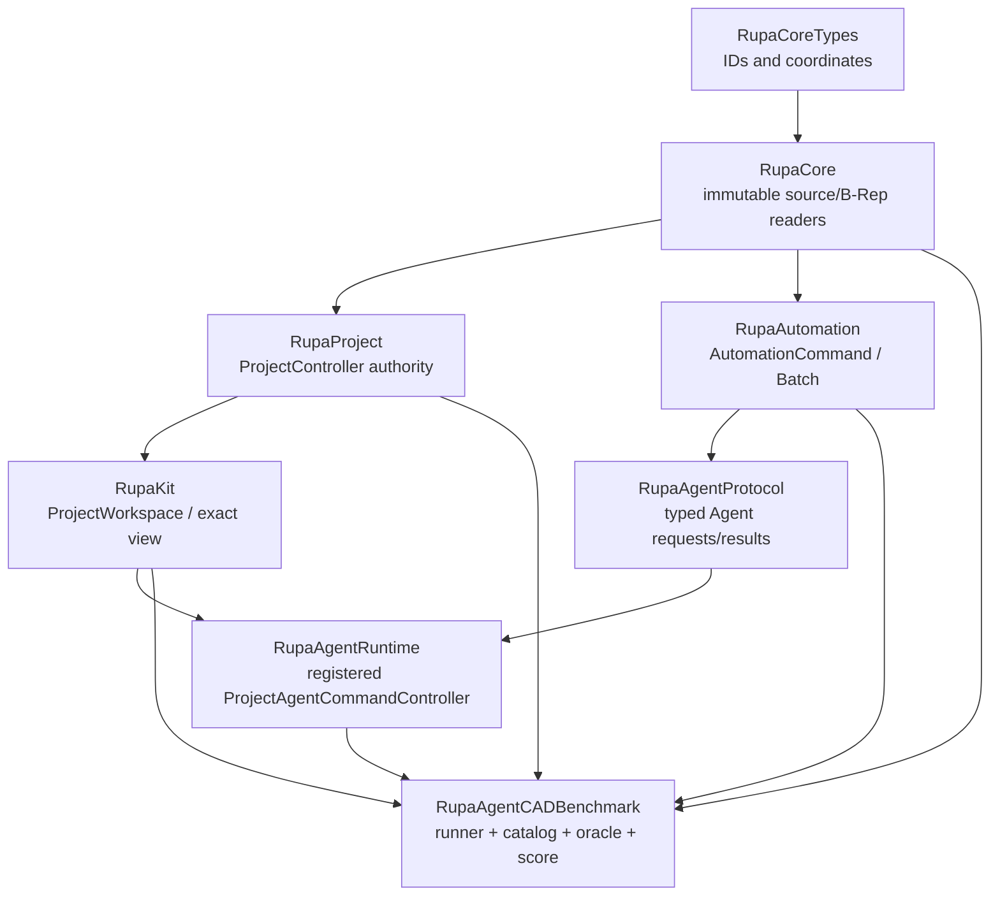
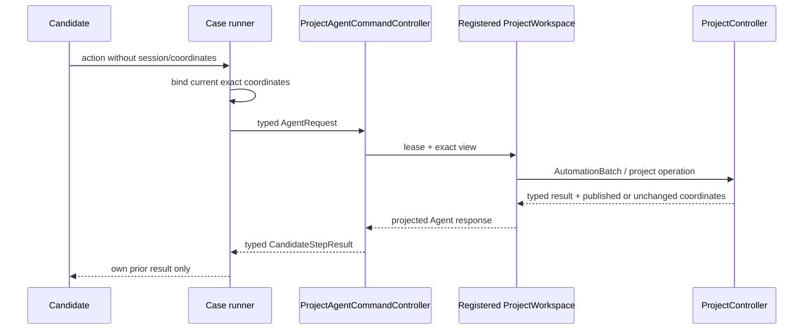
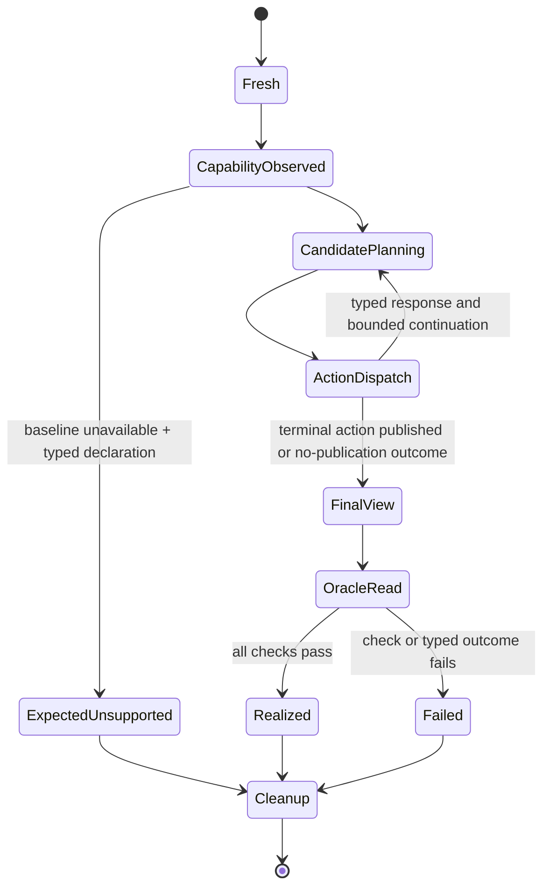
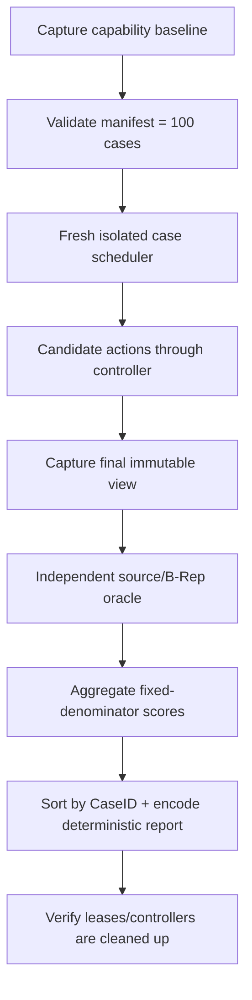

# RupaAgentCADBenchmark

## Purpose and Scope

`RupaAgentCADBenchmark` is the benchmark and verification boundary for
measuring whether an Agent can realize basic CAD geometry through Rupa's
production project route. It is a child of the [RupaKit package design](../../DESIGN.md)
and is reached from the system through that package. It has no child design.

The module defines a fixed, versioned envelope of exactly 100 CAD-basic
challenges, the separation between candidate-visible instructions and
oracle-private expected geometry, the candidate protocol, the independent
source/B-Rep oracle, binary realization semantics, and per-case execution
lifecycle. It is a testable composition module; it is not a CAD kernel, a
modeling command, a renderer, a Mesh editor, a CLI, an MCP server, or an LLM
integration.

T12-0 fixes the responsibility and evidence contract. T12-A defines the
candidate-facing public value types and catalog projection. T12-B implements
the oracle. T12-C implements the route runner. T12-V executes the 100-case
Swift Testing benchmark and records measured runtime evidence. This document
must remain the authority for the cross-sprint contracts; implementation
details belong to their owning source and test files.

## Responsibilities and Boundaries

The module owns:

- the stable case identity/category envelope and its versioned manifest digest;
- candidate-visible challenge text, required capability metadata, and bounded
  action/response protocol;
- the private expected-geometry contract and its internal catalog storage,
  which are physically separate from candidate-facing public values and are
  available only to the runner/oracle path;
- candidate output-role bindings based on typed responses from the production
  Agent route;
- per-case fresh workspace/controller/registration lifecycle and bounded
  scheduling, while project and CAD source authority remains owned by the
  production route;
- independent source-geometry and exact B-Rep observation after candidate
  execution;
- typed case outcomes, binary realization scoring, separate capability
  decision accuracy, and deterministic reports;
- measured resource-bound and concurrency evidence.

It does not own:

- `EditorSession`, `DesignDocument`, `CADDocumentStore`, swift-CAD mutation,
  or a second project authority. It may hold fresh controller/workspace
  handles during a case, but it cannot access their internal mutation APIs;
- CAD command semantics, source transaction staging, evaluation, or package
  persistence;
- candidate reasoning, prompt construction, an LLM SDK, or a transport;
- Mesh construction, Mesh editing, renderer triangles, screenshots, or visual
  similarity scoring;
- manufacturing, structural safety, certification, or professional bicycle
  design claims;
- guessed success baselines for supported geometry.

The benchmark's dependency direction is one-way:



The future SwiftPM target may depend on `RupaAgentRuntime`,
`RupaAgentProtocol`, `RupaAutomation`, `RupaKit`, `RupaProject`, `RupaCore`,
`RupaCoreTypes`, and the source-model types required by the read-only oracle.
No existing target may depend on this benchmark module, and T12-0 does not add
the target to `Package.swift`.

Candidate-facing public contracts and private oracle expectations are also
physically separated. Public source files contain only candidate-visible
values and protocol methods; they must not import, store, or mention an
expectation type. Internal catalog/expectation files own the private geometry
and are not part of the candidate-facing API. The runner is the only boundary
that projects an internal catalog entry into a public challenge and passes the
corresponding internal expectation to the read-only oracle. If a future
external candidate adapter needs a stronger compile-time boundary, it may be
placed in a separate internal target without changing this contract.

### Observed current production route

The route contract is grounded in the existing implementations and behavioral
tests, not in the future benchmark API:

| Observed boundary | Current behavior | Evidence |
|---|---|---|
| Agent entry | `ProjectAgentCommandController.handle` acquires a registered workspace lease, captures the current view, binds/checks coordinates, and maps typed errors. | [`ProjectAgentCommandController.swift`](../RupaAgentRuntime/ProjectAgentCommandController.swift), [`ProjectAgentCommandControllerTests.swift`](../../Tests/RupaUIPackageTests/ProjectAgentCommandControllerTests.swift) |
| CAD action route | `.execute`/`.executeBatch` are lowered to `AutomationBatch` and sent to `ProjectWorkspace.executeAutomation`. | [`ProjectAgentCommandController.swift`](../RupaAgentRuntime/ProjectAgentCommandController.swift), [`ProjectWorkspace.swift`](../RupaKit/ProjectWorkspace.swift) |
| Project authority | Source mutation is staged, validated against project/generation/transaction/publication coordinates, and published by the existing `ProjectController` actor. | [`ProjectController.swift`](../RupaProject/ProjectController.swift), [`ProjectSourceTransaction.swift`](../RupaProject/ProjectSourceTransaction.swift) |
| Batch isolation | `AutomationRunner` uses isolated source/workspace/read transactions and returns typed execution context/results. | [`AutomationRunner+Batch.swift`](../RupaAutomation/AutomationRunner+Batch.swift), [`AutomationStagedBatchExecutor.swift`](../RupaAutomation/AutomationStagedBatchExecutor.swift) |
| Immutable observation | Sketch summaries and exact topology snapshots read source/evaluation values without providing mutation authority. | [`SketchEntitySnapshotService.swift`](../RupaCore/SketchEntitySnapshotService.swift), [`TopologySnapshotService.swift`](../RupaCore/TopologySnapshotService.swift), [`ProjectViewSnapshot.swift`](../RupaKit/ProjectViewSnapshot.swift) |
| Failure/rollback | Stale Agent mutations are rejected and existing state remains unchanged; registered-session and cancellation/no-retry behavior are typed. | [`ProjectAgentCommandControllerTests.swift`](../../Tests/RupaUIPackageTests/ProjectAgentCommandControllerTests.swift) |

The existing [`AgentBicycleArtifactTests.swift`](../../Tests/RupaUIPackageTests/AgentBicycleArtifactTests.swift)
is retained as T10 production-route evidence only. Its fixture creates
extruded circles and rectangles, so its rendered body count or PNG must not be
treated as CAD-basic geometry oracle evidence. T12's oracle must inspect
source entities and exact B-Rep properties through the immutable final view.

## Related Designs

| Design | Relationship | Contract Used | Summary | Cautions |
|---|---|---|---|---|
| [RupaKit package design](../../DESIGN.md) | parent package | dependency direction and child ownership | Composes runtime, project, core, and application boundaries. | The benchmark target remains an upper-level consumer; the system reaches it through this package. |
| [system design](../../../DESIGN.md) | system context via package | system authority, Agent route, and T12 scope | Places this benchmark composition above the existing production route through the package hierarchy. | The benchmark is not a direct system child or project authority. |
| [RupaAgentRuntime design](../RupaAgentRuntime/DESIGN.md) | depends on | registered workspace, lease, exact view, and typed route errors | Provides the only candidate mutation/read entry point. | Candidate/reference code may create immutable public request payloads, but passes them only through the controller and never calls `EditorSession` or `ProjectWorkspace` mutation APIs directly. |
| [RupaAgentProtocol design](../RupaAgentProtocol/DESIGN.md) | depends on | typed Agent request/response values and bounded payloads | Carries route requests and projected results. | Protocol values are observations, not source authority. |
| [RupaKit integration design](../RupaKit/DESIGN.md) | depends on | workspace use cases and exact `ProjectViewSnapshot` | Supplies the application-facing workspace boundary. | The oracle may inspect an immutable final view; it cannot publish state. |
| [RupaProject design](../RupaProject/DESIGN.md) | depends on | actor-backed staging/publication and no-retry semantics | Owns source transactions and publication coordinates. | A benchmark retry is never allowed after a published mutation. |
| [RupaCore design](../RupaCore/DESIGN.md) | depends on | source identity, sketch summaries, topology snapshots, and measurements | Supplies the immutable source/B-Rep observations used by the oracle. | Tessellated Mesh and renderer output are not geometry authority. |

## Architecture

The benchmark is split into candidate-facing public contracts, an internal
catalog/expectation store, a route runner, and a read-only oracle. The public
candidate source files contain no private expectation reference. The runner
alone projects one internal catalog entry into the public challenge, mutates a
fresh isolated project through the registered controller, and passes the
matching internal expectation to the oracle. The oracle alone is read-only
with respect to the final immutable authority state.

```mermaid
flowchart LR
    Catalog["Versioned catalog\n100 public challenges"] --> Input["Candidate input\nchallenge + capability + prior typed results"]
    Private["Internal expectation source\nroles + source geometry + B-Rep checks"] --> Oracle["Read-only oracle"]
    Input --> Candidate["Candidate protocol\nreference plan or future planner"]
    Candidate --> Action["Typed candidate action\nno session or authority coordinates"]
    Action --> Runner["Per-case runner"]
    Private --> Runner
    Runner --> Input
    Runner --> Bind["Bind fresh session + current coordinates"]
    Bind --> Controller["ProjectAgentCommandController"]
    Controller --> Workspace["Registered ProjectWorkspace"]
    Workspace --> Transaction["AutomationBatch / Project transaction"]
    Transaction --> Final["Immutable final ProjectViewSnapshot"]
    Final --> Oracle
    Oracle --> Result["Binary realization + typed outcome"]
    Candidate -. "never receives or references" .-> Private
```



### Proposed module components

The later implementation keeps one major type per file. Candidate-facing public
types and internal oracle types live in separate source files (and may use
separate source directories); a public candidate file never mentions an
internal expectation type. The names below are contract names, not
implementation permission to add a parallel authority.

| Component | Visibility and responsibility | State/authority |
|---|---|---|
| `CADBenchmarkCaseID` / category | Public; stable identity and category validation | Immutable value only |
| `CADChallenge` | Public; candidate-visible instruction, units, axes, capability metadata | No expected feature IDs, topology, or plan |
| `CADExpectedGeometry` | Internal; oracle-private source/B-Rep expectation and role checks | Runner/oracle boundary only; never in public candidate files |
| `CADCandidateProtocol` | Public; bounded request/response continuation | No workspace, controller, or expectation reference |
| `CADCandidateAction` | Public; automation/read intent and typed unsupported declaration | No session, coordinate, or expectation fields |
| `CADCaseRunner` | Internal; public challenge projection, fresh lifecycle, route dispatch, response capture, cleanup | Owns ephemeral case orchestration and is the sole expectation-to-oracle handoff |
| `CADGeometryOracle` | Internal; source and exact B-Rep verification | Read-only immutable input plus internal expectation |
| `CADCaseOutcome` / score | Public result projection; failure taxonomy and binary scoring | No fallback success |
| `CADBenchmarkReport` | Public result projection; deterministic run and measurement projection | Value/report only |

## Contracts and Invariants

### 1. Exactly-100 case envelope

The catalog owns exactly these stable lexical ID ranges. A case is one
challenge, even when its expected output contains several entities or bodies.
The category denominators never change because an individual run did not
support a capability.

| Category | Stable IDs | Count | Required source intent |
|---|---|---:|---|
| `ANG` | `ANG-001`...`ANG-016` | 16 | Two finite line segments crossing at a specified point and unsigned included angle |
| `BOX` | `BOX-001`...`BOX-012` | 12 | Closed box solids; the set includes exact cubes as a defined subset |
| `CIR` | `CIR-001`...`CIR-012` | 12 | Exact circle sketch entities with center, plane, and radius |
| `CMP` | `CMP-001`...`CMP-007` | 7 | Bounded multi-primitive arrangements with explicit placement/alignment |
| `CON` | `CON-001`...`CON-008` | 8 | Coincident, parallel, perpendicular, horizontal, vertical, equal-length, concentric, and equal-radius relations |
| `CYL` | `CYL-001`...`CYL-008` | 8 | Closed analytic cylinder solids with circular profile, axis, and depth |
| `LIN` | `LIN-001`...`LIN-012` | 12 | Exact finite line segments with specified endpoints and length |
| `REC` | `REC-001`...`REC-012` | 12 | Exact rectangle sketch entities with width, height, plane, and placement |
| `SPH` | `SPH-001`...`SPH-005` | 5 | Genuine analytic sphere surface/topology and radius/center, or explicit unsupported result |
| `TRN` | `TRN-001`...`TRN-008` | 8 | Translation/rotation placements of source geometry |
| **Total** | **all IDs above** | **100** | **No implicit or generated cases** |

The public catalog manifest is a versioned value containing the ordered IDs,
category counts, challenge-input digest, and public catalog/tolerance-policy
versions. The runner's internal catalog record additionally contains the
private expectation digest and the `CapabilityAvailabilityBaseline` version
and digest; those fields never cross the candidate protocol. Any change to an
ID, input, expected geometry, role, tolerance rule, or capability
classification changes the appropriate internal version/digest. Duplicate
IDs, gaps, non-finite values, or a count other than 100 are typed catalog
errors.

The category meaning is source-oriented. A rendered circle, solid disc,
rectangle bar, polygonal sphere, or arbitrary Mesh is not a realization of the
corresponding CAD case. A `BOX` cube is accepted only when its source is a
closed box solid whose three dimensions agree within the oracle tolerance; a
visual cube is insufficient.

### 2. Candidate-visible challenge and private expectation

The candidate input contains only:

- the stable case ID and category;
- human-readable challenge text containing the requested dimensions, units,
  coordinate frame, plane, placement, and relations;
- the required capability ID/version and the current capability snapshot;
- the remaining action/round-trip budget and typed results from this
  candidate's own prior actions in this case.

The candidate input never contains:

- `CADExpectedGeometry`, private role-to-feature bindings, expected topology,
  expected feature/entity count beyond what the challenge semantically asks for,
  tolerance thresholds, or the oracle implementation;
- `EditorSession`, `DesignDocument`, `CADDocumentStore`, B-Rep objects, Mesh
  buffers, package bytes, or another case's state;
- a command recipe, reference candidate plan, prompt demonstrations, or
  candidate-supplied measurements treated as truth.

The challenge describes the requested intent, not the canonical construction
sequence. It may state an endpoint, center, radius, dimension, axis, or angle
because those are the task inputs; it does not reveal which feature/entity IDs,
topology roles, operation sequence, or representation the oracle will accept.

The private expectation contains canonical SI source values, role predicates,
allowed order-independence, relation semantics, non-degeneracy requirements,
exact source-feature/body/entity requirements, exact B-Rep predicates, and the
catalog tolerance-policy version. It is passed only from the runner's catalog
to the oracle. No candidate protocol method can request or encode it.

### 3. Candidate protocol and route boundary

The candidate protocol is a value/sink boundary:

```text
CADChallenge + CapabilitySnapshot + prior CandidateStepResult
    -> CADCandidateDecision
       -> action(CADCandidateAction)
       -> unsupported(CADUnsupportedDeclaration)
       -> finish(CADOutputRoleBindings)
```

`CADCandidateAction` contains only an Agent-level automation intent or a typed
read intent. It may carry immutable public payload values required by the
`AgentRequest`/`AutomationCommand` contract, such as `Sketch`, `SketchEntity`,
or `SketchConstraint`; these values are inert request data and are valid only
when passed through the controller route. An action does not contain a session
ID, workspace reference, project authority coordinate, `EditorSession`, or a
direct CAD object. The runner owns the mapping from this action to an
`AgentRequest`, attaches the fresh session ID and current
generation/transaction/workspace coordinates, then calls
`ProjectAgentCommandController.handle`. This rule applies equally to the
reference-plan candidate and a future natural-language/LLM adapter.

Candidate/reference code may not mutate `EditorSession`, `DesignDocument`, or
`CADDocumentStore`, evaluate the CAD kernel, construct B-Rep, construct Mesh
buffers, or call a direct swift-CAD operation. The only permitted construction
outside the production route is an immutable public request payload needed by
the typed Agent action.

Every mutation, read, and response-dependent continuation follows this path:



The runner may use one `AutomationBatch` for a simple case or several actions
when a later action depends on a returned feature ID. A batch is an execution
optimization, not a case contract. The response records command indexes and
returned primary/created `FeatureID`s. Final output-role bindings reference
those typed records and are rejected if they are missing, duplicated, stale,
out of range, or not owned by the fresh case document.

An unsupported declaration is typed and contains a required capability ID,
capability version, and bounded reason code. It is accepted as
`expectedUnsupported` only when the immutable capability baseline says that
the case capability is unavailable. A candidate cannot turn an arbitrary
command error or a successful message into unsupported success. An unsupported
declaration ends the case without publication and without a substitute
primitive.

### 4. Capability and execution baselines

The benchmark keeps two different, versioned baselines. Neither is guessed
from a desired case count or inferred from a screenshot.

`CapabilityAvailabilityBaseline` records what the exact production controller
can expose before a case run. It contains:

1. the exact `AgentCapabilityDescriptor`/registry snapshot exposed by the
   production controller;
2. the route and version used for each capability, if one exists;
3. a typed structural absence record when no analytic-sphere route is exposed;
4. the observation toolchain, platform, catalog version, and timestamp; and
5. a digest over the canonical availability fields. The observation timestamp
   is audit metadata and is excluded from the digest so a later observation in
   the same environment does not create artificial baseline drift.

This availability baseline determines whether an unsupported declaration is
expected. It is independent of whether a candidate succeeds at an available
capability.

`ExecutionRegressionBaseline` records the observed terminal result for every
case, including the typed outcome and oracle-check summary, only after the
first complete 100-case reference execution has traversed the production route
and oracle. It also records the exact environment fingerprint, catalog
manifest/tolerance versions, capability-availability version/digest, route and
evaluator versions, and a digest over the per-case results. A partial run,
oracle failure, or infrastructure-invalid run cannot establish or update this
baseline, and an infrastructure failure is never converted into a canonical
case failure.

Subsequent regression-green evaluation requires exact equality of the
environment, catalog, and capability-availability baselines and equality of
the typed per-case outcomes/check summaries to the execution regression
baseline. Any mismatch is an explicit run-level `baselineDrift` result; it is
not a silent baseline rewrite or a failure assigned to each case. A new
baseline requires another complete valid execution and review.

The five `SPH` cases require an analytic sphere source and exact B-Rep sphere
surface/topology. Under a baseline that has no such capability, the reference
candidate declares typed unsupported before mutation and the runner proves zero
publication. A circle, cylinder, polygon/polyhedron, extruded disc, or Mesh
cannot satisfy an `SPH` case. If a future capability is exposed, the baseline
version must advance and the unchanged sphere oracle must observe genuine
analytic sphere geometry before the cases can be realized. A capability
baseline drift produces the run-level `baselineDrift` result and invalidates
regression comparison; it does not silently rewrite expected unsupported or
success counts.

### 5. Source/B-Rep oracle

The oracle is independent of candidate claims and renderer output. It accepts a
read-only immutable final view plus the typed output-role bindings captured by
the runner. It may read:

- source `DesignDocument` and its CAD design graph for exact sketch entities,
  source dimensions, source feature/body identity, and scene placement;
- `SketchEntitySnapshotService` for resolved entity kind, endpoints, centers,
  radii, planes, dimensions, constraints, and relation data;
- `MeasurementService` for source-derived measurements where its contract
  applies;
- `TopologySnapshotService` with the final immutable evaluation context for
  exact B-Rep body/face/edge/vertex topology and analytic curve/surface fields.

It never mutates those values, invokes candidate commands, reads candidate
assertions as measurements, or uses tessellated Mesh bounds as source truth.

The oracle's required checks are:

| Family | Required checks |
|---|---|
| `LIN` | Exact line entity count and kind; resolved endpoints/length/plane; finite non-degenerate span; no unbound extra entity |
| `REC` | Four line entities forming one closed rectangle; width/height/aspect, plane, placement, corners, and no extra/unbound edge |
| `CIR` | Exact circle entity count/kind; center, plane, radius, finite non-degenerate radius; no polygonal approximation |
| `ANG` | Two required finite line entities; shared intersection point; endpoint/length semantics; unsigned included angle from normalized source directions; no accidental parallel or extra line |
| `BOX` | Exact source feature/body count; closed non-degenerate solid; planar box topology; three dimensions, placement, bounds, and volume; cube equality when required |
| `CYL` | Exact source feature/body count; analytic circular profile and cylindrical/planar B-Rep topology; radius, axis, depth, placement, bounds, and volume |
| `CON` | Exact required sketch relation kind/count and satisfied source relation; no equivalent-looking but absent constraint |
| `TRN` | Source geometry identity preserved under required translation/rotation; transform values and resulting placement checked independently |
| `CMP` | Exact bounded members, semantic role bindings, relative placements/alignment, and required independent bodies/features |
| `SPH` | Genuine analytic sphere surface/topology, center, radius, closed non-degenerate body; substitute circle/cylinder/polyhedron/Mesh rejected |
| All | Finite values, modeling-tolerance non-degeneracy, role completeness, no unbound required source geometry, and stable source ownership |

Entity order is ignored only when the challenge explicitly leaves order free;
identity and role completeness are never ignored. For lines, endpoint role
orientation is checked separately from an explicitly unsigned included angle.
The unsigned angle contract uses normalized source directions and a bounded
angle predicate; it never compares display text or rounded labels.

### 6. Tolerance and canonical units

All expected and observed source values are canonicalized to SI metres/radians
before comparison. The authority for the linear and angular degeneracy floor is
the fresh case document's `ModelingTolerance`. A catalog version may add a
fixed, documented relative comparison term for large values:

```text
linearAccept(e, o) := abs(e - o)
    <= max(documentTolerance.distance,
           fixedRelativeFactor * max(1, abs(e), abs(o)))

angleAccept(e, o) := normalizedAngularDistance(e, o)
    <= max(documentTolerance.angle, fixedAngularFactor)
```

The relative factors and any relation-specific rule are catalog-owned constants
chosen and verified from the authoritative source/evaluator behavior in
T12-A. They are not widened from candidate output, observed error, display
units, tessellation settings, or a failing case. Values within the kernel
degeneracy boundary are invalid rather than approximately accepted. Non-finite
or overflowed values are typed validation failures.

### 7. Case outcomes and scoring

Each case has one terminal typed outcome. Realization is binary: every required
source and B-Rep check passes, or the case is not realized. A successful Agent
message, a body count, a screenshot, or a renderer triangle count alone cannot
produce `realized`.

| Outcome | Meaning | Publication/scoring |
|---|---|---|
| `realized` | All required oracle checks pass | Counts once in primary and category realization |
| `expectedUnsupported` | Candidate declared a capability absent in the observed baseline; no mutation published | Not realized; capability decision is correct |
| `unexpectedUnsupported` | Candidate/route reports unsupported for a capability observed as available, or the declaration does not match baseline | Not realized; capability decision is wrong |
| `invalidSubmission` | Candidate output violates protocol, bounds, binding, finiteness, or candidate/oracle separation | Not realized; no fallback |
| `executionFailure` | Production route rejects or fails the candidate action before a valid oracle state | Not realized; preserve typed route error |
| `oracleFailure` | Oracle cannot execute its own required read/validation contract | Run is invalid; no case failure becomes canonical and no regression baseline is updated |
| `timeout` | Candidate or case deadline expires before terminal result | Not realized; no retry after publication |
| `cancellation` | Explicit cancellation is observed at a defined boundary | Not realized; no retry after publication |
| `infrastructureFailure` | Harness cannot create/isolate/route/cleanup or violates its own contract | Entire run invalid; no case failure becomes canonical and no regression baseline is updated |

The primary score is `realized / 100`. Each category retains its fixed
denominator. A secondary supported-geometry realization rate uses only the
cases whose capability baseline is observed available and reports the excluded
expected-unsupported count explicitly. Capability-decision accuracy is a
separate value: a candidate must attempt available cases and declare
unsupported only for unavailable cases. Neither metric is substituted for the
other, and the reference-plan score is labelled control-path evidence rather
than natural-language or LLM reasoning evidence.

Oracle or infrastructure failure makes the run invalid instead of assigning a
zero or success to an unobserved case. A published-mutation projection failure
retains the exact committed coordinate and is terminal/no-retry; the runner
must not replay the action to improve a score. Baseline mismatch is represented
as the run-level `baselineDrift` status described above, not as a fabricated
per-case failure.

### 8. Fresh lifecycle, isolation, and concurrency

For every case, the runner creates a new default `ProjectController`,
`ProjectWorkspace`, registration lease, project/session ID, generation,
transaction revision, publication sequence, and empty CAD authority. The
workspace publishes its initial view before registration, as required by the
existing runtime contract. Registration is removed in a guaranteed cleanup
path after all operations finish, including cancellation and timeout.

Cases share no workspace, controller, registration lease, package, output file,
mutable static fixture, or generated identifier. The scheduler may run cases
serially or at an explicit bounded concurrency, but each case's candidate and
oracle state remains private. The final report is sorted by lexical CaseID,
regardless of completion order. The run records requested concurrency and
observed concurrency; MainActor/project-actor serialization is reported as a
measurement and is not described as parallel CAD execution.

### 9. Resource bounds and measurement rule

T12-0 fixes which resources must be bounded, not guessed numeric values. The
owner selects checked-in values only after a clean reference baseline and
serial/bounded-parallel measurements. The selected value must be above the
observed p95/max envelope by a documented margin, below an absolute safety
ceiling, and be remeasured when the toolchain, evaluator, catalog, or route
changes.

| Resource | Bound required | Measurement owner |
|---|---|---|
| Candidate rounds/actions | Per-case and batch command count | Runner/reference candidate |
| Read work | Read records, topology/entity visits, diagnostics | Oracle and route runner |
| Source output | Generated feature/entity/body count | Project/CAD observation |
| Exact evaluation | Evaluation passes and elapsed work | ProjectController metrics |
| Time | Planning, case, and whole-run deadlines | Runner timing evidence |
| Concurrency | Explicit scheduler maximum and observed active cases | Scheduler measurement |
| Report | Per-case checks, diagnostics, and encoded byte ceiling | Report owner |

Every bound is charged before materializing unbounded candidate output where the
owning route exposes a preflight. Cancellation is checked before planning,
before each action/publication, before exact oracle work, and before report
return. Candidate timeout is a candidate outcome. Harness timeout, leaked
registration, or inability to terminate work is infrastructure failure.

### 10. Evidence classes and non-goals

The deterministic reference-plan candidate is a control subject. Its result
proves that the benchmark catalog, runner, production Agent route, project
transaction, exact source/B-Rep oracle, and report arithmetic can be traversed.
It does not measure language understanding, planning quality, or LLM reasoning.

A future natural-language/LLM adapter may implement the same
`CADCandidateProtocol` only in a separately authorized task. It receives the
same candidate-visible input, cannot receive the private expectation, and must
use the same runner and route. T12 adds no LLM SDK, prompt demonstrations,
CLI, MCP, renderer, Mesh edit, file save/load, or bicycle-specific CAD command.

## Runtime Flows

### Case lifecycle



The production route itself linearizes coordinates. The benchmark binds the
current exact view immediately before each Agent request, but never rebases a
stale candidate action after a publication. A response-dependent action may
use only the prior typed response returned by this same case. After a published
mutation, a committed-mutation/no-retry result is terminal.

### Run lifecycle



## State, Ownership, and Lifecycle

The catalog and private expectations are immutable values owned by the
benchmark run. A candidate owns only its own decision state and prior typed
responses. The runner owns the ephemeral per-case controller, workspace,
registration lease, coordinate binding, action budget, and response log until
cleanup and is the only benchmark component allowed to mutate a fresh project,
always through the registered controller route. The oracle owns no live project
state and is read-only; it consumes one immutable final view and returns a
value report.

No benchmark state is persisted as a project source, package, CAD document, or
Mesh asset. Reports are values in T12; application-owned save/load remains
outside the benchmark. If a future report file is added, it must be a separate
application/reporting task and cannot become a source authority.

## Failure, Concurrency, and Constraints

The runner preserves the existing registration lease and project coordinate
contracts. Stale generation, transaction/publication/workspace revision,
invalid plan, session loss, route mismatch, and committed post-publication
errors remain typed route outcomes. The benchmark maps them to the case
taxonomy without replacing the original code or message.

No operation is retried after a source or interaction publication. Before
publication, cancellation or a stale coordinate discards the case's staged
work; after publication, the exact commit coordinate is retained and the case
terminates with no-retry semantics. A failed cleanup, leaked task, shared
mutable fixture, or cross-case state observation is an infrastructure failure.

The benchmark's source boundary scan must allow immutable public payload values
required by `AgentRequest`/`AutomationCommand` (for example `Sketch`,
`SketchEntity`, or `SketchConstraint`) only when they are dispatched solely
through `ProjectAgentCommandController`. It must reject candidate/reference
plan calls to `EditorSession.execute`, direct `DesignDocument` or
`CADDocumentStore` mutation, CAD-kernel evaluation, B-Rep construction, direct
swift-CAD mutation, and direct Mesh-buffer creation. The oracle's read-only use
of immutable source/B-Rep services is allowed and must be distinguishable from
candidate code in the physical source layout and visibility boundary.

## Verification and Change Impact

T12-0 verifies the contract and hierarchy; it does not claim that the 100
cases, oracle, runner, or baseline have been implemented. Later proofs are
owned by the following work items:

| Invariant | Owning work item | Required behavioral evidence |
|---|---|---|
| Production route and no direct shortcut | T12-0.1 / T12-C.5 | Original implementation reading plus registered-controller tests; architecture scan permits only immutable public request payloads and rejects direct mutation, kernel evaluation, and B-Rep construction |
| Candidate/oracle information separation | T12-0.2 / T12-A.5 | Candidate-facing public source files contain no expectation references; runner-only projection and private visibility/physical-boundary tests reject malformed leakage paths |
| Exactly 100 stable cases | T12-A.2–A.3 | Lexical IDs, fixed category counts, uniqueness, manifest digest, and catalog drift tests |
| Source and B-Rep authority | T12-B.1–B.2 | Immutable source/entity/measurement/topology reads reject wrong, extra, missing, degenerate, and substitute geometry |
| Sphere honesty | T12-B.2D / T12-C.2D / T12-V.1 | Capability-availability baseline observation yields typed expected unsupported with zero publication when analytic sphere is absent; future analytic sphere is accepted only by the unchanged oracle and both baseline digests are recorded |
| Binary realization and separate decision accuracy | T12-B.3 | Per-check evidence, fixed denominators, arithmetic tests, no success fallback, and explicit control-path label |
| Fresh lifecycle and no leakage | T12-C.1 / T12-C.4 | Per-case unique authority/IDs, cleanup, serial-vs-concurrent deterministic equality, and cancellation termination |
| Measured resource limits | T12-C.3 / T12-V.3 | Reference p50/p95/max, selected margin, timeout behavior, bounded concurrency, and no leaked work |
| Complete 100-case behavior | T12-V | First complete valid all-case run through production route and oracle establishes the evidence-derived execution regression baseline; later green runs compare exact environment/catalog/capability digests and typed outcomes, while invalid runs cannot update it |

Any change to `ProjectAgentCommandController`, `ProjectWorkspace`,
`AutomationBatch`, project publication coordinates, topology/sketch read
services, capability descriptors, catalog manifest, tolerance policy, or
outcome arithmetic requires rechecking this design and the package/system
parents. A type-only build or screenshot cannot close a behavioral proof.
