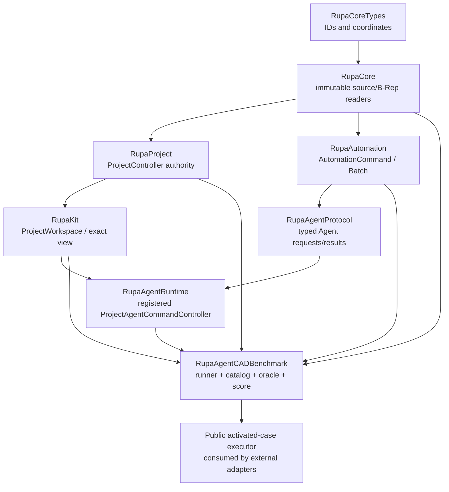
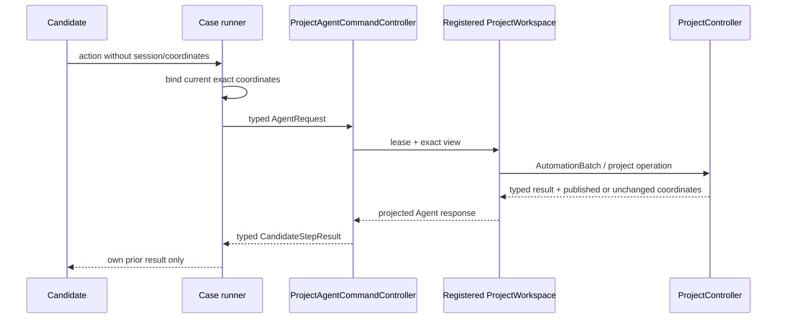
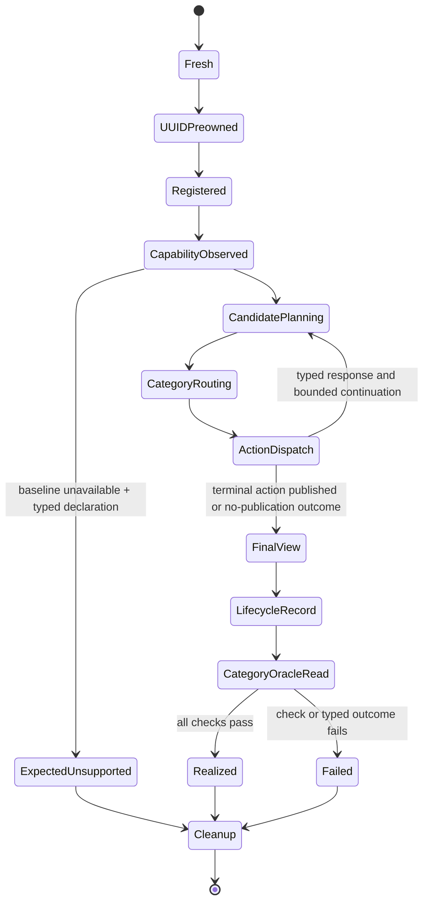
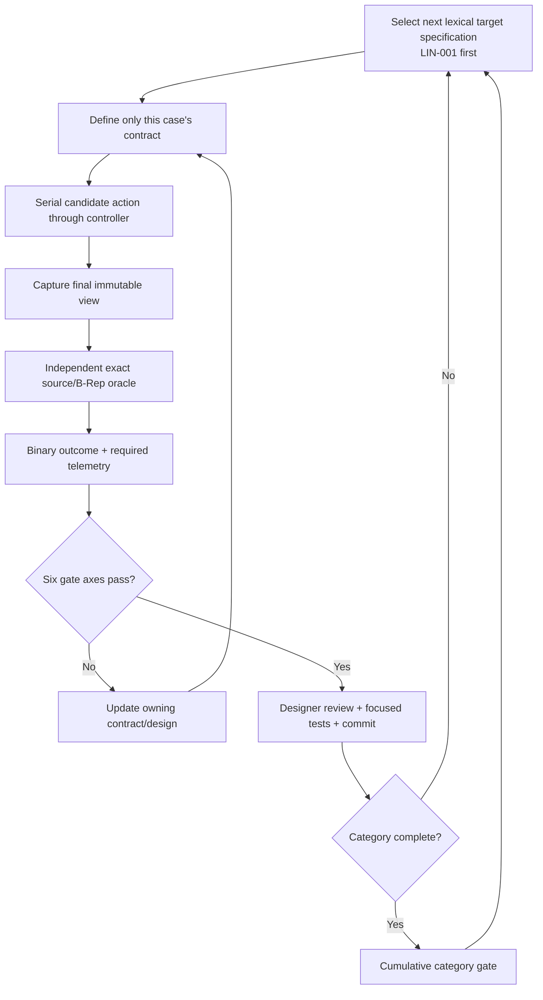

# RupaAgentCADBenchmark

## Purpose and Scope

`RupaAgentCADBenchmark` is the benchmark and verification boundary for
measuring whether an Agent can realize basic CAD geometry through Rupa's
production project route. It is a child of the [RupaKit package design](../../DESIGN.md)
and is reached from the system through that package. It has no child design.

The module defines a fixed, versioned envelope of exactly 100 CAD-basic
challenges, the separation between candidate-visible instructions and
oracle-private expected geometry, the candidate protocol, the independent
source/B-Rep oracle, binary realization semantics, and per-case execution
lifecycle. For the separately authorized external-Agent task it also exposes a
minimal activated-case context/executor contract while retaining every private
expectation and live project value internally. It is a testable composition module; it is not a CAD kernel, a
modeling command, a renderer, a Mesh editor, a CLI, an MCP server, or an LLM
integration.

T12-0 fixes the responsibility and evidence contract. Subsequent work proceeds
vertically by case instead of implementing catalog, oracle, runner, and report
layers for all categories in advance. The existing 100 IDs are target
specifications. A case becomes verified only after its candidate contract,
production route, exact oracle, failure behavior, telemetry, focused tests,
designer gate review, and commit are all complete. `LIN-001` is the first case;
no later case or general all-category engine may be used to claim its evidence.
This document remains the authority for those cumulative contracts.

## Responsibilities and Boundaries

The module owns:

- the stable case identity/category envelope and its versioned manifest digest;
- candidate-visible challenge text, required capability metadata, and bounded
  action/response protocol;
- the private expected-geometry contract and its internal catalog storage,
  which are physically separate from candidate-facing public values and are
  available only to the runner/oracle path;
- candidate output-role bindings based on typed responses from the production
  Agent route;
- per-case fresh workspace/controller/registration lifecycle and bounded
  scheduling, while project and CAD source authority remains owned by the
  production route;
- independent source-geometry and exact B-Rep observation after candidate
  execution;
- typed case outcomes, binary realization scoring, separate capability
  decision accuracy, and deterministic reports;
- measured resource-bound and concurrency evidence.
- a monotonic activation ledger that distinguishes an unmeasured target
  specification from a gate-reviewed case with actual behavioral evidence.
- the public activated-case executor that accepts any `CADCandidateProtocol`
  and projects only a sanitized `CADCaseResult` after the same category facade,
  production lifecycle, exact oracle, and cleanup have completed.

It does not own:

- `EditorSession`, `DesignDocument`, `CADDocumentStore`, swift-CAD mutation,
  or a second project authority. It may hold fresh controller/workspace
  handles during a case, but it cannot access their internal mutation APIs;
- CAD command semantics, source transaction staging, evaluation, or package
  persistence;
- candidate reasoning, prompt construction, an LLM SDK, JSON framing, process
  I/O, a CLI, MCP, or another transport;
- Mesh construction, Mesh editing, renderer triangles, screenshots, or visual
  similarity scoring;
- manufacturing, structural safety, certification, or professional bicycle
  design claims;
- guessed success baselines for supported geometry.
- category-wide implementation claims based only on types, generated catalog
  data, or tests that do not traverse the production Agent route and oracle.

The benchmark's dependency direction is one-way:



The SwiftPM target depends on `RupaAgentRuntime`,
`RupaAgentProtocol`, `RupaAutomation`, `RupaKit`, `RupaProject`, `RupaCore`,
`RupaCoreTypes`, and the source-model types required by the read-only oracle.
No existing production authority target may depend on this benchmark module.

Candidate-facing public contracts and private oracle expectations are also
physically separated. Public source files contain only candidate-visible
values and protocol methods; they must not import, store, or mention an
expectation type. Internal catalog/expectation files own the private geometry
and are not part of the candidate-facing API. A thin category facade is the
only boundary that projects an internal catalog entry into a public challenge
and passes the corresponding private expectation to its read-only category
oracle; the shared lifecycle harness cannot receive it. The separately
authorized external candidate adapter is therefore placed in
the separate `RupaAgentCADBenchmarkJSONAdapter` target and consumes only the
public executor/context contract.

### Observed current production route

The route contract is grounded in the existing implementations and behavioral
tests, not in the future benchmark API:

| Observed boundary | Current behavior | Evidence |
|---|---|---|
| Agent entry | `ProjectAgentCommandController.handle` acquires a registered workspace lease, captures the current view, binds/checks coordinates, and maps typed errors. | [`ProjectAgentCommandController.swift`](../RupaAgentRuntime/ProjectAgentCommandController.swift), [`ProjectAgentCommandControllerTests.swift`](../../Tests/RupaUIPackageTests/ProjectAgentCommandControllerTests.swift) |
| CAD action route | `.execute`/`.executeBatch` are lowered to `AutomationBatch` and sent to `ProjectWorkspace.executeAutomation`. | [`ProjectAgentCommandController.swift`](../RupaAgentRuntime/ProjectAgentCommandController.swift), [`ProjectWorkspace.swift`](../RupaKit/ProjectWorkspace.swift) |
| Project authority | Source mutation is staged, validated against project/generation/transaction/publication coordinates, and published by the existing `ProjectController` actor. | [`ProjectController.swift`](../RupaProject/ProjectController.swift), [`ProjectSourceTransaction.swift`](../RupaProject/ProjectSourceTransaction.swift) |
| Batch isolation | `AutomationRunner` uses isolated source/workspace/read transactions and returns typed execution context/results. | [`AutomationRunner+Batch.swift`](../RupaAutomation/AutomationRunner+Batch.swift), [`AutomationStagedBatchExecutor.swift`](../RupaAutomation/AutomationStagedBatchExecutor.swift) |
| Result identity | `AutomationResult` defaults `primaryFeatureID` to `createdFeatureIDs.first`, so a successful creation response may intentionally expose the same FeatureID through both primary and created selectors. | [`AutomationResult.swift`](../RupaAutomation/AutomationResult.swift) |
| Rectangle mutation | `AutomationCommand.createRectangleSketch` reaches `EditorCommand.createRectangleSketch`; `SketchBuilder.rectangle` creates four constrained lines centred on the selected source-plane origin. The command has width, height, and plane inputs but no separate centre input. | [`AutomationCommand.swift`](../RupaAutomation/AutomationCommand.swift), [`AutomationRunner.swift`](../RupaAutomation/AutomationRunner.swift), [`DesignDocument+SketchCreation.swift`](../RupaCore/DesignDocument+SketchCreation.swift) |
| Rectangle observation | `SketchEntitySnapshotService` exposes the stored sketch plane, exact line endpoints and entity counts, and closed profile-region data needed by a read-only rectangle oracle. | [`SketchEntitySnapshotService.swift`](../RupaCore/SketchEntitySnapshotService.swift) |
| Circle mutation | `AutomationCommand.createCircleSketch` resolves the selected plane and reaches `EditorCommand.createCircleSketch`; `DesignDocument.createCircleSketch` validates a positive resolved radius and stores one analytic `SketchEntity.circle` profile. | [`AutomationCommand.swift`](../RupaAutomation/AutomationCommand.swift), [`AutomationRunner.swift`](../RupaAutomation/AutomationRunner.swift), [`DesignDocument+SketchCreation.swift`](../RupaCore/DesignDocument+SketchCreation.swift) |
| Circle observation | `SketchEntitySnapshotService` exposes the stored sketch plane plus analytic entity kind, resolved centre, and radius; it does not require tessellated display geometry. | [`SketchEntitySnapshotService.swift`](../RupaCore/SketchEntitySnapshotService.swift) |
| Immutable observation | Sketch summaries and exact topology snapshots read source/evaluation values without providing mutation authority. | [`SketchEntitySnapshotService.swift`](../RupaCore/SketchEntitySnapshotService.swift), [`TopologySnapshotService.swift`](../RupaCore/TopologySnapshotService.swift), [`ProjectViewSnapshot.swift`](../RupaKit/ProjectViewSnapshot.swift) |
| Failure/rollback | Stale Agent mutations are rejected and existing state remains unchanged; registered-session and cancellation/no-retry behavior are typed. | [`ProjectAgentCommandControllerTests.swift`](../../Tests/RupaUIPackageTests/ProjectAgentCommandControllerTests.swift) |

The existing [`AgentBicycleArtifactTests.swift`](../../Tests/RupaUIPackageTests/AgentBicycleArtifactTests.swift)
is retained as T10 production-route evidence only. Its fixture creates
extruded circles and rectangles, so its rendered body count or PNG must not be
treated as CAD-basic geometry oracle evidence. T12's oracle must inspect
source entities and exact B-Rep properties through the immutable final view.

## Related Designs

| Design | Relationship | Contract Used | Summary | Cautions |
|---|---|---|---|---|
| [RupaKit package design](../../DESIGN.md) | parent package | dependency direction and child ownership | Composes runtime, project, core, and application boundaries. | The benchmark target remains an upper-level consumer; the system reaches it through this package. |
| [system design](../../../DESIGN.md) | system context via package | system authority, Agent route, and T12 scope | Places this benchmark composition above the existing production route through the package hierarchy. | The benchmark is not a direct system child or project authority. |
| [RupaAgentRuntime design](../RupaAgentRuntime/DESIGN.md) | depends on | registered workspace, lease, exact view, and typed route errors | Provides the only candidate mutation/read entry point. | Candidate/reference code may create immutable public request payloads, but passes them only through the controller and never calls `EditorSession` or `ProjectWorkspace` mutation APIs directly. |
| [RupaAgentProtocol design](../RupaAgentProtocol/DESIGN.md) | depends on | typed Agent request/response values and bounded payloads | Carries route requests and projected results. | Protocol values are observations, not source authority. |
| [RupaKit integration design](../RupaKit/DESIGN.md) | depends on | workspace use cases and exact `ProjectViewSnapshot` | Supplies the application-facing workspace boundary. | The oracle may inspect an immutable final view; it cannot publish state. |
| [RupaProject design](../RupaProject/DESIGN.md) | depends on | actor-backed staging/publication and no-retry semantics | Owns source transactions and publication coordinates. | A benchmark retry is never allowed after a published mutation. |
| [RupaCore design](../RupaCore/DESIGN.md) | depends on | source identity, sketch summaries, topology snapshots, and measurements | Supplies the immutable source/B-Rep observations used by the oracle. | Tessellated Mesh and renderer output are not geometry authority. |
| [Benchmark JSON adapter](../RupaAgentCADBenchmarkJSONAdapter/DESIGN.md) | used by | activated context/executor, explicit decision codecs, sanitized result | Binds a versioned external JSON decision to the same candidate protocol and production/oracle route. | JSON, fingerprints, byte limits, process I/O, and error envelopes remain outside this module. |

## Architecture

The benchmark is split into target specifications, candidate-facing public
contracts, an internal expectation store, thin category facades, one shared
production lifecycle harness, read-only category oracles, and a case-evidence
ledger. Only cases in the reviewed activation ledger may compose all of those
responsibilities. Public candidate source files contain no private expectation
reference. A category facade alone pairs the public projection with its private
expectation and passes that expectation directly to its category oracle. The
harness receives only public candidate values and category-routed production
requests, mutates a fresh isolated project through the registered controller,
and returns an immutable lifecycle record and final view; it cannot inspect an
expectation or decide geometry correctness.

```mermaid
flowchart LR
    Specs["100 target specifications\nunverified by default"] --> Active["Reviewed activation ledger\nadded one case at a time"]
    Active --> Input["Public challenge text\ncapability + prior typed results"]
    Private["Internal expectation\nsource + B-Rep predicates"] --> Facade
    Active --> Private
    Input --> Candidate["Candidate protocol"]
    Candidate --> Executor["Activated-case executor\ncurrent reviewed dispatch"]
    Executor --> Facade["Thin category facade\npublic projection + private oracle handoff"]
    Facade --> Harness["CADCaseLifecycleHarness\nfresh route + immutable record"]
    Harness --> Controller["ProjectAgentCommandController"]
    Controller --> Workspace["Registered ProjectWorkspace"]
    Workspace --> Final["Immutable final ProjectViewSnapshot"]
    Final --> Facade
    Facade --> Oracle
    Oracle --> Evidence["Binary outcome + telemetry"]
    Evidence --> Gate["Six-axis Vertical Case Gate"]
    Gate -->|pass + review + commit| Ledger["Verified case ledger"]
    Gate -->|fail| Redesign["Update contract/design\nretry same case"]
    Redesign --> Active
    Ledger --> Next["Activate next lexical case"]
    Candidate -. "cannot receive" .-> Private
```



### Proposed module components

The later implementation keeps one major type per file. Candidate-facing public
types and internal oracle types live in separate source files (and may use
separate source directories); a public candidate file never mentions an
internal expectation type. The names below are contract names, not
implementation permission to add a parallel authority.

| Component | Visibility and responsibility | State/authority |
|---|---|---|
| `CADBenchmarkCaseID` / category | Public; stable identity, category validation, and one single-value string Codable representation | Immutable scalar value only; decoding validates the ID and rejects the synthesized object shape without fallback |
| `CADChallenge` | Public projection; candidate-visible instruction, capability metadata, roles, and budget | No structured expected geometry, feature IDs, topology, tolerance, or plan |
| `CADExpectedGeometry` | Internal; oracle-private source/B-Rep expectation and role checks | Category-facade/oracle boundary only; never enters the shared lifecycle harness or public candidate files |
| `CADCandidateProtocol` | Public; bounded request/response continuation | No workspace, controller, or expectation reference |
| `CADCandidateAction` | Public; reviewed sketch intent and, beginning with BOX-001, one bounded solid intent | No session, authority coordinate, expectation, or future-category transform fields |
| `CADActivatedCaseExecuting` / `DefaultCADActivatedCaseExecutor` | Public; exact activated-ID list, candidate context, one candidate evaluation, and sanitized result | Dispatches only reviewed category facades; no private expectation, live view, internal evidence, or direct mutation escapes |
| `CADActivatedLineCase` | Internal; the reviewed line IDs that may enter behavioral execution | Adds exactly one ID only when that case's vertical implementation begins; catalog presence alone is never activation |
| `CADActivatedRectangleCase` | Internal; the reviewed rectangle IDs that may enter behavioral execution | Contains only REC-001 when introduced and advances one reviewed case per commit |
| `CADActivatedCircleCase` | Internal; the reviewed circle IDs that may enter behavioral execution | Contains the complete reviewed CIR-001...012 category in catalog order; no CIR-013 exists |
| `CADActivatedAngleCase` | Internal; the reviewed angle IDs that may enter behavioral execution | Contains only ANG-001 when introduced and advances one reviewed case per commit |
| `CADActivatedBoxCase` | Internal; the reviewed box IDs that may enter behavioral execution | Begins with BOX-001 and advances one reviewed case per commit; catalog presence never activates a box |
| `CADCaseActionPlan` / `CADCaseActionRouting` | Internal; converts an activated category action plus public challenge context into either one command or one bounded atomic batch | Has no session/coordinate/workspace/source authority and cannot read a private expectation; completed single-command facades keep their existing branch |
| `CADCaseLifecycleHarness` | Internal; owns the shared fresh controller/workspace, pre-owned registration UUID, exact coordinate binding, deadline, production dispatch, final immutable view capture, and unconditional cleanup | The only shared mutable lifecycle owner; it does not select cases, map geometry, run an oracle, or project a category result |
| `CADCaseLifecycleRecord` | Internal immutable output from the harness | Preserves initial/final coordinates, typed response, publication/no-retry state, cleanup state, and common count/timing telemetry without geometry assertions |
| `CADLineCaseRunner` | Internal thin line facade | Owns line activation, public projection, line routing/mapping, private expectation-to-line-oracle handoff, and line result projection; delegates lifecycle only |
| `CADLineOracle` | Internal line-category extraction beginning at LIN-002; exact finite-line source verification and zero-body evaluation check | Read-only immutable input plus the selected activated line's internal expectation |
| `CADRectangleCaseRunner` / `CADRectangleOracle` | Internal thin REC-001 facade and exact rectangle oracle | Own rectangle projection/routing/mapping, private rectangle expectation, four-line/profile checks, and rectangle result projection; delegate lifecycle only |
| `CADCircleCaseRunner` / `CADCircleOracle` | Internal thin CIR-001 facade and exact analytic-circle oracle | Own circle projection/routing/mapping, private circle expectation, analytic entity/centre/radius/profile checks, and circle-local result projection; delegate lifecycle only |
| `CADAngleCaseRunner` / `CADAngleOracle` | Internal thin ANG-001 facade and exact two-line source oracle | Own angle projection, affine intersection mapping, ordered two-command batch, private angle expectation, role/intersection/length/unsigned-angle checks, and angle-local result projection; delegate lifecycle only |
| `CADBoxCaseRunner` / `CADBoxOracle` | Internal thin BOX facade and exact closed-box source/B-Rep oracle | Own box projection, lower-corner-to-profile mapping, one-command solid routing, private box expectation, source profile/extrude/body/topology checks, and box-local result projection; delegate lifecycle only |
| `CADCaseOutcome` / score | Public result projection; failure taxonomy and binary scoring | No fallback success |
| `CADBenchmarkReport` | Public result projection; deterministic run and measurement projection | Value/report only |

## Contracts and Invariants

### 1. Exactly-100 case envelope

The catalog owns exactly these stable lexical ID ranges as final target
specifications. A case is one challenge, even when its expected output contains
several entities or bodies. The category denominators never change because an
individual run did not support a capability. Catalog presence, successful
decoding, or a stable digest does not mean that a case has been implemented or
measured. Verification state is held separately and advances only after the
case's Vertical Case Gate passes and its evidence is committed.

| Category | Stable IDs | Count | Required source intent |
|---|---|---:|---|
| `ANG` | `ANG-001`...`ANG-016` | 16 | Two finite line segments crossing at a specified point and unsigned included angle |
| `BOX` | `BOX-001`...`BOX-012` | 12 | Closed box solids; the set includes exact cubes as a defined subset |
| `CIR` | `CIR-001`...`CIR-012` | 12 | Exact circle sketch entities with center, plane, and radius |
| `CMP` | `CMP-001`...`CMP-007` | 7 | Bounded multi-primitive arrangements with explicit placement/alignment |
| `CON` | `CON-001`...`CON-008` | 8 | Coincident, parallel, perpendicular, horizontal, vertical, equal-length, concentric, and equal-radius relations |
| `CYL` | `CYL-001`...`CYL-008` | 8 | Closed analytic cylinder solids with circular profile, axis, and depth |
| `LIN` | `LIN-001`...`LIN-012` | 12 | Exact finite line segments with specified endpoints and length |
| `REC` | `REC-001`...`REC-012` | 12 | Exact rectangle sketch entities with width, height, plane, and placement |
| `SPH` | `SPH-001`...`SPH-005` | 5 | Genuine analytic sphere surface/topology and radius/center, or explicit unsupported result |
| `TRN` | `TRN-001`...`TRN-008` | 8 | Translation/rotation placements of source geometry |
| **Total** | **all IDs above** | **100** | **No implicit or generated cases** |

`CADBenchmarkCaseID` is the wire authority for a case identity. Every direct or
nested Codable occurrence encodes as the same validated string, for example
`"LIN-001"`; `{ "rawValue": "LIN-001" }` is not a second accepted form. The
benchmark is unreleased, so the synthesized object representation is rejected
instead of migrated or silently accepted. An adapter consumes this owner
contract and must not introduce a parallel case-ID wrapper.

The public target-specification manifest is a versioned value containing the
ordered IDs, category counts, public challenge-text digest, and public catalog
version. The internal expectation contract separately contains aggregate
private-expectation version/digest, capability-classification version/digest,
capability-baseline contract version/digest, and tolerance-policy data; these
fields never cross the candidate protocol. Actual capability availability is
not part of that target contract. It is represented by the separate internal
`CADCapabilityAvailabilityBaseline`, which is constructed from a production
`CADCapabilitySnapshot` observation and carries its own version, sorted
id/version/availability/reason-code records, and digest. Any change to an ID,
challenge text, expected geometry, role, tolerance rule, or capability
classification advances the owning version and digest. Duplicate IDs, gaps,
non-finite values, or a count other than 100 are typed specification errors.
The single-value case-ID wire is recorded by manifest schema
`t12.manifest.v2` and catalog version `t12.catalog.v4`, with refrozen
challenge-input and manifest digests. The internal aggregate is recorded by
expectation schema `t12.expectation.v3` and expectation version
`t12.expectation-contract.v3`, with a refrozen expectation digest, because
those payloads contain case IDs. Capability-classification,
capability-baseline, capability-availability, and tolerance-policy versions
remain at v1 because their meanings and payloads are unchanged.
The manifest and digests prove specification identity only; per-case production
evidence proves implementation.

The category meaning is source-oriented. A rendered circle, solid disc,
rectangle bar, polygonal sphere, or arbitrary Mesh is not a realization of the
corresponding CAD case. A `BOX` cube is accepted only when its source is a
closed box solid whose three dimensions agree within the oracle tolerance; a
visual cube is insufficient.

### 2. Candidate-visible challenge and private expectation

The candidate input contains only:

- the stable case ID and category;
- human-readable challenge text containing the requested dimensions, units,
  coordinate frame, plane, placement, and relations;
- the required capability ID/version and the current capability snapshot;
- the remaining action/round-trip budget and typed results from this
  candidate's own prior actions in this case.

The candidate input never contains:

- `CADExpectedGeometry`, private role-to-feature bindings, expected topology,
  expected feature/entity count beyond what the challenge semantically asks for,
  tolerance thresholds, or the oracle implementation;
- `EditorSession`, `DesignDocument`, `CADDocumentStore`, B-Rep objects, Mesh
  buffers, package bytes, or another case's state;
- a command recipe, reference candidate plan, prompt demonstrations, or
  candidate-supplied measurements treated as truth.

The challenge describes the requested intent, not the canonical construction
sequence. It may state an endpoint, center, radius, dimension, axis, or angle
because those are the task inputs; it does not reveal which feature/entity IDs,
topology roles, operation sequence, or representation the oracle will accept.

The private expectation contains canonical SI source values, role predicates,
allowed order-independence, relation semantics, non-degeneracy requirements,
exact source-feature/body/entity requirements, exact B-Rep predicates, and the
catalog tolerance-policy version. It is passed only from the runner's catalog
to the oracle. No candidate protocol method can request or encode it.

### 3. Candidate protocol and route boundary

The candidate protocol is a value/sink boundary:

```text
Candidate-visible challenge text + CapabilitySnapshot + prior CandidateStepResult
    -> CADCandidateDecision
       -> action(CADCandidateAction)
       -> unsupported(CADUnsupportedDeclaration)
       -> finish(CADOutputRoleBindings)
```

`CADCandidateAction` exposes the line, rectangle, circle, and reviewed angle
automation payloads proven by activated cases. The angle payload contains a
name, plane orientation, and two ordered world-space endpoint pairs; it neither
contains an expected angle nor exposes the private oracle. Later category actions
remain target specifications until their vertical case owns a production
contract. Transform pivot and
composition-order semantics belong to `T12-TRN-001` and are not part of this
foundation. The line payload is immutable world-space request data and is valid
only when passed through the controller route. An action does not contain a
session ID, workspace reference, project authority coordinate, `EditorSession`,
or a direct CAD object. At LIN-002, the lifecycle proven by LIN-001 is extracted
only into a line-category runner selected by `CADActivatedLineCase`; accepting an
arbitrary catalog ID is forbidden. Each later line case adds its ID only in its
own reviewed commit. The runner attaches the fresh session ID and current
generation/workspace coordinates, then calls
`ProjectAgentCommandController.handle`. No solid, constraint, transform,
compound, or sphere behavior is generalized by this extraction. The same
boundary applies to the reference-plan candidate and the
separately authorized external JSON candidate adapter.

Candidate/reference code may not mutate `EditorSession`, `DesignDocument`, or
`CADDocumentStore`, evaluate the CAD kernel, construct B-Rep, construct Mesh
buffers, or call a direct swift-CAD operation. The only permitted construction
outside the production route is an immutable public request payload needed by
the typed Agent action.

Every mutation, read, and response-dependent continuation follows this path:



The runner may use one `AutomationBatch` for a simple case or several actions
when a later action depends on a returned feature ID. A batch is an execution
optimization, not a case contract. The response records command indexes and
returned primary/created `FeatureID`s. Final output-role bindings reference
an exact selector composed of response step and either primary output or a
created-output index. `createdFeatureIDs` are unique within one production
response, while `primaryFeatureID` may legitimately alias one of them because
primary is a convenience view over the result, not a second created output.
`CADCandidateStepResult` preserves that production response faithfully. Role
binding validation resolves selectors to actual FeatureIDs and rejects the same
resolved FeatureID when it is assigned to more than one role across any selector
or response step. Bindings are also rejected if they are ambiguous, missing,
stale, out of range, or not owned by the fresh case document.

An unsupported declaration is typed and contains a required capability ID,
capability version, and bounded reason code. It is accepted as
`expectedUnsupported` only when the immutable capability baseline says that
the case capability is unavailable. A candidate cannot turn an arbitrary
command error or a successful message into unsupported success. An unsupported
declaration ends the case without publication and without a substitute
primitive.

### Activated-case executor and explicit decision encoding

The public `CADActivatedCaseExecuting` contract exposes exactly three
operations: the ordered activated case IDs, the candidate-visible context for
one activated ID, and asynchronous evaluation of one caller-supplied
`CADCandidateProtocol`. Its default `@MainActor` implementation recognizes only
the ordered IDs whose individual gates have completed, dispatches to their thin
category facades, and returns a validated `CADCaseResult`. A catalog ID
outside that allow-list is a typed inactive-case error. The public result does
not contain private expectations, source snapshots, FeatureIDs, workspace
handles, oracle diagnostics, or mutable route state.

```swift
@MainActor
public protocol CADActivatedCaseExecuting: Sendable {
    var activatedCaseIDs: [CADBenchmarkCaseID] { get }

    func context(for caseID: CADBenchmarkCaseID) throws -> CADCandidateContext

    func evaluate(
        caseID: CADBenchmarkCaseID,
        candidate: any CADCandidateProtocol
    ) async throws -> CADCaseResult
}
```

`DefaultCADActivatedCaseExecutor` is the production implementation. Public
throws are normalized to a dedicated typed executor error for inactive case,
candidate failure, or invalid internal projection; an arbitrary candidate
error never escapes as an untyped transport string. Route/oracle attempts that
completed normally remain represented by `CADCaseOutcome`, including
`invalidSubmission`, `timeout`, `oracleFailure`, and `infrastructureFailure`.

The lifecycle harness terminates `unsupported` and `finish` decisions before
workspace publication and records validated `invalidSubmission` plus cleanup
evidence because activated cases require one bounded action. The public
executor projects that record as
`CADCaseResult(outcome: .invalidSubmission)`. These decisions are not promoted
to `expectedUnsupported`, because all fifty-two activated cases have already
proved their creation capability through the production controller. A
candidate-thrown error remains the typed executor `candidateFailure`, also
before publication. No adapter may catch these paths and substitute a reference
action.

`context(for:)` and the context created inside evaluation use one internal
context factory and the production controller's current capability descriptors.
They must be value-equal for the same environment and activated case. The
executor does not accept a caller-provided context, expectation, workspace,
timeout override, or result. Category runners gain only an arbitrary-candidate
entry; their reference/action test seams remain internal.

The public associated-value enums `CADCandidateDecision`,
`CADCandidateAction`, `CADAutomationAction`, and `CADSketchAction` use explicit
Codable objects with a string `kind` discriminator and named fields; the
containing JSON adapter envelope owns their external schema version.
`CADOutputRoleSelector` follows the same rule for a transitive `finish` payload.
This keeps decision meaning in its existing owner and avoids adapter-local flat
line/rectangle DTOs. The project is unreleased and the previous synthesized
enum shape has only internal round-trip coverage, so this is an intentional
wire break: no legacy decoder or silent fallback remains. Golden JSON fixes the
new shape before the external adapter is released. These codecs do not change
the catalog, challenge, private expectation, or manifest digest.

The executor performs one candidate decision for the currently activated
contract. It does not generalize multi-round continuation, activate an
unreviewed ID, schedule several cases, or establish a
benchmark baseline.

### CIR-001 circle foundation and activation boundary

Before `T12-CIR-001`, confirmed authority was the exact ordered twenty-four-case
line/rectangle prefix and CIR-001 was inactive. The completed circle gate added
category-local `CADCircleChallengeProjection`, `CADCircleGeometryMapping`,
`CADCircleReferenceCandidate`, `CADActivatedCircleCase`, `CADCircleCaseRunner`,
`CADCircleCaseResult`, route evidence, telemetry, and `CADCircleOracle`. It
reuses `CADCaseActionRouting` and `CADCaseLifecycleHarness` unchanged and does
not refactor the completed line/rectangle facades or create a generic
all-category runner.

The public projection decodes only CIR-001's candidate-visible instruction:
radius 5 mm, XY, world centre (0, 0, 0). The mapping constructs the canonical
source plane from the target centre, projects the submitted world centre into
that plane using the fresh document's `ModelingTolerance`, and rejects normal
distance beyond that tolerance before dispatch. The route emits exactly one
`AutomationCommand.createCircleSketch` with a local centre and SI radius through
the registered production controller. An in-plane centre remains publishable
so the oracle—not action validation—owns exact placement.

The oracle resolves the bound `circle` role to the sole published feature in
the immutable final view. It requires one unsuppressed profile sketch on the
canonical plane, exactly one source entity whose stored analytic kind is
`circle`, exact world centre and positive radius within the document tolerance,
one matching immutable sketch/entity/profile observation, no substitute arc,
polygon, spline, Mesh, or extra source entity, and zero evaluated bodies. It
never derives truth from candidate values or rendered/tessellated geometry.

Behavioral evidence includes exact CIR-001 realization; independent 6 mm
wrong-radius and world (1, 0, 0) mm wrong-centre actions that each publish once,
are rejected by the oracle, retain the committed coordinate, and are never
retried; a world (0, 0, 2) mm centre rejected before command/publication; typed
timeout, unconditional registration cleanup, action/command/read/entity/
feature/body counts, positive planning/route/oracle/total timings, and public-
challenge-only candidate construction. Circle result/evidence/telemetry remain
circle-local value types because reusing rectangle-named validators would
misstate entity/profile invariants; the shared lifecycle record remains the
common implementation boundary.

`CADSketchAction` gains the required explicit `kind: "circle"` payload. This is
a closed-enum wire expansion, so the containing candidate-response envelope
advances from v1 to v2 for every decision; v1 responses are rejected as typed
unsupported schema with no compatibility fallback. Request, evaluation, error,
context-fingerprint, manifest, catalog, expectation, capability, and tolerance
versions remain unchanged. Existing request bytes/digests through twenty-four
must remain frozen; the exact ordered twenty-five-request aggregate ending in
CIR-001 establishes a new digest. Executor, adapter, and CLI advance together
to twenty-five only after the internal production/oracle gate passes, bounded
CIR-001 request/v2 response/evaluation and actual process success are proven,
and CIR-002 remained typed inactive at that gate.

### CIR-002 activation contract

The committed CIR-001 gate remains the complete circle foundation. `T12-CIR-002`
added only CIR-002 to `CADActivatedCircleCase` and its case-owned behavioral
fixtures; it reuses `CADCircleChallengeProjection`, `CADCircleGeometryMapping`,
`CADCircleReferenceCandidate`, `CADCircleCaseRunner`, the shared lifecycle,
production `createCircleSketch` route, circle result/evidence/telemetry, and
`CADCircleOracle` unchanged. The catalog already fixes a 12.5 mm analytic
circle on XY centred at world (25, -10, 0) mm. No generic runner, circle API,
source authority, catalog entry, tolerance rule, or wire discriminator is added.

The exact reference must traverse the registered fresh workspace and production
controller, publish once, and pass the immutable analytic-circle and profile
oracle with one source entity, one feature, and zero bodies. The independent
postpublication discriminator keeps the 12.5 mm radius and XY orientation but
submits world centre (0, 0, 0) mm; it must publish once, fail exact in-plane
placement observation, retain the committed coordinate, and never retry. A
separate action keeps the correct x/y centre and shifts only the XY normal to
z = 2 mm; it must fail before command dispatch or publication. Case-owned tests
also prove typed timeout, unconditional registration cleanup, positive phase
timings and operation/source counts, and that the reference candidate preserves
only the public millimetre, XY, centre, and radius values.

Before that internal gate passed, the executor, JSON adapter, and CLI authority
was the committed exact twenty-five-case prefix ending in CIR-001. The completed
case advances all three boundaries together to the ordered twenty-six-case
prefix ending in CIR-002, preserves the frozen twenty-five-request aggregate,
and freezes the newly observed twenty-six-request aggregate. Candidate-response
v2, request/evaluation/error v1, fingerprint v1, byte bounds, manifest/catalog/
expectation/capability/tolerance versions, and exit mapping remain unchanged.
Bounded JSON and actual CLI request/evaluation must realize CIR-002 through the
same controller/oracle path, while CIR-003 remained typed inactive at that gate.

### CIR-003 first XZ circle contract

The catalog fixes CIR-003 as a 25 mm analytic circle on the XZ-oriented plane,
centred at world (0, 0, 50) mm. This completed case adds only CIR-003 activation and
case-owned evidence. It reuses the committed circle projection, mapping,
reference candidate, facade, shared lifecycle, production `createCircleSketch`
route, result/evidence/telemetry, and exact source/profile oracle unchanged.

CIR-003 is the first circle proof of XZ semantics. Public `.xz` means a +Y
normal; `CADCircleGeometryMapping` constructs the canonical affine source plane
at the target world centre, projects submitted X/Z placement to sketch-local
coordinates with the fresh document's `ModelingTolerance`, and the oracle maps
the immutable local analytic centre back to world X/Z. Exact reference execution
must publish once through the registered controller and prove one analytic
circle entity, one matching profile, one feature, and zero bodies.

The independent postpublication discriminator keeps radius 25 mm and `.xz` but
submits world centre (0, 0, 0) mm. Because this differs only along in-plane Z,
it must publish once, fail exact world placement observation, retain the
committed coordinate, and never retry. A separate action uses the correct
x/z centre and shifts only the +Y normal to world y = 2 mm; it must fail before
command dispatch or publication. Case-owned evidence also proves typed timeout,
unconditional registration cleanup, operation/source counts, positive phase
timings, and public millimetre/XZ/centre/radius preservation.

Before the internal case gate passed, authority was the committed ordered
twenty-six-case prefix ending in CIR-002. The completed case advances executor,
JSON adapter, and CLI together to the twenty-seven-case prefix ending in
CIR-003, preserves the frozen twenty-six-request aggregate, and freezes the
newly observed twenty-seven-request aggregate. Candidate-response v2, request/
evaluation/error v1, fingerprint v1, byte bounds, catalog/manifest/expectation/
capability/tolerance versions, and exit mapping remain unchanged. Bounded JSON
and actual CLI evaluation realized CIR-003 through the same production
circle route/oracle, while CIR-004 remained typed inactive at that gate.

`T12-CIR-004` advanced the same executor, JSON adapter, and CLI authority to the
exact twenty-eight-case prefix ending in CIR-004. It preserves the frozen
twenty-seven-request aggregate, freezes the observed twenty-eight-request
aggregate as `2be3d440bd56644efc614c520ffac49cad8a5cd4eb1d0629447e620dcf9e48fc`,
and kept CIR-005 typed inactive at that gate.

`T12-CIR-005` advanced the unchanged executor, JSON adapter, and CLI authority
to the exact twenty-nine-case prefix ending in CIR-005. It preserves the frozen
twenty-eight-request aggregate, freezes the observed twenty-nine-request
aggregate as `986346014f5b9028d60a2b861f11b082192366c329911d25acfbd8de4d4e8b87`,
and kept CIR-006 typed inactive at that gate.

`T12-CIR-006` advanced the same authority to the exact thirty-case prefix ending
in CIR-006. It preserves the frozen twenty-nine-request aggregate, freezes the
observed thirty-request aggregate as
`bc8aa8e33085d405126a86a4a78b8ae212566e0660c6325b23033d2120a156f8`, and
kept CIR-007 typed inactive at that gate.

`T12-CIR-007` advanced the same authority to the exact thirty-one-case prefix
ending in CIR-007. It preserves the frozen thirty-request aggregate, freezes the
observed thirty-one-request aggregate as
`7469957587756d1f498f45f8718aa5b16d16261ed9a9f73c14afbd1802e77c81`, and
kept CIR-008 typed inactive at that gate.

`T12-CIR-008` advanced the same authority to the exact thirty-two-case prefix
ending in CIR-008. It preserves the frozen thirty-one-request aggregate,
freezes the observed thirty-two-request aggregate as
`d73110c966919f5583df9ff7987fd9cd25a899a588031031f4880be220bf1f22`, and
kept CIR-009 typed inactive at that gate.

`T12-CIR-009` advanced the same authority to the exact thirty-three-case prefix
ending in CIR-009. It preserves the frozen thirty-two-request aggregate,
freezes the observed thirty-three-request aggregate as
`0a2348cfddafa83d023bda2ee635a84ab3f9990c08aff969edfa1e4ba02987e5`, and
kept CIR-010 typed inactive at that gate.

`T12-CIR-010` advanced the same authority to the exact thirty-four-case prefix
ending in CIR-010. It preserves the frozen thirty-three-request aggregate,
freezes the observed thirty-four-request aggregate as
`e03c0148b189dc10b41ced6de9718846d3c20ee76c148b561d0108c1ba4c57e5`, and
kept CIR-011 typed inactive at that gate.

`T12-CIR-011` advanced the same authority to the exact thirty-five-case prefix
ending in CIR-011. It preserves the frozen thirty-four-request aggregate,
freezes the observed thirty-five-request aggregate as
`27927a87226c9931ec4337b2ef653e08f2edd8217b95646bcea78d58d6c270e6`, and
kept CIR-012 typed inactive at that gate.

`T12-CIR-012` completes the circle category and advances the same authority to
the exact thirty-six-case prefix ending in CIR-012. It preserves the frozen
thirty-five-request aggregate, freezes the observed thirty-six-request aggregate
as `5c8cd7cbe83738f91459b1103d291194143042bde7e6f9c8415aa91f66ce5a28`,
and keeps the real next-category ID ANG-001 typed inactive; no CIR-013 is
invented. No shared circle infrastructure, schema, catalog, fingerprint, or
tolerance authority changes in these transitions.

### CIR-004 through CIR-012 case matrix

Each listed circle leaf is an independent Vertical Case Gate and commit. The
committed circle projection, `CADCircleGeometryMapping`, reference candidate,
facade, shared lifecycle, production `createCircleSketch` route, analytic/profile
oracle, result/evidence/telemetry, and candidate-response v2 are reused without
change. Every exact action must traverse a fresh registered workspace, publish
once, prove one analytic circle entity and profile, one feature and zero bodies,
then clean up all registrations. Every postpublication discriminator below must
publish exactly once and fail the immutable oracle without retry. Every normal
offset must fail before command dispatch or publication. Each leaf separately
proves typed timeout, positive phase and operation/source telemetry, public
challenge-only candidate construction, and exact public unit/plane/centre/radius
preservation.

| Case | Exact public target and new variation | Postpublication discriminator | Prepublication normal offset | External transition |
|---|---|---|---|---|
| CIR-004 | 50 mm, YZ, centre (-75, 0, 0) mm; first +X-normal YZ circle on affine plane x = -75 mm | Same radius, centre (-75, 10, 0) mm | Centre (-73, 0, 0) mm | 27→28; preserve CIR-003 aggregate; freeze 28; CIR-005 inactive |
| CIR-005 | 100 mm, XY, centre (100, 100, 0) mm; large positive translated circle | Radius 50 mm at exact centre | Centre (100, 100, 2) mm | 28→29; preserve CIR-004 aggregate; freeze 29; CIR-006 inactive |
| CIR-006 | 2 cm, XZ, centre (0, 0, 20) cm; first centimetre conversion | Radius 2 mm at exact centre | Centre (0, 0.2, 20) cm | 29→30; preserve CIR-005 aggregate; freeze 30; CIR-007 inactive |
| CIR-007 | 0.1 m, YZ, centre (0, -0.1, 0) m; first metre and negative in-plane placement | Same radius, centre (0, 0.1, 0) m | Centre (0.002, -0.1, 0) m | 30→31; preserve CIR-006 aggregate; freeze 31; CIR-008 inactive |
| CIR-008 | 1 inch, XY, centre (-2, 3, 0) inches; first imperial and mixed-sign placement | Radius 1 mm at exact centre | Centre (-2, 3, 0.1) inches | 31→32; preserve CIR-007 aggregate; freeze 32; CIR-009 inactive |
| CIR-009 | 250 mm, XZ, centre (0, 0, -125) mm; large radius and negative Z placement | Same radius, centre (0, 0, 125) mm | Centre (0, 2, -125) mm | 32→33; preserve CIR-008 aggregate; freeze 33; CIR-010 inactive |
| CIR-010 | 0.5 m, XY, centre (0.5, -0.5, 0) m; metre-scale signed placement | Same radius, centre (0.5, 0.5, 0) m | Centre (0.5, -0.5, 0.002) m | 33→34; preserve CIR-009 aggregate; freeze 34; CIR-011 inactive |
| CIR-011 | 7.25 mm, YZ, centre (20, 0, 30) mm; fractional radius on +X-normal affine plane x = 20 mm | Same radius, centre (20, 0, -30) mm | Centre (22, 0, 30) mm | 34→35; preserve CIR-010 aggregate; freeze 35; CIR-012 inactive |
| CIR-012 | 42 mm, XY, centre (-80, 45, 0) mm; terminal mixed-sign circle | Same radius, centre (80, 45, 0) mm | Centre (-80, 45, 2) mm | 35→36; preserve CIR-011 aggregate; freeze 36; ANG-001 inactive; no CIR-013 |

For each row, executor, JSON adapter, and CLI authority advance atomically only
after its internal production/oracle gate passes. The immediately preceding
aggregate digest remains frozen and the new aggregate digest is recorded from
observed canonical request bytes, never predicted. Bounded JSON request/v2
response/evaluation and the actual CLI executable must realize the current row
and reject the listed next ID. Catalog, manifest, expectation, capability,
tolerance, envelope, fingerprint, byte-bound, exit, and fallback contracts do
not change. Focused and affected benchmark/adapter/CLI tests, privacy/static
audits, original-designer review, and that row's individual commit close the
leaf before the next row becomes ready.

### Circle category cumulative gate

`T12-CIR-G` changes no geometry, public API, activation authority, wire schema,
catalog, tolerance, or runtime policy. One dedicated `.serialized` checkpoint
owns a single cumulative replay of `CADActivatedCircleCase.allCases` in the
exact ordered sequence CIR-001...CIR-012. Each case uses
`CADCircleCaseRunner.runReference()` and therefore traverses the existing circle
facade, shared lifecycle, registered production controller, immutable source
snapshot, and analytic/profile oracle. The checkpoint may not construct source
geometry directly, substitute a reference document, or replace the case oracle.

The checkpoint first asserts the exact twelve-case order and uniqueness, then
derives coverage from each public challenge projection. The required coverage
is:

| Dimension | Exact cumulative count |
|---|---:|
| XY plane | 6 |
| XZ plane | 3 |
| YZ plane | 3 |
| Millimetre | 8 |
| Centimetre | 1 |
| Metre | 2 |
| Inch | 1 |

For every replayed case, the validated result must be `realized`, publish
exactly once, complete cleanup with zero registrations, and report one action,
one production command, at least one immutable source read, one circle entity,
one feature, and zero bodies. Planning, route, oracle, and total wall timings
must all be positive. The checkpoint remains serial concurrency 1; it neither
introduces parallel measurement nor computes a benchmark score.

The twelve committed case suites remain the authority for independent
postpublication wrong-radius or wrong-centre rejection without retry,
prepublication normal-offset rejection, typed timeout and cleanup, exact public
candidate projection, world/local plane mapping, and private-expectation
separation. The category gate inventories and reruns that affected suite but
does not duplicate those fixtures. Existing executor, JSON adapter, and actual
CLI tests compose with the checkpoint to prove the exact thirty-six-ID external
authority, frozen aggregate
`5c8cd7cbe83738f91459b1103d291194143042bde7e6f9c8415aa91f66ce5a28`,
typed ANG-001 inactivity, and unchanged shared/schema/catalog authority. The
gate passes only when the dedicated checkpoint, affected benchmark/adapter/CLI
suites, static privacy audit, diff-check, original-designer review, and commit
`Verify Agent circle benchmark category` are complete.

### ANG-001 intersection and atomic-batch foundation

`T12-ANG-001` is the first angle behavior owner. The existing catalog target is
two oriented finite segments on an XY-oriented plane: their shared world-space
start/intersection is (0, 0, 35) mm, the first is 15 mm along +X, and the
second is 25 mm along (0.866025403784, 0.5, 0), yielding an unsigned 30-degree
included angle. The public instruction is made unambiguous for every angle
target: the declared intersection is both segment starts and the affine source-
plane origin, while `XY`/`XZ`/`YZ` select canonical +Z/+Y/+X normal and plane
axes. The included-angle domain is non-degenerate `0 < angle < pi`; endpoint
order preserves each declared direction, while the angle comparison itself is
unsigned and uses normalized directions plus the fresh document's
`ModelingTolerance`.

The public `CADSketchAction.angle` carries a name, orientation, and the ordered
world-space start/end pair for each segment. It deliberately permits an
in-plane but semantically wrong pair so the immutable oracle, not request
validation, owns exact intersection, direction, length, and angle acceptance.
`CADAngleChallengeProjection` derives the reference endpoints only from public
challenge text. `CADAngleGeometryMapping` always creates one affine
`SketchPlane.plane` at the public intersection with the canonical positive
normal and projects all four submitted endpoints through
`SketchPlaneCoordinateSystem`; any normal distance beyond the fresh modeling
tolerance fails before dispatch.

One angle action is lowered to exactly two ordered
`AutomationCommand.createLineSketch` values. A new internal
`CADCaseActionPlan` lets `CADCaseActionRouting` select either the existing
single-command path or one bounded batch; existing line, rectangle, and circle
facades remain on their current `.execute` path. ANG-001 selects a two-command
`AutomationBatch` and the lifecycle harness sends one `.executeBatch` request
with the fresh generation, transaction revision, and workspace revision.
`ProjectAgentCommandController` and `ProjectWorkspace.executeAutomation` remain
the only mutation authority. The batch must yield two ordered command results,
one project transaction/publication, one history entry and evaluation pass,
two source-generation increments, and no partial state if the second command
fails. Telemetry records one candidate action and two Automation commands.
Both request generation and live execution derive the angle capability's
availability from the exposed `createLineSketch` primitive; the synthetic
two-line operation name is not a production capability.

The angle facade maps production result 0 to candidate step 0 and result 1 to
step 1 without rewriting primary/created aliases. `first-line` binds to step 0
`.primary` and `second-line` to step 1 `.primary`; resolved FeatureIDs must be
different. The exact oracle accepts only two unsuppressed curve-owning sketch
features, each containing one finite line on the same canonical affine plane,
with starts at the target intersection, ordered world endpoints, lengths 15 mm
and 25 mm, normalized directions, unsigned 30-degree angle, exactly two source
entities/features, and zero evaluated bodies. Missing or extra source, a
non-line substitute, incomplete/duplicate/swapped role binding, wrong plane,
intersection, endpoint order, length, or angle is a typed mismatch. Negative
oracle fixtures may construct immutable wrong source snapshots, but exact
success must use the registered production route.

ANG-001 independently proves: exact realization; an in-plane pair whose second
segment is shifted away from the intersection publishing once and then being
rejected without retry; a submitted endpoint at world z = 37 mm being rejected
before command/publication; second-command failure rolling back the first; a
shared-deadline timeout with unconditional zero-registration cleanup; positive
planning/route/oracle/total timings; action 1, command 2, read at least 1,
entity 2, feature 2, body 0 counts; and public-challenge-only candidate
construction. A postpublication mismatch performs one oracle read and one
failure-telemetry read, while a failure of that second read is an
`oracleFailure` rather than a candidate mismatch. Missing/extra/substitute and role-binding fixtures are owned by
the angle oracle suite and do not become alternate production success paths.

Clarifying the angle instruction changes the public target specification, so
manifest schema remains `t12.manifest.v2` while catalog version advances from
`t12.catalog.v3` to `t12.catalog.v4` and the challenge/manifest digests are
refrozen from observed bytes. Expected geometry and output roles are unchanged,
so expectation, capability, and tolerance contracts remain at their current
versions. None of the first thirty-six activated contexts contains an angle
challenge; their canonical request bytes and aggregate digest
`5c8cd7cbe83738f91459b1103d291194143042bde7e6f9c8415aa91f66ce5a28`
must remain unchanged.

The new explicit `kind: "angle"` action is a closed-enum wire expansion, so
candidate-response advances from v2 to v3 and v2 is rejected by the envelope
schema guard before decision decoding, with no fallback. Request, evaluation,
error, fingerprint, and byte-bound contracts remain v1. Only after the internal
production/oracle gate passes do executor, adapter, and CLI authority advance
atomically from the exact thirty-six-ID prefix to thirty-seven, freeze the
newly observed request aggregate, realize an actual bounded ANG-001 request/v3
response/evaluation, and reject ANG-002 as typed inactive. This foundation does
not activate ANG-002...016 or add multi-round execution.

### ANG-002...016 activation matrix

ANG-002...016 reuse the ANG-001 public action, affine mapping, two-command
atomic batch, lifecycle harness, result projection, exact source oracle, JSON
v3 wire, and CLI without another foundation or schema change. Each row is one
serial vertical case and one commit. Its exact success uses the catalog values
below; its postpublication discriminator must reach the same two-command
production batch once and be rejected by the immutable oracle without retry;
its normal-offset discriminator must fail before command dispatch and
publication. All lengths, intersections, and offsets are millimetres, and
directions are world-space vectors.

| Case | Exact public target | Independent postpublication discriminator | Prepublication normal-offset discriminator | External authority and next boundary |
|---|---|---|---|---|
| ANG-002 | XY, intersection (10, -10, 50); first 30 along (1, 0, 0), second 50 along (0.707106781187, 0.707106781187, 0); unsigned 45 degrees | Preserve intersection, directions, and angle but swap the segment lengths to first 50 and second 30 | First endpoint uses z = 52 instead of 50 | 37→38; preserve the frozen 37-request aggregate, freeze 38, ANG-003 inactive |
| ANG-003 | XY, intersection (-25, 15, 125); first 45 along (1, 0, 0), second 75 along (0.5, 0.866025403784, 0); unsigned 60 degrees | Preserve intersection and lengths but use second direction (0.707106781187, 0.707106781187, 0), yielding 45 degrees | First endpoint uses z = 127 instead of 125 | 38→39; preserve 38, freeze 39, ANG-004 inactive |
| ANG-004 | XY, intersection (30, 25, 150); first 60 along (1, 0, 0), second 100 along (0.258819045103, 0.965925826289, 0); unsigned 75 degrees | Translate only the complete second segment by +1 on world X, preserving its length and direction but breaking the shared intersection | First endpoint uses z = 152 instead of 150 | 39→40; preserve 39, freeze 40, ANG-005 inactive |
| ANG-005 | XY, intersection (0, 0, 200); first 75 along (1, 0, 0), second 125 along (0, 1, 0); unsigned 90 degrees | Preserve intersection and lengths but use second direction (0, -1, 0), retaining an unsigned 90 degrees while reversing the required direction | First endpoint uses z = 202 instead of 200 | 40→41; preserve 40, freeze 41, ANG-006 inactive |
| ANG-006 | XY, intersection (-50, 40, 250); first 90 along (1, 0, 0), second 150 along (-0.258819045103, 0.965925826289, 0); unsigned 105 degrees | Preserve intersection and lengths but use second direction (0.258819045103, 0.965925826289, 0), yielding 75 degrees | First endpoint uses z = 252 instead of 250 | 41→42; preserve 41, freeze 42, ANG-007 inactive |
| ANG-007 | XY, intersection (20, -35, 300); first 105 along (1, 0, 0), second 200 along (-0.5, 0.866025403784, 0); unsigned 120 degrees | Preserve the second segment and both lengths but reverse the first direction to (-1, 0, 0), yielding 60 degrees | First endpoint uses z = 302 instead of 300 | 42→43; preserve 42, freeze 43, ANG-008 inactive |
| ANG-008 | XY, intersection (0, 0, 350); first 120 along (1, 0, 0), second 250 along (-0.707106781187, 0.707106781187, 0); unsigned 135 degrees | Preserve intersection, directions, and first length but shorten the second segment to 125 | First endpoint uses z = 352 instead of 350 | 43→44; preserve 43, freeze 44, ANG-009 inactive |
| ANG-009 | XY, intersection (75, 50, 400); first 135 along (1, 0, 0), second 300 along (-0.866025403784, 0.5, 0); unsigned 150 degrees | Translate both complete segments by +10 on world Y, preserving their lengths, directions, and shared intersection with each other but using the wrong world placement | First endpoint uses z = 402 instead of 400 | 44→45; preserve 44, freeze 45, ANG-010 inactive |
| ANG-010 | XY, intersection (-75, -50, 450); first 150 along (1, 0, 0), second 350 along (-0.965925826289, 0.258819045103, 0); unsigned 165 degrees | Preserve intersection and lengths but use second direction (-0.866025403784, 0.5, 0), yielding 150 degrees | First endpoint uses z = 452 instead of 450 | 45→46; preserve 45, freeze 46, ANG-011 inactive |
| ANG-011 | XZ with canonical +Y normal, intersection (0, 0, 80); first 30 along (1, 0, 0), second 60 along (0.707106781187, 0, 0.707106781187); unsigned 45 degrees | Preserve intersection and lengths but use second direction (0.866025403784, 0, 0.5), yielding 30 degrees on XZ | First endpoint uses y = 2 instead of 0 | 46→47; preserve 46, freeze 47, ANG-012 inactive |
| ANG-012 | YZ with canonical +X normal, intersection (10, -20, 120); first 40 along (0, 1, 0), second 100 along (0, 0.5, 0.866025403784); unsigned 60 degrees | Swap the complete first and second segment geometries between their ordered roles, preserving the two source lines but violating role, order, lengths, and directions | First endpoint uses x = 12 instead of 10 | 47→48; preserve 47, freeze 48, ANG-013 inactive |
| ANG-013 | XZ with canonical +Y normal, intersection (-15, 25, 180); first 50 along (1, 0, 0), second 150 along (0, 0, 1); unsigned 90 degrees | Preserve intersection and lengths but use second direction (0, 0, -1), retaining an unsigned 90 degrees while reversing the required direction | First endpoint uses y = 27 instead of 25 | 48→49; preserve 48, freeze 49, ANG-014 inactive |
| ANG-014 | YZ with canonical +X normal, intersection (-25, 30, 275); first 75 along (0, 1, 0), second 225 along (0, -0.5, 0.866025403784); unsigned 120 degrees | Translate only the complete second segment by +1 on world Y, preserving its length and direction but breaking the shared intersection | First endpoint uses x = -23 instead of -25 | 49→50; preserve 49, freeze 50, ANG-015 inactive |
| ANG-015 | XZ with canonical +Y normal, intersection (40, -40, 325); first 100 along (1, 0, 0), second 300 along (-0.707106781187, 0, 0.707106781187); unsigned 135 degrees | Preserve intersection, lengths, and unsigned 135 degrees but use second direction (-0.707106781187, 0, -0.707106781187), reversing the required local-Z orientation | First endpoint uses y = -38 instead of -40 | 50→51; preserve 50, freeze 51, ANG-016 inactive |
| ANG-016 | YZ with canonical +X normal, intersection (60, 60, 425); first 125 along (0, 1, 0), second 375 along (0, -0.866025403784, 0.5); unsigned 150 degrees | Preserve intersection and lengths but use second direction (0, -0.5, 0.866025403784), yielding 120 degrees | First endpoint uses x = 62 instead of 60 | 51→52; preserve 51, freeze 52, BOX-001 inactive; no ANG-017 is invented |

Every row also owns the unchanged ANG-001 timeout, unconditional cleanup,
positive phase telemetry, action 1/command 2/read at least 1/entity 2/feature
2/body 0 counts, public-candidate-only construction, exact JSON/CLI success,
focused and affected tests, static privacy audit, diff-check, original-designer
review, and its named case commit. Activation is lexical and the immediately
preceding aggregate remains frozen before the new aggregate is recorded.
Manifest/catalog, candidate-response v3, request/evaluation/error schemas,
context fingerprint, capability, expectation, and tolerance contracts do not
change after ANG-001.

After ANG-016, `T12-ANG-G` serially replays ANG-001...016 through the production
controller and exact oracle in activated order. The checkpoint requires sixteen
unique IDs, plane coverage XY 10/XZ 3/YZ 3, millimetre unit coverage 16, and for
each case one project publication, two source-generation increments,
unconditional cleanup with zero registrations, action 1/command 2/read at least
1/entity 2/feature 2/body 0 counts, and positive phase timings. It inventories
the already-owned per-case postpublication no-retry, normal-offset,
timeout/cleanup, and privacy evidence without duplicating those fixtures, and
confirms exact external authority 52 with the ANG-016 aggregate and BOX-001
typed inactive.

### Box foundation and sequential case contract

| Classification | BOX decision |
|---|---|
| Confirmed current fact | `ProjectAgentCommandController` exposes `createExtrudedRectangle`; its Automation/Editor path creates a rectangle sketch plus extrude body, commits one source generation, publishes one evaluated body, and topology tests prove 1 body/6 faces/12 edges/8 vertices. BOX-001 through BOX-010 expose this route through the reviewed solid/box action while BOX-011 remains inactive. |
| Required ideal contract | A candidate describes one axis-aligned box by lower-corner origin and X/Y/Z dimensions; the existing production command remains mutation authority and an independent immutable source/B-Rep oracle remains result authority. |
| Minimal difference | Add one benchmark-owned solid/box action, box projection/mapping/facade/oracle/result types, BOX activation dispatch, candidate-response v4, and focused/adapter/CLI evidence. Do not add a kernel command or a generic future-solid runner. |
| Unresolved at design completion | No semantic or authority blocker remains. Each new aggregate digest and measured timing is intentionally observed and frozen only by its implementation gate rather than guessed here. |

The existing production solid route is the authority for BOX. One
`AutomationCommand.createExtrudedRectangle` reaches
`ProjectAgentCommandController`, one project source transaction, and one
`EditorCommand.createExtrudedRectangle`. That command creates a centered
rectangle-sketch source and an extrude body source, commits once, evaluates one
closed body, and reports the body as `primaryFeatureID` while both source
features occur in `createdFeatureIDs`. BOX does not introduce a second box
kernel command or mutate `DesignDocument` directly.

BOX-001 adds the smallest public solid action contract:

- `CADAutomationAction.solid(CADSolidAction)` uses explicit `kind: "solid"`;
- `CADSolidAction.box` uses explicit `kind: "box"` with `name`, lower-corner
  `origin`, `width`, `depth`, and `height` fields;
- `CADBoxChallengeProjection` and the reference candidate derive those values
  only from public challenge text;
- `CADBoxGeometryMapping` maps the submitted lower corner and X/Y/Z dimensions
  to an XY source plane whose origin is the submitted bottom-face center, then
  routes width=X, sketch height=Y depth, extrusion distance=Z height, and
  normal +Z. It does not bind the submitted normal coordinate to the private
  target; the immutable source/B-Rep oracle owns that comparison after the
  production publication. Consequently, prepublication solid failures are
  limited to non-finite/degenerate values and invalid action kinds, while a
  geometrically valid but misplaced box is published once and rejected by the
  oracle without retry. The submitted fields and the computed bottom-face
  center must all remain finite, so arithmetic overflow is a typed
  prepublication failure;
- `CADBoxCaseRunner` remains a thin facade over `CADCaseLifecycleHarness`; its
  action route exposes the actual production operation name
  `createExtrudedRectangle`, while public capability status remains the
  challenge-owned `cad.solid.box` classification;
- the `solid` output role binds to the production primary body ID. The source
  order contains exactly the consumed rectangle sketch followed by that body;
  the primary ID may alias the second created ID and must not be normalized to
  the first.

This public Codable expansion advances only candidate-response schema v3 to
v4. The schema guard rejects v1, v2, and v3 before decision decoding; there is
no legacy fallback. Request/evaluation/error schemas, public-context
fingerprint, manifest/catalog, expectation, capability, and tolerance versions
remain unchanged. Because the response schema is absent from request context,
the frozen 52-request aggregate must remain byte-identical when BOX-001 is
added; implementation evidence then freezes the observed 53-request aggregate.

```text
public BOX action
    -> CADBoxCaseRunner / lower-corner mapping
        -> CADCaseLifecycleHarness
            -> ProjectAgentCommandController
                -> AutomationCommand.createExtrudedRectangle
                    -> rectangle sketch + extrude body / one publication
                        -> immutable source + exact B-Rep oracle
```

The exact oracle accepts no visual or Mesh substitute. It requires exactly two
unsuppressed source features: one four-line closed rectangle sketch on the
expected bottom-center +Z plane and one `.cube`-typed normal extrude referencing
that profile. It checks the bound primary body ID, resolved width/depth/height,
lower-corner placement, evaluated body count one, B-Rep body/face/edge/vertex
counts 1/6/12/8, six planar faces, twelve linear edges, world vertex bounds, and
exact-B-Rep volume against `width * depth * height` under the fresh document's
`ModelingTolerance`. Cubes additionally require all three resolved dimensions
to agree. Candidate claims, display Mesh bounds, and tessellated measurement
bounds are not oracle authority.

| Case | Exact public target: width × depth × height, lower-corner origin | Independent valid postpublication mismatch | Prepublication invalid/substitute | Authority transition |
|---|---|---|---|---|
| BOX-001 | 10 × 10 × 10 mm at (0, 0, 0); cube | Width 12 mm with the other values unchanged | Height 0 mm; a rectangle-sketch action is also rejected as a solid substitute | 52→53; preserve frozen 52, freeze 53, BOX-002 inactive |
| BOX-002 | 25 × 25 × 25 mm at (20, -20, 0); translated cube | Same cube at (25, -20, 0) mm | Width 0 mm | 53→54; preserve 53, freeze 54, BOX-003 inactive |
| BOX-003 | 50 × 30 × 20 mm at (-25, 15, 5) | Swap depth and height to 20 × 30 mm | Depth 0 mm | 54→55; preserve 54, freeze 55, BOX-004 inactive |
| BOX-004 | 100 × 50 × 75 mm at (0, 0, -25) | Same dimensions at z = 0 mm | Height 0 mm | 55→56; preserve 55, freeze 56, BOX-005 inactive |
| BOX-005 | 250 × 100 × 125 mm at (-125, -50, 0) | Height 100 mm | Width 0 mm | 56→57; preserve 56, freeze 57, BOX-006 inactive |
| BOX-006 | 0.1 × 0.05 × 0.025 m at (0, 0, 0) | Same numeric values and origin in centimetres | Depth 0 m | 57→58; preserve 57, freeze 58, BOX-007 inactive |
| BOX-007 | 1 × 2 × 3 in at (-1, -1, 0) | Same numeric values and origin in millimetres | Height 0 in | 58→59; preserve 58, freeze 59, BOX-008 inactive |
| BOX-008 | 300 × 300 × 300 mm at (100, 100, 100); translated cube | Same cube at (0, 100, 100) mm | Width 0 mm | 59→60; preserve 59, freeze 60, BOX-009 inactive |
| BOX-009 | 12 × 12 × 12 mm at (-12, 0, 0); cube | Height 10 mm | Depth 0 mm | 60→61; preserve 60, freeze 61, BOX-010 inactive |
| BOX-010 | 400 × 200 × 50 mm at (0, -100, 50) | Swap width and depth to 200 × 400 mm | Height 0 mm | 61→62; preserve 61, freeze 62, BOX-011 inactive |
| BOX-011 | 0.5 × 0.5 × 0.5 m at (-0.25, -0.25, 0); cube | Same numeric values and origin in centimetres | Width 0 m | 62→63; preserve 62, freeze 63, BOX-012 inactive |
| BOX-012 | 75 × 125 × 175 mm at (25, 25, -75) | Same dimensions at z = -50 mm | Depth 0 mm | 63→64; preserve 63, freeze 64, CYL-001 inactive; no BOX-013 is invented |

Every BOX row is a separate Vertical Case Gate and commit. It owns exact
production success, its listed mismatch publishing exactly once before oracle
rejection with no retry, its listed invalid input rejecting before command and
publication, timeout/no-publication, unconditional cleanup, positive phase
telemetry, public-candidate-only construction, exact JSON/CLI request and
evaluation, previous aggregate preservation, new aggregate freezing, next-ID
inactivity, focused/affected/static tests, original-designer review, and the
named case commit. A realized case records publication +1, document generation
`+1`, transaction revision +1, workspace revision unchanged, action 1, command
1, read at least 1, source entity 4, source feature 2, evaluated body 1, and
topology 1 body/6 faces/12 edges/8 vertices. A postpublication mismatch records
the published state and the second immutable diagnostic read rather than
retrying or rounding failure telemetry to zero.

BOX-001 preserves the exact frozen 52-request prefix
`53836e6352b776f1b2a0eccd81cc17d7046a489782a5ad678236d920e36f8a7a` and
advances the observed 53-request aggregate to
`dd12c2cc346e37ec4f3dcecb396aa46bcfe69a82923a41041c36739b826d0b79`.
The candidate-response schema is v4; request, evaluation, and error schemas
remain unchanged.

BOX-002 preserves the exact frozen 53-request aggregate
`dd12c2cc346e37ec4f3dcecb396aa46bcfe69a82923a41041c36739b826d0b79` and
advances the observed 54-request aggregate to
`36bf68952c6a605df9e9bb4187929752ee42317f0a45506f9847bc265ac065ec`.
Its translated 25 mm cube uses the same v4 solid/box response and production
source/B-Rep route.

BOX-003 preserves the exact frozen 54-request aggregate
`36bf68952c6a605df9e9bb4187929752ee42317f0a45506f9847bc265ac065ec` and
advances the observed 55-request aggregate to
`74353ca8a790b520689404973dbc370b59ec77f50ec81ac3a48c4387b94862c3`.
Its 50 × 30 × 20 mm rectangular solid uses the same v4 solid/box response and
production source/B-Rep route; BOX-004 is the next reviewed case.

BOX-004 preserves the exact frozen 55-request aggregate
`74353ca8a790b520689404973dbc370b59ec77f50ec81ac3a48c4387b94862c3` and
advances the observed 56-request aggregate to
`dc4c6fa1f96ae4181f54d48b34ae77b95d2548bc90935a3c7f0d7c51743efd9a`.
Its 100 × 50 × 75 mm rectangular solid uses the same v4 solid/box response and
production source/B-Rep route. A valid box at the wrong normal placement
publishes once and is rejected by the immutable oracle without retry; zero
height remains a typed prepublication failure; BOX-006 is the next reviewed case.

BOX-005 preserves the exact frozen 56-request aggregate
`dc4c6fa1f96ae4181f54d48b34ae77b95d2548bc90935a3c7f0d7c51743efd9a` and
advances the observed 57-request aggregate to
`a7ae81207efbb6d315d2a11b61f7cbfa17d997e59ca74db7404c310bbecc24bb`.
Its 250 × 100 × 125 mm rectangular solid uses the same v4 solid/box response
and production source/B-Rep route. A valid box with height 100 mm is rejected
by the immutable oracle after exactly one publication without retry; zero width
is a typed prepublication failure; BOX-006 is the next reviewed case.

BOX-006 preserves the exact frozen 57-request aggregate
`a7ae81207efbb6d315d2a11b61f7cbfa17d997e59ca74db7404c310bbecc24bb` and
advances the observed 58-request aggregate to
`1f0ecb07744e6525d6e68df789fb529ff3ad91220ff515603ea26a2f123d88d9`.
Its bounded v4 response describes a 0.1 × 0.05 × 0.025 m rectangular solid
with lower-corner origin (0, 0, 0) m and is evaluated through the production
extruded-rectangle/source/B-Rep route. Submitting the same numeric values in
centimetres is rejected by the immutable oracle after exactly one publication
without retry, while zero depth is a typed prepublication failure; BOX-007 is
the next reviewed case.

BOX-007 preserves the exact frozen 58-request aggregate
`1f0ecb07744e6525d6e68df789fb529ff3ad91220ff515603ea26a2f123d88d9` and
advances the observed 59-request aggregate to
`22a57a1631712e9cc4cac3a50c5d2886909e804d2e44338b15911637318b74be`.
Its bounded v4 response describes a 1 × 2 × 3 inch rectangular solid with
lower-corner origin (-1, -1, 0) inches and is evaluated through the production
extruded-rectangle/source/B-Rep route. Submitting the same numeric values in
millimetres is rejected by the immutable oracle after exactly one publication
without retry, while zero height is a typed prepublication failure; BOX-008 is
the next reviewed case.

BOX-008 preserves the exact frozen 59-request aggregate
`22a57a1631712e9cc4cac3a50c5d2886909e804d2e44338b15911637318b74be` and
advances the observed 60-request aggregate to
`6f7467cbe5f511521c5a1ba79811fb38fc60a9f77c8585a1950eff7ea9033f81`.
Its bounded v4 response describes a 300 × 300 × 300 mm translated cube with
lower-corner origin (100, 100, 100) mm and is evaluated through the production
extruded-rectangle/source/B-Rep route. A valid cube at x = 0 mm is rejected by
the immutable oracle after exactly one publication without retry, while zero
width is a typed prepublication failure; BOX-009 is the next reviewed case.

BOX-009 preserves the exact frozen 60-request aggregate
`6f7467cbe5f511521c5a1ba79811fb38fc60a9f77c8585a1950eff7ea9033f81` and
advances the observed 61-request aggregate to
`01837d577b9eaecc860279b474e8190c852777cf359910ced4196a1ca5c2e403`.
Its bounded v4 response describes a 12 × 12 × 12 mm cube with lower-corner
origin (-12, 0, 0) mm and is evaluated through the production
extruded-rectangle/source/B-Rep route. A valid cube with height 10 mm is
rejected by the immutable oracle after exactly one publication without retry,
while zero depth is a typed prepublication failure; BOX-010 is the next
reviewed case.

BOX-010 preserves the exact frozen 61-request aggregate
`01837d577b9eaecc860279b474e8190c852777cf359910ced4196a1ca5c2e403` and
advances the observed 62-request aggregate to
`7cce27a557abbfed9b6d8f1f020e14fff0b366497b79373071c7df625aa2078b`.
Its bounded v4 response describes a 400 × 200 × 50 mm rectangular solid with
lower-corner origin (0, -100, 50) mm and is evaluated through the production
extruded-rectangle/source/B-Rep route. Swapping width and depth to 200 × 400 mm
is rejected by the immutable oracle after exactly one publication without
retry, while zero height is a typed prepublication failure; BOX-011 is the
next reviewed case.

After BOX-012, `T12-BOX-G` serially replays BOX-001...012 in exact lexical
order. It requires twelve unique IDs, unit coverage millimetre 9/metre 2/inch
1, cube 5/non-cube 7, all positive and negative placement variants, and the
per-case publication/generation/cleanup/count/timing contract above. It
inventories the already-owned postpublication, invalid/substitute, timeout,
and privacy evidence without duplicating those fixtures, confirms exact
executor/JSON/CLI authority 64 with the BOX-012 aggregate, and proves CYL-001
typed inactive. Parallelism remains disabled through the category gate.

### Vertical Case Gate

Cases are activated in the lexical/category order recorded in
[`PROGRESS.md`](../../PROGRESS.md), beginning with `LIN-001`. The minimum
foundation before `LIN-001` may define shared identities, public/private
projection, exact output selection, typed failures, and version/digest values.
It must not implement a generic all-category oracle or runner, settle future
transform/category semantics, or count an unmeasured target specification as
implemented.

Each case must satisfy all six gate axes in one vertical slice:

| Gate axis | Falsifiable completion evidence |
|---|---|
| Command reachability | The reference candidate's bounded action reaches `ProjectAgentCommandController`, the registered workspace, Automation/project transaction, and the expected typed production result; an unavailable command remains a typed capability outcome. |
| Authority and rollback | A fresh controller/workspace/registration and exact coordinates are used; invalid, stale, cancelled, and prepublication failure fixtures publish nothing, while a published result retains its exact no-retry coordinate. |
| Oracle observability | The independent oracle identifies the exact selected source feature/entity and required source/B-Rep properties from the immutable final view, and rejects at least one wrong/missing/extra/substitute fixture. |
| Tolerance and plane semantics | Canonical units, plane origin/orientation, placement, and comparisons are unambiguous and use the fresh document's `ModelingTolerance`; candidate output cannot widen acceptance. |
| Timeout and resource envelope | A bounded focused run terminates and records planning, route, oracle, and total wall time plus action, Automation-command, read-record, and observed source entity/feature/body counts. |
| Candidate information boundary | The candidate receives challenge text, capability metadata, roles, budget, and only its own prior typed results; private structured expectations, tolerance values, and oracle predicates are unreachable. |

LIN-001 activates that contract with one 25 mm XY line from the origin. Its
reference candidate implements `CADCandidateProtocol` and derives the action
only from the public `CADChallenge`. The runner copies the production
`AutomationResult` primary/created FeatureIDs without normalization, binds the
segment role to the primary alias, and passes the private line expectation only
to `CADLineOracle`. The oracle requires one unsuppressed curve-owning sketch
feature, one line entity, exact oriented endpoints and length under the fresh
document's `ModelingTolerance`, and zero evaluated bodies.

| LIN-001 boundary | Required evidence |
|---|---|
| Successful publication | The runner owns the session UUID before registration. The fresh registered controller route advances generation, transaction revision, and publication sequence exactly once; cleanup leaves zero registrations. |
| Prepublication rejection | Invalid plane, stale coordinates, and the harness timeout retain the observed pre-attempt coordinates and publish nothing; pre-planning cancellation creates no workspace registration or publication. A registration timeout unregisters the runner-owned UUID even when the register child stored its entry before returning. |
| Postpublication semantic rejection | A syntactically valid wrong-length line is read from the immutable final view, rejected by the oracle, retains its committed coordinate, and is not retried. |
| Measurement | Serial execution records all four phase durations, action/command/read counts, entity/feature/body counts, cancellation checkpoints, and cleanup duration. Candidate planning, workspace setup, registration, production dispatch, and oracle evaluation share one 10-second attempt deadline; the serial focused test owns the one-minute end-to-end safety ceiling including cleanup. |

### Activated line parameter contract through LIN-012

LIN-002 may extract only the line-category behavior already established by
LIN-001: one public finite-line action, one production `createLineSketch`
command, one returned primary/created FeatureID alias, one `segment` role, one
source sketch feature/entity, zero evaluated bodies, the fresh registered
controller lifecycle, exact publication coordinates, shared deadline, cleanup,
and telemetry. The extraction is internal and selected by
`CADActivatedLineCase`. An ID present only in the 100-case catalog cannot be
executed. LIN-001 remains a regression input to the extracted contract, and each
new enum case, focused evidence, designer approval, and commit activates exactly
one later line.

The candidate and adapter consume only the public challenge. The line action's
endpoints are world-space values. The public challenge's declared orientation
and plane-through-start anchor define the target affine frame; the submitted
action cannot replace that anchor. The adapter validates both submitted
endpoints against that public frame with the fresh document's
`ModelingTolerance`, projects them through `SketchPlaneCoordinateSystem`, and
passes only the resulting local two-dimensional points to
`AutomationCommand.createLineSketch`. Private expected geometry is not used by
this mapping.

| Public orientation and anchor | Canonical swift-CAD source plane | Built-in local coordinates | Required boundary evidence |
|---|---|---|---|
| `xy`, anchor within tolerance of global XY | `.xy` | `(world x, world y)` | Global XY source storage and world endpoint reconstruction |
| `xz`, anchor within tolerance of global XZ | `.zx` | `(world z, world x)` | The naming/order conversion is explicit; `.xy` or `.yz` is rejected |
| `yz`, anchor within tolerance of global YZ | `.yz` | `(world y, world z)` | The source normal is +X and world endpoints survive local projection |
| Any orientation offset from its global plane | `.plane(Plane3D(origin: public anchor, normal: declared positive normal))` | Derived only by `SketchPlaneCoordinateSystem` | Stored affine origin/normal, normal distance, and reconstructed world placement are verified |

The oracle receives the private `CADLineChallengeInput` only after production
execution. It requires the canonical stored plane for that case, reconstructs
both world endpoints from the actual stored plane and local source entity,
checks their order, coordinates, length, plane placement, sole-feature/entity
shape, primary role binding, and zero bodies under the fresh document's
`ModelingTolerance`. Comparing only local `(x, y)` source values is insufficient
outside global XY.

| Case | New variation owned by its commit | Canonical source-plane proof |
|---|---|---|
| `LIN-002` | Translated vertical 50 mm line | Global `.xy`; non-origin local endpoints |
| `LIN-003` | Negative-to-positive horizontal 60 mm line | Global `.xy`; oriented endpoint order |
| `LIN-004` | First XZ line, along world +Z | Benchmark `.xz` maps to swift-CAD `.zx`; local axes are `(Z, X)` |
| `LIN-005` | First YZ line, translated along world Y | Global `.yz`; local axes are `(Y, Z)` |
| `LIN-006` | Diagonal 30-40-50 mm line | Global `.xy`; simultaneous coordinate and length checks |
| `LIN-007` | Reverse world-X orientation | Global `.xy`; swapping endpoints is a semantic failure |
| `LIN-008` | Centimeter input | Global `.xy`; conversion to meters preserves placement and 125 cm length |
| `LIN-009` | Meter input on XZ, along world +X | Global `.zx`; the world-X direction occupies the second local axis |
| `LIN-010` | Inch input on YZ at world x = -5 inches | Affine `.plane` with public anchor and +X normal; built-in `.yz` at x = 0 is a wrong placement |
| `LIN-011` | Two-metre XZ line along world -Z | Global `.zx`; the negative first-local-axis direction and endpoint order are both required |
| `LIN-012` | Translated 375 mm XY line | Global `.xy`; exact world placement distinguishes it from a same-length origin line |

Each case owns serial behavioral tests for exact realization, a syntactically
valid published wrong endpoint/orientation that the oracle rejects without
retry, an off-target-plane prepublication rejection, a typed deadline outcome,
zero registrations after every terminal result, and actual phase/count
telemetry. The LIN-001 stale, cancellation, late-registration-timeout, and
primary/created-alias tests remain shared lifecycle regressions and are rerun
when the extracted line runner changes.

After LIN-010, `T12-LIN-010G` compares the ten committed cases before LIN-011 is
activated. It proves that only LIN-001...010 are executable, covers six XY, two
XZ, and two YZ cases plus millimeter/centimeter/meter/inch conversion, compares
per-case publication/no-retry/cleanup and telemetry evidence at serial
concurrency 1, reruns the candidate/private boundary audit, and confirms that no
aggregate execution baseline or score has been inferred from the two remaining
unmeasured line specifications.

After LIN-012, `T12-LIN-G` replays all twelve committed cases at serial
concurrency 1. The cumulative coverage is seven XY, three XZ, and two YZ cases,
with eight millimetre, one centimetre, two metre, and one inch inputs. The gate
reviews endpoint order, affine placement, route authority, rollback/no-retry,
cleanup, candidate privacy, and measured telemetry before rectangle work starts.

### Rectangle centre contract through REC-008

The current target specification names rectangle placement `origin` and the
public instruction does not say whether that point is a corner or centre.
Production `createRectangleSketch` is centre-based: its four lines are generated
around the selected source-plane origin. `T12-REC-F` therefore resolves the
specification before any rectangle is activated by renaming the private target
value to `center` and making the public challenge say that the rectangle is
centred at that world point. The foundation advances the owning public and
private manifest versions/digests and proves that all completed line entries are
unchanged. It does not add a rectangle runner/oracle or claim behavior for any
rectangle case.

`T12-REC-001` is the first rectangle behavior owner. It adds one bounded public
rectangle action containing name, orientation, centre, width, and height, and a
rectangle-local activated-case enum containing only `REC-001`. The adapter uses
`AutomationCommand.createRectangleSketch`; it does not construct source sketch
entities directly. The public orientation and centre define the target affine
plane. A submitted centre outside that plane is rejected before publication
under the fresh document's `ModelingTolerance`; an in-plane centre is encoded as
the source plane origin and must still be verified by the oracle. Later IDs are
added one at a time only by their own reviewed commits. REC-009 and later remain
unactivated target specifications during the requested first-twenty checkpoint.

| Public orientation | Canonical positive normal | Rectangle width axis | Rectangle height axis |
|---|---|---|---|
| `xy` | world +Z | world X | world Y |
| `xz` | world +Y | world X | world Z |
| `yz` | world +X | world Y | world Z |

The rectangle oracle receives private expected geometry only after production
execution. From the immutable final view it requires exactly one bound,
unsuppressed source sketch feature, exactly four finite non-degenerate line
entities, exactly four unique expected world corners at centre plus or minus the
canonical half-width and half-height axes, one connected closed loop, two width
edges, two height edges, perpendicular adjacent edges, one profile region with
the expected area, and zero evaluated bodies. It verifies the stored affine
plane origin and positive normal and rejects every extra or unbound source
entity. Entity dictionary order is irrelevant; geometric role completeness is
not. All comparisons use the fresh document's `ModelingTolerance` through the
versioned tolerance policy; no case may widen it from observed error.

| Case | New capability proved | Required discriminating evidence |
|---|---|---|
| `REC-001` | First unequal-sided XY rectangle and exact closed-profile topology | A same-area 20 by 40 mm publication is rejected; width/height and corner roles cannot collapse to area alone |
| `REC-002` | In-plane translated centre independent of dimensions | A same-size rectangle at the wrong XY centre publishes once and is rejected by the oracle |
| `REC-003` | First XZ frame and translated world-Z centre | Width spans world X and height spans world Z; a swapped-dimension publication is rejected |
| `REC-004` | First offset YZ affine plane | The source plane is x = -50 mm with +X normal; wrong normal placement is rejected before publication and wrong YZ centre after publication |
| `REC-005` | Centimetre conversion | Same numeric width/height in millimetres publishes once and is rejected |
| `REC-006` | Metre conversion on XZ | Same numeric width/height in centimetres publishes once and is rejected |
| `REC-007` | High aspect ratio plus simultaneous normal and in-plane YZ offsets | A same-area dimension swap is rejected while the exact x/y centre is retained |
| `REC-008` | Large translated XY extent under the versioned modeling-tolerance rule | Same dimensions at a wrong centre publish once and are rejected |
| `REC-009` | Inch conversion on XZ | Same numeric width/height in millimetres publishes once and is rejected |

Each rectangle case also owns exact success through the registered production
controller, one publication and no retry after semantic rejection, off-plane
prepublication rejection, typed timeout, unconditional registration cleanup,
public-candidate/private-expectation separation, action/command/read/source
counts, phase timings, focused serial tests, designer approval, and its own
commit. No rectangle category runner is generalized before REC-001, and no
case beyond REC-008 is activated by this first-twenty expansion.

`T12-REC-008G` is the first-twenty checkpoint, not the final rectangle-category
gate or an aggregate execution baseline. It requires the activation boundaries
to contain exactly LIN-001...012 and REC-001...008, then replays those twenty
cases serially through their category production runners and exact immutable
oracles. The public coverage is eleven XY, five XZ, and four YZ cases, with
fourteen millimetre, two centimetre, three metre, and one inch inputs. The gate
reviews the existing per-case wrong-publication/no-retry, prepublication
rejection, cleanup, candidate-private boundary, and telemetry evidence without
duplicating those adversarial fixtures. The separately authorized `T12-XA`
external-Agent checkpoint consumes this exact frozen twenty-case boundary
before rectangle activation resumes. This sequencing keeps one unambiguous
ready leaf and prevents adapter behavior from drifting while new cases are
activated; it does not make the adapter rectangle semantics or a category gate.
REC-009 remained a typed inactive case through the `T12-XA-V` commit.

### REC-009 activation and the current external boundary

After the committed first-twenty and external-Agent checkpoints, `T12-REC-009`
adds only `REC-009` to `CADActivatedRectangleCase`. Its catalog specification is
already fixed: a rectangle centred at world origin on XZ, 1.0 inch wide along
world X and 0.5 inch high along world Z. The existing rectangle projection,
mapping, shared lifecycle, production `createRectangleSketch` route, and exact
source/profile oracle remain the only implementation path; this case adds no
runner, oracle, action, schema, or modeling authority.

The historical `T12-REC-008G` test must stop deriving its rectangle subset from
`CADActivatedRectangleCase.allCases`. It explicitly replays the frozen subset
`REC-001`...`REC-008` with all twelve line cases and retains its original twenty-
case coverage assertions. At the REC-009 checkpoint, its inactive assertion
advanced to `REC-010`...`REC-012`, authority was exactly the ordered twenty-one
IDs `LIN-001`...`LIN-012`, then `REC-001`...`REC-009`, and `REC-010` remained
typed inactive in the executor, JSON adapter, and CLI.

REC-009 proves the first inch rectangle on XZ. The reference candidate preserves
the public inch unit, XZ orientation, world-origin centre, width 1.0, and height
0.5. A candidate using the same numeric width and height in millimetres must
publish once and fail the exact oracle without retry. A centre displaced from
world Y = 0 beyond `ModelingTolerance` must fail before publication. The same
case owns its typed timeout, unconditional cleanup, count/timing telemetry, and
candidate/private separation evidence.

Activation is an additive availability change over the existing catalog and
wire contracts. The catalog, manifest, expectation contract, capability
classification, tolerance, and JSON schema versions/digests do not change.
The REC-009 gate refroze the adapter's ordered activated-request aggregate from
the then-current twenty-one requests, while the first twenty request bytes and
their historical aggregate digest remained unchanged and every request stayed
within its existing size budget. The dedicated CLI emitted a bounded request
and a realized exact-oracle evaluation for REC-009, while both request and
evaluation of REC-010 remained typed inactive with exit `64`. Those external
checks belong to the REC-009 gate rather than a generic adapter sprint.

### REC-010 design-first activation boundary

Before `T12-REC-010` passed, the confirmed authority was the ordered twenty-one-
case prefix through `REC-009`. The case adds only `REC-010` after its vertical
evidence passes. Its catalog target is already fixed: a rectangle
centred at world origin on XY, 2.0 metres wide along world X and 1.0 metre high
along world Y. It reuses the existing rectangle projection, mapping, shared
lifecycle, production `createRectangleSketch` route, and exact source/profile
oracle without adding a runner, action, schema, catalog version, or modeling
authority.

The discriminating postpublication fixture submits the same numeric 2.0 by 1.0
dimensions in millimetres. It must publish exactly once, fail the exact oracle,
retain its committed coordinate, and never retry. A candidate centre at world
z = 0.01 m is outside the XY plane under the document `ModelingTolerance` and
must fail before command dispatch or publication. The reference candidate must
preserve the public metre unit, XY orientation, world-origin centre, width 2.0,
and height 1.0. Exact success, timeout, unconditional registration cleanup,
action/command/read/entity/feature/body counts, all phase timings, and the
candidate/private-expectation boundary remain owned by this case.

The REC-010 gate advanced the public executor, JSON adapter, and CLI atomically
to the ordered twenty-two-case prefix ending in `REC-010`; `REC-011` remained
typed inactive at every boundary. The frozen first-twenty request aggregate and
the twenty-one-request aggregate established by REC-009 both recomputed to their
existing digests before the actual twenty-two-request digest was frozen.
REC-010 traversed bounded JSON request/evaluation and the actual CLI process to
the unchanged production controller and exact oracle. This availability-only
change did not advance catalog,
expectation, capability, tolerance, envelope, or fingerprint versions.

### REC-011 design-first activation boundary

Before `T12-REC-011` passed, authority remained the ordered twenty-two-case
prefix through `REC-010`. REC-011 adds only the catalog's existing 35 by
35 mm square on YZ, centred at world (0, 15, -15) mm. It reuses the rectangle
projection, affine-plane mapping, lifecycle, production `createRectangleSketch`
route, and source/profile oracle; it introduces no runner, action, geometry
authority, schema, catalog version, or tolerance rule.

The postpublication discriminator keeps the square dimensions exact at 35 by
35 mm but shifts the centre within YZ from (0, 15, -15) to (0, 20, -15) mm.
It must publish once, fail exact placement observation, retain that committed
coordinate, and never retry. This isolates in-plane placement from square
dimension equality. A second fixture shifts only the YZ-plane normal to x =
2 mm at the correct y/z centre and must fail before command dispatch or
publication. The reference candidate preserves the public millimetre unit, YZ
orientation, exact centre, and equal width/height. Exact success, timeout,
unconditional cleanup, count/phase telemetry, and private expectation isolation
remain mandatory.

The REC-011 gate advanced executor, JSON adapter, and CLI together to the
ordered twenty-three-case prefix ending in REC-011, while REC-012 remained typed inactive.
The first-twenty, REC-009 twenty-one-request, and REC-010 twenty-two-request
aggregates retained their frozen digests before the actual ordered twenty-three
requests established the new digest. Bounded JSON and actual CLI request/
evaluation realized REC-011 through the unchanged controller/oracle path. No
catalog, expectation, capability, tolerance, envelope, or fingerprint version
advanced.

### REC-012 design-first activation boundary

Before `T12-REC-012` passed, authority remained the ordered twenty-three-case
prefix through `REC-011`. REC-012 adds only the catalog's existing 750 by
80 mm high-aspect rectangle on XY, centred at world (-100, -40, 0) mm. It
reuses the rectangle projection, plane mapping, lifecycle, production
`createRectangleSketch` route, and source/profile oracle; it introduces no
runner, action, geometry authority, schema, catalog version, or tolerance rule.

The postpublication discriminator keeps the dimensions exact at 750 by 80 mm
but shifts the centre in XY from (-100, -40, 0) to (-50, -40, 0) mm. It must
publish once, fail exact placement observation, retain that committed
coordinate, and never retry. This distinguishes in-plane placement without
weakening the high-aspect dimension check. A second fixture shifts only the
XY-plane normal to z = 2 mm at the correct x/y centre and must fail before
command dispatch or publication. The reference candidate preserves the public
millimetre unit, XY orientation, exact centre, width, and height. Exact success,
timeout, unconditional cleanup, count/phase telemetry, and private expectation
isolation remain mandatory.

Activation advances executor, JSON adapter, and CLI together to the ordered
twenty-four-case prefix ending in REC-012. The rectangle catalog ends at
REC-012, so no REC-013 boundary was invented: CIR-001 remained typed inactive
at the executor, adapter, and CLI until the rectangle category gate and the
later CIR-001 vertical gate passed. The first-twenty, twenty-one-, twenty-two-, and
twenty-three-request aggregates must retain their frozen digests before the
actual ordered twenty-four requests establish the new digest. Bounded JSON and
actual CLI request/evaluation must realize REC-012 through the unchanged
controller/oracle path. No catalog, expectation, capability, tolerance,
envelope, or fingerprint version advances.

### Rectangle category cumulative gate

`T12-REC-G` changes no geometry, public API, activation authority, wire schema,
or runtime policy. Its dedicated serialized checkpoint owns one cumulative
replay of `CADActivatedRectangleCase.allCases` in the exact ordered sequence
REC-001...REC-012. Each case must traverse the existing rectangle facade,
shared lifecycle, production controller, and immutable source/profile oracle;
the checkpoint may not construct source geometry directly or replace the
per-case oracle.

The replay proves twelve unique IDs, plane coverage XY 6/XZ 3/YZ 3, and unit
coverage millimetre 8/centimetre 1/metre 2/inch 1 from public challenge
projections. Every result must validate as realized with exactly one
publication, unconditional cleanup and zero remaining registrations, one
action, one command, at least one source read, four sketch entities, one
feature, zero bodies, and positive planning, route, oracle, and total wall
measurements. The checkpoint remains serial concurrency 1; parallel measurement
belongs only to T12-I after all 100 cases are complete.

Postpublication wrong-geometry/no-retry, prepublication plane rejection,
timeout, candidate privacy, and exact-oracle adversarial behavior remain owned
by the twelve committed case tests. The category gate inventories and reruns
that affected suite but does not duplicate those fixtures. Existing executor,
JSON adapter, and actual CLI tests compose with the checkpoint to prove the
current exact twenty-four-ID authority and typed CIR-001 inactivity. The gate
passes only when the dedicated checkpoint, affected benchmark/adapter/CLI
suites, static privacy audit, diff-check, original-designer review, and commit
`Verify Agent rectangle benchmark category` are complete.

A gate passes only after focused success, failure, and boundary tests are green,
the measurements are captured, the original T12 task designer reviews the
actual path, findings are resolved, and the case is committed. If any axis
fails, the case remains unverified, the next case cannot start, and the owning
contract/design is updated before retrying the same case. After the last case
of a category, a cumulative category gate reviews the shared contract against
all committed cases before the next category begins.

### 4. Capability and execution baselines

The benchmark keeps two different, versioned baselines. Neither is guessed
from a desired case count or inferred from a screenshot.

Before all 100 gates pass, the benchmark stores only reviewed per-case evidence
and specification/capability digests. This evidence may detect a wall and drive
a contract update, but it is not an `ExecutionRegressionBaseline`, aggregate
score, or claim about unactivated cases. The final baselines and deterministic
aggregate report are implemented only after every case and category gate has
passed.

`CADCapabilityAvailabilityBaseline` is a separate internal observation value,
not a field of the target expectation contract. It is constructed from the
production-observed `CADCapabilitySnapshot` at the controller boundary and
contains the snapshot version plus sorted `id`/`version`/`available`/
`reasonCode` records. Its digest is recomputed and validated from those exact
fields, so a change from available to unavailable (or a reason-code change)
produces explicit drift. T12-F does not freeze a production observation or
claim that any production capability is available; the baseline only defines
the representation and validation contract needed by a later run. It remains
independent of whether a candidate succeeds at an available capability.

`ExecutionRegressionBaseline` records the observed terminal result for every
case, including the typed outcome and oracle-check summary, only after the
first complete 100-case reference execution has traversed the production route
and oracle. It also records the exact environment fingerprint, catalog
manifest/tolerance versions, capability-availability version/digest, route and
evaluator versions, and a digest over the per-case results. A partial run,
oracle failure, or infrastructure-invalid run cannot establish or update this
baseline, and an infrastructure failure is never converted into a canonical
case failure.

Subsequent regression-green evaluation requires exact equality of the
environment, catalog, and capability-availability baselines and equality of
the typed per-case outcomes/check summaries to the execution regression
baseline. Any mismatch is an explicit run-level `baselineDrift` result; it is
not a silent baseline rewrite or a failure assigned to each case. A new
baseline requires another complete valid execution and review.

The five `SPH` cases require an analytic sphere source and exact B-Rep sphere
surface/topology. Under a baseline that has no such capability, the reference
candidate declares typed unsupported before mutation and the runner proves zero
publication. A circle, cylinder, polygon/polyhedron, extruded disc, or Mesh
cannot satisfy an `SPH` case. If a future capability is exposed, the baseline
version must advance and the unchanged sphere oracle must observe genuine
analytic sphere geometry before the cases can be realized. A capability
baseline drift produces the run-level `baselineDrift` result and invalidates
regression comparison; it does not silently rewrite expected unsupported or
success counts.

### 5. Source/B-Rep oracle

The oracle is independent of candidate claims and renderer output. It accepts a
read-only immutable final view plus the typed output-role bindings captured by
the runner. It may read:

- source `DesignDocument` and its CAD design graph for exact sketch entities,
  source dimensions, source feature/body identity, and scene placement;
- `SketchEntitySnapshotService` for resolved entity kind, endpoints, centers,
  radii, planes, dimensions, constraints, and relation data;
- `MeasurementService` for source-derived measurements where its contract
  applies;
- `TopologySnapshotService` with the final immutable evaluation context for
  exact B-Rep body/face/edge/vertex topology and analytic curve/surface fields.

It never mutates those values, invokes candidate commands, reads candidate
assertions as measurements, or uses tessellated Mesh bounds as source truth.

The oracle's required checks are:

| Family | Required checks |
|---|---|
| `LIN` | Exact line entity count and kind; resolved endpoints/length/plane; finite non-degenerate span; no unbound extra entity |
| `REC` | Four line entities forming one closed rectangle; width/height/aspect, plane, placement, corners, and no extra/unbound edge |
| `CIR` | Exact circle entity count/kind; center, plane, radius, finite non-degenerate radius; no polygonal approximation |
| `ANG` | Two required finite line entities; shared intersection point; endpoint/length semantics; unsigned included angle from normalized source directions; no accidental parallel or extra line |
| `BOX` | Exact source feature/body count; closed non-degenerate solid; planar box topology; three dimensions, placement, bounds, and volume; cube equality when required |
| `CYL` | Exact source feature/body count; analytic circular profile and cylindrical/planar B-Rep topology; radius, axis, depth, placement, bounds, and volume |
| `CON` | Exact required sketch relation kind/count and satisfied source relation; no equivalent-looking but absent constraint |
| `TRN` | Source geometry identity preserved under required translation/rotation; transform values and resulting placement checked independently |
| `CMP` | Exact bounded members, semantic role bindings, relative placements/alignment, and required independent bodies/features |
| `SPH` | Genuine analytic sphere surface/topology, center, radius, closed non-degenerate body; substitute circle/cylinder/polyhedron/Mesh rejected |
| All | Finite values, modeling-tolerance non-degeneracy, role completeness, no unbound required source geometry, and stable source ownership |

Entity order is ignored only when the challenge explicitly leaves order free;
identity and role completeness are never ignored. For lines, endpoint role
orientation is checked separately from an explicitly unsigned included angle.
The unsigned angle contract uses normalized source directions and a bounded
angle predicate; it never compares display text or rounded labels.

### 6. Tolerance and canonical units

All expected and observed source values are canonicalized to SI metres/radians
before comparison. The authority for the linear and angular degeneracy floor is
the fresh case document's `ModelingTolerance`. A catalog version may add a
fixed, documented relative comparison term for large values:

```text
linearAccept(e, o) := abs(e - o)
    <= max(documentTolerance.distance,
           fixedRelativeFactor * max(1, abs(e), abs(o)))

angleAccept(e, o) := normalizedAngularDistance(e, o)
    <= max(documentTolerance.angle, fixedAngularFactor)
```

The relative factors and any relation-specific rule are catalog-owned constants
introduced only when the first activated case that needs them verifies the
authoritative source/evaluator behavior. A later case may expose a semantic
wall; it must advance the tolerance contract/version before retry rather than
widening acceptance from candidate output, observed error, display units,
tessellation settings, or the failing case. Values within the kernel degeneracy
boundary are invalid rather than approximately accepted. Non-finite or
overflowed values are typed validation failures.

### 7. Case outcomes and scoring

Each case has one terminal typed outcome. Realization is binary: every required
source and B-Rep check passes, or the case is not realized. A successful Agent
message, a body count, a screenshot, or a renderer triangle count alone cannot
produce `realized`.

| Outcome | Meaning | Publication/scoring |
|---|---|---|
| `realized` | All required oracle checks pass | Counts once in primary and category realization |
| `expectedUnsupported` | Candidate declared a capability absent in the observed baseline; no mutation published | Not realized; capability decision is correct |
| `unexpectedUnsupported` | Candidate/route reports unsupported for a capability observed as available, or the declaration does not match baseline | Not realized; capability decision is wrong |
| `invalidSubmission` | Candidate output violates protocol, bounds, binding, finiteness, or candidate/oracle separation | Not realized; no fallback |
| `executionFailure` | Production route rejects or fails the candidate action before a valid oracle state | Not realized; preserve typed route error |
| `oracleFailure` | Oracle cannot execute its own required read/validation contract | Run is invalid; no case failure becomes canonical and no regression baseline is updated |
| `timeout` | Candidate or case deadline expires before terminal result | Not realized; no retry after publication |
| `cancellation` | Explicit cancellation is observed at a defined boundary | Not realized; no retry after publication |
| `infrastructureFailure` | Harness cannot create/isolate/route/cleanup or violates its own contract | Entire run invalid; no case failure becomes canonical and no regression baseline is updated |

After all 100 gates pass, the integration computes the primary score as
`realized / 100`; no partial activation score is published. Each category
retains its fixed denominator. A secondary supported-geometry realization rate
uses only the cases whose capability baseline is observed available and reports
the excluded expected-unsupported count explicitly. Capability-decision
accuracy is a separate value: a candidate must attempt available cases and
declare unsupported only for unavailable cases. Neither metric is substituted
for the other, and the reference-plan score is labelled control-path evidence
rather than natural-language or LLM reasoning evidence.

Oracle or infrastructure failure makes the run invalid instead of assigning a
zero or success to an unobserved case. A published-mutation projection failure
retains the exact committed coordinate and is terminal/no-retry; the runner
must not replay the action to improve a score. Baseline mismatch is represented
as the run-level `baselineDrift` status described above, not as a fabricated
per-case failure.

### 8. Fresh lifecycle, isolation, and concurrency

For every case, the runner creates a new default `ProjectController`,
`ProjectWorkspace`, registration lease, project/session ID, generation,
transaction revision, publication sequence, and empty CAD authority. The
workspace publishes its initial view before registration, as required by the
existing runtime contract. Registration is removed in a guaranteed cleanup
path after all operations finish, including cancellation and timeout.

Cases share no workspace, controller, registration lease, package, output file,
mutable static fixture, or generated identifier. Activation and all individual
case/category gates run at concurrency 1. No parallel scheduler or parallel
performance claim is introduced while any target specification remains
unverified. Only after all 100 case and category gates pass may the integration
work compare the reviewed serial run with explicit bounded concurrency. That
later run records requested and observed concurrency, preserves result
equivalence, and reports MainActor/project-actor serialization rather than
describing scheduler intent as parallel CAD execution.

### 9. Resource bounds and measurement rule

T12-0 fixes which resources must be bounded, not guessed numeric values. Every
case gate captures its own serial planning, route, oracle, and total wall times
and the count telemetry below. The owner chooses that case's focused timeout
and resource bounds only from clean measured executions, with documented
margin below an absolute safety ceiling. Aggregate percentiles and concurrency
settings are selected only after all 100 cases are verified and both the full
serial run and later bounded-parallel runs have been measured. Toolchain,
evaluator, catalog, route, or semantic changes invalidate the affected evidence.

| Resource | Bound required | Measurement owner |
|---|---|---|
| Candidate rounds/actions | Action and Automation-command count | Runner/reference candidate |
| Read work | Read-record count, topology/entity visits, diagnostics | Oracle and route runner |
| Source output | Observed entity, feature, and body counts | Project/CAD observation |
| Exact evaluation | Evaluation passes and elapsed work | ProjectController metrics |
| Time | Planning, route, oracle, total wall, case, and whole-run deadlines | Runner timing evidence |
| Concurrency | Fixed 1 during activation; explicit maximum and observed active cases only after 100 gates | Integration scheduler measurement |
| Report | Per-case checks, diagnostics, and encoded byte ceiling | Report owner |

Every bound is charged before materializing unbounded candidate output where the
owning route exposes a preflight. Cancellation is checked before planning,
before each action/publication, before exact oracle work, and before report
return. Candidate timeout is a candidate outcome. Harness timeout, leaked
registration, or inability to terminate work is infrastructure failure.

### 10. Evidence classes and non-goals

The deterministic reference-plan candidate is a control subject. Its result
proves only the activated case's candidate contract, production Agent route,
project transaction, exact source/B-Rep oracle, binary outcome, and telemetry.
Aggregate report arithmetic is not claimed until the post-100 integration.
The reference candidate does not measure language understanding, planning
quality, or LLM reasoning.

The separately authorized JSON adapter implements the same
`CADCandidateProtocol`. It receives the same candidate-visible input, cannot
receive the private expectation, and must use this public executor and route.
Neither module adds an LLM SDK, prompt demonstrations, MCP, renderer, Mesh edit,
file save/load, bicycle-specific CAD command, or multi-round planning engine;
the dedicated CLI and JSON framing remain in their own targets.

## Runtime Flows

### Case lifecycle



`CADCaseLifecycleHarness` pre-owns the registration UUID before registration
and applies one shared attempt deadline to setup, registration, candidate
planning, category routing, controller dispatch, and immutable-view capture.
Cleanup remains unconditional after deadline/cancellation and is bounded by the
focused safety ceiling rather than skipped by an expired attempt deadline. The
harness unregisters its UUID on every terminal path even when registration
returns late. `CADCaseActionRouting` supplies only the category-specific typed request.
The resulting `CADCaseLifecycleRecord` is immutable and contains route facts,
not an oracle verdict or private expected geometry.

The production route itself linearizes coordinates. The harness binds the
current exact view immediately before each Agent request, but never rebases a
stale candidate action after a publication. A response-dependent action may
use only the prior typed response returned by this same case. After a published
mutation, a committed-mutation/no-retry result is terminal. The thin category
facade receives the record and immutable final view, calls only its own exact
oracle with its private expectation, and projects the category result.

### Activation lifecycle



The loop stops after the final sphere category gate. Only then does integration
replay all 100 cases serially, introduce bounded-parallel measurement, and
establish the aggregate baselines and deterministic report.

## State, Ownership, and Lifecycle

The catalog and private expectations are immutable values owned by each thin
category facade. A candidate owns only its own decision state and prior typed
responses. `CADCaseLifecycleHarness` owns the ephemeral per-case controller,
workspace, pre-owned registration UUID, coordinate binding, action budget, and
response log until cleanup and is the only benchmark component allowed to
mutate a fresh project, always through the registered controller route. Its
record is returned only after cleanup, retains no live controller/workspace/
registration handle, and exposes only immutable values. A
category oracle owns no live project state and is read-only; it consumes one
immutable final view plus the private expectation held by its facade and returns
a value report.

The public executor owns no additional state. Each call delegates one fresh
lifecycle to the existing facade/harness and returns only after oracle
projection and unconditional cleanup. An external candidate object is retained
only for that call.

No benchmark state is persisted as a project source, package, CAD document, or
Mesh asset. Reports are values in T12; application-owned save/load remains
outside the benchmark. If a future report file is added, it must be a separate
application/reporting task and cannot become a source authority.

## Failure, Concurrency, and Constraints

The shared lifecycle harness preserves the existing registration lease and
project coordinate contracts. Stale generation, transaction/publication/workspace revision,
invalid plan, session loss, route mismatch, and committed post-publication
errors remain typed route outcomes. The benchmark maps them to the case
taxonomy without replacing the original code or message.

No operation is retried after a source or interaction publication. Before
publication, cancellation or a stale coordinate discards the case's staged
work; after publication, the exact commit coordinate is retained and the case
terminates with no-retry semantics. Setup, registration, planning, routing,
dispatch, and immutable-view capture share the attempt deadline; cleanup still
runs under the separate focused safety ceiling after that deadline expires. The
harness must unregister its pre-owned UUID in deadline, cancellation, route,
oracle-independent projection, and unexpected-error paths. A failed cleanup,
leaked task, shared mutable fixture, or cross-case state observation is an
infrastructure failure.

The benchmark's source boundary scan must allow immutable public payload values
required by `AgentRequest`/`AutomationCommand` (for example `Sketch`,
`SketchEntity`, or `SketchConstraint`) only when they are dispatched solely
through `ProjectAgentCommandController`. It must reject candidate/reference
plan calls to `EditorSession.execute`, direct `DesignDocument` or
`CADDocumentStore` mutation, CAD-kernel evaluation, B-Rep construction, direct
swift-CAD mutation, and direct Mesh-buffer creation. The oracle's read-only use
of immutable source/B-Rep services is allowed and must be distinguishable from
candidate code in the physical source layout and visibility boundary.

## Verification and Change Impact

T12-0 verifies the contract and hierarchy. The existing 100-entry catalog is a
target specification and does not claim that any case, oracle, runner,
measurement, or baseline has been implemented. Behavioral proof advances only
through the following vertical work items:

| Invariant | Owning work item | Required behavioral evidence |
|---|---|---|
| Minimum candidate/private and identity foundation | T12-F | Public projection tests, aggregate private/capability/tolerance digest drift, production-faithful primary/created alias acceptance, resolved-FeatureID duplicate-role rejection across selectors and steps, exact output selector failures, and no category-wide behavior claim |
| First actual vertical behavior | T12-LIN-001 | One fresh production route, exact line source oracle, adversarial failure, binary outcome, required telemetry, designer gate review, and case commit |
| Per-case production/source proof | Every `T12-<CATEGORY>-<NNN>` | The same six-axis gate with evidence owned by that case; a failure blocks the next case and changes the owning design before retry |
| First-ten line comparison | T12-LIN-010G | Exactly ten activated line IDs, canonical XY/XZ/YZ and affine-plane source mappings, four unit families, oriented world endpoints, per-case route/failure/cleanup/telemetry evidence, serial-only execution, and no success claim for LIN-011/012 |
| Shared lifecycle extraction | T12-REC-001 | All completed line tests remain green with unchanged route coordinates, timeout/late-registration cleanup, cancellation/stale rejection, publication no-retry, counts, and telemetry; static review proves both facades dispatch only through `ProjectAgentCommandController` and the harness cannot access private expectations |
| First rectangle behavior | T12-REC-001 | REC-001 alone is activated; exact 40 by 20 mm centred XY four-line/profile realization, same-area swapped-dimension postpublication rejection without retry, off-plane prepublication rejection, typed timeout, zero leaked registrations, candidate privacy, count/timing telemetry, and designer review pass through the shared harness and thin rectangle facade |
| Cumulative semantic stability | Every `T12-<CATEGORY>-G` | Review all committed cases in the category for shared assumptions, false positives/negatives, route authority, tolerance/plane semantics, and measured bounds before the next category |
| Sphere honesty | T12-SPH-001...005 | Production capability observation yields typed expected unsupported with zero publication when analytic sphere is absent; substitutes remain rejected by the unchanged exact contract |
| Exactly 100 implemented cases | T12-LIN through T12-SPH | Catalog identity plus one reviewed vertical evidence commit per stable case; catalog structure alone is insufficient |
| External candidate executor | T12-XA-A | Exact activated twenty-ID allow-list, value-equal request/live contexts, arbitrary protocol candidate line/rectangle success and mismatch through the production route/oracle, explicit discriminator golden JSON, legacy-shape rejection, typed inactive/error projection, cleanup, privacy/static boundary, and focused tests |
| REC-009 authority transition | T12-REC-009 | Frozen first-twenty replay and request bytes/digest remain unchanged; exact current twenty-one-ID order, 1.0 by 0.5 inch XZ realization, same-numeric millimetre postpublication rejection/no-retry, off-XZ prepublication rejection, timeout/cleanup/telemetry, refrozen twenty-one-request aggregate, bounded CLI request/evaluation, REC-010 typed inactivity, and unchanged catalog/wire versions |
| REC-010 authority transition | T12-REC-010 | Existing rectangle route/oracle only; exact 2.0 by 1.0 metre XY realization, same-numeric millimetre postpublication rejection/no-retry, z = 0.01 m prepublication rejection, timeout/cleanup/telemetry/privacy, preserved twenty- and twenty-one-request digests, exact twenty-two-ID order and refrozen aggregate, bounded JSON/CLI success, REC-011 typed inactivity, and unchanged catalog/wire versions |
| REC-011 authority transition | T12-REC-011 | Existing rectangle route/oracle only; exact 35 by 35 mm YZ square at (0, 15, -15) mm, same-square wrong in-plane centre postpublication rejection/no-retry, x = 2 mm prepublication rejection, timeout/cleanup/telemetry/privacy, preserved twenty-/twenty-one-/twenty-two-request digests, exact twenty-three-ID order and refrozen aggregate, bounded JSON/CLI success, REC-012 typed inactivity, and unchanged catalog/wire versions |
| REC-012 authority transition | T12-REC-012 | Existing rectangle route/oracle only; exact 750 by 80 mm high-aspect XY rectangle at (-100, -40, 0) mm, same-dimension wrong in-plane centre postpublication rejection/no-retry, z = 2 mm prepublication rejection, timeout/cleanup/telemetry/privacy, preserved twenty-/twenty-one-/twenty-two-/twenty-three-request digests, exact twenty-four-ID order and refrozen aggregate, bounded JSON/CLI success, CIR-001 typed inactivity, and unchanged catalog/wire versions |
| Rectangle category stability | T12-REC-G | One serialized exact-order replay of REC-001...012 through the existing production/oracle path; exact plane/unit coverage, publication/cleanup/count/phase invariants, composed per-case adversarial/privacy evidence, exact twenty-four-ID external authority, CIR-001 typed inactivity, designer review, and no geometry/API/schema change |
| First circle behavior and wire transition | T12-CIR-001 | CIR-001-only circle facade through the unchanged lifecycle and production `createCircleSketch` route; exact analytic source entity/centre/radius/plane/profile and zero-body oracle; independent wrong-radius and wrong-centre postpublication no-retry rejection, off-plane prepublication rejection, timeout/cleanup/telemetry/privacy; explicit circle discriminator under candidate-response v2 with v1 rejection; preserved request digests through twenty-four, exact twenty-five-ID authority/refrozen aggregate, bounded JSON/CLI success, and CIR-002 typed inactivity |
| CIR-002 authority transition | T12-CIR-002 | Existing circle facade/controller/oracle only; exact 12.5 mm XY circle at world (25, -10, 0) mm, same-radius world-origin postpublication rejection/no-retry, z = 2 mm prepublication rejection, timeout/cleanup/positive telemetry/privacy, preserved twenty-five-request digest, exact twenty-six-ID authority and aggregate, bounded JSON/CLI success, CIR-003 typed inactivity, and unchanged schema/fingerprint/tolerance authority |
| First XZ circle and CIR-003 authority transition | T12-CIR-003 | Existing circle facade/controller/oracle only; +Y-normal XZ world/local roundtrip, exact 25 mm circle at world (0, 0, 50) mm, same-radius world-origin postpublication rejection/no-retry, y = 2 mm prepublication rejection, timeout/cleanup/positive telemetry/privacy, preserved twenty-six-request digest, exact twenty-seven-ID authority and aggregate, bounded JSON/CLI success, CIR-004 typed inactivity, and unchanged shared/schema/catalog/fingerprint/tolerance authority |
| Parallelism, baselines, and aggregate report | T12-I | Only after all 100 gates: serial replay, bounded-parallel equivalence and measurement, capability/execution baselines, deterministic report, cleanup, and timed integration tests |
| Final cumulative correctness | T12-IV | Review every case/category/integration artifact and actual path; verify design synchronization, static audits, commits, and eligible normal push |

Any change to `ProjectAgentCommandController`, `ProjectWorkspace`,
`AutomationBatch`, project publication coordinates, topology/sketch read
services, capability descriptors, catalog manifest, tolerance policy, or
outcome arithmetic requires rechecking this design and the package/system
parents. A type-only build or screenshot cannot close a behavioral proof.
Changes to activated IDs, candidate context, decision/action Codable shape, or
sanitized result projection also require the JSON-adapter and CLI designs plus
their golden/process tests.
