# CAD Semantic Program Planning

## Purpose and Scope

This component is the sole benchmark-owned recipe boundary for translating a
typed `CADCandidateAction` into an `AgentSemanticProgramRequest`. It is a child
of the [RupaAgentCADBenchmark module design](../DESIGN.md). It owns the
immutable plan metadata needed to project a committed semantic receipt back to
category evidence; it does not own a project, workspace, CAD document,
lowered automation command, or private oracle expectation.

The component covers the semantic route for line, rectangle, circle, angle,
constraint, box, cylinder, compound, self-contained transform, and analytic
sphere programs.

## Responsibilities and Boundaries

The component owns:

- the `CADSemanticProgramPlanning` contract;
- `DefaultCADSemanticProgramPlanner`, which accepts one catalog category and
  one fully typed candidate action;
- `CADSemanticProgramPlan`, which pairs the transport-safe request with the
  ordered step/output metadata required by category facades;
- receipt projection that resolves only declared output bindings from the
  same committed program.

The component does not own:

- candidate reasoning or challenge text parsing;
- private expected geometry or oracle decisions;
- live capability discovery, workspace registration, coordinates, publication,
  retries, or cleanup;
- `AutomationCommand` construction or direct `EditorSession`/
  `ProjectWorkspace` mutation.

## Related Designs

| Design | Relationship | Contract Used | Summary | Cautions |
|---|---|---|---|---|
| [RupaAgentCADBenchmark module](../DESIGN.md) | parent | candidate action, catalog, lifecycle, and category oracle boundaries | Composes this planner with the fresh lifecycle harness and category facades. | The parent remains the authority for activation and private expectation ownership. |
| [RupaAgentProtocol](../../RupaAgentProtocol/DESIGN.md) | depends on | `AgentSemanticProgramRequest`, local output references, and typed semantic receipts | Carries the portable program across the Agent request boundary. | Protocol values contain no live session identity; output IDs are resolved only within the submitted program. |
| [RupaCADDomain](../../RupaCADDomain/DESIGN.md) | depends on | semantic operation IDs, versions, inputs, outputs, and lowering contract | Defines the CAD operation descriptors consumed by the planner. | Planner operation versions must match the live descriptor before publication. |
| [RupaAgentRuntime](../../RupaAgentRuntime/DESIGN.md) | used by parent | semantic program execution and prepublication failure contract | Executes the request through the registered project controller. | This component never calls the runtime directly. |
| [CAD Benchmark Aggregate Execution](../Aggregate/DESIGN.md) | used by parent | immutable category evidence and complete-run composition | Aggregates results after category facades finish. | Aggregate reporting cannot reinterpret a plan or receipt. |

## Architecture

```mermaid
flowchart LR
    Action["Typed CADCandidateAction"] --> Planner["DefaultCADSemanticProgramPlanner"]
    Catalog["Catalog category only"] --> Planner
    Planner --> Plan["CADSemanticProgramPlan"]
    Plan --> Request["AgentSemanticProgramRequest\nlocal references only"]
    Request --> Harness["CADCaseLifecycleHarness"]
    Harness --> Runtime["Registered runtime controller"]
    Runtime --> Domain["RupaCADDomain lowering"]
    Domain --> Receipt["Committed semantic receipt"]
    Receipt --> Evidence["CADSemanticExecutionEvidence"]
    Evidence --> Oracle["Category oracle projection"]
```

## Contracts and Invariants

- The planner accepts a fully typed action as the only source of submitted
  geometry, dimensions, relations, and transform values. Public challenge
  input fixes the declared affine sketch plane and ordered compound
  role/primitive structure, but never authors replacement candidate geometry.
- Every sketch candidate is validated against the public affine plane as an
  origin plus normal under `ModelingTolerance.standard` before request
  publication. A coincident global principal plane uses the canonical native
  plane; an offset plane retains its affine origin.
- Each plan has one `SemanticProgramNode` per ordered step, and each step's
  operation ID and version are copied from the corresponding RupaCAD domain
  contract. The harness validates that exact operation/version pair against
  live descriptors before submitting the request.
- Every reference to a target created by the program is a `.local` reference
  to a declared output of an earlier node in that same program. The planner
  never emits `.existing` references, fixture IDs, invented IDs, prior-session
  IDs, or cross-project IDs.
- A transform plan creates its typed source node first, exposes that node's
  scene output, and then applies placement through a local reference to that
  output. Source geometry and placement therefore remain independently
  observable by the transform oracle.
- A compound plan preserves candidate member order and lowers each member
  from its typed solid action. It does not consult catalog geometry to rebuild
  a member.
- Requested outputs are a subset of the node outputs declared by the same
  program. Receipt projection resolves only those bindings and does not infer
  identity from names, challenge prose, or an unrelated prior response.
- Invalid action shape, empty required names, non-finite or degenerate geometry,
  off-plane points, invalid solid extent, unsupported relation shape, invalid
  transform source, or compound structure drift fails during planning. No
  request is published for a planning failure.

## Runtime Flows

1. A category facade obtains a public challenge and a candidate's typed action.
2. The facade asks the planner for a `CADSemanticProgramPlan`.
3. The lifecycle harness validates every plan step against live semantic
   descriptors, registers the fresh workspace, and submits exactly one
   `.executeProgram` request.
4. The runtime validates and lowers nodes in order. Local references resolve
   against the outputs produced by earlier nodes in that request.
5. The harness accepts only a committed receipt whose step count and command
   count agree with the plan, then captures the immutable final view.
6. Category evidence resolves output bindings from that receipt and invokes
   the private read-only oracle. Cleanup unregisters the session regardless of
   success, failure, cancellation, or timeout.

## State, Ownership, and Lifecycle

Plans and receipt evidence are immutable value types owned by the category
execution task. The planner has no mutable state and retains no workspace,
controller, session, or output identity. The lifecycle harness owns the live
registration and its cleanup; the runtime owns lowering and publication; the
category oracle owns private expected geometry.

## Failure, Concurrency, and Constraints

Planning is synchronous and bounded by the harness deadline. A planning error
is typed and remains prepublication. Live descriptor mismatch is also a typed
prepublication failure. Runtime lowering or publication failures are returned
by the runtime and are never converted into a successful receipt. The planner
is `Sendable` and contains no shared mutable state; execution ordering is
provided by the semantic program node order and the runtime controller.

## Verification and Change Impact

The component is verified by:

- `RupaAgentCADBenchmarkTests` planner and serialization assertions for typed
  actions, operation IDs/versions, output declarations, and local transform
  references;
- lifecycle tests that reject unavailable operation/version descriptors before
  publication and reject stale coordinates without a second publication;
- TRN-001...TRN-008 tests that prove source preservation and transform oracle
  behavior for both sketch and solid sources;
- category replay through `CADSemanticDomainHundredCaseTests`, which uses the
  production planner and lifecycle harness rather than benchmark-local raw
  command recipes.

Changes to operation descriptors, semantic request/receipt contracts, runtime
lowering, or category output projections require rechecking this design and
the parent module design. Full 100-case replay remains the parent module's
integration evidence rather than a second planner responsibility.
