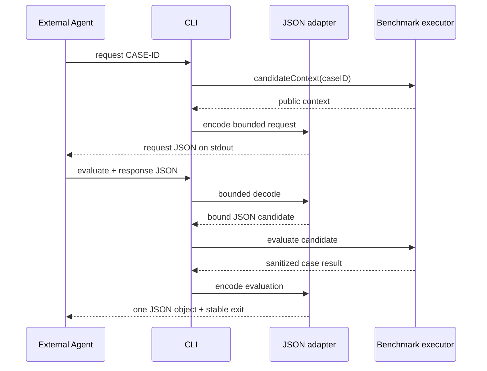

# RupaAgentCADBenchmarkCLI

## Purpose and Scope

`RupaAgentCADBenchmarkCLI` is the dedicated native executable that exchanges
one activated CAD benchmark case with an external Agent over vendor-neutral
JSON. It is a child of the [RupaKit package design](../../DESIGN.md), has no
child design, and depends on the sibling
[JSON adapter](../RupaAgentCADBenchmarkJSONAdapter/DESIGN.md). Its executable
product is `rupa-agent-cad-benchmark`; it does not add commands to `rupa`.

## Responsibilities and Boundaries

The executable owns only command-line parsing, selection of standard input or
one response file, standard output, and stable process exit status. The
`request` command emits candidate-visible context. The `evaluate` command
decodes one external response and evaluates it through the JSON candidate and
activated-case executor.

It does not own envelope semantics, fingerprints, benchmark activation,
candidate decision semantics, project authority, oracle logic, prompts, an LLM
SDK, MCP, networking, file persistence, or multi-case scheduling.

## Related Designs

| Design | Relationship | Contract Used | Summary | Cautions |
|---|---|---|---|---|
| [RupaKit package](../../DESIGN.md) | parent | executable product and target graph | Registers this isolated native tool. | It must not change `RupaCLI` or `RupaCLIKit`. |
| [JSON adapter](../RupaAgentCADBenchmarkJSONAdapter/DESIGN.md) | depends on | bounded input, request/response/evaluation envelopes, JSON candidate | Owns all machine-readable exchange meaning. | The executable cannot decode a second permissive schema. |
| [RupaAgentCADBenchmark](../RupaAgentCADBenchmark/DESIGN.md) | transitive dependency | activated executor and production/oracle result | Executes exactly one reviewed case. | The CLI cannot activate a catalog-only case. |

## Architecture

```mermaid
flowchart LR
    Args["ArgumentParser"] --> Command{"request | evaluate"}
    Command -->|request CASE| Context["Activated executor context"]
    Context --> Request["JSON request envelope -> stdout"]
    Command -->|evaluate --response PATH|-| Input["Bounded stdin/file input"]
    Input --> Adapter["Validated JSON candidate"]
    Adapter --> Execute["Activated executor"]
    Execute --> Result["Evaluation envelope -> stdout + exit status"]
```

The executable target depends on
`RupaAgentCADBenchmarkJSONAdapter` and Argument Parser. It has no dependency on
`RupaCLIKit`, `RupaAgentTransport`, an LLM SDK, or MCP.

## Contracts and Invariants

The command contract is:

```text
rupa-agent-cad-benchmark request <CASE-ID>
rupa-agent-cad-benchmark evaluate --response <PATH|->
```

`request` validates that the ID is in the activated twenty-case set and emits
exactly one request-envelope JSON object to standard output. `evaluate` reads
exactly one candidate-response envelope from the selected file, or from
standard input when `-` is selected, then emits exactly one evaluation-envelope
JSON object to standard output. Machine output never mixes logs or human
diagnostics into standard output. `--help` and argument-parser usage remain
human-readable process metadata and are not evaluation envelopes.

Exit status is stable and orthogonal to JSON decoding:

| Exit | Meaning |
|---:|---|
| `0` | Request emitted, or evaluation completed with `realized`. |
| `2` | A valid response was evaluated to a non-realized candidate outcome such as invalid submission, expected/unexpected unsupported, timeout, or cancellation. |
| `64` | CLI usage, malformed/oversize JSON, unsupported schema, inactive case, case mismatch, fingerprint mismatch, or invalid decision. |
| `70` | Oracle, production infrastructure, cleanup, or unexpected internal failure invalidated evaluation. |

For every `evaluate` invocation whose arguments select an input source, the
tool attempts to emit a bounded evaluation or error envelope before exiting.
It never prints a Swift error description, source snapshot, expected geometry,
feature identity, or private oracle diagnostic. It never retries a candidate
or production command.

## Runtime Flows



## State, Ownership, and Lifecycle

Each process invocation owns one argument parse, at most one bounded input
buffer, and at most one output envelope. No state survives process exit. The
benchmark module owns and cleans the controller/workspace/registration used by
evaluation. Output redirection or persistence is the caller's responsibility.

## Failure, Concurrency, and Constraints

The executable runs one case and one candidate response at a time. It does not
spawn concurrent case work, background readers, or detached tasks. Standard
input must reach EOF within the process/test deadline; the byte ceiling is
enforced while reading. File open/read failures are stable input errors.
Signals and task cancellation propagate to the benchmark attempt, which still
owns unconditional registration cleanup. No failure falls back to the
reference candidate or to direct source mutation.

## Verification and Change Impact

Process-level tests build and invoke the actual executable and prove:

- `request` emits valid v1 JSON for an activated line and rectangle and rejects
  inactive `REC-009`;
- a JSON line response and a JSON rectangle response traverse the adapter,
  production controller, and exact oracle and exit `0` with `realized`;
- wrong geometry is published once, rejected without retry, returned as a
  non-realized envelope, and exits `2`;
- malformed, oversize, unknown-schema, mismatched-case, mismatched-fingerprint,
  and inactive responses exit `64` without publication;
- valid `unsupported` and `finish` decisions exit `2` with typed
  `invalidSubmission`, zero publication, and no fallback action;
- infrastructure/oracle failure exits `70`, all emitted error JSON is bounded
  and private-data free, and process timeout tests leave no registration.

Changing command names, arguments, input source rules, JSON schema, result
classification, byte ceiling, or exit mapping requires updating this design,
the adapter design, process golden tests, and package product declaration.
