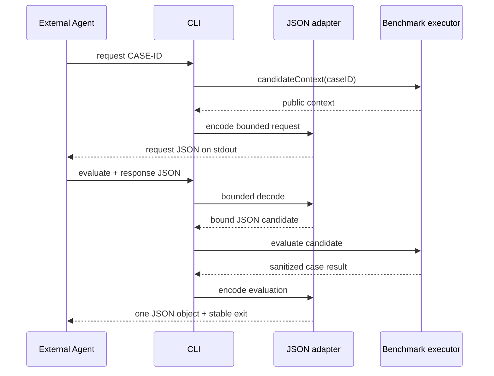

# RupaAgentCADBenchmarkCLI

## Purpose and Scope

`RupaAgentCADBenchmarkCLI` is the dedicated native executable that exchanges
one activated CAD benchmark case with an external Agent over vendor-neutral
JSON. It is a child of the [RupaKit package design](../../DESIGN.md), has no
child design, and depends on the sibling
[JSON adapter](../RupaAgentCADBenchmarkJSONAdapter/DESIGN.md). Its executable
product is `rupa-agent-cad-benchmark`; it does not add commands to `rupa`.

## Responsibilities and Boundaries

The executable owns only command-line parsing, selection of standard input or
one response file, standard output, and stable process exit status. The
`request` command emits candidate-visible context. The `evaluate` command
decodes one external response and evaluates it through the JSON candidate and
activated-case executor.

It does not own envelope semantics, fingerprints, benchmark activation,
candidate decision semantics, project authority, oracle logic, prompts, an LLM
SDK, MCP, networking, file persistence, or multi-case scheduling.

## Related Designs

| Design | Relationship | Contract Used | Summary | Cautions |
|---|---|---|---|---|
| [RupaKit package](../../DESIGN.md) | parent | executable product and target graph | Registers this isolated native tool. | It must not change `RupaCLI` or `RupaCLIKit`. |
| [JSON adapter](../RupaAgentCADBenchmarkJSONAdapter/DESIGN.md) | depends on | bounded input, request/response/evaluation envelopes, JSON candidate | Owns all machine-readable exchange meaning. | The executable cannot decode a second permissive schema. |
| [RupaAgentCADBenchmark](../RupaAgentCADBenchmark/DESIGN.md) | transitive dependency | activated executor and production/oracle result | Executes exactly one reviewed case. | The CLI cannot activate a catalog-only case. |

## Architecture

```mermaid
flowchart LR
    Args["ArgumentParser"] --> Command{"request | evaluate"}
    Command -->|request CASE| Context["Activated executor context"]
    Context --> Request["JSON request envelope -> stdout"]
    Command -->|evaluate --response PATH|-| Input["Bounded stdin/file input"]
    Input --> Adapter["Validated JSON candidate"]
    Adapter --> Execute["Activated executor"]
    Execute --> Result["Evaluation envelope -> stdout + exit status"]
```

The executable target depends on
`RupaAgentCADBenchmarkJSONAdapter` and Argument Parser. It has no dependency on
`RupaCLIKit`, `RupaAgentTransport`, an LLM SDK, or MCP.

## Contracts and Invariants

The command contract is:

```text
rupa-agent-cad-benchmark request <CASE-ID>
rupa-agent-cad-benchmark evaluate --response <PATH|->
```

`request` validates that the ID is in the activated fifty-two-case set and emits
exactly one request-envelope JSON object to standard output. `evaluate` reads
exactly one candidate-response envelope from the selected file, or from
standard input when `-` is selected, then emits exactly one evaluation- or
error-envelope JSON object to standard output. Machine output never mixes logs
or human diagnostics into standard output. `--help` and argument-parser usage
remain human-readable process metadata and are not evaluation envelopes.

Exit status is stable and orthogonal to JSON decoding:

| Exit | Meaning |
|---:|---|
| `0` | Request emitted, or evaluation completed with `realized`. |
| `2` | A valid response was evaluated to a non-realized candidate outcome such as invalid submission, expected/unexpected unsupported, timeout, or cancellation. |
| `64` | CLI usage, malformed/oversize JSON, unsupported schema, inactive case, case mismatch, fingerprint mismatch, or invalid decision. |
| `70` | Production execution, oracle, infrastructure, cleanup, or unexpected internal failure invalidated evaluation. |

For every `evaluate` invocation whose arguments select an input source, the
tool attempts to emit a bounded evaluation or error envelope before exiting.
If runtime error encoding itself fails, the CLI emits the adapter-owned
canonical bounded infrastructure-error document rather than empty output.
It never prints a Swift error description, source snapshot, expected geometry,
feature identity, or private oracle diagnostic. It never retries a candidate
or production command.

## Runtime Flows



## State, Ownership, and Lifecycle

Each process invocation owns one argument parse, at most one bounded input
buffer, and at most one output envelope. No state survives process exit. The
benchmark module owns and cleans the controller/workspace/registration used by
evaluation. Output redirection or persistence is the caller's responsibility.

## Failure, Concurrency, and Constraints

The executable runs one case and one candidate response at a time. It does not
spawn concurrent case work, background readers, or detached tasks. Standard
input must reach EOF within the caller-owned process deadline; the byte ceiling
is enforced while reading. File open/read failures are stable input errors.
Once evaluation enters the benchmark, its existing deadline, cancellation, and
unconditional registration-cleanup contract remains authoritative. External
process termination is only a safety ceiling and is not evidence of in-process
cleanup. The CLI adds no hidden option or environment hook to inject lifecycle
failures. No failure falls back to the reference candidate or to direct source
mutation.

## Verification and Change Impact

Process-level tests build and invoke the actual executable and prove:

- `request` emits valid v1 JSON for an activated line, rectangle, REC-009
  inch/XZ case, REC-010 metre/XY case, REC-011 millimetre/YZ case, and REC-012
  millimetre/XY case, the complete CIR-001...012 category, ANG-001...016, and
  BOX-001...005, and rejects inactive `BOX-006`;
- JSON line, rectangle, circle, angle, and BOX-001...005 responses traverse the adapter, production
  controller, and exact category oracle and exit `0` with `realized`;
- a REC-009 JSON response preserves its public inch/XZ/centre values, traverses
  the unchanged rectangle production controller and exact oracle, and exits `0`;
- a REC-010 JSON response preserves its public metre/XY/centre values, traverses
  the unchanged rectangle production controller and exact oracle, and exits `0`;
- a REC-011 JSON response preserves its public millimetre/YZ/centre values,
  traverses the unchanged rectangle production controller and exact oracle, and
  exits `0`;
- a REC-012 JSON response preserves its public millimetre/XY/centre values,
  traverses the unchanged rectangle production controller and exact oracle, and
  exits `0`;
- wrong geometry is published once, rejected without retry, returned as a
  non-realized envelope, and exits `2`;
- malformed, oversize, unknown-schema, mismatched-fingerprint, and inactive
  responses exit `64` without publication;
- valid `unsupported` and `finish` decisions exit `2` with typed
  `invalidSubmission`, zero publication, and no fallback action;
- all emitted evaluation/error JSON is bounded and private-data free.

For `T12-REC-010`, the twenty-one-case command boundary remained the confirmed
fact until the case gate passed. That gate advanced `request` and `evaluate`
together to the executor-owned twenty-two-case prefix, proved an actual bounded
REC-010 metre/XY request and external response exit `0` with `realized` through
the unchanged rectangle production/oracle path, and proved REC-011 remained an
inactive-case exit `64`. It did not add a command, argument,
schema, hidden test hook, or fallback candidate.

`T12-REC-011` similarly advanced the executor-owned command boundary from
twenty-two to twenty-three after its case gate passed. Actual process tests emit
a bounded millimetre/YZ REC-011 request, evaluate an external exact response to
`realized`/exit `0` through the existing rectangle path, and reject
REC-012 as inactive with exit `64`. Commands, arguments, schema, and fallback
behavior remain unchanged.

`T12-REC-012` advanced the executor-owned command boundary from twenty-three to
twenty-four after its case gate passed. Actual process tests emit a bounded
millimetre/XY REC-012 request, evaluate an external exact response to
`realized`/exit `0` through the existing rectangle path, and reject CIR-001 as
inactive with exit `64`. REC-012 is the rectangle catalog terminus, so the CLI
does not recognize an invented REC-013 boundary. Commands, arguments, schema,
and fallback behavior remain unchanged.

`T12-CIR-001` advanced the executor-owned boundary from twenty-four to
twenty-five after its internal production/oracle gate passed. Actual process
tests emit a bounded 5 mm XY CIR-001 request, accept only the
candidate-response v2 circle discriminator, evaluate an external exact response
to `realized`/exit `0` through `createCircleSketch`, and reject CIR-002 as
inactive with exit `64`. A candidate-response v1 document is an unsupported-
schema exit `64`; request/evaluation/error envelopes, commands, arguments,
bounded I/O, exit mapping, and fallback behavior remain unchanged.

`T12-CIR-002` adds no command or transport behavior. Before its internal case
gate passed, the executable was bound to the exact twenty-five activated IDs
through CIR-001. The completed case advances `request` and `evaluate` together
to the executor-owned twenty-six-ID prefix, proves an actual bounded 12.5 mm XY
CIR-002 request and external candidate-response-v2 evaluation as `realized`/
exit `0` through `createCircleSketch`, and rejected CIR-003 as inactive at that gate with exit
`64`. The frozen twenty-five-request aggregate remains unchanged; schema,
arguments, byte limits, exit mapping, cleanup ownership, and fallback behavior
do not change.

`T12-CIR-003` adds no command or transport behavior. Before its internal case
gate passed, the executable was bound to the exact twenty-six activated IDs
through CIR-002. The completed case advances `request` and `evaluate` together to
the executor-owned twenty-seven-ID prefix, proved an actual bounded 25 mm XZ
CIR-003 request and external candidate-response-v2 evaluation as `realized`/
exit `0` through `createCircleSketch`, and rejected CIR-004 as inactive at that gate with exit
`64`. The frozen twenty-six-request aggregate remains unchanged; schema,
arguments, byte limits, exit mapping, cleanup ownership, and fallback behavior
do not change.

### CIR-004 through CIR-012 sequential process boundary

The executable follows the benchmark-owned [circle case matrix](../RupaAgentCADBenchmark/DESIGN.md#cir-004-through-cir-012-case-matrix)
and the JSON adapter's ordered authority. Each case remains an individual gate
and commit. After that case's internal evidence passes, `request` and `evaluate`
advance together by exactly one ID, an actual bounded request and external
candidate-response-v2 document realize through `createCircleSketch` with exit
`0`, and the matrix's next ID remains inactive with exit `64`. The preceding
aggregate digest stays frozen and the new digest comes from observed request
bytes. CIR-012 advances the boundary to 36 and rejects ANG-001; the CLI does not
invent CIR-013. Commands, arguments, schema, byte limits, exit mapping, cleanup
ownership, and no-fallback behavior remain unchanged across all nine commits.

### ANG-001 atomic-batch process boundary

ANG-001 advances the process authority to 37 reviewed IDs and
candidate-response v3. An actual bounded response with `kind: "angle"` executes
two ordered line commands through one production batch and exits `0` only after
the immutable source oracle reports `realized`. Candidate-response v1 and v2
are rejected before decision decoding, and ANG-002 was inactive at that historical
boundary with exit
`64`. Request/evaluation/error schemas, byte limits, exit mapping, cleanup, and
no-retry behavior are unchanged.

ANG-002 advances the process authority to 38 reviewed IDs without adding a
command or changing candidate-response v3. An actual bounded response with
`kind: "angle"` executes the translated 45-degree pair through the same
production atomic batch and immutable source oracle, while ANG-003 remains
inactive with exit `64`. The preceding 37-request aggregate remains frozen;
the new aggregate is measured from the exact emitted requests. Commands,
arguments, schemas, byte limits, exit mapping, cleanup, and no-retry behavior
remain unchanged.

ANG-003 advances the process authority to 39 reviewed IDs without adding a
command or changing candidate-response v3. An actual bounded response with
`kind: "angle"` executes the translated 60-degree pair through the same
production atomic batch and immutable source oracle, while ANG-004 remains
inactive with exit `64`. The preceding 38-request aggregate remains frozen;
the new aggregate is measured from the exact emitted requests. Commands,
arguments, schemas, byte limits, exit mapping, cleanup, and no-retry behavior
remain unchanged.

ANG-004 advances the process authority to 40 reviewed IDs without adding a
command or changing candidate-response v3. An actual bounded response with
`kind: "angle"` executes the translated 75-degree pair through the same
production atomic batch and immutable source oracle, while ANG-005 remains
inactive with exit `64`. The preceding 39-request aggregate remains frozen;
the new aggregate is measured from the exact emitted requests. Commands,
arguments, schemas, byte limits, exit mapping, cleanup, and no-retry behavior
remain unchanged.

ANG-005 advances the process authority to 41 reviewed IDs without adding a
command or changing candidate-response v3. An actual bounded response with
`kind: "angle"` executes the orthogonal 75/125 mm pair through the same
production atomic batch and immutable source oracle, while ANG-006 remains
inactive with exit `64`. The preceding 40-request aggregate remains frozen;
the new aggregate is measured from the exact emitted requests. Commands,
arguments, schemas, byte limits, exit mapping, cleanup, and no-retry behavior
remain unchanged.

ANG-006 advances the process authority to 42 reviewed IDs without adding a
command or changing candidate-response v3. An actual bounded response with
`kind: "angle"` executes the negative-X 90/150 mm, 105-degree pair through the
same production atomic batch and immutable source oracle, while ANG-007 remains
inactive with exit `64`. The preceding 41-request aggregate remains frozen;
the new aggregate is measured from the exact emitted requests. Commands,
arguments, schemas, byte limits, exit mapping, cleanup, and no-retry behavior
remain unchanged.

ANG-007 advances the process authority to 43 reviewed IDs without adding a
command or changing candidate-response v3. An actual bounded response with
`kind: "angle"` executes the translated 105/200 mm, 120-degree pair through
the same production atomic batch and immutable source oracle, while ANG-008
remains inactive with exit `64`. The preceding 42-request aggregate remains
frozen; the new aggregate is measured from the exact emitted requests.
Commands, arguments, schemas, byte limits, exit mapping, cleanup, and no-retry
behavior remain unchanged.

ANG-008 advances the process authority to 44 reviewed IDs without adding a
command or changing candidate-response v3. An actual bounded response with
`kind: "angle"` executes the origin 120/250 mm, 135-degree pair through the
same production atomic batch and immutable source oracle, while ANG-009 remains
inactive with exit `64`. The preceding 43-request aggregate remains frozen;
the new aggregate is measured from the exact emitted requests. Commands,
arguments, schemas, byte limits, exit mapping, cleanup, and no-retry behavior
remain unchanged.

ANG-009 advances the process authority to 45 reviewed IDs without adding a
command or changing candidate-response v3. An actual bounded response with
`kind: "angle"` executes the translated 135/300 mm, 150-degree pair through
the same production atomic batch and immutable source oracle, while ANG-010
remains inactive with exit `64`. The preceding 44-request aggregate remains
frozen; the new aggregate is measured from the exact emitted requests.
Commands, arguments, schemas, byte limits, exit mapping, cleanup, and no-retry
behavior remain unchanged.

ANG-010 advances the process authority to 46 reviewed IDs without adding a
command or changing candidate-response v3. An actual bounded response with
`kind: "angle"` executes the negative-placement 150/350 mm, 165-degree pair
through the same production atomic batch and immutable source oracle, while
ANG-011 remains inactive with exit `64`. The preceding 45-request aggregate
remains frozen; the new aggregate is measured from the exact emitted requests.
Commands, arguments, schemas, byte limits, exit mapping, cleanup, and no-retry
behavior remain unchanged.

ANG-011 advances the process authority to 47 reviewed IDs without adding a
command or changing candidate-response v3. An actual bounded response with
`kind: "angle"` executes the canonical XZ +Y-normal 30/60 mm, 45-degree pair
through the same production atomic batch and immutable source oracle, while
ANG-012 remains inactive with exit `64`. The preceding 46-request aggregate
remains frozen; the observed 47-request aggregate is
`08a9f3fa73e242fe7116dfb904e5d254fabe3a1cb61c2004021e239f42cde3de`, measured
from the exact emitted requests.
Commands, arguments, schemas, byte limits, exit mapping, cleanup, and no-retry
behavior remain unchanged.

ANG-012 advances the process authority to 48 reviewed IDs without adding a
command or changing candidate-response v3. An actual bounded response with
`kind: "angle"` executes the canonical YZ +X-normal 40/100 mm, 60-degree pair
through the same production atomic batch and immutable source oracle, while
ANG-013 remains inactive with exit `64`. The preceding 47-request aggregate
remains frozen; the new aggregate is measured from the exact emitted requests.
Commands, arguments, schemas, byte limits, exit mapping, cleanup, and no-retry
behavior remain unchanged.

ANG-013 advances the process authority to 49 reviewed IDs without adding a
command or changing candidate-response v3. An actual bounded response with
`kind: "angle"` executes the canonical XZ +Y-normal 50/150 mm, 90-degree pair
through the same production atomic batch and immutable source oracle, while
ANG-014 remains inactive with exit `64`. The preceding 48-request aggregate
remains frozen; the new aggregate is measured from the exact emitted requests.
Commands, arguments, schemas, byte limits, exit mapping, cleanup, and no-retry
behavior remain unchanged.

ANG-014 advances the process authority to 50 reviewed IDs without adding a
command or changing candidate-response v3. An actual bounded response with
`kind: "angle"` executes the canonical YZ +X-normal 75/225 mm, 120-degree pair
through the same production atomic batch and immutable source oracle, while
ANG-015 remains inactive with exit `64`. The preceding 49-request aggregate
remains frozen; the new aggregate is measured from the exact emitted requests.
Commands, arguments, schemas, byte limits, exit mapping, cleanup, and no-retry
behavior remain unchanged.

ANG-015 advances the process authority to 51 reviewed IDs without adding a
command or changing candidate-response v3. An actual bounded response with
`kind: "angle"` executes the canonical XZ +Y-normal 100/300 mm, 135-degree pair
through the same production atomic batch and immutable source oracle, while
ANG-016 remains inactive with exit `64`. The preceding 50-request aggregate
remains frozen; the new aggregate is measured from the exact emitted requests.
Commands, arguments, schemas, byte limits, exit mapping, cleanup, and no-retry
behavior remain unchanged.

ANG-016 advances the process authority to 52 reviewed IDs without adding a
command or changing candidate-response v3. An actual bounded response with
`kind: "angle"` executes the canonical YZ +X-normal 125/375 mm, 150-degree pair
through the same production atomic batch and immutable source oracle, while
BOX-001 remains inactive with exit `64`. The preceding 51-request aggregate
`8a5baed7294693f150ce8e67494112f521b0667bfe1d4f6e45db0661e83d6f07` remains
frozen; the observed 52-request aggregate is
`53836e6352b776f1b2a0eccd81cc17d7046a489782a5ad678236d920e36f8a7a`. Commands,
arguments, schemas, byte limits, exit mapping, cleanup, and no-retry behavior
remain unchanged.

### BOX-001 through BOX-012 process boundary

BOX adds no CLI command. `request <BOX-ID>` emits the same bounded request v1;
`evaluate --response <PATH|->` accepts the adapter-owned candidate-response v4
that carries the benchmark-owned `solid` / `box` discriminators. BOX-001 must
prove the complete actual process route for a 10 × 10 × 10 mm box at the world
origin and must reject candidate-response v1 through v3 with input exit `64`.
Each following BOX case reuses the command and schema, proves its exact public
unit/dimensions/lower-corner response through the production controller and
source/B-Rep oracle, and advances process authority by one only after its case
gate passes. A valid wrong box exits `2` after one publication and no retry;
decode, schema, fingerprint, and inactive-ID failures exit `64`; benchmark
infrastructure or cleanup-invalidating failures retain exit `70`.

The ordered process boundary advances from 52 IDs through 64, preserving each
immediately preceding aggregate and freezing the emitted aggregate after every
case. The next lexical BOX ID remains inactive at each intermediate gate;
after BOX-012, `CYL-001` is inactive. Actual process evidence covers both file
and standard-input evaluation without exposing private dimensions, topology
predicates, source identities, or diagnostics. The 65,536-byte bound, one-JSON
stdout rule, exit mapping, request/evaluation/error schemas, and generic `rupa`
CLI remain unchanged.

BOX-001 preserves the frozen 52-request prefix
`53836e6352b776f1b2a0eccd81cc17d7046a489782a5ad678236d920e36f8a7a` and
observes the 53-request aggregate
`dd12c2cc346e37ec4f3dcecb396aa46bcfe69a82923a41041c36739b826d0b79`.
BOX-002 preserves that frozen 53-request aggregate and observes the 54-request
aggregate
`36bf68952c6a605df9e9bb4187929752ee42317f0a45506f9847bc265ac065ec`, and
executes a v4 translated 25 × 25 × 25 mm solid/box response at lower corner
(20, -20, 0) mm through the production controller.
BOX-003 preserves that frozen 54-request aggregate and observes the 55-request
aggregate
`74353ca8a790b520689404973dbc370b59ec77f50ec81ac3a48c4387b94862c3`, and
executes a v4 50 × 30 × 20 mm solid/box response at lower corner
(-25, 15, 5) mm through the production controller.
BOX-004 preserves that frozen 55-request aggregate and observes the 56-request
aggregate
`dc4c6fa1f96ae4181f54d48b34ae77b95d2548bc90935a3c7f0d7c51743efd9a`, and
executes a v4 100 × 50 × 75 mm solid/box response at lower corner
(0, 0, -25) mm through the production controller.
BOX-005 is the current process boundary: it preserves that frozen 56-request
aggregate, observes the 57-request aggregate
`a7ae81207efbb6d315d2a11b61f7cbfa17d997e59ca74db7404c310bbecc24bb`, and
executes a v4 250 × 100 × 125 mm solid/box response at lower corner
(-125, -50, 0) mm through the production controller. BOX-006 remains inactive
with exit `64`.

The explicit `evaluate --response <PATH|->` contract has no separate expected
case argument, so a case-mismatch process fixture cannot be constructed without
changing the command. Compositional tests instead prove that the adapter rejects
an explicitly mismatched expected case before publication and that the CLI maps
typed `caseMismatch` to exit `64`. Similarly, benchmark lifecycle tests own
deadline, cancellation, no-retry, and unconditional cleanup behavior, while CLI
mapping tests prove timeout/cancellation exit `2` and production execution,
oracle, infrastructure, and cleanup-invalidating outcomes exit `70`. Actual
process tests retain an external safety deadline but do not claim that killing a
process proves benchmark cleanup.

Changing command names, arguments, input source rules, JSON schema, result
classification, byte ceiling, or exit mapping requires updating this design,
the adapter design, process golden tests, and package product declaration.
