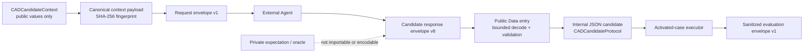
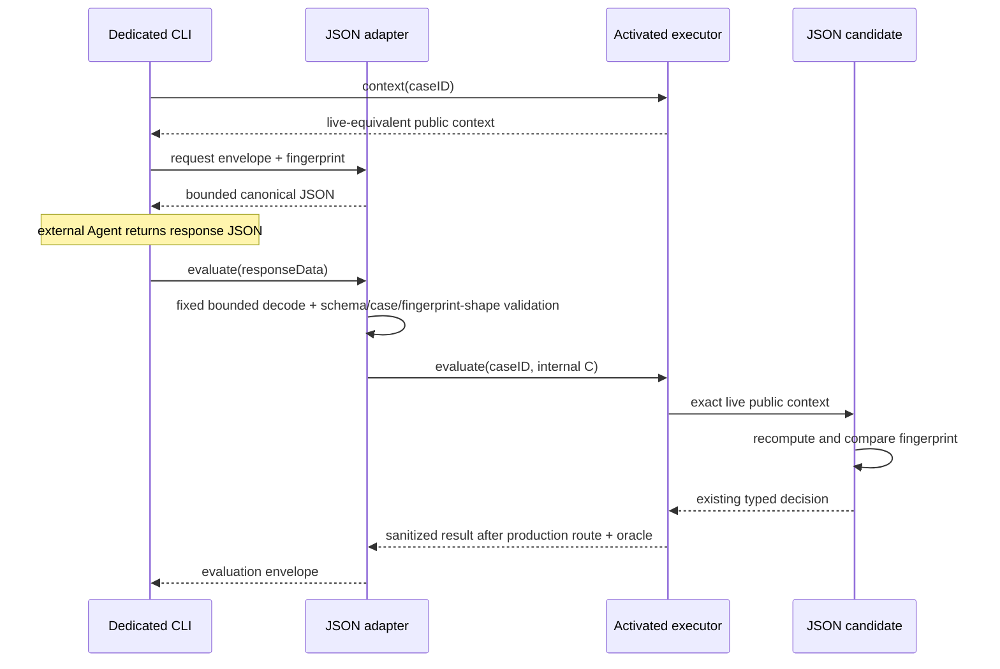

# RupaAgentCADBenchmarkJSONAdapter

## Purpose and Scope

`RupaAgentCADBenchmarkJSONAdapter` is the vendor-neutral JSON exchange boundary
between an external Agent process and the activated-case executor owned by
`RupaAgentCADBenchmark`. It is a native SwiftPM library target and a child of the
[RupaKit package design](../../DESIGN.md). It has no child design. The sibling
[benchmark CLI](../RupaAgentCADBenchmarkCLI/DESIGN.md) supplies process arguments
and standard streams; this target owns the JSON meaning used by that process.

The adapter is limited to the 100 reviewed cases `LIN-001`...`LIN-012`,
`REC-001`...`REC-012`, `CIR-001`...`CIR-012`, `ANG-001`...`ANG-016`,
`BOX-001`...`BOX-012`, `CYL-001`...`CYL-008`, `CON-001`...`CON-008`,
`TRN-001`...`TRN-008`, `CMP-001`...`CMP-007`, and `SPH-001`...`SPH-005`.
These are the complete 100-case catalog; the adapter does not own activation.

## Responsibilities and Boundaries

The target owns:

- versioned request, candidate-response, evaluation-result, and stable-error
  envelopes;
- the canonical fingerprint of one candidate-visible `CADCandidateContext`;
- schema, case-ID, fingerprint, and decision validation before a decision can
  enter benchmark execution;
- a public Data-based evaluation entry that performs the fixed bounded decode
  before any executor call, plus an internal `CADCandidateProtocol` bridge that
  returns the validated external decision only when the executor presents the
  exact matching live public context;
- bounded JSON reads from either standard input or one explicitly selected
  local file, plus bounded deterministic JSON encoding and the canonical
  prevalidated infrastructure-error document used when runtime encoding itself
  fails.

It does not own challenge meaning, decision/action meaning, activated-case
selection, a project/workspace, command routing, an oracle, private expected
geometry, scoring, process arguments, network I/O, an LLM SDK, MCP, or the
general-purpose `rupa` CLI. It never imports an internal oracle type and cannot
construct a benchmark result without calling the public activated-case
executor.

## Related Designs

| Design | Relationship | Contract Used | Summary | Cautions |
|---|---|---|---|---|
| [RupaKit package](../../DESIGN.md) | parent | target dependency direction | Places this target above the benchmark and below the dedicated executable. | No production authority target may depend on this adapter. |
| [RupaAgentCADBenchmark](../RupaAgentCADBenchmark/DESIGN.md) | depends on | public candidate context, explicit decision codecs, activated-case executor, sanitized case result | Supplies all CAD and benchmark meaning. | The adapter must not reproduce public action semantics in parallel DTOs or expose internal evidence. |
| [Benchmark CLI](../RupaAgentCADBenchmarkCLI/DESIGN.md) | used by | bounded decode/encode and envelope evaluation | Provides the process entry that external Agents invoke. | Process concerns remain in the executable target. |

## Architecture

Dependency direction is
`RupaAgentCADBenchmark -> RupaAgentCADBenchmarkJSONAdapter ->
RupaAgentCADBenchmarkCLI`; the arrows denote consumption by the item on the
right. The adapter has no dependency on `RupaCLIKit`.

## Contracts and Invariants

### Envelope contract

The adapter owns four top-level envelopes. Every envelope is one UTF-8 JSON
object, rejects unknown schema versions, and validates all required fields.

| Envelope | Required fields | Meaning |
|---|---|---|
| request v1 | `schema`, `caseID`, `contextFingerprint`, `context` | Exact public context offered to the external Agent. |
| candidate response v8 | `schema`, `caseID`, `contextFingerprint`, `decision` | One decision, including reviewed automation, transform, or ordered compound actions, returned by the JSON candidate. |
| evaluation v1 | `schema`, `caseID`, `contextFingerprint`, exactly one of `result` or `error` | Sanitized terminal outcome returned by the executable. |
| error v1 | `schema`, `code`, `message`; optional `caseID` | Stable private-free failure before a case is known, or a case-bound failure when a validated ID is available. |

The benchmark-owned `CADBenchmarkCaseID` is a validated single-value string in
every position, including top-level `caseID`, `context.challenge.id`, and
`result.id`. The adapter consumes that scalar contract directly and does not
wrap or mirror it. The former synthesized `{ "rawValue": ... }` object is
rejected before context fingerprinting or evaluation; v1 has no legacy
fallback because no external adapter release used that shape.

The candidate response carries the existing benchmark-owned
`CADCandidateDecision`. The benchmark's associated-value enums
`CADCandidateDecision`, `CADCandidateAction`, `CADAutomationAction`,
`CADSketchAction`, and `CADCompoundAction` use explicit `kind` discriminators
and named payload fields. A compound contains ordered
`CADCompoundMemberAction` values with public roles and benchmark-owned solid
actions; the adapter adds no parallel compound DTO.
`CADOutputRoleSelector` does the same for the transitive `finish` payload. The
adapter does not introduce flat line/rectangle DTOs that would duplicate those
semantics. Because the benchmark package is unreleased and the old synthesized
enum encoding had only round-trip tests, the initial candidate-response v1
adopted the explicit shape without a compatibility decoder; golden JSON and
rejection tests froze that decision before the CLI was released. CIR-001 adds the closed
`CADSketchAction` discriminator `circle`; candidate-response advances to v2 and
v1 is rejected without fallback. Request, evaluation, and error envelopes stay
at v1, and the context fingerprint is unchanged.

ANG-001 adds the explicit `angle` discriminator with two ordered endpoint
pairs. Candidate-response advances to v3; v1 and v2 are rejected by the schema
guard before decision decoding. Request, evaluation, error, and fingerprint
schemas remain unchanged.

BOX-001 adds `CADAutomationAction.kind: "solid"` carrying
`CADSolidAction.kind: "box"` with a name, lower-corner origin, width, depth,
and height. Candidate-response advances to v4; v1, v2, and v3 are rejected by
the schema guard before decision decoding. Request, evaluation, error,
fingerprint, manifest/catalog, expectation, capability, and tolerance schemas
remain unchanged. No adapter-owned box DTO duplicates the benchmark action.

Public production evaluation accepts candidate-response `Data`, not a decoded
envelope or candidate value. It always applies the fixed 65,536-byte decode
before constructing the internal typed response and candidate bridge. Typed
evaluation and candidate construction remain module-internal test/composition
seams, so a caller cannot construct a large in-memory response and bypass the
JSON input authority.

The activated ninety-six cases accept one bounded decision. Geometry actions
retain their existing execution contracts. `SPH-001` instead accepts the exact
`analyticSphereUnavailable` declaration as `expectedUnsupported`; a substitute
action, a wrong unsupported reason, or `finish` remains `invalidSubmission`
without publication. Multi-round continuation is not added here, and the
adapter never substitutes a reference action.

### Public-context fingerprint

`contextFingerprint` is lowercase SHA-256 over the UTF-8 bytes formed by the
domain separator `rupa.agent-cad-benchmark.public-context.v1` followed by a
newline and the deterministic JSON encoding of `CADCandidateContext` using
sorted keys and unescaped slashes. The request envelope itself is excluded to
avoid self-reference. The adapter emits the value; an external vendor need
only return it unchanged.

During evaluation, `CADJSONCandidate.decide(for:)` recomputes the fingerprint
from the live context supplied by the production harness and requires exact
schema, case ID, and fingerprint equality before returning the decision. A
mismatch is a typed adapter failure and creates no workspace publication. No
fallback accepts a response by case ID alone.

### Bounds and stable failures

One request, response, or evaluation document is limited to 65,536 bytes. A
reader consumes chunks only until `limit + 1`, rejects oversize before JSON
decode, and does not use an unbounded whole-file convenience API. The bound is
accepted only when the largest encoded activated request/response fixture is
measured below one quarter of it; changing the envelope or activated context
requires repeating that evidence or versioning the bound.

Only standard input or one explicit local file path is supported. URLs,
network reads, directories, multiple concatenated JSON values, trailing
non-whitespace bytes, and silent encoding repair are rejected. Stable error
codes distinguish malformed UTF-8/JSON, oversize input, unsupported schema,
inactive case, case mismatch, fingerprint mismatch, invalid decision,
candidate rejection, timeout/cancellation, oracle/infrastructure failure, and
output overflow. Error envelopes contain no private expectation, observed
source geometry, feature identity, or oracle diagnostic text.
The adapter owns one guaranteed infrastructure-error document whose bytes equal
the normal deterministic encoding of error v1, remain within the same bound,
and decode to that exact envelope. The CLI may use it only after runtime error
encoding fails, so a machine command never substitutes empty output for its
terminal JSON error.

Activation availability is read only from the benchmark executor. REC-009 did
not change envelope v1, fingerprint v1, the benchmark catalog, or the
expectation contract. Its aggregate fixture proved that the original twenty
request bytes and historical digest were unchanged, froze the then-current
twenty-one-request aggregate, and kept the largest request/response below one
quarter of the existing bound. REC-010 was its typed inactive boundary. The
completed T12-XA and REC-009 digests remain historical evidence and are not
presented as current authority.

`T12-REC-010` is an additive activation transition, not a schema change. Before
its vertical gate passed, the adapter was limited to the twenty-one-case prefix
through `REC-009`. The gate derived the exact ordered twenty-two-case prefix
from the executor, proved that the historical first-twenty and REC-009 twenty-
one-request aggregates still matched their frozen digests, and froze a new
digest over the actual twenty-two bounded requests. An exact public metre/XY
REC-010 response traversed the unchanged rectangle production route and oracle;
`REC-011` remained a typed inactive failure before evaluation. Envelope v1,
fingerprint v1, and the existing byte ceiling remained unchanged.

`T12-REC-011` is the next additive activation. Before its gate passed, the
executor-owned adapter boundary was the twenty-two-case prefix through REC-010.
The gate advanced it to the exact ordered twenty-three-case prefix, retained
the frozen first-twenty, twenty-one-, and twenty-two-request aggregate digests,
froze the actual twenty-three-request digest, and rechecked the existing size
ceiling. A millimetre/YZ REC-011 response realized through the unchanged
rectangle production route and oracle; REC-012 remained a typed inactive
failure before evaluation. No adapter schema or fingerprint changed.

`T12-REC-012` is the next additive activation. Before its gate passed, the
executor-owned adapter boundary was the twenty-three-case prefix through
REC-011. The gate advanced it to the exact ordered twenty-four-case prefix,
retained the frozen first-twenty, twenty-one-, twenty-two-, and twenty-three-
request aggregate digests, froze the actual twenty-four-request digest, and
rechecked the existing size ceiling. An exact public millimetre/XY REC-012
response realized through the unchanged rectangle production route and oracle.
Because REC-012 ends the rectangle catalog, CIR-001—not an invented REC-013—
remained a typed inactive failure before evaluation. No adapter schema or
fingerprint changed.

`T12-CIR-001` is the first schema-changing activation. Before its internal gate
passed, authority remained the twenty-four-case prefix. The completed
gate accepts candidate-response v2 with the benchmark-owned `circle` action,
rejects candidate-response v1 before evaluation, derives the exact ordered
twenty-five IDs from the executor, preserves request bytes/digests through
twenty-four, and freezes the actual twenty-five-request digest. A bounded CIR-
001 request and v2 response realize through the circle production route
and exact oracle; CIR-002 remained typed inactive at that gate. Request/evaluation/error v1,
fingerprint v1, the byte ceiling, and catalog/expectation versions do not move.

`T12-CIR-002` is a completed case-only authority transition. Before its internal
production and oracle evidence passed, this adapter was authoritative for the
exact twenty-five-case prefix through CIR-001. The gate derives an ordered
twenty-six-case prefix ending in CIR-002 from the executor, preserves the frozen
twenty-five-request aggregate, freezes the observed twenty-six-request
aggregate, and proves a bounded exact CIR-002 request and candidate-response-v2
evaluation through the unchanged circle route/oracle. CIR-003 remained typed
inactive at that gate. No envelope, fingerprint, byte-bound, error, benchmark catalog, or
candidate action schema changes in this transition.

`T12-CIR-003` is the completed first XZ circle transition and changes only the
executor-owned activated set. Before its internal production/oracle gate passed,
the adapter was authoritative for the ordered twenty-six-case prefix through
CIR-002. The completed case derives the twenty-seven-case prefix ending in
CIR-003, preserve the frozen twenty-six-request aggregate, freeze the observed
twenty-seven-request aggregate, and proved a bounded exact 25 mm XZ CIR-003
request and candidate-response-v2 evaluation through the unchanged circle
route/oracle. CIR-004 remained typed inactive at that gate. Envelope versions, the context
fingerprint, byte bound, error projection, and candidate action shape do not
change.

### CIR-004 through CIR-012 sequential authority

The remaining circle activations consume the exact geometry and adversarial
contracts in the benchmark-owned [circle case matrix](../RupaAgentCADBenchmark/DESIGN.md#cir-004-through-cir-012-case-matrix).
This adapter owns only their ordered external authority transition:

| Case | Activated count after gate | Required prior aggregate | Next inactive ID |
|---|---:|---|---|
| CIR-004 | 28 | CIR-003 / 27-request aggregate | CIR-005 |
| CIR-005 | 29 | CIR-004 / 28-request aggregate | CIR-006 |
| CIR-006 | 30 | CIR-005 / 29-request aggregate | CIR-007 |
| CIR-007 | 31 | CIR-006 / 30-request aggregate | CIR-008 |
| CIR-008 | 32 | CIR-007 / 31-request aggregate | CIR-009 |
| CIR-009 | 33 | CIR-008 / 32-request aggregate | CIR-010 |
| CIR-010 | 34 | CIR-009 / 33-request aggregate | CIR-011 |
| CIR-011 | 35 | CIR-010 / 34-request aggregate | CIR-012 |
| CIR-012 | 36 | CIR-011 / 35-request aggregate | ANG-001 |

Each row is a separate commit and remains inactive until its internal gate
passes. That commit derives the exact ordered IDs from the executor, reasserts
the prior digest, freezes the newly observed aggregate, proves bounded request
and candidate-response-v2 evaluation through the unchanged circle route/oracle,
and rejects the next ID before evaluation. CIR-012 uses the real next-category
ID ANG-001; no CIR-013 is invented. Envelope versions, context fingerprint,
byte bound, decision shape, error projection, and privacy boundary remain fixed.

### ANG-001 external authority

ANG-001 extends the exact ordered authority from 36 to 37 IDs while preserving
the frozen 36-request aggregate. The observed 37-request aggregate is
`b66ed71a2efccf115a81033c3bda0e9335c0a2a4c695ba5c58b49c9df7341b4e`.
The request reports the intersection capability as available because the
production route composes two exposed `createLineSketch` primitives.
One bounded v3 angle response traverses the same executor, production atomic
batch, and immutable source oracle; ANG-002 is rejected before evaluation.

### ANG-002 external authority

ANG-002 extends the exact ordered authority from 37 to 38 IDs while preserving
the frozen 37-request aggregate. The observed 38-request aggregate is
`6bd274e57fae5345c067f63a5191b60ccfbf35a76d794491b7a10df9a0c985d6`.
The request reports the same intersection capability as ANG-001
because the production route composes two exposed `createLineSketch`
primitives. One bounded v3 angle response traverses the same executor,
production atomic batch, and immutable source oracle; ANG-003 is rejected
before evaluation.

### ANG-003 external authority

ANG-003 extends the exact ordered authority from 38 to 39 IDs while preserving
the frozen 38-request aggregate. The observed 39-request aggregate is
`83f7c7b54c95ed2fc0304b98c455d3981dcd51380da7414f397de191333b5e6a`.
The request reports the same intersection capability as ANG-001 and ANG-002
because the production route composes two exposed `createLineSketch`
primitives. One bounded v3 angle response traverses the same production atomic
batch and immutable source oracle; ANG-004 is rejected before evaluation.

### ANG-004 external authority

ANG-004 extends the exact ordered authority from 39 to 40 IDs while preserving
the frozen 39-request aggregate. The observed 40-request aggregate is
`e2f928ac390783e8bcf5fdbb4e368156a188e3b49e81fee845d72602fd1d0649`.
The request reports the same intersection capability as the prior angle cases
because the production route composes two exposed `createLineSketch`
primitives. One bounded v3 angle response traverses the same production atomic
batch and immutable source oracle; ANG-005 is rejected before evaluation.

### ANG-005 external authority

ANG-005 extends the exact ordered authority from 40 to 41 IDs while preserving
the frozen 40-request aggregate. The observed 41-request aggregate is
`fb0228298f5bd1b38ddcafeeda2632236e487f2be8600e3abffed335f9f3df6d`.
It is measured from the exact bounded request bytes after the production route passes. The
request describes the XY intersection at (0, 0, 200) mm with a 75 mm +X first
segment and a 125 mm +Y second segment, producing an unsigned 90-degree angle.
One bounded v3 response traverses the same production atomic batch and
immutable source oracle; ANG-006 is rejected before evaluation. Envelope
versions, fingerprint, byte ceiling, and candidate action shape remain
unchanged.

### ANG-006 external authority

ANG-006 extends the exact ordered authority from 41 to 42 IDs while preserving
the frozen 41-request aggregate. The observed 42-request aggregate is
`a15fbc50a8f6476bd353b9508a10c88b6da03377aa173b413987e829642f16eb`,
measured from the exact bounded request bytes after the production route passes. The
request describes the XY intersection at (-50, 40, 250) mm with a 90 mm +X
first segment and a 150 mm second segment directed along
(-0.258819045103, 0.965925826289, 0), producing an unsigned 105-degree angle.
One bounded v3 response traverses the same production atomic batch and
immutable source oracle; ANG-007 is rejected before evaluation. Envelope
versions, fingerprint, byte ceiling, and candidate action shape remain
unchanged.

### ANG-007 external authority

ANG-007 extends the exact ordered authority from 42 to 43 IDs while preserving
the frozen 42-request aggregate
`a15fbc50a8f6476bd353b9508a10c88b6da03377aa173b413987e829642f16eb`.
The observed 43-request aggregate is
`b276bc61ebd50a39b603ba627890f6342121c2889f906b8349140f4bb932fbcd`, measured
from the exact bounded request bytes after the production route passes. The request describes the XY
intersection at (20, -35, 300) mm with a 105 mm +X first segment and a 200 mm
second segment directed along (-0.5, 0.866025403784, 0), producing an unsigned
120-degree angle. One bounded v3 response traverses the same production atomic
batch and immutable source oracle; ANG-008 is rejected before evaluation.
Envelope versions, fingerprint, byte ceiling, and candidate action shape remain
unchanged.

### ANG-008 external authority

ANG-008 extends the exact ordered authority from 43 to 44 IDs while preserving
the frozen 43-request aggregate
`b276bc61ebd50a39b603ba627890f6342121c2889f906b8349140f4bb932fbcd`.
The observed 44-request aggregate is
`47914bc2ecec829f01c24bfd62626a41e4a605a0a14c945bf6fc15913231d82c`, measured
from the exact bounded request bytes after the production route passes. The request describes the XY
intersection at (0, 0, 350) mm with a 120 mm +X first segment and a 250 mm
second segment directed along (-0.707106781187, 0.707106781187, 0), producing
an unsigned 135-degree angle. One bounded v3 response traverses the same
production atomic batch and immutable source oracle; ANG-009 is rejected before
evaluation. Envelope versions, fingerprint, byte ceiling, and candidate action
shape remain unchanged.

### ANG-009 external authority

ANG-009 extends the exact ordered authority from 44 to 45 IDs while preserving
the frozen 44-request aggregate
`47914bc2ecec829f01c24bfd62626a41e4a605a0a14c945bf6fc15913231d82c`.
The observed 45-request aggregate is
`6c9014e08de0670558528695d21790d489f0bc9516a6e1febefc6c3437b69c87`, measured
from the exact bounded request bytes after the production route passes. The
request describes the XY intersection at (75, 50, 400) mm with a 135 mm +X
first segment and a 300 mm second segment directed along
(-0.866025403784, 0.5, 0), producing an unsigned 150-degree angle. One bounded
v3 response traverses the same production atomic batch and immutable source
oracle; ANG-010 is rejected before evaluation. Envelope versions, fingerprint,
byte ceiling, and candidate action shape remain unchanged.

### ANG-010 external authority

ANG-010 extends the exact ordered authority from 45 to 46 IDs while preserving
the frozen 45-request aggregate
`6c9014e08de0670558528695d21790d489f0bc9516a6e1febefc6c3437b69c87`.
The observed 46-request aggregate is
`4f4f451db3ab64d9d5f5d657cb7b0ebe3c79a02d370ab2b56070b1d7e3396e65`, measured
from the exact bounded request bytes after the production route passes. The request describes the XY
intersection at (-75, -50, 450) mm with a 150 mm +X first segment and a 350 mm
second segment directed along (-0.965925826289, 0.258819045103, 0), producing
an unsigned 165-degree angle. One bounded v3 response traverses the same
production atomic batch and immutable source oracle; ANG-011 is rejected before
evaluation. Envelope versions, fingerprint, byte ceiling, and candidate action
shape remain unchanged.

### ANG-011 external authority

ANG-011 extends the exact ordered authority from 46 to 47 IDs while preserving
the frozen 46-request aggregate
`4f4f451db3ab64d9d5f5d657cb7b0ebe3c79a02d370ab2b56070b1d7e3396e65`.
The observed 47-request aggregate is
`08a9f3fa73e242fe7116dfb904e5d254fabe3a1cb61c2004021e239f42cde3de`, measured
from the exact bounded request bytes after the production route passes. The request describes the canonical
XZ plane with +Y normal and intersection (0, 0, 80) mm, with a 30 mm +X first
segment and a 60 mm second segment directed along
(0.707106781187, 0, 0.707106781187), producing an unsigned 45-degree angle.
One bounded v3 response traverses the same production atomic batch and
immutable source oracle; ANG-012 is rejected before evaluation. Envelope
versions, fingerprint, byte ceiling, and candidate action shape remain
unchanged.

### ANG-012 external authority

ANG-012 extends the exact ordered authority from 47 to 48 IDs while preserving
the frozen 47-request aggregate
`08a9f3fa73e242fe7116dfb904e5d254fabe3a1cb61c2004021e239f42cde3de`.
The observed 48-request aggregate is
`f7476b4da91164043c29215821395b37b98537441e1d3e99542973809eea9efd`, measured
from the exact bounded request bytes after the production route passes. The
request describes the canonical YZ plane with +X normal and intersection
(10, -20, 120) mm, with a 40 mm +Y
first segment and a 100 mm second segment directed along
(0, 0.5, 0.866025403784), producing an unsigned 60-degree angle. One bounded
v3 response traverses the same production atomic batch and immutable source
oracle; ANG-013 is rejected before evaluation. Envelope versions, fingerprint,
byte ceiling, and candidate action shape remain unchanged.

### ANG-013 external authority

ANG-013 extends the exact ordered authority from 48 to 49 IDs while preserving
the frozen 48-request aggregate
`f7476b4da91164043c29215821395b37b98537441e1d3e99542973809eea9efd`.
The observed 49-request aggregate is
`9164bb6b90dffb05f5c443b7918d273bb83de8ecbc90f4feebfbc31139193b3e`, measured
from the exact bounded request bytes after the production route passes. The
request describes the canonical
XZ plane with +Y normal and intersection (-15, 25, 180) mm, with a 50 mm +X
first segment and a 150 mm +Z second segment, producing an unsigned 90-degree
angle. One bounded v3 response traverses the same production atomic batch and
immutable source oracle; ANG-014 is rejected before evaluation. Envelope
versions, fingerprint, byte ceiling, and candidate action shape remain
unchanged.

### ANG-014 external authority

ANG-014 extends the exact ordered authority from 49 to 50 IDs while preserving
the frozen 49-request aggregate
`9164bb6b90dffb05f5c443b7918d273bb83de8ecbc90f4feebfbc31139193b3e`.
The observed 50-request aggregate is
`fde5e108d41d194197b4a2f0b88eb31b110ad3372d53bdddef51e29c8dc021ee`, measured from the exact
bounded request bytes after the production route passes. The request describes
the canonical YZ plane with +X normal and intersection (-25, 30, 275) mm, with
a 75 mm +Y first segment and a 225 mm second segment directed along
(0, -0.5, 0.866025403784), producing an unsigned 120-degree angle. One bounded
v3 response traverses the same production atomic batch and immutable source
oracle; ANG-015 is rejected before evaluation. Envelope versions, fingerprint,
byte ceiling, and candidate action shape remain unchanged.

### ANG-015 external authority

ANG-015 extends the exact ordered authority from 50 to 51 IDs while preserving
the frozen 50-request aggregate
`fde5e108d41d194197b4a2f0b88eb31b110ad3372d53bdddef51e29c8dc021ee`.
The observed 51-request aggregate is
`8a5baed7294693f150ce8e67494112f521b0667bfe1d4f6e45db0661e83d6f07`, measured from the exact
bounded request bytes after the production route passes. The request describes
the canonical XZ plane with +Y normal and intersection (40, -40, 325) mm, with
a 100 mm +X first segment and a 300 mm second segment directed along
(-0.707106781187, 0, 0.707106781187), producing an unsigned 135-degree angle.
One bounded v3 response traverses the same production atomic batch and immutable
source oracle; ANG-016 is rejected before evaluation. Envelope versions,
fingerprint, byte ceiling, and candidate action shape remain unchanged.

### ANG-016 external authority

ANG-016 extends the exact ordered authority from 51 to 52 IDs while preserving
the frozen 51-request aggregate
`8a5baed7294693f150ce8e67494112f521b0667bfe1d4f6e45db0661e83d6f07`.
The observed 52-request aggregate is
`53836e6352b776f1b2a0eccd81cc17d7046a489782a5ad678236d920e36f8a7a`, measured from the exact
bounded request bytes after the production route passes. The request describes
the canonical YZ plane with +X normal and intersection (60, 60, 425) mm, with
a 125 mm +Y first segment and a 375 mm second segment directed along
(0, -0.866025403784, 0.5), producing an unsigned 150-degree angle. One bounded
v3 response traverses the same production atomic batch and immutable source
oracle; BOX-001 is rejected before evaluation. Envelope versions, fingerprint,
byte ceiling, and candidate action shape remain unchanged.

### BOX-001 through BOX-012 sequential authority

BOX activation is a serial expansion from the current 52-ID prefix to 64 IDs.
BOX-001 first advances candidate-response v3 to v4 for the benchmark-owned
solid/box discriminators. The request envelope and public context do not carry
the candidate-response schema, so the exact 52-request aggregate
`53836e6352b776f1b2a0eccd81cc17d7046a489782a5ad678236d920e36f8a7a`
must remain byte-identical. Each BOX gate derives its ordered ID set only from
`DefaultCADActivatedCaseExecutor`, preserves the immediately preceding
aggregate literal, freezes the newly observed aggregate, and keeps the largest
request and response below one quarter of the 65,536-byte ceiling.

For each activated BOX case, bounded request generation preserves the public
lower-corner origin, dimensions, and unit. A v4 response traverses the same
benchmark executor, production `createExtrudedRectangle` controller route, and
exact source/B-Rep oracle. The case-specific valid mismatch remains an
`invalidSubmission` after exactly one publication and no retry; zero dimension,
wrong action kind, malformed or legacy schema, context mismatch, and inactive
case failures occur before evaluation or publication as owned by the
corresponding layer. The next lexical BOX ID remains inactive until its own
gate; after BOX-012, CYL-001 is the typed inactive boundary. BOX adds no direct
source, workspace, or oracle access to this adapter.

### BOX-002 external authority

BOX-002 preserves the frozen 53-request aggregate
`dd12c2cc346e37ec4f3dcecb396aa46bcfe69a82923a41041c36739b826d0b79` and
advances the observed 54-request aggregate to
`36bf68952c6a605df9e9bb4187929752ee42317f0a45506f9847bc265ac065ec`.
Its bounded v4 response describes a 25 × 25 × 25 mm translated cube with
lower-corner origin (20, -20, 0) mm and is evaluated through the production
extruded-rectangle/source/B-Rep route. A wrong lower-corner origin is rejected
after exactly one publication without retry, while zero width and BOX-003 are
typed prepublication/inactive failures. Request, evaluation, error, and
fingerprint contracts remain unchanged.

### BOX-003 external authority

BOX-003 preserves the frozen 54-request aggregate
`36bf68952c6a605df9e9bb4187929752ee42317f0a45506f9847bc265ac065ec` and
advances the observed 55-request aggregate to
`74353ca8a790b520689404973dbc370b59ec77f50ec81ac3a48c4387b94862c3`.
Its bounded v4 response describes a 50 × 30 × 20 mm rectangular solid with
lower-corner origin (-25, 15, 5) mm and is evaluated through the production
extruded-rectangle/source/B-Rep route. Swapping depth and height is rejected
after exactly one publication without retry, while zero depth and BOX-004 are
typed prepublication/inactive failures. Request, evaluation, error, and
fingerprint contracts remain unchanged.

### BOX-004 external authority

BOX-004 preserves the frozen 55-request aggregate
`74353ca8a790b520689404973dbc370b59ec77f50ec81ac3a48c4387b94862c3` and
advances the observed 56-request aggregate to
`dc4c6fa1f96ae4181f54d48b34ae77b95d2548bc90935a3c7f0d7c51743efd9a`.
Its bounded v4 response describes a 100 × 50 × 75 mm rectangular solid with
lower-corner origin (0, 0, -25) mm and is evaluated through the production
extruded-rectangle/source/B-Rep route. A valid box at z = 0 mm is rejected by
the immutable oracle after exactly one publication without retry, while zero
height and BOX-005 are typed prepublication/inactive failures. Request,
evaluation, error, and fingerprint contracts remain unchanged.

### BOX-005 external authority

BOX-005 preserves the frozen 56-request aggregate
`dc4c6fa1f96ae4181f54d48b34ae77b95d2548bc90935a3c7f0d7c51743efd9a` and
advances the observed 57-request aggregate to
`a7ae81207efbb6d315d2a11b61f7cbfa17d997e59ca74db7404c310bbecc24bb`.
Its bounded v4 response describes a 250 × 100 × 125 mm rectangular solid with
lower-corner origin (-125, -50, 0) mm and is evaluated through the production
extruded-rectangle/source/B-Rep route. A valid box with height 100 mm is
rejected by the immutable oracle after exactly one publication without retry,
while zero width is a typed prepublication failure; BOX-006 is the next
reviewed case. Request, evaluation, error, and fingerprint contracts remain
unchanged.

### BOX-006 external authority

BOX-006 preserves the frozen 57-request aggregate
`a7ae81207efbb6d315d2a11b61f7cbfa17d997e59ca74db7404c310bbecc24bb` and
advances the observed 58-request aggregate to
`1f0ecb07744e6525d6e68df789fb529ff3ad91220ff515603ea26a2f123d88d9`.
Its bounded v4 response describes a 0.1 × 0.05 × 0.025 m rectangular solid
with lower-corner origin (0, 0, 0) m and is evaluated through the production
extruded-rectangle/source/B-Rep route. Submitting the same numeric values in
centimetres is rejected by the immutable oracle after exactly one publication
without retry, while zero depth is a typed prepublication failure; BOX-007 is
the next reviewed case. Request, evaluation, error, and fingerprint contracts
remain unchanged.

### BOX-007 external authority

BOX-007 preserves the frozen 58-request aggregate
`1f0ecb07744e6525d6e68df789fb529ff3ad91220ff515603ea26a2f123d88d9` and
advances the observed 59-request aggregate to
`22a57a1631712e9cc4cac3a50c5d2886909e804d2e44338b15911637318b74be`.
Its bounded v4 response describes a 1 × 2 × 3 inch rectangular solid with
lower-corner origin (-1, -1, 0) inches and is evaluated through the production
extruded-rectangle/source/B-Rep route. Submitting the same numeric values in
millimetres is rejected by the immutable oracle after exactly one publication
without retry, while zero height is a typed prepublication failure; BOX-008 is
the next reviewed case. Request, evaluation, error, and fingerprint contracts
remain unchanged.

### BOX-008 external authority

BOX-008 preserves the frozen 59-request aggregate
`22a57a1631712e9cc4cac3a50c5d2886909e804d2e44338b15911637318b74be` and
advances the observed 60-request aggregate to
`6f7467cbe5f511521c5a1ba79811fb38fc60a9f77c8585a1950eff7ea9033f81`.
Its bounded v4 response describes a 300 × 300 × 300 mm translated cube with
lower-corner origin (100, 100, 100) mm and is evaluated through the production
extruded-rectangle/source/B-Rep route. A valid cube at x = 0 mm is rejected by
the immutable oracle after exactly one publication without retry, while zero
width is a typed prepublication failure; BOX-009 is the next reviewed case.
Request, evaluation, error, and fingerprint contracts remain unchanged.

### BOX-009 external authority

BOX-009 preserves the frozen 60-request aggregate
`6f7467cbe5f511521c5a1ba79811fb38fc60a9f77c8585a1950eff7ea9033f81` and
advances the observed 61-request aggregate to
`01837d577b9eaecc860279b474e8190c852777cf359910ced4196a1ca5c2e403`.
Its bounded v4 response describes a 12 × 12 × 12 mm cube with lower-corner
origin (-12, 0, 0) mm and is evaluated through the production
extruded-rectangle/source/B-Rep route. A valid cube with height 10 mm is
rejected by the immutable oracle after exactly one publication without retry,
while zero depth is a typed prepublication failure; BOX-010 is the next
reviewed case. Request, evaluation, error, and fingerprint contracts remain
unchanged.

### BOX-010 external authority

BOX-010 preserves the frozen 61-request aggregate
`01837d577b9eaecc860279b474e8190c852777cf359910ced4196a1ca5c2e403` and
advances the observed 62-request aggregate to
`7cce27a557abbfed9b6d8f1f020e14fff0b366497b79373071c7df625aa2078b`.
Its bounded v4 response describes a 400 × 200 × 50 mm rectangular solid with
lower-corner origin (0, -100, 50) mm and is evaluated through the production
extruded-rectangle/source/B-Rep route. Swapping width and depth to 200 × 400 mm
is rejected by the immutable oracle after exactly one publication without
retry, while zero height is a typed prepublication failure; BOX-011 is the next
reviewed case. Request, evaluation, error, and fingerprint contracts remain
unchanged.

### BOX-011 external authority

BOX-011 preserves the frozen 62-request
aggregate
`7cce27a557abbfed9b6d8f1f020e14fff0b366497b79373071c7df625aa2078b` and observes
the 63-request aggregate as
`404f138058b2e8826a582a2f957ffc6fae0174ef4a11b6f0820dccb14378917a`.
Its bounded v4 response describes a
0.5 × 0.5 × 0.5 m cube with lower-corner origin (-0.25, -0.25, 0) m and is
evaluated through the production extruded-rectangle/source/B-Rep route.
Submitting the same numeric values and origin in centimetres is rejected by the
immutable oracle after exactly one publication without retry, while zero width
is a typed prepublication failure. Request,
evaluation, error, and fingerprint contracts remain unchanged.

### BOX-012 external authority

BOX-012 is the BOX-category completion boundary. It preserves the frozen 63-request
aggregate
`404f138058b2e8826a582a2f957ffc6fae0174ef4a11b6f0820dccb14378917a` and observes
the 64-request aggregate as
`e7f1f8084f0c61855d28fe7e7e28a0860eba3ab6993ae5b9859d28448948618c`.
Its bounded v4 response describes a
75 × 125 × 175 mm rectangular solid with lower-corner origin (25, 25, -75) mm
and is evaluated through the production extruded-rectangle/source/B-Rep route.
Submitting the same dimensions at z = -50 mm is rejected by the immutable oracle
after exactly one publication without retry, while zero depth is a typed
prepublication failure. This is the verified 64-ID BOX-category completion
boundary. Request, evaluation, error, and fingerprint contracts remain
unchanged.

### CYL-001 external authority contract

CYL-001 advances external authority from the verified 64-ID BOX boundary to
exactly 65 IDs only after the benchmark's production/oracle gate succeeds. It
preserves the exact 64-request aggregate
`e7f1f8084f0c61855d28fe7e7e28a0860eba3ab6993ae5b9859d28448948618c`;
the observed 65-request aggregate is
`ad9d6ca086b3be46bcd2d778eb22beaa3b506a4f84216e0195f11aafbbef19e0`.
CYL-002 remains typed inactive.

The bounded candidate response adds `CADSolidAction` kind `cylinder` with
`name`, `baseCenter`, `axis`, `radius`, and `depth`, so candidate-response
advances from v4 to v5. The envelope guard rejects v1 through v4 before
decision decoding. Request, evaluation, error, fingerprint, catalog,
expectation, capability, tolerance, and the 65,536-byte ceiling remain
unchanged. A correct CYL-001 v5 response traverses the same benchmark executor,
production `createExtrudedCircle` controller route, and exact source/B-Rep
oracle. Radius 6 mm returns the sanitized `invalidSubmission` result after one
publication and no retry; degenerate dimensions/axis or a box substitute fail
before publication. No private expectation, FeatureID, source/topology detail,
diagnostic, telemetry, or workspace state enters any JSON envelope.

### CYL-002 external authority contract

CYL-002 reuses candidate-response v5 and the existing `solid/cylinder` wire
shape. Its bounded response preserves base centre (25, -25, 0) mm, +X axis,
radius 10 mm, and depth 50 mm and traverses the unchanged executor, production
`createExtrudedCircle` route, and immutable source/B-Rep oracle. An otherwise
exact +Z-axis response becomes sanitized `invalidSubmission` after one
publication without retry; a zero axis fails before command/publication. The
frozen 65-request aggregate
`ad9d6ca086b3be46bcd2d778eb22beaa3b506a4f84216e0195f11aafbbef19e0`
must remain unchanged before the observed 66-request aggregate is frozen.
The 66-request aggregate is
`53b35fd441b1bbb210c20c55e4913e5bcea19213dba1b684ab1cf9b916797702`.
CYL-003 remains typed inactive. Envelopes, fingerprint, byte bound, catalog,
tolerance, privacy, and error projection do not change.

### CYL-003 external authority contract

CYL-003 reuses candidate-response v5 and the existing `solid/cylinder` wire
shape. Its bounded response preserves base centre (-50, 20, 10) mm, +Y axis,
radius 25 mm, and depth 100 mm and traverses the unchanged executor, production
`createExtrudedCircle` route, and immutable source/B-Rep oracle. An otherwise
exact +Z-axis response becomes sanitized `invalidSubmission` after one
publication without retry; a zero axis fails before command/publication. The
frozen 66-request aggregate
`53b35fd441b1bbb210c20c55e4913e5bcea19213dba1b684ab1cf9b916797702`
must remain unchanged before the observed 67-request aggregate
`c6d27d83af09579d4d4526dbd3f27c212af7ccaa1d17b878c60dd3ae9f7991e8`
is frozen.
CYL-004 remains typed inactive. Envelopes, fingerprint, byte bound, catalog,
tolerance, privacy, and error projection do not change.

### CYL-004 external authority contract

CYL-004 reuses candidate-response v5 and the existing `solid/cylinder` wire
shape. Its bounded response preserves base centre (0, 0, -100) mm, -Z axis,
radius 50 mm, and depth 250 mm and traverses the unchanged executor, production
`createExtrudedCircle` route, and immutable source/B-Rep oracle. An otherwise
exact +Z-axis response becomes sanitized `invalidSubmission` after one
publication without retry; a zero axis fails before command/publication. The
frozen 67-request aggregate
`c6d27d83af09579d4d4526dbd3f27c212af7ccaa1d17b878c60dd3ae9f7991e8`
must remain unchanged before the observed 68-request aggregate
`ff509e72f694e60034ee330591408c0dbb49b7bdbf1a0246f022abcb1cf8b342`
is frozen.
CYL-005 remains typed inactive. Envelopes, fingerprint, byte bound, catalog,
tolerance, privacy, and error projection do not change.

### CYL-005 external authority contract

CYL-005 reuses candidate-response v5 and the existing `solid/cylinder` wire
shape. Its bounded response preserves base centre (0, 0, 0) cm, XY-diagonal
axis (0.707106781187, 0.707106781187, 0), radius 2 cm, and depth 10 cm and
traverses the unchanged executor, production `createExtrudedCircle` route, and
immutable source/B-Rep oracle. An otherwise exact +X-axis response becomes
sanitized `invalidSubmission` after one publication without retry; a zero axis
fails before command/publication. Frozen 68-request aggregate
`ff509e72f694e60034ee330591408c0dbb49b7bdbf1a0246f022abcb1cf8b342`
must remain unchanged before the observed 69-request aggregate
`c4d812e19e6f9fd20a56a909ac5315b2289763987e2cb05f648b9064b9bca5c0`
is frozen.
CYL-006 remains typed inactive. Envelopes, fingerprint, byte bound, catalog,
tolerance, privacy, and error projection do not change.

### CYL-006 external authority contract

CYL-006 reuses candidate-response v5 and the existing `solid/cylinder` wire
shape. Its bounded response preserves base centre (-0.1, 0.05, 0) m,
YZ-diagonal axis (0, 0.707106781187, 0.707106781187), radius 0.05 m, and depth
0.2 m. External authority advances to 70 after swift-CAD commit
`1b46681fb97a8cb04f66a1d6dc87b0f519025baa` corrects the oblique p-curve and
this same response traverses the executor, production `createExtrudedCircle`
route, and immutable source/B-Rep oracle successfully.
An otherwise exact +Y-axis response
becomes sanitized `invalidSubmission` after one publication without retry; a
zero axis fails before command/publication. Frozen 69-request aggregate
`c4d812e19e6f9fd20a56a909ac5315b2289763987e2cb05f648b9064b9bca5c0`
remains unchanged and the 70-request aggregate is frozen as
`88afcea2f1db7041f6093c9784f4e37eefcbceba28ec12497656ca21ef92a462`.
At CYL-006 completion, CYL-007 remained typed inactive. Envelopes, fingerprint, byte bound, catalog,
tolerance, privacy, and error projection do not change.

### CYL-007 external authority contract

CYL-007 reuses candidate-response v5 and the existing `solid/cylinder` wire
shape. Its bounded response preserves base centre (2, 3, -1) inch, axis
(-1, 0, 0), radius 1 inch, and depth 4 inch and traverses the unchanged
executor, production `createExtrudedCircle` route, and immutable source/B-Rep
oracle. The same numeric base/radius/depth submitted as millimetres becomes a
sanitized `invalidSubmission` after exactly one publication without retry; a
zero axis fails before command/publication. External authority remains 70 until
the internal gate succeeds, preserves frozen aggregate
`88afcea2f1db7041f6093c9784f4e37eefcbceba28ec12497656ca21ef92a462`, then
freezes the 71-request aggregate as
`f4960441dea3fe2dc3984b3c093d8a77699990a7f5e055c5a300cf09133baf5d`.
At CYL-007 completion, CYL-008 remained typed inactive.
Envelope schema, fingerprint, byte bound, catalog, tolerance, privacy, and
error projection do not change.

### CYL-008 external authority contract

CYL-008 reuses candidate-response v5 and the existing `solid/cylinder` wire
shape. Its bounded response preserves base centre (100, 100, 100) mm, raw XYZ
axis (0.57735026919, 0.57735026919, 0.57735026919), radius 75 mm, and depth
150 mm and traverses the unchanged executor, production
`createExtrudedCircle` route, and immutable source/B-Rep oracle. The equal-
length axis with only Z negated becomes sanitized `invalidSubmission` after
exactly one publication without retry; a zero axis fails before command/
publication. External authority remains 71 until the internal gate succeeds,
preserves frozen aggregate
`f4960441dea3fe2dc3984b3c093d8a77699990a7f5e055c5a300cf09133baf5d`, then
freezes the 72-request aggregate as
`842be9af6961688359198c5d7cda9d8134c36e9a07d56cbf5fe1e4b409cc9cea`.
At the CYL-008 external gate, CON-001 remained typed inactive pending its
constraint foundation. Envelope schema, fingerprint, byte
bound, catalog, tolerance, privacy, and error projection do not change.

### CON-001 external authority contract

CON-001 advances candidate-response v5 to v6 for the benchmark-owned
`sketch/constraint` discriminator and its explicit relation plus line-or-circle
geometry values. The envelope guard rejects v1 through v5 before decoding a
decision, including documents whose legacy schema carries an unknown action.
Request, evaluation, error, manifest/catalog, fingerprint, expectation,
capability, tolerance, 65,536-byte bounds, and sanitized failure projection are
unchanged.

The exact v6 response preserves `coincident`, the two public XY millimetre
lines, and no private IDs. Evaluation recomputes the live context fingerprint,
passes the decoded candidate through the exact activated executor, production
`createSketch` controller transaction, and immutable source-relation oracle,
and returns one bounded private-free result. The first-start (10, 0, 0)
counterexample becomes sanitized `invalidSubmission` only after one
publication and no retry; the no-shared-endpoint counterexample fails before
production mutation.

External authority remains exactly 72 until the internal CON-001 gate passes,
preserves aggregate
`842be9af6961688359198c5d7cda9d8134c36e9a07d56cbf5fe1e4b409cc9cea`,
then freezes the observed 73-request aggregate as
`efc4fac5670c6739132f6145b5fc18ed38f69b1fe5dfd9889e2b38603de75468`.
At CON-001 completion, the ordered executor-derived
set ended in CON-001 and CON-002 remained typed inactive. Golden wire,
legacy-schema, bounded all-request/all-response, actual production evaluation,
wrong-geometry, inactive, and privacy tests own this transition.

### CON-002 external authority contract

CON-002 reuses candidate-response v6 and the existing `sketch/constraint` wire
without a schema or public-context change. Its bounded response preserves the
public `parallel` relation and the exact two XY millimetre lines. Evaluation
recomputes the live fingerprint and traverses the same activated executor,
production `createSketch` transaction, and immutable source-relation oracle as
the internal case. An exact-geometry `perpendicular` substitute becomes
sanitized `invalidSubmission` only after one publication without retry; a
`parallel` response missing its second geometry fails before mutation.

External authority remains exactly 73 until the internal CON-002 gate passes,
preserves aggregate
`efc4fac5670c6739132f6145b5fc18ed38f69b1fe5dfd9889e2b38603de75468`,
then freezes the 74-request aggregate
`6f9d75f040f25352de1a8b3b7b7cfa68fb5fe06118bf93875dfbf696ebc2b851`.
At CON-002 completion, the ordered executor-derived
set ended in CON-002 and CON-003 remained typed inactive. Bounded exact response,
actual production evaluation, wrong-relation, missing-geometry, inactive,
prefix-digest, and privacy tests own this transition; request, evaluation,
error, manifest/catalog, fingerprint, expectation, capability, tolerance, and
65,536-byte contracts remain unchanged.

### CON-003 external authority contract

CON-003 reuses candidate-response v6 and the existing `sketch/constraint` wire.
Its bounded response preserves `perpendicular` and the exact two public XY
millimetre lines, then traverses the live-fingerprint check, activated executor,
production `createSketch` transaction, and immutable source-relation oracle.
An exact-geometry `parallel` substitute becomes sanitized `invalidSubmission`
only after one publication without retry; a zero-length first line fails before
mutation.

External authority remains exactly 74 until the internal CON-003 gate passes,
preserves aggregate
`6f9d75f040f25352de1a8b3b7b7cfa68fb5fe06118bf93875dfbf696ebc2b851`,
then freezes the 75-request aggregate
`9a9759ff74dbe5222940164edbbb60040f732453889fe2648ed0c2e205e6e69c`.
At CON-003 completion, the ordered executor-derived
set ended in CON-003 and CON-004 remained typed inactive. Exact and wrong bounded
responses, production evaluation, degenerate input, inactive boundary,
prefix-digest, and privacy tests own this transition. Candidate-response v6,
request/evaluation/error, manifest/catalog, fingerprint, expectation,
capability, tolerance, failure projection, and byte bounds remain unchanged.

### CON-004 external authority contract

CON-004 reuses candidate-response v6 and the existing `sketch/constraint` wire.
Its bounded response preserves `horizontal`, one public XY millimetre line, and
no second geometry, then traverses the live-fingerprint check, activated
executor, production `createSketch` transaction, and immutable source-relation
oracle. A `vertical` relation substitute becomes sanitized `invalidSubmission`
only after one publication without retry; adding a second line fails before
mutation.

External authority remains exactly 75 until the internal CON-004 gate passes,
preserves aggregate
`9a9759ff74dbe5222940164edbbb60040f732453889fe2648ed0c2e205e6e69c`,
then freezes the 76-request aggregate
`8878fa7dc59023aba4097c833bcca24f793829df83d8ad42106c8efebb985b79`.
At CON-004 completion, the ordered executor-derived set ended in CON-004 and
CON-005 remained typed inactive. Exact and wrong bounded
responses, unary-shape failure, production evaluation, inactive boundary,
prefix-digest, and privacy tests own this transition. Candidate-response v6,
request/evaluation/error, manifest/catalog, fingerprint, expectation,
capability, tolerance, failure projection, and byte bounds remain unchanged.

### CON-005 external authority contract

CON-005 reuses candidate-response v6 and the existing `sketch/constraint` wire.
Its bounded response preserves `vertical`, one public XY millimetre line from
(0, 0, 0) to (0, 25, 0), and no second geometry, then traverses the
live-fingerprint check, activated executor, production `createSketch`
transaction, and immutable source-relation oracle. A `horizontal` relation
substitute becomes sanitized `invalidSubmission` only after one publication
without retry; adding a second line fails before mutation.

External authority remains exactly 76 until the internal CON-005 gate passes
and preserves aggregate
`8878fa7dc59023aba4097c833bcca24f793829df83d8ad42106c8efebb985b79`.
The 77-request aggregate
`c4734be651136aa602367bbbc1ff1db68c5e933153146be1ca751325eca6f98e`
is frozen as a literal in the adapter tests and this design. At CON-005
completion, the ordered executor-derived set ended in CON-005 and CON-006
remained typed inactive. Exact and wrong bounded responses, unary-shape failure, production
evaluation, inactive boundary, prefix-digest, aggregate-digest, and privacy
tests own this transition. Candidate-response v6, request/evaluation/error,
manifest/catalog, fingerprint, expectation, capability, tolerance, failure
projection, and byte bounds remain unchanged.

### CON-006 external authority contract

CON-006 reuses candidate-response v6 and the existing `sketch/constraint` wire.
Its bounded response preserves `equalLength` and the exact two ordered public
XY millimetre lines (0, 0, 0)→(50, 0, 0) and
(0, 10, 0)→(50, 10, 0), then traverses the live-fingerprint check, activated
executor, production `createSketch` transaction, and immutable source-relation
oracle. A `parallel` relation substitute becomes sanitized
`invalidSubmission` only after one publication without retry; making the
second line zero-length fails before mutation.

External authority remains exactly 77 until the internal CON-006 gate passes
and preserves aggregate
`c4734be651136aa602367bbbc1ff1db68c5e933153146be1ca751325eca6f98e`.
The 78-request aggregate
`95be7c1009a42bc3f81b0a7df50bec09256829f6034a6a76b37d70271486e590`
is frozen as a literal in the adapter tests and this design. At CON-006
completion, the ordered executor-derived set ended in CON-006 and CON-007
remained typed inactive. Exact and wrong bounded responses, degenerate-geometry failure,
production evaluation, inactive boundary, prefix-digest, aggregate-digest, and
privacy tests own this transition. Candidate-response v6,
request/evaluation/error, manifest/catalog, fingerprint, expectation,
capability, tolerance, failure projection, and byte bounds remain unchanged.

### CON-007 external authority contract

CON-007 reuses candidate-response v6 and the existing `sketch/constraint` wire.
Its bounded response preserves `concentric` and two ordered public XY
millimetre circles at center (0, 0, 0), with radii 10 mm and 25 mm, then
traverses the live-fingerprint check, activated executor, production
`createSketch` transaction, and immutable source oracle. The private oracle
separately proves the exact authored circles/relation and the one derived
annular profile region required by the production FeatureNode `.profile`
output; derived-region expectations never enter the request, response, or
sanitized failure envelope. An
`equalRadius` substitute whose second radius is 10 mm becomes sanitized
`invalidSubmission` only after one publication without retry; a zero first
radius fails before mutation.

External authority remains exactly 78 until the internal CON-007 gate passes
and preserves aggregate
`95be7c1009a42bc3f81b0a7df50bec09256829f6034a6a76b37d70271486e590`.
The 79-request aggregate
`d893db3650a26a276826b09dd4825d1f032d03a4faf11abf3e1d2d65caa13136`
is frozen as a literal in the adapter tests and this design. At CON-007
completion, the ordered executor-derived set ended in CON-007 and CON-008
remained typed inactive. Exact and wrong bounded responses, zero-radius failure, production
evaluation, inactive boundary, prefix-digest, aggregate-digest, and privacy
tests own this transition. Candidate-response v6,
request/evaluation/error, manifest/catalog, fingerprint, expectation,
capability, tolerance, failure projection, and byte bounds remain unchanged.
The benchmark-owned oracle-policy change does not alter adapter schema or
external authority.

### CON-008 external authority contract

CON-008 reuses candidate-response v6 and the existing `sketch/constraint`
wire. Its bounded response preserves `equalRadius` and two ordered public XY
millimetre circles: radius 15 mm at centers (0, 0, 0) and (50, 0, 0). After the
live-fingerprint check it traverses the activated executor, production
`createSketch` transaction, exact authored-source oracle, and private
derived-region oracle for the two independent disk profiles. Profile indices,
selection IDs, areas, boundaries, and private expectations never enter the
request, response, or sanitized failure envelope.

A `concentric` response with both centers at (0, 0, 0) becomes sanitized
`invalidSubmission` only after one publication without retry; a zero second
radius fails before mutation. External authority remains exactly 79 until the
internal CON-008 gate passes and preserves aggregate
`d893db3650a26a276826b09dd4825d1f032d03a4faf11abf3e1d2d65caa13136`.
The 80-request aggregate
`91f68ea42c6e131263b499995637e9f9b7dbce64fcf441bdcdf385c9f341efb0`
is frozen as one literal in adapter tests and this design. The executor-derived set then ends in CON-008;
`TRN-001` remains typed inactive. Exact/wrong/invalid bounded responses,
production evaluation, inactive boundary, prefix and aggregate digests, byte
bounds, and privacy own the transition. Candidate-response v6,
request/evaluation/error envelopes, manifest/catalog, fingerprint,
expectation, capability, tolerance, failure projection, and I/O limits remain
unchanged.

### TRN-001 through TRN-008 frozen external checkpoint

The frozen transform checkpoint is the exact ordered 88-case prefix
`LIN-001`...`LIN-012`, `REC-001`...`REC-012`, `CIR-001`...`CIR-012`,
`ANG-001`...`ANG-016`, `BOX-001`...`BOX-012`, `CYL-001`...`CYL-008`,
`CON-001`...`CON-008`, and `TRN-001`...`TRN-008`. The
frozen 80-request aggregate remains
`91f68ea42c6e131263b499995637e9f9b7dbce64fcf441bdcdf385c9f341efb0`; appending
TRN-001 preserves the frozen 81-request aggregate
`e4c0ad812c421428ed59c7dd2671922e9e1f667af3f574d0ea87a461e53aab82`, and
appending the actual bounded TRN-002 request bytes freezes the 82-request
aggregate as
`9ca519a087729b5aa46e549ef3ec6f903158a8aff159dce2bcce09182f0b46ef`, and
appending TRN-003 freezes the 83-request aggregate as
`02a7bfa19eed2aa8cdef578058a97b48b5e88822840cbd23343590a8281b579a`, and
appending TRN-004 freezes the 84-request aggregate as
`c4d86468d4992df1030e0ed45c98b823f33caa9bf904ea7a6252950c95f017d0`, and
appending TRN-005 freezes the 85-request aggregate as
`c5c61320be710e1fe290b86e25ad9afb83b2d687c608c13aa3b4c6e2ee100779`, and
appending TRN-006 freezes the 86-request aggregate as
`f7061d03903393f8384f3c23eed29c4eb4ef8529e27f03fca5e268e698b01f90`, and
appending TRN-007 freezes the 87-request aggregate as
`d1c0aaf385f5f67658a5052f26f3b38cf4970ce5377a9f282e8022f3dcd482ec`, and
appending TRN-008 freezes the 88-request aggregate as `8a8c89deee4c596749cd6411823ab475bfd13ef7da7ccbff1c66b0425ee53795`.

This checkpoint introduced candidate-response schema v7 with the explicit
`transform` automation discriminator and translation, axis point, rotation
axis, and rotation fields. The current adapter requires v8, so v1...v7 are
rejected before decision decoding. Exact current responses are evaluated through the existing transform
production route; TRN-001's x = 26 mm translation and TRN-002's wrong-order
translation `(-17.67766952966369, 17.67766952966369, 0)` mm and TRN-003's
wrong-order translation `(0, -50, 0)` mm and TRN-004's wrong-order translation
`(109.53353488403286, -22.41438680420134, 25)` mm and TRN-005's wrong-order
translation `(15.849364905389024, 50, 77.4519052838329)` mm are bounded
non-realized results after one publication without retry. TRN-006's finite
inverse-axis substitute is likewise bounded and rejected after one publication
without retry. TRN-007's 90-degree wrong-angle substitute is likewise bounded
and rejected after one publication without retry. TRN-008's translate-before-
rotate equivalent translation is likewise bounded and rejected after one
publication without retry, and a zero rotation
axis is rejected before publication. No source snapshot, oracle expectation,
or private lifecycle evidence crosses this adapter boundary.

### CMP-001 frozen external checkpoint

The frozen 89-case checkpoint appends `CMP-001` to the transform checkpoint. The public
challenge declares ordered output roles `base`, `post` and requires a box
100 mm x 50 mm x 20 mm at `(0, 0, 0)` mm followed by a cylinder with radius
10 mm and depth 80 mm at `(50, 25, 20)` mm along `(0, 0, 1)`. Candidate-response
v8 adds the benchmark-owned `compound` action carrying ordered role-bearing
solid members. Earlier candidate-response v1...v7 inputs fail the schema guard
before decision decoding.

The exact public action traverses the same bounded JSON entry and one atomic
production batch. Moving the base to z = 1 mm publishes once and produces
`invalidSubmission` without retry; a zero post radius is rejected before
publication. Request, evaluation, error, manifest, catalog, expectation,
capability, tolerance, fingerprint, and byte-bound contracts remain unchanged.
Appending the actual bounded `CMP-001` request bytes to the unchanged
88-request aggregate freezes the 89-request aggregate as
`858477370524c450594b67700087b9f38ba13dd9883cd322ba821142cb1c1678`.

### CMP-002 frozen external authority checkpoint

The frozen 90-case adapter authority appends `CMP-002`. Its public challenge declares ordered roles `left`,
`right` and two 25 mm boxes at x = -40 mm and x = 15 mm. The exact v8 compound
action traverses the bounded JSON boundary and one atomic production batch.
Swapping the two public origins publishes once and produces
`invalidSubmission` without retry; a zero member dimension is rejected before
publication. No private expectation, topology, telemetry, or lifecycle value
crosses the adapter.

The request, candidate-response v8, evaluation, error, manifest, catalog,
expectation, capability, tolerance, fingerprint, and byte-bound contracts do
not change. The 89-request aggregate remains
`858477370524c450594b67700087b9f38ba13dd9883cd322ba821142cb1c1678`;
appending the actual bounded `CMP-002` request freezes the 90-request aggregate
as `bec563a757811e492c5ce3bf89514cfe3526ead2f69041ca2f15eabd2c035855`.

### CMP-003 frozen external authority checkpoint

The frozen 91-case adapter authority appends `CMP-003`. Its public challenge declares ordered roles `shaft`,
`collar`. The shaft is a cylinder with radius 5 mm and depth 100 mm at the
origin along +X. The collar is a cylinder with radius 12 mm and depth 10 mm at
x = 45 mm along +X. The exact v8 compound action traverses the bounded JSON
boundary and one atomic production batch.

Swapping the two public cylinder payloads while preserving role and member
order publishes once and produces `invalidSubmission` without retry; a zero
collar radius is rejected before publication. No private expectation,
topology, telemetry, or lifecycle value crosses the adapter.

The request, candidate-response v8, evaluation, error, manifest, catalog,
expectation, capability, tolerance, fingerprint, and byte-bound contracts do
not change. The 90-request aggregate remains
`bec563a757811e492c5ce3bf89514cfe3526ead2f69041ca2f15eabd2c035855`;
appending the actual bounded `CMP-003` request freezes the 91-request aggregate
as `c3da3fd9024e8a568da27b9961abbd06b6d1e99dab621d297af8b8f222f07813`.

### CMP-004 frozen external authority checkpoint

The frozen 92-case adapter authority appends `CMP-004`. Its public challenge declares ordered roles `plate`,
`pin-a`, `pin-b`. The plate is a 200 mm x 100 mm x 10 mm box at the origin.
Both pins are cylinders with radius 8 mm and depth 50 mm along +Z, based at
`(25, 25, 10)` mm and `(175, 25, 10)` mm respectively. The exact v8 compound
action traverses the bounded JSON boundary and one atomic production batch.

Swapping the two public pin payloads while preserving role and member order
publishes once and produces `invalidSubmission` without retry; a zero radius on
the third `pin-b` member is rejected before publication. No private expectation,
topology, telemetry, or lifecycle value crosses the adapter.

The request, candidate-response v8, evaluation, error, manifest, catalog,
expectation, capability, tolerance, fingerprint, and byte-bound contracts do
not change. The 91-request aggregate remains
`c3da3fd9024e8a568da27b9961abbd06b6d1e99dab621d297af8b8f222f07813`;
appending the actual bounded `CMP-004` request freezes the 92-request aggregate
as `e1984e09864c758b0876c386ddef9bab3f810716f9c1b44dbe1e3c46df082a27`.

### CMP-005 frozen external authority checkpoint

The frozen 93-case adapter authority appends `CMP-005`. Its public challenge declares ordered roles `frame`,
`upright-a`, `upright-b`. The frame is a 300 mm x 20 mm x 20 mm box at the
origin. Both uprights are 20 mm x 20 mm x 100 mm boxes based at `(0, 0, 20)` mm
and `(280, 0, 20)` mm respectively. The exact v8 compound action traverses the
bounded JSON boundary and one atomic production batch.

Swapping the two public upright payloads while preserving role and member order
publishes once and produces `invalidSubmission` without retry; a zero dimension
on the third `upright-b` member is rejected before publication. No private
expectation, topology, telemetry, or lifecycle value crosses the adapter.

The request, candidate-response v8, evaluation, error, manifest, catalog,
expectation, capability, tolerance, fingerprint, and byte-bound contracts do
not change. The 92-request aggregate remains
`e1984e09864c758b0876c386ddef9bab3f810716f9c1b44dbe1e3c46df082a27`;
appending the actual bounded `CMP-005` request freezes the 93-request aggregate
as `bcb6db981a67668a16a18c2654ec2b6465668d7a8396761bfc3bacdcbe7d67dc`.

### CMP-006 frozen external authority checkpoint

The frozen 94-case adapter authority appends `CMP-006`. Its public challenge
declares ordered roles `hub`, `arm-a`, `arm-b`. The hub is a cylinder with
radius 20 mm and depth 50 mm at the origin along +Z. Both arms are
100 mm x 10 mm x 10 mm boxes based at `(20, -5, 20)` mm and
`(-120, -5, 20)` mm respectively. The exact v8 compound action traverses the
bounded JSON boundary and one atomic production batch.

Swapping the two public arm payloads while preserving role and member order
publishes once and produces `invalidSubmission` without retry; a zero width on
the third `arm-b` member is rejected before publication. No private expectation,
topology, telemetry, or lifecycle value crosses the adapter.

The request, candidate-response v8, evaluation, error, manifest, catalog,
expectation, capability, tolerance, fingerprint, and byte-bound contracts do
not change. The 93-request aggregate remains
`bcb6db981a67668a16a18c2654ec2b6465668d7a8396761bfc3bacdcbe7d67dc`;
appending the actual bounded `CMP-006` request freezes the 94-request aggregate
as `978ee6b0ac70c3d90a87b0f44fb634d4aec0fbaf42126db9ed8721bec7431c43`.

### CMP-007 frozen external authority checkpoint

The frozen 95-case adapter authority appends `CMP-007` as the final compound
case. Its public challenge declares ordered roles `block`, `bore`. `block` is a
50 mm x 50 mm x 50 mm box at the origin. `bore` is an independent positive
cylinder with radius 10 mm and depth 50 mm at `(25, 25, 0)` mm along +Z; the
compound contract does not imply boolean subtraction. The exact v8 compound
action traverses the bounded JSON boundary and one atomic production batch.

Moving the public `bore` base to x=26 mm publishes once and produces
`invalidSubmission` without retry. A zero radius or zero axis on `bore` is
rejected before publication. No private expectation, topology, telemetry, or
lifecycle value crosses the adapter.

The request, candidate-response v8, evaluation, error, manifest, catalog,
expectation, capability, tolerance, fingerprint, and byte-bound contracts do
not change. The 94-request aggregate remains
`978ee6b0ac70c3d90a87b0f44fb634d4aec0fbaf42126db9ed8721bec7431c43`;
appending the actual bounded `CMP-007` request freezes the 95-request aggregate
as `f9060999bba0bfa121bca51593fe5468c67b0237eebb0b0f82acd2feaf66fe1a`.

### SPH-001 frozen external authority checkpoint

The frozen 96-case adapter authority appends `SPH-001`. Its public challenge requests one analytic sphere of
radius 5 mm centered at the origin. The public capability snapshot reports
`cad.solid.analytic-sphere@1` as unavailable with reason `not-exposed`; the
request does not expose private expectation, topology, telemetry, workspace,
or feature identity.

An exact candidate-response v8 `unsupported` decision with reason
`analyticSphereUnavailable` traverses the production executor and produces
`expectedUnsupported`. A substitute box action and a generic
`capabilityUnavailable` declaration each produce `invalidSubmission` without
creating a fallback sphere action. The response remains a bounded, private-free
non-realized result, and the adapter does not acquire sphere construction
authority.

The request, candidate-response v8, evaluation, error, manifest, catalog,
expectation, capability, tolerance, fingerprint, and byte-bound contracts do
not change. The frozen 95-request aggregate remains
`f9060999bba0bfa121bca51593fe5468c67b0237eebb0b0f82acd2feaf66fe1a`;
appending the actual bounded `SPH-001` request freezes the 96-request aggregate
as `2fef808b9d545a3867364ca1bd724029e5fc7fd9065d34b9933991fb8b91b0c4`.

### SPH-002 frozen external authority checkpoint

The frozen 97-case adapter authority appends `SPH-002`. Its public challenge requests one analytic sphere of
radius 25 mm centered at `(50, -25, 10)` mm. The public capability snapshot
reports `cad.solid.analytic-sphere@1` as unavailable with reason `not-exposed`;
the translated case does not expose private expectation, topology, telemetry,
workspace, or feature identity.

An exact candidate-response v8 `unsupported` decision with reason
`analyticSphereUnavailable` traverses the production executor and produces
`expectedUnsupported`. A substitute box action and a generic
`capabilityUnavailable` declaration each produce `invalidSubmission` without
creating a fallback sphere action. The response remains a bounded, private-free
non-realized result, and the adapter does not acquire sphere construction
authority.

The request, candidate-response v8, evaluation, error, manifest, catalog,
expectation, capability, tolerance, fingerprint, and byte-bound contracts do
not change. The frozen 96-request aggregate remains
`2fef808b9d545a3867364ca1bd724029e5fc7fd9065d34b9933991fb8b91b0c4`;
appending the actual bounded `SPH-002` request freezes the 97-request aggregate
as `c92d00ee7d48e3be11aa0d3880bb21f4998b8c037d35a838f0c1a1a691eea66c`.

### SPH-003 frozen external authority checkpoint

The frozen 98-case adapter authority appends `SPH-003`. Its public challenge requests one analytic sphere of
radius 0.1 m centered at `(0, 0, 0.1)` m. The public capability snapshot
reports `cad.solid.analytic-sphere@1` as unavailable with reason `not-exposed`;
the metre-scale case does not expose private expectation, topology, telemetry,
workspace, or feature identity.

An exact candidate-response v8 `unsupported` decision with reason
`analyticSphereUnavailable` traverses the production executor and produces
`expectedUnsupported`. A substitute box action and a generic
`capabilityUnavailable` declaration each produce `invalidSubmission` without
creating a fallback sphere action. The response remains a bounded, private-free
non-realized result, and the adapter does not acquire sphere construction
authority.

The request, candidate-response v8, evaluation, error, manifest, catalog,
expectation, capability, tolerance, fingerprint, and byte-bound contracts do
not change. The frozen 97-request aggregate remains
`c92d00ee7d48e3be11aa0d3880bb21f4998b8c037d35a838f0c1a1a691eea66c`;
appending the actual bounded `SPH-003` request freezes the 98-request aggregate
as `4e7b748413486562399baecf01d4076bd3c90df281174c0bd7226bd0f9f1e552`.

### SPH-004 frozen external authority checkpoint

The frozen 99-case adapter authority appends `SPH-004`. Its public challenge requests one analytic sphere of
radius 2 in centered at `(-2, 3, 1)` in. The public capability snapshot reports
`cad.solid.analytic-sphere@1` as unavailable with reason `not-exposed`; the
imperial-unit case does not expose private expectation, topology, telemetry,
workspace, or feature identity.

An exact candidate-response v8 `unsupported` decision with reason
`analyticSphereUnavailable` traverses the production executor and produces
`expectedUnsupported`. A substitute box action and a generic
`capabilityUnavailable` declaration each produce `invalidSubmission` without
creating a fallback sphere action. The response remains a bounded, private-free
non-realized result, and the adapter does not acquire sphere construction
authority.

The request, candidate-response v8, evaluation, error, manifest, catalog,
expectation, capability, tolerance, fingerprint, and byte-bound contracts do
not change. The frozen 98-request aggregate remains
`4e7b748413486562399baecf01d4076bd3c90df281174c0bd7226bd0f9f1e552`;
appending the actual bounded `SPH-004` request freezes the 99-request aggregate
as `c3002db14457157163c12c6db9e2e3794ba330476984ec1321c0212b45d02a78`.

### SPH-005 current full-catalog external authority contract

The current adapter authority appends `SPH-005` as the 100th and final catalog
case. Its public challenge requests one analytic sphere of radius 100 mm
centered at `(-100, 100, -50)` mm. The public capability snapshot reports
`cad.solid.analytic-sphere@1` as unavailable with reason `not-exposed`; the
request does not expose private expectation, topology, telemetry, workspace,
or feature identity.

An exact candidate-response v8 `unsupported` decision with reason
`analyticSphereUnavailable` traverses the production executor and produces
`expectedUnsupported`. A substitute box action and a generic
`capabilityUnavailable` declaration each produce `invalidSubmission` without
creating a fallback sphere action. The activated authority has count 100 and
set equality with the full catalog; executor category order and catalog lexical
order remain separate contracts, and there is no fictitious inactive case ID.

The request, candidate-response v8, evaluation, error, manifest, catalog,
expectation, capability, tolerance, fingerprint, and byte-bound contracts do
not change. The frozen 99-request aggregate remains
`c3002db14457157163c12c6db9e2e3794ba330476984ec1321c0212b45d02a78`;
appending the actual bounded `SPH-005` request freezes the 100-request aggregate
as `e7dac9bbeeec1b6f5198d9a89c4a8254eabba74df39389576fc2fdc4956b2767`.

## Runtime Flows

## State, Ownership, and Lifecycle

Envelope, fingerprint, decision, result, and error values are immutable and
`Sendable`. The JSON candidate owns one immutable validated response for one
evaluation call. Input buffers live only through bounded decode; no file
handle, controller, workspace, oracle snapshot, or private expectation is
retained. The benchmark executor remains the owner of fresh project lifecycle
and cleanup.

## Failure, Concurrency, and Constraints

One CLI evaluation executes one case at serial concurrency 1. The adapter adds
no retry, scheduler, shared cache, or mutable global state. A decode or binding
failure occurs before candidate action dispatch. A non-realized benchmark
outcome remains a result rather than being changed to adapter success. After a
published mutation the benchmark's no-retry result is preserved. Cancellation,
deadline, oracle failure, and cleanup failure retain their benchmark
classification and are projected only to stable non-private codes.

## Verification and Change Impact

| Invariant | Behavioral evidence |
|---|---|
| Explicit vendor-neutral wire shape | Golden request/response/evaluation JSON includes BOX-001...012 `solid/box`, CYL-001...008 `solid/cylinder`, CON-001...008 `sketch/constraint`, TRN-001...008 `transform`, CMP-001...007 ordered role-bearing `compound`, and SPH-001...005 `unsupported`; candidate-response v8 carries the explicit discriminators, v1 through v7 and unknown current-schema discriminators are rejected, and every direct and nested case ID is the same scalar string. |
| Exact public-context binding | The request fingerprint equals the live executor context; changed schema, case, context byte, capability, budget, or fingerprint is rejected before publication. |
| Current activation boundary | The executor category-ordered authority has count 100, ends in SPH-001...005, and has exact set equality with all catalog IDs; the catalog retains its independent lexical order and there is no inactive successor. The frozen 99-request aggregate is `c3002db14457157163c12c6db9e2e3794ba330476984ec1321c0212b45d02a78`; SPH-005 produces the 100-request aggregate `e7dac9bbeeec1b6f5198d9a89c4a8254eabba74df39389576fc2fdc4956b2767`, while all earlier literal checkpoints remain unchanged. |
| Bounded I/O | Exact-limit input succeeds, `limit + 1` fails before decode and leaves executor evaluation count zero, chunked stdin and file paths behave identically, no public typed-response execution bypass exists, encoded output cannot exceed the same bound, and the guaranteed infrastructure document is byte-equal to normal encoding, bounded, and decodable. |
| Candidate/oracle separation | Static dependency and source scans prove the adapter imports only public benchmark contracts; encoded fixtures contain no expectation/oracle/source snapshot fields or values. |
| Same production route | JSON candidates for activated line, rectangle, circle, angle, box, cylinder, constraint, TRN-001...008 transform, and CMP-001...007 compound cases realize through the public executor; SPH-001...005 traverse the same executor, observe the unavailable production capability, and return `expectedUnsupported` without synthesizing geometry. Wrong geometry publishes once then the category's exact oracle rejects without retry, while invalid transform and compound inputs fail before publication. |
| Non-action honesty | SPH-001...005 exact `analyticSphereUnavailable` declarations produce `expectedUnsupported`; substitute actions, generic unsupported declarations, and `finish` produce `invalidSubmission` with no fallback reference action. |

Changes to public candidate Codable shapes, public context fields, capability
snapshot generation, activation boundary, fingerprint algorithm, byte bound,
executor result projection, or CLI exit mapping require rechecking this design,
the benchmark design, the CLI design, golden JSON, and process-level tests. A
case-ID Codable change also requires the benchmark-owned manifest/catalog and
expectation version/digest transition before adapter fingerprints are refrozen.
