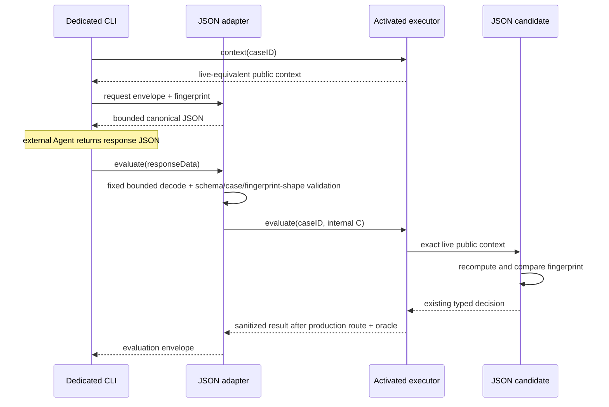

# RupaAgentCADBenchmarkJSONAdapter

## Purpose and Scope

`RupaAgentCADBenchmarkJSONAdapter` is the vendor-neutral JSON exchange boundary
between an external Agent process and the activated-case executor owned by
`RupaAgentCADBenchmark`. It is a native SwiftPM library target and a child of the
[RupaKit package design](../../DESIGN.md). It has no child design. The sibling
[benchmark CLI](../RupaAgentCADBenchmarkCLI/DESIGN.md) supplies process arguments
and standard streams; this target owns the JSON meaning used by that process.

The adapter is limited to the twenty-five reviewed cases `LIN-001`...`LIN-012`,
`REC-001`...`REC-012`, and `CIR-001`. It does not activate a catalog case and
does not make the remaining target specifications executable.

## Responsibilities and Boundaries

The target owns:

- versioned request, candidate-response, evaluation-result, and stable-error
  envelopes;
- the canonical fingerprint of one candidate-visible `CADCandidateContext`;
- schema, case-ID, fingerprint, and decision validation before a decision can
  enter benchmark execution;
- a public Data-based evaluation entry that performs the fixed bounded decode
  before any executor call, plus an internal `CADCandidateProtocol` bridge that
  returns the validated external decision only when the executor presents the
  exact matching live public context;
- bounded JSON reads from either standard input or one explicitly selected
  local file, plus bounded deterministic JSON encoding and the canonical
  prevalidated infrastructure-error document used when runtime encoding itself
  fails.

It does not own challenge meaning, decision/action meaning, activated-case
selection, a project/workspace, command routing, an oracle, private expected
geometry, scoring, process arguments, network I/O, an LLM SDK, MCP, or the
general-purpose `rupa` CLI. It never imports an internal oracle type and cannot
construct a benchmark result without calling the public activated-case
executor.

## Related Designs

| Design | Relationship | Contract Used | Summary | Cautions |
|---|---|---|---|---|
| [RupaKit package](../../DESIGN.md) | parent | target dependency direction | Places this target above the benchmark and below the dedicated executable. | No production authority target may depend on this adapter. |
| [RupaAgentCADBenchmark](../RupaAgentCADBenchmark/DESIGN.md) | depends on | public candidate context, explicit decision codecs, activated-case executor, sanitized case result | Supplies all CAD and benchmark meaning. | The adapter must not reproduce public action semantics in parallel DTOs or expose internal evidence. |
| [Benchmark CLI](../RupaAgentCADBenchmarkCLI/DESIGN.md) | used by | bounded decode/encode and envelope evaluation | Provides the process entry that external Agents invoke. | Process concerns remain in the executable target. |

## Architecture

Dependency direction is
`RupaAgentCADBenchmark -> RupaAgentCADBenchmarkJSONAdapter ->
RupaAgentCADBenchmarkCLI`; the arrows denote consumption by the item on the
right. The adapter has no dependency on `RupaCLIKit`.

## Contracts and Invariants

### Envelope contract

The adapter owns four top-level envelopes. Every envelope is one UTF-8 JSON
object, rejects unknown schema versions, and validates all required fields.

| Envelope | Required fields | Meaning |
|---|---|---|
| request v1 | `schema`, `caseID`, `contextFingerprint`, `context` | Exact public context offered to the external Agent. |
| candidate response v2 | `schema`, `caseID`, `contextFingerprint`, `decision` | One decision, including the activated circle action, returned by the JSON candidate. |
| evaluation v1 | `schema`, `caseID`, `contextFingerprint`, exactly one of `result` or `error` | Sanitized terminal outcome returned by the executable. |
| error v1 | `schema`, `code`, `message`; optional `caseID` | Stable private-free failure before a case is known, or a case-bound failure when a validated ID is available. |

The benchmark-owned `CADBenchmarkCaseID` is a validated single-value string in
every position, including top-level `caseID`, `context.challenge.id`, and
`result.id`. The adapter consumes that scalar contract directly and does not
wrap or mirror it. The former synthesized `{ "rawValue": ... }` object is
rejected before context fingerprinting or evaluation; v1 has no legacy
fallback because no external adapter release used that shape.

The candidate response carries the existing benchmark-owned
`CADCandidateDecision`. The benchmark's associated-value enums
`CADCandidateDecision`, `CADCandidateAction`, `CADAutomationAction`, and
`CADSketchAction` use explicit `kind` discriminators and named payload fields.
`CADOutputRoleSelector` does the same for the transitive `finish` payload. The
adapter does not introduce flat line/rectangle DTOs that would duplicate those
semantics. Because the benchmark package is unreleased and the old synthesized
enum encoding had only round-trip tests, the initial candidate-response v1
adopted the explicit shape without a compatibility decoder; golden JSON and
rejection tests froze that decision before the CLI was released. CIR-001 adds the closed
`CADSketchAction` discriminator `circle`; candidate-response advances to v2 and
v1 is rejected without fallback. Request, evaluation, and error envelopes stay
at v1, and the context fingerprint is unchanged.

Public production evaluation accepts candidate-response `Data`, not a decoded
envelope or candidate value. It always applies the fixed 65,536-byte decode
before constructing the internal typed response and candidate bridge. Typed
evaluation and candidate construction remain module-internal test/composition
seams, so a caller cannot construct a large in-memory response and bypass the
JSON input authority.

The activated twenty-eight cases accept one action decision. `unsupported` and
`finish` remain valid protocol values but are not converted to successful
actions; the T12-XA-A executor contract projects either as typed
`invalidSubmission` without publication. Multi-round continuation is not added
here, and the adapter never substitutes a reference action.

### Public-context fingerprint

`contextFingerprint` is lowercase SHA-256 over the UTF-8 bytes formed by the
domain separator `rupa.agent-cad-benchmark.public-context.v1` followed by a
newline and the deterministic JSON encoding of `CADCandidateContext` using
sorted keys and unescaped slashes. The request envelope itself is excluded to
avoid self-reference. The adapter emits the value; an external vendor need
only return it unchanged.

During evaluation, `CADJSONCandidate.decide(for:)` recomputes the fingerprint
from the live context supplied by the production harness and requires exact
schema, case ID, and fingerprint equality before returning the decision. A
mismatch is a typed adapter failure and creates no workspace publication. No
fallback accepts a response by case ID alone.

### Bounds and stable failures

One request, response, or evaluation document is limited to 65,536 bytes. A
reader consumes chunks only until `limit + 1`, rejects oversize before JSON
decode, and does not use an unbounded whole-file convenience API. The bound is
accepted only when the largest encoded activated request/response fixture is
measured below one quarter of it; changing the envelope or activated context
requires repeating that evidence or versioning the bound.

Only standard input or one explicit local file path is supported. URLs,
network reads, directories, multiple concatenated JSON values, trailing
non-whitespace bytes, and silent encoding repair are rejected. Stable error
codes distinguish malformed UTF-8/JSON, oversize input, unsupported schema,
inactive case, case mismatch, fingerprint mismatch, invalid decision,
candidate rejection, timeout/cancellation, oracle/infrastructure failure, and
output overflow. Error envelopes contain no private expectation, observed
source geometry, feature identity, or oracle diagnostic text.
The adapter owns one guaranteed infrastructure-error document whose bytes equal
the normal deterministic encoding of error v1, remain within the same bound,
and decode to that exact envelope. The CLI may use it only after runtime error
encoding fails, so a machine command never substitutes empty output for its
terminal JSON error.

Activation availability is read only from the benchmark executor. REC-009 did
not change envelope v1, fingerprint v1, the benchmark catalog, or the
expectation contract. Its aggregate fixture proved that the original twenty
request bytes and historical digest were unchanged, froze the then-current
twenty-one-request aggregate, and kept the largest request/response below one
quarter of the existing bound. REC-010 was its typed inactive boundary. The
completed T12-XA and REC-009 digests remain historical evidence and are not
presented as current authority.

`T12-REC-010` is an additive activation transition, not a schema change. Before
its vertical gate passed, the adapter was limited to the twenty-one-case prefix
through `REC-009`. The gate derived the exact ordered twenty-two-case prefix
from the executor, proved that the historical first-twenty and REC-009 twenty-
one-request aggregates still matched their frozen digests, and froze a new
digest over the actual twenty-two bounded requests. An exact public metre/XY
REC-010 response traversed the unchanged rectangle production route and oracle;
`REC-011` remained a typed inactive failure before evaluation. Envelope v1,
fingerprint v1, and the existing byte ceiling remained unchanged.

`T12-REC-011` is the next additive activation. Before its gate passed, the
executor-owned adapter boundary was the twenty-two-case prefix through REC-010.
The gate advanced it to the exact ordered twenty-three-case prefix, retained
the frozen first-twenty, twenty-one-, and twenty-two-request aggregate digests,
froze the actual twenty-three-request digest, and rechecked the existing size
ceiling. A millimetre/YZ REC-011 response realized through the unchanged
rectangle production route and oracle; REC-012 remained a typed inactive
failure before evaluation. No adapter schema or fingerprint changed.

`T12-REC-012` is the next additive activation. Before its gate passed, the
executor-owned adapter boundary was the twenty-three-case prefix through
REC-011. The gate advanced it to the exact ordered twenty-four-case prefix,
retained the frozen first-twenty, twenty-one-, twenty-two-, and twenty-three-
request aggregate digests, froze the actual twenty-four-request digest, and
rechecked the existing size ceiling. An exact public millimetre/XY REC-012
response realized through the unchanged rectangle production route and oracle.
Because REC-012 ends the rectangle catalog, CIR-001—not an invented REC-013—
remained a typed inactive failure before evaluation. No adapter schema or
fingerprint changed.

`T12-CIR-001` is the first schema-changing activation. Before its internal gate
passed, authority remained the twenty-four-case prefix. The completed
gate accepts candidate-response v2 with the benchmark-owned `circle` action,
rejects candidate-response v1 before evaluation, derives the exact ordered
twenty-five IDs from the executor, preserves request bytes/digests through
twenty-four, and freezes the actual twenty-five-request digest. A bounded CIR-
001 request and v2 response realize through the circle production route
and exact oracle; CIR-002 remained typed inactive at that gate. Request/evaluation/error v1,
fingerprint v1, the byte ceiling, and catalog/expectation versions do not move.

`T12-CIR-002` is a completed case-only authority transition. Before its internal
production and oracle evidence passed, this adapter was authoritative for the
exact twenty-five-case prefix through CIR-001. The gate derives an ordered
twenty-six-case prefix ending in CIR-002 from the executor, preserves the frozen
twenty-five-request aggregate, freezes the observed twenty-six-request
aggregate, and proves a bounded exact CIR-002 request and candidate-response-v2
evaluation through the unchanged circle route/oracle. CIR-003 remained typed
inactive at that gate. No envelope, fingerprint, byte-bound, error, benchmark catalog, or
candidate action schema changes in this transition.

`T12-CIR-003` is the completed first XZ circle transition and changes only the
executor-owned activated set. Before its internal production/oracle gate passed,
the adapter was authoritative for the ordered twenty-six-case prefix through
CIR-002. The completed case derives the twenty-seven-case prefix ending in
CIR-003, preserve the frozen twenty-six-request aggregate, freeze the observed
twenty-seven-request aggregate, and proved a bounded exact 25 mm XZ CIR-003
request and candidate-response-v2 evaluation through the unchanged circle
route/oracle. CIR-004 remained typed inactive at that gate. Envelope versions, the context
fingerprint, byte bound, error projection, and candidate action shape do not
change.

### CIR-004 through CIR-012 sequential authority

The remaining circle activations consume the exact geometry and adversarial
contracts in the benchmark-owned [circle case matrix](../RupaAgentCADBenchmark/DESIGN.md#cir-004-through-cir-012-case-matrix).
This adapter owns only their ordered external authority transition:

| Case | Activated count after gate | Required prior aggregate | Next inactive ID |
|---|---:|---|---|
| CIR-004 | 28 | CIR-003 / 27-request aggregate | CIR-005 |
| CIR-005 | 29 | CIR-004 / 28-request aggregate | CIR-006 |
| CIR-006 | 30 | CIR-005 / 29-request aggregate | CIR-007 |
| CIR-007 | 31 | CIR-006 / 30-request aggregate | CIR-008 |
| CIR-008 | 32 | CIR-007 / 31-request aggregate | CIR-009 |
| CIR-009 | 33 | CIR-008 / 32-request aggregate | CIR-010 |
| CIR-010 | 34 | CIR-009 / 33-request aggregate | CIR-011 |
| CIR-011 | 35 | CIR-010 / 34-request aggregate | CIR-012 |
| CIR-012 | 36 | CIR-011 / 35-request aggregate | ANG-001 |

Each row is a separate commit and remains inactive until its internal gate
passes. That commit derives the exact ordered IDs from the executor, reasserts
the prior digest, freezes the newly observed aggregate, proves bounded request
and candidate-response-v2 evaluation through the unchanged circle route/oracle,
and rejects the next ID before evaluation. CIR-012 uses the real next-category
ID ANG-001; no CIR-013 is invented. Envelope versions, context fingerprint,
byte bound, decision shape, error projection, and privacy boundary remain fixed.

## Runtime Flows

## State, Ownership, and Lifecycle

Envelope, fingerprint, decision, result, and error values are immutable and
`Sendable`. The JSON candidate owns one immutable validated response for one
evaluation call. Input buffers live only through bounded decode; no file
handle, controller, workspace, oracle snapshot, or private expectation is
retained. The benchmark executor remains the owner of fresh project lifecycle
and cleanup.

## Failure, Concurrency, and Constraints

One CLI evaluation executes one case at serial concurrency 1. The adapter adds
no retry, scheduler, shared cache, or mutable global state. A decode or binding
failure occurs before candidate action dispatch. A non-realized benchmark
outcome remains a result rather than being changed to adapter success. After a
published mutation the benchmark's no-retry result is preserved. Cancellation,
deadline, oracle failure, and cleanup failure retain their benchmark
classification and are projected only to stable non-private codes.

## Verification and Change Impact

| Invariant | Behavioral evidence |
|---|---|
| Explicit vendor-neutral wire shape | Golden request/response/evaluation JSON for line, rectangle, and circle decisions; candidate-response v2 carries `kind: circle`, v1 and unknown discriminators are rejected, and every direct and nested case ID is the same scalar string. |
| Exact public-context binding | The request fingerprint equals the live executor context; changed schema, case, context byte, capability, budget, or fingerprint is rejected before publication. |
| Current activation boundary | The executor-derived ordered set is exactly LIN-001...012, REC-001...012, and CIR-001...004; the historical twenty-seven-request aggregate remains `9d9bde9eb7f520cecee220c7286b16e0c5347cd50219cfe08d780114f24cc975`, the twenty-eight-request aggregate is `2be3d440bd56644efc614c520ffac49cad8a5cd4eb1d0629447e620dcf9e48fc`, CIR-004 traverses the production YZ circle route/oracle, and CIR-005 is rejected before evaluation. |
| Bounded I/O | Exact-limit input succeeds, `limit + 1` fails before decode and leaves executor evaluation count zero, chunked stdin and file paths behave identically, no public typed-response execution bypass exists, encoded output cannot exceed the same bound, and the guaranteed infrastructure document is byte-equal to normal encoding, bounded, and decodable. |
| Candidate/oracle separation | Static dependency and source scans prove the adapter imports only public benchmark contracts; encoded fixtures contain no expectation/oracle/source snapshot fields or values. |
| Same production route | JSON candidates for an activated line, rectangle, and circle realize through the public executor; wrong geometry publishes once then the category's exact oracle rejects without retry. |
| Non-action honesty | Valid `unsupported` and `finish` responses reach the benchmark candidate boundary, produce typed prepublication `invalidSubmission`, zero publication, and no fallback reference action. |

Changes to public candidate Codable shapes, public context fields, capability
snapshot generation, activation boundary, fingerprint algorithm, byte bound,
executor result projection, or CLI exit mapping require rechecking this design,
the benchmark design, the CLI design, golden JSON, and process-level tests. A
case-ID Codable change also requires the benchmark-owned manifest/catalog and
expectation version/digest transition before adapter fingerprints are refrozen.
