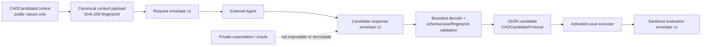
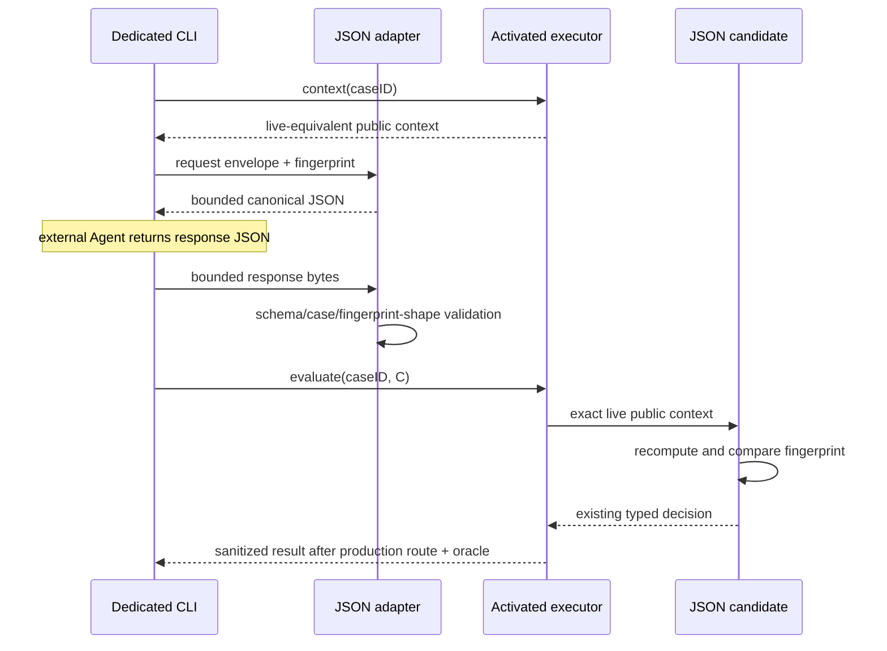

# RupaAgentCADBenchmarkJSONAdapter

## Purpose and Scope

`RupaAgentCADBenchmarkJSONAdapter` is the vendor-neutral JSON exchange boundary
between an external Agent process and the activated-case executor owned by
`RupaAgentCADBenchmark`. It is a native SwiftPM library target and a child of the
[RupaKit package design](../../DESIGN.md). It has no child design. The sibling
[benchmark CLI](../RupaAgentCADBenchmarkCLI/DESIGN.md) supplies process arguments
and standard streams; this target owns the JSON meaning used by that process.

The adapter is limited to the twenty reviewed cases `LIN-001`...`LIN-012` and
`REC-001`...`REC-008`. It does not activate a catalog case and does not make the
remaining target specifications executable.

## Responsibilities and Boundaries

The target owns:

- versioned request, candidate-response, evaluation-result, and stable-error
  envelopes;
- the canonical fingerprint of one candidate-visible `CADCandidateContext`;
- schema, case-ID, fingerprint, and decision validation before a decision can
  enter benchmark execution;
- a `CADCandidateProtocol` adapter that returns the validated external decision
  when the executor presents the exact matching live public context;
- bounded JSON reads from either standard input or one explicitly selected
  local file, plus bounded deterministic JSON encoding.

It does not own challenge meaning, decision/action meaning, activated-case
selection, a project/workspace, command routing, an oracle, private expected
geometry, scoring, process arguments, network I/O, an LLM SDK, MCP, or the
general-purpose `rupa` CLI. It never imports an internal oracle type and cannot
construct a benchmark result without calling the public activated-case
executor.

## Related Designs

| Design | Relationship | Contract Used | Summary | Cautions |
|---|---|---|---|---|
| [RupaKit package](../../DESIGN.md) | parent | target dependency direction | Places this target above the benchmark and below the dedicated executable. | No production authority target may depend on this adapter. |
| [RupaAgentCADBenchmark](../RupaAgentCADBenchmark/DESIGN.md) | depends on | public candidate context, explicit decision codecs, activated-case executor, sanitized case result | Supplies all CAD and benchmark meaning. | The adapter must not reproduce public action semantics in parallel DTOs or expose internal evidence. |
| [Benchmark CLI](../RupaAgentCADBenchmarkCLI/DESIGN.md) | used by | bounded decode/encode and envelope evaluation | Provides the process entry that external Agents invoke. | Process concerns remain in the executable target. |

## Architecture

Dependency direction is
`RupaAgentCADBenchmark -> RupaAgentCADBenchmarkJSONAdapter ->
RupaAgentCADBenchmarkCLI`; the arrows denote consumption by the item on the
right. The adapter has no dependency on `RupaCLIKit`.

## Contracts and Invariants

### Envelope contract

The adapter owns three top-level envelopes. Every envelope is one UTF-8 JSON
object, rejects unknown schema versions, and validates all required fields.

| Envelope | Required fields | Meaning |
|---|---|---|
| request v1 | `schema`, `caseID`, `contextFingerprint`, `context` | Exact public context offered to the external Agent. |
| candidate response v1 | `schema`, `caseID`, `contextFingerprint`, `decision` | One decision to be returned by the JSON candidate. |
| evaluation v1 | `schema`, `caseID`, `contextFingerprint`, exactly one of `result` or `error` | Sanitized terminal outcome returned by the executable. |

The benchmark-owned `CADBenchmarkCaseID` is a validated single-value string in
every position, including top-level `caseID`, `context.challenge.id`, and
`result.id`. The adapter consumes that scalar contract directly and does not
wrap or mirror it. The former synthesized `{ "rawValue": ... }` object is
rejected before context fingerprinting or evaluation; v1 has no legacy
fallback because no external adapter release used that shape.

The candidate response carries the existing benchmark-owned
`CADCandidateDecision`. The benchmark's associated-value enums
`CADCandidateDecision`, `CADCandidateAction`, `CADAutomationAction`, and
`CADSketchAction` use explicit `kind` discriminators and named payload fields.
`CADOutputRoleSelector` does the same for the transitive `finish` payload. The
adapter does not introduce flat line/rectangle DTOs that would duplicate those
semantics. Because the benchmark package is unreleased and the old synthesized
enum encoding has only round-trip tests, v1 intentionally adopts the explicit
shape without a compatibility decoder; golden JSON and rejection tests freeze
that decision before the CLI is released.

The activated twenty cases accept one action decision. `unsupported` and
`finish` remain valid protocol values but are not converted to successful
actions; the T12-XA-A executor contract projects either as typed
`invalidSubmission` without publication. Multi-round continuation is not added
here, and the adapter never substitutes a reference action.

### Public-context fingerprint

`contextFingerprint` is lowercase SHA-256 over the UTF-8 bytes formed by the
domain separator `rupa.agent-cad-benchmark.public-context.v1` followed by a
newline and the deterministic JSON encoding of `CADCandidateContext` using
sorted keys and unescaped slashes. The request envelope itself is excluded to
avoid self-reference. The adapter emits the value; an external vendor need
only return it unchanged.

During evaluation, `CADJSONCandidate.decide(for:)` recomputes the fingerprint
from the live context supplied by the production harness and requires exact
schema, case ID, and fingerprint equality before returning the decision. A
mismatch is a typed adapter failure and creates no workspace publication. No
fallback accepts a response by case ID alone.

### Bounds and stable failures

One request, response, or evaluation document is limited to 65,536 bytes. A
reader consumes chunks only until `limit + 1`, rejects oversize before JSON
decode, and does not use an unbounded whole-file convenience API. The bound is
accepted only when the largest encoded activated request/response fixture is
measured below one quarter of it; changing the envelope or activated context
requires repeating that evidence or versioning the bound.

Only standard input or one explicit local file path is supported. URLs,
network reads, directories, multiple concatenated JSON values, trailing
non-whitespace bytes, and silent encoding repair are rejected. Stable error
codes distinguish malformed UTF-8/JSON, oversize input, unsupported schema,
inactive case, case mismatch, fingerprint mismatch, invalid decision,
candidate rejection, timeout/cancellation, oracle/infrastructure failure, and
output overflow. Error envelopes contain no private expectation, observed
source geometry, feature identity, or oracle diagnostic text.

## Runtime Flows

## State, Ownership, and Lifecycle

Envelope, fingerprint, decision, result, and error values are immutable and
`Sendable`. The JSON candidate owns one immutable validated response for one
evaluation call. Input buffers live only through bounded decode; no file
handle, controller, workspace, oracle snapshot, or private expectation is
retained. The benchmark executor remains the owner of fresh project lifecycle
and cleanup.

## Failure, Concurrency, and Constraints

One CLI evaluation executes one case at serial concurrency 1. The adapter adds
no retry, scheduler, shared cache, or mutable global state. A decode or binding
failure occurs before candidate action dispatch. A non-realized benchmark
outcome remains a result rather than being changed to adapter success. After a
published mutation the benchmark's no-retry result is preserved. Cancellation,
deadline, oracle failure, and cleanup failure retain their benchmark
classification and are projected only to stable non-private codes.

## Verification and Change Impact

| Invariant | Behavioral evidence |
|---|---|
| Explicit vendor-neutral wire shape | Golden request/response/evaluation JSON for line and rectangle decisions; every direct and nested case ID is the same scalar string; synthesized case-ID objects, synthesized legacy enum shapes, and unknown discriminators are rejected. |
| Exact public-context binding | The request fingerprint equals the live executor context; changed schema, case, context byte, capability, budget, or fingerprint is rejected before publication. |
| Bounded I/O | Exact-limit input succeeds, `limit + 1` fails before decode, chunked stdin and file paths behave identically, and encoded output cannot exceed the same bound. |
| Candidate/oracle separation | Static dependency and source scans prove the adapter imports only public benchmark contracts; encoded fixtures contain no expectation/oracle/source snapshot fields or values. |
| Same production route | JSON candidates for at least one activated line and rectangle realize through the public executor; wrong geometry publishes once then exact oracle rejects without retry. |
| Non-action honesty | Valid `unsupported` and `finish` responses reach the benchmark candidate boundary, produce typed prepublication `invalidSubmission`, zero publication, and no fallback reference action. |

Changes to public candidate Codable shapes, public context fields, capability
snapshot generation, activation boundary, fingerprint algorithm, byte bound,
executor result projection, or CLI exit mapping require rechecking this design,
the benchmark design, the CLI design, golden JSON, and process-level tests. A
case-ID Codable change also requires the benchmark-owned manifest/catalog and
expectation version/digest transition before adapter fingerprints are refrozen.
