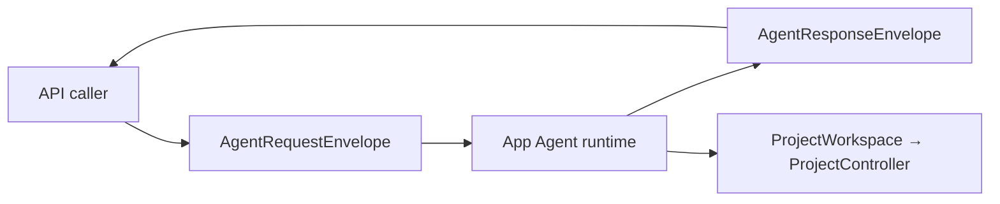
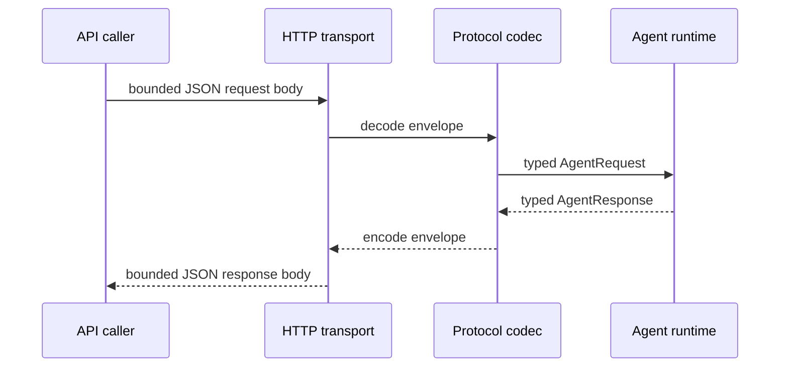

# RupaAgentProtocol

## Purpose and Scope

`RupaAgentProtocol` owns the Codable semantic Agent request/response
contract, including CAD, Mesh, inspection, and explicit-save receipts. It is a
child of the [RupaKit package design](../../DESIGN.md) and is consumed by the
runtime, project access, transport, and CLI modules. Children: none.

## Responsibilities and Boundaries

The module owns method names, envelopes, typed payloads, capability
descriptors, and malformed-message rejection. It does not resolve discovery,
parse HTTP, authenticate credentials, resolve sessions, read a workspace,
mutate CAD/Mesh, save packages, or render previews.

Protocol values describe intent and receipts only. Persistent identifiers,
transaction validation, evaluation, and lowering remain App-owned.

## Related Designs

| Design | Relationship | Contract Used | Summary | Cautions |
|---|---|---|---|---|
| [RupaKit package](../../DESIGN.md) | parent | dependency direction | Places protocol below semantic owners. | No project authority here. |
| [RupaAgentRuntime](../RupaAgentRuntime/DESIGN.md) | used by | decoded requests and result projection | Binds values to the registered workspace. | Runtime owns dispatch. |
| [RupaAgentTransport](../RupaAgentTransport/DESIGN.md) | carried by | bounded JSON body | Carries envelopes without interpreting fields. | Transport rejects malformed framing first. |
| [RupaProjectAccess](../RupaProjectAccess/DESIGN.md) | used by | session-bound request/response | Exposes the public API boundary. | Protocol values are not permission. |
| [RupaDomainFoundation](../RupaDomainFoundation/DESIGN.md) | represented by | semantic operation and program values | Supplies the generic CAD intent shape. | Decoding does not lower a program. |

## Architecture

## Contracts and Invariants

1. Every envelope has one protocol version, request ID, method, and matching
   typed payload. Unknown versions, methods, required fields, and structural
   mismatches fail during decode.
2. CAD direct invocation and declarative programs use one semantic vocabulary;
   protocol decoding never expands a program into multiple requests. The
   direct DTO losslessly carries semantic schema version, one invocation, and
   requested descriptor output IDs; the program DTO losslessly carries its
   schema version, nodes, and requested `node.output` references.
3. Session-bearing requests preserve session, generation, workspace, and
   transaction coordinates. Those values are checked by the App runtime.
4. Encoded request/response byte limits and strict DTO structure are validated
   before semantic dispatch. Transport separately owns HTTP frame/body limits;
   Foundation owns decoded semantic graph/value/expression/work limits. No
   decoder silently truncates values or drops identity, plan, or receipt fields.
5. Server response receipts distinguish success, typed prepublication failure,
   and committed result-projection failure. A committed receipt is not
   retryable. `outcomeUnknown` is not a server response or protocol DTO; the
   ProjectAccess client creates that local classification only when a complete
   request was dispatched and no authenticated response was received.
6. `AgentStatus` and session observations contain semantic service state only;
   endpoint, port, HMAC key, and discovery records are not protocol fields.
7. Mesh buffers and renderer resources are not encoded. Mesh read/edit
   receipts carry handles, bounds, counts, provenance, and telemetry only.
8. CAD receipts preserve the
   [package identity phases](../../DESIGN.md#cad-identity-phases): staged
   source bindings are distinct typed values, while an evaluated `BodyID` may
   appear only when requested after successful publication. Protocol decoding
   and encoding never fabricate, infer, or promote one identity kind into
   another, and dry-run receipts contain neither persistent nor evaluated IDs.
   Only outputs requested in the decoded semantic form may appear in a success
   receipt; Protocol preserves that selection but does not infer it. A preview
   retains the exact input authority as its base and carries strictly advanced
   proposed document-generation and transaction-revision values computed by
   the workspace; it does not claim a publication or persistent identity.
9. Protocol owns exact encoded-response sizing. Its limits validation proves
   that the configured ceiling can always carry the largest fixed
   `responsePlanRejected` envelope under the configured correlation and
   project-identity bounds. From the Foundation result charge and fixed
   response schema it creates one immutable `AgentResponseEncodingPlan`
   before Runtime may stage workspace mutation. A full plan reserves success,
   the fixed committed failure, and the fixed prepublication failure. When
   request-specific success planning overflows or exceeds the ceiling,
   Protocol instead returns a failure-only plan that reserves only the fixed
   prepublication failure and forbids staging. Every reservation is consumed
   by exactly one encode attempt; the encoder does not discover oversize after
   publication and then attempt a generic-error re-encode.
10. The fixed committed failure contains only its typed code, exact authority
    coordinate, and `mustNotRetry`; it contains no arbitrary message,
    diagnostics, telemetry, or requested bindings. Encoding a value that does
    not match its preflight plan is an internal invariant violation, never a
    retryable transport failure.

## Runtime Flows

## State, Ownership, and Lifecycle

Protocol values are immutable and request-local. They own no workspace,
controller, package, credential, connection, or persistent source ID.

## Failure, Concurrency, and Constraints

Malformed JSON, unsupported discriminator, encoded-payload byte excess, invalid
typed-value or coordinate encoding shape, missing fields, and response-plan
errors before staging are explicit typed failures. Semantic value validity and
coordinate freshness are not codec decisions. The codec never converts an
error into an empty success value.

## Verification and Change Impact

Protocol tests prove deterministic envelope coding, explicit semantic schema
version and requested-output round trips for both forms, all supported server
semantic responses, malformed and encoded-byte-boundary rejection,
coordinate-shape preservation, committed/no-retry receipts, rejection of any
server `outcomeUnknown` discriminator, and absence of transport discovery
fields. HTTP frame/body and client-local response-loss classification remain
Transport/ProjectAccess-owned. Response-plan tests prove exact boundary and
boundary-plus-one behavior before staging, the fixed committed alternative is
always below the ceiling, and each selected plan is encoded once without a
postpublication fallback attempt.
