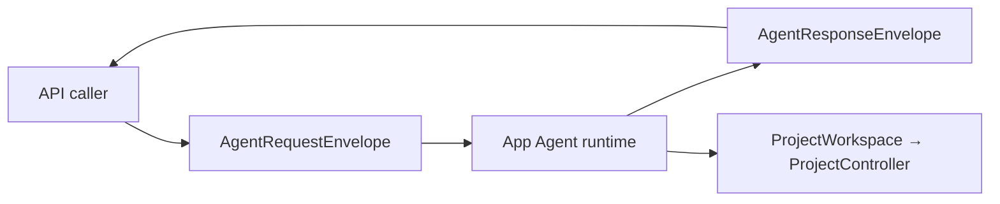
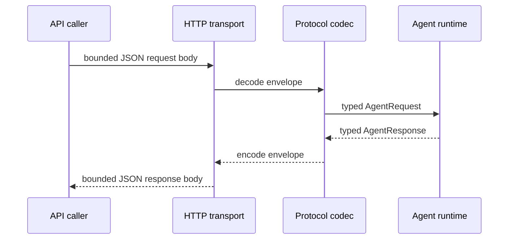

# RupaAgentProtocol

## Purpose and Scope

`RupaAgentProtocol` owns the Codable semantic Agent request/response
contract, including CAD, Mesh, inspection, and explicit-save receipts. It is a
child of the [RupaKit package design](../../DESIGN.md) and is consumed by the
runtime, project access, transport, and CLI modules. Children: none.

## Responsibilities and Boundaries

The module owns method names, envelopes, typed payloads, capability
descriptors, and malformed-message rejection. It does not resolve discovery,
parse HTTP, authenticate credentials, resolve sessions, read a workspace,
mutate CAD/Mesh, save packages, or render previews.

Protocol values describe intent and receipts only. Persistent identifiers,
transaction validation, evaluation, and lowering remain App-owned.

## Related Designs

| Design | Relationship | Contract Used | Summary | Cautions |
|---|---|---|---|---|
| [RupaKit package](../../DESIGN.md) | parent | dependency direction | Places protocol below semantic owners. | No project authority here. |
| [RupaAgentRuntime](../RupaAgentRuntime/DESIGN.md) | used by | decoded requests and result projection | Binds values to the registered workspace. | Runtime owns dispatch. |
| [RupaAgentTransport](../RupaAgentTransport/DESIGN.md) | carried by | bounded JSON body | Carries envelopes without interpreting fields. | Transport rejects malformed framing first. |
| [RupaProjectAccess](../RupaProjectAccess/DESIGN.md) | used by | session-bound request/response | Exposes the public API boundary. | Protocol values are not permission. |
| [RupaDomainFoundation](../RupaDomainFoundation/DESIGN.md) | represented by | semantic operation and program values | Supplies the generic CAD intent shape. | Decoding does not lower a program. |

## Architecture

## Contracts and Invariants

1. Every envelope has one protocol version, request ID, method, and matching
   typed payload. Unknown versions, methods, required fields, and structural
   mismatches fail during decode.
2. CAD direct invocation and declarative programs use one semantic vocabulary;
   protocol decoding never expands a program into multiple requests.
3. Session-bearing requests preserve session, generation, workspace, and
   transaction coordinates. Those values are checked by the App runtime.
4. Payload limits are validated before semantic dispatch. No decoder silently
   truncates values or drops identity, limit, plan, or receipt fields.
5. Response receipts distinguish success, typed failure, committed result
   projection failure, and outcome-unknown dispatch. A committed receipt is
   not retryable.
6. `AgentStatus` and session observations contain semantic service state only;
   endpoint, port, HMAC key, and discovery records are not protocol fields.
7. Mesh buffers and renderer resources are not encoded. Mesh read/edit
   receipts carry handles, bounds, counts, provenance, and telemetry only.

## Runtime Flows

## State, Ownership, and Lifecycle

Protocol values are immutable and request-local. They own no workspace,
controller, package, credential, connection, or persistent source ID.

## Failure, Concurrency, and Constraints

Malformed JSON, unsupported discriminator, invalid typed values, coordinate
mismatch, missing fields, and response projection errors are explicit typed
failures. The codec never converts an error into an empty success value.

## Verification and Change Impact

Protocol tests prove deterministic envelope coding, all supported semantic
responses, malformed and oversized-value rejection, coordinate preservation,
committed/no-retry receipts, and absence of transport discovery fields.
