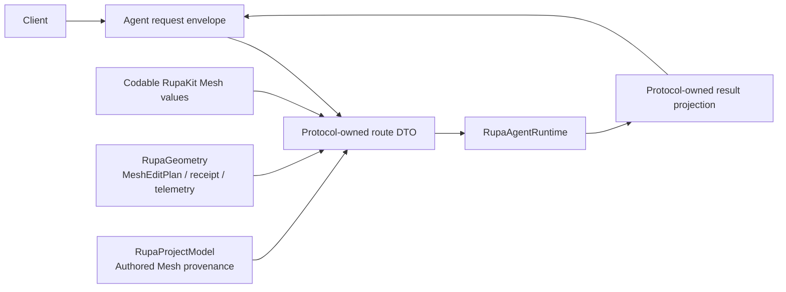
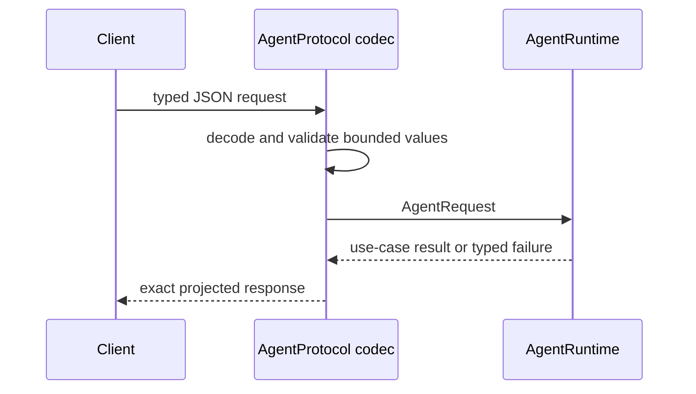

# RupaAgentProtocol Project Geometry Design

## Purpose and Scope

This module owns the T10 Codable Agent request and response contract for
Authored Mesh inspection/editing and CAD Make Editable. It is a child of the
[package design](../../DESIGN.md) and is used by RupaAgentRuntime,
RupaAgentTransport, RupaAgent, and CLI clients that already speak AgentProtocol.
It has no child design.

## Responsibilities and Boundaries

The module owns method names, Codable payloads, response projections, capability
descriptors, and malformed-message rejection. It reuses Codable RupaKit Mesh
handles, limits, cursors, element records, catalogs, and RupaGeometry plans and
receipts instead of defining a second geometry vocabulary.

It does not resolve sessions, read a workspace, choose a current view, mutate
CAD/Mesh, save/load packages, perform socket I/O, publish an endpoint path, or
rasterize previews.

## Related Designs

| Design | Relationship | Contract Used | Summary | Cautions |
|---|---|---|---|---|
| [package design](../../DESIGN.md) | parent | dependency direction and T10 scope | Places this adapter above RupaKit values and below runtime/transport. | No reverse dependency from RupaKit is allowed. |
| [RupaKit use cases](../RupaKit/DESIGN.md) | depends on | Codable Mesh value contracts | Supplies one canonical Mesh vocabulary. | `ProjectViewSnapshot` is process-local and never encoded. |
| [RupaGeometry](../RupaGeometry/DESIGN.md) | depends on | `MeshEditPlan`, `MeshEditReceipt`, and `GeometryCopyTelemetry` values | Supplies the bounded operation and copy-accounting vocabulary carried by Agent messages. | Protocol payloads reuse these values and do not execute plans. |
| [RupaKit package design](../../DESIGN.md) | depends on through `RupaProjectModel` | Authored Mesh provenance | Supplies the persisted authority provenance projected by Make Editable results. | Provenance is evidence, not permission to mutate project state. |
| [AgentRuntime](../RupaAgentRuntime/DESIGN.md) | used by | decoded typed requests and projected results | Binds messages to registered project authority. | Runtime errors remain typed, never a success fallback. |
| [RupaProjectAccess](../RupaProjectAccess/DESIGN.md) | used by | typed request/response and session-coordinate values | Carries intent without transport or project authority. | Access-session save is a lifecycle port, not the Agent `document.save` route. |
| [system design](../../../DESIGN.md) | system parent | file-lifecycle and authority invariants | Defines the acceptance workflow. | Agent wire save remains unsupported. |

## Architecture

## Contracts and Invariants

1. Typed routes cover catalog, element page, neighborhood, Mesh edit with
   explicit preview/commit mode, and CAD Make Editable. Existing Automation
   requests remain the only CAD modeling vocabulary.
2. Every project route requires a session and expected document generation.
   Handle-based routes additionally carry the exact T09 source handle; Runtime
   rejects disagreement with its current view before use-case dispatch.
3. Caller-supplied read and plan limits are decoded through their validating
   initializers and cannot exceed owning hard ceilings.
4. Page/neighborhood/catalog values use RupaKit Codable contracts directly.
   Results whose internal form contains `ProjectViewSnapshot` are projected to
   protocol DTOs containing exact handles, generation/workspace coordinates,
   identities, receipts, diagnostics, dirty state, and retry disposition only.
5. Make Editable input contains the target scene node, unused Authored Mesh
   source and representation IDs, presentation-switch choice, and expected
   generation. It never contains evaluated Mesh bytes or a forged command.
6. Wire decoding has no compatibility fallback that drops handles, limits,
   plan steps, identities, or expected coordinates.
7. `document.save` remains representable for compatibility but the project
   route continues to return typed unsupported; T10 adds no load/save method.
8. `AgentStatus` contains service availability and session count only. Socket
   endpoint placement is private transport composition.
9. `AgentRequest.projectSessionID` is the single public extraction contract
   used by runtime and project-access session guards; session-neutral requests
   return `nil`.

## Runtime Flows

## State, Ownership, and Lifecycle

All protocol values are immutable Codable values. They own no live workspace,
view, Mesh buffer lease, file URL authority, or renderer resource. A source
handle is a coordinate value, not permission to mutate stale source.

## Failure, Concurrency, and Constraints

Decode failures, invalid enum discriminators, invalid limits/plans/IDs, and
missing required fields are explicit protocol failures. The existing transport
frame ceiling remains the outer payload bound. The module has no shared mutable
state and introduces no target-specific synchronization branch.

## Verification and Change Impact

Codec and fixture tests must round-trip each success response, reject malformed
and over-limit input, preserve exact identities/receipts, and prove the save
route remains unsupported at runtime. Any payload change requires rechecking
AgentRuntime mapping, transport fixtures, capability descriptors, package
dependencies, and the system workflow.
