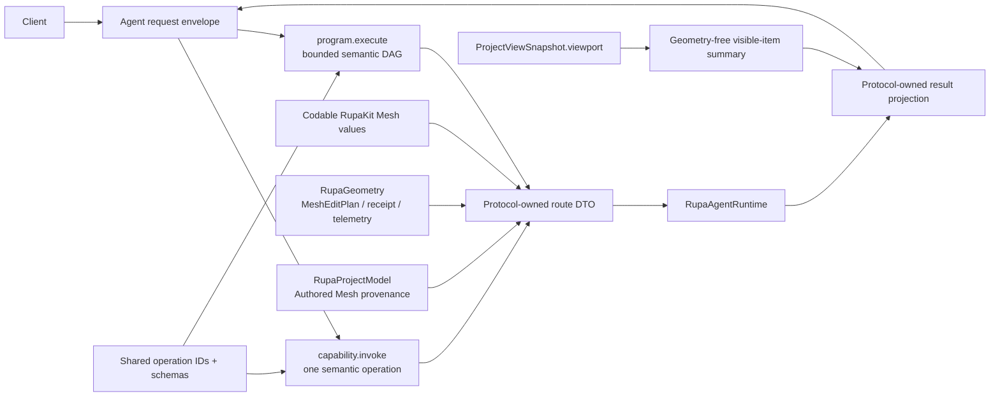
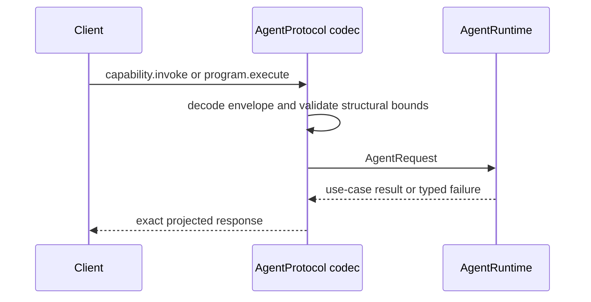

# RupaAgentProtocol Project Geometry Design

## Purpose and Scope

This module owns the Codable Agent request and response contract, including
Authored Mesh inspection/editing, CAD Make Editable, the CADAPI-D semantic
modeling envelopes, and authoritative receipts for mutations that committed
before result projection failed. It is a child of the
[package design](../../DESIGN.md) and is used by RupaAgentRuntime,
RupaAgentTransport, RupaAgent, and CLI clients that already speak AgentProtocol.
It has no child design.

CADAPI-D fixes the target wire contract but is not yet implemented. The current
wire exposure of `AutomationCommand` and raw `appendFeatureGraph` is a legacy
implementation gap, not part of the target contract described here.

## Responsibilities and Boundaries

The module owns method names, Codable payloads, response projections, capability
descriptors, and malformed-message rejection. It also owns the geometry-buffer-free
projection of the exact immutable project viewport consumed by the application.
It reuses Codable RupaKit Mesh
handles, limits, cursors, element records, catalogs, and RupaGeometry plans and
receipts instead of defining a second geometry vocabulary.

For CAD source mutation it owns exactly two external DTO forms:

- `capability.invoke` carries one registered semantic operation and its typed
  arguments, with no program wrapper or request-local references;
- `program.execute` carries a bounded declarative DAG whose nodes use the same
  operation identifiers, versions, argument schemas, and result schemas, plus
  typed request-local symbols, parameters, output references, reuse, and native
  finite-pattern operations.

These DTOs describe intent only. Persistent Product/CAD identifiers,
presentation defaults, dependency order, validation, and lowering are owned by
Rupa, never by the wire client.

It does not define CAD operation semantics or lowering, resolve sessions, read a
workspace, choose a current view, mutate CAD/Mesh, save/load packages, perform
socket I/O, publish an endpoint path, or rasterize previews.

## Related Designs

| Design | Relationship | Contract Used | Summary | Cautions |
|---|---|---|---|---|
| [package design](../../DESIGN.md) | parent | dependency direction and T10 scope | Places this adapter above RupaKit values and below runtime/transport. | No reverse dependency from RupaKit is allowed. |
| [RupaKit use cases](../RupaKit/DESIGN.md) | depends on | Codable Mesh values and immutable `ProjectViewSnapshot` | Supplies one canonical Mesh vocabulary and the exact application viewport snapshot. | `ProjectViewSnapshot` and `MeshSource` buffers are process-local and never encoded. |
| [RupaGeometry](../RupaGeometry/DESIGN.md) | depends on | `MeshEditPlan`, `MeshEditReceipt`, and `GeometryCopyTelemetry` values | Supplies the bounded operation and copy-accounting vocabulary carried by Agent messages. | Protocol payloads reuse these values and do not execute plans. |
| [RupaKit package design](../../DESIGN.md) | depends on through `RupaProjectModel` | Authored Mesh provenance | Supplies the persisted authority provenance projected by Make Editable results. | Provenance is evidence, not permission to mutate project state. |
| [AgentRuntime](../RupaAgentRuntime/DESIGN.md) | used by | decoded typed requests and projected results | Binds messages to registered project authority. | Runtime errors remain typed, never a success fallback. |
| [RupaProjectAccess](../RupaProjectAccess/DESIGN.md) | used by | typed request/response and session-coordinate values | Carries intent without transport or project authority. | Access-session save is a lifecycle port, not the Agent `document.save` route. |
| [RupaDomainFoundation](../RupaDomainFoundation/DESIGN.md) | represented through | semantic operation and program value contract | Defines the generic operation schema, typed local references, and bounded program semantics represented by protocol DTOs. | Protocol decoding does not compile or lower a program. |
| [package planned CAD domain boundary](../../DESIGN.md) | represented through; planned module boundary | registered CAD operation descriptors and result schemas | Owns the concrete CAD vocabulary shared by both external forms. | No `RupaCADDomain` target exists yet; the package design is the temporary design authority. |
| [system design](../../../DESIGN.md) | system parent | file-lifecycle and authority invariants | Defines the acceptance workflow. | The App router, not Runtime, owns explicit live save. |
| [Agent host](../RupaAgentUI/DESIGN.md) | used by | injected request handler and save committed receipt | Routes explicit App save while preserving Runtime's fail-closed lifecycle boundary. | A committed save receipt must never be projected as a retryable failure. |

## Architecture

## Contracts and Invariants

1. Typed routes cover catalog, element page, neighborhood, Mesh edit with
   explicit preview/commit mode, CAD Make Editable, and the two CADAPI-D source
   mutation forms. Mesh/read/lifecycle/export routes retain their existing
   effect-specific contracts and are not made program nodes.
2. CAD source mutation has exactly one semantic operation vocabulary and two
   external invocation forms. `capability.invoke` invokes one operation and
   cannot carry local references. `program.execute` composes the same operation
   definitions as a bounded declarative DAG; it is not a second command
   vocabulary.
3. A program contains source-mutation operations only. Reads, workspace
   mutations, export, lifecycle, external I/O, callbacks, arbitrary code,
   recursion, conditionals, and unbounded loops are rejected rather than mixed
   into the same transaction.
4. Program node symbols and output references are typed and request-local.
   Arguments may be typed literals, named parameters, existing source targets,
   local named outputs, or bounded pure expressions over those values. The
   request carries expected project coordinates and dry-run mode once at the
   envelope level, never independently per node.
   Persistent feature, scene-node, component, instance, pattern, and other
   source identifiers are allocated by Rupa during staged execution and are
   returned only through typed receipts after successful publication. Dry run
   never claims that request-local outputs are persistent references.
5. Program limits cover encoded bytes, decoded values and nesting, nodes,
   edges, parameters, output references, expressions, lowered commands,
   diagnostics, and expanded source/evaluation work. They are validated before
   source mutation; decoding never silently truncates a program.
   Native finite-pattern nodes carry their bounded semantic count and lower to
   one source pattern operation; the wire format does not expand them to one
   node or occurrence payload per result instance.
6. Every project route requires a session and expected document generation.
   Handle-based routes additionally carry the exact T09 source handle; Runtime
   rejects disagreement with its current view before use-case dispatch.
7. Caller-supplied read and plan limits are decoded through their validating
   initializers and cannot exceed owning hard ceilings.
8. Page/neighborhood/catalog values use RupaKit Codable contracts directly.
   Results whose internal form contains `ProjectViewSnapshot` are projected to
   protocol DTOs containing exact handles, generation/workspace coordinates,
   identities, receipts, diagnostics, dirty state, and retry disposition only.
9. Make Editable input contains the target scene node, unused Authored Mesh
   source and representation IDs, presentation-switch choice, and expected
   generation. It never contains evaluated Mesh bytes or a forged command.
10. Wire decoding has no compatibility fallback that drops handles, limits,
   plan steps, identities, or expected coordinates.
11. `document.save` is representable and remains typed unsupported when sent
   directly to `ProjectAgentCommandController`. The application-composed
   router may handle it only through the typed coordinator lifecycle port and
   current URL; create/open/close remain unsupported on the Agent route.
12. `AgentStatus` contains service availability and session count only. Socket
   endpoint placement is private transport composition.
13. `AgentRequest.projectSessionID` is the single public extraction contract
   used by runtime and project-access session guards; session-neutral requests
   return `nil`.
14. `AgentCommittedMutationOutcome.Mutation` includes `save`. A save receipt
    uses `Stage.viewProjection`, exact project/generation/transaction/
    publication/workspace coordinates from the committed
    `ProjectWorkspacePersistencePublicationError.state`, and the existing
    `RetryDisposition.mustNotRetry`. It means package replacement and
    clean-state publication already happened; clients must refresh and must not
    send the save again.
15. `document.sceneGraphSnapshot` projects only the immutable Product scene
    graph in deterministic node order, including root IDs, source linkage,
    visibility, lock state, child IDs, and local transforms. It does not carry
    evaluated CAD/Mesh buffers. `document.designDisplaySnapshot` remains the
    display/evaluated-geometry contract and is not enlarged for navigation.
16. `project.viewportSnapshot` projects the exact published
    `ProjectViewSnapshot.viewport` in deterministic occurrence-ID order. Each
    visible item carries its explicit scene-node navigation target, selected
    representation authority, world transform and bounds, and checked element
    and renderable triangle counts. The result carries exact project-view coordinates,
    evaluation snapshot identity, aggregate world bounds, overflow-checked
    aggregate triangle count, and existing copy telemetry, but never encodes
    `MeshSource` or any geometry buffer.

## Runtime Flows

## State, Ownership, and Lifecycle

All protocol values are immutable Codable values. Program symbols and local
references exist only for one request/receipt pair. They own no persistent ID,
live workspace, view, Mesh buffer lease, file URL authority, or renderer
resource. A source handle is a coordinate value, not permission to mutate stale
source.

## Failure, Concurrency, and Constraints

Decode failures, unknown operation/version discriminators, invalid typed values,
duplicate or missing symbols, invalid local-reference types, invalid
limits/plans/IDs, and missing required fields are explicit protocol failures.
Program cycles and semantic route/effect mismatches are reported by the owning
compiler/runtime as typed failures. The existing transport frame ceiling remains
the outer payload bound. The module has no shared mutable state and introduces
no target-specific synchronization branch.

## Verification and Change Impact

Codec and fixture tests must round-trip each success response, reject malformed
and over-limit input, preserve exact identities/receipts, prove both CADAPI-D
forms carry the same operation ID/schema contract, prove direct invocation
cannot carry local references, reject cycles/missing symbols/type mismatches and
non-source program effects, and prove raw `AutomationCommand` and
`appendFeatureGraph` are absent or rejected at the Agent boundary. They also
prove direct Runtime save remains unsupported, and round-trip a `Mutation.save`
committed receipt with must-not-retry semantics. Scene-graph request/response fixtures must
preserve exact current node values on round trip and reject stale generations.
Any payload change requires rechecking
AgentRuntime mapping, the application router, transport fixtures, capability
descriptors, package dependencies, and the system workflow.
Viewport-snapshot codec tests must preserve exact coordinates, source-reference
discriminators, transforms, bounds, counts, telemetry, and deterministic item
order without adding a serialized geometry-buffer field.
