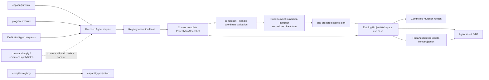
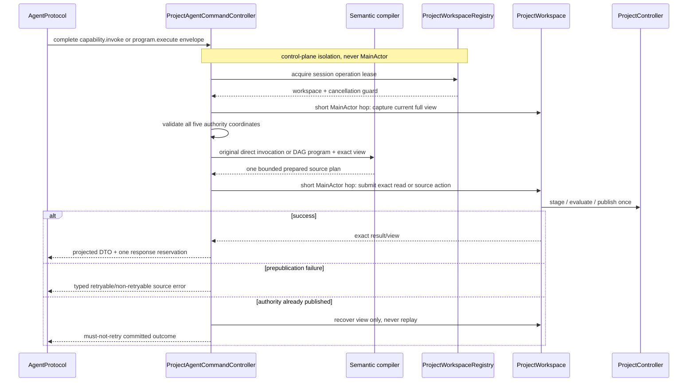

# RupaAgentRuntime Project Geometry Design

## Purpose and Scope

This module owns dispatch from decoded Agent project-geometry requests to the
application-registered `ProjectWorkspace`, including submission of both
CADAPI-D invocation forms through one semantic compiler port and one prepared
source-program path. It is a child of the
[package design](../../DESIGN.md), depends on
[RupaAgentProtocol](../RupaAgentProtocol/DESIGN.md), and uses the
[RupaKit use-case contract](../RupaKit/DESIGN.md). It has no child design.

CADAPI-D is a target contract for the semantic runtime. The Agent boundary has
no universal raw `AutomationCommand` or `AutomationBatch` transport; retained
inspection and parameter operations are dispatched through dedicated typed
requests and method-specific responses. Their internal Automation lowering is
an exhaustive eight-case adapter shared with capability registration and cannot
represent feature-graph construction, an arbitrary command, or a batch.
`RupaAutomation` remains an internal lowering substrate only.

The current implementation marks `ProjectAgentCommandController` and
`ProjectWorkspaceRegistry` globally `@MainActor`; application composition also
marks `ApplicationAgentRequestRouter` globally `@MainActor`. That makes
capability/status and request orchestration contend with viewport work. The
target contract removes those global annotations while retaining explicit,
short calls into the existing MainActor `ProjectWorkspace` owner.

## Responsibilities and Boundaries

Runtime owns control-plane registration leases, one current-view capture,
complete five-coordinate checks, semantic compilation limits, decoding/dispatch
adaptation, construction of in-process RupaKit
requests with the complete immutable `ProjectViewSnapshot`, typed result
projection, error mapping, and committed mutation recovery/no-retry reporting.
For CADAPI-D it forwards either invocation form unchanged to the same
`RupaDomainFoundation` compiler port and submits the one resulting prepared
source plan to the workspace. The Foundation compiler alone normalizes a direct
request, including its explicit schema version and requested output IDs, to a
one-node semantic program. Runtime passes the compiler's requested-output
mapping unchanged to RupaKit result projection. Immutable viewport inspection
asks the existing `ProjectWorkspace` use-case boundary for a bounded projection
of the already-published application viewport, then maps that
transport-neutral value without reevaluation or geometry materialization in
Runtime.

It does not define a second command switch, define CAD operation schemas or
lowerers, allocate persistent source identifiers, create an EditorSession,
execute CAD/Mesh algorithms, import a renderer, prepare arbitrary Make Editable
payloads, write packages, persist files, own HTTP I/O or endpoint state, or
define CAD commands.

## Related Designs

| Design | Relationship | Contract Used | Summary | Cautions |
|---|---|---|---|---|
| [package design](../../DESIGN.md) | parent | module composition | Places runtime above protocol and shared workspace. | Do not add a parallel controller. |
| [AgentProtocol](../RupaAgentProtocol/DESIGN.md) | depends on | typed requests/results | Supplies wire-safe values. | A DTO is never project authority. |
| [RupaDomainFoundation](../RupaDomainFoundation/DESIGN.md) | depends on for CADAPI-D | operation registry and bounded program compiler | Supplies the single semantic program path used by direct and composite CAD invocation. | Runtime dispatches through the contract and does not reimplement validation or ordering. |
| [RupaCADDomain design](../RupaCADDomain/DESIGN.md) | depends on through composition | CAD operation descriptors and lowerers | Supplies the concrete vocabulary registered with the generic compiler. | Runtime consumes the composed registry and never switches on operation IDs. |
| [RupaAutomation](../RupaAutomation/DESIGN.md) | depends on for prepared execution | binding-aware prepared source-plan execution | Executes the compiler result as one staged source mutation. | Raw graph transactions remain internal lowering substrate, never Agent payloads. |
| [RupaProjectAccess](../RupaProjectAccess/DESIGN.md) | used by later composition | session-bound semantic handler | Uses this runtime without acquiring source authority. | Runtime never opens targets or saves packages. |
| [AgentTransport](../RupaAgentTransport/DESIGN.md) | used by | `AgentRequestHandling` | Delivers decoded intent through a transport-neutral port. | No endpoint, credential, or lifecycle callback enters runtime. |
| [RupaKit](../RupaKit/DESIGN.md) | depends on | exact-snapshot Make Editable and Mesh use cases | Performs bounded reads and atomic mutations. | Always pass the captured complete view and lease guard. |
| [RupaGeometry](../RupaGeometry/DESIGN.md) | used transitively through RupaKit | bounded viewport projection | RupaKit performs source-bound geometry inspection. | Runtime does not call Geometry or Mesh APIs directly. |
| [RupaProject](../RupaProject/DESIGN.md) | transitively depends on | project publication/no-retry contract | Owns source and evaluation publication. | Runtime must not replay after committed failure. |
| [system design](../../../DESIGN.md) | system parent | end-to-end workflow and save boundary | Defines integration evidence. | Save/load are invoked only by application-owned test composition. |

## Architecture

## Contracts and Invariants

1. Each request acquires one registry operation lease, captures one current
   view, validates required generation and handle coordinates, and supplies
   that exact view plus lease guard to the RupaKit use case.
2. `capability.invoke` and `program.execute` use the same registered CAD
   operation descriptors, schemas, compiler, and lowerers. Runtime submits the
   original form and does not synthesize a node, choose defaults, resolve a
   version, or maintain a parallel switch or recipe library. The Foundation
   compiler alone validates both explicit semantic schema versions, normalizes
   direct invocation/requested output IDs to a one-node program/output mapping,
   and rejects local references in that form. `agent.capabilities` is the sole
   semantic-operation discovery surface and projects that compiler registry
   losslessly; the legacy universal registry does not duplicate semantic
   operations in a lossy schema.
3. A CAD program is fully decoded, structurally and semantically bounded,
   dependency-checked, deterministically ordered, and lowered before any source
   mutation. Every resolved node must have source route and the aggregate
   effect must be source mutation; reads, workspace mutation, export, lifecycle,
   and external effects are rejected.
4. One accepted CAD program produces one prepared plan and at most one
   `ProjectWorkspace` source action, one `ProjectController` source
   transaction/evaluation/publication, and one undo/history unit. Nodes never
   publish independently.
5. Clients own operation intent, requested declared outputs, and request-local
   symbols only. The staged
   authority allocates persistent identifiers and presentation defaults;
   Runtime projects only compiler-retained requested output bindings and exact
   committed coordinates from the resulting receipt. Unrequested generated
   identities remain telemetry. Dry run may project validation/lowering
   diagnostics but never projects request-local outputs as persistent source
   references.
6. Catalog/page/neighborhood call `ProjectMeshReading`; preview/commit call
   `ProjectMeshEditing`; Make Editable calls the RupaKit exact-snapshot use case.
   Runtime reimplements none of their validation or geometry semantics.
7. Preview never publishes. Commit and Make Editable use one existing project
   source transaction and return their exact postcommit handle/coordinates.
8. Cancellation, stale registration/view, invalid program, limit exhaustion,
   lowering failure, source failure, or evaluation failure before publication
   is a typed failure with no state change. Every failure after publication is
   projected with exact committed coordinates and
   `RetryDisposition.mustNotRetry`; Runtime never replays all or part of a
   program.
9. CAD modeling authority and selection are retained by Make Editable; only the
   explicitly requested presentation selection may switch to the new Authored
   Mesh representation.
10. File create/open/close/save remain outside this route. Runtime cannot infer a
   destination or call `ProjectWorkspace.save`.
11. `ProjectAgentCommandController` conforms only to `AgentRequestHandling`.
   Service status means the reached handler is available and contains no
   transport endpoint state.
12. `project.viewportSnapshot` passes the exact captured view and caller-lowered
   limits to the RupaKit workspace read. That use case resolves navigation and
   performs bounded source-order Geometry inspection, then returns an immutable
   transport-neutral summary. Runtime neither imports source Mesh buffers nor
   constructs a triangulation index.
13. RupaKit owns the hard work ceiling for visible items, cumulative source
   elements, triangles, and immutable summary records. Runtime owns only the
   Protocol reservation for auxiliary records and encoded output bytes.
   Exceeding either owner’s limit fails the whole read without truncation or a
   partial response.
14. Runtime produces only server semantic responses. It does not emit, encode,
    or recover `outcomeUnknown`; authenticated response loss is classified
    client-side by `RupaProjectAccessComposition` after Runtime can no longer
    communicate an outcome.
15. After compilation and before calling the workspace mutation action, Runtime
    asks Protocol for one response reservation from the compiler's
    requested-output mapping and result charge. A failure-only reservation is
    returned as the fixed typed `responsePlanRejected` result without staging.
    Only a full reservation permits Runtime to pass its transport-neutral
    result budget into RupaKit and dispatch once. After publication Runtime
    selects success or the already reserved committed alternative, and the
    listener consumes the reservation with one encode attempt; no oversize
    response is caught and retried as a generic transport failure.
16. Runtime receives an injected `SemanticProgramCompiling` implementation and
    never constructs or falls back to an empty CAD registry. Its standard
    compilation limits are a public immutable Runtime policy sized to the fixed
    100-case CAD workload and remain injectable for boundary tests. The App
    composes the concrete twelve-operation CAD registry and compiler once.
17. Semantic context is derived only from the captured immutable document:
    Feature, source body/sheet role, scene node, component definition,
    component instance, and pattern-array source references. Evaluated
    `BodyID`, Mesh identity, or a second snapshot is never admitted as compiler
    source context.
18. Capability discovery reads the exact immutable registry exposed by the
    injected compiler and deterministically projects every registered semantic
    descriptor. Runtime accepts no second, optional, empty, or copied semantic
    registry, so compilation/discovery divergence is not representable.
19. The Agent runtime never receives `AgentRequest.execute` or
    `executeBatch`, and never emits generic `AgentResponse.command` or
    `batch`. Retained ergonomic routes use one of the eight registered,
    exhaustively typed internal adapters and a method-specific response case;
    they cannot accept an arbitrary Automation command. Legacy raw
    command/batch envelopes are
    rejected at Protocol decode with `command.invalid`; no Runtime handler or
    workspace operation can observe them.
20. `ProjectAgentCommandController` is an immutable `Sendable` control-plane
    service, and `ProjectWorkspaceRegistry` serializes only registration and
    lease state on its own actor. Neither is globally `MainActor`-isolated.
21. Capability/status handling, lease orchestration, semantic compilation,
    immutable result projection, error mapping, and response encoding run on
    control-plane isolation. They require no viewport, CAD, Mesh, package, or
    persistence access.
22. Capturing or validating the current view and submitting an exact read,
    mutation, or save intent is a short explicit suspension into the existing
    owning workspace/application boundary. Runtime revalidates the registration
    operation after every suspension and revalidates the request's five
    coordinates before dispatch and before any nonpublishing return. After a
    successful publication it validates and projects the exact committed
    coordinates instead; a projection or cancellation failure returns that
    committed coordinate with `mustNotRetry`. Runtime never caches a mutable
    workspace view or constructs a duplicate one.
23. `project.viewportSnapshot` calls the existing RupaKit workspace read, which
    owns bounded Geometry traversal. Runtime maps its immutable summary only;
    no CAD, Mesh, Geometry, renderer, package-writer, or persistence dependency
    is reachable from the controller implementation.

## Runtime Flows

## State, Ownership, and Lifecycle

The registry owns workspace registrations and operation leases. Runtime retains
no Mesh source, prepared program beyond one dispatch, local binding after result
projection, package, or alternate view. Persistent IDs are owned by staged
project source, not by the request. Immutable heavy results exist only for one
request projection. Cancellation of the requesting task is forwarded to
detached projection work and checked at program, item, and face boundaries.
Registry invalidation rejects new operations and waits for an already accepted
lease to finish, preserving the existing linearization contract.

`ProjectWorkspaceRegistry` owns its entry table on a control-plane actor. A
lease retains the existing workspace reference plus its cancellation token, not
a copied view. The controller stores immutable dependencies only. The
application router is an immutable `Sendable` branch: ordinary requests remain
on the control plane, while explicit save alone suspends into the MainActor
application lifecycle owner.

## Failure, Concurrency, and Constraints

`ProjectAgentCommandController`, `ProjectWorkspaceRegistry`, and ordinary
`ApplicationAgentRequestRouter` dispatch are not globally MainActor-isolated;
`ProjectController` remains the source actor and `ProjectWorkspace` remains the
UI observation owner. Heavy RupaKit work follows its existing
snapshot/detached-work contract. No registry mutation critical section is held
across a workspace await; the accepted lease is revalidated after the hop.
Viewport output and
work are bounded before materialization; exact results are never silently paged
or truncated. Bounded values are not widened. Error mapping
must preserve stale generation, transaction/publication mismatch, invalid plan,
unknown operation/version, invalid local bindings, dependency cycles, route or
effect mismatch, limit exceeded, cancellation, session loss, and committed
no-retry semantics. Program bytes, values, nodes, edges, references,
expressions, lowered commands, diagnostics, and expanded source/evaluation work
have hard ceilings checked before mutation.

### Control-plane performance acceptance

`frameInterval` and the pinned release baseline are owned by the Rupa App
integration contract. Measurements include authenticated loopback decode,
dispatch, and response encoding, not only direct method calls.

| Measure during an admitted render-plan build | Reject when |
|---|---|
| Capability/status | Any of ten consecutive post-warm-up requests exceeds its idle worst case plus one `frameInterval` or six `frameInterval` values total. |
| Immutable project read | Any of ten consecutive post-warm-up requests exceeds 125% of its idle worst case or two seconds total. |
| Lease cancellation/invalidation | Observable cancellation exceeds six `frameInterval` values after the owning request or registration is invalidated. |

These limits test isolation, not CAD speed. Exact mutation and save retain their
existing operation deadlines because they intentionally enter project or
application authority; render preparation may not add latency beyond the same
relative gates.

## Verification and Change Impact

Behavioral tests must execute all routes through a registered real workspace,
including stale generation/handle, cancellation, read/plan limits, preview
nonpublication, one-commit history, Make Editable authority invariants, and a
postcommit projection failure. CADAPI-D tests must prove direct and program
forms with explicit matching schema versions and requested outputs resolve the
same operation descriptor/lowerer/output mapping, direct invocation has no
local-reference facility, order-independent program nodes compile to a
deterministic DAG order, native finite patterns do not expand into wire-sized
occurrence lists, and one complex program creates at most one source
transaction/evaluation/publication. They must reject mixed effects, cycles,
invalid bindings, stale coordinates, cancellation, and every resource ceiling
without publication, prove unrequested identities are not projected, prove
 Runtime has no outcome-unknown response case, and prove raw graph/Automation
 payloads are absent or rejected. Legacy `command.apply` and
 `command.applyBatch` fixtures must fail before handler invocation, while
 dedicated inspection and parameter requests round-trip with their declared
 read-only, source-mutation, or workspace-mutation effect.
 Response-planning tests must also prove
over-limit result shape fails before workspace staging, exact-limit success
encodes once, and an injected postpublication projection failure uses the
preplanned small committed envelope with exact coordinates and
`mustNotRetry`. Changes require rechecking protocol codecs,
RupaKit exact-view behavior, registry lease lifetime, and the system workflow.
Viewport-read tests additionally compare the response against the same
published viewport, reject stale generation and missing navigation, exercise
non-planar or degenerate face rejection and checked triangle-count projection,
reject aggregate resource-limit excess, observe cooperative cancellation, and
prove that only summary values cross the Agent boundary.

Concurrency tests must additionally prove capability/status requests and an
immutable read complete while a large admitted render plan is preparing,
unregister waits only for its accepted leases, a workspace hop followed by
invalidation is rejected, and explicit save alone reaches the MainActor
application lifecycle. Dependency tests must prove Runtime no longer imports
or calls CAD, Mesh/Geometry, rendering, package-writing, or persistence APIs.
