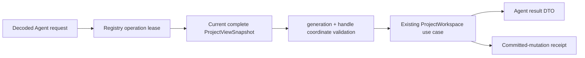
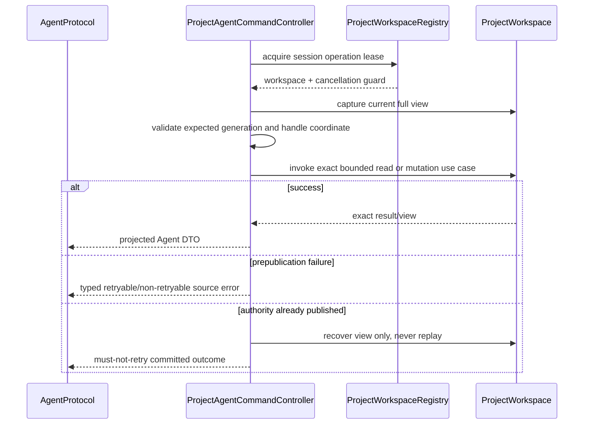

# RupaAgentRuntime Project Geometry Design

## Purpose and Scope

This module owns T10 dispatch from decoded Agent project-geometry requests to
the application-registered `ProjectWorkspace`. It is a child of the
[package design](../../DESIGN.md), depends on
[RupaAgentProtocol](../RupaAgentProtocol/DESIGN.md), and uses the
[RupaKit use-case contract](../RupaKit/DESIGN.md). It has no child design.

## Responsibilities and Boundaries

Runtime owns registration leases, current-view capture, expected-coordinate
checks, construction of in-process RupaKit requests with the complete immutable
`ProjectViewSnapshot`, typed result projection, error mapping, and committed
mutation recovery/no-retry reporting.

It does not create an EditorSession, execute Mesh algorithms, prepare arbitrary
Make Editable payloads, persist files, own socket I/O or endpoint state, or
define CAD commands.

## Related Designs

| Design | Relationship | Contract Used | Summary | Cautions |
|---|---|---|---|---|
| [package design](../../DESIGN.md) | parent | module composition | Places runtime above protocol and shared workspace. | Do not add a parallel controller. |
| [AgentProtocol](../RupaAgentProtocol/DESIGN.md) | depends on | typed requests/results | Supplies wire-safe values. | A DTO is never project authority. |
| [RupaProjectAccess](../RupaProjectAccess/DESIGN.md) | used by later composition | session-bound semantic handler | Uses this runtime without acquiring source authority. | Runtime never opens targets or saves packages. |
| [AgentTransport](../RupaAgentTransport/DESIGN.md) | used by | `AgentRequestHandling` | Delivers decoded intent through a transport-neutral port. | No socket path or lifecycle callback enters runtime. |
| [RupaKit](../RupaKit/DESIGN.md) | depends on | exact-snapshot Make Editable and Mesh use cases | Performs bounded reads and atomic mutations. | Always pass the captured complete view and lease guard. |
| [RupaProject](../RupaProject/DESIGN.md) | transitively depends on | project publication/no-retry contract | Owns source and evaluation publication. | Runtime must not replay after committed failure. |
| [system design](../../../DESIGN.md) | system parent | end-to-end workflow and save boundary | Defines integration evidence. | Save/load are invoked only by application-owned test composition. |

## Architecture

## Contracts and Invariants

1. Each request acquires one registry operation lease, captures one current
   view, validates required generation and handle coordinates, and supplies
   that exact view plus lease guard to the RupaKit use case.
2. Catalog/page/neighborhood call `ProjectMeshReading`; preview/commit call
   `ProjectMeshEditing`; Make Editable calls the RupaKit exact-snapshot use case.
   Runtime reimplements none of their validation or geometry semantics.
3. Preview never publishes. Commit and Make Editable use one existing project
   source transaction and return their exact postcommit handle/coordinates.
4. Cancellation or stale registration/view before publication is a typed
   failure with no state change. Every failure after publication is projected
   through the existing committed-mutation outcome and is never retryable.
5. CAD modeling authority and selection are retained by Make Editable; only the
   explicitly requested presentation selection may switch to the new Authored
   Mesh representation.
6. File create/open/close/save remain outside this route. Runtime cannot infer a
   destination or call `ProjectWorkspace.save`.
7. `ProjectAgentCommandController` conforms only to `AgentRequestHandling`.
   Service status means the reached handler is available and contains no
   transport endpoint state.

## Runtime Flows

## State, Ownership, and Lifecycle

The registry owns workspace registrations and operation leases. Runtime retains
no Mesh source, plan buffer, package, or alternate view. Immutable heavy results
exist only for one request projection. Lease invalidation cancels accepted work
through the existing operation guard.

## Failure, Concurrency, and Constraints

`ProjectAgentCommandController` remains MainActor-isolated while
`ProjectController` is the source actor. Heavy RupaKit work follows its existing
snapshot/detached-work contract. Bounded values are not widened. Error mapping
must preserve stale generation, transaction/publication mismatch, invalid plan,
limit exceeded, cancellation, session loss, and committed no-retry semantics.

## Verification and Change Impact

Behavioral tests must execute all routes through a registered real workspace,
including stale generation/handle, cancellation, read/plan limits, preview
nonpublication, one-commit history, Make Editable authority invariants, and a
postcommit projection failure. Changes require rechecking protocol codecs,
RupaKit exact-view behavior, registry lease lifetime, and the system workflow.
