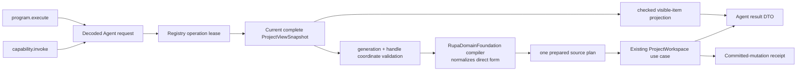
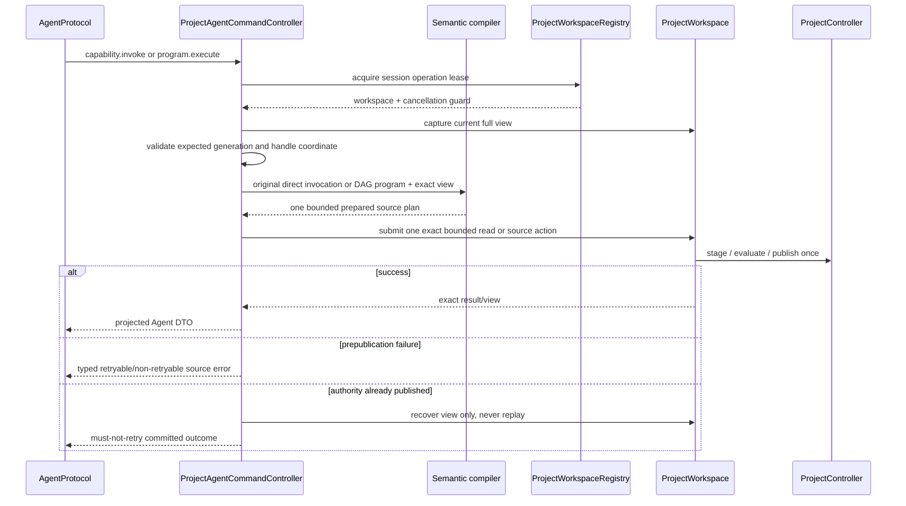

# RupaAgentRuntime Project Geometry Design

## Purpose and Scope

This module owns dispatch from decoded Agent project-geometry requests to the
application-registered `ProjectWorkspace`, including submission of both
CADAPI-D invocation forms through one semantic compiler port and one prepared
source-program path. It is a child of the
[package design](../../DESIGN.md), depends on
[RupaAgentProtocol](../RupaAgentProtocol/DESIGN.md), and uses the
[RupaKit use-case contract](../RupaKit/DESIGN.md). It has no child design.

CADAPI-D is a target contract, not a statement about the current runtime. The
current capability catalog/executor still exposes raw `AutomationCommand` and
`appendFeatureGraph`; removing that legacy path is a required later
implementation gate.

## Responsibilities and Boundaries

Runtime owns registration leases, current-view capture, expected-coordinate
checks, decoding/dispatch adaptation, construction of in-process RupaKit
requests with the complete immutable `ProjectViewSnapshot`, typed result
projection, error mapping, and committed mutation recovery/no-retry reporting.
For CADAPI-D it forwards either invocation form unchanged to the same
`RupaDomainFoundation` compiler port and submits the one resulting prepared
source plan to the workspace. The Foundation compiler alone normalizes a direct
invocation to a one-node semantic program. Immutable viewport
inspection projects the already-published application viewport without
reevaluation or geometry materialization.

It does not define a second command switch, define CAD operation schemas or
lowerers, allocate persistent source identifiers, create an EditorSession,
execute Mesh algorithms, prepare arbitrary Make Editable payloads, persist
files, own HTTP I/O or endpoint state, or define CAD commands.

## Related Designs

| Design | Relationship | Contract Used | Summary | Cautions |
|---|---|---|---|---|
| [package design](../../DESIGN.md) | parent | module composition | Places runtime above protocol and shared workspace. | Do not add a parallel controller. |
| [AgentProtocol](../RupaAgentProtocol/DESIGN.md) | depends on | typed requests/results | Supplies wire-safe values. | A DTO is never project authority. |
| [RupaDomainFoundation](../RupaDomainFoundation/DESIGN.md) | depends on for CADAPI-D | operation registry and bounded program compiler | Supplies the single semantic program path used by direct and composite CAD invocation. | Runtime dispatches through the contract and does not reimplement validation or ordering. |
| [package planned CAD domain boundary](../../DESIGN.md) | depends on through composition; planned module boundary | CAD operation descriptors and lowerers | Supplies the concrete vocabulary registered with the generic compiler. | No `RupaCADDomain` target exists yet; this is not current runtime evidence. |
| [RupaAutomation](../RupaAutomation/DESIGN.md) | depends on for prepared execution | binding-aware prepared source-plan execution | Executes the compiler result as one staged source mutation. | Raw graph transactions remain internal lowering substrate, never Agent payloads. |
| [RupaProjectAccess](../RupaProjectAccess/DESIGN.md) | used by later composition | session-bound semantic handler | Uses this runtime without acquiring source authority. | Runtime never opens targets or saves packages. |
| [AgentTransport](../RupaAgentTransport/DESIGN.md) | used by | `AgentRequestHandling` | Delivers decoded intent through a transport-neutral port. | No endpoint, credential, or lifecycle callback enters runtime. |
| [RupaKit](../RupaKit/DESIGN.md) | depends on | exact-snapshot Make Editable and Mesh use cases | Performs bounded reads and atomic mutations. | Always pass the captured complete view and lease guard. |
| [RupaGeometry](../RupaGeometry/DESIGN.md) | depends on | source-bound triangulation index and budgeted face triangulation | Supplies the same renderability contract used by the viewport render plan. | Triangle topology is counted and discarded; geometry buffers remain process-local. |
| [RupaProject](../RupaProject/DESIGN.md) | transitively depends on | project publication/no-retry contract | Owns source and evaluation publication. | Runtime must not replay after committed failure. |
| [system design](../../../DESIGN.md) | system parent | end-to-end workflow and save boundary | Defines integration evidence. | Save/load are invoked only by application-owned test composition. |

## Architecture

## Contracts and Invariants

1. Each request acquires one registry operation lease, captures one current
   view, validates required generation and handle coordinates, and supplies
   that exact view plus lease guard to the RupaKit use case.
2. `capability.invoke` and `program.execute` use the same registered CAD
   operation descriptors, schemas, compiler, and lowerers. Runtime submits the
   original form and does not synthesize a node, choose defaults, resolve a
   version, or maintain a parallel switch or recipe library. The Foundation
   compiler alone normalizes direct invocation to a one-node program and rejects
   local references in that form.
3. A CAD program is fully decoded, structurally and semantically bounded,
   dependency-checked, deterministically ordered, and lowered before any source
   mutation. Every resolved node must have source route and the aggregate
   effect must be source mutation; reads, workspace mutation, export, lifecycle,
   and external effects are rejected.
4. One accepted CAD program produces one prepared plan and at most one
   `ProjectWorkspace` source action, one `ProjectController` source
   transaction/evaluation/publication, and one undo/history unit. Nodes never
   publish independently.
5. Clients own operation intent and request-local symbols only. The staged
   authority allocates persistent identifiers and presentation defaults;
   Runtime projects typed output bindings and exact committed coordinates from
   the resulting receipt. Dry run may project validation/lowering diagnostics
   but never projects request-local outputs as persistent source references.
6. Catalog/page/neighborhood call `ProjectMeshReading`; preview/commit call
   `ProjectMeshEditing`; Make Editable calls the RupaKit exact-snapshot use case.
   Runtime reimplements none of their validation or geometry semantics.
7. Preview never publishes. Commit and Make Editable use one existing project
   source transaction and return their exact postcommit handle/coordinates.
8. Cancellation, stale registration/view, invalid program, limit exhaustion,
   lowering failure, source failure, or evaluation failure before publication
   is a typed failure with no state change. Every failure after publication is
   projected with exact committed coordinates and
   `RetryDisposition.mustNotRetry`; Runtime never replays all or part of a
   program.
9. CAD modeling authority and selection are retained by Make Editable; only the
   explicitly requested presentation selection may switch to the new Authored
   Mesh representation.
10. File create/open/close/save remain outside this route. Runtime cannot infer a
   destination or call `ProjectWorkspace.save`.
11. `ProjectAgentCommandController` conforms only to `AgentRequestHandling`.
   Service status means the reached handler is available and contains no
   transport endpoint state.
12. `project.viewportSnapshot` reads the exact captured
   `ProjectViewSnapshot.viewport`, resolves every visible occurrence through the
   captured navigation index, builds one source-bound triangulation index per
   item, and uses the same tolerance, standard limits, and source-order face
   triangulation as the viewport render plan. Missing navigation, invalid world
   transforms, non-renderable faces, budget exhaustion, and integer overflow are
   typed failures. Per-face triangle arrays are discarded after their checked
   counts are added; projection never serializes `MeshSource` buffers.
13. Viewport projection applies one runtime-owned hard ceiling before sorting or
   triangulation to visible-item count, cumulative source element work,
   auxiliary diagnostic/telemetry records, and output string bytes. It checks
   the cumulative triangle ceiling while traversing. Exceeding a ceiling fails
   the whole read without truncation or partial output.

## Runtime Flows

## State, Ownership, and Lifecycle

The registry owns workspace registrations and operation leases. Runtime retains
no Mesh source, prepared program beyond one dispatch, local binding after result
projection, package, or alternate view. Persistent IDs are owned by staged
project source, not by the request. Immutable heavy results exist only for one
request projection. Cancellation of the requesting task is forwarded to
detached projection work and checked at program, item, and face boundaries.
Registry invalidation rejects new operations and waits for an already accepted
lease to finish, preserving the existing linearization contract.

## Failure, Concurrency, and Constraints

`ProjectAgentCommandController` remains MainActor-isolated while
`ProjectController` is the source actor. Heavy RupaKit work follows its existing
snapshot/detached-work contract. Viewport output and work are bounded before
materialization; exact results are never silently paged or truncated. Bounded values are not widened. Error mapping
must preserve stale generation, transaction/publication mismatch, invalid plan,
unknown operation/version, invalid local bindings, dependency cycles, route or
effect mismatch, limit exceeded, cancellation, session loss, and committed
no-retry semantics. Program bytes, values, nodes, edges, references,
expressions, lowered commands, diagnostics, and expanded source/evaluation work
have hard ceilings checked before mutation.

## Verification and Change Impact

Behavioral tests must execute all routes through a registered real workspace,
including stale generation/handle, cancellation, read/plan limits, preview
nonpublication, one-commit history, Make Editable authority invariants, and a
postcommit projection failure. CADAPI-D tests must prove direct and program
forms resolve the same operation descriptor/lowerer, direct invocation has no
local-reference facility, order-independent program nodes compile to a
deterministic DAG order, native finite patterns do not expand into wire-sized
occurrence lists, and one complex program creates at most one source
transaction/evaluation/publication. They must reject mixed effects, cycles,
invalid bindings, stale coordinates, cancellation, and every resource ceiling
without publication, and prove raw graph/Automation payloads are absent or
rejected. Changes require rechecking protocol codecs,
RupaKit exact-view behavior, registry lease lifetime, and the system workflow.
Viewport-read tests additionally compare the response against the same
published viewport, reject stale generation and missing navigation, exercise
non-planar or degenerate face rejection and checked triangle-count projection,
reject aggregate resource-limit excess, observe cooperative cancellation, and
prove that only summary values cross the Agent boundary.
