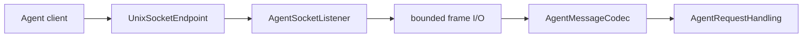

# RupaAgentTransport

## Purpose and Scope

`RupaAgentTransport` carries typed `RupaAgentProtocol` messages across a local
Unix domain socket. It is a child of the [RupaKit package design](../../DESIGN.md)
and has no child designs. ACCESS-A separates this transport from project-access
semantics; endpoint composition and peer enforcement are completed by ACCESS-C.

## Responsibilities and Boundaries

The module owns socket framing, connection lifecycle, bounded I/O, an injected
Unix endpoint value, and the peer-authorization contract. It does not own
project targets, sessions, `ProjectWorkspace`, `ProjectController`, package
bytes, App Group identifiers, application launch policy, or command meaning.

`AgentRequestHandling` is the only semantic dependency of the listener and
service. The handler never receives the socket path and semantic status never
publishes it.

## Related Designs

| Design | Relationship | Contract Used | Summary | Cautions |
|---|---|---|---|---|
| [package design](../../DESIGN.md) | parent | dependency direction | Places transport below runtime/UI composition. | Do not depend on Project or RupaKit authority. |
| [RupaAgentProtocol](../RupaAgentProtocol/DESIGN.md) | depends on | request/response codec and handler port | Supplies semantic values. | Transport failure is not a semantic success. |
| [RupaProjectAccess](../RupaProjectAccess/DESIGN.md) | coordinates with | live adapter boundary | A later live adapter uses this transport. | Project access never edits socket files itself. |
| [RupaAgentRuntime](../RupaAgentRuntime/DESIGN.md) | used by | request handler | Runtime handles decoded intent only. | Socket state must not flow into runtime. |

## Architecture

## Contracts and Invariants

1. The endpoint is an injected file URL; semantic protocol and status values
   contain no path.
2. The listener depends only on `AgentRequestHandling`, not a socket-aware
   subtype.
3. A peer must satisfy `AgentPeerAuthorizing` before request decoding once the
   ACCESS-C implementation binds the contract.
4. The existing 16 MiB frame and 32-connection ceilings remain transport
   correctness limits.
5. Transport loss after dispatch is not retried as another access mode.

## Runtime Flows

The listener accepts a bounded connection, authorizes the peer, reads one
bounded frame, decodes one request, invokes one handler, writes one response,
and releases the connection. ACCESS-A defines the endpoint and authorization
ports; ACCESS-C supplies permissions, same-UID enforcement, and composition.

## State, Ownership, and Lifecycle

The listener actor owns descriptors, accept task, and active-connection tasks.
The endpoint owner is product composition. Stopping closes descriptors and
removes only the injected socket file; it does not close a project session.

## Failure, Concurrency, and Constraints

Socket, framing, deadline, cancellation, and peer failures remain typed and do
not reach the semantic handler as fabricated requests. Actor isolation owns
listener state; no socket path is stored in the handler.

## Verification and Change Impact

Transport tests cover request round trips, stale socket replacement, malformed
and oversized frames, concurrent/half-open connections, bounded stop, endpoint
validation, and peer-authorizer invocation. ACCESS-C must add permission and
same-UID behavioral tests before the peer contract is production-complete.
