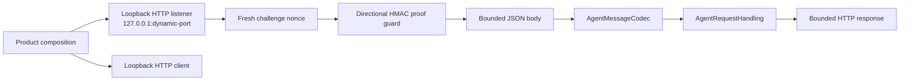
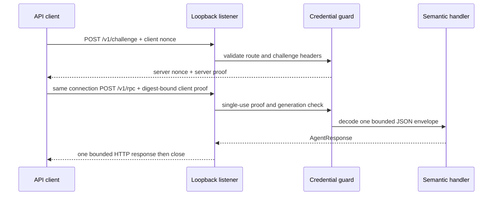

# RupaAgentTransport

## Purpose and Scope

`RupaAgentTransport` is the bounded HTTP adapter for the semantic Agent
request contract. It is a child of the [RupaKit package design](../../DESIGN.md)
and is used by the App host and the project-access client. Children: none.

## Responsibilities and Boundaries

The module owns:

- a loopback-only TCP listener with dynamic port allocation;
- one challenge-plus-RPC exchange on one TCP connection;
- bounded HTTP header/body parsing and response writing;
- directional HMAC proof verification before JSON decoding;
- monotonic deadlines, cancellation, connection admission, and drain;
- a client that sends the existing `AgentRequestEnvelope` and decodes the
  existing `AgentResponseEnvelope`.

It does not own Keychain discovery, application lifecycle, project sessions,
`ProjectWorkspace`, `ProjectController`, package bytes, or CLI syntax. The
semantic handler receives a decoded `AgentRequest` only.

## Related Designs

| Design | Relationship | Contract Used | Summary | Cautions |
|---|---|---|---|---|
| [RupaKit package](../../DESIGN.md) | parent | dependency direction | Places transport below runtime and access composition. | No project authority may be added here. |
| [RupaAgentProtocol](../RupaAgentProtocol/DESIGN.md) | depends on | request/response envelopes and handler port | Supplies semantic values and JSON coding. | HTTP failures never become semantic success. |
| [RupaProjectAccess](../RupaProjectAccess/DESIGN.md) | used by | transport-neutral session boundary | Carries API calls through this adapter. | Access owns target and session semantics. |
| [RupaAgentRuntime](../RupaAgentRuntime/DESIGN.md) | used by | `AgentRequestHandling` | Executes decoded intent against the registered workspace. | Runtime never learns the listener address or credential. |

## Architecture

## Contracts and Invariants

1. The listener binds only `127.0.0.1` and asks the kernel for a dynamic
   port. The bound port is returned only after the listener is ready.
2. The only accepted routes are `POST /v1/challenge` followed by
   `POST /v1/rpc` on the same TCP connection. The method, path, content type,
   required `Content-Length`, and bounded header section are validated before
   the corresponding body is decoded. A reconnect is never used to continue
   a challenge or dispatch a request.
3. The body and response are at most 16 MiB. `Content-Length` is required,
   finite, and bounded; chunked transfer and ambiguous framing are rejected.
4. The challenge endpoint returns a fresh server nonce and generation/port-
   bound server proof. The client sends no semantic body until that proof is
   verified. The RPC request carries a fresh client proof. The HMAC transcript
   is length-delimited and domain-separated by protocol version: the challenge
   proof binds `clientNonce`, `serverNonce`, `generation`, `port`, `version`,
   and `requestID`; the client proof additionally binds the SHA-256
   `bodyDigest`; the response proof additionally binds the HTTP `status` and
   SHA-256 `responseDigest`. All proofs are compared in constant time before
   JSON decoding or semantic dispatch.
5. Each challenge is single-use and expires under the connection deadline.
   A repeated challenge or RPC is rejected by the per-connection state machine
   and the connection is closed; stale generations, wrong ports, malformed
   proofs, and response proofs are typed failures. The HMAC key is never sent
   on the wire.
6. A connection owns one challenge state and admits exactly one semantic RPC
   request/response on that same connection. A second challenge or RPC is
   rejected, and the connection is closed after the exchange. The listener
   admits at most 32 active exchanges and drains accepted work within its
   shutdown budget. A connection remains tracked until its task actually exits,
   even when shutdown has already closed its descriptor.
7. One monotonic deadline covers connect, challenge, header/body I/O, semantic
   dispatch, and response write. The transport races semantic dispatch against
   that deadline, cancels the handler task at deadline or shutdown, and never
   publishes a late transport response. Production semantic handlers must honor
   task cancellation before publishing project state; the transport does not
   claim that it can forcibly terminate arbitrary non-cooperative handler code.
   Cancellation closes owned descriptors and no request is retried after a
   response-loss or dispatch-uncertain failure.
8. A complete request write followed by response loss is
   `outcomeUnknown(requestID:)`; failure before the complete write is
   `notDispatched`.
9. The listener never resolves discovery records and never persists project
   data. The client accepts an injected endpoint and HMAC key for tests and
   alternate API compositions; the key is never serialized into an HTTP
   request or response.

## Runtime Flows

## State, Ownership, and Lifecycle

The listener actor owns its TCP descriptors, accept task, and active
connection tasks. `start()` creates the dynamic listener and returns its
port; `stop()` rejects new connections, drains accepted work, and closes all
owned descriptors. Blocking POSIX reads and writes run on dedicated threads so
up to 32 admitted connections cannot starve Swift's cooperative executor. The
App owns the listener lifetime and publishes discovery only after `start()`
succeeds.

## Failure, Concurrency, and Constraints

Malformed headers, missing framing, oversized input, invalid credentials,
wrong route, deadline exhaustion, cancellation, connection saturation, and
listener errors remain typed transport failures. No fallback transport is
selected. Actor isolation protects listener state and no external callback is
run while a transport lock is held.

## Verification and Change Impact

Focused transport tests prove loopback binding, dynamic-port readiness,
challenge freshness/expiry/replay rejection, directional proof validation,
complete transcript binding (nonces, generation, port, version, request ID,
request/response digests, and response status), header/body limits, required
framing, proof rejection before decode, same-connection state-machine
enforcement without reconnect, 32-connection admission,
deadline/cancellation, shutdown drain, response-loss classification, and
exact request/response round trips. Changes require rechecking the App host
lifecycle, Keychain record publication, and project-access client deadline
contract.
