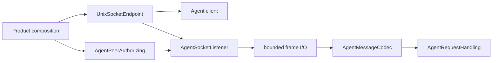

# RupaAgentTransport

## Purpose and Scope

`RupaAgentTransport` carries typed `RupaAgentProtocol` messages across a local
Unix domain socket. It is a child of the [RupaKit package design](../../DESIGN.md)
and has no child designs. ACCESS-A separates this transport from project-access
semantics; ACCESS-C.1 completes endpoint injection, peer enforcement, and
bounded request lifetime inside this module.

## Responsibilities and Boundaries

The module owns socket framing, connection lifecycle, bounded I/O, an injected
Unix endpoint value, peer identity extraction, and the peer-authorization
contract. It does not own
project targets, sessions, `ProjectWorkspace`, `ProjectController`, package
bytes, App Group identifiers, application launch policy, or command meaning.

`AgentRequestHandling` is the only semantic dependency of the listener and
service. The handler never receives the socket path and semantic status never
publishes it.

## Related Designs

| Design | Relationship | Contract Used | Summary | Cautions |
|---|---|---|---|---|
| [package design](../../DESIGN.md) | parent | dependency direction | Places transport below runtime/UI composition. | Do not depend on Project or RupaKit authority. |
| [RupaAgentProtocol](../RupaAgentProtocol/DESIGN.md) | depends on | request/response codec and handler port | Supplies semantic values. | Transport failure is not a semantic success. |
| [RupaProjectAccess](../RupaProjectAccess/DESIGN.md) | coordinates with | live adapter boundary | A later live adapter uses this transport. | Project access never edits socket files itself. |
| [RupaAgentRuntime](../RupaAgentRuntime/DESIGN.md) | used by | request handler | Runtime handles decoded intent only. | Socket state must not flow into runtime. |

## Architecture

## Contracts and Invariants

1. Every client and listener construction requires an injected
   `UnixSocketEndpoint`. This module has no product endpoint resolver, default
   path, App Group identifier, or temporary-directory fallback; semantic
   protocol and status values contain no path.
2. The listener depends only on `AgentRequestHandling`, not a socket-aware
   subtype.
3. The listener extracts the accepted Unix peer UID and calls its injected
   `AgentPeerAuthorizing` before reading or decoding a frame. The production
   same-user authorizer rejects every UID except its injected expected UID.
4. The existing 16 MiB frame and 32-connection ceilings remain transport
   correctness limits.
5. One monotonic deadline created at the start of a client request bounds
   connect, all connection retries, request write, and response read. Each
   accepted server connection likewise uses one deadline for its frame read and
   response write. A phase never resets the deadline. Live composition may pass
   its existing absolute `ContinuousClock.Instant`; transport does not derive a
   fresh relative timeout from it.
6. Accepted connections use asynchronous nonblocking readiness waits; an idle
   connection never occupies a cooperative-executor thread. Cancellation closes
   the owned descriptor and interrupts bounded polling.
   Listener stop rejects new connections, cancels accepted work, closes its
   descriptors, and returns within its shutdown budget even if a semantic
   handler does not cooperate.
7. Transport loss after dispatch is not retried as another access mode.
8. `AgentTransportFailure` distinguishes `.notDispatched` from
   `.outcomeUnknown(requestID:)`. The latter is emitted only after the complete
   request frame was written and any response read/decode subsequently failed,
   so live composition never guesses dispatch state from an `EditorError`.

## Runtime Flows

The listener accepts a bounded connection, extracts and authorizes the peer,
reads one bounded frame, decodes one request, invokes one handler, writes one
response under the same connection deadline, and releases the connection. A
rejected peer reaches neither frame decoding nor the semantic handler.

## State, Ownership, and Lifecycle

The listener actor owns descriptors, accept task, and active-connection tasks.
The endpoint owner is product composition. Start creates or verifies the
endpoint directory as owner-only mode `0700`, binds the socket, and applies mode
`0600` before accepting peers. Stopping closes descriptors and removes only the
injected socket file; it does not close a project session.

## Failure, Concurrency, and Constraints

Socket, framing, deadline, cancellation, permission, and peer failures remain
typed and do not reach the semantic handler as fabricated requests. Actor
isolation owns listener state; no socket path is stored in the handler. The
connection ceiling must remain reachable without executor starvation: thirty-two
idle authorized peers can coexist while the listener actor still rejects the
thirty-third peer and can execute `stop()`.

## Verification and Change Impact

Transport tests cover request round trips, stale socket replacement, malformed
and oversized frames, the 16-MiB boundary, the 32-connection ceiling,
concurrent/half-open connections, one-deadline timeout, cancellation, bounded
stop, endpoint validation, exact directory/socket permissions, and rejection
before decode. Client, listener, host, and production-source scans reject a
default path, legacy endpoint-compatibility owner, explicit override resolver,
or duplicated endpoint placement.
