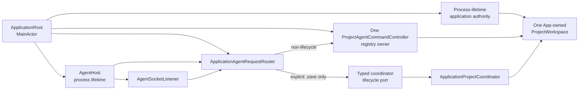
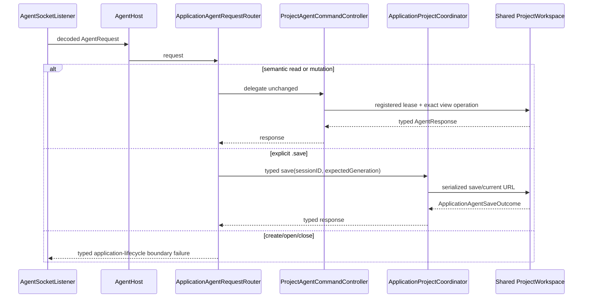

# RupaAgentUI Agent Host

## Purpose and Scope

`RupaAgentUI` owns the application-facing Agent host: listener lifecycle and
transport-handler injection. It is a child of the
[RupaKit package design](../../DESIGN.md) and has no child designs.

The host is a transport/application composition boundary, not a project or
package authority. ACCESS-O.4 fixes the target composition described here;
ACCESS-O.6 will replace the current private-controller and scene-phase wiring
with the injected process-lifetime composition.

## Responsibilities and Boundaries

The module owns:

- `AgentHost` availability state and listener start/stop lifecycle;
- injection of one transport-neutral `AgentRequestHandling` implementation
  into the socket listener;
- bounded transport startup/shutdown and typed listener failures.

It does not own:

- CAD/Mesh source semantics, `EditorSession`, or project publication;
- package encoding, destination URLs, security-scoped access, or save policy;
- application authority acquisition, window/UI state, or scene visibility;
- workspace registration, registry/path ownership, or session resolution;
- Agent protocol schema, socket framing, or a second workspace/controller
  authority.

The application composes one `ProjectAgentCommandController` and one
`ApplicationAgentRequestRouter` for the process. The controller owns the
registry and registers the exact App-owned workspace. The host receives the
router as its request handler; it must not construct a shadow controller or
workspace.

## Related Designs

| Design | Relationship | Contract Used | Summary | Cautions |
|---|---|---|---|---|
| [RupaKit package](../../DESIGN.md) | parent | module graph and authority direction | Places the host above Runtime and beside application composition. | Host lifecycle does not become project lifecycle. |
| [Rupa App](../../../Rupa/Rupa/Rupa/DESIGN.md) | used by | process authority, workspace composition, and lifecycle ports | Constructs the controller, router, workspace, and host in one application. | Acquire the application lease before composing any of them. |
| [RupaAgentRuntime](../RupaAgentRuntime/DESIGN.md) | depends on | registered-workspace request handling | Supplies `ProjectAgentCommandController` for non-lifecycle requests. | Runtime cannot open, close, or save a file. |
| [RupaAgentTransport](../RupaAgentTransport/DESIGN.md) | depends on | listener, bounded framing, injected handler | Carries decoded requests to the router. | Socket path and endpoint status never enter semantic results. |
| [RupaProject](../RupaProject/DESIGN.md) | transitively uses | `ProjectWorkspace` and publication/no-retry | Receives semantic operations through the existing project authority. | No direct `ProjectController` access from transport. |
| [RupaProjectPackage](../RupaProjectPackage/DESIGN.md) | transitively coordinates | staged package save and atomic destination replacement | Saves only through the application coordinator and workspace. | The host cannot edit package entries or choose a destination. |
| [RupaProjectAccess](../RupaProjectAccess/DESIGN.md) | coordinates with | transport-neutral target/session values | Provides future access adapters without changing host authority. | Access sessions do not own the live App workspace. |
| [Agent host tests](../../Tests/RupaUIPackageTests/AgentHostTests.swift) | verification owner | listener state and handler injection | Exercises host lifecycle with injected handlers and listeners. | Application tests own exact controller/workspace registration evidence. |

## Architecture



The `ApplicationAgentRequestRouter` is application-composed and may live in
the App target. It is shown here because the host's handler boundary depends
on its routing contract. The router delegates every semantic request to the
single controller without reimplementing Runtime's switch. It recognizes
application lifecycle only to route the explicit `.save` request to a typed
coordinator port; create/open/close remain application-owned and are not
silently redirected.

## Contracts and Invariants

1. The application acquires its process-wide authority lease before creating
   the workspace, controller, router, or host. A failed lease acquisition
   creates none of those competing owners.
2. Exactly one application-composed `ProjectAgentCommandController` owns the
   registry used by the host. It registers the exact `ProjectWorkspace` used by
   UI and `ApplicationProjectCoordinator`; no request can create a shadow
   workspace, session, or controller.
3. `ApplicationAgentRequestRouter` delegates all non-lifecycle requests to the
   controller unchanged. It sends only an explicit `.save(sessionID,
   expectedGeneration)` through the typed coordinator lifecycle port, under the
   application's operation sequencer and current URL policy. It never calls a
   package codec or workspace save directly.
4. Save success is returned only after the coordinator/workspace/package path
   completes destination-appropriate staging, full prepublication validation,
   and one atomic replacement. Destination and current in-memory state remain
   unchanged for prepublication failure. Failure to remove the now-empty
   staging directory after replacement is a typed success warning, not a
   retryable save failure.
5. The typed coordinator lifecycle port returns
   `ApplicationAgentSaveOutcome`: `.saved(SaveResult)` after a normal save or
   `.committed(AgentCommittedMutationOutcome)` when package replacement and
   clean-state publication committed but save-result view projection failed.
   The committed receipt uses `Mutation.save`, `Stage.viewProjection`, exact
   coordinates from `ProjectWorkspacePersistencePublicationError.state`, and
   `mustNotRetry`, whether or not best-effort view recovery succeeds. It never
   reports an ambiguous ordinary failure that invites save replay.
6. `AgentHost` starts once for the process lifetime after registration and
   remains available across active, inactive, and background scene phases. It
   stops only during process shutdown or an explicit application teardown path;
   scene visibility is not host ownership.
7. Listener, router, controller, workspace, and coordinator are MainActor
   composed where their concrete contracts require it. Transport I/O remains
   bounded and asynchronous, and no socket connection owns document lifetime.
8. Host failures are typed and observable. They do not fall back to a closed
   package, a second process, a second registry, or direct file mutation.

## Runtime Flows

### Process startup and registration

```text
ApplicationRoot
  -> acquire process-lifetime ApplicationAuthorityLease
  -> create one ProjectWorkspace and ProjectController
  -> create ApplicationProjectCoordinator with a typed save/lifecycle port
  -> create one ProjectAgentCommandController over the shared registry
  -> register the exact workspace and current path
  -> create ApplicationAgentRequestRouter(controller, coordinator port)
  -> inject router into AgentHost and start listener once
```

The initial URL is loaded through the coordinator before the workspace path is
published to the registration. Failed load or registration leaves the previous
application state unbound and visible as a typed startup failure.

### Request routing



### Shutdown

The application stops accepting new host requests, drains accepted listener
work, unregisters the workspace after registry leases finish, stops the
listener, releases security-scoped access and current URL state through the
coordinator, and finally releases the application authority lease. No scene
transition alone performs this sequence.

## State, Ownership, and Lifecycle

`AgentHost` owns listener state for the lifetime of the application process.
The application owns the host instance, controller/router composition, current
URL, workspace, and coordinator. `ProjectAgentCommandController` owns registry
entries and operation leases; `ProjectController` owns source/publication state;
the package store owns one synchronous staging invocation. A transport
connection owns only its bounded I/O and request task.

The host retains no package bytes, EditorSession, Mesh buffer, CAD source, or
view snapshot beyond the request boundary. Registration path updates are
performed only after the coordinator has published the corresponding URL/load
result, so a failed replacement never rebinds Agent state to an uncommitted
destination.

## Failure, Concurrency, and Constraints

Application authority conflict, missing workspace registration, stale session
or generation, invalid request, listener/socket failure, coordinator save
failure, package integrity/limit failure, cancellation, and committed
projection failure are typed. The router does not retry or select another
workspace. Prepublication failures preserve coordinates, view, URL, bytes, and
registration; postpublication failures preserve the exact commit and return
no-retry coordinates.

The host's process lifetime is independent of SwiftUI scenePhase. The single
application operation sequencer serializes UI/file lifecycle and explicit Agent
save. Runtime semantic requests continue to use registry operation leases and
the existing workspace/project actor boundaries. No blocking I/O occurs under a
critical section, and no mutable host state crosses an actor boundary without
its existing MainActor/transport contract.

## Verification and Change Impact

`AgentHostTests` and application tests must exercise the actual composition
boundary, not only enum state:

- lease conflict before workspace/controller/host/listener creation;
- one controller registering the exact workspace observed by UI and coordinator;
- semantic requests delegated through router to controller with unchanged typed
  results and stale-coordinate failures;
- explicit Agent save routed through coordinator/current URL/workspace, with no
  UI action, direct package edit, retry, or fallback;
- prepublication staging/write/validation failure preserving destination bytes,
  absent destination, current view, URL, coordinates, and registration;
- committed save/result projection failure returning an authoritative
  must-not-retry receipt;
- host availability across inactive/background scene phases and shutdown drain;
- real listener request/response, registration cleanup, and socket failure.

Changes to `AgentHost`, `AgentRequestHandling`, registry leases, coordinator
save ports, or package replacement sequencing require rechecking the [Rupa App
design](../../../Rupa/Rupa/Rupa/DESIGN.md), [RupaAgentRuntime
design](../RupaAgentRuntime/DESIGN.md), and [RupaProjectPackage
design](../RupaProjectPackage/DESIGN.md). O.4 is design-only; O.6 owns the
source composition and O.7 owns the integrated signed-App evidence.
