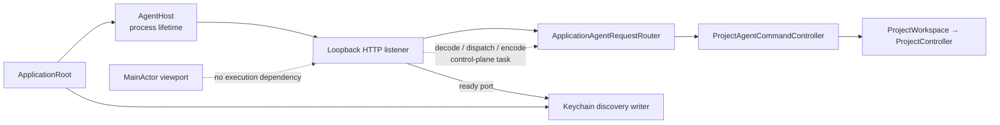
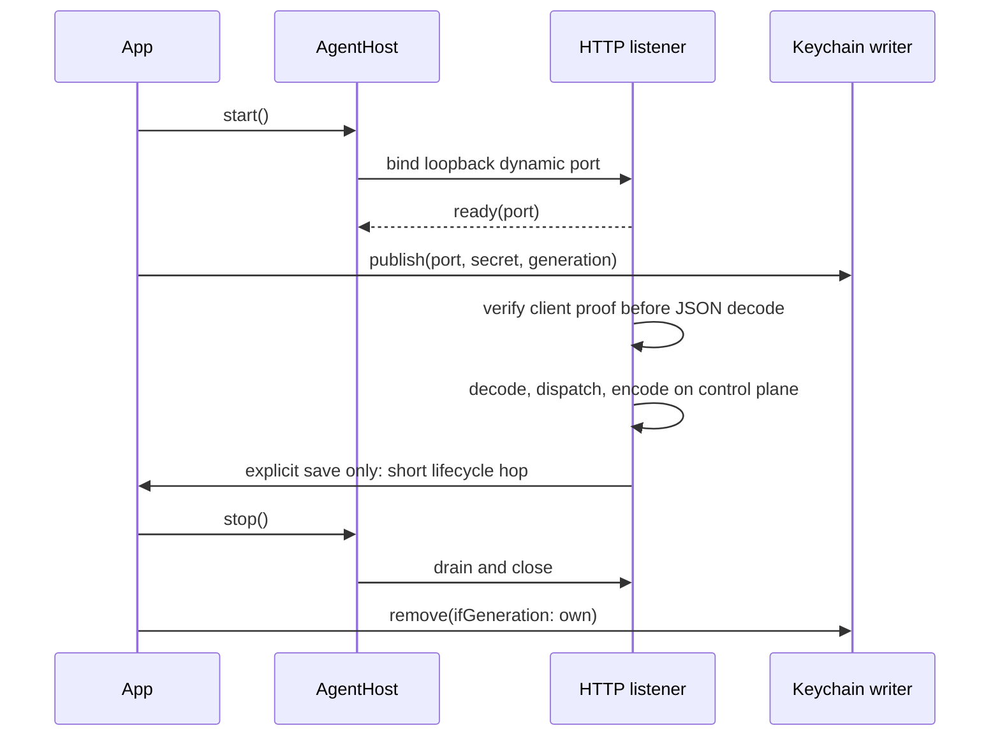

# RupaAgentUI

## Purpose and Scope

`RupaAgentUI` owns the application-facing Agent host. It is a child of the
[RupaKit package design](../../DESIGN.md) and has no child designs.

The host keeps an HTTP listener alive for the App process and injects one
semantic request handler. It is not a project or package authority.

The current host lifecycle object is `@MainActor`, which is acceptable only for
its small observable start/stop state. Accepted HTTP requests already belong to
the listener; the target contract makes explicit that their decode, handler
dispatch, and response encoding never re-enter the host's MainActor isolation.

## Responsibilities and Boundaries

The module owns `AgentHost` state and listener start/stop lifecycle. It accepts
an application-composed `AgentRequestHandling` value and a listener factory.
It does not own request execution, Keychain storage, CLI parsing, project
persistence, CAD/Mesh/rendering semantics, session resolution, or a second
workspace/controller.

## Related Designs

| Design | Relationship | Contract Used | Summary | Cautions |
|---|---|---|---|---|
| [RupaKit package](../../DESIGN.md) | parent | module graph and single authority | Places the host above runtime and below App composition. | Host lifecycle is process-scoped. |
| [Rupa App](../../../Rupa/Rupa/Rupa/DESIGN.md) | used by | handler, listener, and discovery composition | Builds one host over the App workspace. | Start before window restoration and publish only after readiness. |
| [RupaAgentRuntime](../RupaAgentRuntime/DESIGN.md) | depends on | registered-workspace request handling | Supplies the semantic handler. | Runtime never binds or discovers an endpoint. |
| [RupaAgentTransport](../RupaAgentTransport/DESIGN.md) | depends on | loopback HTTP listener | Enforces framing and mutual authentication. | The host does not inspect HTTP fields. |
| [RupaProjectAccessPlatform](../RupaProjectAccessPlatform/DESIGN.md) | coordinates with | discovery record writer | App composition publishes the ready listener record. | Host cannot publish or remove records itself. |

## Architecture

## Contracts and Invariants

1. The host starts independently of window and scene restoration and remains
   available through active, inactive, and background phases.
2. Listener readiness returns a dynamic loopback port. App composition writes
   the port, per-launch HMAC key, and generation only after readiness; the key
   is never sent over the API connection.
3. The host delegates each complete decoded request envelope unchanged to one
   handler. It never creates a workspace, registry, controller, or package
   writer.
4. The App injects one Protocol encoding-limit value into both Runtime and
   host. The listener validates that value against its 16-MiB body ceiling and
   uses it for decode and planned response encoding. It also enforces 32
   connections, bounded headers, required Content-Length, one same-connection
   challenge/RPC exchange, and one deadline. It rejects a second challenge or
   RPC on that connection.
5. HTTP mutual authentication uses a request nonce and directional HMAC
   proofs derived from the Keychain secret. The raw secret is never sent.
6. Stop drains accepted requests, then App composition conditionally removes
   only its own discovery generation. A response-loss result is not retried.
7. Listener accept, authentication, decode, ordinary handler dispatch, and
   response encoding execute on transport/control-plane isolation. They do not
   depend on `AgentHost`, SwiftUI, Canvas, or render-plan MainActor progress.
8. `ApplicationAgentRequestRouter` is an immutable `Sendable` adapter. Ordinary
   requests delegate directly to Runtime; only explicit save suspends into the
   App's existing MainActor lifecycle owner.

## Runtime Flows

## State, Ownership, and Lifecycle

`AgentHost` owns only listener lifecycle state and may publish that small state
on MainActor. The listener owns accepted connection tasks. The App owns the
listener secret/generation and discovery record lifecycle; Runtime owns registered
workspace state; the project layer owns source and package state.

## Failure, Concurrency, and Constraints

Startup, authentication, framing, deadline, cancellation, capacity, handler,
and shutdown failures are typed and observable. No failure selects another
transport or local project authority. Slow or cancelled render-plan preparation
cannot delay listener accept, capability/status dispatch, or response encoding;
only an explicitly requested workspace/save operation may wait for its owning
authority.

## Verification and Change Impact

Host tests prove listener readiness, handler injection, authenticated routing,
bounded drain, terminal listener lifetime, no MainActor dependency in accepted
request execution, and no workspace duplication. A concurrency probe prepares
a large admitted render plan while capability/status and immutable read
requests complete. App tests own process-lifetime startup, discovery publication
and conditional generation removal, and the complete same-workspace evidence.
