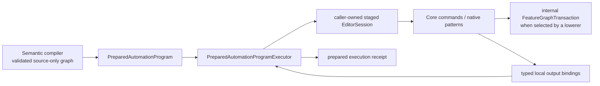
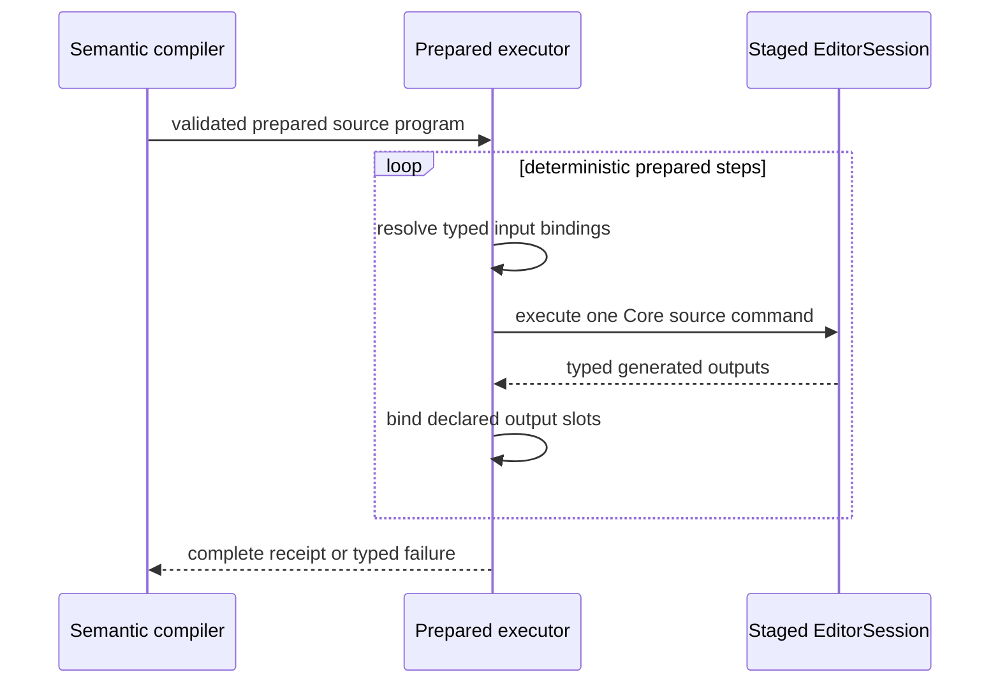

# RupaAutomation Prepared Source Execution

## Purpose and Scope

`RupaAutomation` owns domain-neutral execution of already resolved source
operations inside a caller-owned staged `EditorSession`. It is a child of the
[RupaKit package design](../../DESIGN.md) and depends on `RupaCore` and
`RupaCoreTypes`.

CADAPI-D extends this existing module with a binding-aware prepared-plan
contract. This document defines the target contract; the current
`AutomationBatch` and `AutomationRunner` do not yet provide all typed local
output bindings described here.

Parent: [package design](../../DESIGN.md). Children: none.

## Responsibilities and Boundaries

This module owns:

- sequential execution of a validated prepared source plan in one isolated
  staged session;
- typed output slots that bind one step's generated Core identities for later
  prepared steps;
- aggregation of generated identities, diagnostics, and execution telemetry;
- one domain-neutral internal path for Core commands, including native pattern
  commands and an internally generated `FeatureGraphTransaction` when that is
  the appropriate atomic lowering substrate.

It does not own semantic CAD operation names, input schemas, program graph
validation, project coordinates, workspace publication, package persistence,
transport DTOs, CLI syntax, or persistent-ID policy. It never accepts raw
feature graphs from an external Agent boundary.

## Related Designs

| Design | Relationship | Contract Used | Summary | Cautions |
|---|---|---|---|---|
| [package design](../../DESIGN.md) | parent | dependency direction and CADAPI-D boundary | Places prepared execution below semantic compilation and project publication. | The current public raw route is an implementation gap, not this target contract. |
| [RupaDomainFoundation](../RupaDomainFoundation/DESIGN.md) | used by | compiled semantic program to prepared source-plan contract | Resolves one shared operation vocabulary into this module's domain-neutral steps. | Automation must not import or duplicate the semantic registry. |
| [RupaCore](../RupaCore/DESIGN.md) | depends on | `EditorSession`, Core commands, feature-graph transaction, and validation | Supplies the only mutable source staging substrate used here. | No source value may escape as an independently published authority. |
| [RupaProject](../RupaProject/DESIGN.md) | used transitively by | staged transaction and final publication | Owns evaluation, history, package reconstruction, and publication. | Automation execution success alone is not project commit success. |
| [RupaKit integration](../RupaKit/DESIGN.md) | used by | one prepared-program workspace action | Adapts the prepared plan to the exact current project view. | It must not execute nodes as separate workspace mutations. |

## Architecture

The exact public type names may be refined during implementation, but the
ownership and behavior above are fixed. The execution input is prepared and
source-only; it is not a second semantic operation model.

## Contracts and Invariants

1. A prepared program contains deterministic ordered steps, typed input-slot
   references, declared output slots, and preflight telemetry. It contains no
   unvalidated wire payload or unresolved semantic operation.
2. Each output slot has one declared Core identity kind. A later step may
   consume it only at a matching input kind. Missing, duplicate, or mismatched
   bindings fail before that step mutates staged source.
3. Persistent Feature, Body, Scene, Component, Instance, and Pattern IDs are
   allocated by Rupa while the isolated source transaction is staged. External
   request-local symbols never become persistent IDs.
4. The executor applies the complete plan to the caller-owned staged session.
   It does not commit history, evaluate, publish, save, or open a project.
5. A native finite pattern lowers to one Core pattern command and retains its
   parameter-following source representation. The executor does not expand it
   into one copied feature or occurrence command per instance.
6. `FeatureGraphTransaction` and `appendFeatureGraph` may remain internal atomic
   implementation tools. They must not appear in Agent capability discovery,
   wire DTOs, CLI syntax, or public semantic operation descriptors.
7. Execution order is the deterministic topological order selected by the
   semantic compiler. The executor never infers a different dependency graph.
8. Cancellation and any command, binding, or Core validation failure abort the
   staged execution. Nothing in this module publishes a partial result.
9. The receipt contains every declared local-output binding, generated identity
   kind, diagnostics, and measured step/source-expansion work required for the
   upper layer to project the committed result. It contains no mutable session.
10. Current `AutomationBatch` behavior remains legacy compatibility inventory
    until a later source task implements this contract and removes external raw
    graph entry points. This design does not claim that cutover is complete.

## Runtime Flows

The loop is an internal traversal of a finite prevalidated graph. It is not a
user-programmable loop and cannot grow beyond the compiler's accepted work
budget.

## State, Ownership, and Lifecycle

Prepared programs and receipts are immutable values. Invocation-local binding
storage lives only for one staged execution. The caller owns the
`EditorSession`; `RupaAutomation` neither retains it after return nor creates a
second document authority. Core owns all generated source values once the
caller publishes the staged aggregate.

## Failure, Concurrency, and Constraints

Prepared execution is ordered and cancellation-aware. It does not perform I/O
or `await` while mutating the staged session. The compiler supplies an accepted
upper bound for steps, output slots, and expanded source work; the executor
measures actual work and fails rather than exceeding that bound. Failure is
typed as invalid prepared plan, missing/type-mismatched binding, Core command
failure, cancellation, or measured-limit excess. It never returns partial
success.

## Verification and Change Impact

The later implementation must prove:

| Invariant | Behavioral evidence |
|---|---|
| Binding correctness | Create-to-reference chains for Feature, Body, Scene, Component, Instance, and Pattern outputs plus missing/type-mismatch rejection. |
| Atomic staging | A late command, binding, cancellation, or limit failure leaves the caller's source unchanged. |
| Native repetition | Pattern count changes do not change prepared step count and execute one native pattern command. |
| Internal graph boundary | Core graph success/rollback tests remain, while Agent catalog/codec/CLI tests reject raw graph payloads. |
| Result completeness | Every declared symbol output maps to a server-generated typed identity and measured work. |

Changes to prepared-step shape, binding lifetime, execution ordering, result
projection, or internal graph use require rechecking `RupaDomainFoundation`,
`RupaKit`, `RupaProject`, Agent Runtime, and actual CLI integration.
