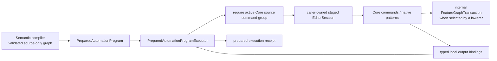
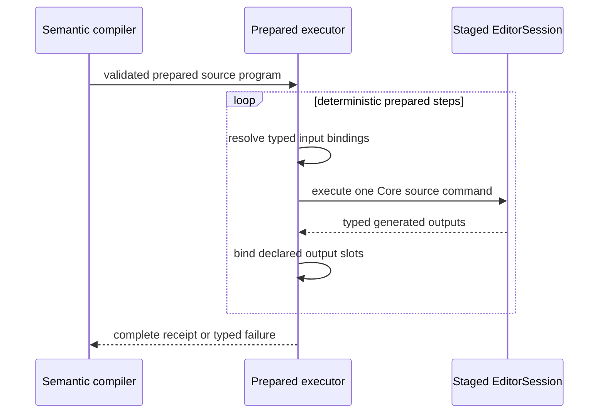

# RupaAutomation Prepared Source Execution

## Purpose and Scope

`RupaAutomation` owns domain-neutral execution of already resolved source
operations inside a caller-owned staged `EditorSession`. It is a child of the
[RupaKit package design](../../DESIGN.md) and depends on `RupaCore` and
`RupaCoreTypes`.

CADAPI-D extends this existing module with a binding-aware prepared-plan
contract. This document defines the target contract; the current
`AutomationBatch` and `AutomationRunner` do not yet provide all typed local
output bindings described here. The existing `PreparedAutomationBatch`,
`AutomationStagedBatchExecutor`, and `AutomationRunner` remain the legacy
batch path during CADAPI-A; the binding-aware program and executor are separate
types and do not retrofit local bindings into that path.

Parent: [package design](../../DESIGN.md). Children: none.

## Responsibilities and Boundaries

This module owns:

- sequential execution of a validated prepared source plan in one isolated
  staged session that is already inside a caller-owned Core source command
  group;
- typed output slots that bind one step's generated Core identities for later
  prepared steps;
- complete aggregation of generated identities, diagnostics, and execution
  telemetry independently of which identities are selected into local slots;
- one domain-neutral internal path for Core commands, including native pattern
  commands and an internally generated `FeatureGraphTransaction` when that is
  the appropriate atomic lowering substrate.

It does not own semantic CAD operation names, input schemas, program graph
validation, project coordinates, workspace publication, package persistence,
transport DTOs, CLI syntax, or persistent-ID policy. It never accepts raw
feature graphs from an external Agent boundary. It neither opens nor closes the
source command group and never uses `AutomationRunner` to execute a prepared
program.

## Related Designs

| Design | Relationship | Contract Used | Summary | Cautions |
|---|---|---|---|---|
| [package design](../../DESIGN.md) | parent | dependency direction and CADAPI-D boundary | Places prepared execution below semantic compilation and project publication. | The current public raw route is an implementation gap, not this target contract. |
| [RupaDomainFoundation](../RupaDomainFoundation/DESIGN.md) | used by | compiled semantic program to prepared source-plan contract | Resolves one shared operation vocabulary into this module's domain-neutral steps. | Automation must not import or duplicate the semantic registry. |
| [RupaCore](../RupaCore/DESIGN.md) | depends on | `EditorSession`, Core commands, feature-graph transaction, and validation | Supplies the only mutable source staging substrate used here. | No source value may escape as an independently published authority. |
| [RupaProject](../RupaProject/DESIGN.md) | used transitively by | staged transaction and final publication | Owns evaluation, history, package reconstruction, and publication. | Automation execution success alone is not project commit success. |
| [RupaKit integration](../RupaKit/DESIGN.md) | used by | one prepared-program workspace action | Adapts the prepared plan to the exact current project view. | It must not execute nodes as separate workspace mutations. |

## Architecture

The exact public type names may be refined during implementation, but the
ownership and behavior above are fixed. The execution input is prepared and
source-only; it is not a second semantic operation model.

## Contracts and Invariants

1. A prepared program contains deterministic ordered steps, typed input-slot
   references, declared output slots, and preflight telemetry. It contains no
   unvalidated wire payload or unresolved semantic operation.
2. Each output slot has one declared Core identity kind and explicit selector.
   A later step may consume it only at a matching input kind. A missing
   selection, duplicate slot/selector, or mismatched binding fails before that
   later step mutates staged source. Generated identities without a declared
   selector remain valid receipt evidence and do not become local slots.
3. In accordance with the
   [package identity-phase contract](../../DESIGN.md#cad-identity-phases),
   Feature, source body-output role, Scene, Component, Instance, and Pattern
   values are bound only from Core's accepted staged-source result. A body role
   is keyed by its generated Feature and source output port; evaluated
   topology `BodyID` is unavailable here. External request-local symbols never
   become persistent IDs.
4. Before resolving a binding or executing a command, the executor requires the
   caller-owned staged session to report an active Core source command group.
   An inactive session is a typed failure with no mutation. The executor does
   not open or close the group, commit history, evaluate, publish, save, or open
   a project.
5. A native finite pattern lowers to one Core pattern command and retains its
   parameter-following source representation. The executor does not expand it
   into one copied feature or occurrence command per instance.
6. `FeatureGraphTransaction` and `appendFeatureGraph` may remain internal atomic
   implementation tools. They must not appear in Agent capability discovery,
   wire DTOs, CLI syntax, or public semantic operation descriptors.
7. Execution order is the deterministic topological order selected by the
   semantic compiler. The executor never infers a different dependency graph.
8. Cancellation and any command, binding, limit, or Core validation failure
   abort the prepared execution and must escape the caller's source-group
   closure so Core restores its source/history snapshot. The caller owns that
   rollback boundary; catching an executor failure inside the group and then
   committing the group violates the caller contract. Nothing in this module
   publishes a partial result.
9. The receipt contains every declared local-output binding, generated identity
   kind from every complete Core delta, diagnostics introduced by this prepared
   execution, and measured step/source-expansion work required for the upper
   layer to project the committed result. Diagnostics already present in the
   staged session at a step boundary are ambient project state and must not be
   charged or returned as that step's result. It contains no mutable session.
   Local output bindings are a selected subset of each complete delta, not an
   exhaustive declaration of all generated Product/presentation identities.
10. Current `AutomationBatch`, `PreparedAutomationBatch`,
    `AutomationStagedBatchExecutor`, and `AutomationRunner` behavior remains
    legacy compatibility inventory until later cutover. CADAPI-A does not alter
    those types or route prepared programs through their command switch.
11. A prepared program carries typed accepted ceilings and preflight estimates
    for ordered steps, declared input/output slots, Core command invocations,
    and expanded generated-source work. The executor rejects known excess
    before mutation, measures actual work monotonically, and throws instead of
    returning a partial receipt if a dynamic measurement exceeds its accepted
    ceiling. A native pattern remains one prepared step and one Core command;
    its generated source identities still count as expanded source work. For
    the same distinct modeling intent, increasing occurrence count does not add
    prepared output slots; occurrence identities remain in the complete step
    receipt instead of being expanded into local declarations.
12. Construction of the executable command-builder closure is package-scoped
    and limited to product-composed trusted lowerers. Public semantic values,
    wire DTOs, and external callers cannot inject callbacks or arbitrary code
    into a prepared program. The builder may only resolve one already-validated
    step into one Core command; it does not perform I/O or mutate authority.
13. The executor rechecks the resolved Core command with an exhaustive,
    fail-closed source-program eligibility classification. No `default` branch
    accepts a newly added command implicitly. Raw feature-graph, workspace,
    read, Mesh, lifecycle, and aggregate replacement commands are rejected
    before execution.

## Runtime Flows

The loop is an internal traversal of a finite prevalidated graph. It is not a
user-programmable loop and cannot grow beyond the compiler's accepted work
budget. Native pattern occurrences do not create loop iterations or additional
prepared output declarations.

## State, Ownership, and Lifecycle

Prepared programs and receipts are immutable values. Invocation-local binding
storage lives only for one staged execution. The caller owns the
`EditorSession`; `RupaAutomation` neither retains it after return nor creates a
second document authority. The invocation-local slot table is created empty by
the executor, accepts each declared producer exactly once, and is discarded on
return or failure. Core owns all generated source values once the caller
publishes the staged aggregate.

## Failure, Concurrency, and Constraints

Prepared execution is ordered and cancellation-aware. It does not perform I/O
or `await` while mutating the staged session. Failure is typed as inactive
source group, invalid prepared plan, missing/duplicate/type-mismatched binding,
Core command failure, cancellation, or measured-limit excess. It never returns
partial success. The later semantic compiler owns standard policy selection;
Automation owns enforcing the accepted prepared-program ceilings and reporting
the measured execution counters without clamping either value.

## Verification and Change Impact

The later implementation must prove:

| Invariant | Behavioral evidence |
|---|---|
| Binding correctness | Create-to-reference chains for Feature, source body-output role, Scene, Component, Instance, and Pattern outputs plus missing/type-mismatch rejection; evaluated `BodyID` is rejected as a staged binding. |
| Active-group authority | An ordinary `EditorSession` is rejected before binding or mutation; the same program executes only inside the existing caller-owned Core source group. |
| Atomic staging | A late command, binding, cancellation, or limit failure propagated out of the source-group closure leaves caller source, history, and evaluation state unchanged. |
| Native repetition | Pattern count changes do not change prepared step count and execute one native pattern command. |
| Internal graph boundary | Core graph success/rollback tests remain, while Agent catalog/codec/CLI tests reject raw graph payloads. |
| Result completeness | Every declared symbol output maps to a server-generated typed identity; every complete Core delta and all measured work remain in the receipt even when generated identities are not selected into local slots. Pre-existing session diagnostics are excluded while diagnostics introduced by the prepared execution remain. Duplicate selectors, missing selections, and wrong-kind selections are rejected. |
| Limit boundaries | Each accepted ceiling succeeds at its boundary and rejects boundary-plus-one; dynamic excess unwinds the enclosing group without a receipt. |
| Legacy isolation | Existing `PreparedAutomationBatch`, staged batch executor, and `AutomationRunner` behavior/tests remain unchanged. |
| Compact native pattern | Changing occurrence count keeps prepared step, command, and output-slot counts constant for the same distinct intent while complete receipt identities and measured expanded work change. |
| Trusted lowering boundary | External code cannot construct an executable builder; exhaustive resolved-command eligibility rejects raw graph and non-source commands and requires classification when Core adds a case. |

Changes to prepared-step shape, binding lifetime, execution ordering, result
projection, or internal graph use require rechecking `RupaDomainFoundation`,
`RupaKit`, `RupaProject`, Agent Runtime, and actual CLI integration.
