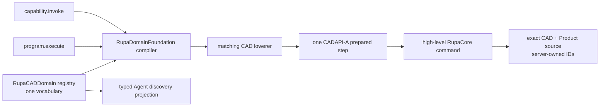
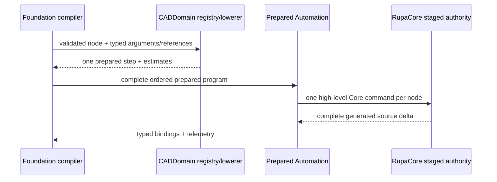

# RupaCADDomain Semantic CAD Design

## Purpose and Scope

`RupaCADDomain` owns Rupa's concrete, versioned semantic CAD operation
vocabulary, typed output declarations, and lowerers into the coordinate-free
prepared source-program contract. The same registry serves direct invocation
and declarative programs. This module is a child of the
[RupaKit package design](../../DESIGN.md).

Parent: [RupaKit package design](../../DESIGN.md). Children: none.

## Responsibilities and Boundaries

This module owns:

- the qualified `cad.*` operation IDs and version `1` schemas listed here;
- one descriptor, one typed output schema, and one lowerer for each operation;
- CAD-specific validation and conversion of typed semantic values into existing
  high-level `RupaCore` commands;
- fixed prepared-command and generated-source-work estimates for each operation;
- composition rules that realize simple geometry directly and complex geometry
  as bounded programs of the same operations.

It does not own the generic semantic graph model/compiler, persistent ID
allocation, source mutation, project coordinates, publication, result
projection, wire DTOs, access transport, CLI syntax, benchmark cases, Mesh
editing, kernel topology, or renderer behavior. It cannot import Agent,
Project, ProjectAccess, CLI, UI, transport, or benchmark targets.

## Related Designs

| Design | Relationship | Contract Used | Summary | Cautions |
|---|---|---|---|---|
| [package design](../../DESIGN.md) | parent | Dependency and identity-phase rules | Places CADDomain between generic compilation and prepared source execution. | No second vocabulary or authority. |
| [RupaDomainFoundation](../RupaDomainFoundation/DESIGN.md) | depends on | Versioned descriptors, typed semantic values/references, DAG compiler, limits | Direct and program forms resolve through one registry. | CADDomain must not read project coordinates. |
| [RupaAutomation](../RupaAutomation/DESIGN.md) | depends on | Prepared steps, typed local slots, complete receipts, bounded work | Each semantic node lowers to exactly one prepared step and one high-level Core command. | Do not expose the command-builder closure publicly. |
| [RupaCore](../RupaCore/DESIGN.md) | depends on | Server-owned identity allocation and high-level source commands | Core creates exact CAD/Product source and reports complete generated deltas. | No caller-minted Feature, Scene, Component, Pattern, or SketchEntity IDs. |

## Architecture

The registry is a product-composed immutable value. There is no operation
switch in Runtime, Protocol, CLI, or benchmark code.

### Version-1 operation registry

All lengths, angles, points, directions, planes, and transforms are typed
semantic values. Lowerers convert accepted values to canonical Core/Swift-CAD
types only after Foundation has validated schema, unit, reference kind, graph,
and work limits.

| Qualified ID | Required arguments | Declared outputs | Core lowering | Commands / generated-source work |
|---|---|---|---|---:|
| `cad.sketch.line` | `name`, `plane`, `start`, `end` | `curve:.feature`, `scene:.scene` | `createLineSketch` | 1 / 2 |
| `cad.sketch.rectangle` | `name`, `plane`, `center`, positive `width`, positive `height` | `profile:.feature`, `scene:.scene` | centered high-level rectangle sketch | 1 / 2 |
| `cad.sketch.circle` | `name`, `plane`, `center`, positive `radius` | `profile:.feature`, `scene:.scene` | `createCircleSketch` | 1 / 2 |
| `cad.sketch.constrained` | `name`, `plane`, ordered ID-free `entities`, index-based `relations` | `sketch:.feature`, `scene:.scene` | Core `createSemanticSketch` | 1 / 2 |
| `cad.solid.box` | `name`, lower-corner `origin`, positive `width`, `depth`, `height` | `profile:.feature`, `body:.body`, `profileScene:.scene`, `bodyScene:.scene` | one `createExtrudedRectangle` family command retaining sketch plus extrude source | 1 / 5 |
| `cad.solid.cylinder` | `name`, `baseCenter`, nonzero `axis`, positive `radius`, positive `height` | `profile:.feature`, `body:.body`, `profileScene:.scene`, `bodyScene:.scene` | one `createExtrudedCircle` command retaining sketch plus extrude source | 1 / 5 |
| `cad.solid.extrude` | `name`, `profile:.feature`, nonzero `distance`, `direction` | `body:.body`, `scene:.scene` | `extrudeProfile` | 1 / 3 |
| `cad.solid.sphere` | `name`, finite `center`, positive `radius` | `body:.body`, `scene:.scene` | Core `createAnalyticSphere` | 1 / 3 |
| `cad.scene.transform` | `scene:.scene`, finite `translation`, `axisPoint`, nonzero `rotationAxis`, `rotation` | none; callers retain the source node output | `setSceneNodeTransform` | 1 / 0 |
| `cad.component.define` | `name`, nonempty ordered `rootScenes:[.scene]` | `definition:.componentDefinition` | `createComponentDefinition` | 1 / 1 |
| `cad.component.instantiate` | `name`, `definition:.componentDefinition`, finite `transform` | `instance:.componentInstance`, `scene:.scene` | `createComponentInstance` | 1 / 2 |
| `cad.pattern.linear` | `name`, `definition:.componentDefinition`, nonzero `direction`, nonnegative `distance`, positive bounded `count` | `pattern:.pattern`, `rootScene:.scene` | one native `createPatternArray` | 1 / `3 + 2*count` |

`.body` is the semantic source-body kind: during staging it binds the generated
Feature plus `.body` output role. It is not evaluated topology `BodyID`.
`profile`, `curve`, and `sketch` are semantic output names whose prepared kind
is `.feature`; their descriptors retain the stricter intended use.

### Constraint value contract

`cad.sketch.constrained` accepts only ordered, ID-free line and analytic-circle
entity values. Relations refer to those entities by zero-based local index;
coincident relations additionally select one endpoint on each line. Supported
relations are coincident, parallel, perpendicular, horizontal, vertical,
equal-length, concentric, and equal-radius. The lowerer never constructs a
`Sketch`, `SketchEntityID`, `FeatureNode`, or `FeatureGraphTransaction`; it
passes the ID-free plan to Core for materialization.

### Benchmark realization mapping

The unchanged 100-case benchmark is a consumer of the universal registry, not
an operation source:

| Category | Count | Semantic realization |
|---|---:|---|
| LIN | 12 | one `cad.sketch.line` |
| REC | 12 | one `cad.sketch.rectangle` |
| CIR | 12 | one `cad.sketch.circle` |
| ANG | 16 | two `cad.sketch.line` nodes |
| BOX | 12 | one `cad.solid.box`, retaining exact sketch plus extrude source |
| CYL | 8 | one `cad.solid.cylinder`, retaining exact sketch plus extrude source |
| CON | 8 | one `cad.sketch.constrained` |
| TRN | 8 | one source operation followed by `cad.scene.transform` |
| CMP | 7 | two or three `cad.solid.box`/`cad.solid.cylinder` nodes |
| SPH | 5 | one `cad.solid.sphere` with exact analytic source |

Angles and compounds do not receive dedicated operations. Rectangle-profile
extrusion and the component/instance/pattern chain prove composition beyond the
fixed benchmark without adding a third public form.

## Contracts and Invariants

1. Every operation ID is qualified exactly as listed and has explicit version
   `1`. Missing or unknown versions fail; no default version is inferred.
2. Each registered descriptor has exactly one lowerer and one output schema.
   Direct invocation and an equivalent one-node program compile to the same
   prepared meaning.
3. Every lowerer emits exactly one prepared step and one high-level Core
   command. Multi-operation meaning is expressed by a semantic program, not a
   hidden lowerer loop or raw feature graph.
4. Persistent identities and Product presentation are Core outputs. Semantic
   inputs contain typed existing references or request-local program references
   only. `BodyID`, `SketchEntityID`, caller-reserved UUIDs, and presentation
   objects are invalid inputs.
5. `cad.solid.sphere` always lowers to the exact analytic sphere command. Mesh,
   faceted, revolve, loft, bounds-only, or unsupported-success substitutes are
   invalid.
6. Native pattern count changes generated work but not semantic node count,
   prepared-step count, Core-command count, or declared output-slot count.
   Occurrence identities remain complete receipt telemetry rather than local
   output declarations.
7. CAD-specific lowerer failures use stable codes `cad.invalidArgument`,
   `cad.degenerateGeometry`, `cad.invalidReference`,
   `cad.referenceKindMismatch`, `cad.unsupportedValue`, or
   `cad.coreCommandRejected`. Foundation-owned unknown-version, graph, value,
   unit, reference, cycle, and limit failures remain Foundation errors.
8. All operations are `.source` / `.sourceMutation`, deterministic for the
   accepted typed input and registry version, and available only when their
   required Core command exists. Registration never reports placeholder,
   benchmark-derived, or partial availability.
9. Product composition validates exact set equality with the twelve IDs in the
   version-1 table. Duplicate, missing, unexpected, or independently projected
   registrations fail before Agent discovery is exposed.

## Runtime Flows

## State, Ownership, and Lifecycle

The registry, descriptors, lowerers, and compiled semantic values are immutable
and product-composed. Lowering retains no session, project, coordinate, request,
or result state. Invocation-local local-reference bindings belong to
`RupaAutomation`; persistent identities and source lifetime belong to Core and
Project publication.

## Failure, Concurrency, and Constraints

Lowering is synchronous, pure with respect to project authority, cancellation-
aware through the compiler, and bounded by Foundation's decoded/lowered work
limits plus Automation's prepared-command/generated-work limits. It performs no
I/O, `await`, callback, retry, publication, save, or alternate-route fallback.
Arithmetic used for pattern work and compound semantic estimates is checked for
overflow; an estimate never clamps or expands a pattern into occurrences.

## Verification and Change Impact

CADAPI-C must provide the following falsifiable evidence:

| Invariant | Required counterexample/evidence |
|---|---|
| Registry completeness | Exact set equality for the twelve version-1 IDs; duplicate/missing descriptor, lowerer, output, or version fails composition. |
| Direct/program identity | Every operation's direct form and equivalent one-node form compile to the same prepared command meaning and outputs. |
| Identity ownership | Caller-minted Feature/Scene/Component/Pattern/SketchEntity/Body IDs are structurally absent or rejected; successful receipts contain only Core-generated values. |
| Sketch constraints | Eight accepted relation families plus wrong entity kind, missing/negative/out-of-range/self/duplicate index, ambiguous coincident endpoint, and degenerate entity failures. |
| Exact sphere | Five benchmark centers/radii produce analytic sphere source and exact 8/12/6 B-Rep; wrong center/radius, nonpositive radius, nonfinite input, Mesh, and other-solid substitutes fail. |
| Source fidelity | BOX/CYL preserve their sketch-plus-extrude source and analytic oracle; no primitive or Mesh shortcut silently changes the benchmark target. |
| Composition | ANG uses two lines, TRN uses source plus transform, CMP uses two/three universal solids, and no benchmark-specific operation is registered. |
| Typed chains | Rectangle profile to extrude and Scene to Component Definition to Instance to native Pattern bind through declared output kinds. |
| Compact pattern | Counts at boundary and boundary-plus-one prove fixed semantic/prepared/command/output shape and checked generated-work growth. |
| Dependency boundary | Target/package scans show no Agent, Project, Access, CLI, UI, transport, benchmark, raw graph, or caller-ID dependency. |

Changing an operation ID/version, argument/output kind, estimate, Core command,
or availability requires rechecking Foundation compilation, Automation binding,
Protocol golden fixtures, Runtime discovery, Project publication, and the full
100-case exact-oracle replay.
