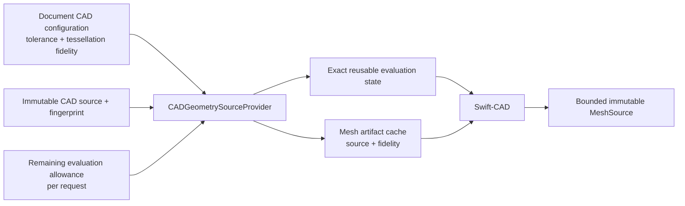
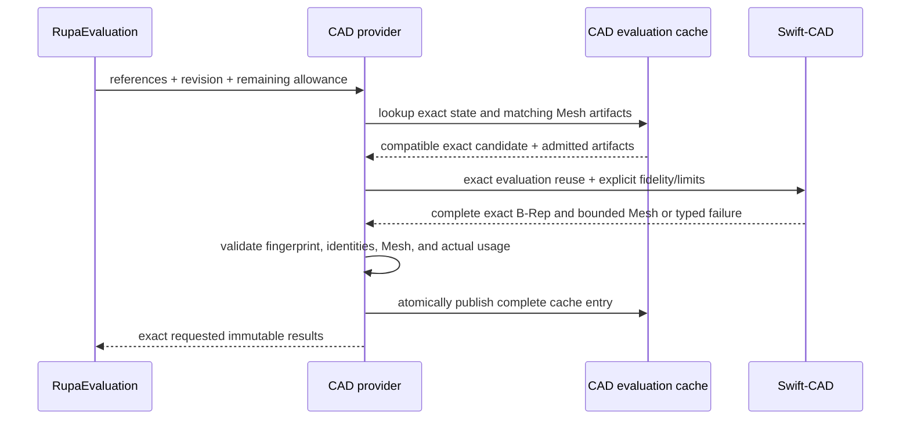

# RupaCADIntegration

## Purpose and Scope

`RupaCADIntegration` adapts one immutable Rupa CAD source reference to a
Swift-CAD exact evaluation and a bounded derived `MeshSource`. It is a child of
the [RupaKit package design](../../DESIGN.md) and has no child designs.

`CADDocumentEvaluationCache` is scoped by `(documentID, configuration)`, where
the configuration is the fidelity the meshes were tessellated at. The resource
ceiling is deliberately outside that scope: it is per-request admission, so a
ceiling that shrinks with the remaining allowance cannot move the scope on
every edit and evict the incremental evaluation the kernel reuses.

## Responsibilities and Boundaries

This module owns the mapping from Rupa's document CAD configuration to
Swift-CAD, exact source fingerprint validation, exact-evaluation reuse, derived
Mesh artifact caching, conversion to `MeshSource`, and per-request admission of
the produced meshes against the requesting allowance. It does not select
fidelity, edit CAD source, publish a project, render a viewport, or handle
Agent requests.

## Related Designs

| Design | Relationship | Contract Used | Summary | Cautions |
|---|---|---|---|---|
| [RupaKit package](../../DESIGN.md) | parent | module graph and authority direction | Places this adapter below product composition and provider-neutral evaluation. | This module is not project authority. |
| [RupaEvaluation](../RupaEvaluation/DESIGN.md) | depends on | bounded provider request/result | Declares the provider contract this adapter implements, with exact references and remaining aggregate allowance. | Return exactly the requested results or fail; the contract owner never imports this adapter. |
| [RupaKit integration](../RupaKit/DESIGN.md) | used by | document CAD configuration and evaluation cache | Builds the provider from the document's modeling settings and owns the cache it seeds a staged evaluation into. | The seed must be recorded under the same configuration a request looks up, or it is never reused. |
| [Swift-CAD](../../../swift-CAD/DESIGN.md) | depends on | exact evaluation and bounded tessellation | Supplies exact B-Rep and generic Mesh limits. | Swift-CAD never receives Rupa UI policy. |

## Architecture

## Contracts and Invariants

1. `CADGeometryEvaluationConfiguration` contains modeling tolerance and
   tessellation fidelity, and nothing else. It carries no resource ceiling,
   because ceilings are per-request admission and would otherwise move the
   cache scope; and no artifact purpose, because both representation purposes
   ask for the same fidelity of the same document and partitioning the cache
   between them would cost a full kernel evaluation on every alternation the
   publication path makes. It contains no viewport, camera, Agent,
   publication, or persistence state.
2. RupaKit composition supplies one configuration per document. This module
   validates and applies it without changing fidelity, and derives the kernel
   ceiling for a request as the module ceiling lowered to that request's
   remaining allowance.
3. Exact evaluation reuse is keyed by source identity/fingerprint, schema,
   evaluator identity, revisions, units, and modeling tolerance. It is not
   invalidated only because presentation tessellation fidelity differs.
4. Mesh artifact reuse is separate and requires the exact source fingerprint
   and the complete tessellation fidelity configuration. A reused artifact is
   charged against the requesting allowance like a freshly produced one,
   because the kernel carries unchanged bodies forward without consulting the
   ceiling; an artifact the current allowance does not admit is a typed
   refusal, not a cache miss.
5. The provider enforces the lower of the module tessellation ceiling and the
   remaining RupaEvaluation allowance before derived Mesh allocation, then
   returns exactly one validated result for every requested reference. A
   kernel resource refusal is reported as resource exhaustion, an invalid
   ceiling as invalid configuration, and a cancellation is rethrown unchanged.
6. Cache publication is atomic for one provider evaluation. Failure,
   cancellation, stale source identity, or limit exhaustion publishes neither
   a partial result nor a reusable Mesh artifact.

## Runtime Flows

## State, Ownership, and Lifecycle

`CADDocumentEvaluationCache` owns immutable exact candidates and derived Mesh
artifacts behind its existing `Mutex`; it owns no mutable CAD document or
project state. Exact and Mesh entries are retained only for cache reuse and are
replaced atomically by newer compatible revisions. Provider requests and
conversion scratch are invocation-local.

## Failure, Concurrency, and Constraints

Evaluation is synchronous and `Sendable`; its caller chooses the task/executor.
No lock is held across external callback, I/O, or lengthy Swift-CAD work.
Invalid configuration, source mismatch, stale revision, missing body, malformed
Mesh, checked overflow, budget exhaustion, and cancellation remain typed. No
failure returns an empty or silently coarsened successful result.

## Verification and Change Impact

Tests must prove one evaluation serves both representation purposes at one
revision, exact B-Rep reuse survives a fidelity change, Mesh reuse requires its
complete artifact configuration, the remaining allowance reaches the kernel as
the lowered ceiling and refuses an exhausted request before the kernel is
entered, a cached artifact the current allowance no longer admits is refused
without a second evaluation, exhaustion and cancellation stay typed and
distinct from an unrelated failure, and failure or cancellation publishes no
partial cache entry. Changes require rechecking RupaEvaluation, RupaKit
composition, RupaProject staging, and Swift-CAD tessellation contracts.
