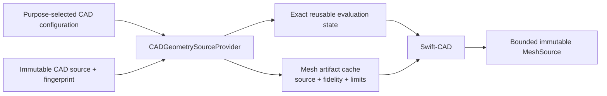
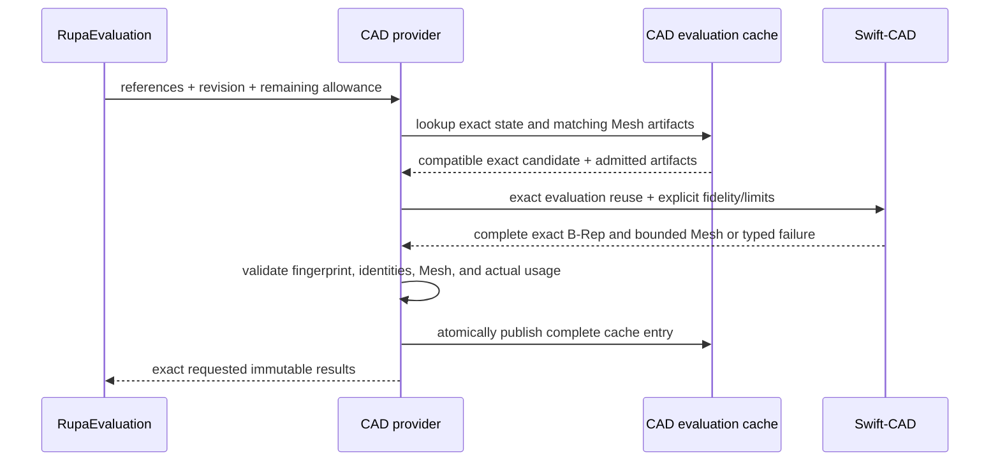

# RupaCADIntegration

## Purpose and Scope

`RupaCADIntegration` adapts one immutable Rupa CAD source reference to a
Swift-CAD exact evaluation and a purpose-configured derived `MeshSource`. It is
a child of the [RupaKit package design](../../DESIGN.md) and has no child
designs.

The current implementation scopes `CADDocumentEvaluationCache` by one complete
configuration and requires a seeded evaluation to have the same tessellation
options. The target design separates exact reusable state from Mesh artifact
reuse so a presentation profile cannot become modeling authority.

## Responsibilities and Boundaries

This module owns the mapping from Rupa's purpose-selected CAD configuration to
Swift-CAD, exact source fingerprint validation, exact-evaluation reuse, derived
Mesh artifact caching, conversion to `MeshSource`, and provider-limit
enforcement. It does not select presentation fidelity, edit CAD source,
publish a project, render a viewport, or handle Agent requests.

## Related Designs

| Design | Relationship | Contract Used | Summary | Cautions |
|---|---|---|---|---|
| [RupaKit package](../../DESIGN.md) | parent | module graph and authority direction | Places this adapter below product composition and provider-neutral evaluation. | This module is not project authority. |
| [RupaEvaluation](../RupaEvaluation/DESIGN.md) | depends on | bounded provider request/result | Declares the provider contract this adapter implements, with exact references and remaining aggregate allowance. | Return exactly the requested results or fail; the contract owner never imports this adapter. |
| [RupaKit integration](../RupaKit/DESIGN.md) | used by | purpose-selected CAD configuration | Selects modeling or presentation policy before constructing the provider. | The adapter must not infer purpose. |
| [Swift-CAD](../../../swift-CAD/DESIGN.md) | depends on | exact evaluation and bounded tessellation | Supplies exact B-Rep and generic Mesh limits. | Swift-CAD never receives Rupa UI policy. |

## Architecture

## Contracts and Invariants

1. `CADGeometryEvaluationConfiguration` contains modeling tolerance,
   tessellation fidelity, and generic tessellation limits. It contains no
   viewport, camera, Agent, publication, or persistence state.
2. RupaKit composition supplies the configuration selected for the requested
   representation purpose. This module validates and applies it without
   selecting a different purpose or silently changing fidelity.
3. Exact evaluation reuse is keyed by source identity/fingerprint, schema,
   evaluator identity, revisions, units, and modeling tolerance. It is not
   invalidated only because presentation tessellation fidelity differs.
4. Mesh artifact reuse is separate and requires the exact source fingerprint,
   complete tessellation fidelity configuration, and recorded resource usage
   admitted by the current limits. Otherwise the provider retessellates from
   compatible exact state or returns typed failure.
5. The provider enforces the lower of Swift-CAD hard limits and the remaining
   RupaEvaluation allowance before derived Mesh allocation, then returns
   exactly one validated result for every requested reference.
6. Cache publication is atomic for one provider evaluation. Failure,
   cancellation, stale source identity, or limit exhaustion publishes neither
   a partial result nor a reusable Mesh artifact.

## Runtime Flows

## State, Ownership, and Lifecycle

`CADDocumentEvaluationCache` owns immutable exact candidates and derived Mesh
artifacts behind its existing `Mutex`; it owns no mutable CAD document or
project state. Exact and Mesh entries are retained only for cache reuse and are
replaced atomically by newer compatible revisions. Provider requests and
conversion scratch are invocation-local.

## Failure, Concurrency, and Constraints

Evaluation is synchronous and `Sendable`; its caller chooses the task/executor.
No lock is held across external callback, I/O, or lengthy Swift-CAD work.
Invalid configuration, source mismatch, stale revision, missing body, malformed
Mesh, checked overflow, budget exhaustion, and cancellation remain typed. No
failure returns an empty or silently coarsened successful result.

## Verification and Change Impact

Tests must prove modeling and presentation configurations remain distinct,
exact B-Rep reuse survives a fidelity change, Mesh reuse requires its complete
artifact configuration and admitted usage, aggregate allowances reach the
kernel, and failure/cancellation publishes no partial cache entry. Changes
require rechecking RupaEvaluation, RupaKit composition, RupaProject staging,
and Swift-CAD tessellation contracts.
