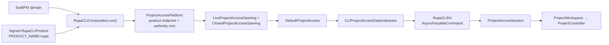
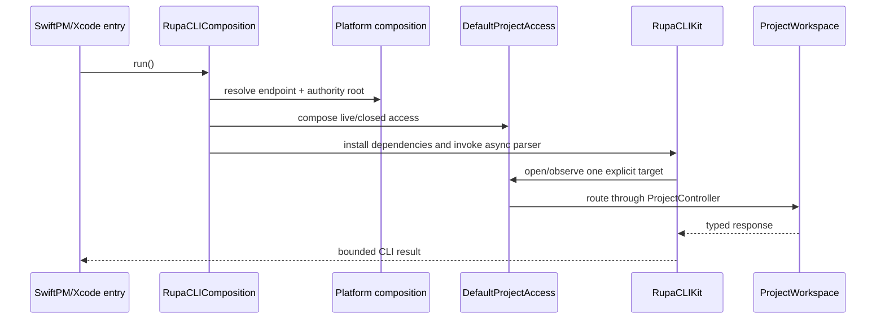

# RupaCLIComposition

## Purpose and Scope

`RupaCLIComposition` is the executable composition boundary for the
distributable `rupa` command. It is a child of the [RupaKit package
design](../../DESIGN.md) and is used by both the SwiftPM executable entry and
the Xcode `RupaCLIProduct` entry.

This module constructs exactly one `RupaProjectAccess` composition from the
product endpoint and project-file authority directory, installs the resulting
access ports for `RupaCLIKit`, and invokes its async command parser. It owns no
project, workspace, controller, package, semantic operation, transport
override, fallback, or compatibility route.

Parent: [RupaKit package design](../../DESIGN.md). Children: none.

## Responsibilities and Boundaries

This module owns:

- the public async entry shared by all `rupa` executable products;
- product endpoint and authority-directory resolution through the platform
  composition;
- construction of one live opener, one closed opener, one `DefaultProjectAccess`,
  and the corresponding CLI access dependencies;
- installation of those dependencies for the duration of one CLI command
  process.

It does not own:

- CLI syntax or user-facing result projection, which belong to
  `RupaCLIKit`;
- project mutation, evaluation, or persistence, which belong to the
  `ProjectWorkspace`/`ProjectController` path reached by project access;
- package archive entries, a second `EditorSession`, or a direct file writer;
- endpoint placement, socket framing, peer authentication, or App lifecycle;
- an alternate `live`/`file` route, retry, fallback, or legacy compatibility
  decoder.

## Related Designs

| Design | Relationship | Contract Used | Summary | Cautions |
|---|---|---|---|---|
| [RupaKit package](../../DESIGN.md) | parent | target graph and one authority rule | Indexes this executable composition target. | The package design does not duplicate this composition. |
| [RupaCLIKit](../RupaCLIKit/DESIGN.md) | depends on | CLI access dependencies and async command tree | Parses intent and projects results through injected access ports. | This module must not add command-specific authority. |
| [RupaProjectAccess](../RupaProjectAccess/DESIGN.md) | depends on | opening, observation, session, and explicit-save protocols | Supplies the transport-neutral project access contract. | The composition transports the contract; it does not reinterpret requests. |
| [RupaProjectAccessComposition](../RupaProjectAccessComposition/DESIGN.md) | depends on | live and closed access openers | Implements the workspace/controller access adapters. | No direct `ProjectWorkspace` or package construction occurs here. |
| [RupaProjectAccessPlatform](../RupaProjectAccessPlatform/DESIGN.md) | depends on | product endpoint and file-authority coordinates | Provides the shared App Group coordination composition. | App Group contains only endpoint/authority coordination state. |
| [Rupa application package](../../../Rupa/DESIGN.md) | used by | signed Xcode CLI product entry | Registers the Xcode product beside the Rupa App. | The CLI is non-sandboxed for explicit input/output paths and is not App authority. |
| [Rupa App](../../../Rupa/Rupa/Rupa/DESIGN.md) | coordinates with | same product Team/App Group values | The App owns the live workspace while the CLI attaches through access. | CLI process lifetime never creates or replaces the App workspace. |

## Architecture



There is one composition edge:

```text
RupaCLIProduct entry
SwiftPM entry
        -> RupaCLIComposition
            -> RupaProjectAccessPlatform
            -> RupaProjectAccessComposition
            -> RupaCLIKit
                -> ProjectAccessSession
                    -> ProjectWorkspace / ProjectController
```

## Contracts and Invariants

1. SwiftPM and Xcode executable entries call the same public async
   `RupaCLIComposition` entry. They contain no access construction or command
   dispatch logic.
2. The composition resolves the product endpoint and file-authority root only
   through `RupaProjectAccessPlatform`. It accepts no socket/path override and
   creates no temporary fallback endpoint.
3. `DefaultProjectAccess` is the only route selector. A live target reaches
   the live opener, an explicit file target reaches the closed opener, and
   observation reaches only the live observer.
4. The composition creates no project authority. All Product/CAD/Mesh
   mutation, evaluation, and persistence remain behind one
   `ProjectWorkspace`/`ProjectController` composition.
5. The command access dependencies are installed only for one process
   invocation. Session finish remains owned by the CLI access runner, and
   explicit save remains a separate session operation.
6. Composition failure is typed and terminal. It never reports success,
   switches access modes, retries a dispatched request, or edits package bytes.
7. The Xcode CLI target uses Team `WWCKBW8CKN`, carries the product App Group
   entitlement needed for the shared endpoint/authority coordination, and
   contains no `com.apple.security.app-sandbox` entitlement. It is a command
   tool, not a second App document or process authority.

## Runtime Flows



Status, sessions, and capabilities use the observation port and do not launch
the App or open a closed project. A mutation session is finished after the
command; a file-mode non-dry mutation invokes explicit save on that same
session before finish. No entrypoint performs a second lifecycle operation.

## State, Ownership, and Lifecycle

The composition owns only short-lived opener and dependency values created for
one CLI process. `RupaProjectAccessComposition` owns access-resource lifetime;
the App owns live project lifetime; `ProjectWorkspace` and `ProjectController`
own project state and publication. The composition never stores mutable project
state and never transfers a controller or package backing across the CLI
boundary.

## Failure, Concurrency, and Constraints

The public entry is asynchronous and runs under the command tree's existing
deadline policy. Endpoint, authority-root, opener, session, coordinate,
semantic, package, and result failures remain typed. Concurrent commands each
receive an independent composition value, while each command's access runner
serializes its session operations and uses one target/deadline. No shared
mutable project state is introduced by this module.

## Verification and Change Impact

Composition tests and static scans must prove that both executable entries
refer to one composition, no second project/mutation/save route exists, no
endpoint override or fallback remains, and status observation does not launch
or open a project. The project-default Xcode build must produce a signed
`rupa` executable whose Team and App Group entitlements are present and whose
entitlements omit App Sandbox. Changes to the endpoint or authority
composition require rechecking [RupaProjectAccessPlatform](../RupaProjectAccessPlatform/DESIGN.md),
[RupaProjectAccessComposition](../RupaProjectAccessComposition/DESIGN.md), and
the application design.
