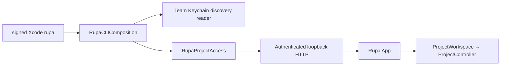
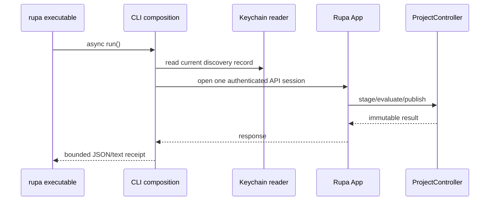

# RupaCLIComposition

## Purpose and Scope

`RupaCLIComposition` is the executable composition boundary for the
distributable signed Xcode `rupa` command. It is a child of the
[RupaKit package design](../../DESIGN.md) and is used only by the Xcode CLI
product entry. Children: none.

It constructs one live `RupaProjectAccess` composition from the Team Keychain
discovery reader and installs it for one asynchronous CLI invocation.

## Responsibilities and Boundaries

This module owns:

- the shared asynchronous executable entry;
- construction of one discovery reader, live opener, and observation port;
- installation of those ports for the lifetime of one CLI process.

It does not own project state, semantic commands, package bytes, listener
lifecycle, Keychain writes, App lifecycle, or a second controller. All
project operations go through `RupaProjectAccess` to the App-owned
`ProjectWorkspace` and `ProjectController`.

## Related Designs

| Design | Relationship | Contract Used | Summary | Cautions |
|---|---|---|---|---|
| [RupaKit package](../../DESIGN.md) | parent | target graph and single authority | Indexes this executable composition. | Do not duplicate access policy. |
| [RupaCLIKit](../RupaCLIKit/DESIGN.md) | depends on | async command tree and access ports | Parses intent and projects results. | It never constructs a transport. |
| [RupaProjectAccess](../RupaProjectAccess/DESIGN.md) | depends on | live opening, observation, session, save | Defines the external API boundary. | Composition only wires dependencies. |
| [RupaProjectAccessComposition](../RupaProjectAccessComposition/DESIGN.md) | depends on | live opener and session | Forwards API calls to the App. | No local project fallback exists. |
| [RupaProjectAccessPlatform](../RupaProjectAccessPlatform/DESIGN.md) | depends on | Keychain discovery reader | Resolves current App endpoint and credential. | CLI is a reader, never a writer. |
| [Rupa App](../../../Rupa/Rupa/Rupa/DESIGN.md) | coordinates with | App-owned listener and workspace | Owns all live project mutation and persistence. | CLI never creates a workspace. |

## Architecture

## Contracts and Invariants

1. The signed Xcode entry calls this async composition and contains no command
   or authority logic. There is no production SwiftPM `rupa` executable.
2. The CLI resolves only a Keychain record and an authenticated loopback
   endpoint. No endpoint/path override, filesystem discovery, or alternate
   transport is accepted.
3. One CLI command opens at most one access session and uses one monotonic
   deadline. Product composition injects the same 120-second request budget
   used by the App listener. Session finish releases client resources only.
4. Status, sessions, and capabilities observe the App and never start a
   project or create local state.
5. Mutation and evaluation use the App-owned workspace/controller. Save is a
   separate explicit operation; no package bytes are edited by the CLI.
6. Credential, discovery, session, semantic, deadline, cancellation, and
   response-loss errors remain typed. An uncertain dispatch is never retried.
7. The Xcode CLI target is non-sandboxed and carries only the Team Keychain
   access-group entitlement required to read discovery. It has no project
   authority and never publishes discovery.

## Runtime Flows

## State, Ownership, and Lifecycle

The composition owns only short-lived dependency values. The App owns the
listener, discovery generation, workspace, project controller, and project
lifetime. The CLI owns neither project memory nor package persistence.

## Failure, Concurrency, and Constraints

Discovery unavailability, invalid credentials, stale generation, unavailable
session, deadline exhaustion, cancellation, semantic failure, and response
loss terminate the command with a typed failure. No fallback or retry changes
the authority route.

## Verification and Change Impact

Composition tests prove the signed executable uses one composition, Keychain
reader injection, one-session/deadline behavior, no local project creation,
and typed no-fallback failures. Project-default Xcode builds must show the CLI
Keychain access group and no App Sandbox or shared-container capability.
