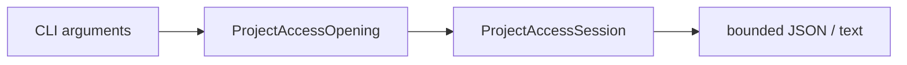

# RupaCLIKit

## Purpose and Scope

`RupaCLIKit` owns command-line parsing and result projection for the `rupa`
executable. It is a child of the [RupaKit package design](../../DESIGN.md).
ACCESS-A removes transport details from semantic status and establishes
`RupaProjectAccess` as the future command boundary. ACCESS-D owns the complete
production command cutover.

## Responsibilities and Boundaries

The module owns CLI arguments, user-facing JSON/text output, and translation of
CLI intent to an injected access API. It does not own Product/CAD/Mesh mutation,
project evaluation, package entry editing, App lifecycle, or socket placement.

Immutable live inspection includes the Product scene graph returned by the
bounded `document.sceneGraphSnapshot` Agent request. The `inspect scene-graph`
adapter exposes root ordering, node identity, source linkage, visibility, lock
state, child IDs, and local transforms from the registered workspace. It does
not request evaluated CAD/Mesh buffers, reconstruct placement from CAD-local
bounds, or introduce a second read or mutation authority.

The current direct file route remains a known transitional implementation until
ACCESS-D and is not an alternative authority accepted by this design.

## Related Designs

| Design | Relationship | Contract Used | Summary | Cautions |
|---|---|---|---|---|
| [package design](../../DESIGN.md) | parent | module boundary | Keeps parsing above project access. | Do not import project internals for mutation. |
| [RupaProjectAccess](../RupaProjectAccess/DESIGN.md) | will depend on | open/send/save/finish | Becomes the single production access port in ACCESS-D. | Mode selection is explicit and never fallback. |
| [RupaAgentProtocol](../RupaAgentProtocol/DESIGN.md) | depends on | intent/result values | Supplies command payloads. | Semantic status contains no endpoint. |
| [RupaAgentTransport](../RupaAgentTransport/DESIGN.md) | composed above | live adapter | Carries live requests internally. | Production CLI must not expose the endpoint after ACCESS-D. |

## Architecture

## Contracts and Invariants

1. CLI output projects semantic status only; it never reports a socket path.
2. Project mutation and save must be delegated to a project-access session.
3. ACCESS-D removes `.auto`, force-file bypass, production endpoint override,
   and the direct `DocumentFileService`/`EditorSession` mutation route.
4. A live dispatch with uncertain outcome is never replayed through file mode.
5. `inspect scene-graph` is a live Agent read. It carries the exact session and
   expected generation, returns a geometry-free immutable snapshot, and fails
   instead of falling back to direct file decoding.

## Runtime Flows

ACCESS-D will parse exactly `live` or explicit `file`, open one access session
under one deadline, send intent, explicitly save when requested, and finish the
access resource. ACCESS-A changes only the status projection contract.

## State, Ownership, and Lifecycle

CLI command values are short-lived. A returned access session owns its adapter
resources; the CLI owns neither the live document nor a persistent controller.

## Failure, Concurrency, and Constraints

Parsing, access, semantic, deadline, and output errors remain typed. Output is
bounded by the existing response contracts. No automatic mutation retry is
permitted after dispatch.

## Verification and Change Impact

ACCESS-A tests status projection without endpoint leakage. ACCESS-D owns full
executable syntax, retained-command parity, explicit-mode, and legacy-route
absence tests. The scene-graph adapter is verified by exact request routing,
scene-node transform/visibility JSON projection, stale-generation rejection,
and an actual bounded CLI-to-Agent process test.
