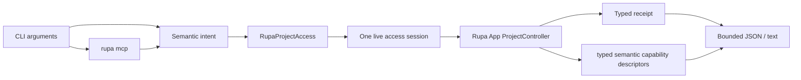
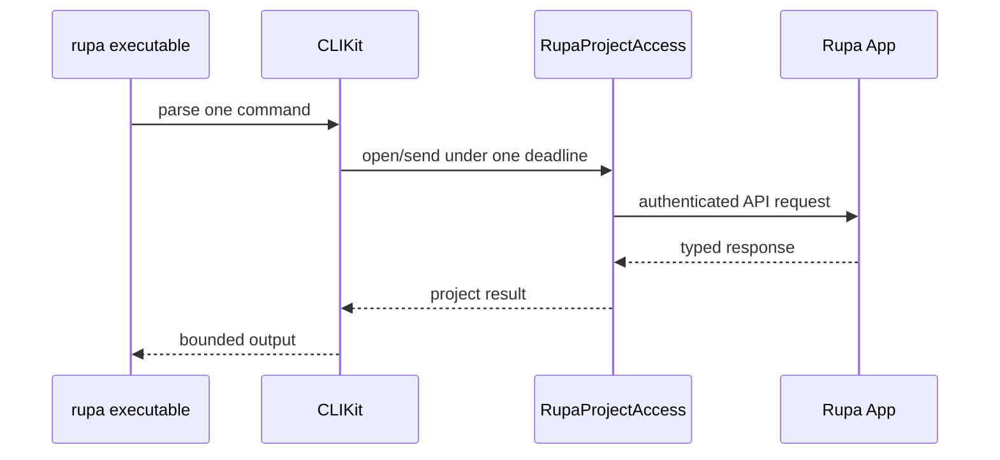

# RupaCLIKit

## Purpose and Scope

`RupaCLIKit` owns asynchronous command parsing and result projection for the
`rupa` executable. It is a child of the [RupaKit package design](../../DESIGN.md).
`RupaProjectAccess` is its only production project boundary. Children: none.

## Responsibilities and Boundaries

The module owns CLI arguments, JSON/text output, translation of intent to the
project access API, and the thin `rupa mcp` composition command. It does not own
MCP schemas or framing, project mutation, evaluation, semantic operation
schemas, program compilation, package persistence, application lifecycle, or
discovery.

CAD direct invocation and declarative programs remain one semantic vocabulary;
CLI syntax carries intent and request-local symbols only. The App allocates
persistent identifiers, validates coordinates, lowers operations, and returns
typed receipts. Mesh and viewport reads carry bounded DTOs and never expose
geometry buffers.

## Related Designs

| Design | Relationship | Contract Used | Summary | Cautions |
|---|---|---|---|---|
| [RupaKit package](../../DESIGN.md) | parent | module boundary | Keeps parsing above project authority. | Do not import project internals. |
| [RupaProjectAccess](../RupaProjectAccess/DESIGN.md) | depends on | observe/open/send/save/finish | Is the only production project port. | All requests reach the App. |
| [RupaMCP](../RupaMCP/DESIGN.md) | depends on | stdio server and access adapter contract | Hosts the six bounded MCP tools. | CLI supplies access only. |
| [RupaAgentProtocol](../RupaAgentProtocol/DESIGN.md) | depends on | typed intent/result values | Supplies semantic payloads. | Discovery is not protocol state. |
| [RupaAgentRuntime](../RupaAgentRuntime/DESIGN.md) | reached through access | semantic dispatch | Executes requests in the App workspace. | CLI does not duplicate dispatch. |
| [RupaDomainFoundation](../RupaDomainFoundation/DESIGN.md) | represented through protocol | bounded program semantics | Defines operation and program values. | CLI performs syntax validation only. |

## Architecture

## Contracts and Invariants

1. Every project command opens at most one access session and uses one
   monotonic deadline supplied by product composition. Production uses the
   shared 120-second request budget. The CLI never creates a local workspace
   or controller.
2. Mutation and evaluation are sent to the App. Save is a separate explicit
   API operation; no command edits package bytes directly.
3. Status, sessions, and capabilities observe the App without starting a
   project or creating state. `capabilities --json` preserves the App's typed
   semantic operation version, input/output schema, route/effect, and
   invocation forms without a CLI-owned CAD table.
4. Direct and composite CAD forms use the same descriptors, schemas, limits,
   and lowerers. A program is sent once and is never expanded into multiple
   external requests.
5. Discovery, credential, session, semantic, deadline, cancellation, and
   response-loss errors remain typed. A dispatched request with an unknown
   outcome is never retried.
6. CLI output contains semantic results only; endpoint, port, credential, and
   Keychain record values are never projected.
7. `rupa cad invoke` accepts one qualified operation and explicit version with
   typed arguments. `rupa cad program` reads one bounded structured semantic
   program document. Each command opens one target, takes the session's exact
   `initialAuthority`, sends exactly one semantic request, and never performs a
   coordinate pre-read, request split, automatic retry, or implicit save.
8. The public CLI has no generic raw-command or raw-batch surface. Model,
   sketch, feature, plane, surface, view, and workspace mutations use only
   their dedicated typed requests or the shared semantic operation/program
   vocabulary; removed syntax is rejected during parsing rather than lowered
   through a compatibility path.

## Runtime Flows

## State, Ownership, and Lifecycle

CLI values are short-lived. The access session owns only client resources and
its identity; the App owns workspace, controller, source, evaluation, and
package lifetime.

## Failure, Concurrency, and Constraints

Parsing, access, semantic, coordinate, deadline, cancellation, and output
errors are nonzero typed CLI results. No error selects a second authority or
silently succeeds.

## Verification and Change Impact

Tests prove async executable syntax, API injection, one-session/deadline
behavior, typed failure projection, direct/program parity, and no local
authority path. Actual CLI tests prove mutation, immutable readback, explicit
save, and restart recovery through the App.
