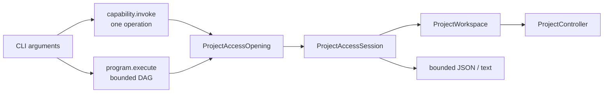

# RupaCLIKit

## Purpose and Scope

`RupaCLIKit` owns command-line parsing and result projection for the `rupa`
executable. It is a child of the [RupaKit package design](../../DESIGN.md).
ACCESS-A removes transport details from semantic status and establishes
`RupaProjectAccess` as the future command boundary. ACCESS-D owns the complete
production command cutover. CADAPI-D fixes a simple command syntax for
`capability.invoke` and a structured input syntax for `program.execute`; both
are projections of one registered CAD operation vocabulary, not separate CLI
command systems.

CADAPI-D is not yet implemented. Current raw `AutomationCommand`/
`appendFeatureGraph` exposure and legacy access paths are implementation gaps
that must be removed at cutover, not supported alternatives in this design.

## Responsibilities and Boundaries

The module owns CLI arguments, user-facing JSON/text output, and translation of
CLI intent to an injected access API. It does not own Product/CAD/Mesh mutation,
project evaluation, semantic operation schemas, program compilation, persistent
identifier allocation, presentation defaults, package entry editing, App
lifecycle, or socket placement.

A simple CAD invocation supplies one operation identifier/version and typed
arguments without a program wrapper. A complex invocation supplies a bounded
declarative program document whose nodes use the same operation
identifiers/versions and may use typed local symbols, parameters, output reuse,
and native finite-pattern operations. CLI syntax never exposes raw feature
graphs, asks callers to reserve persistent source IDs, or expands a native
pattern into repeated occurrence payloads.

Immutable live inspection includes the Product scene graph returned by the
bounded `document.sceneGraphSnapshot` Agent request. The `inspect scene-graph`
adapter exposes root ordering, node identity, source linkage, visibility, lock
state, child IDs, and local transforms from the registered workspace. It does
not request evaluated CAD/Mesh buffers, reconstruct placement from CAD-local
bounds, or introduce a second read or mutation authority.

`inspect viewport` exposes the exact immutable visible-item projection returned
by `project.viewportSnapshot`, including project coordinates, navigation IDs,
selected representation authority, world transforms and bounds, checked Mesh
counts, aggregate bounds and triangle count, and copy telemetry. It is a
live-only read and never receives geometry buffers.

The current direct file route remains a known transitional implementation until
ACCESS-D and is not an alternative authority accepted by this design.

## Related Designs

| Design | Relationship | Contract Used | Summary | Cautions |
|---|---|---|---|---|
| [package design](../../DESIGN.md) | parent | module boundary | Keeps parsing above project access. | Do not import project internals for mutation. |
| [RupaProjectAccess](../RupaProjectAccess/DESIGN.md) | will depend on | open/send/save/finish | Becomes the single production access port in ACCESS-D. | Mode selection is explicit and never fallback. |
| [RupaAgentProtocol](../RupaAgentProtocol/DESIGN.md) | depends on | intent/result values | Supplies command payloads. | Semantic status contains no endpoint. |
| [RupaAgentRuntime](../RupaAgentRuntime/DESIGN.md) | reached through access | one semantic dispatch path | Forwards either form to the single Foundation compiler, which alone normalizes direct invocation and compiles both forms through the same operation registry. | CLI and Runtime must not add a parallel recipe or lowering switch. |
| [RupaDomainFoundation](../RupaDomainFoundation/DESIGN.md) | represented through protocol | bounded declarative program semantics | Defines local references, parameters, DAG ordering, and structural limits. | CLI parses syntax only; it does not validate semantic source authority. |
| [RupaAgentTransport](../RupaAgentTransport/DESIGN.md) | composed above | live adapter | Carries live requests internally. | Production CLI must not expose the endpoint after ACCESS-D. |

## Architecture

## Contracts and Invariants

1. CLI output projects semantic status only; it never reports a socket path.
2. Project mutation and save must be delegated to a project-access session.
3. CAD source mutation exposes exactly two CLI forms. Direct invocation carries
   one operation and no local reference. Program execution carries a bounded
   source-only DAG using the same descriptors/lowerers; it cannot mix reads,
   workspace mutation, export, lifecycle, external I/O, or arbitrary code.
4. CLI owns only user syntax and request-local symbol spelling. Rupa allocates
   persistent IDs, chooses presentation/defaults, orders dependencies, validates
   and lowers operations, and returns typed output bindings in a receipt.
5. Explicit save is a separate access-session action after mutation. Neither
   invocation form implies save, and dry run, prepublication failure, uncertain
   outcome, or committed no-retry outcome is never followed by an automatic
   save or replay.
6. ACCESS-D removes `.auto`, force-file bypass, production endpoint override,
   and the direct `DocumentFileService`/`EditorSession` mutation route.
7. A live dispatch with uncertain outcome is never replayed through file mode.
8. `inspect scene-graph` is a live Agent read. It carries the exact session and
   expected generation, returns a geometry-free immutable snapshot, and fails
   instead of falling back to direct file decoding.
9. `inspect viewport` is a live Agent read with the same explicit session and
   generation fence. It prints the protocol-owned geometry-free viewport result
   and has no file fallback, mutation, save, or UI interaction path.

## Runtime Flows

ACCESS-D will parse exactly `live` or explicit `file`, open one access session
under one deadline, send either one direct operation request or one composite
program request, explicitly save only when requested, and finish the access
resource. Both mutation forms are forwarded once; the CLI neither expands a
program into multiple calls nor falls back between access modes. ACCESS-A
changes only the status projection contract.

## State, Ownership, and Lifecycle

CLI command values are short-lived. A returned access session owns its adapter
resources; the CLI owns neither the live document nor a persistent controller.

## Failure, Concurrency, and Constraints

Parsing, access, semantic, deadline, and output errors remain typed. Output is
bounded by the existing response contracts. Unknown operations/versions,
invalid values/units, duplicate or missing symbols, cycles, local-reference type
mismatch, ineligible effects, resource limits, stale coordinates,
cancellation, lowering/source/evaluation failure, and result-projection failure
remain distinguishable typed failures. No automatic mutation retry is permitted
after dispatch; a postpublication receipt carries exact committed coordinates
and must-not-retry disposition.

## Verification and Change Impact

ACCESS-A tests status projection without endpoint leakage. ACCESS-D owns full
executable syntax, retained-command parity, explicit-mode, and legacy-route
absence tests. The scene-graph adapter is verified by exact request routing,
scene-node transform/visibility JSON projection, stale-generation rejection,
and an actual bounded CLI-to-Agent process test.
The viewport adapter is verified by exact live request routing, response
projection, stale-generation preservation, and executable JSON decoding with no
serialized Mesh buffer fields.

CADAPI-D executable tests must prove a simple primitive succeeds with one direct
call, the same operation descriptor/lowerer is used inside a program, a complex
parameterized/patterned model remains compact instead of wire-expanding repeated
geometry, and one program produces at most one workspace/controller
publication. They must also prove raw graph/Automation payloads and
caller-reserved persistent IDs are absent or rejected, program errors leave the
project unchanged, and explicit save/reload succeeds through the actual CLI
access path.
