# RupaCore Source Authority Design

## Purpose and Scope

This module owns Product/CAD/Authored-Mesh source mutation, persistent source
identity allocation, and the Core-side application of a bounded Mesh edit
plan. It is a child of the
[RupaKit package design](../../DESIGN.md) and the
[system design](../../../DESIGN.md).

Dependencies used by this boundary are `RupaCoreTypes`, `RupaGeometry`,
`RupaProjectModel`, and Swift-CAD. Users include `RupaProject`, `RupaKit`, and
existing application/domain adapters through the public Core contracts.

Parent: [RupaKit package design](../../DESIGN.md). Children: none.

## Responsibilities and Boundaries

### Spatial path editing

[SpatialPathEditing](SpatialPathEditing/DESIGN.md) owns explicit planar-to-spatial
conversion and transactional edits of spatial source knots. It uses Swift-CAD's
source operations; no viewport coordinates are persisted as source geometry.

### Box Corner source

`Corner` is an exact all-edge box fillet. Core retains the visible feature ID
and scene placement, moving its original extrusion into an intermediate input
and using the visible feature for the fillet. Setting zero restores that extrusion
and removes only its unshared intermediate input. Dimension editing resolves
through this all-edge wrapper; other fillets are not editable box primitives.
The radius must be zero or greater than the modeling tolerance and strictly
below half the shortest dimension. Rejected edits publish no source or property
change. `Corner Sides` is a positive display subdivision count, not exact geometry.
Verification covers source bounds, radius-zero restoration, source dimensions,
property failure atomicity, persistence, and command history.
Core resolves display tessellation options from the current exact radius and
product subdivision count. Both modeling evaluation and the universal project
provider consume that result, so a staged evaluation can seed the published
artifact without changing its fidelity identity. Invalid quality throws before
evaluation; the existing scheduler reports it as failure.

The existing `ObjectDimensionSourceResolver` is also available within this
package for Inspector projection from a published, validated document. It is
the same resolver used by `setObjectDimension`; UI must not substitute placed
render bounds or copied object-property defaults for source dimensions. Its
read-only query throws for unsupported or unresolved source. This widens no
external API and changes no persistence or mutation authority.

`RupaCore` owns:

- server allocation of every persistent CAD, sketch-entity, Product, Scene,
  Component, Instance, and Pattern identity created by a Core command;
- high-level CAD commands that validate and atomically append exact source
  features plus their Product presentation metadata;
- materializing ID-free ordered sketch-construction values into a validated
  `Sketch` without accepting caller-minted `SketchEntityID` values;
- analytic-sphere source creation through swift-CAD's existing
  `SpherePrimitive` evaluation path;
- `DesignDocument` Product metadata and retained representation references;
- retained Authored Mesh assets and their provenance;
- source-authority target validation using only `sourceID` and expected content
  identity;
- applying one complete Mesh plan through the injected Geometry executor;
- consuming Geometry's already-validated execution without duplicating or
  replaying operation/output rules;
- replacing only the matching asset after full success and preserving all
  Product/CAD/selection/provenance values;
- semantic document validation and Core command results;
- immutable, deterministic Product scene-graph projections that expose
  identity, hierarchy, source linkage, visibility, lock state, and transforms
  without evaluating or copying CAD/Mesh geometry.
- effective scene-node visibility resolved from the Product root hierarchy;
  a hidden ancestor suppresses every descendant without deleting its source.
- object display-name mutation at the owning Product identity: ordinary scene
  nodes own their names, while a component instance owns the name mirrored by
  every scene node that references it;
- atomic publication of an imported Authored Mesh through a geometry-source
  command. The command receives an already validated `MeshSource` and its
  sanitized content provenance; Core allocates the Product source,
  representation, and Scene identities and validates the complete staged
  document. Core does not read files or parse exchange formats.

It does not own semantic CAD operation descriptors, Agent schemas, Mesh
algorithms, plan execution internals, project package I/O, project revision
publication, view projection, or Agent/CLI/MCP transport.
`SceneNodeID` and `GeometryRepresentationID` remain navigation/reference values
outside the Mesh source target; they are not required inverse references and do
not establish Mesh source authority.

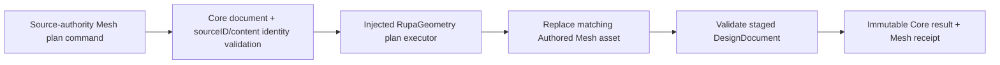

### Current baseline and T09 delta

The current Core path in
[AuthoredMeshEditCommand.swift](AuthoredMeshEditCommand.swift),
[AuthoredMeshEditTarget.swift](AuthoredMeshEditTarget.swift), and
[DefaultGeometrySourceCommandApplier.swift](DefaultGeometrySourceCommandApplier.swift)
accepts one operation and carries scene/representation IDs in its target. T09-B
replaces that public operation/target shape with one source-authority target and
one complete plan. The existing Core validation and transaction/history boundary
remain the integration point.

## Related Designs

| Design | Relationship | Contract Used | Summary | Cautions |
|---|---|---|---|---|
| [package design](../../DESIGN.md) | parent package | Package authority direction | Places Core between Geometry and Project. | Do not publish from Core directly. |
| [system design](../../../DESIGN.md) | system parent | Source identity, shared references, one-plan flow | Defines the cross-layer behavior. | Local document validation remains Core-owned. |
| [RupaGeometry design](../RupaGeometry/DESIGN.md) | depends on | Plan/executor/receipt and buffer contract | Supplies immutable result and copy telemetry. | Core must not reimplement Geometry algorithms. |
| [Swift-CAD package design](../../../swift-CAD/DESIGN.md) | depends on | Exact evaluated B-rep topology, stable subshape references, and derived Mesh | Supplies the immutable evaluation and exact solid geometry consumed by Core measurement. | Core must not repair signatures, substitute Mesh volume, or create a sphere-specific measurement path. |
| [RupaCADDomain design](../RupaCADDomain/DESIGN.md) | used by | High-level source commands and server-owned identity results | CADDomain lowers universal semantic operations to Core commands. | CADDomain may not construct persistent IDs or raw source graphs. |
| [CAD/Mesh responsibility](../../../Rupa/CAD_MESH_RESPONSIBILITY_CONTRACT.md) | depends on | Authored Mesh authority, CAD coexistence, provenance | Defines representation meaning and CAD/Mesh independence. | Do not alter CAD or selection when editing Mesh. |
| [State and project contract](../../../Rupa/STATE_AND_PROJECT_CONTRACT.md) | coordinates with | Source history and transaction staging | Project owns publication and revision. | Core results are staged values until Project commits. |
| [RupaCore tests](../../Tests/RupaCoreTests) | verification owner | Source-authority behavioral tests | Owns current/stale/shared-reference proof. | Type/shape tests alone are insufficient. |

## Architecture

CAD creation and Authored Mesh editing share the same source-authority boundary
but not the same mutation semantics:

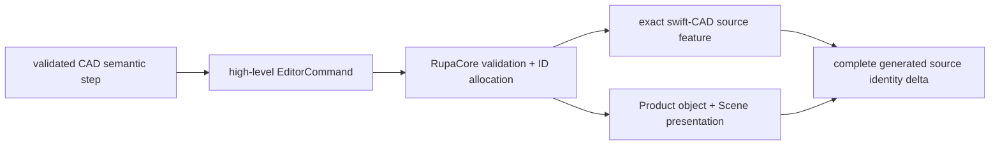

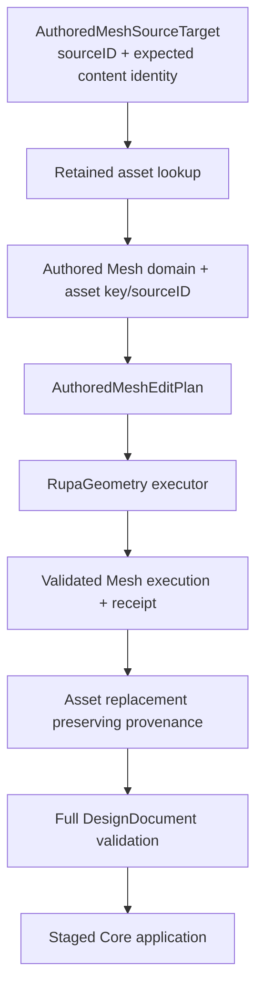

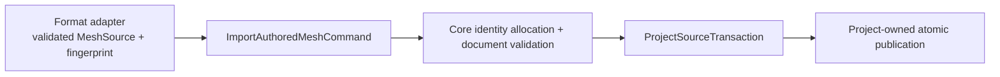

An Authored Mesh asset may be referenced by multiple Product Objects or
representations. Source editing operates on that shared asset authority, so all
retained references observe the same replacement. Core never silently makes a
unique copy to satisfy a single scene selection.

## Contracts and Invariants

### Product object naming contract

1. `renameSceneNode` changes only the normalized, nonempty name of an ordinary
   `SceneNode`. It preserves the node ID, hierarchy, reference, object,
   transform, visibility, lock, material, geometry, and every CAD feature name.
2. A scene node that represents a component instance is renamed through
   `renameComponentInstance`. The component instance is the naming authority;
   Core updates its name and every scene node whose reference or object
   descriptor names that instance in one validated mutation. Existing
   component-instance uniqueness remains in force.
3. A scene node with a retained `constructionPlaneID` is renamed through the
   existing `renameConstructionPlane` contract, which updates the construction
   source and its scene-node mirror together. A generic construction scene node
   without a retained construction-plane source remains an ordinary scene node.
4. A pattern-array root is renamed through the existing
   `updatePatternArray(name:)` contract, which updates the source and group node
   together. A generated pattern output cannot be renamed independently.
   Core returns a typed command failure instead of changing generated output
   metadata that its source will later regenerate.
5. After normalization, renaming an ordinary scene node to its current name is
   a no-op. Renaming a component instance is a no-op only when the authority and
   every reference/object scene-node mirror already carry that normalized name.
   A no-op does not advance generation, evaluate, dirty the document, or create
   undo history. A same-name component-instance request repairs inconsistent
   mirrors as one ordinary mutation rather than hiding the inconsistency.
6. A list of existing visibility or lock commands submitted as one project
   source transaction remains one isolated source-command group: all commands
   are accepted and published with one undo entry, or the staged document and
   history both roll back. Product naming does not introduce another batch or
   publication owner.

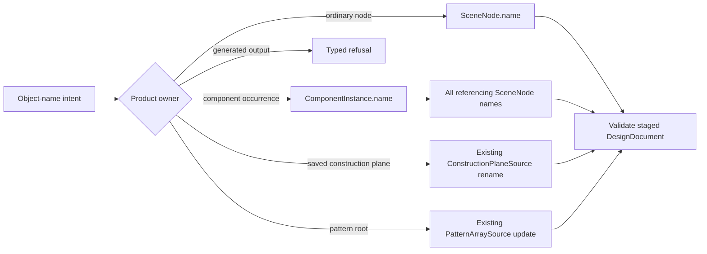

### Product hierarchy move contract

`EditorCommand.moveSceneNodes(ids:parentID:beforeSiblingID:)` is the Core
source command for Product hierarchy changes. The command owns hierarchy
validation and placement math; Outliner and drag/drop callers supply stable
IDs and do not mutate `ProductMetadata` directly.

1. `ids` must be non-empty, unique, and present in the current hierarchy.
   Descendants of another selected ID are collapsed, and the remaining
   top-level subtrees retain their current pre-order scene order. `parentID`
   is either an existing scene node or `nil`, where `nil` means the document
   root list. `beforeSiblingID` is either `nil` (append) or an actual direct
   child of that destination parent (or an actual root ID for a root drop);
   it is never a filtered-row index and cannot belong to a moved subtree.
2. A move is rejected atomically for a missing/empty selection, stale
   generation (enforced by `EditorSession`), duplicate ID, self/descendant
   cycle, invalid anchor, locked selected subtree or destination, empty root
   result, non-finite/non-affine/singular placement matrix, and any source
   authority that cannot preserve its invariants. Pattern roots and generated
   Pattern output subtrees, saved construction-plane nodes, and component
   definition source subtrees are source-owned and cannot be moved. A normal
   Product scene node that references a ComponentInstance is an occurrence
   placement and is not rejected solely for being an instance; generated
   Pattern occurrences remain source-owned through the Pattern resolver.
3. A same-parent reorder changes only the parent child/root ID arrays. Every
   selected node's `localTransform` remains bit-for-bit unchanged. A reparent
   computes each moved root's old world transform before changing hierarchy
   and assigns `newLocal = inverse(destinationWorld) * oldWorld` using the
   row-major, column-vector convention above. Descendant IDs, geometry,
   feature history, names, visibility, lock state, material, and all source
   references remain unchanged.
4. The operation stages one complete `ProductMetadata`, validates it with the
   existing document validator, and publishes it through the existing
   `CADDocumentStore`/`CommandStack` path. A successful move is one source
   mutation and one undo entry. A no-op reorder does not advance generation,
   evaluate, dirty the document, or create history. Failure leaves document,
   generation, evaluation, and history unchanged. The consumed-profile
   `ProductMetadata.nestSceneNode` helper is not a generic move implementation.

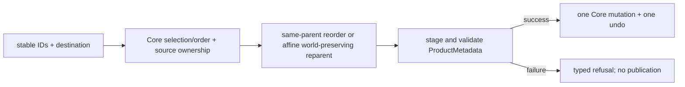

The focused Core tests own top-level selection collapse, stable source-order
multi-move, root-list moves, same-parent bit preservation, world-preserving
reparenting, cycle/anchor/lock/source-owned refusals, atomic rollback,
no-op behavior, stale generation, and one-step undo/redo.

### Product hierarchy lifecycle contract

`EditorCommand.groupSceneNodes(name:memberIDs:origin:)`,
`EditorCommand.ungroupSceneNode(id:)`,
`EditorCommand.deleteSceneNodes(ids:)`, and
`EditorCommand.transformSceneNodes(ids:worldDelta:)` are the Core source
commands for adding, removing, and placing structure in the Product hierarchy.
They complement the move contract above: a move changes which parent a node
hangs from, these change which nodes exist and where they stand. The commands
own the arithmetic and the refusals; Outliner, canvas, and menu callers supply
stable IDs and never mutate `ProductMetadata` directly.

1. `SceneNodeHierarchy` is the single read model these commands share. It is
   built from one `ProductMetadata` and answers a node's parent, its
   accumulated world transform, whether one node sits below another, and which
   members of a selection are outermost. It refuses to build on a cycle or a
   child claimed by two parents rather than skipping the offending node,
   because a placement computed from a partial tree would put geometry where
   the document does not describe it.
2. Grouping inserts one new grouping node — a node carrying neither a
   reference nor an object descriptor — under the nearest node that already
   contains every member, at the position the first member held.
   `SceneNodeGroupPlanner` rebases each member's local transform from its old
   parent into the group, so nothing appears to move. A member that already
   sits below another member is left out because it travels with its ancestor.
   `origin` places the group's own origin in world space; `nil` places it
   exactly where its parent is. `SceneNodeNameAllocator` numbers the base name
   until it is free, because a repeated name makes the browser ambiguous.
3. Ungrouping is permitted only for a grouping node. `SceneNodeUngroupPlanner`
   bakes the group's placement into every member, hands them back to the
   group's parent at the position the group held, and marks members that were
   only out of sight because the group was hidden so they stay hidden in their
   own right. Releasing the children of a body or a sketch would discard that
   geometry, which is a deletion rather than an ungrouping, and is refused.
4. A delete is never confined to what was picked. `SceneNodeDeletionPlanner`
   closes over the selection — subtrees, the features those nodes stand for,
   the features that consume them, and the rows standing for those dependents
   — and names the whole set before anything is removed, ordering children
   before parents and dependents before the features they consume so the
   document stays valid at each step. The kernel rule that a feature with
   dependents cannot be removed is kept as it stands; the plan removes the
   dependents first. The plan also names the component instances, construction
   planes, material bindings, measurements, and bridge, joined, and joined
   group curve sources that cannot outlive the removal. Roots, locked nodes,
   and Pattern array output refuse the whole delete rather than trimming it,
   because a delete that quietly skipped part of a selection would leave the
   user believing an object is gone.
5. `ProductMetadata.insertSceneNode(_:under:at:)`,
   `moveSceneNode(_:under:at:)`, and `removeSceneNode(_:)` are the tree edits
   these plans apply. They refuse a duplicate ID, a missing node or parent, an
   out-of-range insertion point, a node nested under itself or one of its own
   descendants, a move or removal of a root, and the removal of a node that
   still has children. Requiring a removal target to be childless keeps the
   helper from quietly discarding a subtree: a caller that means to keep the
   children has to say where they go first.
6. Each command stages one complete `DesignDocument`, validates it with the
   existing document validator, and publishes it through the existing
   `CADDocumentStore`/`CommandStack` path. A success is one source mutation and
   one undo entry. Failure leaves document, generation, evaluation, and history
   unchanged, and surfaces as a typed refusal the caller can report. A delete
   that reached past the selection reports how far it reached, because by the
   time the user looks, the rows that would have shown it are gone.
7. `EditorCommand.transformSceneNodes(ids:worldDelta:)` states one motion in
   world space and moves the selection as a single rigid body, so members keep
   their arrangement relative to one another however far apart they sit in the
   tree. `SceneNodeRelativeTransformPlanner` carries the motion into each
   node's own parent space before composing it with that node's local
   transform, because a node whose parent is itself rotated would otherwise
   travel along the wrong axis. A node that already sits below another node in
   the selection is left out: its ancestor carries it, and transforming it as
   well would apply the motion twice. An empty selection, a missing node, the
   scene root, Pattern array output, a non-invertible parent placement, and a
   non-finite delta are refused rather than approximated. The workspace routes
   for this command are the placement inspector and the viewport gizmo; until
   one of them submits it, the focused Core tests are its only callers.

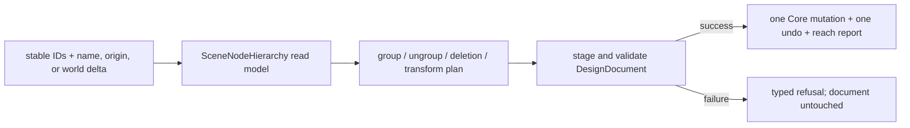

The focused Core tests own grouping placement preservation, nested-member
collapse, name allocation, ungrouping placement and visibility preservation,
non-grouping-node refusal, deletion closure over feature dependents, removal
ordering, root/locked/Pattern-output refusal, world-delta rebasing through a
rotated parent, nested-member collapse under a transform, atomic rollback, and
one-step undo/redo.

### Scene placement matrix convention

Scene and component placement use row-major `Matrix4x4` storage with column
vectors: translation is at indices 3, 7, 11 and world placement is parent times
local. This agrees with `RupaGeometry.GeometryTransform3D`, the Product bridge
and CAD semantic lowering. UI, pattern generation, analysis and legacy CAD
overlays must use this same convention. The old column-major UI convention is
removed by explicit product decision; no decoder guessing or migration fallback
is provided. Existing user files are not deleted automatically.

The placement inspector accepts finite, non-singular affine matrices, including
shear produced by world-axis scaling after rotation. Its canonical decomposition
is `T * Rz * Ry * Rx * H * S`, where H is upper triangular with unit diagonal
and dimensionless XY, XZ and YZ shear. QR decomposition fixes Y/Z scales positive
and retains reflection in signed X scale. Numeric TRS edits retain H; no
orthogonalization may discard deformation. Perspective and singular matrices
remain typed refusals. Near gimbal lock an equivalent Euler form fixes Z to zero.
Round-trip tests cover world-axis scale after rotation, reflection, shear,
numeric edits and explicit failure. Existing shear-free placements keep their
TRS interpretation and serialized matrix format unchanged.

`ModelingOperationDraftTests`, `WorkspaceTransformMatrixTests` and viewport
transform tests own UI intent and geometry agreement; signed-App verification
must confirm CAD overlays and Mesh rendering coincide after XYZ edits.

Product object-name tests own ordinary-node preservation, component-instance
mirror consistency and uniqueness, pattern-root reuse, generated-output
refusal, saved-construction-plane owner routing, true no-op behavior, mirror
repair, stale transaction refusal, grouped rollback, and undo/redo. They do not
infer successful Outliner interaction from command construction alone.

For CAD command results, Core guarantees the staged-source phase of the
[package identity-phase contract](../../DESIGN.md#cad-identity-phases). One
immutable result delta is derived from the accepted staged document and may
contain generated Feature, source body-output role, Scene Node, Component
Definition, Component Instance, and Pattern Source identities. It never
contains evaluated topology `BodyID`; evaluation and publication are not Core
command-result responsibilities. An identity absent from the accepted staged
source, a duplicate or wrong-kind identity, and an identity reported by a
failed, rolled-back, or no-op mutation are invalid.

For package-internal prepared execution, `EditorSession` exposes only the
read-only fact that its existing `CommandStack` currently owns an active source
command group. The observation cannot enter, leave, or retain the group and
does not expose the stack. It allows `RupaAutomation` to reject execution on an
ordinary session before mutation; source rollback, deferred evaluation, and the
single history entry remain owned by `withSourceCommandGroup`.

### CAD creation contract

1. `createAnalyticSphere(name:center:radius:)` is a high-level source command.
   Core validates a non-empty name, finite center, and a radius greater than the
   document tolerance, allocates the `FeatureID` and `SceneNodeID`, appends one
   `PrimitiveFeature(.sphere)` with a `.body` output, and creates one solid
   Product object with `ObjectTypeID.sphere` and a radius property. Center is
   source placement, not a duplicated Product transform. The radius property is
   read-only metadata until a dedicated source-edit command owns radius changes;
   every Product validation requires the object to reference an analytic sphere
   primitive and requires its radius to equal the resolved CAD source radius, so
   editing Product metadata alone cannot diverge from the CAD source.
2. Sphere creation is atomic across CAD and Product state. Validation,
   append, Product synchronization, or evaluation failure leaves both values
   unchanged. A successful command delta contains exactly one generated
   Feature, one `.body` source-output identity, and one Scene node; it contains
   no evaluated `BodyID`.
3. The exact evaluator remains swift-CAD's existing
   `SpherePrimitive -> PrimitiveFeatureEvaluator ->
   PrimitiveBRepRequestBuilder.sphere` path. For a valid isolated sphere it
   produces eight analytic spherical faces, twelve exact edges, six vertices,
   and analytic volume; Core must not tessellate, approximate, or substitute an
   Authored Mesh.
4. `createSemanticSketch(name:plan:geometryRole:)` accepts a
   `SketchCreationPlan` containing a plane, ordered ID-free
   `SketchCreationEntity` values, and `SketchCreationConstraint` values that
   refer to entities only by validated zero-based local indices. Core rejects
   empty/duplicate/out-of-range/self-incompatible references before source
   append, allocates one `SketchEntityID` per entity in input order, resolves
   all constraint references, then delegates to the ordinary complete-Sketch
   validation and append path.
5. The initial ID-free entity contract covers line and analytic circle; the
   relation contract covers coincident endpoint references, parallel,
   perpendicular, horizontal, vertical, equal length, concentric, and equal
   radius. Relation/entity-kind compatibility is validated in Core. These are
   universal sketch values, not benchmark-case commands.
6. A semantic sketch command reports the generated sketch Feature and Scene
   identities through the ordinary complete delta. Internal
   `SketchEntityID` values are neither request values nor CADAPI-A local
   outputs. A later program step refers to the generated sketch Feature, not
   to a fabricated entity identity.
7. Adding either command requires updating every exhaustive `EditorCommand`
   classification. Prepared Automation admits both as source commands and
   continues to reject raw `appendFeatureGraph` and caller-built `Sketch` as
   semantic Agent inputs.

### Authored Mesh edit contract

1. The Mesh edit target contains only `GeometrySourceID` and expected
   `ContentIdentity`. Scene-node and representation IDs are not part of source
   authority.
2. Public application validates the document once before dispatch. The retained
   `AuthoredMeshAsset` invariant guarantees that construction and decoding
   already validated its source and computed or verified its cached content
   identity. After document validation, Core performs one O(1) authority check:
   dictionary key, asset/source ID, identity domain, and cached content identity
   against the target. It does not revalidate or rehash the existing source. A
   CAD-derived snapshot, external observation, or arbitrary Mesh payload cannot
   be promoted by identity imitation.
3. The target may name a retained-but-unselected asset; Core does not require an
   inverse Object or representation reference to apply the edit.
4. The Core command contains one complete plan. `MeshEditPlanExecuting` returns
   an already-validated `MeshEditPlanExecution`, whose raw initializer is not
   public. Core trusts that type invariant and does not rescan the original or
   result source, validate the execution again, or duplicate output-role,
   alias, ID-lifecycle, allocation, or topology rules. It replaces the asset
   under the same source ID only after execution succeeds and the complete
   staged `DesignDocument` validates. That aggregate document validation is a
   separate Core authority boundary, not authorization for a second execution
   semantic validator.
5. Shared source references remain shared. Core does not clone the source or
   synchronize CAD, purpose selection, or representation metadata as a side
   effect.
6. CAD bytes, Product metadata, representation IDs, modeling/presentation
   selection, and Authored Mesh provenance are byte-for-byte/semantically
   invariant for a Mesh-only edit, except for the edited asset payload and its
   content identity.
7. A no-op plan preserves the asset content identity and produces a no-op result.
8. Plan receipt and copy telemetry survive the Core result boundary for Project
   staging and verification.
9. Core does not make a derived evaluation snapshot an Authored Mesh source;
   explicit Make Editable remains a separate command.
10. A scene-graph result reports Product scene nodes in deterministic ID order
    and preserves root ordering. It does not evaluate CAD/Mesh geometry, mutate
    source, or treat CAD-local body bounds as placed geometry.
11. Effective visibility is derived only from Product root reachability and each
    node's `isVisible` value. Hidden nodes and descendants remain retained source
    and navigation identities; presentation consumers omit them without deleting
    CAD features, representations, or Authored Mesh assets.

### Imported Authored Mesh contract

1. File access and format parsing remain outside Core. The import adapter must
   provide a validated `MeshSource`, an `AuthoredMeshProvenance.imported`
   identity, and a display name; the identity contains only a qualified format
   domain and content fingerprint, never an absolute path.
2. `ImportAuthoredMeshCommand` allocates one source ID, representation ID, and
   scene-node ID inside the staged Core document. It creates one body/mesh
   Product object whose modeling and presentation selections point at the same
   retained Authored Mesh representation.
3. The command rejects duplicate identities, missing root hierarchy, invalid
   imported provenance, or a document that fails complete validation. It never
   mutates the caller's document on failure and never publishes directly.
4. `ProjectSourceTransaction` runs the command through the existing geometry
   command applier. Project remains the owner of revision checks, evaluation,
   undo/redo, package encoding, and publication; a failed or cancelled import
   therefore produces no partial source or Product state.

### Feature history command contract

Feature history mutations use the existing `EditorCommand` and
`EditorSession` source-transaction boundary. Core owns candidate document
validation; `ProjectController` remains the only publication owner.

| Command | Core guarantee | Failure and history behavior |
|---|---|---|
| `setFeatureSuppression` | Changes only an existing feature and validates the complete staged `DesignDocument`; an active feature may not depend on a suppressed source. | Missing IDs and dependency-invalid suppression return typed failure with no document, generation, or history change. A same-value request is a no-op. |
| `reorderFeatureGraph(featureIDs:)` | Accepts exactly one permutation of the current feature IDs. Core validates the candidate graph's dependency direction, inputs, operation contracts, Product references, and evaluation before assigning it. | Duplicate, missing, extra, or dependency-unsafe IDs return typed `invalidGraph` failure with no partial order or history entry. A same-order request is a no-op. |
| `upsertParameter`, `renameParameter`, `deleteParameter` | Applies the existing parameter validation and pattern regeneration path atomically. | Unknown, duplicate, self-referencing, or still-referenced parameters return typed failure and restore the prior source. |

Every successful mutating history command is staged in an isolated
`EditorSession`, produces one evaluated source mutation and one command-stack
entry, and is published only by `RupaProject`. Core never publishes a candidate
or turns a failed candidate into the previous document as a success result.

### Snap topology demand contract

`SnapResolver` owns the decision to request a topology summary while resolving
object candidates. It requests the existing `TopologySnapshotService.snapshot` with
`metricPolicy: .omit` exactly when:

```text
measurementsRequireTopology(in: document)
|| (searchRadiusMeters > 0
    && document.cadDocument.hasActiveRenderableTopologyFeatures)
```

The positive-radius branch is limited to active renderable CAD topology. An
authored-mesh-only or sketch-only document therefore continues through grid,
sketch, region, and other non-topology candidates without entering whole
document topology validation. While resolving object candidates, a measurement anchor of kind
`topologyReference` or `topologyEdgeParameter` forces the existing topology
service, even when the search radius is zero or the document has no active
renderable CAD topology. `TopologySnapshotService` remains the validation and
CAD/measurement failure authority; SnapResolver adds no cache, alternate
topology path, or failure conversion of its own.

Each `resolve` runs object candidate resolution on the caller's thread, and on
a document with active renderable CAD topology the demand above reaches one
exact kernel evaluation of the whole document. One pointer event can call it
more than once: a canvas drag resolves its start and then its end. `resolve`
therefore accepts the caller's published `DocumentEvaluationContext` and
`DocumentGeneration` and forwards both to that one `snapshot` call, exactly as
`MeasurementService` and `MeshSummaryService` already forward them. The context
stays the caller's: SnapResolver neither stores nor updates it, and
`TopologySnapshotService` alone decides whether it matches. A caller that
supplies no context, or one whose generation, modeling settings, or source
identity no longer describe the document passed beside it, is answered by the
same exact evaluation as before, so the reuse cannot return topology from a
document the caller did not ask about. `SnapResolver.init` takes the
`TopologySnapshotService` it calls, so a test can hand it a service whose exact
evaluator refuses to run and read the difference between a matching context and
no context as success against failure.

### Evaluated primitive measurement contract

Every solid `PrimitiveDefinition` uses the same output-driven
`measureEvaluatedBodySolids` path as other evaluated body operations. The
resolved evaluated body is the exact B-rep volume authority; its evaluated Mesh
is used only for presentation surface area and bounds. A primitive kind is not a
reason to skip output measurement, and a missing evaluated body, Mesh, or exact
volume remains a diagnostic rather than a fabricated success.

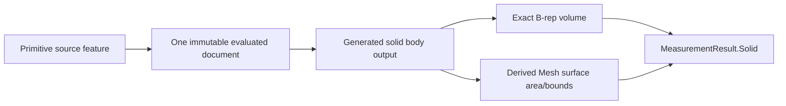

This contract preserves source feature identity, selection filtering, and
supersession behavior. It does not add a second measurement model or infer
solid geometry from source parameters.

### Body display face-run contract

`BodyDisplaySnapshot.Topology.meshFaceRuns` records which CAD face generated
each contiguous run of the snapshot's drawn triangles. It is the identity the
viewport reads when the native frame reports the triangle it hit, so the runs
are derived once with the snapshot and are never rebuilt per camera move or per
click, and no side table keyed by mesh identity exists to fall out of step with
the snapshot they describe.

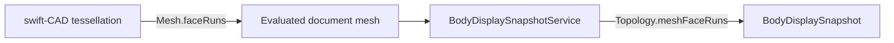

The runs are independent of `Topology.faces`. A `Face` carries the projected
outer loop a CPU polygon test needs and is absent for a face without one, while
a run needs no polygon and describes exactly the triangles the frame draws. A
face that evaluation gave no stable sub-shape identity records no run; the
omission is truthful absence, and a hit on such a triangle is reported as a miss
rather than answered with a neighbouring face. A run always carries the prepared
`SelectionComponentID`: Core never substitutes a mesh identifier for a CAD
identifier.

### Object property effect contract

Every object property declares the one effect its edit has, so a control the
Inspector offers is a control that reaches the canvas.

| Effect | Meaning | Path an edit takes |
|---|---|---|
| `source` | Rewrites the CAD feature graph, so re-evaluation changes the exact geometry | `applyObjectPropertyToSource` to a `DesignDocument` source mutation |
| `tessellation` | Changes only the display resolution the evaluator uses for that feature | `displayTessellationOptions` to `TessellationOptions.featureOverrides` |
| `appearance` | Changes only how a resolved body is presented | Presentation scene and material resolution |
| `derived` | Reports a value the source owns and cannot be authored | `synchronizeObjectPropertiesFromSource` writes it |

Invariants:

- A property whose effect is `derived` is not editable and uses the read-only
  inspector control. A property that is editable declares `source`,
  `tessellation`, or `appearance`. `ObjectPropertyDefinition.validate` rejects
  any other combination, so a schema that offers an unreachable control fails
  document validation rather than reaching a user.
- A `source` property that the router has no mutation for throws
  `EditorError(code: .commandUnsupported)`. The router never returns without
  applying the edit it accepted, because a silent return leaves the declared
  value and the evaluated geometry disagreeing with no report to the caller.
- A `tessellation` property resolves to an angular tolerance through the
  property's own subdivision meaning. Its edit changes no feature operation and
  no exact geometry, so undo of a tessellation edit restores only the property.
- Kernel concepts Rupa has no source mutation for are absent from the schema.
  They are not declared as editable properties that do nothing.

Segment counts are display resolution, not exact geometry. The kernel keeps
circles and arcs as rational arcs and derives a segment count from tolerance, so
`Sides`, `Corner Sides`, `Bevel Sides`, and `Arc Segments` reach the canvas as
the per-feature tolerances `Display tessellation resolution` below resolves,
which is the only place that mapping is defined.

A count that would subdivide a planar face or a straight generatrix declares no
property. The document is an exact B-rep, so splitting a plane into more
triangles produces the same surface and the same silhouette: the control would
move a number and change nothing on screen. This is why a cylinder declares
`Sides` for its circular section but no count along its axis, and why an
extruded rectangle declares no subdivision count.

The schema is the authority on which properties exist, so it can stop declaring
one. A document written by an earlier schema keeps the stored value until it is
loaded; `ProductMetadata.pruneUndeclaredObjectProperties` drops values no
declared property claims. Every boundary that decodes stored product metadata
runs it, against the same registry it then validates with, before validation:
`DocumentPackageStore` for a document package and
`ProjectController.assembleDocument` for a project package. Validation
therefore still rejects an undeclared property as invalid input, while an older
document opens with the stale value removed rather than being refused.

Dropping a value is a loss the person who opened the document cannot undo: the
next save writes the document without it. So the migration reports what it
dropped instead of discarding it. `pruneUndeclaredObjectProperties` returns the
dropped values as `[RetiredObjectProperty]`, one per scene node and property,
ordered by scene node and then property ID so the same document always reports
the same list. The result is not `@discardableResult`, which makes a boundary
that ignores it a compile error rather than a silent drop.

This design owns what was retired, and nothing about how it is shown. Each
decode boundary returns the list to its caller alongside the document, and the
caller that opened the document decides what to do with it. The
[RupaProject design](../RupaProject/DESIGN.md) carries the list from
`assembleDocument` to the project state snapshot, and the
[RupaUI design](../RupaUI/DESIGN.md) owns surfacing it to the person who opened
the document.

### Sketch profile source mutation

A sketch-category object declares its shape as properties, and an edit to one of
them rewrites the entities of the one sketch feature that built it. The router
dispatches on the object's type and the property's ID, not on its render
binding: arc `start.angle` and `end.angle` share `.angle`, and polygon
`sizing.radius` and `radius.is.inradius` declare no binding at all.

| Type | Source properties | Mutator | Anchor the edit keeps fixed |
|---|---|---|---|
| `line` | `length`, `angle` | `setLineSketchGeometry` | The start point |
| `arc` | `radius`, `start.angle`, `end.angle` | `setArcSketchGeometry` | The center |
| `circle` | `radius` | `setCircleSketchGeometry` | The center |
| `rectangle` | `size.x`, `size.y`, `corner.radius` | `setRectangleSketchGeometry` | The center of the bounds |
| `polygon` | `sizing.radius`, `radius.is.inradius`, `sides.x`, `angle` | `setPolygonSketchGeometry` | The center |

Each mutator reads the whole resolved property set rather than the one property
that changed, so one code path per type serves every property that type
declares, and the rebuilt sketch is the sketch those values describe.

Invariants:

- A mutator replaces the sketch feature through a single
  `CADDocument.replaceFeature`, keeping the feature's ID, inputs, and outputs.
  A value edit adds and removes no feature, so the design graph structure is
  unchanged and the evaluator rebuilds only the edited feature and what depends
  on it. This is the same shape as `setCubeDimensions`, and it is what makes a
  shape edit cost one feature rather than the document.
- Entity IDs are preserved whenever the new entity count equals the old one.
  Polygon `sides.x` is the one property that changes the count; it reuses the
  existing IDs in chain order for the sides it keeps and mints IDs only for the
  sides it adds. A dimension, bridge, or joined-curve source that referenced a
  dropped entity makes `ProductMetadata.validate` reject the edit, which is the
  visible failure the object property effect contract requires.
- A mutator that cannot express the value throws `EditorError` and leaves the
  document unchanged. `setSceneNodeObjectProperty` applies the whole edit to a
  copy and assigns it only on success, so a rejected value persists neither the
  property nor a partial rebuild.
- After the rebuild, the derived properties the source owns are recomputed:
  polygon `radius` and `side.length` follow from `sizing.radius`,
  `radius.is.inradius`, and `sides.x`, and any body extruded from the sketch has
  its size properties resynchronized through
  `synchronizeObjectPropertiesAffectedBySketch`.

Completion evidence for a shape edit is the evaluation metrics of the pass it
causes: `rebuiltFeatureCount` equals the edited sketch feature plus the features
downstream of it (1 for a bare sketch, 2 when the sketch is extruded),
`reusedFeatureCount` equals `totalFeatureCount - rebuiltFeatureCount`, and
`replayFallbackCount` is 0. The kernel mechanism that produces this is owned by
the [swift-CAD design](../../../swift-CAD/DESIGN.md); this design owns only the
in-place replacement that lets it apply.

#### The rounded rectangle profile

`corner.radius` is the second property that changes a profile's entity count.
A rectangle profile is one family, not two shapes: four axis-aligned lines named
`bottom`, `right`, `top`, and `left`, plus four corner arcs that exist only
while the radius is positive. `RectangleProfileBuilder` is the single owner of
what that family is, and every path that rebuilds a rectangle profile goes
through it, so a square profile and a rounded one are described by one piece of
code rather than two that can disagree.

Invariants the family carries:

- The four line IDs survive every edit, including the two that change the entity
  count. Arc IDs are minted when the radius goes from zero to positive, kept
  while it stays positive, and dropped when it returns to zero. This is the same
  identity rule polygon `sides.x` follows.
- The radius is either exactly zero or bounded by `r > tolerance` and
  `min(sizeX, sizeY) - 2r > tolerance`. At the upper equality two of the four
  lines have zero length and the profile is a stadium, which is the slot type's
  shape and not a rectangle's. A value outside the bound is refused with
  `EditorError(code: .commandInvalid)` and the document is unchanged, the same
  tolerance idiom `validateBoxCorner` uses for the body fillet a cube declares.
- A rounded profile carries `horizontal` on the two horizontal lines, `vertical`
  on the two vertical ones, a counter-clockwise coincident chain alternating
  `lineEnd -> arcStart` and `arcEnd -> lineStart`, and `equalRadius` chaining
  the four arcs. `SketchProfileExtractor` runs the constraint solver whenever a
  sketch declares any constraint, so a square profile's `lineEnd -> lineStart`
  coincidences left in place would bind points an arc apart and the solver would
  collapse the shape. At `r == 0` the builder emits exactly the constraint set
  `createRectangleSketchFromCorners` emits, so a profile that was rounded and is
  no longer is indistinguishable from one that never was.
- The constraint set is replaced only where the entity set changes, which is the
  edit the radius itself is part of. A reposition leaves the entity set alone,
  so it leaves the constraints alone too, and a `.fixed` reference a dimension
  placed on a side survives a resize.
- No tangency constraint is declared. The builder places the arcs tangent by
  construction, which leaves the solver a zero-residual configuration to hold;
  the polygon profile is under-constrained in the same way.

`updateRectangleSketch` preserves the radius while it repositions the corners,
so resizing a rounded rectangle keeps it rounded and a size that no longer
admits the radius is refused rather than silently squared off. Its callers that
still require a square profile are the direct-manipulation and dimension-handle
paths: solid vertex move, solid edge move, solid edge treatment, solid face
offset, sketch side dimension, and `ObjectDimensionSourceResolver`. Those map a
3D vertex or edge onto a rectangle corner, and a corner a rounded profile
replaced with an arc is not a point they can name. They refuse a rounded profile
with a typed error, which is the boundary this design draws rather than a gap.

Two paths accept the whole family: `setRectangleSketchGeometry`, which the
Inspector's rectangle shape section submits to, and `setCubeDimensions`, which
the Inspector's cube size fields submit to. The second is needed because
`createExtrudedRectangle` nests the `.rectangle` sketch node under the `.cube`
body node and only hides it, leaving it selectable and editable, so a rounded
profile is reachable underneath a cube and that cube's own size edit has to keep
working.

A rounded profile's arcs are drawn at the count `rectangle`'s own
`corner.sides` declares. Its binding is `.cornerSideSegments`, which
`DisplayTessellationArc` reads as the quarter turn one corner covers, so
`SketchArcDisplayResolution` divides each corner arc into exactly that many
segments. Until the profile could carry arcs that property named an arc the
rectangle did not have and reached nothing. How a body extruded from the profile
resolves its own mesh is owned by `Display tessellation resolution` below and is
unchanged here.

### Display tessellation resolution

`DesignDocument.displayTessellationOptions` is the single owner of the mapping
from declared subdivision counts to the `TessellationOptions` the evaluator
receives. It keys `featureOverrides` by the body object's `sourceFeatureID`,
because the kernel resolves one override per body: a body evaluates against one
`TessellationOptions`, so a count keyed to anything that is not a body reaches
no mesh.

Each object's counts govern that object's own display. A body object reads the
counts its own type schema declares. A body the source router rewrote into a
schema-less solid keeps the `profile.arc.segments` value that rewrite preserved,
and reads that instead, because the rewrite dropped the schema but not the
resolution the profile was drawn at.

A count claims the arc its binding divides, and the feature graph is the
authority on whether that arc exists:

| Binding | Arc it divides | Span | Radius |
|---|---|---|---|
| `segments.side` | The circular profile the body is swept from | `2 * .pi` | The profile circle radius, when the profile is a single circle |
| `corner.segments` | One rounded corner of the all-edge round | `.pi / 2` | The all-edge fillet radius |
| `bevel.segments` | One rounded corner of the all-edge round | `.pi / 2` | The all-edge fillet radius |

When the graph holds no such arc — a rounding radius of zero, or a body that is
not swept from a profile — the count claims nothing and the body keeps the
document's own tolerances. That is truthful absence rather than a fallback:
there is no arc for the count to divide, so no resolution it could name would
move a triangle.

A claim resolves to the tolerances the kernel's samplers read:

```
angularTolerance = span / (Double(count) - 0.5)
linearTolerance  = radius * (1 - cos(span / (2 * Double(count))))
```

The angular tolerance is what the arc sampler divides the span by, and the half
step keeps its `ceil` from returning `count + 1` for a span that lands a
floating-point step above an exact multiple. The linear tolerance is the chord
height of one segment. Cylindrical and conical sampling read only the angular
tolerance, but spherical radial sampling takes the finer of the angular
tolerance and the chord angle the linear tolerance implies, so a claim that left
the linear tolerance at the document value would subdivide the spherical patch
of a rounded corner past the count that named it. A claim whose radius the graph
does not resolve names only an angular tolerance, which is radius independent.

When more than one claim lands on one body, the finest tolerance wins. The
counts divide different arcs of the same body, and a coarse claim on one arc
does not take resolution away from a finer claim on another. An override
inherits the document's `maxEdgeLength` unchanged, because a count names an
angular resolution and says nothing about edge length. A body no claim reaches
inherits the document's tessellation options whole.

The kernel charts circular geometry one quadrant at a time and samples every
chart on its own from the body's single angular tolerance, so an arc is drawn at
a multiple of the quadrants it covers: a full turn is four lateral charts, and
one rounded corner is one. A chart sampled at a single segment is a chord that
leaves it open, so the sampler never returns fewer than two segments for a chart.
`DisplayTessellationArc` owns both facts, and the schema declares the counts they
leave:

| Arc | Quadrant charts | Lowest count | Step |
|---|---|---|---|
| Swept profile | 4 | 8 | 4 |
| All-edge round | 1 | 2 | 1 |

The Inspector therefore offers the counts the canvas draws and nothing between
them, rather than offering a count the sampler would quietly round up. A document
carrying a count the canvas cannot resolve is refused by
`ObjectPropertySet.validate(against:)`, which checks a stored value against both
the bounds and the step of its declared range, instead of being redrawn at a
count it does not name.

Sketch curve display is the second half of this contract, and it is resolved
without `TessellationOptions`. The kernel samples sketch curves through
`SketchCurveExtractor`, whose points are consumed as geometry by sweep paths,
guides, bridges and curve queries, so the resolution a sketch declares cannot be
spent by resampling the evaluated curve. The canvas draws a sketch from
`SketchDisplaySnapshot` instead, and the declared resolution reaches the canvas
as the number of segments the drawn polyline is sampled with.

A sketch object declares counts the way a body object does, and the table above
says which arc each count divides. What differs is which of those arcs the
sketch itself holds:

| Binding | An arc the sketch draws |
|---|---|
| `segments.side` | Yes: the profile a body would be swept from is the sketch |
| `corner.segments` | Yes: a rounded profile corner is drawn in the sketch plane |
| `bevel.segments` | No: the extrusion creates the bevel, and no sketch curve draws it |

A count on a binding the sketch does not hold claims nothing here, so a sketch is
never drawn at a resolution named for an arc that exists only once it is
extruded. `DisplayTessellationArc` still owns each binding's span; which of those
arcs a sketch holds is a separate judgement, because that type maps a rounded
profile corner and an extrusion bevel onto the same quadrant arc.

What separates this from the body contract is which counts are eligible, not how
eligible ones combine. A body is one mesh under one `TessellationOptions`, so
every count the object declares claims on it and the finest wins. A sketch
considers only the counts naming arcs it holds. Among those the finest governs
too, because the arcs one sketch draws are parts of a single outline and an
outline drawn at two resolutions breaks where the parts meet. A claim names an
angular resolution, and every arc the sketch draws is divided at it:

```
radiansPerSegment = arc.span / Double(count)
segmentCount      = ceil(abs(span) / radiansPerSegment)
```

An arc whose span exceeds a full turn wraps onto the circle it already drew, so
the count is bounded by the segments a full turn earns at the same resolution.
That bound is the resolution's own statement about this circle rather than a
budget imposed on it, and below a full turn it changes nothing.

A count whose arc is the whole primitive reproduces itself, so a circle
declaring sixty-four segments of a full turn is drawn with sixty-four. The same
resolution also divides a span no declaration named, which is how one count
governs a slot whose profile is a full turn while the caps it draws are half
turns. It is the resolution `displayTessellationOptions` gives the kernel for
the body swept from that sketch, so a curve and the solid it becomes are
subdivided the same way instead of at two counts that merely share a name.

A drawn arc is never divided below two segments and a closed circle never below
three, because one segment is a chord and two enclose nothing.
`SketchArcDisplayResolution` owns the resolution, those floors, and the counts
drawn where no declaration reaches a sketch, which remain the counts the frame
already draws an undeclared sketch at. An absent declaration is truthful absence
rather than a count this contract failed to deliver, and a stored count outside
its declared range never reaches the canvas at all, because
`ObjectPropertySet.validate(against:)` refuses it first.

The resolved count travels on the scene primitive itself. That placement is
owned by the
[RupaViewportScene design](../RupaViewportScene/DESIGN.md#sketch-curve-display-resolution).

### Material library authoring contract

`ProductMetadata.materialLibrary` is the only owner of authored appearance.
A scene node names a material; it does not carry color.

The appearance a node carries is one resolution and Core owns it: the material
the node names, or the document default when the node names none, or
`Material.neutral` when the document names none either. `sceneNodeAppearance(id:)`
answers with that resolution for every node the document holds, and with nothing
only when the identifier names no node at all, so the canvas, the Inspector, and
the seed of a first edit read one value rather than three copies of a chain that
could drift apart.

`authorableSceneNodeAppearance(id:)` is that same read narrowed to what a person
may edit. It answers with nothing for a node whose appearance
`setSceneNodeAppearance` refuses and otherwise with what the node carries, so a
caller offering a control only where this answers offers no control that fails.

Core owns authoring appearance through exactly one command,
`setSceneNodeAppearance`. It edits one component of the appearance one node
carries, and it rejects a value outside that component's validated domain
before mutating, so a rejected edit publishes no library change.

Creating, renaming, and removing a library entry by naming the material rather
than a node are not part of this contract. A library entry no node reaches has
no appearance to show, so the Inspector edits appearance where a person sees
it, and Core publishes no command whose only caller would be a library editor
that does not exist. A library editor, if one is ever authored, brings its own
commands and its own section in this design.

An Inspector color edit on a node with no material is an authoring intent, not a
failure: the workspace creates a material for that node and assigns it in the
same command, so the edit is a single undo step.

`setSceneNodeAppearance` is that command. It applies one component, base color
or opacity or metallic or roughness, to the material the node names, and when
the node names none it inserts one named after the node, assigns it, and applies
the component to it. Creating and assigning cannot be two commands sharing one
transaction, because a transaction fixes its commands before the first one runs
and nothing outside Core can name an identifier Core has yet to mint.

The name that command gives a material it creates is the node's own name, and
when the library already holds that name it appends the smallest integer that
makes the name unique. Two nodes may carry the same name, a library name may
not, and a library name is how a person tells two materials apart. A node
holding no name of its own names its material `Material`, suffixed the same way.

A generated pattern-array output refuses an appearance edit exactly as it
refuses `setSceneNodeMaterial`, because the pattern source owns the appearance
of everything it generates.

The material that command creates starts from the appearance the node already
carries, copied under a new identifier and a name of its own. Authoring one
component then moves that component and leaves the other three where the canvas
already had them, rather than repainting a body because its opacity was dragged.
`Material.neutral` is the end of that chain rather than a fixed seed: the copy
begins there only when neither the node nor the document names a material.

A material created for a node does not become the document default, even when it
is the first material the document holds. The default is what a node naming no
material of its own is drawn with, so promoting this one would restyle every
body the person never touched on account of an edit aimed at one of them. What
the default exists to guarantee already holds here, because the node the same
command assigns it to reaches it, and because the created material begins as a
copy of that default whenever the document holds one.

The Inspector appearance section authors the four components `Material`
declares and no fifth: base color, opacity, metallic, and roughness. Each is a
unit interval `Material.validate` owns, and a value outside it is refused before
the library changes rather than clamped into range. Which of the four the native
surface consumes is owned by the
[RupaRendering design](../RupaRendering/DESIGN.md).

The section shows those four for a node naming no material of its own as well,
because `authorableSceneNodeAppearance(id:)` answers there with what that node
carries. The values a person sees are the values the canvas already draws,
because the canvas resolves the same read, so the first edit moves a control
that was never blank and never lying.

### Executor substitution boundary

The public `DefaultGeometrySourceCommandApplier` initializer selects
`DefaultMeshEditPlanExecutor` and does not accept an external executor. A
package-scoped initializer accepts the package-scoped `MeshEditPlanExecuting`
seam for same-package composition and tests. T09 does not promise external
executor substitutability; Agent, CLI, MCP, and future provider transports use
the Core command boundary rather than injecting an executor.

Core tests may inject a package test executor that delegates to the default
executor or throws a typed failure. They do not construct malformed execution
values or test Core revalidation, because invalid candidates cannot cross the
production Geometry boundary.

## Runtime Flows

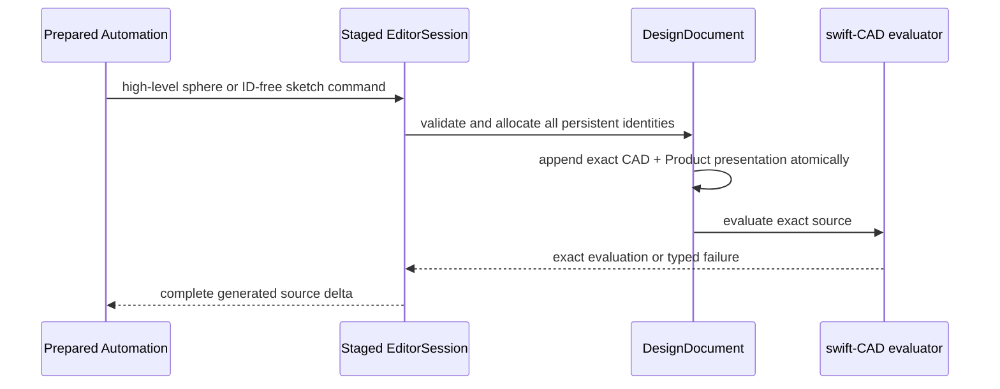

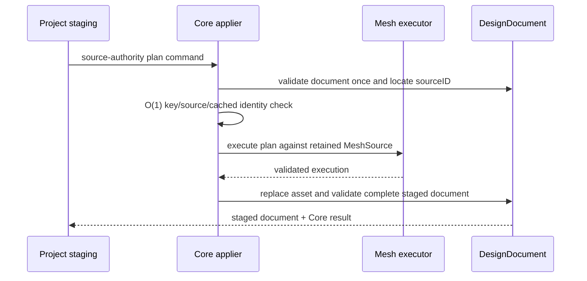

If execution or validation fails, the original document value remains unchanged.
The project layer decides whether and when the staged value is published.

## State, Ownership, and Lifecycle

- `DesignDocument` owns the retained asset dictionary and Product references.
- `DesignDocument` owns every persistent identity materialized from an ID-free
  sketch plan and the Feature/Product state created for an analytic sphere.
- `RupaGeometry` owns the temporary mutable buffer during plan execution.
- `AuthoredMeshAsset` owns published Mesh source identity, payload, and
  provenance.
- Core application results are immutable staged values and do not publish by
  themselves.
- Undo/redo and transaction revision are recorded by `EditorSession`/
  `ProjectController` around the Core application, not inside the Geometry
  executor.

## Failure, Concurrency, and Constraints

Core rejects invalid or degenerate CAD creation values, invalid ID-free sketch
indices/relations, source-domain mismatch, an asset dictionary key/source-ID mismatch,
missing asset, stale content identity, executor failure, and post-replacement
document validation failure with typed errors. It never returns the original
asset as a success fallback after a failed edit and it does not fail merely
because no inverse Object/reference is present.

The Core value path is immutable during asynchronous project staging. Any
mutable session access remains inside the existing project/session isolation
boundary. No `await`, package I/O, or external callback occurs during a Geometry
buffer borrow.

## Verification and Change Impact

T09-B owns the following behavioral proof:

| Invariant | Required evidence |
|---|---|
| Authority | Current, stale, missing, domain/key/source-ID, retained-but-unselected, and no-inverse-reference source cases. |
| Plan integration | One complete plan, receipt propagation from a validated execution, one executor invocation with no Core replay, valid create-then-delete lifecycle, no-op identity stability, and mid-plan rollback. |
| Shared source | One edited asset is visible through every retained representation reference; no implicit clone. |
| Independence | CAD/Product/selection/provenance bytes remain unchanged after Mesh edit. |
| History | One command-history entry plus undo/redo behavior. |
| Error handling | Typed failures do not publish a partial document. |
| Product visibility | Root, hidden-parent, visible-sibling, and hidden-descendant cases prove one effective-visibility result without source deletion. |
| Evaluated primitives | Box, cylinder, cone, sphere, and torus all produce evaluated-body solids with exact B-rep volume and Mesh-only area/bounds through one cached evaluation path; unavailable outputs remain diagnostics. |
| Snap topology demand | Positive-radius authored-mesh-only object resolution skips whole-document topology validation and still returns grid/non-topology candidates; topology measurement anchors force the existing validation failure during object resolution; existing CAD snap and measurement cases remain green; a matching caller evaluation context resolves object candidates on a CAD document without consulting the exact evaluator, and the same resolve without that context still consults it. |
| Body display face runs | `Tests/RupaCoreTests/BodyDisplaySnapshotServiceTests.swift` proves an evaluated box snapshot records one run per prepared face, that the runs carry the same prepared identities as `Topology.faces`, and that they partition every drawn triangle contiguously from zero to the snapshot's triangle count. |
| Display tessellation resolution | `Tests/RupaCoreTests/DisplayTessellationTests.swift` proves a declared side count is the number of turns the evaluated mesh samples the profile at, that a cylinder is drawn at its declared count instead of the document tolerance, that every count the schema offers from the lowest one up is the count the mesh draws, that a count between them is refused rather than redrawn, that a declared corner count is the number of segments the rounded corner carries, that a count naming an arc the body does not hold claims nothing, and that a rounded box resolves its corner count against the fillet radius. |
| Node appearance authoring | `Tests/RupaCoreTests/SceneNodeAppearanceTests.swift` proves that an appearance edit on a node holding no material creates one, assigns it, and leaves the document default alone; that the created material keeps the values of the three components the edit does not name, taken from the document default when the document holds one and from the neutral appearance when it does not; that `sceneNodeAppearance(id:)` resolves the node's material, then the document default, then the neutral appearance; that a second node's edit does not reuse the first node's material name; that a value outside the unit interval is refused with the library and the node unchanged; and that a generated pattern-array output refuses the edit while `sceneNodeAppearance(id:)` still answers for it. |

CADAPI-C must additionally prove:

| Invariant | Required evidence |
|---|---|
| Exact sphere | Origin and translated valid spheres retain the requested center/radius, `ObjectTypeID.sphere`, one body role, and exact 8/12/6 analytic B-Rep; zero/negative/tolerance-sized radius and nonfinite center fail without source/Product/history change. |
| Identity ownership | Repeating the same ID-free sketch plan creates distinct server-owned entity identities; no Core creation input contains `SketchEntityID`. |
| Constraint materialization | All eight supported relations materialize correctly; missing/out-of-range indices, wrong entity kinds, invalid coincident endpoints, and duplicate/self references fail atomically. |
| Command admission | Every exhaustive Core/Automation command classification handles history and CAD source commands, and raw graph/legacy caller-built Sketch does not become a semantic CAD operation. |

Changes to CAD creation, target identity, asset replacement, provenance, or
Core command decoding require rechecking `RupaAutomation`, `RupaCADDomain`,
`RupaProject` staging, and the system source-authority invariants.
