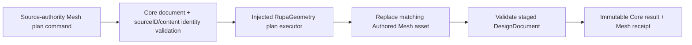
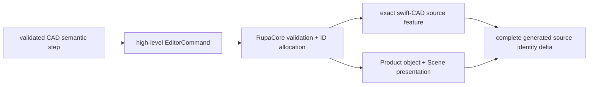
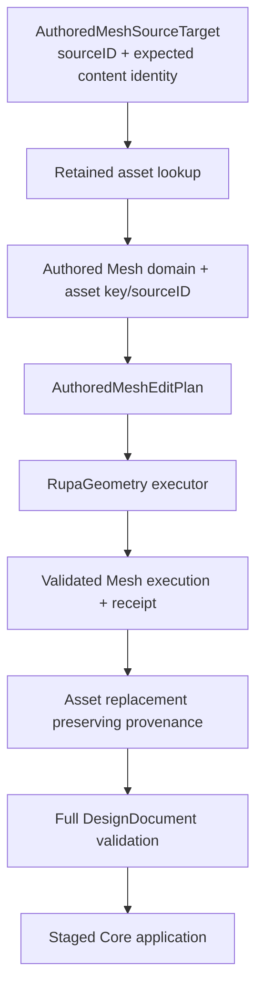
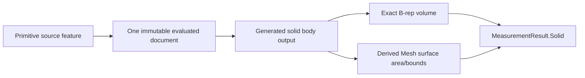
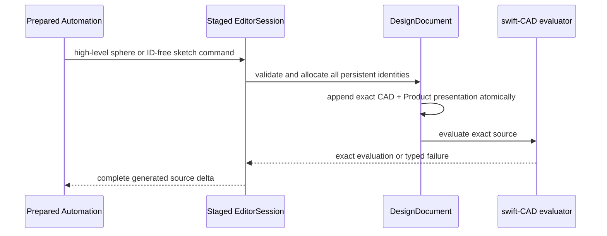
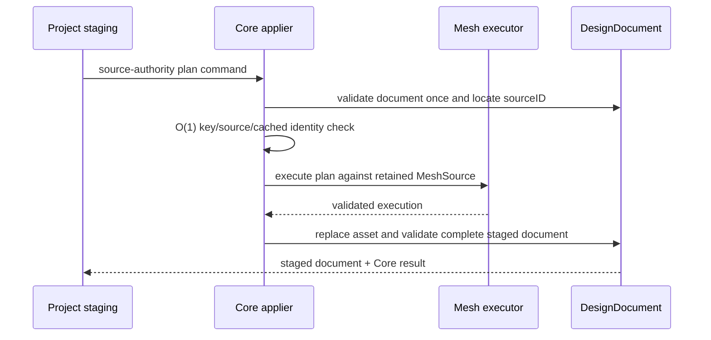

# RupaCore Source Authority Design

## Purpose and Scope

This module owns Product/CAD/Authored-Mesh source mutation, persistent source
identity allocation, and the Core-side application of a bounded Mesh edit
plan. It is a child of the
[RupaKit package design](../../DESIGN.md) and the
[system design](../../../DESIGN.md).

Dependencies used by this boundary are `RupaCoreTypes`, `RupaGeometry`,
`RupaProjectModel`, and Swift-CAD. Users include `RupaProject`, `RupaKit`, and
existing application/domain adapters through the public Core contracts.

Parent: [RupaKit package design](../../DESIGN.md). Children: none.

## Responsibilities and Boundaries

`RupaCore` owns:

- server allocation of every persistent CAD, sketch-entity, Product, Scene,
  Component, Instance, and Pattern identity created by a Core command;
- high-level CAD commands that validate and atomically append exact source
  features plus their Product presentation metadata;
- materializing ID-free ordered sketch-construction values into a validated
  `Sketch` without accepting caller-minted `SketchEntityID` values;
- analytic-sphere source creation through swift-CAD's existing
  `SpherePrimitive` evaluation path;
- `DesignDocument` Product metadata and retained representation references;
- retained Authored Mesh assets and their provenance;
- source-authority target validation using only `sourceID` and expected content
  identity;
- applying one complete Mesh plan through the injected Geometry executor;
- consuming Geometry's already-validated execution without duplicating or
  replaying operation/output rules;
- replacing only the matching asset after full success and preserving all
  Product/CAD/selection/provenance values;
- semantic document validation and Core command results;
- immutable, deterministic Product scene-graph projections that expose
  identity, hierarchy, source linkage, visibility, lock state, and transforms
  without evaluating or copying CAD/Mesh geometry.
- effective scene-node visibility resolved from the Product root hierarchy;
  a hidden ancestor suppresses every descendant without deleting its source.

It does not own semantic CAD operation descriptors, Agent schemas, Mesh
algorithms, plan execution internals, project package I/O, project revision
publication, view projection, or Agent/CLI/MCP transport.
`SceneNodeID` and `GeometryRepresentationID` remain navigation/reference values
outside the Mesh source target; they are not required inverse references and do
not establish Mesh source authority.

### Current baseline and T09 delta

The current Core path in
[AuthoredMeshEditCommand.swift](AuthoredMeshEditCommand.swift),
[AuthoredMeshEditTarget.swift](AuthoredMeshEditTarget.swift), and
[DefaultGeometrySourceCommandApplier.swift](DefaultGeometrySourceCommandApplier.swift)
accepts one operation and carries scene/representation IDs in its target. T09-B
replaces that public operation/target shape with one source-authority target and
one complete plan. The existing Core validation and transaction/history boundary
remain the integration point.

## Related Designs

| Design | Relationship | Contract Used | Summary | Cautions |
|---|---|---|---|---|
| [package design](../../DESIGN.md) | parent package | Package authority direction | Places Core between Geometry and Project. | Do not publish from Core directly. |
| [system design](../../../DESIGN.md) | system parent | Source identity, shared references, one-plan flow | Defines the cross-layer behavior. | Local document validation remains Core-owned. |
| [RupaGeometry design](../RupaGeometry/DESIGN.md) | depends on | Plan/executor/receipt and buffer contract | Supplies immutable result and copy telemetry. | Core must not reimplement Geometry algorithms. |
| [Swift-CAD package design](../../../swift-CAD/DESIGN.md) | depends on | Exact evaluated B-rep topology, stable subshape references, and derived Mesh | Supplies the immutable evaluation and exact solid geometry consumed by Core measurement. | Core must not repair signatures, substitute Mesh volume, or create a sphere-specific measurement path. |
| [RupaCADDomain design](../RupaCADDomain/DESIGN.md) | used by | High-level source commands and server-owned identity results | CADDomain lowers universal semantic operations to Core commands. | CADDomain may not construct persistent IDs or raw source graphs. |
| [CAD/Mesh responsibility](../../../Rupa/CAD_MESH_RESPONSIBILITY_CONTRACT.md) | depends on | Authored Mesh authority, CAD coexistence, provenance | Defines representation meaning and CAD/Mesh independence. | Do not alter CAD or selection when editing Mesh. |
| [State and project contract](../../../Rupa/STATE_AND_PROJECT_CONTRACT.md) | coordinates with | Source history and transaction staging | Project owns publication and revision. | Core results are staged values until Project commits. |
| [RupaCore tests](../../Tests/RupaCoreTests) | verification owner | Source-authority behavioral tests | Owns current/stale/shared-reference proof. | Type/shape tests alone are insufficient. |

## Architecture

CAD creation and Authored Mesh editing share the same source-authority boundary
but not the same mutation semantics:

An Authored Mesh asset may be referenced by multiple Product Objects or
representations. Source editing operates on that shared asset authority, so all
retained references observe the same replacement. Core never silently makes a
unique copy to satisfy a single scene selection.

## Contracts and Invariants

For CAD command results, Core guarantees the staged-source phase of the
[package identity-phase contract](../../DESIGN.md#cad-identity-phases). One
immutable result delta is derived from the accepted staged document and may
contain generated Feature, source body-output role, Scene Node, Component
Definition, Component Instance, and Pattern Source identities. It never
contains evaluated topology `BodyID`; evaluation and publication are not Core
command-result responsibilities. An identity absent from the accepted staged
source, a duplicate or wrong-kind identity, and an identity reported by a
failed, rolled-back, or no-op mutation are invalid.

For package-internal prepared execution, `EditorSession` exposes only the
read-only fact that its existing `CommandStack` currently owns an active source
command group. The observation cannot enter, leave, or retain the group and
does not expose the stack. It allows `RupaAutomation` to reject execution on an
ordinary session before mutation; source rollback, deferred evaluation, and the
single history entry remain owned by `withSourceCommandGroup`.

### CAD creation contract

1. `createAnalyticSphere(name:center:radius:)` is a high-level source command.
   Core validates a non-empty name, finite center, and a radius greater than the
   document tolerance, allocates the `FeatureID` and `SceneNodeID`, appends one
   `PrimitiveFeature(.sphere)` with a `.body` output, and creates one solid
   Product object with `ObjectTypeID.sphere` and a radius property. Center is
   source placement, not a duplicated Product transform. The radius property is
   read-only metadata until a dedicated source-edit command owns radius changes;
   every Product validation requires the object to reference an analytic sphere
   primitive and requires its radius to equal the resolved CAD source radius, so
   editing Product metadata alone cannot diverge from the CAD source.
2. Sphere creation is atomic across CAD and Product state. Validation,
   append, Product synchronization, or evaluation failure leaves both values
   unchanged. A successful command delta contains exactly one generated
   Feature, one `.body` source-output identity, and one Scene node; it contains
   no evaluated `BodyID`.
3. The exact evaluator remains swift-CAD's existing
   `SpherePrimitive -> PrimitiveFeatureEvaluator ->
   PrimitiveBRepRequestBuilder.sphere` path. For a valid isolated sphere it
   produces eight analytic spherical faces, twelve exact edges, six vertices,
   and analytic volume; Core must not tessellate, approximate, or substitute an
   Authored Mesh.
4. `createSemanticSketch(name:plan:geometryRole:)` accepts a
   `SketchCreationPlan` containing a plane, ordered ID-free
   `SketchCreationEntity` values, and `SketchCreationConstraint` values that
   refer to entities only by validated zero-based local indices. Core rejects
   empty/duplicate/out-of-range/self-incompatible references before source
   append, allocates one `SketchEntityID` per entity in input order, resolves
   all constraint references, then delegates to the ordinary complete-Sketch
   validation and append path.
5. The initial ID-free entity contract covers line and analytic circle; the
   relation contract covers coincident endpoint references, parallel,
   perpendicular, horizontal, vertical, equal length, concentric, and equal
   radius. Relation/entity-kind compatibility is validated in Core. These are
   universal sketch values, not benchmark-case commands.
6. A semantic sketch command reports the generated sketch Feature and Scene
   identities through the ordinary complete delta. Internal
   `SketchEntityID` values are neither request values nor CADAPI-A local
   outputs. A later program step refers to the generated sketch Feature, not
   to a fabricated entity identity.
7. Adding either command requires updating every exhaustive `EditorCommand`
   classification. Prepared Automation admits both as source commands and
   continues to reject raw `appendFeatureGraph` and caller-built `Sketch` as
   semantic Agent inputs.

### Authored Mesh edit contract

1. The Mesh edit target contains only `GeometrySourceID` and expected
   `ContentIdentity`. Scene-node and representation IDs are not part of source
   authority.
2. Public application validates the document once before dispatch. The retained
   `AuthoredMeshAsset` invariant guarantees that construction and decoding
   already validated its source and computed or verified its cached content
   identity. After document validation, Core performs one O(1) authority check:
   dictionary key, asset/source ID, identity domain, and cached content identity
   against the target. It does not revalidate or rehash the existing source. A
   CAD-derived snapshot, external observation, or arbitrary Mesh payload cannot
   be promoted by identity imitation.
3. The target may name a retained-but-unselected asset; Core does not require an
   inverse Object or representation reference to apply the edit.
4. The Core command contains one complete plan. `MeshEditPlanExecuting` returns
   an already-validated `MeshEditPlanExecution`, whose raw initializer is not
   public. Core trusts that type invariant and does not rescan the original or
   result source, validate the execution again, or duplicate output-role,
   alias, ID-lifecycle, allocation, or topology rules. It replaces the asset
   under the same source ID only after execution succeeds and the complete
   staged `DesignDocument` validates. That aggregate document validation is a
   separate Core authority boundary, not authorization for a second execution
   semantic validator.
5. Shared source references remain shared. Core does not clone the source or
   synchronize CAD, purpose selection, or representation metadata as a side
   effect.
6. CAD bytes, Product metadata, representation IDs, modeling/presentation
   selection, and Authored Mesh provenance are byte-for-byte/semantically
   invariant for a Mesh-only edit, except for the edited asset payload and its
   content identity.
7. A no-op plan preserves the asset content identity and produces a no-op result.
8. Plan receipt and copy telemetry survive the Core result boundary for Project
   staging and verification.
9. Core does not make a derived evaluation snapshot an Authored Mesh source;
   explicit Make Editable remains a separate command.
10. A scene-graph result reports Product scene nodes in deterministic ID order
    and preserves root ordering. It does not evaluate CAD/Mesh geometry, mutate
    source, or treat CAD-local body bounds as placed geometry.
11. Effective visibility is derived only from Product root reachability and each
    node's `isVisible` value. Hidden nodes and descendants remain retained source
    and navigation identities; presentation consumers omit them without deleting
    CAD features, representations, or Authored Mesh assets.

### Evaluated primitive measurement contract

Every solid `PrimitiveDefinition` uses the same output-driven
`measureEvaluatedBodySolids` path as other evaluated body operations. The
resolved evaluated body is the exact B-rep volume authority; its evaluated Mesh
is used only for presentation surface area and bounds. A primitive kind is not a
reason to skip output measurement, and a missing evaluated body, Mesh, or exact
volume remains a diagnostic rather than a fabricated success.

This contract preserves source feature identity, selection filtering, and
supersession behavior. It does not add a second measurement model or infer
solid geometry from source parameters.

### Executor substitution boundary

The public `DefaultGeometrySourceCommandApplier` initializer selects
`DefaultMeshEditPlanExecutor` and does not accept an external executor. A
package-scoped initializer accepts the package-scoped `MeshEditPlanExecuting`
seam for same-package composition and tests. T09 does not promise external
executor substitutability; Agent, CLI, MCP, and future provider transports use
the Core command boundary rather than injecting an executor.

Core tests may inject a package test executor that delegates to the default
executor or throws a typed failure. They do not construct malformed execution
values or test Core revalidation, because invalid candidates cannot cross the
production Geometry boundary.

## Runtime Flows

If execution or validation fails, the original document value remains unchanged.
The project layer decides whether and when the staged value is published.

## State, Ownership, and Lifecycle

- `DesignDocument` owns the retained asset dictionary and Product references.
- `DesignDocument` owns every persistent identity materialized from an ID-free
  sketch plan and the Feature/Product state created for an analytic sphere.
- `RupaGeometry` owns the temporary mutable buffer during plan execution.
- `AuthoredMeshAsset` owns published Mesh source identity, payload, and
  provenance.
- Core application results are immutable staged values and do not publish by
  themselves.
- Undo/redo and transaction revision are recorded by `EditorSession`/
  `ProjectController` around the Core application, not inside the Geometry
  executor.

## Failure, Concurrency, and Constraints

Core rejects invalid or degenerate CAD creation values, invalid ID-free sketch
indices/relations, source-domain mismatch, an asset dictionary key/source-ID mismatch,
missing asset, stale content identity, executor failure, and post-replacement
document validation failure with typed errors. It never returns the original
asset as a success fallback after a failed edit and it does not fail merely
because no inverse Object/reference is present.

The Core value path is immutable during asynchronous project staging. Any
mutable session access remains inside the existing project/session isolation
boundary. No `await`, package I/O, or external callback occurs during a Geometry
buffer borrow.

## Verification and Change Impact

T09-B owns the following behavioral proof:

| Invariant | Required evidence |
|---|---|
| Authority | Current, stale, missing, domain/key/source-ID, retained-but-unselected, and no-inverse-reference source cases. |
| Plan integration | One complete plan, receipt propagation from a validated execution, one executor invocation with no Core replay, valid create-then-delete lifecycle, no-op identity stability, and mid-plan rollback. |
| Shared source | One edited asset is visible through every retained representation reference; no implicit clone. |
| Independence | CAD/Product/selection/provenance bytes remain unchanged after Mesh edit. |
| History | One command-history entry plus undo/redo behavior. |
| Error handling | Typed failures do not publish a partial document. |
| Product visibility | Root, hidden-parent, visible-sibling, and hidden-descendant cases prove one effective-visibility result without source deletion. |
| Evaluated primitives | Box, cylinder, cone, sphere, and torus all produce evaluated-body solids with exact B-rep volume and Mesh-only area/bounds through one cached evaluation path; unavailable outputs remain diagnostics. |

CADAPI-C must additionally prove:

| Invariant | Required evidence |
|---|---|
| Exact sphere | Origin and translated valid spheres retain the requested center/radius, `ObjectTypeID.sphere`, one body role, and exact 8/12/6 analytic B-Rep; zero/negative/tolerance-sized radius and nonfinite center fail without source/Product/history change. |
| Identity ownership | Repeating the same ID-free sketch plan creates distinct server-owned entity identities; no Core creation input contains `SketchEntityID`. |
| Constraint materialization | All eight supported relations materialize correctly; missing/out-of-range indices, wrong entity kinds, invalid coincident endpoints, and duplicate/self references fail atomically. |
| Command admission | Every exhaustive Core/Automation command classification handles the two new source commands, and raw graph/legacy caller-built Sketch does not become a semantic CAD operation. |

Changes to CAD creation, target identity, asset replacement, provenance, or
Core command decoding require rechecking `RupaAutomation`, `RupaCADDomain`,
`RupaProject` staging, and the system source-authority invariants.
