# RupaCore Source Authority Design

Pattern cloning, definition identity and structure fingerprints remap feature
references only through Swift-CAD's `FeatureNode.remappingFeatureReferences`,
which owns every reference an operation carries (see the
[CADIR feature reference contract](../../../swift-CAD/Sources/CADIR/DESIGN.md#feature-references)).
Rupa remaps only its own product metadata: scene node references and
`BodySourceSectionReference`. Missing cloned dependencies fail explicitly
instead of retaining references to original features.

Body source-section metadata preserves an explicit nonnegative profile index
across encoding and decoding. Missing profile indexes are invalid payloads,
not an instruction to select region zero. The native ProfileReference owns
index validation; metadata applies that contract at both serialization
boundaries. BodySourceSectionReferenceTests owns round-trip and rejection checks.

## Purpose and Scope

This module owns Product/CAD/Authored-Mesh source mutation, persistent source
identity allocation, and the Core-side application of a bounded Mesh edit
plan. It is a child of the
[RupaKit package design](../../DESIGN.md) and the
[system design](../../../DESIGN.md).

Dependencies used by this boundary are `RupaCoreTypes`, `RupaGeometry`,
`RupaProjectModel`, and Swift-CAD. Users include `RupaProject`, `RupaKit`, and
existing application/domain adapters through the public Core contracts.

Parent: [RupaKit package design](../../DESIGN.md). Children include
[SpatialPathEditing](SpatialPathEditing/DESIGN.md) and
[TopologyEditing](TopologyEditing/DESIGN.md).

## Responsibilities and Boundaries

RupaCore composes Swift-CAD results and places them in the Product scene; it
does not re-derive or approximate kernel geometry. The owner of each geometric
capability and the migrations still in progress are recorded in the
[system kernel/application boundary](../../../DESIGN.md#kernel-and-application-boundary).

Revolve source creation consumes the shared section reference and explicit body
kind. Its transaction preserves the source and commits the feature, section
provenance and matching Solid/Surface object metadata together. Curve sections
cannot request Solid output. Sheet measurement uses evaluated BRep geometry,
not a closed-profile area or solid-volume approximation. Profile authoring
conveniences delegate to this one transaction path.

Loft preserves an ordered array of shared section references with per-section
controls. Core admits each declared profile or curve output and records the same
role in graph inputs and Product provenance. Curve input requires Sheet output;
the native evaluator owns exact span correspondence and geometric refusal.
`setLoft` replaces an existing Loft source through the same EditorCommand/store
authority, preserving its feature ID, output kind, suppression, scene identities
and appearance. Native replacement updates input dependencies; product provenance
tracks the new first section. Source validation occurs on a candidate document
before assignment. EditorSession/workspace staging owns geometric admission and
Undo/Redo. Switching Sheet/Solid during replacement is refused because it changes
the published output role; creation owns the output-kind choice.
Curve section parameter domains belong to the native feature reference and are
preserved during pattern source remapping. Product `BodySourceSectionReference`
is source identity provenance only, not the authority for reconstructing the
feature's trim controls.

`DesignDocument.modelingSectionReference(for:)` classifies a whole source for
section operations. `explicitModelingSectionReference` owns explicit selected
region/curve interpretation for all consumers, verifies component provenance,
and rejects conflicting references from the same scene source. Explicit input
precedes whole-source classification, including Sweep's section/path planning.
The resolver returns nil only when no explicit section component was selected.
Whole-source classification supports
Extrude, Revolve, Loft and Sweep selection. A valid closed sketch region is a profile; an open
sketch or explicit curve output is a curve. Only an open-profile result permits
that distinction; unit, constraint and geometry errors propagate. Explicit curve
element selections retain curve intent. Exact section evaluation remains the
authority for ambiguity, bounds and output validity.

[SceneCloning](SceneCloning/DESIGN.md) owns copying product objects: scene fragments,
their insertion at placements, and the independent-copy pattern outputs built on them.
`createPatternArrayFromSceneNodes` arrays selected objects in one command: the
objects become the array's component definition and the pattern group is placed
under the first object's parent, so the distribution is read in that frame and
every output lands where the objects are displayed. It refuses the same
selections copying refuses.

[SceneTransform](SceneTransform/DESIGN.md) owns the transform frame (pivot and
orientation), the motions Move, Rotate and Scale produce, and holding component
instances in place while their source moves.

[MeasurementPlacement](MeasurementPlacement/DESIGN.md) owns Measure Distance
dimension placement along construction-plane axes, associative anchors from snaps
and the Measurements group.

[MaterialAssignment](MaterialAssignment/DESIGN.md) owns Set, Fork and Remove
Material on selections (a group reaches the objects inside it), library material
edits, create, rename and delete, and the mass densities give measured solids.

[SceneMirror](SceneMirror/DESIGN.md) owns Mirror: the world mirror plane, the
Cut down mirror plane, Union halves and Make Instances options, and the
Swift-CAD mirror features, copies and instances they make.

[ControlPointMove](ControlPointMove/DESIGN.md) owns Move Control Point's
proportional falloff and construction-plane mirror for B-spline surface control
points (`moveSurfaceControlPointsProportionally`).

Booleans combine bodies where they are displayed: `createBoolean` takes one or
more targets and one or more tools (which Swift-CAD combines as their union) and
hands Swift-CAD every operand's rigid placement relative to the first target
(`BooleanTargetReference.placement`, `BooleanToolReference.placement`), which
Core derives from the scene and so refuses on incoming references; a relative
placement that scales, shears or mirrors is refused. Keep Tools keeps every
tool where it is displayed, placed or not. Operands are solids or sheets (the
targets all one or the other), and `targetMaterial`/`toolMaterial` say how each
side's material is taken (Swift-CAD's `BooleanMaterial`); the result's output and
object role follow Swift-CAD's `resultPort`: a sheet shown as a surface, otherwise
a solid. The result node is inserted beside the first target with the target's
local transform, so it appears where the target was. A slice publishes each
piece as an object of its own: the Boolean's multi-component result has no
object, and one Swift-CAD `extract` feature per component (`.component(index:
count:)`, the count read from the evaluated result) carries each piece's object
beside the target. A component extraction supersedes its source in measurement;
a face extraction does not. `PlacedBooleanTests` own placement and
`SheetBooleanCommandTests` sheet operands, materials and slice pieces.

Cut (`cut(name:targets:cutters:options:)`) cuts bodies, solids or sheets, with
face and curve cutters and shows every piece as an object of its own. Each
cutter becomes a sheet kept by a hidden object placed where the cutter is: a face
through an `extract` of it, curves through a sheet extrusion along their plane's
normal or `CutOptions.direction` (the view direction), after a `curveExtend` of
both ends when `extendsCurves`, its extent spanning the targets' enclosing boxes
along that direction with a margin. The targets are sliced by the first cutter
with the cutter's material Inside, that slice (a hidden object at the first
target's placement) by the next, and the last slice's pieces are extracted.
`CutCommandTests` own normal and slanted curve cuts, Extend, face cutters and
several cutters in turn.

Face offset operates in the source profile frame. Moving the start cap compensates
placement along the transformed sketch normal, keeping the opposite cap fixed on
every construction plane. Cylinder wall offsets retain the center and change the
radius. Plane and transformed-placement regression tests own this invariant.

### Spatial path editing

Authored B-spline trim retains its original surface feature as the CV/knot edit
authority while the same scene occurrence presents the current trim output.
`surfaceControlSourceFeatureID(for:)` owns this distinction for summary and
viewport consumers. Trim removal restores the source presentation atomically;
dependent features prevent removal rather than being silently rewired.

[SpatialPathEditing](SpatialPathEditing/DESIGN.md) owns explicit planar-to-spatial
conversion and transactional edits of spatial source knots. It uses Swift-CAD's
source operations; no viewport coordinates are persisted as source geometry.

### All-edge corner source

`Corner` is an exact all-edge fillet of the prism a profile extrudes. Core
retains the visible feature ID and scene placement, moving its original
extrusion into an intermediate input and using the visible feature for the
fillet. Setting zero restores that extrusion and removes only its unshared
intermediate input. Dimension editing resolves through this all-edge wrapper;
other fillets are not editable primitives. The radius must be zero or greater
than the modeling tolerance, and the prism must have room for it. Each prism
family states its own bound, in the terms the profile is authored in:

| Prism | Profile Core recognizes | Bound |
|---|---|---|
| Box | Axis-aligned rectangle, square corners | every side leaves `side - 2r > tolerance` |
| Cylinder | One circle | `radius - 2r > tolerance` |
| Regular N-gon prism | Closed chain of N equal sides turning `2pi / N` one way | every side leaves `side - 2r * tan(pi / N) > tolerance` |
| Stadium prism | Two parallel equal lines closed by two half-turn arcs of one radius | `capRadius - 2r > tolerance` |

Every family with a body also leaves `height - 2r > tolerance`. A cylinder is
bounded by half its own radius rather than by half its diameter, because its rim
rides a torus whose center circle `radius - r` must clear its own tube `r`; a
stadium's caps ride the same torus, which is why their bound has the same shape.
A polygon's straight sides are bounded instead by the corner turn they pay for,
and at `N = 4` that expression is the box bound, which is the same solid the
kernel builds for a square. The general statements these four specialize are
owned by the [CADModeling design](../../../swift-CAD/Sources/CADModeling/DESIGN.md);
no single formula states them all, so every caller resolves which prism it holds
before it validates. Core owns the maximum the
Inspector offers: `maximumAllEdgeCornerRadius` reports one tolerance inside the
bound the kernel refuses, so the end of a control bound by it is always an edit
that applies. Rejected edits publish no source or property change. `Corner
Sides` is a positive display subdivision count, not exact geometry.
Verification covers source bounds, radius-zero restoration, source dimensions,
property failure atomicity, persistence, and command history.
Core resolves display tessellation options from the current exact radius and
product subdivision count. Both modeling evaluation and the universal project
provider consume that result, so a staged evaluation can seed the published
artifact without changing its fidelity identity. Invalid quality throws before
evaluation; the existing scheduler reports it as failure.

The existing `ObjectDimensionSourceResolver` is also available within this
package for Inspector projection from a published, validated document. It is
the same resolver used by `setObjectDimension`; UI must not substitute placed
render bounds or copied object-property defaults for source dimensions. Its
read-only query throws for unsupported or unresolved source. This widens no
external API and changes no persistence or mutation authority.

Before that resolver, `ObjectFeatureDimension` answers for dimensions a body's
own feature carries: a sphere object or face offers Diameter (primary) and
Radius from its primitive, and a face a fillet made offers Fillet Radius. The
kernel lineage names the fillet face: it is `merged` from the faces beside the
rounded edge (or `generated`), while every other face of the filleted body is
`preserved` or `split` from one parent and so offers no fillet entry.
`setObjectDimension` writes these through the same feature (the sphere radius,
kept in step with the object's `radius` property, or the fillet radius). A
selected rectangle sketch side offers the rectangle's Width and Height, each
edited through the side that runs along it; an edge a body generated from that
rectangle keeps its line Length and Angle.

#### What the kernel's all-edge fillet accepts

`AllEdgeFilletBuilder` routes on surface kind, because a box and a circular
cylinder carry identical topology counts. `RoundedBoxFilletBuilder` accepts an
orthogonal box: eight vertices, twelve straight edges, six planar rectangular
faces, mutually orthogonal spans, `r > tolerance`, and every side
`- 2r > tolerance`. `RoundedCylinderFilletBuilder` accepts a circular cylinder:
four lateral faces on one cylindrical surface, two planar caps perpendicular to
its axis, `r > tolerance`, `radius - 2r > tolerance`, and `height - 2r >
tolerance`. Its rim is a torus of major radius `radius - r` and minor radius
`r`, which the kernel represents only while the center circle clears the tube,
so half the cylinder radius is the ceiling and a capsule is outside the domain.
`RoundedPrismFilletBuilder` takes every other body: a convex prism whose cap
profile is one closed loop of straight segments and tangent circular arcs, each
lateral face a plane containing its segment or a cylinder coaxial with its arc.
It refuses a reflex corner, a corner either of whose sides is an arc, and an arc
sweeping more than half a turn.
Anything outside all three domains it refuses, and it refuses at evaluation.
`CADDocument.replaceFeature` does not evaluate, so a corner accepted on another
prism commits a document that no longer evaluates and surfaces later at the
topology snapshot, with no report at the edit that caused it. Core therefore
owns the precondition: `setBoxCorner` refuses a positive radius unless the
feature it wraps extrudes one of the four profiles the prism table above names,
and it refuses with `EditorError(code: .commandInvalid)` before it mutates
anything.
Core recognizes those four from the sketch entities rather than from the object
properties beside them, in the order circle, rectangle, regular polygon,
stadium; a square polygon drawn on the axes is therefore recognized as a
rectangle, which is harmless because the two bounds agree and the kernel routes
that body to its box builder anyway. Recognizing a narrower family than the
kernel admits is deliberate: Core would otherwise have to re-derive the kernel's
profile walk to know what it may commit. Setting zero is always accepted before
any recognition runs, because unwrapping is what repairs such a document and a
profile outside the four still has to be able to clear its own bevel.

Measured against every profile family the schema declares a rounding property
for:

| Body | All-edge fillet | Evaluated faces |
|---|---|---|
| Rectangle prism, square corners | Built | 6 -> 26 |
| Rectangle prism, rounded profile | Refused: `The profile is already rounded, so its box has no edges left to round.` | — |
| Cylinder | Built | 6 -> 14 |
| Regular N-gon prism | Built | N + 2 -> 6N + 2 |
| Slot prism along one straight segment | Built | 8 -> 20 |
| Slot prism along an arc, a polyline, a mixed chain, or a spline | Refused: `Rounding every edge requires a box, a cylinder, a regular polygon prism, or a slot along one straight segment.` | — |

A slot is the offset of whatever path it was built from, so only the slot along
a single straight segment is a stadium. The offset of a polyline turns one way
on one side and the other way on the other, and the offset of an arc has a
concave inner boundary, so neither is convex and neither is admitted.

#### One fillet, two views

The fillet feature is the single truth of how rounded a body is. Two properties
name it: the body object's `corner.radius`, which `.cube` and `.cylinder`
declare, and the profile object's `bevel`, which every profile type declares.
Both route to `setBoxCorner`, and both are resynchronized from `boxCornerRadius`
after it returns, so the Inspector cannot show one value on the body and a
different one on the profile nested underneath it.

| View | Declared on | Path |
|---|---|---|
| `corner.radius` | `.cube` and `.cylinder` body objects | `applyBodyObjectPropertyToSource` -> `setBoxCorner` |
| `bevel` | `.rectangle`, `.circle`, `.polygon`, and `.slot` sketch objects | `setProfileBevel` -> `setBoxCorner` |

Only a rectangle and a circle have both views. The extrusion of a polygon or a
slot is given no object type, so its body carries no schema and no
`corner.radius`, and the profile's `bevel` is the whole of that fillet's
presentation. The resynchronization needs no case for this: it writes
`corner.radius` only where a typed body object declares it and finds none.

A profile with no extruded body yet keeps its `bevel` as latent state: the value
is validated against the profile's own cross-section and applied by the
extrusion that creates the body, which is the order independence `extrusion`
itself has. A profile that builds more than one body refuses the edit rather
than guessing which box the bevel means. Zero is accepted on any profile,
recognized or not, before the family is resolved, so a slot along a spline can
always be returned to unbevelled.

The bound the Inspector offers a `bevel` control is the body's
`maximumAllEdgeCornerRadius`, the same value `corner.radius` is bound by, and it
is published for every profile whose one extruded body has a bound. A latent
`bevel` is offered no bound, because the height half of it does not exist yet;
it is still validated on submission against the cross-section alone.

Because the wrapper keeps the visible feature ID and moves the extrusion into a
hidden input, every path that reads or replaces that extrusion resolves through
`boxExtrusionFeatureID`, and every path that names a body for a scene node uses
the visible ID. Setting a sketch's `extrusion`, removing the body that sketch
generated, and resynchronizing a body's size properties after its profile
changed all go through that mapping; without it the first fails on a feature
that is no longer an extrude, the second orphans the hidden extrusion, and the
third silently updates nothing. Changing the extrusion distance revalidates the
corner against the new depth before mutating, so a depth that no longer admits
the radius is refused instead of committing a box the kernel will reject. The
cross-section is revalidated the same way: `setCylinderDimensions` and a circle
profile's `radius` both refuse a value that would leave the wrapper's radius at
or above the new cylinder radius.

`RupaCore` owns:

- server allocation of every persistent CAD, sketch-entity, Product, Scene,
  Component, Instance, and Pattern identity created by a Core command;
- high-level CAD commands that validate and atomically append exact source
  features plus their Product presentation metadata;
- materializing ID-free ordered sketch-construction values into a validated
  `Sketch` without accepting caller-minted `SketchEntityID` values;
- analytic-sphere source creation through swift-CAD's existing
  `SpherePrimitive` evaluation path;
- `DesignDocument` Product metadata and retained representation references;
- retained Authored Mesh assets and their provenance;
- source-authority target validation using only `sourceID` and expected content
  identity;
- applying one complete Mesh plan through the injected Geometry executor;
- consuming Geometry's already-validated execution without duplicating or
  replaying operation/output rules;
- replacing only the matching asset after full success and preserving all
  Product/CAD/selection/provenance values;
- semantic document validation and Core command results;
- immutable, deterministic Product scene-graph projections that expose
  identity, hierarchy, source linkage, visibility, lock state, and transforms
  without evaluating or copying CAD/Mesh geometry.
- effective scene-node visibility resolved from the Product root hierarchy;
  a hidden ancestor suppresses every descendant without deleting its source.
- object display-name mutation at the owning Product identity: ordinary scene
  nodes own their names, while a component instance owns the name mirrored by
  every scene node that references it;
- atomic publication of an imported Authored Mesh through a geometry-source
  command. The command receives an already validated `MeshSource` and its
  sanitized content provenance; Core allocates the Product source,
  representation, and Scene identities and validates the complete staged
  document. Core does not read files or parse exchange formats.

It does not own semantic CAD operation descriptors, Agent schemas, Mesh
algorithms, plan execution internals, project package I/O, project revision
publication, view projection, or Agent/CLI/MCP transport.
`SceneNodeID` and `GeometryRepresentationID` remain navigation/reference values
outside the Mesh source target; they are not required inverse references and do
not establish Mesh source authority.

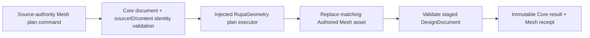
```mermaid
flowchart LR
    Command["Source-authority Mesh plan command"] --> Validate["Core document + sourceID/content identity validation"]
    Validate --> Execute["Injected RupaGeometry plan executor"]
    Execute --> Replace["Replace matching Authored Mesh asset"]
    Replace --> Document["Validate staged DesignDocument"]
    Document --> Result["Immutable Core result + Mesh receipt"]
```

### Current baseline and T09 delta

The current Core path in
[AuthoredMeshEditCommand.swift](AuthoredMeshEditCommand.swift),
[AuthoredMeshEditTarget.swift](AuthoredMeshEditTarget.swift), and
[DefaultGeometrySourceCommandApplier.swift](DefaultGeometrySourceCommandApplier.swift)
accepts one operation and carries scene/representation IDs in its target. T09-B
replaces that public operation/target shape with one source-authority target and
one complete plan. The existing Core validation and transaction/history boundary
remain the integration point.

## Related Designs

| Design | Relationship | Contract Used | Summary | Cautions |
|---|---|---|---|---|
| [package design](../../DESIGN.md) | parent package | Package authority direction | Places Core between Geometry and Project. | Do not publish from Core directly. |
| [system design](../../../DESIGN.md) | system parent | Source identity, shared references, one-plan flow | Defines the cross-layer behavior. | Local document validation remains Core-owned. |
| [RupaGeometry design](../RupaGeometry/DESIGN.md) | depends on | Plan/executor/receipt and buffer contract | Supplies immutable result and copy telemetry. | Core must not reimplement Geometry algorithms. |
| [Swift-CAD package design](../../../swift-CAD/DESIGN.md) | depends on | Exact evaluated B-rep topology, stable subshape references, and derived Mesh | Supplies the immutable evaluation and exact solid geometry consumed by Core measurement. | Core must not repair signatures, substitute Mesh volume, or create a sphere-specific measurement path. |
| [RupaCADDomain design](../RupaCADDomain/DESIGN.md) | used by | High-level source commands and server-owned identity results | CADDomain lowers universal semantic operations to Core commands. | CADDomain may not construct persistent IDs or raw source graphs. |
| [CAD/Mesh responsibility](../../../Rupa/CAD_MESH_RESPONSIBILITY_CONTRACT.md) | depends on | Authored Mesh authority, CAD coexistence, provenance | Defines representation meaning and CAD/Mesh independence. | Do not alter CAD or selection when editing Mesh. |
| [State and project contract](../../../Rupa/STATE_AND_PROJECT_CONTRACT.md) | coordinates with | Source history and transaction staging | Project owns publication and revision. | Core results are staged values until Project commits. |
| [RupaCore tests](../../Tests/RupaCoreTests) | verification owner | Source-authority behavioral tests | Owns current/stale/shared-reference proof. | Type/shape tests alone are insufficient. |

## Architecture

CAD creation and Authored Mesh editing share the same source-authority boundary
but not the same mutation semantics:

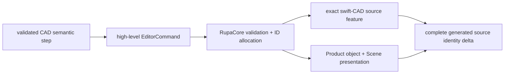
```mermaid
flowchart LR
    Semantic["validated CAD semantic step"] --> Command["high-level EditorCommand"]
    Command --> Core["RupaCore validation + ID allocation"]
    Core --> CAD["exact swift-CAD source feature"]
    Core --> Product["Product object + Scene presentation"]
    CAD --> Delta["complete generated source identity delta"]
    Product --> Delta
```

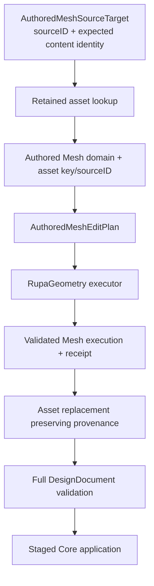
```mermaid
flowchart TD
    Target["AuthoredMeshSourceTarget\nsourceID + expected content identity"] --> Lookup["Retained asset lookup"]
    Lookup --> AssetCheck["Authored Mesh domain + asset key/sourceID"]
    AssetCheck --> Plan["AuthoredMeshEditPlan"]
    Plan --> Executor["RupaGeometry executor"]
    Executor --> Execution["Validated Mesh execution + receipt"]
    Execution --> Asset["Asset replacement preserving provenance"]
    Asset --> Validate["Full DesignDocument validation"]
    Validate --> Application["Staged Core application"]
```

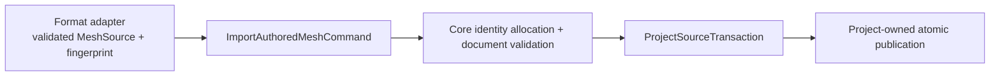
```mermaid
flowchart LR
    Exchange["Format adapter\nvalidated MeshSource + fingerprint"] --> Import["ImportAuthoredMeshCommand"]
    Import --> Core["Core identity allocation + document validation"]
    Core --> Project["ProjectSourceTransaction"]
    Project --> Publication["Project-owned atomic publication"]
```

An Authored Mesh asset may be referenced by multiple Product Objects or
representations. Source editing operates on that shared asset authority, so all
retained references observe the same replacement. Core never silently makes a
unique copy to satisfy a single scene selection.

## Contracts and Invariants

Extrude section authoring routes profile and curve inputs through the same
transaction in `DesignDocument+Solid`. The source reference determines the input
port and retained object provenance. Curve sheets never enter primitive profile
dimension/corner adapters or closed-profile display shortcuts. Sheet measurements
come from evaluated BRep, before any sketch profile recognition. Source and
product publication remain atomic on failure.

Surface Creation uses the existing EditorCommand and document transaction
boundary. `extrudeProfile.resultKind` is retained in the native Extrude feature:
solid outputs declare `.body`/`.solid`, sheet outputs declare `.sheet`/`.surface`.
Both consume the same referenced closed profile. Sheet generation removes caps
in the native B-rep builder, not in presentation. Invalid amounts or profiles
retain the existing evaluation failure/rollback contract. See the operation
inventory in [Modeling](../RupaUI/Modeling/DESIGN.md#surface-creation-foundation).
Sweep selection admits one distinct profile section; multiple profiles are a
typed refusal rather than silently choosing the first. Loft owns that input.

### Product object naming contract

1. `renameSceneNode` changes only the normalized, nonempty name of an ordinary
   `SceneNode`. It preserves the node ID, hierarchy, reference, object,
   transform, visibility, lock, material, geometry, and every CAD feature name.
2. A scene node that represents a component instance is renamed through
   `renameComponentInstance`. The component instance is the naming authority;
   Core updates its name and every scene node whose reference or object
   descriptor names that instance in one validated mutation. Existing
   component-instance uniqueness remains in force.
3. A scene node with a retained `constructionPlaneID` is renamed through the
   existing `renameConstructionPlane` contract, which updates the construction
   source and its scene-node mirror together. A generic construction scene node
   without a retained construction-plane source remains an ordinary scene node.
4. A pattern-array root is renamed through the existing
   `updatePatternArray(name:)` contract, which updates the source and group node
   together. A generated pattern output cannot be renamed independently.
   Core returns a typed command failure instead of changing generated output
   metadata that its source will later regenerate.
5. After normalization, renaming an ordinary scene node to its current name is
   a no-op. Renaming a component instance is a no-op only when the authority and
   every reference/object scene-node mirror already carry that normalized name.
   A no-op does not advance generation, evaluate, dirty the document, or create
   undo history. A same-name component-instance request repairs inconsistent
   mirrors as one ordinary mutation rather than hiding the inconsistency.
6. A list of existing visibility or lock commands submitted as one project
   source transaction remains one isolated source-command group: all commands
   are accepted and published with one undo entry, or the staged document and
   history both roll back. Product naming does not introduce another batch or
   publication owner.

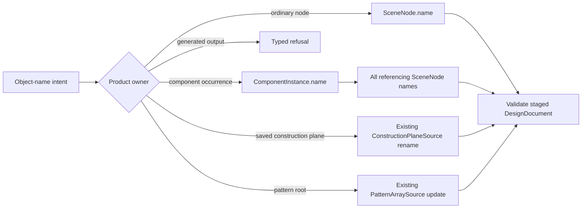
```mermaid
flowchart LR
    Intent["Object-name intent"] --> Classify{"Product owner"}
    Classify -->|ordinary node| Node["SceneNode.name"]
    Classify -->|component occurrence| Instance["ComponentInstance.name"]
    Instance --> Mirrors["All referencing SceneNode names"]
    Classify -->|saved construction plane| Plane["Existing ConstructionPlaneSource rename"]
    Classify -->|pattern root| Pattern["Existing PatternArraySource update"]
    Classify -->|generated output| Refuse["Typed refusal"]
    Node --> Validate["Validate staged DesignDocument"]
    Mirrors --> Validate
    Plane --> Validate
    Pattern --> Validate
```

### Product hierarchy move contract

`EditorCommand.moveSceneNodes(ids:parentID:beforeSiblingID:)` is the Core
source command for Product hierarchy changes. The command owns hierarchy
validation and placement math; Outliner and drag/drop callers supply stable
IDs and do not mutate `ProductMetadata` directly.

1. `ids` must be non-empty, unique, and present in the current hierarchy.
   Descendants of another selected ID are collapsed, and the remaining
   top-level subtrees retain their current pre-order scene order. `parentID`
   is either an existing scene node or `nil`, where `nil` means the document
   root list. `beforeSiblingID` is either `nil` (append) or an actual direct
   child of that destination parent (or an actual root ID for a root drop);
   it is never a filtered-row index and cannot belong to a moved subtree.
2. A move is rejected atomically for a missing/empty selection, stale
   generation (enforced by `EditorSession`), duplicate ID, self/descendant
   cycle, invalid anchor, locked selected subtree or destination, empty root
   result, non-finite/non-affine/singular placement matrix, and any source
   authority that cannot preserve its invariants. Pattern roots and generated
   Pattern output subtrees, saved construction-plane nodes, and component
   definition source subtrees are source-owned and cannot be moved. A normal
   Product scene node that references a ComponentInstance is an occurrence
   placement and is not rejected solely for being an instance; generated
   Pattern occurrences remain source-owned through the Pattern resolver.
3. A same-parent reorder changes only the parent child/root ID arrays. Every
   selected node's `localTransform` remains bit-for-bit unchanged. A reparent
   computes each moved root's old world transform before changing hierarchy
   and assigns `newLocal = inverse(destinationWorld) * oldWorld` using the
   row-major, column-vector convention above. Descendant IDs, geometry,
   feature history, names, visibility, lock state, material, and all source
   references remain unchanged.
4. The operation stages one complete `ProductMetadata`, validates it with the
   existing document validator, and publishes it through the existing
   `CADDocumentStore`/`CommandStack` path. A successful move is one source
   mutation and one undo entry. A no-op reorder does not advance generation,
   evaluate, dirty the document, or create history. Failure leaves document,
   generation, evaluation, and history unchanged. The consumed-profile
   `ProductMetadata.nestSceneNode` helper is not a generic move implementation.

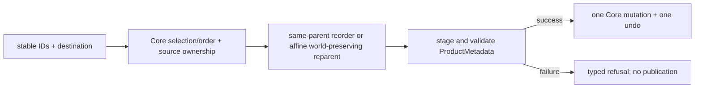
```mermaid
flowchart LR
    Intent["stable IDs + destination"] --> Classify["Core selection/order + source ownership"]
    Classify --> Placement["same-parent reorder or affine world-preserving reparent"]
    Placement --> Validate["stage and validate ProductMetadata"]
    Validate -->|success| Commit["one Core mutation + one undo"]
    Validate -->|failure| Refuse["typed refusal; no publication"]
```

The focused Core tests own top-level selection collapse, stable source-order
multi-move, root-list moves, same-parent bit preservation, world-preserving
reparenting, cycle/anchor/lock/source-owned refusals, atomic rollback,
no-op behavior, stale generation, and one-step undo/redo.

### Product hierarchy lifecycle contract

`EditorCommand.groupSceneNodes(name:memberIDs:origin:)`,
`EditorCommand.ungroupSceneNode(id:)`,
`EditorCommand.deleteSceneNodes(ids:)`, and
`EditorCommand.transformSceneNodes(ids:worldDelta:compensatingInstances:)` are the Core source
commands for adding, removing, and placing structure in the Product hierarchy.
They complement the move contract above: a move changes which parent a node
hangs from, these change which nodes exist and where they stand. The commands
own the arithmetic and the refusals; Outliner, canvas, and menu callers supply
stable IDs and never mutate `ProductMetadata` directly.

1. `SceneNodeHierarchy` is the single read model these commands share. It is
   built from one `ProductMetadata` and answers a node's parent, its
   accumulated world transform, whether one node sits below another, and which
   members of a selection are outermost. It refuses to build on a cycle or a
   child claimed by two parents rather than skipping the offending node,
   because a placement computed from a partial tree would put geometry where
   the document does not describe it.
2. Grouping inserts one new grouping node — a node carrying neither a
   reference nor an object descriptor — under the nearest node that already
   contains every member, at the position the first member held.
   `SceneNodeGroupPlanner` rebases each member's local transform from its old
   parent into the group, so nothing appears to move. A member that already
   sits below another member is left out because it travels with its ancestor.
   `origin` places the group's own origin in world space; `nil` places it
   exactly where its parent is. `SceneNodeNameAllocator` numbers the base name
   until it is free, because a repeated name makes the browser ambiguous.
3. Ungrouping is permitted only for a grouping node. `SceneNodeUngroupPlanner`
   bakes the group's placement into every member, hands them back to the
   group's parent at the position the group held, and marks members that were
   only out of sight because the group was hidden so they stay hidden in their
   own right. Releasing the children of a body or a sketch would discard that
   geometry, which is a deletion rather than an ungrouping, and is refused.
4. A delete is never confined to what was picked. `SceneNodeDeletionPlanner`
   closes over the selection — subtrees, the features those nodes stand for,
   the features that consume them, and the rows standing for those dependents
   — and names the whole set before anything is removed, ordering children
   before parents and dependents before the features they consume so the
   document stays valid at each step. The kernel rule that a feature with
   dependents cannot be removed is kept as it stands; the plan removes the
   dependents first. The plan also names the component instances, construction
   planes, material bindings, measurements, and bridge, joined, and joined
   group curve sources that cannot outlive the removal. Roots, locked nodes,
   and Pattern array output refuse the whole delete rather than trimming it,
   because a delete that quietly skipped part of a selection would leave the
   user believing an object is gone.
5. `ProductMetadata.insertSceneNode(_:under:at:)`,
   `moveSceneNode(_:under:at:)`, and `removeSceneNode(_:)` are the tree edits
   these plans apply. They refuse a duplicate ID, a missing node or parent, an
   out-of-range insertion point, a node nested under itself or one of its own
   descendants, a move or removal of a root, and the removal of a node that
   still has children. Requiring a removal target to be childless keeps the
   helper from quietly discarding a subtree: a caller that means to keep the
   children has to say where they go first.
6. Each command stages one complete `DesignDocument`, validates it with the
   existing document validator, and publishes it through the existing
   `CADDocumentStore`/`CommandStack` path. A success is one source mutation and
   one undo entry. Failure leaves document, generation, evaluation, and history
   unchanged, and surfaces as a typed refusal the caller can report. A delete
   that reached past the selection reports how far it reached, because by the
   time the user looks, the rows that would have shown it are gone.
7. `EditorCommand.transformSceneNodes(ids:worldDelta:compensatingInstances:)` states one motion in
   world space and moves the selection as a single body, so members keep
   their arrangement relative to one another however far apart they sit in the
   tree. `SceneNodeRelativeTransformPlanner` carries the motion into each
   node's own parent space before composing it with that node's local
   transform, because a node whose parent is itself rotated would otherwise
   travel along the wrong axis. A node that already sits below another node in
   the selection is left out: its ancestor carries it, and transforming it as
   well would apply the motion twice. An empty selection, a missing node, the
   scene root, Pattern array output, a non-invertible parent placement, and a
   non-finite delta are refused rather than approximated. The workspace routes
   for this command are the placement inspector and the viewport gizmo; until
   one of them submits it, the focused Core tests are its only callers.

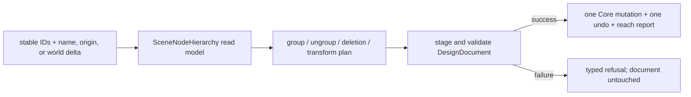
```mermaid
flowchart LR
    Intent["stable IDs + name, origin, or world delta"] --> Read["SceneNodeHierarchy read model"]
    Read --> Plan["group / ungroup / deletion / transform plan"]
    Plan --> Stage["stage and validate DesignDocument"]
    Stage -->|success| Commit["one Core mutation + one undo + reach report"]
    Stage -->|failure| Refuse["typed refusal; document untouched"]
```

The focused Core tests own grouping placement preservation, nested-member
collapse, name allocation, ungrouping placement and visibility preservation,
non-grouping-node refusal, deletion closure over feature dependents, removal
ordering, root/locked/Pattern-output refusal, world-delta rebasing through a
rotated parent, nested-member collapse under a transform, atomic rollback, and
one-step undo/redo.

### Scene placement matrix convention

Scene and component placement use row-major `Matrix4x4` storage with column
vectors: translation is at indices 3, 7, 11 and world placement is parent times
local. This agrees with `RupaGeometry.GeometryTransform3D`, the Product bridge
and CAD semantic lowering. UI, pattern generation, analysis and legacy CAD
overlays must use this same convention. The old column-major UI convention is
removed by explicit product decision; no decoder guessing or migration fallback
is provided. Existing user files are not deleted automatically.

The shared scene composition helpers must use this same row-major contract for
translation, point application, rotation, inverse and parent-times-local composition.
Explicit matrix-coordinate regression checks are required: composing and reading
with the same erroneous convention is not sufficient evidence.

`Transform3D` is the sole owner of checked scene-matrix composition, inversion,
point/vector mapping, translation, scale and rotation. `SceneNodeHierarchy` is
the sole owner of the Product scene-tree walk and parent/world placement lookup.
Consumers may retain a read-only index built from that hierarchy, but they may
not independently traverse or multiply scene-node transforms. Malformed,
non-finite, non-affine where affine placement is required, singular, missing,
unreachable, cyclic or multiply-parented input remains a typed failure; it is
never replaced with identity, the original point/vector, a partial tree, or a
partially transformed result.

`ScenePlacement` is the validated form of a placement matrix that presentation
consumers carry. Its initializer is the failure boundary: it requires a finite,
affine, invertible matrix and computes the inverse once. After construction,
point, vector, inverse and normal mapping are plain affine arithmetic with no
identity, input or projective substitute; a non-finite input maps to a
non-finite output, which the consuming boundary rejects. Viewport items and
interaction records hold `ScenePlacement`, never a raw `Transform3D`, so no
presentation mapping can run on an unvalidated matrix.

`SceneNodeHierarchy` also resolves component expansion. Each resolved occurrence
retains its source node, selectable outer instance node, parent occurrence, local
and world transforms, and effective visibility. Direct occurrence IDs remain
`scene.<node ID>`; expanded IDs include the complete instance/source path, so
repeated and nested instances cannot alias. Definition roots use their authored
local transforms, without inheriting their original document parents. Instance
placement precedes the definition-root transform. Expansion detects recursive
definitions and missing references and publishes no partial result. Hidden
occurrences remain available to source evaluation; display consumers filter the
resolved visibility. This read model owns no mutable document state.

Evaluated feature geometry enters the scene through exactly one presenting scene
node: the node whose `.feature`, `.body` or `.sketch` reference names that
feature. `FeaturePresentationIndex` defines that rule once; Product metadata
validation rejects a second presenting node for the same feature, and
`SceneNodeHierarchy` builds the same index and exposes
`presentingSceneNodeID(for:)` and `presentationOccurrences(of:in:)`. Repetition
is expressed only by component instances, which expand the presenting node into
distinct occurrences. Viewport, measurement, section analysis, snapping and the
topology snapshot resolve presentation only through this index and never group
scene nodes by reference kind themselves. A feature without a presenting node
has no product placement: its evaluated geometry is drawn, sectioned and
measured exactly once in the world frame (identity placement, no occurrence),
and its topology entries carry no scene node, so no scene-qualified selection
resolves against them. This is the placement rule for documents built directly
from the feature graph; it is never substituted for a presenting node whose
placement fails, which remains a typed failure.

Measurement and section analysis use that same hierarchy and the same placement
of the occurrence being inspected. A persistent reference that is expected to
follow a moved occurrence stores that occurrence identity and source-local
coordinates; a world-space point without an occurrence reference remains fixed.
Analysis distinguishes repeated component/pattern occurrences instead of
merging their geometry under one source-body identity.

The placement inspector accepts finite, non-singular affine matrices, including
shear produced by world-axis scaling after rotation. Its canonical decomposition
is `T * Rz * Ry * Rx * H * S`, where H is upper triangular with unit diagonal
and dimensionless XY, XZ and YZ shear. QR decomposition fixes Y/Z scales positive
and retains reflection in signed X scale. Numeric TRS edits retain H; no
orthogonalization may discard deformation. Perspective and singular matrices
remain typed refusals. Near gimbal lock an equivalent Euler form fixes Z to zero.
Round-trip tests cover world-axis scale after rotation, reflection, shear,
numeric edits and explicit failure. Existing shear-free placements keep their
TRS interpretation and serialized matrix format unchanged.

`ModelingOperationDraftTests`, `WorkspaceTransformMatrixTests` and viewport
transform tests own UI intent and geometry agreement; signed-App verification
must confirm CAD overlays and Mesh rendering coincide after XYZ edits.

Product object-name tests own ordinary-node preservation, component-instance
mirror consistency and uniqueness, pattern-root reuse, generated-output
refusal, saved-construction-plane owner routing, true no-op behavior, mirror
repair, stale transaction refusal, grouped rollback, and undo/redo. They do not
infer successful Outliner interaction from command construction alone.

For CAD command results, Core guarantees the staged-source phase of the
[package identity-phase contract](../../DESIGN.md#cad-identity-phases). One
immutable result delta is derived from the accepted staged document and may
contain generated Feature, source body-output role, Scene Node, Component
Definition, Component Instance, and Pattern Source identities. It never
contains evaluated topology `BodyID`; evaluation and publication are not Core
command-result responsibilities. An identity absent from the accepted staged
source, a duplicate or wrong-kind identity, and an identity reported by a
failed, rolled-back, or no-op mutation are invalid.

For package-internal prepared execution, `EditorSession` exposes only the
read-only fact that its existing `CommandStack` currently owns an active source
command group. The observation cannot enter, leave, or retain the group and
does not expose the stack. It allows `RupaAutomation` to reject execution on an
ordinary session before mutation; source rollback, deferred evaluation, and the
single history entry remain owned by `withSourceCommandGroup`.

### CAD creation contract

1. `createAnalyticSphere(name:center:radius:)` is a high-level source command.
   Core validates a non-empty name, finite center, and a radius greater than the
   document tolerance, allocates the `FeatureID` and `SceneNodeID`, appends one
   `PrimitiveFeature(.sphere)` with a `.body` output, and creates one solid
   Product object with `ObjectTypeID.sphere` and a radius property. Center is
   source placement, not a duplicated Product transform. The radius property is
   read-only metadata until a dedicated source-edit command owns radius changes;
   every Product validation requires the object to reference an analytic sphere
   primitive and requires its radius to equal the resolved CAD source radius, so
   editing Product metadata alone cannot diverge from the CAD source.
2. Sphere creation is atomic across CAD and Product state. Validation,
   append, Product synchronization, or evaluation failure leaves both values
   unchanged. A successful command delta contains exactly one generated
   Feature, one `.body` source-output identity, and one Scene node; it contains
   no evaluated `BodyID`.
3. The exact evaluator remains swift-CAD's existing
   `SpherePrimitive -> PrimitiveFeatureEvaluator ->
   PrimitiveBRepRequestBuilder.sphere` path. For a valid isolated sphere it
   produces eight analytic spherical faces, twelve exact edges, six vertices,
   and analytic volume; Core must not tessellate, approximate, or substitute an
   Authored Mesh.
4. `createSemanticSketch(name:plan:geometryRole:)` accepts a
   `SketchCreationPlan` containing a plane, ordered ID-free
   `SketchCreationEntity` values, and `SketchCreationConstraint` values that
   refer to entities only by validated zero-based local indices. Core rejects
   empty/duplicate/out-of-range/self-incompatible references before source
   append, allocates one `SketchEntityID` per entity in input order, resolves
   all constraint references, then delegates to the ordinary complete-Sketch
   validation and append path.
5. The initial ID-free entity contract covers line and analytic circle; the
   relation contract covers coincident endpoint references, parallel,
   perpendicular, horizontal, vertical, equal length, concentric, and equal
   radius. Relation/entity-kind compatibility is validated in Core. These are
   universal sketch values, not benchmark-case commands.
6. A semantic sketch command reports the generated sketch Feature and Scene
   identities through the ordinary complete delta. Internal
   `SketchEntityID` values are neither request values nor CADAPI-A local
   outputs. A later program step refers to the generated sketch Feature, not
   to a fabricated entity identity.
7. Adding either command requires updating every exhaustive `EditorCommand`
   classification. Prepared Automation admits both as source commands and
   continues to reject raw `appendFeatureGraph` and caller-built `Sketch` as
   semantic Agent inputs.

### Authored Mesh edit contract

1. The Mesh edit target contains only `GeometrySourceID` and expected
   `ContentIdentity`. Scene-node and representation IDs are not part of source
   authority.
2. Public application validates the document once before dispatch. The retained
   `AuthoredMeshAsset` invariant guarantees that construction and decoding
   already validated its source and computed or verified its cached content
   identity. After document validation, Core performs one O(1) authority check:
   dictionary key, asset/source ID, identity domain, and cached content identity
   against the target. It does not revalidate or rehash the existing source. A
   CAD-derived snapshot, external observation, or arbitrary Mesh payload cannot
   be promoted by identity imitation.
3. The target may name a retained-but-unselected asset; Core does not require an
   inverse Object or representation reference to apply the edit.
4. The Core command contains one complete plan. `MeshEditPlanExecuting` returns
   an already-validated `MeshEditPlanExecution`, whose raw initializer is not
   public. Core trusts that type invariant and does not rescan the original or
   result source, validate the execution again, or duplicate output-role,
   alias, ID-lifecycle, allocation, or topology rules. It replaces the asset
   under the same source ID only after execution succeeds and the complete
   staged `DesignDocument` validates. That aggregate document validation is a
   separate Core authority boundary, not authorization for a second execution
   semantic validator.
5. Shared source references remain shared. Core does not clone the source or
   synchronize CAD, purpose selection, or representation metadata as a side
   effect.
6. CAD bytes, Product metadata, representation IDs, modeling/presentation
   selection, and Authored Mesh provenance are byte-for-byte/semantically
   invariant for a Mesh-only edit, except for the edited asset payload and its
   content identity.
7. A no-op plan preserves the asset content identity and produces a no-op result.
8. Plan receipt and copy telemetry survive the Core result boundary for Project
   staging and verification.
9. Core does not make a derived evaluation snapshot an Authored Mesh source;
   explicit Make Editable remains a separate command.
10. A scene-graph result reports Product scene nodes in deterministic ID order
    and preserves root ordering. It does not evaluate CAD/Mesh geometry, mutate
    source, or treat CAD-local body bounds as placed geometry.
11. Effective visibility is derived only from Product root reachability and each
    node's `isVisible` value. Hidden nodes and descendants remain retained source
    and navigation identities; presentation consumers omit them without deleting
    CAD features, representations, or Authored Mesh assets.

### Imported Authored Mesh contract

1. File access and format parsing remain outside Core. The import adapter must
   provide a validated `MeshSource`, an `AuthoredMeshProvenance.imported`
   identity, and a display name; the identity contains only a qualified format
   domain and content fingerprint, never an absolute path.
2. `ImportAuthoredMeshCommand` allocates one source ID, representation ID, and
   scene-node ID inside the staged Core document. It creates one body/mesh
   Product object whose modeling and presentation selections point at the same
   retained Authored Mesh representation.
3. The command rejects duplicate identities, missing root hierarchy, invalid
   imported provenance, or a document that fails complete validation. It never
   mutates the caller's document on failure and never publishes directly.
4. `ProjectSourceTransaction` runs the command through the existing geometry
   command applier. Project remains the owner of revision checks, evaluation,
   undo/redo, package encoding, and publication; a failed or cancelled import
   therefore produces no partial source or Product state.

### Feature history command contract

Feature history mutations use the existing `EditorCommand` and
`EditorSession` source-transaction boundary. Core owns candidate document
validation; `ProjectController` remains the only publication owner.

| Command | Core guarantee | Failure and history behavior |
|---|---|---|
| `setFeatureSuppression` | Changes only an existing feature and validates the complete staged `DesignDocument`; an active feature may not depend on a suppressed source. | Missing IDs and dependency-invalid suppression return typed failure with no document, generation, or history change. A same-value request is a no-op. |
| `reorderFeatureGraph(featureIDs:)` | Accepts exactly one permutation of the current feature IDs. Core validates the candidate graph's dependency direction, inputs, operation contracts, Product references, and evaluation before assigning it. | Duplicate, missing, extra, or dependency-unsafe IDs return typed `invalidGraph` failure with no partial order or history entry. A same-order request is a no-op. |
| `upsertParameter`, `renameParameter`, `deleteParameter` | Applies the existing parameter validation and pattern regeneration path atomically. | Unknown, duplicate, self-referencing, or still-referenced parameters return typed failure and restore the prior source. |

Every successful mutating history command is staged in an isolated
`EditorSession`, produces one evaluated source mutation and one command-stack
entry, and is published only by `RupaProject`. Core never publishes a candidate
or turns a failed candidate into the previous document as a success result.

### Snap topology demand contract

Topology snapshot face normals use the face-local coedge parameter curve at
the representative edge's start vertex when available. This evaluates the
existing UV chart directly instead of globally projecting a known boundary
point back onto a procedural surface. Coedge orientation selects the endpoint;
face orientation selects the normal sign. Only edges without a parameter curve
use spatial projection. A failed normal evaluation remains explicitly absent,
not a fabricated vector or a retry through a different geometry path.
`SheetSurfaceEditTests` exercises this path on thickened sheet caps and walls.

`SnapResolver` owns the decision to request a topology summary while resolving
object candidates. It requests the existing `TopologySnapshotService.snapshot` with
`metricPolicy: .omit` exactly when:

```text
MeasurementAnnotationResolver.requiresTopology(document)
|| (searchRadiusMeters > 0
    && document.cadDocument.hasActiveRenderableTopologyFeatures)
```

The positive-radius branch is limited to active renderable CAD topology. An
authored-mesh-only or sketch-only document therefore continues through grid,
sketch, region, and other non-topology candidates without entering whole
document topology validation. While resolving object candidates, a measurement anchor of kind
`topologyReference` or `topologyEdgeParameter` forces the existing topology
service, even when the search radius is zero or the document has no active
renderable CAD topology. `TopologySnapshotService` remains the validation and
CAD/measurement failure authority; SnapResolver adds no cache, alternate
topology path, or failure conversion of its own.

Each `resolve` runs object candidate resolution on the caller's thread, and on
a document with active renderable CAD topology the demand above reaches one
exact kernel evaluation of the whole document. One pointer event can call it
more than once: a canvas drag resolves its start and then its end. `resolve`
therefore accepts the caller's published `DocumentEvaluationContext` and
`DocumentGeneration` and forwards both to that one `snapshot` call, exactly as
`MeasurementService` and `MeshSummaryService` already forward them. The context
stays the caller's: SnapResolver neither stores nor updates it, and
`TopologySnapshotService` alone decides whether it matches. A caller that
supplies no context, or one whose generation, modeling settings, or source
identity no longer describe the document passed beside it, is answered by the
same exact evaluation as before, so the reuse cannot return topology from a
document the caller did not ask about. `SnapResolver.init` takes the
`TopologySnapshotService` it calls, so a test can hand it a service whose exact
evaluator refuses to run and read the difference between a matching context and
no context as success against failure.

### Snap placement contract

Snap candidates are offered where the geometry is displayed. Each source is
placed by its feature's presenting scene node (the direct occurrence) through
`ScenePlacement`; an unpresented source stays in the world frame. Topology,
surface-trim and region-center points are single points, so any affine
placement maps them exactly. Sketch snap entities (points, closest-point curves,
intersections) are found in the sketch plane and placed by the presenting node's
world transform: points and closest points map through the placement, and a
circle or arc stays an exact arc when the placement is a similarity and is
offered as its placed polyline otherwise. Snap points on saved measurements come from
`MeasurementAnnotationResolver`; an unresolved annotation offers none and never
fails the whole resolution.

### Cut Curve intersection contract

Cut Curve locates cuts only from Swift-CAD's `SketchCurveIntersector`: Core
resolves the authored line, circle, arc or cubic spline to
`SketchCurveGeometry2D`, chooses the cutter reach (`extended` when the option is
set) and converts each intersection's natural parameter to the fraction
`splitSketchCurve` takes (line fraction, arc sweep fraction, chain parameter over
span count) or, for a circle target, to its two cut angles. Core computes no
intersection itself. When an authored cutter misses but its extension would cut,
the command says the cutter does not reach; a root the kernel cannot certify
(tangent or overlapping curves) and invalid geometry are command-invalid errors
carrying the kernel message, and the document is unchanged.

`cutSketchCurves(targets:cutters:options:)` is Cut Curve's dialog: each target is
cut wherever any cutter crosses it (`cutCurveCrosses`, the same intersection
rule), each cutter cutting the pieces the earlier cutters left. A target no
cutter crosses, an empty list, or a curve in both lists fails the whole cut and
the document is unchanged.

### Sketch splines of any degree and knots

A sketch spline carries its degree and, unless it is in Bezier-chain form, its
knots ([Sketch spline form](../../../swift-CAD/Sources/CADIR/DESIGN.md#sketch-spline-form)).
Every reader that evaluates one goes through `resolvedSketchSplineCurve` or
`sketchSplineGeometry2D` (`DesignDocument+SketchSplineCurve.swift`), which resolve
its control points and hand Swift-CAD's `SketchSplineCurve` to the kernel's
sampler, projector and intersector; a cubic chain keeps the chain geometry and so
its exact earlier results. The display snapshot and the viewport primitive carry
`degree` and `knots` beside the control points, and the display samples, the
sketch bounds, curve analysis (joints at knots of multiplicity `degree`, named by
`SketchSpline.jointIndices`), snapping (an exact projection, so a snapped point
lies on the curve), measurement, bridge endpoint parameters and the endpoint
resolver all read that curve. A spline's fraction, the parameter
`splitSketchCurve` and the bridge endpoints take, is the parameter normalized
over its knot domain, which for a chain is the span parameter over the span
count as before. `validateSplineForm` admits any form; a command that still reads
a spline span by span calls `validateCubicBezierChainSpline`, which refuses any
other degree or explicit knots by name rather than read it as one.
`GeneralSplineReadersTests` own the readers.

Editing commands on any degree and knots:

| Command | General form |
|---|---|
| Split Segment, Cut Curve, Trim, a bridge's source trim | `splitGeneralSpline`: the B-spline trimmed at the fraction's parameter; both parts keep the degree and carry its knots (explicit unless exactly the chain form's), so fractions on a part are linear in the original's and Cut's sequential fractions remap linearly; a constraint or dimension on an interior control point refuses the split |
| Trim bounds | the spline's own joints, joint point j at knot j + 1 |
| Extend Curve Natural | Swift-CAD's `naturalSpan(ofSegment:)` on the end segment's own polynomial, a same-degree span after a C0 joint |
| Insert Knot, Subdivide, move, slide, Reverse, projection, Offset | general already |
| Rebuild Points | a cubic chain at a count a chain takes (3k + 1) keeps the chain rebuild, its joints and exact layout; any other count or input is Swift-CAD's least-squares cubic B-spline with that many points (`SketchSplineLeastSquaresFit`), only its ends mapped, its deviation `sampledProjection` |
| Rebuild Refit | a cubic chain keeps the chain refit, spans on its own joints and handles along its tangents; any other input is Swift-CAD's `refit(_:deviation:keepsCorners:)`, the fewest cubic control points within the tolerance, cut and rejoined at the curve's own corner knots when corners are kept, only its ends mapped, its deviation `sampledProjection` |
| Rebuild Explicit Control | every input is Swift-CAD's clamped uniform B-spline of the chosen degree with spans + degree control points, the weight its `shapeWeight` (1 closest to the original, 0 the evenest polygon on the chord); the degree range is Core's `CurveRebuildOptions.explicitControlDegrees` (1 through `SketchSpline.maximumDegree`), which the Rebuild dialog and inspector read |
| Delete Redundant Topology, opening a closed spline, spatial conversion | refused by name (`validateCubicBezierChainSpline`): they read cubic spans |

`GeneralSplineEditingTests` own these; `GeneralSplineRebuildTests` own Refit and
Explicit Control on general splines.

### Raise Curve Degree and Convert Vertex

`raiseSketchCurveDegree` raises every target curve one degree as one step. A
spline is raised exactly by Swift-CAD's `SketchSplineCurve.degreeElevated`, the
same curve on the same parameter, so a bridge end's fraction on it stays; each
old joint maps to the raised joint at its knot, and every stored reference to it
(constraints, dimensions, bridge ends and their trim records, measurement
anchors) follows; a reference to any other control point refuses the step. A
line becomes the degree-2 spline through its ends and middle (its line-only
relations refuse). Arcs and circles (no exact spline without weights) and
generated Bridge Curves (degree set by their continuities) are refused.
`convertSketchSplineVertex` turns an interior joint into an ordinary control
point: that knot's multiplicity drops from the degree to one and the d − 1
points around it that shaped the joint go, so the curve stops passing through it
by design; ends, non-joints and references to the removed points refuse.
`SketchCurveDegreeTests` own these.

### Align Vertex continuity and Parameter

`alignSketchVertex` holds G0 as a coincidence and G1/G2 as the sketch constraint
that expresses them where one exists (line–line parallel, line–arc tangency,
spline end tangency and smoothness). Where none does (arc–arc, arc–spline,
line–spline G1, any G2 but spline–spline), the target end is aligned once to the
reference end's frame (`alignEnd`): a spline's handle along the tangent and, for
G2, its next point from the clamped end conditions (`SplineEndScale`); a line
turned about the end; an arc re-centred keeping its sweep, taking the curvature's
radius for G2 and refusing a reference that bends against its counterclockwise
turn. The target leaves the point the way the reference goes on past its end.
With a Parameter the reference is a curve: the end moves to the point at that
fraction of its parameter (through a fixed helper point, so every constraint on
the target follows) and takes its frame there, the way the end already leaves;
no sketch reference names a point inside a curve, so this alignment is made once.
Bridge Curves are refused as targets of a one-time alignment.
`SketchVertexAlignmentFrameTests` own these.

Align on two curves (`alignSketchCurveEnds`) aligns the second curve's end nearest
the first with the first's nearest end, by the same nearest-end rule as Bridge.
Dependent Curve Extend (`extendSketchCurve(target:until:shape:)`) extends the end
in its shape long enough to pass every point of the limit curve (an arc only until
it would close), finds the crossings with Swift-CAD's intersector, and splits the
extension exactly at the crossing nearest the end, so the new end lies on the limit
curve; a limit it never meets refuses the command. `DependentExtendAndAlignTests`
own these. A whole body as the limit (a sheet or solid) extends the end until it meets
the body: a probe extension long enough to pass every vertex of the body is crossed
with each face in world space (`faceCrossingFractions`, as Cut Curve's face cutter
reads a face), and the extension ends at the first crossing past the original end
(`ExtendCurveToBodyTests`).

The constraint propagator reads a spline end through the clamped end conditions
of its own degree and knots, C′ = a·(P1 − P0) and C″ = b·((P2 − P1)/Δ2 −
(P1 − P0)/Δ1) in that end's frame (the reversed curve's start at the end), and
inverts them to place the handle and curvature points that match the other
curve: tangent endpoints align C′, smooth endpoints match C′ and C″ (C2, which
satisfies the kernel's G2). A cubic chain of unit spans has a = 3, b = 6 and unit
spans, so its results are unchanged. Joint smoothness names an interior joint of a
chain of any degree; a spline with explicit knots has no such joint. Moving and
sliding control points take any form. `GeneralSplineConstraintPropagationTests`
own these.

### Split Segment on a closed spline

`splitSketchCurve(target:at:)` on a closed spline opens the loop where the point
projects onto it (`openClosedSketchSpline`): the spline becomes open, starting and
ending there, one span longer when the point falls inside a span (split there by
De Casteljau) and the same points rotated when it falls on a joint. References to
its control points follow them around the loop; a reference to the split span's
two inner points or to the spline's ends has no counterpart and refuses the
split. A circle is refused: the sketch model has no circle seam to put a vertex
at. `splitSegmentOpensAClosedSplineWhereItIsClicked` covers both cases.

### Trim contract

`trimSketchCurve(target:near:)` removes the segment of a sketch line, arc, circle
or open spline that holds a point near the curve, as Plasticity's Trim does:
segments are bounded by the curve's ends, its crossings with every other line,
circle, arc and open spline of the same sketch, and, on a spline, the joints
between its cubic spans. The crossings come from Swift-CAD's
`SketchCurveIntersector` exactly as Cut Curve's do (authored reach, never an
extension); a crossing the kernel cannot certify refuses the command. The point
only chooses the segment: its parameter is Swift-CAD's `SketchCurveProjector`
foot on the curve, never a cut position. An open curve is split at the bounds with
`splitSketchCurve` and the bounded piece removed, or removed whole when no bound
lies inside it; a circle becomes the arc from the next crossing round to the
previous one, and needs two crossings to keep anything, so with fewer it is
removed. Split and removal refusals (constraints, Bridge Curve sources) apply,
and any refusal leaves the document unchanged. `SketchCurveTrimTests` own the
line, arc, circle, spline-joint and refusal cases.

`splitSketchCurve(target:at:)` is Split Segment: it inserts a vertex into a
sketch line, arc or open spline at Swift-CAD's `SketchCurveProjector` foot of a
point of the sketch plane, through `splitSketchCurve(target:fraction:)`, so the
split's constraint, dimension and Bridge Curve rules apply. A circle has no
segment to divide and is refused, as is a point at either end.
`insertSketchSplineControlPoint(target:at:)` is Insert Knot: the same projection
places a new control point on an open spline through the fraction-based
insertion, keeping the shape. `SketchCurveTrimTests` also own the split and
insert cases.

### Bridge generation contract

A Bridge Curve is derived geometry: `BridgeCurveSource` (its two ends, their
continuities and tensions) is the authority, and the spline in the sketch is
Swift-CAD's `CurveBridgeSolver` result for it. `bridgeSpline` hands each resolved
end to the solver as exact curve geometry (a line, an arc's circle on its angle,
a spline on its own knots) oriented along the bridge's travel, with the required
level G0–G3 and the end's three tensions (the first scales the end speed from the
chord length). The result is one Bezier span of degree k₁ + k₂ + 1 in chain form;
Rupa Core does not construct bridge control points itself.

| Event | Owner | Effect |
|---|---|---|
| create | `createBridgeCurve` | bridge solved from the new source |
| `setBridgeCurveParameters` | the commit's regeneration | the old owned constraints go; the bridge is solved from the updated source |
| any sketch commit | `commitSketchEntityEdit`, `addSketchConstraint` | every bridge of the sketch regenerated from its source |
| document parameter change | `upsertParameter`, `deleteParameter`, `renameParameter` | `regenerateAllBridgeCurves` before pattern arrays |
| control point move / slide on a bridge | `validateNotGeneratedBridgeCurve` | refused: shape a bridge by its parameters |
| constraint naming a bridge's continuity or interior point | `validateSketchConstraintOnBridgeCurves` (`addSketchConstraint`, Align Vertex) | refused |

Every level is accepted at any position of a line, an arc or a spline; the solver
refuses what it cannot meet with a typed error, and the edit fails with the
document unchanged.

The source is the bridge's one authority. The only constraints a bridge owns are
its end control points coincident with point-referenced source ends; its
continuity is not restated as sketch constraints, because the constraint
propagator satisfies a constraint by moving either side and would reshape a
source (or the other source of a bridge on a bridge) to fit the bridge. Drag
previews run the same commands on a copy, so they regenerate too. Constraints on
a bridge from earlier generators (end tangency, smoothness, joint smoothness) are
removed when it is regenerated.

`regenerateBridgeCurves` works on copies of the sketch and the product metadata,
committed together with the sketch:

```text
order sources: each after the bridges its ends lie on (cycle → typed error)
  └ per bridge: solve → drop its owned constraints (old last index)
               → remap references to its end points: 0 → 0, old last → new last
                 (sketch constraints, dimensions, other bridges' ends, measurement anchors;
                  a reference to an interior point → typed error)
               → store the spline → re-add its owned constraints (new last index)
```

A degree set by the continuities makes the last index change with them, so every
reference follows it; an interior control point is rebuilt from the source and
cannot carry a reference. A document written by the earlier cubic-chain
generator keeps its stored bridge until its sketch is next committed.

Commands that read a bridge read its own degree and knots: Reverse mirrors the
knots and swaps the source's ends, continuities and trim record ends, so the
regenerated bridge is the same curve backwards (trim records of every bridge
follow a reversed source curve); projection keeps degree, knots and closure
(projection between planes is affine); Offset uses Swift-CAD's spline offset over
the bridge's own Bezier segments. Curve analysis reports each point-referenced
bridge end as a join requiring the declared continuity, measured by
`CurveContinuityEvaluator` on the exact curves (G3 included), and compares other
joins' curvature as vectors. `BridgeCurveCommandTests` own creation and
parameters; `BridgeCurveRegenerationTests` and `BridgeCurveDerivationTests` own
regeneration, references, ordering, the refusals and the readers.

### Bridge trim contract

A Bridge Curve's Trim rewrites its source curves at its ends. The trim is recorded
on the `BridgeCurveSource` (`BridgeCurveTrimRecord`: the ends and curves before it,
the curves after it; optional, so documents without it still decode), so
`setBridgeCurveParameters(trimsSourceCurves: false)` turns it off: the curves go
back, and the bridge rejoins its untrimmed ends keeping its tension and sense. A
trimmed curve edited since, or a trim made before it was recorded, refuses the
change and the document is unchanged. A retrim of trimmed curves keeps the
curves from before the first trim. `bridgeCurveTrimTurnsOffAgainRestoringTheTrimmedCurves`
covers the toggle and the refusal.

### Bridge selection contract

`bridgeEndpoints(for:)` reads Bridge's two ends from two selected targets of one
sketch, in selection order, and the command creates the Bridge Curve with them.
Two curves (lines, arcs, open splines) meet at the pair of their ends nearest
each other, which is Plasticity's Bridge Curve; two curve-end vertices (a line's
or an arc's start or end, an open spline's first or last control point) meet
where they are, which is Bridge Vertex. A curve and a vertex offer the curve's two
ends against the vertex. A single target, a center, a circle, a closed spline,
two sketches or one end twice are refused. The ends carry no parameter, so the
Bridge Curve source keeps joining the curve ends as they move.
`BridgeSelectionTests` own these cases.

### Spline refinement contract

Insertion admission uses a finite fraction strictly inside (0, 1), followed by
a representable parameter strictly inside its knot span. Physical distance
thresholds do not apply to dimensionless fractions or knot parameters. Subdivide
must accept positive nonuniform spans independently of the global knot range.
Linear spline extension retains endpoint differences and their normalization as
CAD expressions using the kernel's `hypot` contract. Changing referenced
parameters updates direction while retaining the requested extension distance;
a collapsed tangent causes explicit expression evaluation failure. JSON and
editable expression text retain this dependency, including parameter usage.

Section triangulation uses the source-coordinate presentation triangulation defaults;
the query's world-space distance tolerance applies only to plane classification
and contour assembly. Section contour assembly traces both ends of an open chain. Input segment order
and direction must not split a connected, non-branching chain or change its
length. Closed-loop behavior and per-occurrence ownership are preserved.


Insertion and Subdivide retain a sketch spline's degree and explicit knot domain.
Bezier chains split with de Casteljau on their own degree; explicit B-splines use
Boehm insertion up to degree multiplicity at each split. Coordinates remain CAD
expressions so later parameter edits still update the refined curve. Closed
curves retain their coincident end points. Refinement owns unchanged-point index
migration; a constraint or dimension naming a replaced handle is refused before
publication. Generated Bridge sources remain owned by Bridge regeneration.

Subdivide splits every original nonempty knot span at its midpoint. Core owns
both the split parameters and resulting CV selection indices; UI consumes that
plan rather than assuming cubic 3n+1 storage. Existing cubic selections remain
compatible. One source command owns all splits and restores the previous document
on any failure. Verification samples degree 1/3/6 and explicit nonuniform knots,
closed curves, parameter expressions, reference migration, refusal and undo/redo.

### Complete Edge and Subdivide

`completeSketchCurve` extends each open end of a sketch line, arc or open spline
to the nearest crossing with another curve in its plane where the scene draws
it. Candidates come from every sketch's visible presentation occurrences (the
placement rule viewport, measurement and section analysis share), carried into
the selected sketch's coordinates through their world transforms; a curve that
placement lifts off the plane is not a candidate, and a circle or arc placement
would stretch into an ellipse refuses the command. The kernel's
`SketchCurveIntersector` finds the crossings on the extension: a line along
itself, an arc around its circle (never overlapping itself; when both ends would
meet at one crossing only the nearer end extends) and a spline along a unit ray
on its end tangent. A collinear line or a co-circular arc is met where it begins,
and one already over the end completes it. A crossing the kernel cannot certify
(a tangency or its proof budget) refuses the command, because a farther crossing
could otherwise be taken as the nearest. The extension is `extendSketchCurve`'s,
so its constraint and Bridge Curve refusals apply and a failed end leaves the
document unchanged; no reachable crossing is a command-invalid error.

`offsetCurve` on a line moves its ends along the line's left normal and Offset Vertex
places its new vertices along the adjacent line, both directions expressions of the line's
own ends (`unitDirectionExpressions`), so the result keeps its distance and stays on its
line when those ends change through their parameters
(`ParameterDependentLineDirectionTests`).

`offsetCurve` on a sketch spline (Offset Planar Curve) makes a new curve sketch of
the spline Swift-CAD's `CubicBezierChainOffset` fits within the modeling distance
of the exact offset, on both sides when symmetric; a corner is joined by the
options' gap fill (Round, Linear or Natural through `offset(of:distance:gapFill:)`,
the inside of a turn trimmed where the offsets cross; Natural continues both end
cubics along their own polynomials until they meet); a fold (the distance reaching
the radius of curvature on the inside) refuses the command with the kernel's
message. The document is unchanged on refusal. A curve that belongs to a joined
curve (Join's `JoinedCurveGroupSource`) offsets the whole chain as one curve
(`offsetJoinedChain`): its members, each turned to run on from the one before
through the group's joints, become one run of Bezier spans (a line one straight
span, an arc Swift-CAD's `CubicBezierArcApproximation` chain, a spline its own
segments) that `offset(spans:distance:gapFill:)` offsets, a chain returning to its
start staying closed; the result is one cubic chain spline.
`OffsetCurveSplineGapFillTests` cover the fills and the joined chain.
`freestyleOffsetDistance(target:through:)` is Freestyle's distance: the point, taken
into the sketch's own coordinates through its placement, measured to the nearest
point of the curve (a line, spline or joined chain as Bezier spans sampled and
refined by golden section) with `offsetCurve`'s sign: a line, spline and joined chain
(in the chain's own direction) positive on the left, an arc or circle outside it.
`FreestyleOffsetTests` own this.

`applySketchCornerTreatments(vertices:distance:treatment:)` fillets or chamfers
several selected curve ends: each corner once, even when both of its ends are
selected, in selection order, since a treatment shortens its two curves only at
the treated ends. A corner that cannot take it fails the whole command and the
document is unchanged.
A corner is two line or arc ends held together by a coincident constraint or
meeting within the modeling distance, as curves drawn to touch do, for both Fillet
Curve's curve pair and Fillet Vertex's selected end; ends with a gap are not a
corner. `SketchCornerTreatmentTouchingCurvesTests` own this.
`sketchCornerTreatmentEnds(target:adjacentTarget:)` names the corner a treatment at
that selection would take, as its two ends (`SketchCornerTreatmentEnds`), without
changing the document, through the same corner resolution; Fillet's viewport handle
reads it (`SketchCornerTreatmentEndsTests`).
`sketchCurveJoinEndpointFeedback(targets:)` gives every end of each selected line, arc
and spline, aligned when it meets an end of another selected curve of its sketch by
Join's own endpoint tolerance (`joinCurveEndpointsAreAligned`); other components take
no part and fewer than two curves give none (`SketchCurveJoinEndpointFeedbackTests`).

`deformCurves(targets:referenceFace:targetFace:options:)` is Deform Curve. Each
selected sketch line, arc, circle or spline, read on its sketch's placed plane, is carried
point by point through Swift-CAD's
`FaceUVNChart` of the reference face, `CurveDeformationOptions.mapped` (UV swap,
Mirror s → 1 − s, U/V scale about the face's middle plus a fractional offset, N scale
plus a length offset, Normal flip) and the target face's chart, and Swift-CAD's
`SpatialCurveFitter` (deviation ten modeling distances, corners at the curve's own
span ends) makes it a spatial path, one per curve, in one step. Without Keep Tools the
sources leave their sketches; a sketch left with no curve is deleted with its object,
and one other features are built on is refused. `CurveDeformationTests` own this.

`projectCurvesAlongDirection(targets:face:direction:bidirectional:)` is Project Curve
Body along a direction: each curve point moves along it to the one selected face through
Swift-CAD's directional projection (a ray, or the whole line when bidirectional), which
lands only inside the face's trim, and `SpatialCurveFitter` makes a spatial path per
curve; a point that misses fails the command with nothing changed. A planar face met
square on (the direction along its normal) takes the curves as a sketch on its plane,
the `projectCurvesToGeneratedFace` result. `CurveDirectionalProjectionTests` own this.

`projectBodyOutlinesToConstructionPlane` (Project Outline) keeps the silhouette: an
edge, or the part of it, whose projection bounds the body's shadow on the plane, where
the body covers the plane on one side of it only (`outlineSketchEntities`). Each edge's
exact curve (Swift-CAD's `EdgeQueryEvaluator.resolve`) is read at eight interior
parameters; a point a step (twenty modeling distances) to each side of its projection is
covered when the line through it along the plane's normal meets one of the body's faces
inside the trim (Swift-CAD's directional projection, a miss being its empty result), and
a change between outline and interior is bisected. Edges inside the shadow and edges
seen end-on are left out. A line piece stays a line, a circle parallel to the plane an
arc (a circle when whole), and any other curve (B-spline, ellipse) a cubic chain fitted
within ten modeling distances; a curve coincident with one already kept is dropped, two
curves being the same when `OutlineCurveIdentity` finds their identifying points (a line's
ends, a circle's center and rim point, an arc's ends and middle so the two halves of a
circle differ, a spline's degree, knots and control points) within the modeling distance,
in either direction; no coordinate is quantized (`OutlineCurveIdentityTests`).
`ProjectOutlineSilhouetteTests` own this.

`createBodyOutlines(targets:plane:)` is Create Outline: the same silhouette pieces
(`outlinePieces`), left on the body as 3D curves fitted within ten modeling distances.
Pieces projecting onto one curve (a box's top and bottom rims seen from above, the same
`OutlineCurveIdentity` of their projected ends and middle) keep the one nearest the viewer
on the plane normal's side; pieces meeting end to end are joined
into one Bezier spatial path with corner joints (`chainedOutlineSpans`), closed when the
chain returns to its start, one object per path. `CreateOutlineTests` own this.

`projectBodyIntersection(first:second:)` is Project Body Body: the pieces where the two
bodies' faces meet (Swift-CAD's `BodySectionCurveEvaluator`, trimmed to both faces;
coincident faces give none, faces touching along an edge give that edge), fitted within
ten modeling distances and joined like Create Outline's into spatial paths; bodies that
do not meet are refused; bodies placed differently are refused too (marked
`FIXME(INCOMPLETE_IMPLEMENTATION)`), since their evaluated faces lie in different source
frames. `ProjectBodyBodyTests` own this.

`projectCurveIntersection(first:second:)` is Project Curve Curve: the curve where two
sketch curves' extrusions meet, each along its own sketch plane's normal (Swift-CAD's
`PlanarCurveExtrusionIntersector` over the first curve, which follows the second curve's
first crossing), fitted within ten modeling distances at the first curve's own span ends
as one spatial path. Curves on parallel planes, or whose extrusions part partway, are
refused with nothing changed. `ProjectCurveCurveTests` own this.

Deform Curve, Project Curve Body along a direction, Project Outline's silhouette,
Create Outline, Project Body Body and Project Curve Curve follow Projection's coordinate
flow (`DesignDocument+WorldPlacedCurves`): a sketch curve is read on its sketch's plane
through its scene node's world placement, a body's evaluated faces and edges in the
body's source frame placed by its node's world placement (points and directions carried
through the placement and its inverse), and a created spatial path is authored in world
space, its node's placement cancelling its parent's. A circle edge stays an arc only
through a rigid placement. `WorldPlacedCurveCommandTests` move the inputs and find the
results moved with them.

`createSpatialBridgeCurve(first:second:continuity:)` bridges ends that do not share a
sketch (`SpatialBridgeEnd`: a sketch curve or generated edge at a fraction of its
parameter, leaving outward) through Swift-CAD's `CurveBridgeSolver` in world space: a
sketch curve as its exact local curve (line on arc length, arc or circle on angle, spline
on its knots) under an affine image of its placed plane, an edge's curve under its body's
placement. A bridge whose control points share a plane is a sketch spline of the
bridge's degree on that plane (exact); one off every plane is a one-span cubic spatial
path, exact up to G1 at both ends, and higher continuities there are refused. It is not
associative; each end's tension scales its end speed from the chord length.
`createBridgeCurve(clicked:_:continuity:tensions:)` makes an associative sketch
Bridge Curve when both clicked ends are on one sketch and the spatial one otherwise;
`spatialBridgeEnds(joining:)` picks two curves' nearest ends. `SpatialBridgeCurveTests`
own these.

`ExtendCurveShape.supported(for:)` is the one rule for which Extend shapes a curve
kind takes, in the order the dialog offers them: a line takes Natural, Linear,
Soft and Reflective (all straight), an arc Natural, Soft, Reflective and Arc (all
along its circle), an open spline Natural (Swift-CAD's
`CubicBezierChainExtension.naturalSpan` continues its end span's own cubic by the
arc length, as one new span), Linear, Soft, Reflective and Arc. A spline's Soft and
Arc are Swift-CAD's `CurvatureProfileExtension.cubicSpans` from the end's point,
tangent and signed curvature over the arc length (Arc keeps that curvature, a circle;
Soft eases it to zero), each cubic span elevated to the spline's degree, so the joint
is G2 and needs degree 3 or more; Reflective mirrors the tail of that arc length across
the end's normal, reversed, so the joint keeps tangent and curvature. A start end
reverses the spline, extends its end and reverses back. The new control points are
Swift-CAD `bezierShapedExtension` expressions of the curve's own Bezier points (the
end segment, or for Reflective the segments back to the one its length starts in,
interior knots raised to full multiplicity as expressions) and of the distance
expression, so they follow parameter changes of either; the span or segment count
is fixed when the extension is made, and an input it can no longer represent fails
evaluation with the kernel's typed error. The new spans join the end at a knot of
multiplicity `degree`, one knot unit each (chain form when that matches it);
editable text writes them as `bezierArcExtension`, `bezierSoftExtension` and
`bezierReflectiveExtension`, which the parser reads back. A line's
Arc needs a circle a line does not define and an arc's Linear leaves its circle, so
both stay refused. `SplineProfileExtensionTests` own the spline shapes and
`PersistentCurveExtensionTests` their expressions.
`extendSketchCurve` refuses any other shape, and the
inspector offers only these, keeping the chosen shape when the selected curve
takes it and otherwise its first (`effectiveExtendShape`), so a spline end no
longer fails on the Natural default. `ExtendCurveShapeTests` cover both.

`joinSketchCurves(targets:continuity:)` is Join Curves on two or more curves of one
sketch (`joinSketchCurveChain`; two selected curves take `joinSketchCurves`, which
merges two collinear lines no joined curve holds and otherwise takes the same
path). Every pair of free curve ends that meet becomes a joint holding them together
at the chosen continuity; an end a joint already holds is not free, and a selected
endpoint handle offers only that end. The selected curves, with the joined curves
some of them already belong to, become one `JoinedCurveGroupSource`, so a curve is
still owned by one joined curve: its first joint keeps the stored first and second
references with the constraint snapshots around it, every later joint is one of
`additionalJoints` (`JoinedCurveGroupJoint`: its two ends, continuity and the
constraints it added), and `joints` lists them all. Three or more free ends at one
point, curves that do not meet in one piece, and curves a collinear line join
merged are refused with the document unchanged. Unjoin Curve on any member removes
exactly the constraints each joint added, so constraints, dimensions and geometry
edited since the join stay. Product metadata validation checks every joint's ends
and continuity and that a curve end is held by one joint at most, and curve
analysis reads every joint. `JoinCurveChainTests` own these.

`deleteRedundantSketchSplineJoints` is Delete Redundant Topology: from the last
joint back, a joint whose two spans Swift-CAD's `CubicBezierChainJoints` finds to
be the halves of one cubic becomes that cubic, so the curve keeps its shape with
three fewer control points; the outer points keep their expressions and the new
inner two are constants. A joint whose three control points a constraint or
dimension names is kept, references past a removed joint move back three
indices, and a spline with nothing to remove is refused with the document
unchanged. `SplineRedundantJointsTests` own these.

`subdivideSketchSpline` follows the [spline refinement contract](#spline-refinement-contract)
for open and closed curves of any supported degree and knot form. `subdivideSurface` raises a
B-spline surface's degree in u and v with Swift-CAD's exact
`BSplineSurface3D.elevatingDegree`, inserts a knot at the middle of the widest
span in each direction and updates the degree and control-point properties.
`CurveRefinementTests` owns the line, arc, spline, unreached, spline subdivision
and surface subdivision cases. `GeneralSplineRefinementTests` owns arbitrary-degree,
nonuniform-knot, closed-curve and atomic refusal coverage.

### Evaluated primitive measurement contract

Every solid `PrimitiveDefinition` uses the same output-driven
`measureEvaluatedBodySolids` path as other evaluated body operations. The
resolved evaluated body is the exact B-rep volume authority; its evaluated Mesh
is used only for presentation surface area and bounds. A primitive kind is not a
reason to skip output measurement, and a missing evaluated body, Mesh, or exact
volume remains a diagnostic rather than a fabricated success.

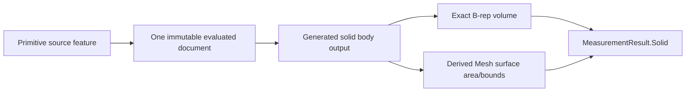
```mermaid
flowchart LR
    Primitive["Primitive source feature"] --> Evaluation["One immutable evaluated document"]
    Evaluation --> Body["Generated solid body output"]
    Body --> Volume["Exact B-rep volume"]
    Body --> Mesh["Derived Mesh surface area/bounds"]
    Volume --> Result["MeasurementResult.Solid"]
    Mesh --> Result
```

This contract preserves source feature identity, selection filtering, and
supersession behavior. It does not add a second measurement model or infer
solid geometry from source parameters.

### Persistent measurement annotations

`EditorCommand.addMeasurementAnnotation` adds a `MeasurementAnnotation` and its
annotation scene node through the command store, so saving is undoable; deleting
the annotation node through `deleteSceneNodes` removes the annotation with it.
`MeasurementAnchor.picked(_:under:in:role:)` stores a picked world point in the
local frame of the placement it was picked under (`MeasurementPickPlacement`:
world, scene node, or occurrence), using `ScenePlacement` so the anchor resolves
back to the same world point. `SnapCandidate.measurementPickPlacement(in:)`
names that placement from the snap's sources: exactly one scene node, otherwise
world space.

`MeasurementAnnotationResolver` resolves an annotation all-or-nothing: every
anchor resolves, or the annotation is reported with the first failing anchor's
typed error. Topology is requested only when an anchor needs it, and a topology
failure is reported for exactly the annotations that need it. Viewport display,
the workspace Measure panel and drawing projection consume this one result;
drawing projection reports an unresolved annotation as a warning diagnostic
instead of dropping anchors or failing the whole drawing.

Edge points come from Swift-CAD's edge query on the evaluation the topology
summarizes: `TopologySnapshot` retains that `EvaluatedDocument` (derived data,
outside equality). An edge entry's `midpoint` is `EdgeQueryEvaluator.midpoint`
on the exact edge curve; when the query fails the entry has none, so no Edge
Middle snap or edge-center anchor is offered, never a chord midpoint. An
edge-parameter anchor maps its normalized parameter onto the resolved edge range
and evaluates `EdgeQueryEvaluator.frame`. Drawing edge-length and face-area
annotations take their placement from
`MeasurementAnchorWorldPointResolver.placedTopologyEntry` (occurrence included):
the placed edge length is the kernel arc length of the edge curve's affine
image, a planar face area scales by the placed face plane's area ratio, and a
curved face area by the square of a placement that keeps angles; a placement
failure is a warning diagnostic and no value. Face areas and face centers are
Swift-CAD's exact area and area centroid (`BRepModel.faceAreaMeasurement`) on
planar, cylindrical, conical, spherical and toroidal faces. On B-spline and
procedural supports, and boundaries Swift-CAD does not cover, the area is
absent and the center is the boundary-vertex average, marked
`FIXME(INCOMPLETE_IMPLEMENTATION)` until Swift-CAD measures every support.

### Placed measurement aggregation

Persistent anchors with an occurrence ID resolve topology against the occurrence's
source node, then apply that occurrence's world transform. The selectable owner
must match the retained scene node and sketch references must match the source
feature. Component geometry anchors require an occurrence ID; an instance owner
alone does not identify a definition child. Scene-local free points may remain
relative to a node frame without identifying geometry. Stale or mismatched
references fail explicitly before a measurement is published.

`MeasurementService` measures every solid volume from the evaluated B-rep
(`exactBRep`) with Mesh-derived surface area and bounds (`tessellatedMesh`);
extrusion heights and straight-sweep normal heights and path lengths are
authored dimensions read from source parameters, never a volume factor. A
profile the kernel does not close yields no solid and reports the kernel's
evaluation failure. A final occurrence projection owns placement: source
features are evaluated once, and their measurements are projected separately for
each resolved occurrence. Selection includes descendants of selected groups and
component instances without collapsing repeated instances into a feature set.
Each profile, solid and sheet result retains its occurrence ID. Legacy decoded
results may omit that ID.

Volume scales by the absolute affine determinant. Placed surface area and body
bounds are measured from transformed evaluated triangles/vertices and retain
`tessellatedMesh` provenance; transformed AABB corners are not a substitute for
geometry bounds. Profile area uses the transformed sketch basis area factor.
Sketch bounds transform the authored points/curve samples, with analytic circle
and arc extrema in the transformed basis. Normal heights use the transformed
plane separation and sweep lengths use the existing curve arc-length resolver
on the affine image of the retained path span. Invalid/missing placement or
required geometry throws instead of publishing source-space values as world
measurements.

Source counts and dependency profiles retain their existing diagnostic meaning.
An implicitly included source profile does not enlarge a selected body's world
bounds. Document summaries still include authored hidden sources; visibility is
not an instruction to discard source measurements. Section analysis separately
selects visible occurrences, using the same resolved placements.

Section analysis enumerates visible scene occurrences and each object's selected
presentation representation. CAD meshes and authored meshes share triangle
classification, contour assembly, interference and payload limits. Authored
n-gons use RupaGeometry's validated presentation triangulator, once per asset per
analysis; instances reuse that immutable triangulation and apply their own world
transform. Results identify authored geometry as `mesh:<source ID>` and carry the
scene occurrence, without fabricating a CAD BodyID. Retained representations and
unpresented CAD history are not additional scene bodies. Missing sources, invalid
indices and triangulation failures propagate rather than report an empty success.
SectionAnalysisAuthoredMeshTests owns mesh-only, mixed CAD/mesh, occurrence,
visibility, source-switch and bounded-payload behavior; existing CAD section
checks remain regression evidence. Native clipping consumes the same plane and
result contours; no renderer-specific geometry authority is added.

Section analysis also sections at a selected planar face (`.face`): the face's
plane from the generated topology, placed by the selected node's world
transform and facing out of the body, then moved by the query's offset and flip
like every other source. A non-face or non-planar target throws. Each result
reports interference: two body occurrences whose sections overlap, so the solids
share space. A section is the even-odd region of its closed contours; sections
interfere when their boundaries cross by more than the tolerance or a point just
inside one lies inside the other beyond it, so bodies that only touch do not.
Results encoded before interference was reported decode with none. The plane
of the last placed slice is `ProductMetadata.sectionAnalysisPlane`, set by the
undoable `setSectionAnalysisPlane` command and absent from older documents.
`SectionAnalysisCommandTests` owns the face placement, overlap, containment,
touching and separated cases and the older-result decoding.

Focused checks own translated/grouped selection bounds, independent component
counts, reflected/nonuniform volume and area, profile bounds, retained IDs and
stale/singular refusal. Extrusion, straight-sweep and far-from-origin fixtures
prove solid volume follows the kernel's evaluated body. Closed-circle edge anchors
prove midpoints and edge-parameter points lie on the evaluated curve; scaled
occurrence and non-uniform placement fixtures prove placed edge lengths and face
areas.

### Body display face-run contract

`BodyDisplaySnapshot.Topology.meshFaceRuns` records which CAD face generated
each contiguous run of the snapshot's drawn triangles. It is the identity the
viewport reads when the native frame reports the triangle it hit, so the runs
are derived once with the snapshot and are never rebuilt per camera move or per
click, and no side table keyed by mesh identity exists to fall out of step with
the snapshot they describe.

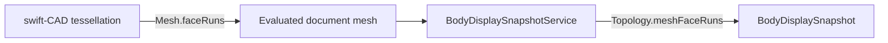
```mermaid
flowchart LR
    Kernel["swift-CAD tessellation"] -->|"Mesh.faceRuns"| Evaluated["Evaluated document mesh"]
    Evaluated --> Service["BodyDisplaySnapshotService"]
    Service -->|"Topology.meshFaceRuns"| Snapshot["BodyDisplaySnapshot"]
```

The runs are independent of `Topology.faces`. A `Face` carries the projected
outer loop a CPU polygon test needs and is absent for a face without one, while
a run needs no polygon and describes exactly the triangles the frame draws. A
face that evaluation gave no stable sub-shape identity records no run; the
omission is truthful absence, and a hit on such a triangle is reported as a miss
rather than answered with a neighbouring face. A run always carries the prepared
`SelectionComponentID`: Core never substitutes a mesh identifier for a CAD
identifier.

Each generated edge carries its bounded B-rep curve's display
polyline in stored edge direction. Failed sampling supplies an empty polyline,
not an endpoint chord. Complete open loops additionally carry loop identity.
The viewport may draw and hit-test that polyline,
but may not reconstruct a curved edge from its endpoints. Boundary-loop
affordance membership is published only when every edge in the loop has a valid
display polyline; a failed sample omits the action rather than showing a false
chord. These points are presentation data only and never replace exact B-rep
geometry or topology identity.

An edge's optional `affordanceFrame` carries the exact bounded-curve parameter
midpoint and one outward unit normal per distinct adjacent face at that point.
`BodyDisplaySnapshotService` resolves these from the same evaluated B-rep using
kernel edge/surface queries; a missing or failed query omits the frame. Consumers
must not invent a direction from the body centre. Normals remain separate so
occurrence inverse-transpose transforms precede normalization and composition.
The Rendering profile-affordance checks own end-to-end direction assertions.

### Object property effect contract

Every object property declares the one effect its edit has, so a control the
Inspector offers is a control that reaches the canvas.

| Effect | Meaning | Path an edit takes |
|---|---|---|
| `source` | Rewrites the CAD feature graph, so re-evaluation changes the exact geometry | `applyObjectPropertyToSource` to a `DesignDocument` source mutation |
| `tessellation` | Changes only the display resolution the evaluator uses for that feature | `displayTessellationOptions` to `TessellationOptions.featureOverrides` |
| `appearance` | Changes only how a resolved body is presented | Presentation scene and material resolution |
| `derived` | Reports a value the source owns and cannot be authored | `synchronizeObjectPropertiesFromSource` writes it |

Invariants:

- A property whose effect is `derived` is not editable and uses the read-only
  inspector control. A property that is editable declares `source`,
  `tessellation`, or `appearance`. `ObjectPropertyDefinition.validate` rejects
  any other combination, so a schema that offers an unreachable control fails
  document validation rather than reaching a user.
- A `source` property that the router has no mutation for throws
  `EditorError(code: .commandUnsupported)`. The router never returns without
  applying the edit it accepted, because a silent return leaves the declared
  value and the evaluated geometry disagreeing with no report to the caller.
- A `tessellation` property resolves to an angular tolerance through the
  property's own subdivision meaning. Its edit changes no feature operation and
  no exact geometry, so undo of a tessellation edit restores only the property.
- Kernel concepts Rupa has no source mutation for are absent from the schema.
  They are not declared as editable properties that do nothing. The schema
  carries exactly the exceptions listed below, each one held by the
  `FIXME(INCOMPLETE_IMPLEMENTATION)` marker on the router's unsupported branch,
  and each one refusing an edit with `EditorError(code: .commandUnsupported)`
  rather than reporting it applied. The list and the marker are one statement:
  neither may name a property the other does not.

  | Property | Declared on | Why no mutation reaches it |
  |---|---|---|
  | `caps` | `cylinder` | Not yet routed in Core; the kernel builds it |

  The rows that have cleared, cleared inside Core. A polygon or slot `bevel`
  stood here while the kernel's all-edge fillet built only a box or a circular
  cylinder; the [swift-CAD design](../../../swift-CAD/DESIGN.md) now builds the
  convex prism both profiles extrude, and `Polygon and slot bevel` below is the
  proof that the property reaches it. A cylinder `hollow` and `angle` stood here
  while a circle profile was one circle; `The cylinder profile family` below is
  the family that also holds a hole and a sector, and `Cylinder hollow` and
  `Cylinder angle` the proof that each property reaches it.

Segment counts are display resolution, not exact geometry. The kernel keeps
circles and arcs as rational arcs and derives a segment count from tolerance, so
`Sides`, `Corner Sides`, `Bevel Sides`, and `Arc Segments` reach the canvas as
the per-feature tolerances `Display tessellation resolution` below resolves,
which is the only place that mapping is defined.

A count that would subdivide a planar face or a straight generatrix declares no
property. The document is an exact B-rep, so splitting a plane into more
triangles produces the same surface and the same silhouette: the control would
move a number and change nothing on screen. This is why a cylinder declares
`Sides` for its circular section but no count along its axis, and why an
extruded rectangle declares no subdivision count.

The schema is the authority on which properties exist, so it can stop declaring
one. A document written by an earlier schema keeps the stored value until it is
loaded; `ProductMetadata.pruneUndeclaredObjectProperties` drops values no
declared property claims. Every boundary that decodes stored product metadata
runs it, against the same registry it then validates with, before validation:
`DocumentPackageStore` for a document package and
`ProjectController.assembleDocument` for a project package. Validation
therefore still rejects an undeclared property as invalid input, while an older
document opens with the stale value removed rather than being refused.

Dropping a value is a loss the person who opened the document cannot undo: the
next save writes the document without it. So the migration reports what it
dropped instead of discarding it. `pruneUndeclaredObjectProperties` returns the
dropped values as `[RetiredObjectProperty]`, one per scene node and property,
ordered by scene node and then property ID so the same document always reports
the same list. The result is not `@discardableResult`, which makes a boundary
that ignores it a compile error rather than a silent drop.

This design owns what was retired, and nothing about how it is shown. Each
decode boundary returns the list to its caller alongside the document, and the
caller that opened the document decides what to do with it. The
[RupaProject design](../RupaProject/DESIGN.md) carries the list from
`assembleDocument` to the project state snapshot, and the
[RupaUI design](../RupaUI/DESIGN.md) owns surfacing it to the person who opened
the document.

### Sketch profile source mutation

A sketch-category object declares its shape as properties, and an edit to one of
them rewrites the entities of the one sketch feature that built it. The router
dispatches on the object's type and the property's ID, not on its render
binding: arc `start.angle` and `end.angle` share `.angle`, and polygon
`sizing.radius` and `radius.is.inradius` declare no binding at all.

| Type | Source properties | Mutator | Anchor the edit keeps fixed |
|---|---|---|---|
| `line` | `length`, `angle` | `setLineSketchGeometry` | The start point |
| `arc` | `radius`, `start.angle`, `end.angle` | `setArcSketchGeometry` | The center |
| `circle` | `radius` | `setCircleSketchGeometry` | The center |
| `rectangle` | `size.x`, `size.y`, `corner.radius` | `setRectangleSketchGeometry` | The center of the bounds |
| `polygon` | `sizing.radius`, `radius.is.inradius`, `sides.x`, `angle` | `setPolygonSketchGeometry` | The center |
| `rectangle`, `circle` | `bevel` | `setProfileBevel` | The profile, which is unchanged: the edit lands on the body's fillet |

Each mutator reads the whole resolved property set rather than the one property
that changed, so one code path per type serves every property that type
declares, and the rebuilt sketch is the sketch those values describe.

Invariants:

- A mutator replaces the sketch feature through a single
  `CADDocument.replaceFeature`, keeping the feature's ID, inputs, and outputs.
  A value edit adds and removes no feature, so the design graph structure is
  unchanged and the evaluator rebuilds only the edited feature and what depends
  on it. This is the same shape as `setCubeDimensions`, and it is what makes a
  shape edit cost one feature rather than the document.
- Entity IDs are preserved whenever the new entity count equals the old one.
  Polygon `sides.x` is the one property that changes the count; it reuses the
  existing IDs in chain order for the sides it keeps and mints IDs only for the
  sides it adds. A dimension, bridge, or joined-curve source that referenced a
  dropped entity makes `ProductMetadata.validate` reject the edit, which is the
  visible failure the object property effect contract requires.
- A mutator that cannot express the value throws `EditorError` and leaves the
  document unchanged. `setSceneNodeObjectProperty` applies the whole edit to a
  copy and assigns it only on success, so a rejected value persists neither the
  property nor a partial rebuild.
- After the rebuild, the derived properties the source owns are recomputed:
  polygon `radius` and `side.length` follow from `sizing.radius`,
  `radius.is.inradius`, and `sides.x`, and any body extruded from the sketch has
  its size properties resynchronized through
  `synchronizeObjectPropertiesAffectedBySketch`.

Completion evidence for a shape edit is the evaluation metrics of the pass it
causes: `rebuiltFeatureCount` equals the edited sketch feature plus the features
downstream of it (1 for a bare sketch, 2 when the sketch is extruded),
`reusedFeatureCount` equals `totalFeatureCount - rebuiltFeatureCount`, and
`replayFallbackCount` is 0. The kernel mechanism that produces this is owned by
the [swift-CAD design](../../../swift-CAD/DESIGN.md); this design owns only the
in-place replacement that lets it apply.

#### The rounded rectangle profile

`corner.radius` is the second property that changes a profile's entity count.
A rectangle profile is one family, not two shapes: four axis-aligned lines named
`bottom`, `right`, `top`, and `left`, plus four corner arcs that exist only
while the radius is positive. `RectangleProfileBuilder` is the single owner of
what that family is, and every path that rebuilds a rectangle profile goes
through it, so a square profile and a rounded one are described by one piece of
code rather than two that can disagree.

Invariants the family carries:

- The four line IDs survive every edit, including the two that change the entity
  count. Arc IDs are minted when the radius goes from zero to positive, kept
  while it stays positive, and dropped when it returns to zero. This is the same
  identity rule polygon `sides.x` follows.
- The radius is either exactly zero or bounded by `r > tolerance` and
  `min(sizeX, sizeY) - 2r > tolerance`. At the upper equality two of the four
  lines have zero length and the profile is a stadium, which is the slot type's
  shape and not a rectangle's. A value outside the bound is refused with
  `EditorError(code: .commandInvalid)` and the document is unchanged, the same
  tolerance idiom `validateAllEdgeCorner` uses for the body fillet a cube declares.
- A rounded profile carries `horizontal` on the two horizontal lines, `vertical`
  on the two vertical ones, a counter-clockwise coincident chain alternating
  `lineEnd -> arcStart` and `arcEnd -> lineStart`, and `equalRadius` chaining
  the four arcs. `SketchProfileExtractor` runs the constraint solver whenever a
  sketch declares any constraint, so a square profile's `lineEnd -> lineStart`
  coincidences left in place would bind points an arc apart and the solver would
  collapse the shape. At `r == 0` the builder emits exactly the constraint set
  `createRectangleSketchFromCorners` emits, so a profile that was rounded and is
  no longer is indistinguishable from one that never was.
- The constraint set is replaced only where the entity set changes, which is the
  edit the radius itself is part of. A reposition leaves the entity set alone,
  so it leaves the constraints alone too, and a `.fixed` reference a dimension
  placed on a side survives a resize.
- A rounded profile and a bevelled box are mutually exclusive. Both name the same
  rounding, and the kernel's all-edge fillet needs the orthogonal box only a
  square-cornered profile extrudes to, so rounding a profile whose box is already
  bevelled and bevelling a box whose profile is already rounded are both refused
  with `EditorError(code: .commandInvalid)` before either mutates.
  `setRectangleSketchGeometry` owns the check for the profile and `setBoxCorner`
  for the box. The refusal is not a preference between two ways of rounding: the
  kernel builds one of them and silently fails to evaluate on the other.
- No tangency constraint is declared. The builder places the arcs tangent by
  construction, which leaves the solver a zero-residual configuration to hold;
  the polygon profile is under-constrained in the same way.

`updateRectangleSketch` preserves the radius while it repositions the corners,
so resizing a rounded rectangle keeps it rounded and a size that no longer
admits the radius is refused rather than silently squared off. Its callers that
still require a square profile are the direct-manipulation and dimension-handle
paths: solid vertex move, solid edge move, solid edge treatment, solid face
offset, sketch side dimension, and `ObjectDimensionSourceResolver`. Those map a
3D vertex or edge onto a rectangle corner, and a corner a rounded profile
replaced with an arc is not a point they can name. They refuse a rounded profile
with a typed error, which is the boundary this design draws rather than a gap.

Two paths accept the whole family: `setRectangleSketchGeometry`, which the
Inspector's rectangle shape section submits to, and `setCubeDimensions`, which
the Inspector's cube size fields submit to. The second is needed because
`createExtrudedRectangle` nests the `.rectangle` sketch node under the `.cube`
body node and only hides it, leaving it selectable and editable, so a rounded
profile is reachable underneath a cube and that cube's own size edit has to keep
working.

A rounded profile's arcs are drawn at the count `rectangle`'s own
`corner.sides` declares. Its binding is `.cornerSideSegments`, which
`DisplayTessellationArc` reads as the quarter turn one corner covers, so
`SketchArcDisplayResolution` divides each corner arc into exactly that many
segments. Until the profile could carry arcs that property named an arc the
rectangle did not have and reached nothing. How a body extruded from the profile
resolves its own mesh is owned by `Display tessellation resolution` below and is
unchanged here.

### The cylinder profile family

`Hollow` is the radius of a concentric hole through a cylinder, so a hollow of
`h` on a cylinder of radius `r` is the tube whose wall runs from `h` to `r`.
The reading is a radius rather than a wall thickness because the property's
default is zero and zero is a solid cylinder: a wall of zero thickness and a
wall as thick as the radius both describe the same solid, so no monotone
control could name both ends of a thickness.

`Angle` is the sweep that wall turns through, so an angle of `θ` is the sector
of the same cylinder running from the profile's own start angle to `θ` past it.
The reading is a turn rather than a cut because the property's default is a full
turn and a full turn is the circle the cylinder starts as: the sweep is
`(0°, 360°]`, `360°` restores the closed circle, and the schema's `[0°, 360°]`
range holds one shape at its top end rather than a degenerate one.

Both properties are declared on the `cylinder` body and rewrite the profile that
body's extrusion consumes, reaching the sketch through the body's
`sourceFeatureID` the way `size.x` and `radius` already do. They edit one
family, not four shapes:

| Sweep | Hollow | Entities | Faces |
|---|---|---|---|
| full turn | zero | one circle | 6 |
| full turn | positive | two concentric circles | 10 |
| partial | zero | one arc, two radial lines through the centre | 5 to 8 |
| partial | positive | two concentric arcs, two radial lines | 6 to 10 |

`CylinderProfile` is the single owner of what that family is, and every path
that reads or rewrites a cylinder's profile resolves it rather than counting
entities itself. The lateral counts are ranges because the kernel splits a
rational arc at the quadrant boundaries it crosses: a body carries two caps,
one to four faces for each arc the profile holds, and two more for the radial
walls a partial sweep adds.

Invariants the family carries:

- Every entity ID survives every edit that keeps the entity. The outer one lives
  across the change from circle to arc and back. The inner one is minted when
  the hollow goes from zero to positive, kept while it stays positive — across
  that same change of kind — and dropped when it returns to zero. The two radial
  lines are minted when the sweep leaves a full turn, rewritten while it stays
  partial, and dropped when it returns to one. This is the identity rule
  `RectangleProfileBuilder` follows for a rectangle's corner arcs.
- The inner entity is concentric with the outer one and strictly inside it. The
  hollow is either exactly zero or bounded by `hollow > tolerance` and
  `radius - hollow > tolerance`. The radius carries the same bound from the
  other side, so shrinking a cylinder onto the hole it already has is refused
  the way shrinking one onto its own fillet already is.
- A sector's two arcs share the start and end angles within `tolerance.angle`,
  and each radial line joins the two arcs at one of those angles — or the centre
  to the outer arc when the hollow is zero — within `tolerance.distance`. The
  start angle is the profile's own, not zero: the builder keeps the angle the
  outer entity already carries and uses zero only when it mints one, so turning
  an angle down and back up rotates nothing.
- The sweep is bounded by the chord it leaves, not by an angle.
  `SketchProfileExtractor` walks a loop by stepping from one entity's end to the
  next entity's start while those points are further apart than
  `tolerance.distance`, so an arc whose own two endpoints are closer than that
  closes a loop by itself and the extractor rejects the profile as open. The
  accepted sweep is therefore `2·r·sin(θ/2) > tolerance.distance` at the
  smallest radius the family holds — the hollow when it is positive, the outer
  radius otherwise. The bound is one expression at both ends, because the chord
  a sliver leaves and the chord a near-full turn leaves are the same quantity: a
  cylinder of radius 0.05 m accepts 0.01° and 359.99° and refuses 0.001° and
  359.999°, while one of radius 0.5 m accepts all four. A sweep inside the bound
  is refused with `EditorError(code: .commandInvalid)` and no minimum angle is
  published as a bound, because the refusal is a point at each end of the
  control rather than a control that can only fail, and because the point moves
  with the radius.
- The inner entity is a hole, not a second body. `SketchProfileExtractor` nests
  a loop inside the loop that contains it and makes it that profile's hole, so
  one extrusion of the family builds one tube: a solid cylinder evaluates to six
  faces and a hollow one to ten, four around each wall and two annular caps.
- `Corner` excludes both of the others, in both directions and before the
  rebuild rather than after it. Neither a tube nor a sector is one of the four
  convex prisms `What the kernel's all-edge fillet accepts` above lists, so a
  positive corner on either, and a hollow or a partial sweep on a filleted
  cylinder, are refused with `EditorError(code: .commandInvalid)` leaving the
  document unchanged. The Inspector is not left holding a control that can only
  fail: a hollow or swept cylinder publishes an all-edge corner maximum of zero,
  and a filleted cylinder a hollow maximum of zero, so each control is bounded
  by the other rather than refusing every drag. Core owns both maxima; the
  [RupaUI design](../RupaUI/DESIGN.md) owns surfacing them. `Hollow` and `Angle`
  do not exclude each other: an annular sector is one profile the extractor
  nests and the evaluator builds.

One builder writes every shape. A radial line runs from the hollow, or the
centre, out to the outer radius at one of the sweep's two ends, so its endpoints
depend on all three of radius, hollow and sweep at once: a mutator that moves
any one of them has to rebuild the family rather than rewrite one entity.
`CylinderProfileBuilder` is that single author. It takes the three numbers and
the IDs the profile already holds and returns the entities, the entity order,
and the IDs it used, which is the shape `RectangleProfileBuilder` already has.
The hazard it closes is concrete: before it, `setCylinderDimensions` and
`setCircleSketchGeometry` wrote a `.circle` straight over the outer entity, which
on a sector would turn the outer arc back into a closed circle and leave two
radial lines spanning nothing — a document that still evaluates but no longer
holds the sector the body displayed.

The family carries no constraints, which is what `SketchBuilder.circle` already
does for the circle it creates. Concentricity is the centre expression the
entities share, a radial line's endpoints are written from the same radius and
angle the arcs are, and this builder is their only author, so a solver
constraint would be a second authority over numbers one author already agrees
on.

Four paths accept the whole family. `setCylinderHollow` and `setCylinderAngle`
are the mutators the body's `Hollow` and `Angle` submit to.
`setCylinderDimensions` is the body's own radius and height edit, which has to
keep working over a hole and across a sector the way it already keeps working
under a fillet. `setCircleSketchGeometry` is the nested sketch node's own
radius: `createExtrudedCircle` hides that node under the body rather than
removing it, so the profile stays selectable and editable underneath a hollow or
swept cylinder, and its radius names the outer entity. All four refuse a radius
the current hollow no longer fits inside, and the two radius paths also refuse
one that would take the current sweep inside the chord bound.

A cylinder's size is the diameter of the wall it is cut from, not the bounding
box of the sector that survives the cut. `Size X` and `Size Z` read `2·r` at
every sweep, because the number the reader reports is the number the radius
mutator writes back, and a reader that reported a 90° sector's bounds would
halve the cylinder on the next round trip.

A profile the family does not recognize is not one this design edits, and
because the builder rewrites every entity in the family, the recognizer's
strictness is what keeps a cylinder edit off a sketch someone drew. It names
only the exact family: one or two circles, or one or two arcs closed by exactly
two lines, sharing one centre, with two arcs sharing their start and end angles
and the lines meeting the arcs — or the centre — at those angles. A stadium
holds two arcs and two lines too, and an annular half turn holds the same counts
as one, so concentricity is what separates them: a stadium's two arcs sit at
different centres and fall through to `recognizedStadiumProfile` unchanged.
Every other sketch names no cylinder profile, and each caller keeps the
behaviour it already has for a profile it cannot name rather than guessing which
entity is the wall.

### Cylinder caps

`Caps` is whether the two ends of a cylinder are closed. It is the one property
in this group that does not rewrite the profile: the wall of a capped cylinder
and the wall of an uncapped one are swept from the same circle, arc, annulus or
annular sector, and what differs is only whether the extrusion sews the two ends
onto the wall it sweeps. So the flag lives on the extrusion as
`ExtrudeFeature.resultKind`, owned by the
[CADIR design](../../../swift-CAD/Sources/CADIR/DESIGN.md), and none of the
profile paths above see it. An uncapped cylinder has exactly the faces its
capped form has, less the two caps.

An uncapped cylinder is a sheet, not a solid that lost two faces, and that one
fact moves three values that have to move together:

| Value | Capped | Uncapped |
|---|---|---|
| `ExtrudeFeature.resultKind` | `.solid` | `.sheet` |
| the extrude node's one output role | `.body` | `.sheet` |
| the body object's `geometryRole` | `.solid` | `.surface` |

`DesignGraph.validateExtrudeContract` binds the first two and `ProductMetadata`
binds the second to the third, so any two of them disagreeing is a document that
fails validation rather than one that evaluates into a body nothing describes.
`setCylinderCaps` writes all three in one transaction and validates before it
commits, which is what `setCylinderHollow` and `setCylinderAngle` already do for
the one value each of them moves.

The feature's outputs are the only authority on a cylinder's `geometryRole`, and
a type's declared role is a default rather than a second authority.
`ProductMetadata` forces every object of a type that declares a role to carry
it, so `cylinder` declares none: it is the one built-in type whose objects are a
body under one setting of their own property and a surface under the other.
Declaring nothing loses no check, because the role still has to agree with the
feature the object names. `ObjectTypeRegistry` is resolved at run time and is no
part of what a document stores, so a cylinder saved before caps existed reads
the same catalog every new one does and needs no migration: it carries `.solid`,
its extrusion declares a `.body` output, and the two agree.

`Caps` excludes `Corner`, and nothing else. An all-edge fillet rounds a solid,
so an uncapped cylinder offers it nothing to round — but the profile is
unchanged, which is the whole point of putting the flag on the extrusion, so
`recognizedAllEdgeFilletProfile` still names the circle underneath one.
`allEdgeFilletTarget` and `validateBoxCornerTarget` therefore read `resultKind`
and refuse a sheet explicitly rather than waiting for a profile that will never
stop being recognizable, and `maximumAllEdgeCornerRadius` publishes zero for an
uncapped cylinder the way it already does for a hollow or a swept one, so the
control collapses instead of refusing every drag. Clearing the caps on a rounded
cylinder is refused before the rebuild, the way a hollow or an angle on one
already is.

`Caps` excludes neither `Hollow` nor `Angle`. All four combinations evaluate and
pass exact validation. A hollow full turn is one sheet body of two disjoint
shells, one for each of the profile's two boundary loops, and that is a valid
body rather than a defect: the shells bound no volume between them and none is
claimed. A hollow sector is one shell, because its single loop already joins the
wall to the hole. So no pair of controls in this group bounds the other, and the
family table above describes the wall of a capped and an uncapped cylinder
alike.

Nothing silently puts the caps back. Every mutator that changes a cylinder's
depth, size or placement binds the `ExtrudeFeature` the document already holds
and writes the field it means to change, rather than constructing a new feature
out of the parts it read, so a field it does not know about is carried forward
unchanged. Only the authoring paths construct an `ExtrudeFeature` from nothing,
and those are creating a body that has no caps setting yet. This invariant is
what keeps a `Size Y` drag on an uncapped cylinder from handing back a solid,
and it is why `resultKind` is a stored field with a default rather than
something each edit derives.

An uncapped cylinder is measured as the sheet it is. `MeasurementService`
reports a volume, a surface area and a centre of mass for a solid extrusion; for
a sheet one it reports the sheet's own measurements instead, the way it already
separates the two kinds of sweep. Reporting the volume the profile and the
distance would enclose would be reporting a solid this document does not hold.

### Display tessellation resolution

The sphere schema declares `sides.x` as a display-only full-circle segment
count, with the same default and admissible counts as the cylinder's circular
section. Its radius remains read-only source-derived metadata with no render
binding. The common resolver obtains the sphere radius from its analytic CAD
primitive, not Product metadata, and maps the count to angular and sagitta
tolerances through the same calculation used by circular extrusion profiles.
The count controls great-circle boundary resolution; interior sphere sampling
remains the kernel's responsibility. Neither count edits nor Mesh generation
change the analytic sphere, exact B-Rep, modeling tolerance, or resource ceiling.

The count is explicit persisted display intent, not an automatic fallback after
resource exhaustion. Explicit document edge-length constraints and stricter
feature overrides still apply, and exhausted requests still fail atomically.
`DisplayTessellationTests` verifies source/B-Rep preservation, resolution changes,
scale-independent angular fidelity, and unchanged count validation. Core sphere
creation tests and the fixed hundred-case semantic replay verify downstream
execution. RupaKit composition consumes the same resolved configuration as Core;
Rendering receives only the resulting admitted Mesh and must verify it on Metal.

`DesignDocument.displayTessellationOptions` is the single owner of the mapping
from declared subdivision counts to the `TessellationOptions` the evaluator
receives. It keys `featureOverrides` by the body object's `sourceFeatureID`,
because the kernel resolves one override per body: a body evaluates against one
`TessellationOptions`, so a count keyed to anything that is not a body reaches
no mesh.

A `corner.radius` or `bevel` edit moves both the exact fillet and this display
resolution, because the corner's linear tolerance is resolved from the radius.
Core relies on the kernel contract that the mesh request selects artifacts and
not topology: a changed `TessellationOptions` re-tessellates bodies but rebuilds
no feature, so such an edit costs one fillet rebuild rather than a whole
document. See invariant 7 of the
[CADKernel design](../../../swift-CAD/Sources/CADKernel/DESIGN.md).

Each object's counts govern that object's own display. A body object reads the
counts its own type schema declares. A body the source router rewrote into a
schema-less solid keeps the `profile.arc.segments` value that rewrite preserved,
and reads that instead, because the rewrite dropped the schema but not the
resolution the profile was drawn at.

A count claims the arc its binding divides, and the feature graph is the
authority on whether that arc exists:

| Binding | Arc it divides | Span | Radius |
|---|---|---|---|
| `segments.side` | A swept circular profile or analytic sphere great circle | `2 * .pi` | The source profile circle or sphere radius |
| `corner.segments` | One rounded corner of the all-edge round | `.pi / 2` | The all-edge fillet radius |
| `bevel.segments` | One rounded corner of the all-edge round | `.pi / 2` | The all-edge fillet radius |

When the graph holds no such arc — a rounding radius of zero, or a body that is
neither swept from a circular profile nor an analytic sphere — the count claims nothing and the body keeps the
document's own tolerances. That is truthful absence rather than a fallback:
there is no arc for the count to divide, so no resolution it could name would
move a triangle.

A claim resolves to the tolerances the kernel's samplers read:

```
angularTolerance = span / (Double(count) - 0.5)
linearTolerance  = radius * (1 - cos(span / (2 * (Double(count) - 0.5))))
```

The angular tolerance is what the arc sampler divides the span by, and the half
step keeps its `ceil` from returning `count + 1` for a span that lands a
floating-point step above an exact multiple. The linear tolerance is the chord
height of the same half-stepped segment. Every circular sampler takes the
larger of the turning count and the chord count, and spherical radial sampling
the finer of the two angles, so the chord bound carries the same half step: a
claim that left the linear tolerance at the document value would subdivide the
arc past the count that named it, and one at the exact segment's chord height
could round up to `count + 1`. A claim whose radius the graph
does not resolve names only an angular tolerance, which is radius independent.

When more than one claim lands on one body, the finest tolerance wins. The
counts divide different arcs of the same body, and a coarse claim on one arc
does not take resolution away from a finer claim on another. An override
inherits the document's `maxEdgeLength` unchanged, because a count names an
angular resolution and says nothing about edge length. A body no claim reaches
inherits the document's tessellation options whole.

The kernel charts circular geometry one quadrant at a time and samples every
chart on its own from the body's single angular tolerance, so an arc is drawn at
a multiple of the quadrants it covers: a full turn is four lateral charts, and
one rounded corner is one. A chart sampled at a single segment is a chord that
leaves it open, so the sampler never returns fewer than two segments for a chart.
`DisplayTessellationArc` owns both facts, and the schema declares the counts they
leave:

| Arc | Quadrant charts | Lowest count | Step |
|---|---|---|---|
| Swept profile | 4 | 8 | 4 |
| All-edge round | 1 | 2 | 1 |

The Inspector therefore offers the counts the canvas draws and nothing between
them, rather than offering a count the sampler would quietly round up. A document
carrying a count the canvas cannot resolve is refused by
`ObjectPropertySet.validate(against:)`, which checks a stored value against both
the bounds and the step of its declared range, instead of being redrawn at a
count it does not name.

Sketch curve display is the second half of this contract, and it is resolved
without `TessellationOptions`. The kernel samples sketch curves through
`SketchCurveExtractor`, whose points are consumed as geometry by sweep paths,
guides, bridges and curve queries, so the resolution a sketch declares cannot be
spent by resampling the evaluated curve. The canvas draws a sketch from
`SketchDisplaySnapshot` instead, and the declared resolution reaches the canvas
as the number of segments the drawn polyline is sampled with.

A sketch object declares counts the way a body object does, and the table above
says which arc each count divides. What differs is which of those arcs the
sketch itself holds:

| Binding | An arc the sketch draws |
|---|---|
| `segments.side` | Yes: the profile a body would be swept from is the sketch |
| `corner.segments` | Yes: a rounded profile corner is drawn in the sketch plane |
| `bevel.segments` | No: the extrusion creates the bevel, and no sketch curve draws it |

A count on a binding the sketch does not hold claims nothing here, so a sketch is
never drawn at a resolution named for an arc that exists only once it is
extruded. `DisplayTessellationArc` still owns each binding's span; which of those
arcs a sketch holds is a separate judgement, because that type maps a rounded
profile corner and an extrusion bevel onto the same quadrant arc.

What separates this from the body contract is which counts are eligible, not how
eligible ones combine. A body is one mesh under one `TessellationOptions`, so
every count the object declares claims on it and the finest wins. A sketch
considers only the counts naming arcs it holds. Among those the finest governs
too, because the arcs one sketch draws are parts of a single outline and an
outline drawn at two resolutions breaks where the parts meet. A claim names an
angular resolution, and every arc the sketch draws is divided at it:

```
radiansPerSegment = arc.span / Double(count)
segmentCount      = ceil(abs(span) / radiansPerSegment)
```

An arc whose span exceeds a full turn wraps onto the circle it already drew, so
the count is bounded by the segments a full turn earns at the same resolution.
That bound is the resolution's own statement about this circle rather than a
budget imposed on it, and below a full turn it changes nothing.

A count whose arc is the whole primitive reproduces itself, so a circle
declaring sixty-four segments of a full turn is drawn with sixty-four. The same
resolution also divides a span no declaration named, which is how one count
governs a slot whose profile is a full turn while the caps it draws are half
turns. It is the resolution `displayTessellationOptions` gives the kernel for
the body swept from that sketch, so a curve and the solid it becomes are
subdivided the same way instead of at two counts that merely share a name.

A drawn arc is never divided below two segments and a closed circle never below
three, because one segment is a chord and two enclose nothing.
`SketchArcDisplayResolution` owns the resolution, those floors, and the counts
drawn where no declaration reaches a sketch, which remain the counts the frame
already draws an undeclared sketch at. An absent declaration is truthful absence
rather than a count this contract failed to deliver, and a stored count outside
its declared range never reaches the canvas at all, because
`ObjectPropertySet.validate(against:)` refuses it first.

The resolved count travels on the scene primitive itself. That placement is
owned by the
[RupaViewportScene design](../RupaViewportScene/DESIGN.md#sketch-curve-display-resolution).

### Material library authoring contract

`ProductMetadata.materialLibrary` is the only owner of authored appearance.
A scene node names a material; it does not carry color.

The appearance a node carries is one resolution and Core owns it: the material
the node names, or the document default when the node names none, or
`Material.neutral` when the document names none either. `sceneNodeAppearance(id:)`
answers with that resolution for every node the document holds, and with nothing
only when the identifier names no node at all, so the canvas, the Inspector, and
the seed of a first edit read one value rather than three copies of a chain that
could drift apart.

`authorableSceneNodeAppearance(id:)` is that same read narrowed to what a person
may edit. It answers with nothing for a node whose appearance
`setSceneNodeAppearance` refuses and otherwise with what the node carries, so a
caller offering a control only where this answers offers no control that fails.

Core owns authoring appearance through exactly one command,
`setSceneNodeAppearance`. It edits one component of the appearance one node
carries, and it rejects a value outside that component's validated domain
before mutating, so a rejected edit publishes no library change.

Creating, renaming, and removing a library entry by naming the material rather
than a node are not part of this contract. A library entry no node reaches has
no appearance to show, so the Inspector edits appearance where a person sees
it, and Core publishes no command whose only caller would be a library editor
that does not exist. A library editor, if one is ever authored, brings its own
commands and its own section in this design.

An Inspector color edit on a node with no material is an authoring intent, not a
failure: the workspace creates a material for that node and assigns it in the
same command, so the edit is a single undo step.

`setSceneNodeAppearance` is that command. It applies one component, base color
or opacity or metallic or roughness, to the material the node names, and when
the node names none it inserts one named after the node, assigns it, and applies
the component to it. Creating and assigning cannot be two commands sharing one
transaction, because a transaction fixes its commands before the first one runs
and nothing outside Core can name an identifier Core has yet to mint.

The name that command gives a material it creates is the node's own name, and
when the library already holds that name it appends the smallest integer that
makes the name unique. Two nodes may carry the same name, a library name may
not, and a library name is how a person tells two materials apart. A node
holding no name of its own names its material `Material`, suffixed the same way.

A generated pattern-array output refuses an appearance edit exactly as it
refuses `setSceneNodeMaterial`, because the pattern source owns the appearance
of everything it generates.

The material that command creates starts from the appearance the node already
carries, copied under a new identifier and a name of its own. Authoring one
component then moves that component and leaves the other three where the canvas
already had them, rather than repainting a body because its opacity was dragged.
`Material.neutral` is the end of that chain rather than a fixed seed: the copy
begins there only when neither the node nor the document names a material.

A material created for a node does not become the document default, even when it
is the first material the document holds. The default is what a node naming no
material of its own is drawn with, so promoting this one would restyle every
body the person never touched on account of an edit aimed at one of them. What
the default exists to guarantee already holds here, because the node the same
command assigns it to reaches it, and because the created material begins as a
copy of that default whenever the document holds one.

The Inspector appearance section authors the four components `Material`
declares and no fifth: base color, opacity, metallic, and roughness. Each is a
unit interval `Material.validate` owns, and a value outside it is refused before
the library changes rather than clamped into range. Which of the four the native
surface consumes is owned by the
[RupaRendering design](../RupaRendering/DESIGN.md).

The section shows those four for a node naming no material of its own as well,
because `authorableSceneNodeAppearance(id:)` answers there with what that node
carries. The values a person sees are the values the canvas already draws,
because the canvas resolves the same read, so the first edit moves a control
that was never blank and never lying.

### Executor substitution boundary

The public `DefaultGeometrySourceCommandApplier` initializer selects
`DefaultMeshEditPlanExecutor` and does not accept an external executor. A
package-scoped initializer accepts the package-scoped `MeshEditPlanExecuting`
seam for same-package composition and tests. T09 does not promise external
executor substitutability; Agent, CLI, MCP, and future provider transports use
the Core command boundary rather than injecting an executor.

Core tests may inject a package test executor that delegates to the default
executor or throws a typed failure. They do not construct malformed execution
values or test Core revalidation, because invalid candidates cannot cross the
production Geometry boundary.

## Runtime Flows

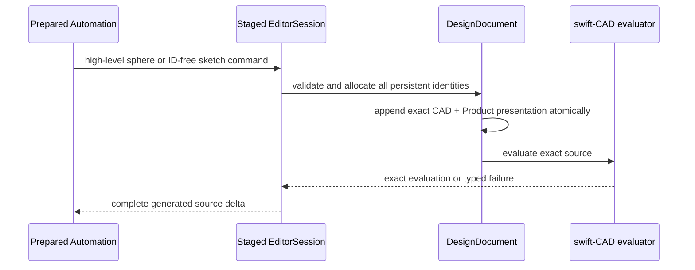
```mermaid
sequenceDiagram
    participant A as Prepared Automation
    participant S as Staged EditorSession
    participant D as DesignDocument
    participant K as swift-CAD evaluator
    A->>S: high-level sphere or ID-free sketch command
    S->>D: validate and allocate all persistent identities
    D->>D: append exact CAD + Product presentation atomically
    D->>K: evaluate exact source
    K-->>S: exact evaluation or typed failure
    S-->>A: complete generated source delta
```

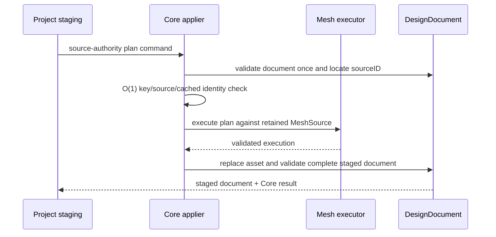
```mermaid
sequenceDiagram
    participant P as Project staging
    participant A as Core applier
    participant E as Mesh executor
    participant D as DesignDocument

    P->>A: source-authority plan command
    A->>D: validate document once and locate sourceID
    A->>A: O(1) key/source/cached identity check
    A->>E: execute plan against retained MeshSource
    E-->>A: validated execution
    A->>D: replace asset and validate complete staged document
    D-->>P: staged document + Core result
```

If execution or validation fails, the original document value remains unchanged.
The project layer decides whether and when the staged value is published.

## State, Ownership, and Lifecycle

- `DesignDocument` owns the retained asset dictionary and Product references.
- `DesignDocument` owns every persistent identity materialized from an ID-free
  sketch plan and the Feature/Product state created for an analytic sphere.
- `RupaGeometry` owns the temporary mutable buffer during plan execution.
- `AuthoredMeshAsset` owns published Mesh source identity, payload, and
  provenance.
- Core application results are immutable staged values and do not publish by
  themselves.
- Undo/redo and transaction revision are recorded by `EditorSession`/
  `ProjectController` around the Core application, not inside the Geometry
  executor.

## Failure, Concurrency, and Constraints

Core rejects invalid or degenerate CAD creation values, invalid ID-free sketch
indices/relations, source-domain mismatch, an asset dictionary key/source-ID mismatch,
missing asset, stale content identity, executor failure, and post-replacement
document validation failure with typed errors. It never returns the original
asset as a success fallback after a failed edit and it does not fail merely
because no inverse Object/reference is present.

The Core value path is immutable during asynchronous project staging. Any
mutable session access remains inside the existing project/session isolation
boundary. No `await`, package I/O, or external callback occurs during a Geometry
buffer borrow.

## Verification and Change Impact

T09-B owns the following behavioral proof:

| Invariant | Required evidence |
|---|---|
| Authority | Current, stale, missing, domain/key/source-ID, retained-but-unselected, and no-inverse-reference source cases. |
| Plan integration | One complete plan, receipt propagation from a validated execution, one executor invocation with no Core replay, valid create-then-delete lifecycle, no-op identity stability, and mid-plan rollback. |
| Shared source | One edited asset is visible through every retained representation reference; no implicit clone. |
| Independence | CAD/Product/selection/provenance bytes remain unchanged after Mesh edit. |
| History | One command-history entry plus undo/redo behavior. |
| Error handling | Typed failures do not publish a partial document. |
| Product visibility | Root, hidden-parent, visible-sibling, and hidden-descendant cases prove one effective-visibility result without source deletion. |
| Evaluated primitives | Box, cylinder, cone, sphere, and torus all produce evaluated-body solids with exact B-rep volume and Mesh-only area/bounds through one cached evaluation path; unavailable outputs remain diagnostics. |
| Snap topology demand | Positive-radius authored-mesh-only object resolution skips whole-document topology validation and still returns grid/non-topology candidates; topology measurement anchors force the existing validation failure during object resolution; existing CAD snap and measurement cases remain green; a matching caller evaluation context resolves object candidates on a CAD document without consulting the exact evaluator, and the same resolve without that context still consults it. |
| Body display face runs | `Tests/RupaCoreTests/BodyDisplaySnapshotServiceTests.swift` proves an evaluated box snapshot records one run per prepared face, that the runs carry the same prepared identities as `Topology.faces`, and that they partition every drawn triangle contiguously from zero to the snapshot's triangle count. |
| Display tessellation resolution | `Tests/RupaCoreTests/DisplayTessellationTests.swift` proves a declared side count is the number of turns the evaluated mesh samples the profile at, that a cylinder is drawn at its declared count instead of the document tolerance, that every count the schema offers from the lowest one up is the count the mesh draws, that a count between them is refused rather than redrawn, that a declared corner count is the number of segments the rounded corner carries, that a count naming an arc the body does not hold claims nothing, and that a rounded box resolves its corner count against the fillet radius. |
| Node appearance authoring | `Tests/RupaCoreTests/SceneNodeAppearanceTests.swift` proves that an appearance edit on a node holding no material creates one, assigns it, and leaves the document default alone; that the created material keeps the values of the three components the edit does not name, taken from the document default when the document holds one and from the neutral appearance when it does not; that `sceneNodeAppearance(id:)` resolves the node's material, then the document default, then the neutral appearance; that a second node's edit does not reuse the first node's material name; that a value outside the unit interval is refused with the library and the node unchanged; and that a generated pattern-array output refuses the edit while `sceneNodeAppearance(id:)` still answers for it. |
| Box bevel and corner radius | `Tests/RupaCoreTests/RectangleProfileBevelTests.swift` proves that a profile's `bevel` and its box's `corner.radius` are two views of one fillet, the evaluated face count rising from 6 to 26 and both properties reading back the same value; that resizing the profile under the wrapper still resynchronizes the body and keeps the fillet; that a rounded profile and a bevelled box each refuse the other with `.commandInvalid` and no metadata change; that a bevel on a profile with no body yet is bounded by the profile's own sides and applied by the extrusion that creates the body; that a depth edit resolves through the wrapper to the hidden extrusion and is refused when the new depth no longer admits the radius; and that changing an existing bevel rebuilds only the fillet, reusing the profile and the extrusion. |
| Cylinder corner radius and circle bevel | `Tests/RupaCoreTests/CylinderCornerTests.swift` proves that a cylinder's `corner.radius` and its circle profile's `bevel` are two views of one fillet, the evaluated face count rising from 6 to 14 and an edit to either reading back on both while the body keeps its reference; that the dimensions of a rounded cylinder resolve through the wrapper to the hidden extrusion, survive a `.rupa` round trip, and on zero restore that extrusion into the visible feature while its hidden node is removed; that a radius the cross-section or the height cannot admit is refused before the mutation, leaving the source fingerprint and the metadata unchanged, including one just inside half the cylinder radius, where the rim torus would self-intersect; that the maximum Core publishes is instead an edit that applies; that shrinking either the circle or the cylinder below the radius it already carries is refused the same way; and that a bevel on a circle profile with no body yet is bounded by half its own radius and applied by the extrusion that creates the cylinder. |
| Polygon and slot bevel | `Tests/RupaCoreTests/PolygonSlotBevelTests.swift` proves that a polygon or slot profile's `bevel` is the all-edge fillet on the prism it extrudes, and, since neither body is a typed object and so carries no `corner.radius` of its own, the whole Inspector surface for that fillet: the evaluated face count rises from 8 to 38 for a hexagonal prism and from 8 to 20 for a slot's stadium prism, and returns on zero. It further proves that a four-sided polygon rounds through the polygon family the rectangle recognizer refuses; that the maximum each of the three families publishes is an edit that applies and evaluates while one tolerance past its bound is refused with the source fingerprint and the metadata unchanged; that a shallow prism is bounded by its depth rather than by its sides; that reshaping a polygon under a bevel its new cross-section no longer admits is refused before the rebuild, leaving the fillet and the document as they were; that a bevel on a slot with no body yet is bounded by half its own width and applied by the extrusion that creates the prism; and that a slot along an arc refuses a positive bevel and accepts zero. |
| Cylinder hollow | `Tests/RupaCoreTests/CylinderHollowTests.swift` proves that a cylinder's `hollow` is the concentric hole in its circle profile rather than a number stored beside it: a positive hollow mints the inner circle and the evaluated face count rises from 6 to 10, a return to zero drops that entity and restores 6, and the body keeps its reference across both. It further proves that `hollow` and `corner.radius` refuse each other in both orders with `.commandInvalid`, the tube staying at 10 faces with its hollow intact and the rounded cylinder at 14 with its radius intact; that each maximum collapses to zero while the other edit holds the body, so the Inspector collapses the control it cannot accept instead of offering a drag that can only fail; and that a radius the current hollow no longer fits inside is refused before the rebuild by both `setCylinderDimensions` and `setCircleSketchGeometry`, while a radius the hole still fits inside is accepted by both and keeps that hole. |

CADAPI-C must additionally prove:

| Invariant | Required evidence |
|---|---|
| Exact sphere | Origin and translated valid spheres retain the requested center/radius, `ObjectTypeID.sphere`, one body role, and exact 8/12/6 analytic B-Rep; zero/negative/tolerance-sized radius and nonfinite center fail without source/Product/history change. |
| Identity ownership | Repeating the same ID-free sketch plan creates distinct server-owned entity identities; no Core creation input contains `SketchEntityID`. |
| Constraint materialization | All eight supported relations materialize correctly; missing/out-of-range indices, wrong entity kinds, invalid coincident endpoints, and duplicate/self references fail atomically. |
| Command admission | Every exhaustive Core/Automation command classification handles history and CAD source commands, and raw graph/legacy caller-built Sketch does not become a semantic CAD operation. |

Changes to CAD creation, target identity, asset replacement, provenance, or
Core command decoding require rechecking `RupaAutomation`, `RupaCADDomain`,
`RupaProject` staging, and the system source-authority invariants.

### Signed extrusion endpoint adoption

Extrude creation retains signed start/end expressions. CADIR's `resolvedAxialRange`
is the sole endpoint admission rule used by construction, measurement, topology
selection and object dimensions. Editing an end retains the start; dimension
editing changes span while retaining the authored start and direction. History
edits, parameter usage and native replay retain both expressions. Zero-span edits
fail before publication. Existing one-sided face-offset placement behavior remains
compatible; explicitly positioned extrusions move their source endpoints directly.

### Constrained Surface source ownership

Core retains `ConstrainedSurfaceFeature` point constraints and options in the
feature graph. Creation publishes a sheet occurrence; replacement preserves the
feature/output/occurrence IDs and placements. Both use the existing atomic
command evaluation and Undo transaction. Native CADModeling owns fitting and
independent geometric admission; no generated control net replaces the source.
UI owns only transient point collection and text; the same EditorCommand route
serves automation. Failure preserves the previous source and evaluated scene.
Verification covers source replacement, native package replay and failed commit.

### Authored extrusion options

Full-source extrusion creation/replacement retains native section, signed extents,
Boolean targets and Keep Tools. Replacement preserves the feature and output IDs,
section identity and output role. The existing atomic commit admits actual
geometry before publication; invalid targets leave source and scene unchanged.
Boolean extrusion measurements use evaluated body results rather than the
uncombined profile area. Consumed targets leave the visible/measurable set;
Keep Tools retains the native Boolean result ownership. Legacy extrusion commands
continue to create new bodies. Pattern remapping remaps target references.

### Independent arrays of instances

Rectangular, radial and curve arrays share the same independent-copy path. Before
output removal, the builder captures the source in the first root's parent frame.
A temporary document realizes copied instances recursively through Scene Cloning;
the original instances and definitions remain unchanged. Output features and mesh
assets have independent identities and the existing array owner removes them.
Definition identity includes nested definition content and instance placement,
visibility and properties, rejecting recursive definitions. Instance output keeps
sharing the definition. `PatternArrayInstanceSourceTests` verifies all three
distributions, placement, identity reuse, source changes, cleanup and undo/redo.

### Persistent curve extension and section identity

Natural extension stores CAD expressions containing the oriented end Bezier control-point expressions, distance expression and output coordinate. CADCore owns the shared numeric continuation; both evaluators resolve current inputs, preserve length units and propagate invalid geometry. Explicit-knot end spans are extracted by Boehm insertion in expression space. Line extension uses expression-valued endpoint differences and their norm. Serialization, dependency discovery, editable text and both evaluators must agree. Numeric control points are evaluation results, never the authority for a parameterized extension. Existing literal-only documents remain readable; older readers reject unknown expression kinds.

Section endpoints are welded per occurrence using Euclidean distance, independent of cell boundaries. Sorted endpoints choose deterministic representatives; every member is within tolerance of its representative (no transitive widening). Cell indexing is only an accelerator; out-of-range coordinates use the same distance predicate without integer saturation. Edges and emitted points use the same representative. Verification covers neighboring cells, diagonal non-neighbors, permutations, translations, closed contours and interference.

### Sketch P1 editing invariants

Raise Degree and general spline Split consume CADIR's symbolic refinement contract;
line splits and raised midpoints also retain coordinate expressions. Parameter
changes must commute with these geometry-preserving edits; snapshots of evaluated
coordinates are not persistent source replacements. Core owns reference migration,
source metadata and atomic commit, while swift-CAD owns spline refinement algebra.

Projection and Cut resolve the selected scene node hierarchy once per source/target
pair. Source plane -> source world placement -> target inverse placement -> target
plane is the common coordinate flow. Projected sketches are authored in world space;
the creation boundary compensates the output parent placement so it applies exactly once.
Projection discards depth intentionally;
planar Cut requires coplanarity before interpreting intersections. Affine line and
spline placement is exact; circular entities require an in-plane similarity and
refuse an unrepresentable ellipse explicitly. Reflections preserve the represented
arc interval by reversing its parameter sense. Source documents remain unchanged
when any selected cutter, placement or geometry operation fails.

Cut Curve in Screen space (`CutCurveOptions.usesScreenSpaceDirection` with the world
`screenDirection`) carries the cutter onto the target's plane along the view instead of
requiring the two coplanar (`obliquelyProjectedSketchEntity`: an affine oblique projection,
exact for lines and splines, an arc or circle through its cubic chain), then cuts as on one
plane. A face cutter cuts a line, arc or open spline where it crosses the face inside its
trim (`faceCutFractions`: the target in world space, its height along the face's outward
normal from Swift-CAD's `FaceUVNChart` sampled for sign changes and bisected, each crossing
checked on the trimmed face). `CutCurveScreenSpaceAndFaceTests` own these.

Trim includes closed splines as intersection boundaries. A closed target's editing
capability is separate from a closed cutter's intersection capability. An unsupported
or uncertifiable cutter fails the operation; it is never silently treated as absent.

Verification: focused SketchP1 regression tests exercise changed source parameters,
explicit knots and multiple degrees, translated/rotated/scaled/reflected sketches,
parent placements, off-plane refusal, closed boundaries and atomic failures. Final
integration uses the rebuilt application's linked implementation.
