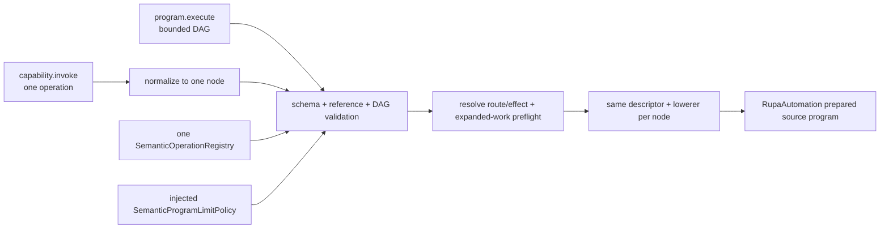
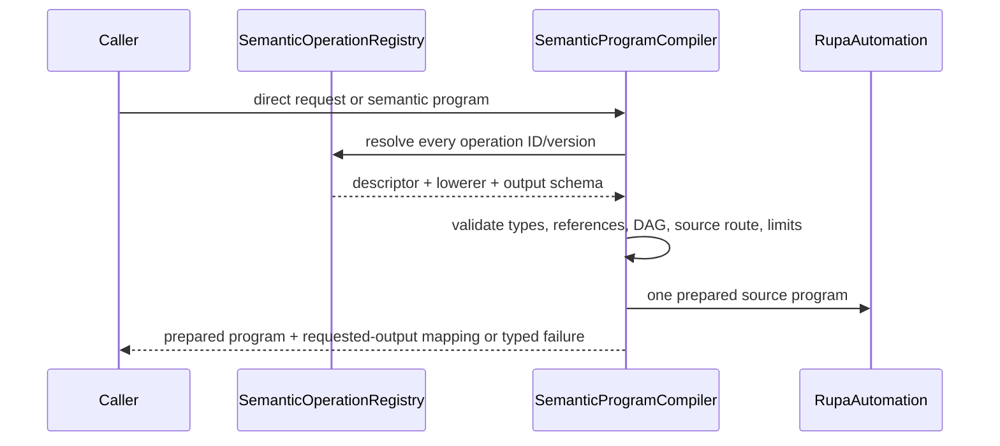

# RupaDomainFoundation Semantic Program Design

## Purpose and Scope

`RupaDomainFoundation` owns the generic registry, typed value/reference model,
bounded declarative program, and semantic compilation contracts used by domain
operations. It is a child of the [RupaKit package design](../../DESIGN.md) and
depends on `RupaCore`, `RupaCoreTypes`, `RupaAutomation`, and
`RupaCapabilities`.

CADAPI-D uses this generic foundation for both public CAD mutation forms.
`RupaCADDomain` supplies concrete CAD operation descriptors and
lowerers; this module never embeds a CAD-specific switch. Existing
`DomainCommandRequest` and `DefaultDomainCommandPlanResolver` are separate
legacy inventory and are not semantic compiler entry points.

Parent: [package design](../../DESIGN.md). Children: none.

## Responsibilities and Boundaries

This module owns:

- one versioned semantic operation registry shared by direct invocation and
  program nodes;
- recursive typed values, request-local symbols, typed existing-source
  references, typed local-output references, and bounded pure expressions;
- order-independent DAG validation, deterministic topological ordering,
  source-route/effect validation, whole-program preflight, and compilation to a
  domain-neutral `RupaAutomation` prepared source program;
- injectable limit policy and typed compilation failures;
- output declarations that map request-local outputs to staged source identity
  kinds without resolving or publishing those identities.

It does not own concrete CAD operation vocabulary, Product/CAD/Mesh state,
persistent ID allocation, `EditorSession`, project coordinates, workspace
publication, package bytes, transport, CLI syntax, UI, or save behavior.

## Related Designs

| Design | Relationship | Contract Used | Summary | Cautions |
|---|---|---|---|---|
| [package design](../../DESIGN.md) | parent | package graph and `RupaCADDomain` boundary | Places generic semantic compilation above Automation and below adapters. | Foundation must remain independent of concrete operation names. |
| [RupaCADDomain design](../RupaCADDomain/DESIGN.md) | used by | Descriptor/lowerer registration contract | Supplies the concrete versioned CAD vocabulary to this generic compiler. | CADDomain may not add another invocation form or read project coordinates. |
| [RupaAutomation](../RupaAutomation/DESIGN.md) | depends on | binding-aware prepared source plan | Receives fully validated, source-only, deterministically ordered work. | Foundation must not expose Automation's raw graph representation as semantic input. |
| [RupaCore](../RupaCore/DESIGN.md) | depends on | stable ID kinds and neutral semantic values | Supplies identity kinds used for typed references. | Foundation does not allocate or persist those IDs. |
| [RupaAgentProtocol](../RupaAgentProtocol/DESIGN.md) | used by | two wire forms | Encodes direct invocation or a program without duplicating the operation schema. | Protocol owns encoded bytes; Foundation receives decoded semantic values. |
| [RupaAgentRuntime](../RupaAgentRuntime/DESIGN.md) | used by | compiler invocation | Supplies decoded intent to the product-composed registry/compiler. | Project coordinates remain in the outer request for RupaKit/Project validation. |
| [domain extension architecture](../../../Rupa/DOMAIN_EXTENSION_ARCHITECTURE.md) | coordinates with | generic registry and concrete-domain composition | Keeps concrete domains above the universal foundation. | A domain operation must still use the universal project transaction boundary. |

## Architecture



The public model is structurally equivalent to the following target Swift
contracts. Names may be refined during source implementation, but ownership and
semantics must not change.

```swift
public struct SemanticOperationInvocation: Sendable, Equatable {
    public let operationID: DomainCapabilityID
    public let operationVersion: DomainCapabilityVersion
    public let arguments: [SemanticArgumentID: SemanticArgument]
}

public struct SemanticDirectRequest: Sendable, Equatable {
    public let schemaVersion: SemanticProgramSchemaVersion
    public let invocation: SemanticOperationInvocation
    public let requestedOutputs: [SemanticOutputID]
}

public enum SemanticArgument: Sendable, Equatable {
    case literal(SemanticTypedValue)
    case parameter(ProgramParameterID)
    case existing(SemanticSourceReference)
    case local(ProgramOutputReference)
    case expression(BoundedScalarExpression)
    case array([SemanticArgument])
    case object([SemanticArgumentObjectEntry])
}

public struct SemanticProgram: Sendable, Equatable {
    public let schemaVersion: SemanticProgramSchemaVersion
    public let parameters: [ProgramParameterID: SemanticTypedValue]
    public let nodes: [SemanticProgramNode]
    public let requestedOutputs: [ProgramOutputReference]
}

public struct SemanticProgramNode: Sendable, Equatable {
    public let symbol: ProgramNodeSymbol
    public let invocation: SemanticOperationInvocation
}

public struct ProgramOutputReference: Sendable, Equatable {
    public let node: ProgramNodeSymbol
    public let output: SemanticOutputID
    public let kind: SemanticReferenceKind
}

public struct CompiledSemanticOutputRequest: Sendable, Equatable {
    public let source: ProgramOutputReference
    public let preparedSlot: PreparedAutomationSlotID
}

public struct SemanticResultCharge: Sendable, Equatable {
    public let requestedOutputCount: UInt64
    public let diagnosticRecordCount: UInt64
    public let diagnosticScalarCount: UInt64
    public let diagnosticStringUTF8ByteCount: UInt64
    public let telemetryRecordCount: UInt64
    public let telemetryScalarCount: UInt64
    public let telemetryStringUTF8ByteCount: UInt64
}

public struct SemanticResultLimits: Sendable, Equatable {
    public let maximumRequestedOutputCount: UInt64
    public let maximumDiagnosticRecordCount: UInt64
    public let maximumDiagnosticScalarCount: UInt64
    public let maximumDiagnosticStringUTF8ByteCount: UInt64
    public let maximumTelemetryRecordCount: UInt64
    public let maximumTelemetryScalarCount: UInt64
    public let maximumTelemetryStringUTF8ByteCount: UInt64
}

public struct CompiledSemanticProgram: Sendable {
    public let preparedProgram: PreparedAutomationProgram
    public let requestedOutputs: [CompiledSemanticOutputRequest]
    public let resultCharge: SemanticResultCharge
}
```

Expected project coordinates and `dryRun` belong once to the outer request
envelope. They are not copied into every node. A direct request carries the
same explicit semantic schema version as a program and the same
`SemanticOperationInvocation` used by program nodes, but may not contain
`.local` arguments. Its requested outputs are descriptor output IDs because a
direct request has no caller-authored node symbol. Foundation normalizes them
to the internal one-node output references used by `CompiledSemanticProgram`.

## Contracts and Invariants

1. `capability.invoke` and `program.execute` resolve through the same operation
   registry, descriptor version, argument schema, lowerer, validation, limits,
   and result declaration. A second program-only CAD operation vocabulary is
   invalid.
2. Direct invocation is a one-operation ergonomic form. Its request explicitly
   carries semantic schema version, invocation, and requested descriptor output
   IDs. It is normalized internally to one program node and never requires the
   caller to construct a program, request-local symbol, persistent UUID, or
   presentation object.
3. A program is a finite declarative DAG. Node array order is not dependency
   authority; typed local references define edges and the compiler emits one
   deterministic topological order. Duplicate symbols, missing outputs, type
   mismatches, self-reference, and cycles fail before lowering.
4. Arguments may be typed literals, shared parameters, references to existing
   authoritative source objects, references to declared local outputs, or
   bounded pure scalar expressions. Arrays and duplicate-safe ordered objects
   may recursively contain those argument forms. Every nested source reference
   carries its compiler-assigned prepared slot into the lowerer; lowerers never
   reconstruct private slot identifiers. Arbitrary Swift/Python, callbacks,
   I/O, recursion, conditionals, and user-defined loops are not part of the
   model.
5. Repetition uses registered native finite-pattern operations. Request and
   compiled-node size remain proportional to distinct modeling intent, not the
   number of expanded occurrences, generated topology, presentation records,
   or persistent identifiers.
6. Every accepted node must resolve to route `.source` and aggregate effect
   `.sourceMutation`. Descriptor labels alone are insufficient: the fully
   resolved plan is checked. Read, workspace, export, artifact, lifecycle,
   external-job, and Mesh-edit effects cannot be mixed into a CAD source
   program.
7. The compiler validates the complete graph before any staged source command
   executes, then calls the registered lowerer exactly once per semantic node.
   It does not materialize a raw public feature graph.
8. Clients own intent, argument values, existing references, and request-local
   symbols. Rupa owns persistent ID allocation, dependency order, presentation
   structure/defaults, semantic validation, and lowering.
9. A compiled program maps every requested `node.output` to one declared typed
   prepared slot and retains that mapping in the immutable compiler result.
   Direct requested output IDs are first validated against the resolved
   descriptor, then normalized to that same mapping. Unrequested generated
   identities remain execution telemetry and cannot be projected as request
   results. All mappings follow the
   [package identity phases](../../DESIGN.md#cad-identity-phases). The semantic
   `.body` output kind compiles to a staged source body-output role, not topology
   `BodyID`. The compiler result contains no project coordinate, publication,
   evaluated topology identity, or committed-result claim; RupaKit performs
   request-aware projection only after Project publication.
10. Operation and semantic schema versions are explicit in both public forms.
    Unknown schema or operation version, duplicate/missing requested output, or
    incompatible result kind fails without a compatibility guess or fallback
    to raw Automation input.
11. A source descriptor may declare zero expanded source work only when it has
    no generated outputs. Output-producing zero-work descriptors and duplicate
    output selectors are rejected by the registry before any lowerer runs.
12. Before compilation succeeds, Foundation charges every requested output,
    diagnostic record and bounded diagnostic string, and compiler/lowering
    telemetry record and bounded telemetry string against one immutable
    `SemanticResultCharge`. The charge describes decoded semantic result shape,
    not JSON bytes. It is retained in `CompiledSemanticProgram`, and neither
    execution nor projection may add an uncharged variable-length result.
    `SemanticProgramLimitPolicy` contains one `SemanticResultLimits`; the
    compiler uses checked addition to compare each `SemanticResultCharge` field
    independently against its matching maximum. Concrete descriptors/lowerers
    declare conservative success-result estimates for their own diagnostic and
    telemetry shapes. The compiler adds those estimates to the exact requested
    output count. Failure envelopes are not success-result diagnostics and are
    bounded separately by AgentProtocol.
13. `SemanticResultCharge` is an upper bound, not a wire-size estimate.
    RupaKit measures request-scoped diagnostics and telemetry from staged
    execution before publication and rejects the staged group if any actual
    field exceeds this compiled charge. Unrelated pre-existing document
    diagnostics are never added to the semantic request result. Protocol may
    reserve fewer JSON bytes only when exact schema sizing proves that the full
    charge still fits; Foundation never predicts JSON punctuation or escaping.
14. The current generic domain executor and raw Agent Automation routes are
    legacy implementation inventory. This design is not evidence that the
    compiler, bindings, or public cutover already exist.

## Runtime Flows



Project staging, evaluation, and publication occur above this flow through
`RupaKit` and `ProjectController`; compilation alone never changes state.

## State, Ownership, and Lifecycle

The registry is immutable and injected by product composition. Program values,
validation state, dependency graph, and compilation telemetry live for one
request. Local symbols are valid only inside that request. Existing source
references are coordinates to be revalidated by project authority, not retained
mutable objects. The compiler retains no workspace or project state.

## Failure, Concurrency, and Constraints

Compilation is deterministic for one registry snapshot, decoded semantic
input, coordinate-free compilation context, and limit policy. The limit policy
owner supplies accepted bounds for decoded values and nesting, nodes, edges,
parameters, local output references, expression depth/work, lowered commands,
declared or expanded source work, prepared input/output slots,
requested-result count, and
diagnostic/telemetry record, scalar, and string content. Encoded payload bytes
belong to AgentProtocol, HTTP frame/body bytes belong to Transport, and actual
execution and result charges are rechecked by Automation/RupaKit. Concrete
defaults are selected from measured implementation fixtures and may not be
relaxed to make a failing program pass.

Failures are typed as unknown operation/version, invalid schema/value/unit,
duplicate or missing symbol/output, reference-kind mismatch, cycle, ineligible
route/effect, semantic limit excess, cancellation, or lowering failure. Exact
project-coordinate freshness and publication failure belong to RupaKit/Project.
No failure is converted to an empty program, raw graph fallback, partial
program, or retry through another access mode.

## Verification and Change Impact

The implementation is verified by:

| Invariant | Behavioral evidence |
|---|---|
| One vocabulary | The same registered descriptor/lowerer compiles a direct request and an equivalent one-node program with the same schema version and requested outputs to the same prepared source meaning and output mapping. |
| Simple operation | One direct primitive normalizes to one node without program/UUID/presentation input. |
| Requested result scope | Unknown/duplicate direct output IDs fail before lowering; requested direct and one-node outputs map to the same prepared slots, while unrequested generated identities are absent from the compiler result mapping. |
| Bounded result meaning | Requested-output, diagnostic, and telemetry semantic charges accept each configured boundary and reject boundary-plus-one before staging; execution cannot append an uncharged variable-length result. |
| Typed composition | Multi-step Feature, Scene, Component, Instance, and Pattern references, including nested array/object references, compile to distinct exact prepared slots and reject wrong kinds. |
| DAG semantics | Input order does not change deterministic result; duplicate/missing/cyclic graphs fail before mutation. |
| Source-only | A resolved workspace/read/export/lifecycle effect is rejected even when its descriptor claims mutation. |
| Bounded complexity | Decoded semantic values/nesting, graph work, expressions, prepared input/output slots, lowered commands, and expanded source estimates fail at Foundation's preflight boundary; encoded/frame byte limits are proved by Protocol/Transport. |
| Descriptor validity | Outputless zero-work operations compile, while output-producing zero-work and duplicate-selector descriptors fail during registry creation before lowering. |
| Slot identity | Length-prefixed canonical slot encoding distinguishes delimiter-bearing node, output, object-key, and array-index paths. |
| Compact repetition | Changing a native pattern count does not change semantic-node or serialized-operation count. |

Changes to value kinds, references, graph edges, operation resolution, route
validation, or limits require rechecking `RupaCADDomain`,
`RupaAutomation`, Agent Protocol/Runtime, RupaKit, and actual CLI behavior.
