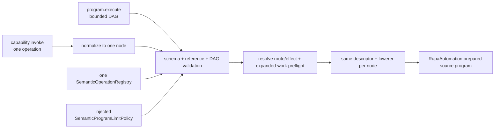
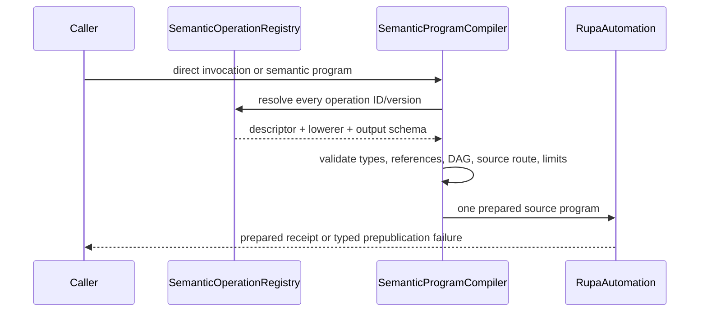

# RupaDomainFoundation Semantic Program Design

## Purpose and Scope

`RupaDomainFoundation` owns the generic registry, typed value/reference model,
bounded declarative program, and semantic compilation contracts used by domain
operations. It is a child of the [RupaKit package design](../../DESIGN.md) and
depends on `RupaCore`, `RupaCoreTypes`, `RupaAutomation`, and
`RupaCapabilities`.

CADAPI-D uses this generic foundation for both public CAD mutation forms. The
planned `RupaCADDomain` supplies concrete CAD operation descriptors and
lowerers; this module never embeds a CAD-specific switch. This document defines
the target contract. Existing `DomainCommandRequest` and
`DefaultDomainCommandPlanResolver` do not yet implement the complete bounded
program compiler described here.

Parent: [package design](../../DESIGN.md). Children: none.

## Responsibilities and Boundaries

This module owns:

- one versioned semantic operation registry shared by direct invocation and
  program nodes;
- recursive typed values, request-local symbols, typed existing-source
  references, typed local-output references, and bounded pure expressions;
- order-independent DAG validation, deterministic topological ordering,
  source-route/effect validation, whole-program preflight, and compilation to a
  domain-neutral `RupaAutomation` prepared source program;
- injectable limit policy and typed compilation failures;
- result declarations that map request-local outputs to server-generated typed
  references after publication.

It does not own concrete CAD operation vocabulary, Product/CAD/Mesh state,
persistent ID allocation, `EditorSession`, project coordinates, workspace
publication, package bytes, transport, CLI syntax, UI, or save behavior.

## Related Designs

| Design | Relationship | Contract Used | Summary | Cautions |
|---|---|---|---|---|
| [package design](../../DESIGN.md) | parent | package graph and planned `RupaCADDomain` boundary | Places generic semantic compilation above Automation and below adapters. | The planned CAD module is not implemented yet. |
| [RupaAutomation](../RupaAutomation/DESIGN.md) | depends on | binding-aware prepared source plan | Receives fully validated, source-only, deterministically ordered work. | Foundation must not expose Automation's raw graph representation as semantic input. |
| [RupaCore](../RupaCore/DESIGN.md) | depends on | stable ID kinds and neutral semantic values | Supplies identity kinds used for typed references. | Foundation does not allocate or persist those IDs. |
| [RupaAgentProtocol](../RupaAgentProtocol/DESIGN.md) | used by | two wire forms and typed result projection | Encodes direct invocation or a program without duplicating the operation schema. | Wire values are validated again here and are never authority. |
| [RupaAgentRuntime](../RupaAgentRuntime/DESIGN.md) | used by | exact-snapshot compiler invocation | Supplies the registered operation set and exact planning context. | Runtime must not add another command switch. |
| [domain extension architecture](../../../Rupa/DOMAIN_EXTENSION_ARCHITECTURE.md) | coordinates with | generic registry and concrete-domain composition | Keeps concrete domains above the universal foundation. | A domain operation must still use the universal project transaction boundary. |

## Architecture



The public model is structurally equivalent to the following target Swift
contracts. Names may be refined during source implementation, but ownership and
semantics must not change.

```swift
public struct SemanticOperationInvocation: Sendable, Equatable {
    public let operationID: DomainCapabilityID
    public let operationVersion: DomainCapabilityVersion
    public let arguments: [SemanticArgumentID: SemanticArgument]
}

public enum SemanticArgument: Sendable, Equatable {
    case literal(SemanticTypedValue)
    case parameter(ProgramParameterID)
    case existing(SemanticSourceReference)
    case local(ProgramOutputReference)
    case expression(BoundedScalarExpression)
}

public struct SemanticProgram: Sendable, Equatable {
    public let schemaVersion: SemanticProgramSchemaVersion
    public let parameters: [ProgramParameterID: SemanticTypedValue]
    public let nodes: [SemanticProgramNode]
    public let requestedOutputs: [ProgramOutputReference]
}

public struct SemanticProgramNode: Sendable, Equatable {
    public let symbol: ProgramNodeSymbol
    public let invocation: SemanticOperationInvocation
}

public struct ProgramOutputReference: Sendable, Equatable {
    public let node: ProgramNodeSymbol
    public let output: SemanticOutputID
    public let kind: SemanticReferenceKind
}
```

Expected project coordinates and `dryRun` belong once to the outer request
envelope. They are not copied into every node. A direct invocation carries the
same `SemanticOperationInvocation` but may not contain `.local` arguments.

## Contracts and Invariants

1. `capability.invoke` and `program.execute` resolve through the same operation
   registry, descriptor version, argument schema, lowerer, validation, limits,
   and result declaration. A second program-only CAD operation vocabulary is
   invalid.
2. Direct invocation is a one-operation ergonomic form. It is normalized
   internally to one program node and never requires the caller to construct a
   program, request-local symbol, persistent UUID, or presentation object.
3. A program is a finite declarative DAG. Node array order is not dependency
   authority; typed local references define edges and the compiler emits one
   deterministic topological order. Duplicate symbols, missing outputs, type
   mismatches, self-reference, and cycles fail before lowering.
4. Arguments may be typed literals, shared parameters, references to existing
   authoritative source objects, references to declared local outputs, or
   bounded pure scalar expressions. Arbitrary Swift/Python, callbacks, I/O,
   recursion, conditionals, and user-defined loops are not part of the model.
5. Repetition uses registered native finite-pattern operations. Request and
   compiled-node size remain proportional to distinct modeling intent, not the
   number of expanded occurrences, generated topology, presentation records,
   or persistent identifiers.
6. Every accepted node must resolve to route `.source` and aggregate effect
   `.sourceMutation`. Descriptor labels alone are insufficient: the fully
   resolved plan is checked. Read, workspace, export, artifact, lifecycle,
   external-job, and Mesh-edit effects cannot be mixed into a CAD source
   program.
7. The compiler validates the complete graph before any staged source command
   executes, then calls the registered lowerer exactly once per semantic node.
   It does not materialize a raw public feature graph.
8. Clients own intent, argument values, existing references, and request-local
   symbols. Rupa owns persistent ID allocation, dependency order, presentation
   structure/defaults, semantic validation, and lowering.
9. A successful committed result maps every requested `node.output` to a typed
   server-generated reference and carries the exact project/generation/
   transaction/publication/workspace coordinates plus expansion telemetry. A
   dry run reports validation and estimates but never claims persistent output
   references.
10. Operation and program schema versions are explicit. Unknown operation,
    unsupported version, or incompatible result kind fails without a
    compatibility guess or fallback to raw Automation input.
11. The current generic domain executor and raw Agent Automation routes are
    legacy implementation inventory. This design is not evidence that the
    compiler, bindings, or public cutover already exist.

## Runtime Flows



Project staging, evaluation, and publication occur above this flow through
`RupaKit` and `ProjectController`; compilation alone never changes state.

## State, Ownership, and Lifecycle

The registry is immutable and injected by product composition. Program values,
validation state, dependency graph, and compilation telemetry live for one
request. Local symbols are valid only inside that request. Existing source
references are coordinates to be revalidated by project authority, not retained
mutable objects. The compiler retains no workspace or project state.

## Failure, Concurrency, and Constraints

Compilation is deterministic for one registry snapshot, input, planning
snapshot, and limit policy. The limit policy owner supplies accepted bounds for
wire bytes, decoded values and nesting, nodes, edges, parameters, local output
references, expression depth/work, lowered commands, and expanded Feature,
Body, occurrence, pattern, and evaluation work. Concrete defaults are selected
from measured implementation fixtures and may not be relaxed to make a failing
program pass.

Failures are typed as unknown operation/version, invalid schema/value/unit,
duplicate or missing symbol/output, reference-kind mismatch, cycle, ineligible
route/effect, limit excess, stale planning coordinate, cancellation, or
lowering failure. No failure is converted to an empty program, raw graph
fallback, partial program, or retry through another access mode.

## Verification and Change Impact

The later implementation must provide:

| Invariant | Behavioral evidence |
|---|---|
| One vocabulary | The same registered descriptor/lowerer accepts a direct request and an equivalent one-node program with equivalent source result. |
| Simple operation | One primitive reaches publication in one direct invocation without program/UUID/presentation input. |
| Typed composition | Multi-step Feature, Scene, Component, Instance, and Pattern chains resolve local outputs and reject wrong kinds. |
| DAG semantics | Input order does not change deterministic result; duplicate/missing/cyclic graphs fail before mutation. |
| Source-only | A resolved workspace/read/export/lifecycle effect is rejected even when its descriptor claims mutation. |
| Bounded complexity | Oversized values, graph work, expressions, lowered commands, and expanded work fail at their owning preflight boundary. |
| Compact repetition | Changing a native pattern count does not change semantic-node or serialized-operation count. |

Changes to value kinds, references, graph edges, operation resolution, route
validation, or limits require rechecking the planned `RupaCADDomain`,
`RupaAutomation`, Agent Protocol/Runtime, RupaKit, and actual CLI behavior.
